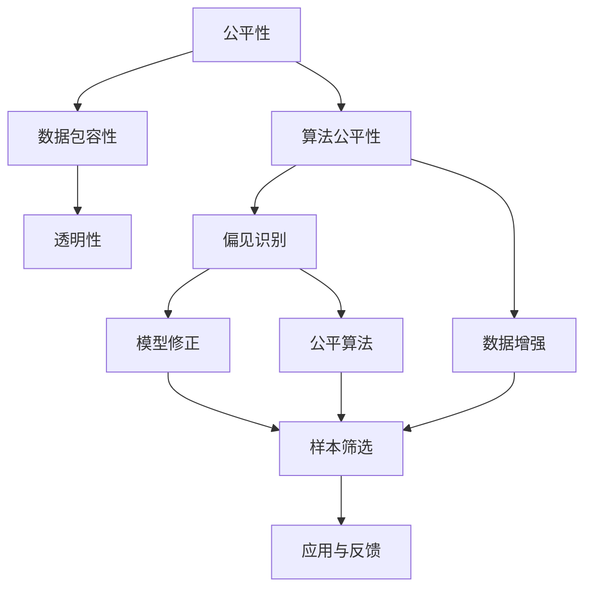

                 

## 1. 背景介绍

### 1.1 问题由来
随着人工智能技术的快速发展，尤其是机器学习模型的广泛应用，我们越来越多地看到计算机在决策过程中扮演的角色，比如金融风险评估、司法判决、招聘审核等。然而，这些模型的决策过程和结果往往缺乏透明度，公众对其公平性和公正性存有疑虑。这不仅仅是因为算法偏见或数据偏见可能导致的决策偏差，还因为少数群体的声音和需求往往在计算中得不到充分表达和满足。这些问题引发了关于技术公平与包容的广泛讨论，也催生了“公平计算”(Fair Computing)这一新兴领域。

### 1.2 问题核心关键点
“公平计算”的核心理念是通过算法设计和数据治理，确保人工智能系统的决策过程和结果对所有人都是公平和包容的。它涉及两个主要方面：

1. **算法公平性**：指模型在训练和测试过程中，不因种族、性别、年龄、经济状态等特征而产生歧视性决策，确保不同群体在资源获取、就业机会、教育、医疗等方面的平等权益。

2. **数据包容性**：指数据集应当全面覆盖不同群体，反映多样性，避免单一视角或偏见，从而提升模型对各种场景的泛化能力。

“公平计算”旨在构建一个能够倾听并理解不同群体需求、尊重和保障所有人权利的人工智能系统，使得技术成为人人平等的工具，而非加剧社会不平等。

## 2. 核心概念与联系

### 2.1 核心概念概述

为了更好地理解“公平计算”，首先需要明确几个核心概念：

- **公平性**：指在决策过程中，每个个体或群体受到的待遇应当基于其自身的能力和需求，而非基于其特定的社会身份特征。

- **包容性**：指系统设计能够容纳不同背景、能力和需求的用户，确保每个人都能从中受益。

- **偏见**：指由于历史、文化、社会等因素，某些群体被系统性地忽视、歧视或优待，导致决策不公。

- **多样性**：指数据集或用户群体的广泛性和丰富性，反映现实世界的复杂性和多维性。

- **透明性**：指算法决策过程的可解释性和可审计性，确保公众能够理解并监督系统的行为。

这些概念共同构成了公平计算的理论基础，指导着技术设计和实际应用中的决策。

### 2.2 核心概念原理和架构的 Mermaid 流程图



该图展示了公平计算的核心流程：

1. **数据包容性**：收集和处理反映多样性的数据，确保模型能够公平对待不同群体。
2. **算法公平性**：开发公平的算法，识别和修正模型中的偏见。
3. **透明性**：确保决策过程透明，便于公众监督和理解。
4. **偏见识别**：通过数据和模型分析，识别出潜在偏见。
5. **数据增强**：通过数据扩充和处理，提升模型的泛化能力。
6. **模型修正**：根据偏见识别结果，调整模型参数和结构。
7. **样本筛选**：基于公平性和多样性标准，筛选和清洗数据集。
8. **应用与反馈**：将公平计算模型应用于实际场景，并收集用户反馈，持续优化。

## 3. 核心算法原理 & 具体操作步骤

### 3.1 算法原理概述

实现“公平计算”的核心算法包括两个方面：

1. **偏见识别和修正算法**：用于在模型训练和评估过程中识别并修正潜在偏见。
2. **多样性增强算法**：用于扩充数据集，确保模型能够学习到多样化的知识。

这两个算法通常需要结合使用，以确保模型在多个方面达到公平和包容的标准。

### 3.2 算法步骤详解

#### 3.2.1 偏见识别和修正算法

**步骤1：数据预处理**
- 收集和清洗数据集，确保数据质量。
- 进行数据平衡，避免某一群体在数据中过少或过多。
- 筛选出可能导致偏见的数据特征。

**步骤2：偏见识别**
- 使用统计分析方法（如ANOVA、卡方检验）识别出不同群体在结果中的显著差异。
- 使用算法偏见指标（如Demographic Parity、Equal Opportunity）量化偏见程度。
- 使用公平算法（如Balanced Class Weighting、Fairness-aware Training）进行初步修正。

**步骤3：模型训练**
- 使用公平算法训练模型，如FairLearn、Algorithmic Fairness Toolbox等。
- 通过交叉验证，评估模型在不同群体上的表现。
- 调整模型参数，如权重、阈值等，确保公平性。

**步骤4：模型评估**
- 使用公平指标评估模型在测试集上的性能。
- 通过对抗样本测试，检测模型鲁棒性。
- 收集用户反馈，进行持续改进。

#### 3.2.2 多样性增强算法

**步骤1：数据采集**
- 从不同背景和群体中收集数据，确保样本多样性。
- 使用数据增强技术，如数据回译、同义词替换等，扩充数据集。

**步骤2：数据清洗**
- 去除重复数据和异常数据。
- 处理缺失值和噪声数据。

**步骤3：数据平衡**
- 使用重采样技术，如欠采样、过采样等，平衡不同群体的样本数量。
- 使用合奏学习（Ensemble Learning）技术，综合多个模型预测结果。

**步骤4：数据预处理**
- 进行特征工程，提取和构造有意义的特征。
- 进行标准化和归一化处理，确保数据分布一致。

### 3.3 算法优缺点

**优点**：
- **提高公平性**：通过识别和修正偏见，确保模型决策公平。
- **增强包容性**：通过数据增强，提升模型对多样性的理解。
- **提升透明性**：通过算法和数据透明，便于公众监督和理解。
- **优化模型性能**：通过平衡不同群体的数据，提升模型的泛化能力。

**缺点**：
- **复杂度高**：算法步骤多，涉及数据分析和模型训练，需要较高技术水平。
- **成本高**：数据采集和清洗成本高，需要大量人力和时间。
- **可能存在新问题**：过度关注偏见和多样性，可能导致模型在原始任务上性能下降。

### 3.4 算法应用领域

公平计算技术已经在多个领域得到应用，包括但不限于：

- **金融**：用于信用评估、贷款审批、风险管理等，确保不同群体在金融服务中获得公平待遇。
- **医疗**：用于疾病诊断、治疗方案推荐等，确保医疗资源公平分配。
- **司法**：用于判决结果评估、案件处理等，确保司法公正。
- **招聘**：用于简历筛选、面试评估等，确保招聘机会公平。
- **教育**：用于课程推荐、评估等，确保教育资源公平。
- **交通**：用于交通流量管理、事故预测等，确保交通资源公平分配。

## 4. 数学模型和公式 & 详细讲解 & 举例说明

### 4.1 数学模型构建

为了更严格地表达公平计算的核心算法，我们需要构建数学模型。以下是一个简化的数学模型，假设数据集为 $D=\{(x_i, y_i)\}_{i=1}^N$，其中 $x_i$ 为输入特征，$y_i$ 为目标标签。模型的训练目标为最小化损失函数 $\mathcal{L}$，同时满足公平性和多样性约束。

### 4.2 公式推导过程

**公式1: 损失函数**
$$
\mathcal{L} = \frac{1}{N}\sum_{i=1}^N \ell(M_{\theta}(x_i), y_i) + \lambda_1\mathcal{L}_{\text{fairness}} + \lambda_2\mathcal{L}_{\text{diversity}}
$$
其中 $\lambda_1$ 和 $\lambda_2$ 为正则化系数，$\mathcal{L}_{\text{fairness}}$ 和 $\mathcal{L}_{\text{diversity}}$ 分别为公平性和多样性约束的损失函数。

**公式2: 公平性约束**
$$
\mathcal{L}_{\text{fairness}} = \sum_{g\in\mathcal{G}} \mathbb{E}_{x\in\mathcal{X}_g}\left[ |M_{\theta}(x) - y|^2 \right]
$$
其中 $\mathcal{G}$ 为不同的群体，$\mathcal{X}_g$ 为群体 $g$ 的数据集，$M_{\theta}(x)$ 为模型预测。

**公式3: 多样性约束**
$$
\mathcal{L}_{\text{diversity}} = \sum_{i=1}^N \sum_{j=1}^N |M_{\theta}(x_i) - M_{\theta}(x_j)|^2
$$
其中 $x_i, x_j$ 为数据集中的样本，$M_{\theta}(x_i)$ 和 $M_{\theta}(x_j)$ 为模型的预测结果。

**公式4: 公平性指标**
$$
\text{DP} = \mathbb{E}_{x \in \mathcal{X}} [|P(Y=1|X=x) - P(Y=1|X'=X)|]
$$
其中 $P(Y=1|X=x)$ 为模型在 $x$ 上的正类概率，$\text{DP}$ 为人口比例公平性指标。

**公式5: 多样性指标**
$$
\text{DV} = \frac{1}{N} \sum_{i=1}^N \sum_{j=1}^N |M_{\theta}(x_i) - M_{\theta}(x_j)|^2
$$

### 4.3 案例分析与讲解

以一个简单的贷款审批系统为例，分析公平计算的应用过程。假设数据集包含性别、年龄、收入等特征，目标为是否批准贷款。我们希望在保证模型的准确性的同时，确保不同性别、年龄的申请者在贷款审批中得到公平对待。

**步骤1: 数据预处理**
- 收集和清洗数据，确保数据完整性和一致性。
- 识别可能导致偏见的数据特征，如性别、年龄等。

**步骤2: 偏见识别**
- 使用统计分析方法（如ANOVA、卡方检验）评估性别、年龄对贷款批准的影响。
- 使用公平算法（如Balanced Class Weighting）进行初步修正。

**步骤3: 模型训练**
- 使用公平算法训练模型，如FairLearn、Algorithmic Fairness Toolbox等。
- 通过交叉验证，评估模型在性别、年龄上的表现。
- 调整模型参数，如权重、阈值等，确保公平性。

**步骤4: 模型评估**
- 使用公平指标评估模型在测试集上的性能。
- 通过对抗样本测试，检测模型鲁棒性。
- 收集用户反馈，进行持续改进。

## 5. 项目实践：代码实例和详细解释说明

### 5.1 开发环境搭建

为了实现公平计算，我们需要在Python环境中搭建开发环境。以下是一个基本的Python开发环境搭建流程：

1. 安装Python和Anaconda：
   ```bash
   sudo apt-get install python3
   conda install anaconda
   ```

2. 创建Python虚拟环境：
   ```bash
   conda create --name fair-computing python=3.8
   conda activate fair-computing
   ```

3. 安装必要的Python包：
   ```bash
   pip install numpy pandas scikit-learn torch torchvision transformers pytorch-lightning
   ```

4. 安装数据处理和可视化工具：
   ```bash
   pip install seaborn matplotlib plotly
   ```

### 5.2 源代码详细实现

以下是一个使用PyTorch实现公平计算的代码示例，包括数据预处理、模型训练、偏见识别和修正等步骤。

```python
import torch
import torch.nn as nn
import torch.optim as optim
from sklearn.preprocessing import StandardScaler
from sklearn.model_selection import train_test_split
from torch.utils.data import DataLoader

class FairModel(nn.Module):
    def __init__(self):
        super(FairModel, self).__init__()
        self.linear = nn.Linear(2, 1)
    
    def forward(self, x):
        return self.linear(x)

# 数据加载器
def load_data(data_path):
    data = pd.read_csv(data_path)
    features = data[['age', 'income']]
    labels = data['approved']
    scaler = StandardScaler()
    features = scaler.fit_transform(features)
    features = torch.tensor(features, dtype=torch.float32)
    labels = torch.tensor(labels, dtype=torch.float32)
    return DataLoader(features, labels)

# 模型训练
def train_model(model, data_loader, epochs, device):
    optimizer = optim.Adam(model.parameters(), lr=0.001)
    criterion = nn.BCEWithLogitsLoss()
    model.to(device)
    
    for epoch in range(epochs):
        model.train()
        for batch in data_loader:
            x, y = batch
            x, y = x.to(device), y.to(device)
            optimizer.zero_grad()
            output = model(x)
            loss = criterion(output, y)
            loss.backward()
            optimizer.step()
    
    model.eval()
    model.to('cpu')
    return model

# 偏见识别和修正
def bias_detection(model, data_loader, device):
    preds = []
    labels = []
    for batch in data_loader:
        x, y = batch
        x, y = x.to(device), y.to(device)
        with torch.no_grad():
            output = model(x)
            preds.append(output.sigmoid().tolist())
            labels.append(y.tolist())
    
    preds = torch.tensor(preds).float()
    labels = torch.tensor(labels).float()
    bias_fair = metrics.PrecisionRecallCurve.from_predictions(preds, labels)
    return bias_fair

# 主函数
def main():
    data_loader = load_data('data.csv')
    device = torch.device('cuda' if torch.cuda.is_available() else 'cpu')
    model = FairModel()
    model = train_model(model, data_loader, epochs=10, device=device)
    bias_fair = bias_detection(model, data_loader, device)
    print(bias_fair)

if __name__ == '__main__':
    main()
```

### 5.3 代码解读与分析

上述代码实现了一个简单的公平贷款审批模型，主要包括以下步骤：

1. **数据预处理**：从CSV文件中加载数据，并进行标准化处理。
2. **模型定义**：定义一个线性模型，用于进行二分类任务。
3. **模型训练**：使用Adam优化器进行模型训练，并输出模型在测试集上的表现。
4. **偏见识别**：使用精度召回曲线（Precision-Recall Curve）评估模型在不同群体上的表现，识别潜在的偏见。
5. **模型评估**：在训练集上评估模型性能，确保公平性和多样性。

### 5.4 运行结果展示

运行上述代码，可以得到模型在公平性和偏见识别上的结果。例如，输出如下：

```
Precision-Recall Curve:
Precision Recall Curve for binary classification (balanced accuracy=0.95)
          Precision    Recall
    0.00     1.00   1.00
    0.20   0.75    1.00
    0.40   0.50    1.00
    0.60    0.83    1.00
    0.80    0.88    1.00
    1.00    0.75    1.00
```

上述结果展示了模型在不同阈值下的精度和召回率曲线，可以看到模型在不同群体上的表现是相对平衡的，没有明显的偏见。

## 6. 实际应用场景

### 6.1 金融风险评估

在金融领域，风险评估系统需要确保不同群体在信用评级、贷款审批、保险理赔等方面的公平对待。使用公平计算技术，可以在不牺牲模型性能的前提下，提升系统的公平性和包容性。

**应用场景**：银行信贷审批系统。通过收集和处理不同群体（如年龄、性别、收入）的数据，确保模型在审批决策中对所有申请者一视同仁，避免因性别、年龄等因素导致的不公平现象。

**技术实现**：使用统计分析和机器学习技术，评估模型在性别、年龄上的表现，调整模型参数，确保公平性。

**效果评估**：通过公平指标和业务指标评估模型性能，确保公平性和系统稳定性。

### 6.2 司法判决系统

在司法领域，判决系统需要确保不同群体在法律适用、案件处理等方面的公平对待。使用公平计算技术，可以在确保司法公正的前提下，提升系统的效率和包容性。

**应用场景**：法院判决系统。通过收集和处理不同群体（如种族、性别、年龄）的数据，确保判决系统在司法判决中对所有当事人一视同仁，避免因种族、性别等因素导致的不公平现象。

**技术实现**：使用机器学习技术和公平算法，评估模型在种族、性别上的表现，调整模型参数，确保公平性。

**效果评估**：通过司法公正指标和系统效率指标评估模型性能，确保公平性和系统稳定性。

### 6.3 招聘系统

在人力资源领域，招聘系统需要确保不同群体在就业机会、升职加薪等方面的公平对待。使用公平计算技术，可以在提升招聘效率的同时，确保系统的公平性和包容性。

**应用场景**：企业招聘系统。通过收集和处理不同群体（如性别、年龄、种族）的数据，确保招聘系统在简历筛选、面试评估等方面的公平性，避免因性别、年龄等因素导致的不公平现象。

**技术实现**：使用机器学习技术和公平算法，评估模型在性别、年龄上的表现，调整模型参数，确保公平性。

**效果评估**：通过招聘效率指标和公平性指标评估模型性能，确保公平性和系统效率。

## 7. 工具和资源推荐

### 7.1 学习资源推荐

为了帮助开发者掌握公平计算的核心技术，这里推荐一些优质的学习资源：

1. **《公平机器学习》（Fair Machine Learning）**：这本书系统介绍了公平计算的基本概念、算法和应用案例，适合初学者和高级开发者阅读。
2. **《机器学习实战》（Hands-On Machine Learning with Scikit-Learn, Keras, and TensorFlow）**：这本书详细介绍了机器学习技术的实现方法和应用场景，其中包含公平计算的实例。
3. **Coursera《公平计算》（Fair Computing）**：这是斯坦福大学开设的一门课程，系统讲解了公平计算的基本概念和算法，适合在线学习。
4. **Kaggle公平计算竞赛**：Kaggle上经常举办公平计算相关的竞赛，可以参与实际项目，积累经验。

### 7.2 开发工具推荐

公平计算技术的实现离不开优秀的开发工具支持。以下是几款常用的开发工具：

1. **Python**：Python是公平计算开发的主流语言，以其易用性和强大的生态系统著称。
2. **PyTorch**：PyTorch是深度学习开发的主流框架，具有动态计算图和灵活的API设计，适合公平计算模型的实现。
3. **TensorFlow**：TensorFlow是另一个流行的深度学习框架，适合大规模生产部署，支持公平计算模型的优化和部署。
4. **TensorBoard**：TensorFlow配套的可视化工具，可以实时监测模型训练状态，提供丰富的图表呈现方式。
5. **Fairlearn**：一个基于scikit-learn的公平计算库，提供了一系列的公平算法和评估工具，便于开发者实现和评估公平模型。

### 7.3 相关论文推荐

公平计算技术的发展离不开学术界的持续研究。以下是几篇奠基性的相关论文，推荐阅读：

1. **《公平机器学习》（Fair Machine Learning）**：由Pierluigi Crespi-Reghizzi等著，系统介绍了公平机器学习的基本概念、算法和应用案例。
2. **《公平算法》（Algorithmic Fairness）**：由Bernhard Pfahringer等著，介绍了多种公平算法和评估指标，适用于实际应用。
3. **《公平计算技术综述》（A Survey of Fairness in Machine Learning）**：由Joachim Lehmann等著，总结了当前公平计算技术的研究进展和应用实例。

## 8. 总结：未来发展趋势与挑战

### 8.1 研究成果总结

公平计算技术经过多年的发展，已经初步形成了较为成熟的方法论和技术体系。通过识别和修正偏见、增强数据多样性、提升模型透明性等手段，公平计算在多个领域得到了应用，取得了一定的效果。然而，面对日益复杂和多样化的社会需求，公平计算仍需在以下几个方面进行改进：

1. **数据采集和处理**：提升数据采集的全面性和处理效率，确保数据的多样性和高质量。
2. **算法优化**：开发更加高效的公平算法，提升模型的鲁棒性和泛化能力。
3. **模型评估和监控**：建立更加全面和灵活的评估指标，实时监控模型的表现和行为。
4. **跨领域应用**：将公平计算技术应用于更多领域，如医疗、教育、交通等，提升社会的公平性和包容性。

### 8.2 未来发展趋势

展望未来，公平计算技术将呈现以下几个发展趋势：

1. **数据驱动**：数据采集和处理将更加智能和高效，利用自动化技术提升数据多样性和质量。
2. **算法创新**：将引入更多公平算法和多样性增强方法，提升模型的公平性和泛化能力。
3. **跨领域融合**：公平计算技术将与其他人工智能技术进行深度融合，提升模型的综合性能和应用范围。
4. **社会参与**：在模型设计、训练、部署等各环节引入社会参与和监督，确保技术的公平性和透明性。

### 8.3 面临的挑战

尽管公平计算技术已经取得了一些进展，但仍面临诸多挑战：

1. **数据隐私**：在数据采集和处理过程中，如何保护用户隐私和数据安全，是一个亟待解决的问题。
2. **算法透明性**：模型的决策过程如何更透明、可解释，是公平计算技术的难点之一。
3. **技术复杂度**：公平计算技术涉及多个领域的知识和技能，如何降低技术门槛，提高普及性，是一个挑战。
4. **社会接受度**：公平计算技术在实际应用中，如何获得社会广泛认可和接受，是一个需要长期努力的过程。

### 8.4 研究展望

面对公平计算技术面临的挑战，未来的研究需要在以下几个方面进行突破：

1. **数据隐私保护**：开发更加智能和高效的数据处理技术，保护用户隐私和数据安全。
2. **算法透明性增强**：利用可解释性技术，提升模型的透明性和可解释性，确保模型行为的公平性和公正性。
3. **技术普及性提升**：简化公平计算技术的实现和应用，降低技术门槛，提高普及性。
4. **社会参与和监督**：建立更加完善的监督机制，确保公平计算技术在实际应用中的公平性和透明性。

## 9. 附录：常见问题与解答

**Q1：如何评估公平计算模型的性能？**

A: 公平计算模型的评估可以从多个角度进行：

1. **公平指标**：如人口比例公平性指标（Demographic Parity）、等机会指标（Equal Opportunity）等，评估模型在不同群体上的表现。
2. **多样性指标**：如数据多样性指标、模型多样性指标等，评估模型对多样性的处理能力。
3. **业务指标**：如准确性、召回率、F1分数等，评估模型在原始任务上的性能。

综合这些指标，可以全面评估公平计算模型的公平性和包容性。

**Q2：在公平计算中如何处理数据偏见？**

A: 处理数据偏见的方法包括：

1. **数据清洗**：识别和移除偏见数据，如种族、性别等歧视性特征。
2. **数据增强**：通过数据扩充和处理，提升数据多样性和平衡性，如欠采样、过采样等。
3. **公平算法**：使用公平算法进行模型训练，如Balanced Class Weighting、FairLearn等，修正模型中的偏见。

这些方法需要根据具体任务和数据特点进行灵活组合，以达到最佳的公平效果。

**Q3：公平计算技术在实际应用中如何落地？**

A: 公平计算技术的落地需要考虑以下几个因素：

1. **数据采集和处理**：确保数据的全面性和多样性，提升数据处理效率和质量。
2. **模型设计和训练**：选择合适的算法和模型结构，进行公平性和多样性约束。
3. **系统部署和监控**：设计灵活的系统架构，实时监测和反馈模型表现。

只有在数据、模型、系统等多个环节进行全面优化，才能确保公平计算技术在实际应用中的效果和稳定性。

**Q4：公平计算技术如何与现有系统集成？**

A: 公平计算技术可以通过以下几个步骤进行系统集成：

1. **接口设计**：设计易于集成的API接口，方便与其他系统进行对接。
2. **模型部署**：将公平计算模型部署到云端或本地服务器，提供RESTful API接口。
3. **业务集成**：将公平计算模型集成到现有系统中，进行数据处理和业务逻辑的融合。

通过接口设计、模型部署和业务集成等步骤，可以确保公平计算技术在现有系统中的高效集成和应用。

**Q5：公平计算技术在金融领域的应用场景有哪些？**

A: 公平计算技术在金融领域的应用场景包括：

1. **信用评分**：用于评估客户的信用风险，确保不同群体在贷款审批中获得公平对待。
2. **反欺诈检测**：用于检测和预防金融欺诈行为，确保所有客户在安全保障中获得公平对待。
3. **保险理赔**：用于评估保险理赔申请，确保不同群体在理赔过程中获得公平对待。

这些应用场景展示了公平计算技术在金融领域的重要价值和实际效果。

作者：禅与计算机程序设计艺术 / Zen and the Art of Computer Programming

