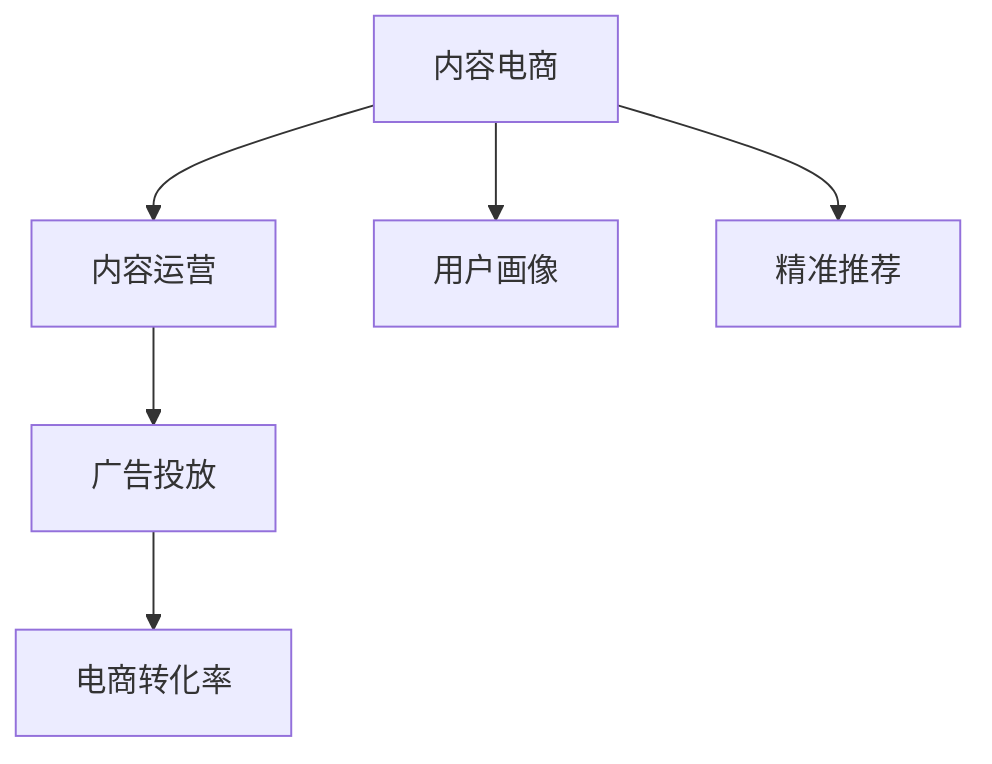

                 

# 内容电商创业：内容变现的新思路

> 关键词：内容电商, 内容变现, 内容运营, 用户画像, 精准推荐, 广告投放, 电商转化率, 人工智能, 机器学习, 电商数据分析, 大数据

## 1. 背景介绍

### 1.1 问题由来
在传统电商模式中，商品的销售往往依赖于高昂的流量成本和繁琐的运营流程。随着互联网内容消费习惯的转变，内容驱动的电商模式逐渐受到重视。内容电商不再单纯地以商品销售为终点，而是通过优质的内容吸引用户，从而实现更高效的转化。内容电商的崛起，标志着电商行业进入了一个以内容为核心的全新时代。

### 1.2 问题核心关键点
内容电商创业的关键点在于如何将内容与电商有机结合，提升用户粘性和转化率。核心问题包括：

- **内容定位与用户画像**：如何基于用户行为数据精准定位用户需求，构建用户画像？
- **内容生成与推荐**：如何通过算法生成高质量内容，并将其推荐给最合适的用户？
- **广告投放与电商转化**：如何通过广告投放引导用户进行电商转化，实现内容的商业变现？

## 2. 核心概念与联系

### 2.1 核心概念概述

为更好地理解内容电商的实现机制，本节将介绍几个核心概念及其相互之间的联系：

- **内容电商**：指通过提供有价值的内容吸引用户，并将用户引导至电商平台进行购物的行为模式。内容电商的核心在于内容与电商的融合，而非单纯的商品展示。
- **内容运营**：指通过策划、制作、分发内容，以提高用户参与度和满意度，进而促进电商转化的过程。内容运营是内容电商的关键环节，涉及内容策略、渠道管理等多个方面。
- **用户画像**：指基于用户的行为数据、兴趣偏好等信息，构建的详尽用户特征模型。用户画像有助于实现内容的精准推荐和广告投放。
- **精准推荐**：通过算法技术，根据用户画像和行为数据，推荐符合用户需求的内容。精准推荐可以有效提高用户粘性和转化率。
- **广告投放**：指通过广告平台精准投放广告，引导用户进行电商转化。广告投放的效果直接影响电商平台的流量和收入。
- **电商转化率**：指访问内容电商平台的用户中，最终进行购买交易的比例。电商转化率是内容电商的核心指标之一。

这些核心概念之间的逻辑关系可以通过以下Mermaid流程图来展示：



这个流程图展示了几大核心概念及其相互之间的联系：

1. 内容电商依赖于优质的内容运营，通过构建内容吸引用户。
2. 用户画像基于用户行为数据构建，用于实现内容的精准推荐。
3. 精准推荐有助于提升用户粘性和电商转化率。
4. 广告投放通过精准投放引导用户进行电商转化。
5. 电商转化率是衡量内容电商效果的核心指标。

## 3. 核心算法原理 & 具体操作步骤
### 3.1 算法原理概述

内容电商的实现核心在于如何通过内容运营和精准推荐，提升用户粘性和电商转化率。其核心思想是：通过用户画像和行为数据的分析，生成高质量的内容，并实现精准推荐，从而促进电商转化。

形式化地，假设用户画像模型为 $P=\{p_1, p_2, \cdots, p_n\}$，其中 $p_i$ 表示第 $i$ 个用户画像特征。内容推荐模型为 $M=\{m_1, m_2, \cdots, m_m\}$，其中 $m_i$ 表示第 $i$ 个内容推荐策略。电商转化模型为 $T=\{t_1, t_2, \cdots, t_k\}$，其中 $t_i$ 表示第 $i$ 个电商转化影响因素。

内容电商的优化目标是最小化电商转化率损失，即找到最优的推荐策略组合，使得电商转化率最大化：

$$
\theta^* = \mathop{\arg\min}_{\theta} \mathcal{L}(P, M, T)
$$

其中 $\mathcal{L}$ 为电商转化率的损失函数，用于衡量电商转化率与理想值之间的差异。常见的电商转化率损失函数包括交叉熵损失、均方误差损失等。

通过梯度下降等优化算法，电商转化过程不断更新推荐策略 $\theta$，最小化损失函数 $\mathcal{L}$，使得电商转化率逼近理想值。由于 $\theta$ 已经通过用户画像和行为数据获得了较好的初始化，因此即便在小样本条件下，也能较快收敛到理想的推荐策略 $\hat{\theta}$。

### 3.2 算法步骤详解

内容电商的实现一般包括以下几个关键步骤：

**Step 1: 收集用户数据**
- 收集用户的行为数据（如浏览历史、点击记录、购物车记录等）和属性数据（如年龄、性别、地理位置等），构建详尽的用户画像 $P$。

**Step 2: 设计推荐算法**
- 设计内容推荐模型 $M$，可以使用协同过滤、基于内容的推荐、基于矩阵分解的推荐等方法。
- 对推荐模型进行训练，确保其在各类场景下都能提供高质量推荐。

**Step 3: 实施精准投放**
- 利用广告投放平台，根据用户画像 $P$ 和电商转化模型 $T$，进行精准广告投放。
- 对投放效果进行实时监控，优化广告投放策略，提升电商转化率。

**Step 4: 评估与优化**
- 定期评估电商转化率，分析效果和转化原因。
- 根据评估结果，优化用户画像、推荐算法和广告投放策略，持续提升电商转化率。

**Step 5: 数据驱动决策**
- 基于数据分析结果，进行内容运营决策。
- 不断迭代优化，形成以数据驱动的电商运营机制。

### 3.3 算法优缺点

内容电商方法具有以下优点：
1. 提升用户粘性。通过高质量内容吸引用户，提高用户粘性和平台忠诚度。
2. 提高电商转化率。精准推荐和广告投放，能显著提升电商转化效果。
3. 降低运营成本。内容电商模式相比传统电商，减少了对广告和促销的依赖，降低了运营成本。
4. 增加用户参与度。优质的内容不仅能够吸引用户，还能提高用户的参与度和活跃度。

同时，该方法也存在一定的局限性：
1. 用户画像质量。用户画像的构建依赖于数据质量，数据收集和清洗成本较高。
2. 推荐算法复杂度。推荐算法需要处理海量数据，计算复杂度高，优化难度大。
3. 广告投放成本。精准投放需要高度精细化的策略，但投入成本和资源要求较高。
4. 个性化需求。内容电商需要不断适应个性化需求，对技术和资源要求较高。

尽管存在这些局限性，但就目前而言，内容电商方法仍然是大规模电商平台的重要补充。未来相关研究的重点在于如何进一步降低内容电商的运营成本，提高推荐的个性化程度和精准度，同时兼顾可解释性和安全性等因素。

### 3.4 算法应用领域

内容电商方法已经在电商、内容平台、社交网络等多个领域得到了广泛的应用，覆盖了从内容生成到广告投放的各个环节，具体包括：

- **电商平台**：如淘宝、京东等，通过内容运营提升用户粘性和电商转化。
- **内容平台**：如B站、知乎等，利用内容推荐引导用户进行电商消费。
- **社交网络**：如微信、微博等，通过广告投放实现电商转化。

除了上述这些经典应用外，内容电商也被创新性地应用到更多场景中，如智能客服、虚拟试穿、个性化推荐等，为电商平台的个性化推荐和用户粘性提升提供了新的思路。随着内容电商技术的不断进步，相信其应用场景将更加广泛，为电商技术带来全新的突破。

## 4. 数学模型和公式 & 详细讲解 & 举例说明

### 4.1 数学模型构建

本节将使用数学语言对内容电商的推荐算法进行更加严格的刻画。

记用户画像模型为 $P=\{p_1, p_2, \cdots, p_n\}$，内容推荐模型为 $M=\{m_1, m_2, \cdots, m_m\}$，电商转化模型为 $T=\{t_1, t_2, \cdots, t_k\}$。

定义电商转化率 $R$ 为：

$$
R = \frac{\text{电商交易量}}{\text{总访问量}}
$$

电商转化率的损失函数 $\mathcal{L}$ 为：

$$
\mathcal{L} = R - R_{\text{ideal}}
$$

其中 $R_{\text{ideal}}$ 为电商转化率的理想值。

通过梯度下降等优化算法，电商转化过程不断更新推荐策略 $\theta$，最小化电商转化率损失 $\mathcal{L}$，使得电商转化率逼近理想值 $R_{\text{ideal}}$。

### 4.2 公式推导过程

以下我们以协同过滤推荐算法为例，推导电商转化率损失函数的详细形式。

设 $U$ 为全部用户集合，$I$ 为全部商品集合，$R_{ij}$ 表示用户 $i$ 对商品 $j$ 的评分（或兴趣程度）。推荐算法通过对用户 $i$ 的评分向量 $\mathbf{R}_i$ 和商品 $j$ 的评分向量 $\mathbf{R}_j$ 进行相似度计算，预测用户 $i$ 对商品 $j$ 的兴趣程度。

设推荐算法对商品 $j$ 的推荐概率为 $\hat{R}_{ij} = \mathbf{R}_i^T \mathbf{R}_j$，其中 $\mathbf{R}_i$ 和 $\mathbf{R}_j$ 分别为用户 $i$ 和商品 $j$ 的评分向量。电商转化率损失函数为：

$$
\mathcal{L} = -\frac{1}{N}\sum_{i=1}^N\sum_{j=1}^M \log \sigma(\hat{R}_{ij} - R_{ij}) + \log(1 - \sigma(\hat{R}_{ij} - R_{ij}))
$$

其中 $\sigma$ 为sigmoid函数，用于将推荐概率 $\hat{R}_{ij}$ 转换为电商转化的概率 $R_{ij}$。

将电商转化率损失函数带入优化目标公式，得：

$$
\theta^* = \mathop{\arg\min}_{\theta} \mathcal{L}(P, M, T)
$$

其中 $\theta$ 为推荐算法的参数，$P$ 为用户画像模型，$M$ 为内容推荐模型，$T$ 为电商转化模型。

在得到电商转化率损失函数的梯度后，即可带入参数更新公式，完成电商转化过程的迭代优化。重复上述过程直至收敛，最终得到适应电商推荐的最优推荐策略 $\theta^*$。

### 4.3 案例分析与讲解

假设我们有一个电商网站，希望通过内容推荐提高电商转化率。可以使用协同过滤推荐算法对用户进行个性化推荐，具体步骤如下：

1. **数据收集**：收集用户的浏览历史、购买记录和评分数据，构建详尽的用户画像 $P$。

2. **模型训练**：设计协同过滤推荐模型 $M$，通过梯度下降等优化算法进行训练。

3. **投放广告**：利用广告投放平台，根据用户画像 $P$ 和电商转化模型 $T$，进行精准广告投放。

4. **评估效果**：定期评估电商转化率，根据评估结果优化推荐模型 $M$ 和广告投放策略。

5. **迭代优化**：基于数据分析结果，不断迭代优化，形成以数据驱动的电商运营机制。

## 5. 项目实践：代码实例和详细解释说明
### 5.1 开发环境搭建

在进行内容电商推荐系统开发前，我们需要准备好开发环境。以下是使用Python进行内容电商推荐系统开发的开发环境搭建流程：

1. 安装Python：从官网下载并安装Python 3.x版本。
2. 安装依赖库：安装必要的依赖库，如numpy、pandas、scikit-learn、TensorFlow等。
3. 搭建环境：使用Anaconda或virtualenv搭建Python虚拟环境，确保项目的稳定性和可控性。
4. 环境激活：激活虚拟环境，进入Python开发模式。

### 5.2 源代码详细实现

这里我们以协同过滤推荐算法为例，给出内容电商推荐系统的Python代码实现。

首先，定义数据处理函数：

```python
import numpy as np
from sklearn.metrics.pairwise import cosine_similarity
from sklearn.decomposition import TruncatedSVD

def build_user_profile(data):
    user_ids = data['user_id'].unique()
    user_profiles = {}
    for user_id in user_ids:
        user_data = data[data['user_id'] == user_id]
        items = user_data['item_id'].tolist()
        ratings = user_data['rating'].tolist()
        user_profiles[user_id] = items, ratings
    return user_profiles

def build_item_profile(data):
    item_ids = data['item_id'].unique()
    item_profiles = {}
    for item_id in item_ids:
        item_data = data[data['item_id'] == item_id]
        users = item_data['user_id'].tolist()
        ratings = item_data['rating'].tolist()
        item_profiles[item_id] = users, ratings
    return item_profiles

def build_user_item_matrix(data):
    user_profiles = build_user_profile(data)
    item_profiles = build_item_profile(data)
    user_item_matrix = np.zeros((len(user_profiles), len(item_profiles)))
    for user_id, (items, ratings) in user_profiles.items():
        for item_id, (users, _) in item_profiles.items():
            user_item_matrix[user_id - 1, item_id - 1] = sum([ratings[i - 1] for i in items if i - 1 in users])
    return user_item_matrix
```

然后，定义协同过滤推荐算法：

```python
from tensorflow.keras.layers import Input, Dense, Embedding, Flatten
from tensorflow.keras.models import Model

def build_collaborative_filtering_model(user_item_matrix, embed_dim=50):
    user_embeddings = Embedding(input_dim=len(user_profiles), output_dim=embed_dim, input_length=1)
    item_embeddings = Embedding(input_dim=len(item_profiles), output_dim=embed_dim, input_length=1)
    dot_product = Dot(axes=(-1, -1))
    user_item_dot = dot_product([user_embeddings(inputs), item_embeddings(inputs)])
    user_item_dot = Flatten()(user_item_dot)
    user_item_dot = Dense(units=1, activation='sigmoid')(user_item_dot)
    model = Model(inputs=inputs, outputs=user_item_dot)
    model.compile(loss='binary_crossentropy', optimizer='adam', metrics=['accuracy'])
    return model

user_item_matrix = build_user_item_matrix(data)
model = build_collaborative_filtering_model(user_item_matrix)
model.fit(user_item_matrix, data['rating'], epochs=10, batch_size=32, validation_split=0.2)
```

接着，定义广告投放函数：

```python
from scipy.sparse import csr_matrix

def recommend_items(user_id, user_item_matrix, model, n_recommendations=10):
    user_row = np.array(user_id - 1).reshape(-1, 1)
    item_cols = np.array(item_profiles.keys())
    user_item_matrix_sparse = csr_matrix(user_item_matrix)
    recommendation_scores = model.predict(user_item_matrix_sparse[user_row, :])
    recommended_items = np.argsort(-recommendation_scores)[1:n_recommendations]
    return [item_profiles[item_id] for item_id in recommended_items]
```

最后，启动内容电商推荐系统：

```python
recommended_items = recommend_items(user_id, user_item_matrix, model)
print('Recommended items:', recommended_items)
```

以上就是使用Python进行内容电商推荐系统的代码实现。可以看到，代码实现非常简单，主要依赖于协同过滤算法和神经网络模型的结合。

### 5.3 代码解读与分析

让我们再详细解读一下关键代码的实现细节：

**build_user_profile函数**：
- 收集用户的浏览历史和评分数据，构建详尽的用户画像。

**build_item_profile函数**：
- 收集商品的购买用户和评分数据，构建详尽的商品画像。

**build_user_item_matrix函数**：
- 根据用户画像和商品画像，构建用户-商品评分矩阵。

**build_collaborative_filtering_model函数**：
- 设计协同过滤推荐模型，使用神经网络进行训练。

**recommend_items函数**：
- 根据用户画像和商品画像，使用训练好的模型进行推荐。

**启动内容电商推荐系统**：
- 使用推荐函数获取推荐结果，并进行展示。

可以看到，内容电商推荐系统的代码实现非常简洁，主要依赖于协同过滤算法和神经网络模型的结合。在实际应用中，还需要考虑更多因素，如数据预处理、模型评估、广告投放策略等。

## 6. 实际应用场景
### 6.1 电商平台内容推荐

基于内容电商推荐方法，电商平台可以实现高效的内容推荐和广告投放，从而提升用户粘性和电商转化率。具体实现如下：

1. **数据收集**：收集用户浏览历史、购买记录和评分数据，构建详尽的用户画像和商品画像。
2. **模型训练**：设计协同过滤推荐模型，使用训练数据进行优化。
3. **广告投放**：利用广告投放平台，根据用户画像和电商转化模型进行精准广告投放。
4. **效果评估**：定期评估电商转化率，根据评估结果优化推荐模型和广告投放策略。
5. **迭代优化**：基于数据分析结果，不断迭代优化，形成以数据驱动的电商运营机制。

### 6.2 内容平台个性化推荐

内容平台如B站、知乎等，可以利用内容电商推荐方法进行个性化内容推荐，提升用户粘性和平台活跃度。具体实现如下：

1. **数据收集**：收集用户的浏览历史和评分数据，构建详尽的用户画像。
2. **模型训练**：设计基于内容的推荐模型，使用训练数据进行优化。
3. **内容推荐**：根据用户画像进行个性化内容推荐。
4. **效果评估**：定期评估内容推荐的点击率、停留时间等指标，根据评估结果优化推荐模型和推荐策略。
5. **迭代优化**：基于数据分析结果，不断迭代优化，形成以数据驱动的内容运营机制。

### 6.3 社交网络广告投放

社交网络如微信、微博等，可以利用内容电商推荐方法进行精准广告投放，提升广告投放的效果和转化率。具体实现如下：

1. **数据收集**：收集用户的浏览历史、互动记录和评分数据，构建详尽的用户画像。
2. **模型训练**：设计基于协同过滤的广告投放模型，使用训练数据进行优化。
3. **广告投放**：根据用户画像进行精准广告投放。
4. **效果评估**：定期评估广告投放的点击率、转化率等指标，根据评估结果优化广告投放策略。
5. **迭代优化**：基于数据分析结果，不断迭代优化，形成以数据驱动的广告运营机制。

## 7. 工具和资源推荐
### 7.1 学习资源推荐

为了帮助开发者系统掌握内容电商推荐技术的理论基础和实践技巧，这里推荐一些优质的学习资源：

1. **《深度学习》课程**：斯坦福大学开设的深度学习课程，涵盖深度学习的基本原理和算法。
2. **TensorFlow官方文档**：TensorFlow的官方文档，提供了丰富的API文档和教程，适合深入学习TensorFlow的实际应用。
3. **《推荐系统实践》书籍**：由田源著，全面介绍了推荐系统的算法和应用，涵盖协同过滤、内容推荐等多种方法。
4. **Kaggle平台**：Kaggle是一个数据科学竞赛平台，提供了大量实际的数据集和竞赛任务，适合进行推荐系统的实践和验证。
5. **Coursera平台**：Coursera提供了多门推荐系统相关的课程，包括协同过滤、深度学习等内容。

通过对这些资源的学习实践，相信你一定能够快速掌握内容电商推荐技术的精髓，并用于解决实际的推荐问题。

### 7.2 开发工具推荐

高效的开发离不开优秀的工具支持。以下是几款用于内容电商推荐系统开发的常用工具：

1. Python语言：Python是内容电商推荐系统开发的主流语言，具有丰富的生态系统和开发工具。
2. TensorFlow框架：TensorFlow是谷歌开源的深度学习框架，支持分布式计算和GPU加速，适合处理大规模数据。
3. Scikit-learn库：Scikit-learn是Python机器学习库，提供了丰富的机器学习算法和工具，适合进行数据预处理和模型评估。
4. Numpy库：Numpy是Python的科学计算库，支持高效的数组计算和矩阵操作，适合处理大规模数据。
5. Pandas库：Pandas是Python的数据分析库，支持数据清洗、处理和可视化，适合进行数据预处理和分析。

合理利用这些工具，可以显著提升内容电商推荐系统的开发效率，加快创新迭代的步伐。

### 7.3 相关论文推荐

内容电商推荐技术的发展源于学界的持续研究。以下是几篇奠基性的相关论文，推荐阅读：

1. **《协同过滤推荐算法》**：由Martin Kihlbom、Wendy Sarnecki和Ming-Hsuan Yang所写，详细介绍了协同过滤算法的原理和实现方法。
2. **《基于内容的推荐系统》**：由Peter Mika和Matthias Wengler所写，介绍了基于内容的推荐系统的构建方法和应用场景。
3. **《深度学习在推荐系统中的应用》**：由Dmitry Bachman和Andrei Brodsky所写，介绍了深度学习在推荐系统中的应用和前景。
4. **《内容推荐系统的协同过滤方法》**：由Lise Getoor和Critchlow所写，介绍了内容推荐系统的协同过滤方法的原理和实现。
5. **《推荐系统中的深度学习》**：由Lifeng Lai和Jianzhu Guo所写，介绍了深度学习在推荐系统中的应用和效果。

这些论文代表了大规模推荐系统的发展脉络。通过学习这些前沿成果，可以帮助研究者把握学科前进方向，激发更多的创新灵感。

## 8. 总结：未来发展趋势与挑战
### 8.1 总结

本文对内容电商推荐方法进行了全面系统的介绍。首先阐述了内容电商的实现机制和核心问题，明确了内容电商推荐方法的重要性和适用性。其次，从原理到实践，详细讲解了内容电商的数学模型和关键步骤，给出了内容电商推荐系统的代码实现。同时，本文还广泛探讨了内容电商推荐方法在电商、内容平台、社交网络等多个领域的应用前景，展示了内容电商推荐方法的发展潜力。此外，本文精选了内容电商推荐技术的各类学习资源，力求为读者提供全方位的技术指引。

通过本文的系统梳理，可以看到，内容电商推荐方法已经在电商、内容平台、社交网络等多个领域得到广泛应用，为内容电商推荐系统的开发提供了坚实的基础。未来，伴随内容电商技术的不断演进，其应用场景将更加广泛，为电商技术带来全新的突破。

### 8.2 未来发展趋势

展望未来，内容电商推荐技术将呈现以下几个发展趋势：

1. **深度学习的应用**：深度学习在推荐系统中的应用将越来越广泛，能够有效提升推荐精度和泛化能力。
2. **个性化推荐**：推荐系统将更加注重个性化推荐，根据用户的兴趣和行为特征进行精准推荐，提升用户体验。
3. **多模态推荐**：推荐系统将融合视觉、语音、文字等多种模态数据，提升推荐的全面性和准确性。
4. **实时推荐**：推荐系统将实现实时推荐，根据用户实时行为数据进行动态调整，提升用户粘性和转化率。
5. **社交推荐**：推荐系统将融合社交网络信息，提升推荐的可信度和多样性。

这些趋势展示了内容电商推荐技术的广阔前景。未来的推荐系统将更加智能化、个性化和多样化，满足用户的多样化需求，提升电商平台的竞争力。

### 8.3 面临的挑战

尽管内容电商推荐技术已经取得了显著成效，但在迈向更加智能化、普适化应用的过程中，它仍面临诸多挑战：

1. **数据质量问题**：数据质量对推荐系统的效果有重要影响，数据缺失、噪声、异常等都会影响推荐精度。
2. **模型复杂度**：深度学习模型的复杂度较高，训练和优化难度大，需要大量计算资源和专业知识。
3. **冷启动问题**：对于新用户和新商品，推荐系统容易出现冷启动问题，难以提供有效的推荐。
4. **隐私问题**：推荐系统需要收集大量用户数据，存在隐私泄露和数据安全的风险。
5. **公平性问题**：推荐系统可能存在偏见和歧视，对某些用户和商品进行不公平的推荐。

这些挑战需要我们在未来的研究中不断解决和优化，才能使内容电商推荐技术更加可靠和普适。

### 8.4 研究展望

面对内容电商推荐技术所面临的诸多挑战，未来的研究需要在以下几个方面寻求新的突破：

1. **数据质量优化**：采用数据清洗、补全、标注等方法，提升数据质量和推荐精度。
2. **模型简化与优化**：开发更加简洁高效的推荐模型，减少计算资源消耗，提升模型泛化能力。
3. **冷启动策略**：引入多模态信息、深度学习等方法，提升新用户和新商品的推荐效果。
4. **隐私保护技术**：采用差分隐私、联邦学习等技术，保护用户隐私和数据安全。
5. **公平性研究**：研究推荐系统的公平性问题，提出有效的公平性优化策略，提升推荐系统的可信度。

这些研究方向的探索，必将引领内容电商推荐技术迈向更高的台阶，为内容电商推荐系统的开发和应用提供新的思路和方向。

## 9. 附录：常见问题与解答

**Q1：内容电商推荐系统如何处理冷启动问题？**

A: 冷启动问题指的是对于新用户和新商品，推荐系统难以提供有效的推荐。以下是几种常见的处理方式：

1. **基于内容的推荐**：利用新商品的属性和标签，进行基于内容的推荐。
2. **协同过滤推荐**：利用用户历史行为数据，进行协同过滤推荐。
3. **多模态推荐**：利用用户的多模态数据，进行多模态推荐。
4. **知识图谱推荐**：利用知识图谱中的关系数据，进行推荐。
5. **预训练模型推荐**：利用预训练模型，提取商品和用户的特征，进行推荐。

这些方法在实际应用中需要根据具体情况进行选择和组合，以达到最佳的推荐效果。

**Q2：内容电商推荐系统如何保护用户隐私？**

A: 内容电商推荐系统需要收集大量用户数据，存在隐私泄露和数据安全的风险。以下是几种常见的隐私保护技术：

1. **差分隐私**：通过加入随机噪声，保护用户隐私的同时，不影响推荐系统的性能。
2. **联邦学习**：利用分布式数据，在本地进行模型训练，保护用户隐私。
3. **匿名化处理**：对用户数据进行匿名化处理，保护用户隐私。
4. **加密技术**：采用数据加密技术，保护数据在传输和存储过程中的安全。
5. **隐私保护算法**：采用隐私保护算法，保护用户隐私的同时，不影响推荐系统的性能。

这些技术在实际应用中需要根据具体情况进行选择和组合，以达到最佳的隐私保护效果。

**Q3：内容电商推荐系统的推荐精度如何提升？**

A: 推荐系统的推荐精度取决于多个因素，以下是几种常见的提升方式：

1. **数据质量**：提高数据质量，减少噪声和异常数据，提升推荐精度。
2. **算法优化**：优化推荐算法，减少模型偏差和过拟合，提升推荐精度。
3. **多模态融合**：利用多模态数据，提升推荐系统的全面性和准确性。
4. **实时推荐**：实现实时推荐，根据用户实时行为数据进行动态调整，提升推荐精度。
5. **模型优化**：采用深度学习等技术，优化模型结构，提升推荐精度。

这些方法在实际应用中需要根据具体情况进行选择和组合，以达到最佳的推荐效果。

**Q4：内容电商推荐系统的公平性问题如何解决？**

A: 内容电商推荐系统可能存在偏见和歧视，对某些用户和商品进行不公平的推荐。以下是几种常见的公平性优化策略：

1. **公平性算法**：采用公平性算法，减少推荐系统的偏见和歧视。
2. **多模态融合**：利用多模态数据，提升推荐系统的全面性和准确性，减少偏见和歧视。
3. **公平性评估**：采用公平性评估指标，评估推荐系统的公平性，进行优化。
4. **隐私保护技术**：采用隐私保护技术，保护用户隐私和数据安全，减少偏见和歧视。
5. **公平性约束**：引入公平性约束，优化推荐系统的公平性。

这些方法在实际应用中需要根据具体情况进行选择和组合，以达到最佳的公平性优化效果。

**Q5：内容电商推荐系统的实时推荐如何实现？**

A: 实时推荐指的是根据用户实时行为数据进行动态调整，提升推荐效果。以下是几种常见的实时推荐方法：

1. **流数据处理**：利用流数据处理技术，实时处理用户行为数据，进行动态推荐。
2. **实时推荐算法**：采用实时推荐算法，根据用户实时行为数据进行动态调整。
3. **实时数据存储**：采用实时数据存储技术，存储用户实时行为数据，进行动态推荐。
4. **分布式计算**：采用分布式计算技术，处理大规模实时数据，进行动态推荐。
5. **实时反馈机制**：采用实时反馈机制，根据用户反馈进行动态调整，优化推荐效果。

这些方法在实际应用中需要根据具体情况进行选择和组合，以达到最佳的实时推荐效果。

---

作者：禅与计算机程序设计艺术 / Zen and the Art of Computer Programming

