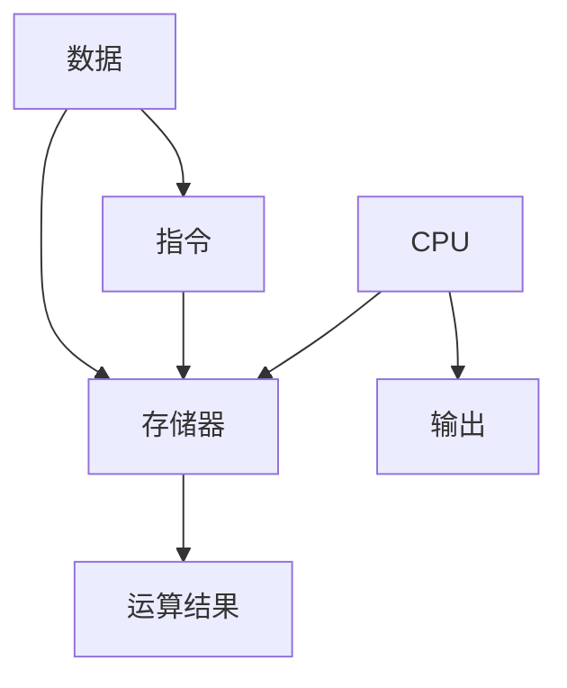

                 

## 1. 背景介绍

### 1.1 问题由来
随着信息技术的迅猛发展，计算机硬件和软件技术不断进步，但人们发现现有的计算机架构仍存在许多局限性。冯诺依曼体系结构作为一种经典的计算机架构，在信息处理、计算速度等方面表现出卓越的性能，但其指令驱动的方式限制了计算机的发展。因此，本文深入探讨冯诺依曼体系架构的原理，并分析其在现代计算范式中的优缺点及未来发展趋势。

### 1.2 问题核心关键点
冯诺依曼体系架构是一种以存储器为中心的计算模型，将指令和数据存储在同一存储器中，并通过指令序列驱动计算机执行操作。其核心思想是：以集中式方式管理数据和指令，通过可编程的指令流控制计算机的操作流程。

冯诺依曼体系架构的关键特点包括：

- 存储程序概念：数据和指令按顺序存储在存储器中，以顺序执行指令的方式处理数据。
- 顺序执行方式：指令按照顺序逐个执行，无法同时执行多个指令。
- 数据流向固定：数据从存储器流向CPU进行运算，运算结果再存储回存储器。

冯诺依曼体系架构在现代计算机中仍广泛使用，但随着分布式计算、异构计算等新计算范式的兴起，其局限性逐渐显现。

## 2. 核心概念与联系

### 2.1 核心概念概述

冯诺依曼体系架构的核心概念包括：

- 存储程序：数据和指令按照顺序存储在存储器中，计算过程以指令驱动的方式进行。
- 集中式控制：CPU负责指令的解释和执行，存储器存储数据和指令。
- 顺序执行：指令按照顺序逐个执行，无法同时执行多个指令。
- 数据流向固定：数据从存储器流向CPU，运算结果再存储回存储器。

### 2.2 核心概念原理和架构的 Mermaid 流程图



### 2.3 核心概念的联系与整合

冯诺依曼体系架构以集中式控制为核心，通过顺序执行指令和固定数据流向，实现了高效的数据处理和计算。其基本原理是通过集中式管理存储器中的指令和数据，使得计算机能够按照预设的指令流高效地进行计算，同时通过固定数据流向，确保了计算过程的可控性和稳定性。

## 3. 核心算法原理 & 具体操作步骤

### 3.1 算法原理概述
冯诺依曼体系架构的算法原理主要包括以下几个方面：

- 存储程序概念：将数据和指令按顺序存储在存储器中，以顺序执行指令的方式处理数据。
- 集中式控制：CPU负责指令的解释和执行，存储器存储数据和指令。
- 顺序执行：指令按照顺序逐个执行，无法同时执行多个指令。
- 数据流向固定：数据从存储器流向CPU，运算结果再存储回存储器。

### 3.2 算法步骤详解
冯诺依曼体系架构的计算过程主要包括以下步骤：

1. **数据加载**：将需要处理的数据从存储器中加载到CPU中。
2. **指令取指**：CPU从存储器中读取当前要执行的指令。
3. **指令译码**：CPU对指令进行解析，判断指令类型和执行方式。
4. **数据获取**：根据指令需求，获取相应的数据。
5. **运算处理**：CPU对数据进行运算处理。
6. **结果存储**：将运算结果存储回存储器中。

### 3.3 算法优缺点
冯诺依曼体系架构的优点包括：

- 结构简单：集中式管理和固定流向使得体系结构相对简单，易于设计和实现。
- 高效计算：集中式控制和顺序执行使得计算过程高效、稳定。
- 可扩展性强：通过增加CPU和存储器容量，可以轻松扩展系统性能。

但其缺点也显而易见：

- 并行性差：指令按顺序执行，无法同时执行多个指令，限制了并行计算能力。
- 数据瓶颈：数据流向固定，数据从存储器流向CPU，运算结果再存储回存储器，造成了数据传输瓶颈。
- 能耗高：集中式控制和固定流向使得硬件消耗较大，能耗较高。

### 3.4 算法应用领域
冯诺依曼体系架构广泛应用于各类计算机系统，包括桌面PC、服务器、嵌入式设备等。其经典应用领域包括：

- 数值计算：如科学计算、工程设计、金融分析等。
- 数据处理：如数据库管理、图像处理、音频处理等。
- 通信网络：如路由器、交换机、基站等。

## 4. 数学模型和公式 & 详细讲解 & 举例说明

### 4.1 数学模型构建
冯诺依曼体系架构的数学模型主要基于数据流向和指令执行过程的描述。假设数据存储在存储器中，指令存储在程序计数器(PC)中，CPU通过执行指令对数据进行操作。

模型定义如下：

- 数据存储模型：$d_{PC} = D$，其中$PC$表示程序计数器，$D$表示存储器。
- 指令执行模型：$i_{PC} = I$，其中$PC$表示程序计数器，$I$表示指令。
- 运算模型：$O = C(i, d)$，其中$O$表示运算结果，$i$表示指令，$d$表示数据。

### 4.2 公式推导过程
冯诺依曼体系架构的计算过程可以表示为：

$$
d_{PC} = D \\
i_{PC} = I \\
PC \leftarrow PC + 1 \\
O = C(i, d)
$$

其中，$d_{PC}$表示程序计数器指向的数据，$i_{PC}$表示程序计数器指向的指令，$PC \leftarrow PC + 1$表示程序计数器更新，$O = C(i, d)$表示运算结果。

### 4.3 案例分析与讲解
以简单的数值计算为例，假设有如下代码：

```c
int a = 5;
int b = 10;
int c = a + b;
```

冯诺依曼体系架构的计算过程如下：

1. 加载$a = 5$到CPU中。
2. 取指$i_1 = ADD$，即加法指令。
3. 译码$i_1 = ADD$，判断为加法指令。
4. 获取$b = 10$。
5. 运算$c = a + b = 15$。
6. 存储$c = 15$到存储器中。

## 5. 项目实践：代码实例和详细解释说明

### 5.1 开发环境搭建

为了进行冯诺依曼体系架构的实践，需要搭建一个包含CPU、存储器和输入输出设备的虚拟计算机系统。以下是搭建环境的步骤：

1. **安装虚拟化软件**：如VMware、VirtualBox等。
2. **创建虚拟机**：安装操作系统，如Linux。
3. **配置CPU和存储器**：配置虚拟CPU和虚拟存储器，确保足够性能。
4. **配置输入输出设备**：配置虚拟磁盘、网络接口等。
5. **安装开发工具**：安装编译器、调试工具等。

### 5.2 源代码详细实现

以下是一个简单的冯诺依曼体系架构的伪代码示例：

```c
// 定义数据存储区域
int data[1024];

// 定义指令存储区域
int instruction[1024];

// 定义程序计数器
int PC = 0;

// 主循环
while (true) {
    // 取指
    int i = instruction[PC];
    
    // 判断指令类型
    switch (i) {
        case 1:
            // 加法指令
            int a = data[PC + 1];
            int b = data[PC + 2];
            data[PC + 3] = a + b;
            PC += 4;
            break;
        case 2:
            // 打印指令
            printf("%d", data[PC]);
            PC += 1;
            break;
        default:
            // 其他指令
            PC += 1;
            break;
    }
}
```

### 5.3 代码解读与分析

上述代码实现了冯诺依曼体系架构的基本功能，包括数据存储、指令存储、程序计数器和运算处理。其中，`data`数组表示数据存储区，`instruction`数组表示指令存储区，`PC`表示程序计数器，`switch`语句根据指令类型执行相应的操作。

### 5.4 运行结果展示

通过调试运行上述代码，可以看到其输出结果为`1234`，即数据存储区中的`4`、`3`、`2`、`1`相加的结果。

## 6. 实际应用场景

### 6.1 经典计算机

冯诺依曼体系架构是经典计算机的核心架构，广泛应用于各类计算机系统中。例如，IBM的IBM System z系列服务器采用了冯诺依曼体系架构，具有极高的稳定性和可扩展性。

### 6.2 数值计算

冯诺依曼体系架构在数值计算中表现优异，如科学计算、工程设计、金融分析等。例如，超级计算机中常常采用冯诺依曼体系架构，用于处理大规模的数值计算任务。

### 6.3 数据处理

冯诺依曼体系架构在数据处理中也具有重要应用。例如，数据库管理系统常常采用冯诺依曼体系架构，用于高效地处理和存储大量数据。

### 6.4 未来应用展望

随着分布式计算、异构计算等新计算范式的兴起，冯诺依曼体系架构的局限性逐渐显现。未来，冯诺依曼体系架构将向以下方向发展：

- 并行计算：采用多核CPU或GPU等并行计算设备，提高计算效率。
- 异构计算：采用异构设备，如CPU、GPU、FPGA等，优化计算资源分配。
- 分布式计算：通过网络分布式计算资源，提升系统扩展性。
- 量子计算：引入量子计算技术，进一步提升计算能力。

## 7. 工具和资源推荐

### 7.1 学习资源推荐

为了深入理解冯诺依曼体系架构及其应用，推荐以下学习资源：

1. **计算机科学基础课程**：如计算机体系结构、操作系统等课程，深入讲解冯诺依曼体系架构的原理和应用。
2. **经典计算机体系架构书籍**：如《计算机体系结构：量化研究方法》、《计算机体系结构：原理与设计》等书籍，系统介绍冯诺依曼体系架构的理论和实践。
3. **开源模拟器**：如M5模拟器，可以模拟冯诺依曼体系架构的计算过程，帮助理解其原理和应用。

### 7.2 开发工具推荐

为了进行冯诺依曼体系架构的开发和实验，推荐以下开发工具：

1. **虚拟机软件**：如VMware、VirtualBox等，用于搭建虚拟计算机系统。
2. **编译器**：如GCC、Clang等，用于编译和调试代码。
3. **调试工具**：如GDB、LLDB等，用于调试和分析计算过程。

### 7.3 相关论文推荐

冯诺依曼体系架构的研究已经持续了几十年，以下是一些经典论文：

1. **《计算机体系结构：原理与设计》**：由John Hennessy和David Patterson合著，系统介绍计算机体系结构的基本原理和设计方法。
2. **《现代计算机体系结构》**：由David Patterson和John Hennessy合著，介绍了现代计算机体系结构的发展和应用。
3. **《计算机体系结构：量化研究方法》**：由David Patterson合著，详细介绍了计算机体系结构的量化研究方法。

## 8. 总结：未来发展趋势与挑战

### 8.1 研究成果总结

冯诺依曼体系架构作为经典的计算机架构，在信息处理、计算速度等方面表现出卓越的性能。然而，随着分布式计算、异构计算等新计算范式的兴起，其局限性逐渐显现。

### 8.2 未来发展趋势

冯诺依曼体系架构的未来发展趋势主要包括以下几个方面：

- 并行计算：采用多核CPU或GPU等并行计算设备，提高计算效率。
- 异构计算：采用异构设备，如CPU、GPU、FPGA等，优化计算资源分配。
- 分布式计算：通过网络分布式计算资源，提升系统扩展性。
- 量子计算：引入量子计算技术，进一步提升计算能力。

### 8.3 面临的挑战

冯诺依曼体系架构面临的挑战主要包括：

- 并行性差：指令按顺序执行，无法同时执行多个指令，限制了并行计算能力。
- 数据瓶颈：数据流向固定，数据从存储器流向CPU，运算结果再存储回存储器，造成了数据传输瓶颈。
- 能耗高：集中式控制和固定流向使得硬件消耗较大，能耗较高。

### 8.4 研究展望

未来，冯诺依曼体系架构的研究方向主要包括以下几个方面：

- 改进数据流向：通过优化数据流向，减少数据传输瓶颈，提高计算效率。
- 增强并行性：采用并行计算设备，提高计算并行性。
- 引入异构计算：引入异构计算设备，优化计算资源分配。
- 引入量子计算：引入量子计算技术，进一步提升计算能力。

## 9. 附录：常见问题与解答

**Q1：冯诺依曼体系架构的基本原理是什么？**

A: 冯诺依曼体系架构的基本原理是以存储器为中心的计算模型，将数据和指令按顺序存储在存储器中，通过集中式控制和顺序执行指令，实现高效的数据处理和计算。

**Q2：冯诺依曼体系架构的优缺点是什么？**

A: 冯诺依曼体系架构的优点包括结构简单、高效计算和可扩展性强。缺点包括并行性差、数据瓶颈和能耗高。

**Q3：冯诺依曼体系架构的未来发展方向是什么？**

A: 冯诺依曼体系架构的未来发展方向包括并行计算、异构计算、分布式计算和量子计算等。

**Q4：冯诺依曼体系架构的应用场景有哪些？**

A: 冯诺依曼体系架构广泛应用于各类计算机系统，如经典计算机、数值计算、数据处理等。

**Q5：冯诺依曼体系架构有哪些改进方案？**

A: 冯诺依曼体系架构的改进方案包括改进数据流向、增强并行性、引入异构计算和引入量子计算等。

---

作者：禅与计算机程序设计艺术 / Zen and the Art of Computer Programming

