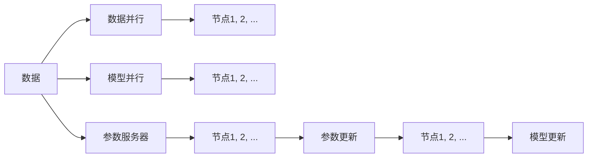

                 

# 分布式训练：软件2.0的工业化之路

## 1. 背景介绍

随着深度学习和大数据技术的飞速发展，现代软件开发逐渐从传统的单体应用演进到分布式系统。分布式系统强调多台计算资源的协作与共享，以应对大规模、高并发、高性能等复杂场景需求。在软件2.0时代，分布式训练（Distributed Training）成为了训练复杂模型的重要手段，极大地提升了模型训练效率和精度。本文将详细介绍分布式训练的原理、实践方法和应用场景，展望未来发展趋势，希望能为软件开发人员提供有价值的参考。

## 2. 核心概念与联系

### 2.1 核心概念概述

分布式训练（Distributed Training）是利用多台计算资源的并行计算能力，加速深度学习模型的训练过程。核心概念包括：

- **分布式训练**：通过将模型参数分布在多台计算节点上进行并行训练，从而加快模型训练速度。
- **参数服务器（Parameter Server）**：负责存储和分发模型参数，将模型的权重分布到多个节点上进行计算，通过异步更新模型参数，提高训练效率。
- **模型并行（Model Parallelism）**：将模型的不同层分布到不同的计算节点上进行训练，每层模型独立更新。
- **数据并行（Data Parallelism）**：将同一批次的训练数据分配给不同的计算节点，每个节点对局部数据进行计算，并将结果汇总。
- **异步训练（Asynchronous Training）**：不同的计算节点可以独立地更新模型参数，避免因等待某些节点完成训练而导致整体训练速度下降。

这些概念之间的关系可以用以下 Mermaid 流程图表示：



## 3. 核心算法原理 & 具体操作步骤

### 3.1 算法原理概述

分布式训练通过并行化训练过程，加速模型参数的优化。其核心思想是：将数据和模型参数分别分配到多个计算节点上进行计算，通过参数服务器协调各节点的计算和更新，从而实现高效的模型训练。

假设模型参数为 $\theta$，每个计算节点上训练的局部参数为 $\theta_i$，参数服务器上存储的模型参数为 $\theta_s$。训练过程大致分为以下几个步骤：

1. 数据并行：将训练数据 $D$ 分成 $N$ 个批次，每个批次分配给不同的计算节点 $i$。
2. 模型并行：将模型分成 $K$ 个模块，每个计算节点 $i$ 负责训练模型的一个模块。
3. 参数更新：每个计算节点 $i$ 根据当前模型参数 $\theta_i$ 和本地数据 $D_i$ 进行前向传播和反向传播，更新局部参数 $\theta_i$。
4. 参数同步：计算节点将更新后的局部参数 $\theta_i$ 发送给参数服务器，参数服务器将 $\theta_i$ 汇总，并更新全局参数 $\theta_s$。
5. 模型更新：将更新后的全局参数 $\theta_s$ 分发到所有计算节点，更新模型的局部参数 $\theta_i$。

通过这样的迭代过程，计算节点交替进行模型计算和参数更新，参数服务器负责协调，从而实现了高效的分布式训练。

### 3.2 算法步骤详解

以 TensorFlow 的分布式训练为例，以下是详细的算法步骤：

1. **数据准备**：将训练数据 $D$ 分批次存储在分布式文件系统中，如 Google Cloud Storage 或 HDFS 等。
2. **节点配置**：定义分布式训练的计算节点数 $N$ 和每个节点的计算资源，包括 CPU、GPU 和内存等。
3. **参数初始化**：在每个计算节点上初始化模型参数 $\theta_i$，并指定参数服务器的位置和通信协议。
4. **数据分配**：通过 TensorFlow 的 `tf.data.Distribute.Strategy` 将训练数据 $D$ 分配到不同的计算节点上，每个节点处理一个或多个批次数据。
5. **模型并行**：通过 `tf.distribute.Strategy.run` 方法在每个计算节点上运行模型的前向传播和反向传播操作。
6. **参数更新**：计算节点根据本地数据 $D_i$ 和模型输出计算梯度，并通过参数服务器更新全局参数 $\theta_s$。
7. **模型更新**：将全局参数 $\theta_s$ 分发到所有计算节点，更新模型的局部参数 $\theta_i$。

### 3.3 算法优缺点

分布式训练的优势包括：

- **高效性**：通过并行计算加速模型训练过程，显著提高训练速度。
- **可扩展性**：可以根据计算资源需求动态调整计算节点数量，适应不同规模的训练任务。
- **容错性**：单个计算节点故障不会影响整个训练过程，提高系统的稳定性和可靠性。

缺点包括：

- **通信开销**：数据和参数的传输会增加额外的通信开销。
- **异步更新难度**：不同节点更新模型参数的顺序和速度不一致，可能导致数据不一致问题。
- **系统复杂性**：分布式训练需要复杂的系统设计和维护，如参数服务器、网络通信等。

### 3.4 算法应用领域

分布式训练广泛应用于深度学习模型的训练过程中，尤其在以下领域：

- **计算机视觉**：如图像分类、目标检测、图像分割等任务。通过并行训练可以大幅提升模型的准确率和速度。
- **自然语言处理**：如语言模型、文本分类、机器翻译等任务。分布式训练可以处理大规模语料，提高模型的泛化能力。
- **语音识别**：如语音命令识别、语音合成等任务。分布式训练可以处理高维音频数据，提高模型的训练效率。
- **推荐系统**：如协同过滤、基于深度学习的推荐等任务。分布式训练可以处理海量用户行为数据，提高推荐精度。
- **医疗健康**：如医学影像分析、个性化医疗等任务。分布式训练可以处理复杂且多样化的医疗数据，提高诊断和治疗效果。

## 4. 数学模型和公式 & 详细讲解 & 举例说明

### 4.1 数学模型构建

以 TensorFlow 为例，假设模型参数为 $\theta$，训练数据为 $(x_i, y_i)$，损失函数为 $\mathcal{L}(\theta)$。分布式训练的优化目标为：

$$
\min_{\theta} \frac{1}{N} \sum_{i=1}^N \mathcal{L}(\theta_i, x_i, y_i)
$$

其中 $\theta_i$ 表示计算节点 $i$ 的局部模型参数。

### 4.2 公式推导过程

分布式训练的优化算法包括 SGD、Adam 等。以 SGD 为例，推导局部参数的更新公式：

$$
\theta_i \leftarrow \theta_i - \eta \nabla_{\theta_i} \mathcal{L}(\theta_i, x_i, y_i)
$$

其中 $\eta$ 为学习率。在参数服务器将 $\theta_i$ 更新为 $\theta_s$ 后，通过梯度聚合操作，计算全局参数的更新：

$$
\theta_s \leftarrow \theta_s - \eta \nabla_{\theta_s} \mathcal{L}(\theta_s)
$$

### 4.3 案例分析与讲解

以深度学习模型训练为例，假设在两个计算节点上进行分布式训练。每个节点处理一个批次数据，分别计算梯度并更新局部参数，参数服务器汇总并更新全局参数。具体步骤如下：

1. 节点1计算梯度 $\nabla_{\theta_1} \mathcal{L}(\theta_1, x_1, y_1)$ 并更新 $\theta_1$。
2. 节点2计算梯度 $\nabla_{\theta_2} \mathcal{L}(\theta_2, x_2, y_2)$ 并更新 $\theta_2$。
3. 参数服务器将 $\theta_1$ 和 $\theta_2$ 汇总，计算梯度 $\nabla_{\theta_s} \mathcal{L}(\theta_s)$ 并更新 $\theta_s$。
4. 节点1和节点2分别将 $\theta_s$ 分发到本地，更新 $\theta_1$ 和 $\theta_2$。

通过这样的迭代过程，每个节点交替进行模型计算和参数更新，参数服务器负责协调，从而实现了高效的分布式训练。

## 5. 项目实践：代码实例和详细解释说明

### 5.1 开发环境搭建

为了进行分布式训练实践，我们需要搭建相应的开发环境。以下是使用 Python 和 TensorFlow 进行分布式训练的开发环境配置流程：

1. 安装 Python：从官网下载并安装 Python 3.6+，保证与 TensorFlow 兼容。
2. 安装 TensorFlow：使用以下命令安装 TensorFlow：
   ```
   pip install tensorflow
   ```
3. 安装分布式工具：使用以下命令安装 TensorFlow 的分布式工具：
   ```
   pip install tensorflow-distribute
   ```

### 5.2 源代码详细实现

以下是一个简单的分布式训练代码实现，使用 TensorFlow 的分布式工具：

```python
import tensorflow as tf

# 定义模型参数
model = tf.keras.Sequential([
    tf.keras.layers.Dense(64, activation='relu', input_shape=(784,)),
    tf.keras.layers.Dense(10, activation='softmax')
])

# 定义分布式策略
strategy = tf.distribute.MirroredStrategy()

with strategy.scope():
    # 定义分布式优化器
    optimizer = tf.keras.optimizers.SGD(learning_rate=0.01)
    # 定义损失函数
    loss_fn = tf.keras.losses.SparseCategoricalCrossentropy()

    # 在每个节点上训练模型
    @tf.function
    def train_step(iterator):
        with tf.GradientTape() as tape:
            for batch in iterator:
                x, y = batch
                with strategy.scope():
                    logits = model(x, training=True)
                    loss = loss_fn(y, logits)
                    grads = tape.gradient(loss, model.trainable_variables)
        optimizer.apply_gradients(zip(grads, model.trainable_variables))

# 定义数据集
(x_train, y_train), (x_test, y_test) = tf.keras.datasets.mnist.load_data()
x_train = x_train / 255.0
x_test = x_test / 255.0

# 将数据集分批并分配到不同节点
train_dataset = tf.data.Dataset.from_tensor_slices((x_train, y_train))
train_dataset = train_dataset.shuffle(10000).batch(1024).repeat()
train_dataset = train_dataset.strategy.scope().distribute()

# 进行分布式训练
for epoch in range(10):
    train_step(train_dataset)
```

### 5.3 代码解读与分析

让我们再详细解读一下关键代码的实现细节：

**MirroredStrategy**：
- 定义了分布式策略，通过在每个计算节点上复制模型的所有层，实现模型并行。
- 支持分布式数据并行和梯度聚合，简化了分布式训练的代码实现。

**train_step** 函数：
- 定义了分布式训练的单个迭代步骤。
- 在每个节点上计算损失函数和梯度，使用 `tape.gradient` 获取梯度，并使用 `optimizer.apply_gradients` 更新模型参数。
- 使用 `@tf.function` 装饰器编译训练函数，利用分布式策略自动分发到多个节点上进行计算。

**数据集分批和分配**：
- 使用 `tf.data.Dataset` 构建数据集，进行数据预处理和批处理。
- 通过 `strategy.scope()` 将数据集分配到多个节点上，自动进行数据并行。

**训练循环**：
- 在训练循环中，使用 `train_step` 函数进行分布式训练。
- 每轮迭代在所有节点上执行一次训练步骤，参数服务器负责汇总并更新全局参数。

通过以上代码实现，我们可以看到，TensorFlow 的分布式工具大大简化了分布式训练的代码实现。开发者可以更多地关注模型设计和训练逻辑，而不必过多关注底层分布式实现。

## 6. 实际应用场景

### 6.1 大规模模型训练

随着模型规模的不断增大，单台机器无法满足训练需求，分布式训练成为必然选择。如 GPT-3 等大规模语言模型，需要数百台 GPU 进行分布式训练，才能在合理时间内完成训练。分布式训练大大提高了模型训练效率，使得训练过程更加高效可控。

### 6.2 高并发应用

在实时应用场景中，如在线客服、推荐系统等，需要快速响应用户请求。分布式训练可以将模型部署到多个服务器上，实现高并发服务，提高系统响应速度和用户体验。

### 6.3 大规模数据分析

在数据密集型任务中，如图像分类、语音识别等，数据规模通常非常大。分布式训练可以将数据和模型参数分布在多个节点上进行计算，实现高效的并行计算，提高数据分析和处理的效率。

## 7. 工具和资源推荐

### 7.1 学习资源推荐

为了帮助开发者系统掌握分布式训练的理论基础和实践技巧，这里推荐一些优质的学习资源：

1. **TensorFlow 官方文档**：TensorFlow 的官方文档提供了详细的分布式训练教程和示例，适合初学者入门。
2. **PyTorch 官方文档**：PyTorch 的官方文档介绍了分布式训练的 API 和最佳实践，适合有 TensorFlow 基础的开发者学习。
3. **深度学习入门与实践（第二版）**：一本书籍，涵盖深度学习基础和实践技巧，包括分布式训练方法。
4. **分布式深度学习实战**：一个实战教程，通过具体案例讲解分布式训练的实现和优化。
5. **分布式深度学习（第二版）**：一本学术书籍，深入讲解分布式训练的理论和算法。

通过对这些资源的学习实践，相信你一定能够快速掌握分布式训练的精髓，并用于解决实际的分布式训练问题。

### 7.2 开发工具推荐

高效的开发离不开优秀的工具支持。以下是几款用于分布式训练开发的常用工具：

1. **TensorFlow**：基于 Python 的开源深度学习框架，支持分布式训练，适合大规模模型训练。
2. **PyTorch**：同样基于 Python 的开源深度学习框架，支持分布式训练，易于实现复杂模型。
3. **Horovod**：一个开源的分布式深度学习框架，支持 TensorFlow、PyTorch 等多种深度学习框架，适合大规模分布式训练。
4. **Slurm**：一个开源的批处理管理系统，支持 GPU、CPU 等多种资源管理，适合分布式训练资源调度。
5. **Kubernetes**：一个开源的容器编排平台，支持分布式训练作业调度和资源管理，适合大规模分布式训练。

合理利用这些工具，可以显著提升分布式训练的开发效率，加快创新迭代的步伐。

### 7.3 相关论文推荐

分布式训练是一个前沿的研究领域，以下几篇奠基性的相关论文，推荐阅读：

1. **DistBelief: A scalable, distributed approach to non-convex optimization**：介绍 Google Brain 团队开发的分布式训练框架 DistBelief。
2. **Asynchronous Distributed Optimization**：提出异步分布式优化算法，提高分布式训练效率。
3. **MultiTask Learning Using Prediction Tasks**：介绍多任务学习中的分布式训练方法，提高模型泛化能力。
4. **Large-Scale Distributed Deep Learning**：综述了大型分布式深度学习系统的设计和实现，适合系统开发者阅读。
5. **Horovod: Distributed Deep Learning Framework**：介绍 Horovod 分布式训练框架的设计和实现。

这些论文代表了大规模分布式训练技术的发展脉络。通过学习这些前沿成果，可以帮助研究者把握学科前进方向，激发更多的创新灵感。

## 8. 总结：未来发展趋势与挑战

### 8.1 总结

本文对分布式训练的原理、实践方法和应用场景进行了全面系统的介绍。首先阐述了分布式训练的基本概念和关键技术，明确了其在大规模、高并发、高性能场景下的优势。其次，从原理到实践，详细讲解了分布式训练的数学模型和算法实现，给出了分布式训练的代码实现示例。同时，本文还探讨了分布式训练在实际应用中的广泛场景，展望了未来发展趋势。

通过本文的系统梳理，可以看到，分布式训练技术已经成为深度学习模型训练的重要手段，极大地提升了模型训练效率和精度。未来，伴随硬件和软件技术的不断进步，分布式训练技术还将不断演进，为深度学习模型的应用提供更强大的支持。

### 8.2 未来发展趋势

展望未来，分布式训练技术将呈现以下几个发展趋势：

1. **更高效的算法和数据管理**：未来将出现更高效的分布式训练算法，如混合精度训练、稀疏化存储等，进一步提升训练效率。
2. **更灵活的分布式策略**：分布式训练策略将更加灵活，支持多节点、多任务的复杂分布式训练场景。
3. **更强大的协同计算能力**：分布式训练将更多地与其他计算系统（如分布式数据库、云计算平台）结合，实现更高效的协同计算。
4. **更广泛的应用场景**：分布式训练将广泛应用于更多领域，如医疗、金融、智能制造等，为各行各业提供技术支持。

这些趋势将进一步拓展分布式训练的应用边界，为深度学习模型的应用提供更强大的支持。

### 8.3 面临的挑战

尽管分布式训练技术已经取得了瞩目成就，但在迈向更加智能化、普适化应用的过程中，它仍面临着诸多挑战：

1. **系统复杂性**：分布式训练涉及复杂的系统设计和维护，需要高水平的技术支持和经验积累。
2. **通信开销**：数据和参数的传输会增加额外的通信开销，影响训练速度。
3. **异步更新难度**：不同节点更新模型参数的顺序和速度不一致，可能导致数据不一致问题。
4. **可扩展性**：分布式训练的扩展性虽然强，但也需要考虑计算节点数、网络带宽等因素。

### 8.4 研究展望

面对分布式训练面临的种种挑战，未来的研究需要在以下几个方面寻求新的突破：

1. **更高效的通信机制**：研究更高效的通信协议和数据传输方式，减少通信开销，提高训练效率。
2. **更优异的同步策略**：研究更优异的同步策略，确保数据的一致性和模型的稳定性。
3. **更灵活的计算资源管理**：研究更灵活的计算资源管理策略，支持动态调整节点数量和资源分配。
4. **更强的容错能力**：研究更强的容错机制，确保系统在单个节点故障情况下仍能继续训练。

这些研究方向的探索，将推动分布式训练技术的不断进步，为深度学习模型的应用提供更强大的支持。总之，分布式训练需要开发者从系统设计、算法实现、硬件资源等多个维度协同发力，才能不断优化性能，提升模型训练效率和精度。

## 9. 附录：常见问题与解答

**Q1：分布式训练是否适用于所有深度学习模型？**

A: 分布式训练在大多数深度学习模型上都能取得不错的效果，尤其是对于大规模、复杂模型。但对于一些简单的、参数较少的模型，分布式训练的优势可能不明显。因此需要根据具体模型需求选择是否进行分布式训练。

**Q2：分布式训练的学习率如何选择？**

A: 分布式训练的学习率通常比单机训练的小，因为多个节点同时更新模型参数。一般建议从小学习率开始调参，逐步减小学习率，直至收敛。也可以使用学习率调度策略，如自适应学习率算法（如 Adam），自动调整学习率。

**Q3：分布式训练的通信开销如何降低？**

A: 通信开销是分布式训练的主要瓶颈之一。可以采用以下方法降低通信开销：
1. 数据压缩：将数据进行压缩后再传输，减少通信带宽的占用。
2. 数据分片：将数据分成多个分片，每个节点只传输自己需要的部分数据。
3. 网络优化：优化网络拓扑结构和传输协议，减少通信延迟。

**Q4：分布式训练的异步更新如何处理？**

A: 异步更新是分布式训练的核心技术之一。可以采用以下方法处理异步更新问题：
1. 同步策略：在每个节点更新完成后，等待所有节点都更新完成后再进行汇总。
2. 异步策略：不同节点可以独立更新模型参数，通过参数服务器汇总后更新全局参数。
3. 混合策略：根据任务特点和计算资源，采用同步和异步相结合的策略。

**Q5：分布式训练的资源管理如何优化？**

A: 分布式训练的资源管理是系统的关键环节。可以采用以下方法优化资源管理：
1. 任务调度：通过任务调度系统，动态调整计算节点数量和资源分配。
2. 资源预分配：提前分配计算资源，避免资源竞争和浪费。
3. 动态扩展：根据任务负载动态扩展计算资源，提高系统弹性。

这些方法可以大大提高分布式训练的资源利用率，提升系统的稳定性和效率。

---

作者：禅与计算机程序设计艺术 / Zen and the Art of Computer Programming

