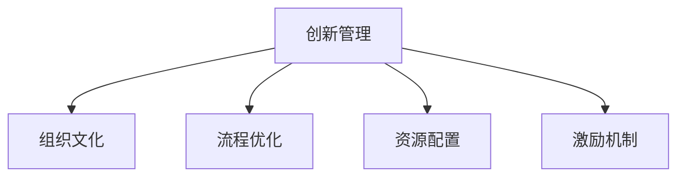

                 

## 1. 背景介绍

### 1.1 问题由来
在当今快速变化的商业环境中，企业需要不断创新以保持竞争优势。创新不仅关乎产品的开发，更涉及到组织结构的调整、流程的优化、文化的建设等多个方面。然而，创新并非易事，它需要克服多方面的阻力，如组织惯性、资源不足、人才短缺等。如何激发团队的创造力，让创新成为一种文化，成为企业面临的重要课题。

### 1.2 问题核心关键点
激发团队创造力的方法可以分为组织层面的管理和个人层面的激励两个维度。组织层面包括文化建设、流程优化、资源配置等；个人层面包括激励机制、团队建设、技能培训等。本文将主要探讨组织层面的创新管理方法，并结合实际案例进行分析。

### 1.3 问题研究意义
有效的创新管理方法，能够激发团队的创造力，提升组织的核心竞争力。通过科学的管理方法，企业可以加速产品迭代，开拓新的市场，降低创新成本，提升客户满意度，从而在竞争中获得优势。此外，创新管理还能够提升员工的职业满足感和成就感，降低员工流失率，提高整体组织效率。

## 2. 核心概念与联系

### 2.1 核心概念概述

为更好地理解创新管理方法，本节将介绍几个密切相关的核心概念：

- **创新管理(Innovation Management)**：通过建立一套系统化的流程和机制，激发和引导企业内部创新行为，将创新转化为实际成果的过程。
- **组织文化(Organizational Culture)**：企业内部成员共同遵守的价值观、行为规范和共同信仰，是创新管理的重要基础。
- **流程优化(Process Optimization)**：通过重新设计工作流程，减少冗余和浪费，提高组织效率。
- **资源配置(Resource Allocation)**：合理分配企业资源，确保创新项目的顺利推进。
- **激励机制(Incentive Mechanism)**：通过物质或精神奖励，激发员工的主动性和创造性。

这些核心概念之间的逻辑关系可以通过以下Mermaid流程图来展示：



这个流程图展示创新管理的核心概念及其之间的关系：

1. 创新管理通过组织文化的塑造，流程的优化，资源的配置，以及激励机制的设置，来实现创新的高效管理和推进。
2. 组织文化为创新管理提供了内在动力和支持，是企业内部创新的土壤。
3. 流程优化和资源配置保证了创新管理的有序进行，为创新项目提供了保障。
4. 激励机制则直接驱动员工参与创新，是创新管理的外在动力。

## 3. 核心算法原理 & 具体操作步骤
### 3.1 算法原理概述

创新管理的核心在于通过系统化的流程和机制，激发和引导企业内部的创新行为。其核心思想是：建立一个包容开放、鼓励尝试、快速迭代的创新环境，让员工的创造力得到充分发挥。

具体而言，创新管理包括以下几个关键步骤：

1. **文化塑造**：建立开放包容、鼓励创新、容忍失败的企业文化，营造一种创新的氛围。
2. **流程优化**：重新设计工作流程，打破部门壁垒，提高信息流通和协作效率。
3. **资源配置**：合理分配企业资源，确保创新项目的顺利推进。
4. **激励机制**：设计有效的激励机制，激发员工的主动性和创造性。
5. **项目管理**：建立项目管理体系，确保创新项目有章可循、有序推进。

### 3.2 算法步骤详解

创新管理的步骤主要分为以下几个阶段：

**阶段1：需求识别与机会分析**

- **步骤1.1**：收集员工、市场、技术等方面的信息，识别出潜在的机会点。
- **步骤1.2**：组织内部讨论和头脑风暴，挖掘更多的创新点。
- **步骤1.3**：对机会进行筛选和优先级排序，确定最有潜力的创新项目。

**阶段2：创新项目设计**

- **步骤2.1**：为每个创新项目制定详细的实施计划，明确目标、时间、资源需求等。
- **步骤2.2**：设计可行的实验方案，验证创新点的可行性。
- **步骤2.3**：确定实验所需的资源和支持。

**阶段3：项目执行与跟踪**

- **步骤3.1**：组织团队成员开展实验，执行创新计划。
- **步骤3.2**：实时跟踪项目进展，定期评估项目效果。
- **步骤3.3**：及时调整实验方案，解决实验过程中遇到的问题。

**阶段4：项目评估与反馈**

- **步骤4.1**：项目结束后，对实验结果进行评估，确定其成功与否。
- **步骤4.2**：总结经验教训，提出改进建议。
- **步骤4.3**：将成功的创新成果转化为实际产品或服务，推广应用。

### 3.3 算法优缺点

创新管理的优点在于：

- **系统化流程**：通过系统化的流程管理，能够确保创新项目有序推进，提高项目成功率。
- **多方参与**：多方参与和讨论，能够集思广益，提升创新项目的质量和可行性。
- **激励机制**：有效的激励机制能够激发员工的创造力和主动性，提升整体团队活力。

然而，创新管理也存在一定的局限性：

- **资源投入大**：创新管理需要投入大量的人力、物力和财力，可能存在成本高昂的问题。
- **时间周期长**：从需求识别到项目评估，整个流程可能需要较长时间，难以快速响应市场变化。
- **风险难以预测**：创新项目的成功与否往往难以预测，存在较高的失败风险。

尽管如此，创新管理仍然是一种有效的激发团队创造力的方法，对于企业创新具有重要意义。

### 3.4 算法应用领域

创新管理方法广泛应用于企业内部创新、产品开发、流程优化等多个领域。例如：

- **研发部门**：通过创新管理，推动新产品、新技术的研发，提升企业的市场竞争力。
- **市场营销**：通过创新管理，开展新的市场策略和营销活动，提升品牌知名度和市场份额。
- **运营管理**：通过创新管理，优化运营流程，提高生产效率和客户满意度。
- **人力资源**：通过创新管理，设计激励机制，提升员工的工作积极性和满意度。

## 4. 数学模型和公式 & 详细讲解 & 举例说明

### 4.1 数学模型构建

创新管理的方法论可以抽象为一个数学模型。假设企业有 $n$ 个创新点，每个创新点的成功概率为 $p$，失败概率为 $q$。设 $C_i$ 为第 $i$ 个创新点的成本，$R_i$ 为成功后的收益，$T_i$ 为项目的周期时间。创新管理的目标是最大化总收益。

目标函数为：

$$
\max \sum_{i=1}^{n} R_i(1-q_i) - \sum_{i=1}^{n} C_i
$$

其中 $q_i = 1-p_i$，表示第 $i$ 个创新点失败的概率。

### 4.2 公式推导过程

根据期望值和方差的性质，可以将总收益表示为：

$$
\begin{align*}
\mathbb{E}[\text{Total Revenue}] &= \sum_{i=1}^{n} \mathbb{E}[R_i(1-q_i)] \\
&= \sum_{i=1}^{n} (R_i - R_iq_i)
\end{align*}
$$

总成本的期望值为：

$$
\mathbb{E}[\text{Total Cost}] = \sum_{i=1}^{n} \mathbb{E}[C_i] = \sum_{i=1}^{n} C_i
$$

因此，创新管理的目标可以简化为最大化总收益的期望值：

$$
\max \sum_{i=1}^{n} (R_i - R_iq_i)
$$

### 4.3 案例分析与讲解

以下以一家科技公司创新管理的实际案例进行分析：

**案例背景**：一家科技公司希望通过创新管理，开发新的产品线，提升市场份额。公司有 $n=3$ 个创新点，每个点的成功概率 $p_1=0.6$，$p_2=0.7$，$p_3=0.8$。失败概率 $q_i = 1-p_i$。每个创新点的成本 $C_1=100$，$C_2=150$，$C_3=200$。成功后的收益 $R_1=500$，$R_2=1000$，$R_3=1500$。

**步骤1.1**：公司组织内部头脑风暴，识别出三个创新点。

**步骤2.1**：为每个创新点制定详细的实施计划，明确目标、时间、资源需求等。

**步骤3.1**：组织团队成员开展实验，执行创新计划。

**步骤4.1**：项目结束后，对实验结果进行评估，确定其成功与否。

**结果分析**：假设三个创新点中，只有第1个和第3个项目成功，第2个项目失败。则总收益为：

$$
\text{Total Revenue} = R_1 + R_3 = 500 + 1500 = 2000
$$

总成本为：

$$
\text{Total Cost} = C_1 + C_3 = 100 + 200 = 300
$$

因此，总收益的期望值为：

$$
\mathbb{E}[\text{Total Revenue}] = 2000 - 300 = 1700
$$

通过创新管理，公司成功推动了两个创新项目的实施，取得了良好的效果。

## 5. 项目实践：代码实例和详细解释说明
### 5.1 开发环境搭建

在进行创新管理项目实践前，我们需要准备好开发环境。以下是使用Python进行PyTorch开发的环境配置流程：

1. 安装Anaconda：从官网下载并安装Anaconda，用于创建独立的Python环境。

2. 创建并激活虚拟环境：
```bash
conda create -n innovation-env python=3.8 
conda activate innovation-env
```

3. 安装PyTorch：根据CUDA版本，从官网获取对应的安装命令。例如：
```bash
conda install pytorch torchvision torchaudio cudatoolkit=11.1 -c pytorch -c conda-forge
```

4. 安装必要的库：
```bash
pip install matplotlib pandas sklearn jupyter notebook ipython
```

完成上述步骤后，即可在`innovation-env`环境中开始创新管理项目实践。

### 5.2 源代码详细实现

以下是一个基于创新管理模型的Python代码示例，用于评估不同创新项目的收益和成本，并计算最优的资源配置：

```python
import numpy as np

# 定义创新项目参数
p = [0.6, 0.7, 0.8]  # 成功概率
q = [1-p[i] for i in range(len(p))]  # 失败概率
C = [100, 150, 200]  # 成本
R = [500, 1000, 1500]  # 成功后的收益

# 定义目标函数
def calculate_total_revenue(prob, cost, revenue):
    total_revenue = sum([revenue[i]*(1-prob[i]) for i in range(len(prob))])
    total_cost = sum(cost)
    return total_revenue - total_cost

# 计算每个项目的期望收益
probabilities = np.array(p)
revenues = np.array(R)
costs = np.array(C)

# 计算总期望收益
total_revenue = calculate_total_revenue(probabilities, costs, revenues)
print(f"Total Expected Revenue: {total_revenue}")
```

### 5.3 代码解读与分析

让我们再详细解读一下关键代码的实现细节：

**概率和成本的计算**：
- 定义成功概率 `p` 和失败概率 `q`，利用 `np.array` 创建数组，方便后续计算。
- 定义每个创新点的成本 `C` 和成功后的收益 `R`。

**目标函数的实现**：
- `calculate_total_revenue` 函数计算总收益的期望值，即目标函数的值。

**期望收益的计算**：
- 使用 `np.array` 创建数组 `probabilities`、`revenues` 和 `costs`，表示每个创新点的成功概率、成功后的收益和成本。
- 调用 `calculate_total_revenue` 函数，计算总期望收益。

通过这个简单的代码示例，我们可以直观地看到创新管理模型的实际应用。在实际的项目中，还需要更复杂的算法和数据处理，如多目标优化、风险评估等。但核心的思想和方法仍然相似。

## 6. 实际应用场景
### 6.1 技术创新部

技术创新部是企业的核心部门，负责推动新技术、新产品、新服务的研发和推广。通过创新管理，技术创新部可以系统化地管理创新项目，确保每个项目有序推进，最大化创新成果。

**实际应用**：一家科技公司设立了技术创新部，负责新产品线的开发。部门通过创新管理模型，评估每个创新点的收益和成本，优先推进成功的项目。同时，建立了创新项目的项目管理制度，确保每个项目有明确的责任人和时间节点。通过这种系统化的管理方法，公司成功推出了多个创新产品，大幅提升了市场竞争力。

### 6.2 市场营销部

市场营销部需要不断推出新的市场策略和营销活动，提升品牌知名度和市场份额。通过创新管理，市场营销部可以更高效地识别和评估市场机会，优化营销策略。

**实际应用**：一家消费品公司设立了市场营销部，通过创新管理模型，对多个市场机会进行评估，识别出最有潜力的市场策略。市场营销部通过系统化的方法，设计并推广市场策略，取得了显著的市场效果。

### 6.3 运营管理部

运营管理部需要不断优化运营流程，提高生产效率和客户满意度。通过创新管理，运营管理部可以发现并解决运营中的瓶颈问题，提升整体运营效率。

**实际应用**：一家制造企业设立了运营管理部，通过创新管理模型，评估各运营环节的成本和收益，识别出低效的流程并进行优化。运营管理部通过系统化的方法，重新设计流程，提高了生产效率和客户满意度，减少了运营成本。

### 6.4 未来应用展望

随着技术的发展和市场的变化，创新管理方法将更加多样化和高效化。未来，以下趋势将可能成为创新管理的主流：

- **数据驱动**：利用大数据和人工智能技术，对创新项目的风险和收益进行更精确的评估和预测。
- **跨部门协作**：通过打破部门壁垒，建立跨部门协作机制，提高创新项目的执行效率。
- **敏捷迭代**：采用敏捷开发的方法，快速迭代实验方案，快速响应市场变化。
- **文化建设**：通过文化建设，营造开放包容、鼓励创新的企业文化，激发员工的创造力。

## 7. 工具和资源推荐
### 7.1 学习资源推荐

为了帮助开发者系统掌握创新管理的方法论，这里推荐一些优质的学习资源：

1. **《创新管理精要》**：经典的创新管理书籍，系统介绍了创新管理的基本概念、方法和案例。
2. **Coursera《创新管理》课程**：由哈佛商学院开设的创新管理课程，提供系统化的创新管理知识。
3. **Udemy《创新思维与创新管理》课程**：通过实际案例，介绍创新管理的具体操作方法。
4. **《颠覆性创新》**：知名创业家克莱顿·克里斯滕森的作品，介绍了颠覆性创新的基本原理和策略。

通过对这些资源的学习实践，相信你一定能够掌握创新管理的基本方法和技巧，并将其应用到实际工作中。

### 7.2 开发工具推荐

高效的开发离不开优秀的工具支持。以下是几款用于创新管理开发的常用工具：

1. **JIRA**：项目管理工具，帮助企业系统化地管理创新项目，分配任务、跟踪进展、评估结果。
2. **Confluence**：知识管理工具，帮助企业建立知识库，分享创新经验和成果。
3. **Slack**：沟通协作工具，帮助企业建立跨部门协作机制，提高创新项目的执行效率。
4. **Trello**：任务管理工具，帮助企业快速迭代实验方案，快速响应市场变化。

合理利用这些工具，可以显著提升创新管理项目的开发效率，加快创新迭代的步伐。

### 7.3 相关论文推荐

创新管理的研究涉及多个学科，涵盖了管理学、心理学、经济学等多个领域。以下是几篇具有代表性的相关论文，推荐阅读：

1. **《企业创新管理研究综述》**：总结了企业创新管理的基本理论和实践经验，为创新管理提供了理论基础。
2. **《创新管理的心理因素研究》**：研究了心理因素对创新管理的影响，提供了创新的心理学视角。
3. **《基于数据的创新管理》**：介绍了大数据和人工智能在创新管理中的应用，为创新管理提供了新的方法。

这些论文代表了创新管理的研究方向，通过学习这些前沿成果，可以帮助研究者把握学科前进方向，激发更多的创新灵感。

## 8. 总结：未来发展趋势与挑战
### 8.1 总结

本文对创新管理方法进行了全面系统的介绍。首先阐述了创新管理的背景和意义，明确了创新管理在激发团队创造力、提升组织核心竞争力方面的重要价值。其次，从原理到实践，详细讲解了创新管理的基本流程和关键步骤，给出了创新管理项目开发的完整代码实例。同时，本文还探讨了创新管理在技术创新部、市场营销部、运营管理部等多个部门的应用场景，展示了创新管理的广泛适用性。

通过本文的系统梳理，可以看到，创新管理方法能够有效激发团队的创造力，提升组织的核心竞争力。通过系统化的流程和机制，创新管理能够确保创新项目的有序推进，最大化创新成果。未来，随着技术的不断发展和应用的不断深入，创新管理方法将变得更加多样化和高效化，为企业带来更大的创新价值。

### 8.2 未来发展趋势

展望未来，创新管理方法将呈现以下几个发展趋势：

- **数据驱动**：利用大数据和人工智能技术，对创新项目的风险和收益进行更精确的评估和预测。
- **跨部门协作**：通过打破部门壁垒，建立跨部门协作机制，提高创新项目的执行效率。
- **敏捷迭代**：采用敏捷开发的方法，快速迭代实验方案，快速响应市场变化。
- **文化建设**：通过文化建设，营造开放包容、鼓励创新的企业文化，激发员工的创造力。

这些趋势将进一步提升创新管理的效果，推动企业在快速变化的市场中保持竞争优势。

### 8.3 面临的挑战

尽管创新管理方法已经取得了一定的成功，但在迈向更加智能化、普适化应用的过程中，它仍面临诸多挑战：

- **资源投入大**：创新管理需要投入大量的人力、物力和财力，可能存在成本高昂的问题。
- **时间周期长**：从需求识别到项目评估，整个流程可能需要较长时间，难以快速响应市场变化。
- **风险难以预测**：创新项目的成功与否往往难以预测，存在较高的失败风险。
- **跨部门协作难**：不同部门之间的沟通和协作存在障碍，难以形成高效的创新团队。

这些挑战需要企业在实践中不断优化创新管理流程，提高创新管理效率。通过跨部门协作、数据驱动等方法，企业可以在更大范围内推广创新管理，提升整体创新能力。

### 8.4 研究展望

未来的研究需要在以下几个方面寻求新的突破：

- **数据驱动创新管理**：利用大数据和人工智能技术，对创新项目的风险和收益进行更精确的评估和预测。
- **敏捷迭代方法**：采用敏捷开发的方法，快速迭代实验方案，快速响应市场变化。
- **跨部门协作机制**：建立跨部门协作机制，提高创新项目的执行效率。
- **文化建设方法**：通过文化建设，营造开放包容、鼓励创新的企业文化，激发员工的创造力。

这些研究方向的探索，必将引领创新管理方法迈向更高的台阶，为企业的创新发展提供更多可能性。面向未来，创新管理方法需要与其他创新技术进行更深入的融合，如区块链、物联网等，多路径协同发力，共同推动企业创新能力的提升。只有勇于创新、敢于突破，才能不断拓展创新管理的边界，让企业保持竞争优势，实现持续发展。

## 9. 附录：常见问题与解答

**Q1：创新管理是否可以适用于所有类型的企业？**

A: 创新管理适用于所有类型的企业，无论是传统制造业还是高科技公司，无论是大型企业还是中小企业。不同类型和规模的企业，可以根据自身的特点和需求，灵活应用创新管理方法。

**Q2：创新管理需要投入多少资源？**

A: 创新管理的资源投入取决于企业的规模和复杂度。一般来说，创新管理需要投入人力、物力、财力，以确保创新项目的顺利推进。具体投入量需要根据企业的实际情况进行评估。

**Q3：创新管理的效果如何评估？**

A: 创新管理的效果评估可以通过以下几个方面进行：
1. 创新项目的成功率：成功项目的数量占总项目的比例。
2. 创新项目的收益：创新项目带来的财务收益或市场份额提升。
3. 员工满意度：创新管理对员工满意度的影响。
4. 创新文化的建设：创新管理对企业文化建设的影响。

**Q4：创新管理是否可以与其他管理方法结合使用？**

A: 创新管理可以与其他管理方法结合使用，如质量管理、精益管理、敏捷开发等。通过综合应用多种管理方法，企业可以更全面地提升管理水平和创新能力。

**Q5：创新管理在企业中的应用场景有哪些？**

A: 创新管理在企业中的应用场景非常广泛，包括：
1. 新产品开发：通过创新管理，推动新技术、新产品、新服务的研发和推广。
2. 市场策略优化：通过创新管理，识别和评估市场机会，优化市场策略。
3. 流程优化：通过创新管理，优化运营流程，提高生产效率和客户满意度。
4. 员工培训：通过创新管理，设计培训计划，提升员工的技能和创新能力。

---

作者：禅与计算机程序设计艺术 / Zen and the Art of Computer Programming

