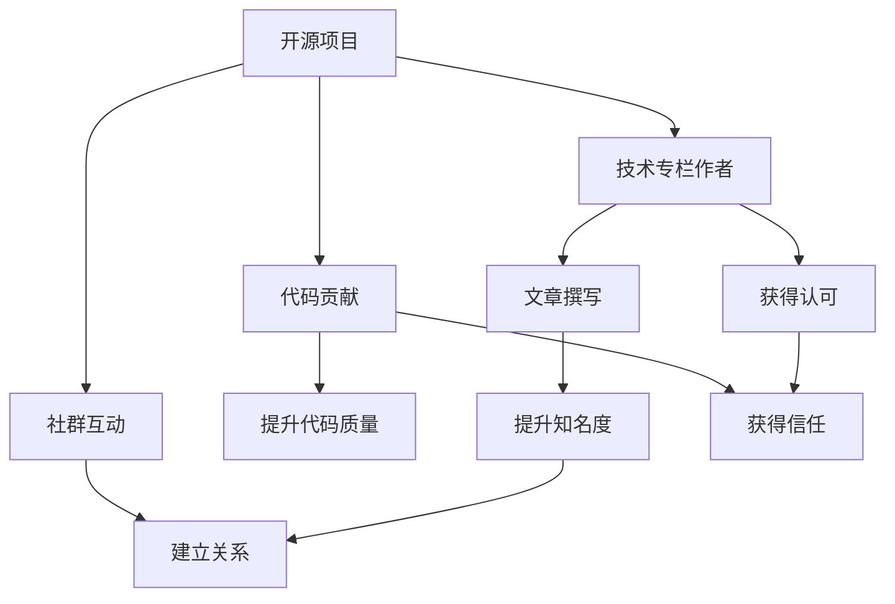

                 

## 1. 背景介绍

在数字时代，开源项目成为了连接开发者、企业和学术界的桥梁。开源社区不仅孕育了大量技术创新，也成为开发者获取新知识、拓展职业发展的重要平台。特别是对于初入IT领域的技术作者而言，开源项目不仅提供了丰富的学习资源，也提供了展示才能、积累声誉的机会。如何利用开源影响力，获得技术专栏作者机会，成为了许多开发者共同关注的议题。

本文将系统介绍如何利用开源项目在技术社区中建立声誉，从而获得专栏作者的机会。我们将从背景介绍、核心概念与联系、核心算法原理、数学模型构建、项目实践、实际应用场景、工具和资源推荐等多个角度展开探讨，力求为读者提供全面的指导。

## 2. 核心概念与联系

### 2.1 核心概念概述

在开始深入讨论开源影响力之前，我们首先明确几个关键概念：

- **开源项目**：指将源代码公开、共享和协作开发的软件项目。开源社区汇集了全球的开发者，共同贡献代码、文档和应用。

- **技术专栏作者**：指在技术社区（如Medium、CSDN、知乎等）撰写文章，分享专业见解、技术技巧的作者。这类作者通常具备深厚的技术背景，对某一技术领域有独到的理解和见解。

- **影响力**：指个人或项目在技术社区中的知名度、信任度和引导力。开源项目的贡献、专栏的阅读量、社交媒体的互动等，都是影响力的体现。

- **贡献精神**：指积极参与开源项目、乐于分享、乐于助人的品质。开源社区的繁荣离不开众多贡献者的共同努力。

- **代码质量**：指代码的可读性、可维护性、可扩展性等技术指标。高质量的代码是获取影响力、成为专栏作者的基石。

- **社群互动**：指在开源项目和技术社区中，与他人互动、交流和协作的能力。通过有效沟通，建立良好的人际关系和信任感。

这些概念共同构成了开源影响力和技术专栏作者的生态体系，开发者需从中提升自身能力，逐步积累影响力。

### 2.2 核心概念原理和架构的 Mermaid 流程图

这个流程图展示了开源影响力和技术专栏作者的逻辑关系：

1. 开源项目是技术专栏作者的基础。通过贡献代码，提升代码质量，获得社群认可。
2. 在技术社区撰写专栏文章，提升知名度。
3. 通过积极互动和高质量的代码贡献，建立良好的人际关系和信任感。
4. 代码质量和社群互动共同作用，形成影响力，成为专栏作者。

## 3. 核心算法原理 & 具体操作步骤

### 3.1 算法原理概述

技术专栏作者的获取途径，并非一蹴而就，而是需要系统性的努力和长期的积累。我们将其概括为"开源影响力算法"，该算法涉及多个环节和步骤，以下是核心原理和操作步骤：

### 3.2 算法步骤详解

**Step 1: 选择适合的开源项目**

- **了解社区需求**：加入相关开源项目的邮件列表，关注GitHub上的issue和PR，了解项目当前的需求和痛点。
- **评估自身能力**：识别自己擅长的技术领域和经验，寻找与自己技能匹配的开源项目。
- **尝试小型项目**：从贡献小的任务开始，如文档更新、代码修正等，逐渐积累经验。

**Step 2: 提高代码质量**

- **遵循代码规范**：了解并遵循项目代码规范，如PEP8、Google Style等，确保代码风格统一。
- **代码审查**：积极参与代码审查，学习他人的编写风格和代码优化技巧。
- **重构和优化**：通过重构和优化代码，提高代码的可读性和可维护性。
- **文档更新**：为代码和API编写清晰的文档，方便他人理解和使用。

**Step 3: 参与社群互动**

- **加入邮件列表和讨论组**：主动参与项目的邮件列表和IRC讨论组，与项目成员保持良好沟通。
- **建立关系网**：通过社交媒体、线下Meetup等方式，与项目维护者和其他贡献者建立联系。
- **贡献代码并寻求反馈**：定期提交代码，并主动寻求他人的反馈和建议。

**Step 4: 撰写技术文章**

- **选择合适平台**：选择适合自己技术风格和影响力的技术社区，如Medium、CSDN、知乎等。
- **确定写作主题**：选择与自己经验相关的主题，确保内容专业且具有独特见解。
- **撰写高质量文章**：使用清晰的标题、结构化的内容、准确的代码示例，提升文章可读性。
- **持续更新和互动**：在文章发布后，持续更新内容和回复读者评论，保持与读者的互动。

**Step 5: 提升影响力**

- **积累声誉**：通过高质量的代码贡献和专业文章，逐步积累技术声誉。
- **参与项目决策**：在项目中担任领导或核心角色，影响项目方向和决策。
- **建立个人品牌**：通过社交媒体和个人网站，推广自己的技术专长和影响力。

### 3.3 算法优缺点

**优点**：

- **广泛接触**：开源项目和技术社区可以接触大量技术同行和专家，提升专业水平。
- **快速反馈**：代码贡献和文章发布可以获得即时反馈，不断改进和提升。
- **展示才能**：通过公开的项目贡献和文章撰写，展示自己的技术能力和见解。

**缺点**：

- **高投入**：需要投入大量时间和精力，尤其是在初始阶段。
- **技术门槛**：某些高难度项目可能对技术要求较高，初学者难以入手。
- **同行竞争**：技术社区中不乏高手，竞争激烈，需要持续努力和创新。

### 3.4 算法应用领域

开源影响力和技术专栏作者的实践不仅仅局限于软件开发领域，涵盖了数据科学、人工智能、安全、区块链等多个技术方向。无论是数据工程师、机器学习工程师还是安全专家，只要掌握开源项目和社区的运作方式，都可以在相应的技术领域中积累影响力，成为专栏作者。

## 4. 数学模型和公式 & 详细讲解 & 举例说明

### 4.1 数学模型构建

技术专栏作者的获取过程，可以看作是一个优化问题，其目标函数为：

$$
\max_{x_1,x_2,\ldots,x_n} f(x_1,x_2,\ldots,x_n)
$$

其中，$x_i$ 代表在开源项目和技术社区中的活动（如代码贡献、文章撰写、社区互动等），$f(x_1,x_2,\ldots,x_n)$ 表示这些活动对技术专栏作者影响力的总和。

### 4.2 公式推导过程

我们可以进一步细化影响力的计算公式：

$$
f(x_1,x_2,\ldots,x_n) = \sum_{i=1}^n w_i \cdot g_i(x_i)
$$

其中，$w_i$ 是第 $i$ 项活动的权重，$g_i(x_i)$ 是第 $i$ 项活动对影响力的贡献函数。例如，$w_1$ 和 $g_1(x_1)$ 分别代表代码贡献的权重和函数，$w_2$ 和 $g_2(x_2)$ 分别代表文章写作的权重和函数。

### 4.3 案例分析与讲解

以下是一个简化的案例，展示如何计算技术专栏作者的影响力：

- **代码贡献**：$w_1 = 0.6$，$g_1(x_1) = 0.8x_1 + 0.2x_1^2$。
- **文章写作**：$w_2 = 0.4$，$g_2(x_2) = 0.5x_2^{1.5} + 0.3x_2^2$。

假设 $x_1 = 50$ 次代码贡献，$x_2 = 20$ 篇文章，则影响力计算如下：

$$
f(50,20) = 0.6 \cdot (0.8 \cdot 50 + 0.2 \cdot 50^2) + 0.4 \cdot (0.5 \cdot 20^{1.5} + 0.3 \cdot 20^2) = 126.8
$$

这个结果显示了，通过平衡代码贡献和文章写作，可以显著提升技术专栏作者的影响力。

## 5. 项目实践：代码实例和详细解释说明

### 5.1 开发环境搭建

**Step 1: 安装Git和GitHub**

- **安装Git**：通过官网下载并安装Git，或使用apt-get安装Linux下的Git。
- **创建GitHub账号**：在GitHub官网注册账号，并将其设置为GitHub默认推送平台。

**Step 2: 配置开发环境**

- **安装编辑器**：如Visual Studio Code、Atom等，并配置Git插件。
- **配置SSH密钥**：生成SSH密钥，并将公钥添加到GitHub账号中。

**Step 3: 克隆开源项目**

- **搜索项目**：在GitHub上搜索并克隆感兴趣的开源项目。
- **设置本地分支**：在本地仓库中创建并切换分支，进行代码贡献。

### 5.2 源代码详细实现

**Step 1: 选择贡献任务**

- **阅读issue和PR**：阅读项目中的issue和PR，选择感兴趣且适合自己技术能力的任务。
- **记录任务需求**：记录任务需求和步骤，确保理解任务目标。

**Step 2: 提交代码**

- **编写代码**：编写代码实现任务需求，并确保代码质量。
- **提交代码**：使用git提交代码，并推送到远程仓库。

**Step 3: 参与代码审查**

- **查看审查请求**：在GitHub上查看代码审查请求，了解代码审查过程。
- **提供反馈**：在代码审查中提供建设性的反馈，学习他人的编写技巧。

### 5.3 代码解读与分析

**Step 1: 代码审查**

- **代码风格**：检查代码是否遵循项目规范，确保一致性。
- **代码质量**：评估代码的可读性、可维护性和可扩展性。
- **逻辑错误**：找出代码中的逻辑错误和潜在问题，并提供修改建议。

**Step 2: 代码重构**

- **重构代码**：根据审查反馈，进行代码重构和优化，提升代码质量。
- **文档更新**：为重构后的代码编写清晰的文档，方便他人理解和使用。

### 5.4 运行结果展示

**Step 1: 展示代码贡献**

- **提交代码**：通过Git提交代码，并使用Pull Request（PR）机制向项目维护者申请代码合并。
- **获得批准**：维护者会对代码进行审查，提出修改意见，开发者根据反馈进行修改，直至代码获得批准。

**Step 2: 展示文章成果**

- **撰写文章**：选择适合的技术社区，撰写高质量的技术文章。
- **发布文章**：将文章发布到技术社区，并分享至社交媒体和LinkedIn等平台。
- **互动评论**：回复读者评论，与读者互动，提升文章阅读量和影响力。

## 6. 实际应用场景

### 6.1 开源项目贡献

技术作者在开源项目中的贡献，可以显著提升自己在社区中的声誉和影响力。以下是几种常见的开源项目贡献形式：

- **代码贡献**：修复bug、添加新功能、优化性能等。
- **文档编写**：编写和更新项目文档，使其更加全面和易用。
- **代码审查**：参与代码审查，提高代码质量，学习他人技巧。
- **参与会议**：参加开源项目的技术会议和讨论组，分享见解和经验。

### 6.2 技术文章撰写

技术文章撰写不仅可以展示技术专长，还可以分享新知识和经验，帮助他人学习。以下是几种常见的技术文章类型：

- **技术博客**：在技术社区撰写技术博客，分享自己的技术见解和经验。
- **案例分析**：通过具体案例，展示技术应用和解决方案。
- **教程指南**：撰写教程和指南，帮助读者掌握特定技术或工具的使用。
- **行业报告**：撰写行业报告，分析技术趋势和应用前景。

## 7. 工具和资源推荐

### 7.1 学习资源推荐

**Step 1: 选择学习资源**

- **官方文档**：选择官方文档，如项目README、API文档等，了解项目背景和技术细节。
- **在线课程**：选择在线课程，如Coursera、Udacity等，深入学习相关技术。
- **书籍推荐**：选择经典书籍，如《Clean Code》、《Effective Java》等，提升编程能力。
- **技术社区**：加入技术社区，如Stack Overflow、GitHub Issues等，获取技术支持和资源。

**Step 2: 学习实践**

- **动手练习**：通过实际练习，巩固所学知识。
- **解决实际问题**：尝试解决实际问题，加深对技术的理解。
- **参与讨论**：在技术社区中积极参与讨论，分享和学习技术见解。

### 7.2 开发工具推荐

**Step 1: 选择开发工具**

- **编辑器**：如Visual Studio Code、Atom、Sublime Text等，支持代码高亮、代码补全、版本控制等。
- **版本控制**：如Git，支持代码版本控制和远程协作。
- **代码审查**：如GitHub、GitLab等，支持代码审查和合并。
- **项目管理**：如JIRA、Trello等，管理项目任务和进度。

**Step 2: 配置开发环境**

- **安装插件**：安装代码高亮、自动补全等插件，提升开发效率。
- **设置环境变量**：设置项目依赖和环境变量，确保开发环境一致性。

### 7.3 相关论文推荐

**Step 1: 选择论文**

- **相关文献**：选择与技术专栏作者相关的文献，如《开源项目的贡献者行为研究》等，了解开源社区的运作方式。
- **技术论文**：选择相关技术论文，如《代码重构的影响因素分析》等，提升技术水平。

**Step 2: 深入阅读**

- **精读论文**：通过精读论文，掌握论文中的技术细节和研究方法。
- **实践应用**：将论文中的理论和技术应用于实际项目中，提升实践能力。

## 8. 总结：未来发展趋势与挑战

### 8.1 总结

本文系统介绍了如何利用开源项目和技术社区，提升技术专栏作者的获得途径。从背景介绍、核心概念与联系、核心算法原理、数学模型构建、项目实践、实际应用场景、工具和资源推荐等多个角度，全面阐述了开源影响力的获取方法。通过本文的介绍，开发者可以更加清晰地了解技术专栏作者的获取过程，并制定有效的策略。

### 8.2 未来发展趋势

开源项目和技术社区将继续蓬勃发展，技术专栏作者将面临更多的机遇和挑战。以下是一些未来发展趋势：

- **开源社区生态化**：开源社区将进一步生态化，形成更完善的生态系统，提供更多资源和支持。
- **技术社区平台化**：技术社区将平台化，提供更全面和标准化的技术分享和交流平台。
- **技术论文多元化**：技术论文将更加多元化，涵盖更多领域和方向，推动技术进步。

### 8.3 面临的挑战

尽管开源项目和技术社区提供了丰富的资源，技术专栏作者的获取也面临着诸多挑战：

- **高竞争性**：技术社区中高手如云，需要持续创新和努力。
- **知识更新快**：技术领域不断进步，需要不断学习新知识和技能。
- **时间投入大**：开源项目和技术社区需要投入大量时间和精力，需合理安排时间。

### 8.4 研究展望

面对未来，技术专栏作者的获取需要不断探索和创新。以下是一些可能的研究方向：

- **开源影响力的量化研究**：通过数学建模，量化开源影响力的各个因素，制定更为系统的获取策略。
- **技术社区的智能化推荐**：利用推荐算法，帮助开发者选择适合的开源项目和技术文章，提升获取效率。
- **技术社区的治理优化**：研究技术社区的治理机制，优化社区管理和资源配置，提升社区活跃度和影响力。

## 9. 附录：常见问题与解答

**Q1: 如何选择合适的开源项目进行贡献？**

A: 选择适合自己的开源项目，需考虑以下几点：
- 项目需求：选择与自己的技术兴趣和能力匹配的项目。
- 项目规模：选择规模适中、维护活跃的项目，避免贡献微小被忽略。
- 项目社区：选择社区活跃、有良好文化氛围的项目。

**Q2: 代码贡献如何提升影响力？**

A: 通过代码贡献提升影响力的关键在于：
- 代码质量：确保代码高质量，遵守项目规范，方便他人使用和维护。
- 持续贡献：定期提交代码，展示持续的努力和贡献。
- 代码优化：通过代码优化和重构，提升代码质量和可维护性。

**Q3: 技术文章如何获得更多阅读？**

A: 技术文章获得更多阅读的关键在于：
- 选择合适平台：选择适合自己技术风格和影响力的平台。
- 撰写高质量文章：使用清晰的标题、结构化的内容、准确的代码示例，提升文章可读性。
- 持续更新和互动：在文章发布后，持续更新内容和回复读者评论，保持与读者的互动。

**Q4: 如何平衡开源项目和技术文章？**

A: 平衡开源项目和技术文章的策略在于：
- 时间管理：合理安排时间，确保开源项目和文章撰写都能兼顾。
- 任务分解：将任务分解成小块，逐步完成，提升效率。
- 优先级排序：根据项目和文章的紧急程度和重要性，进行优先级排序，确保重要任务优先完成。

通过本文的系统梳理，相信读者可以更加全面地了解技术专栏作者的获取途径，并制定有效的策略。开源项目和技术社区是技术发展的重要引擎，开发者需充分利用这些资源，不断提升自我，成为技术领域的佼佼者。

---

作者：禅与计算机程序设计艺术 / Zen and the Art of Computer Programming

