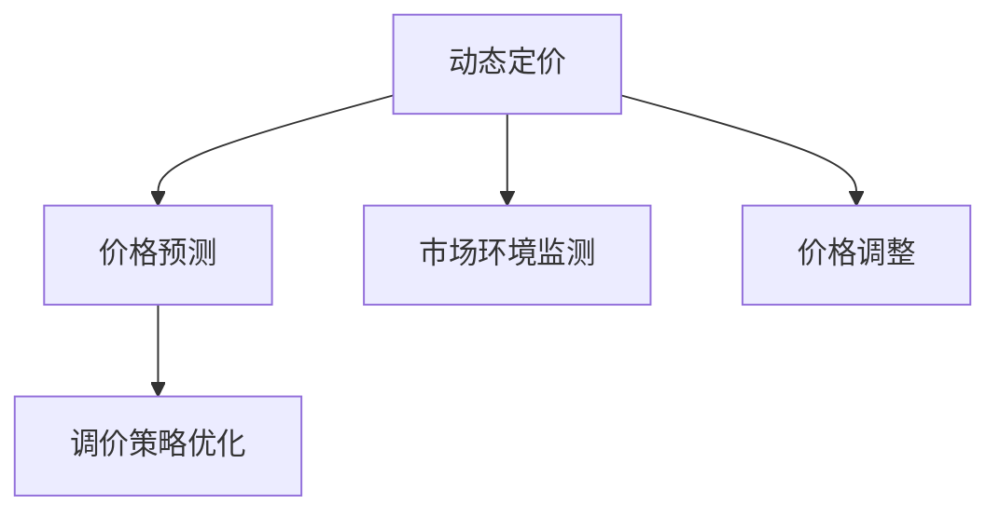

                 

# 动态定价策略：AI的实现

## 1. 背景介绍

### 1.1 问题由来
随着电子商务的迅猛发展，定价策略成为电商运营的核心环节之一。传统的定价策略往往是静态的，无法及时响应市场需求和竞争态势的变化。在数字化转型浪潮下，企业越来越多地采用动态定价，通过实时调整价格，以期在满足客户需求的同时，实现盈利最大化。动态定价策略涉及到的技术难度较高，包括价格模型构建、市场环境监测、调价策略优化等，需要深度学习、自然语言处理、决策分析等人工智能技术的大力支撑。

### 1.2 问题核心关键点
动态定价的关键在于构建精准的价格预测模型，并根据市场环境动态调整商品价格。这一过程涉及以下几个核心问题：

1. 价格预测模型构建：通过分析历史销售数据和市场环境数据，建立价格预测模型，预测未来价格变化趋势。
2. 市场环境监测：实时监测市场环境数据，包括用户需求、竞争对手价格、商品库存等，评估价格调整的影响。
3. 调价策略优化：根据价格预测模型和市场环境监测结果，设计调价策略，实现价格动态调整。

本文将详细介绍基于AI技术的动态定价策略，包括价格预测模型构建、市场环境监测、调价策略优化等方面的核心技术，并通过实际案例展示其在电商行业的应用效果。

## 2. 核心概念与联系

### 2.1 核心概念概述

为了更好地理解动态定价策略的核心技术，本节将介绍几个关键概念：

- 动态定价（Dynamic Pricing）：根据市场环境的变化，实时调整商品价格以优化销售利润的策略。
- 价格预测（Price Prediction）：通过历史数据和市场环境分析，预测未来价格变化的模型。
- 市场环境监测（Market Environment Monitoring）：实时监测市场环境数据，如用户需求、竞争对手价格、商品库存等，评估价格调整的影响。
- 调价策略优化（Pricing Strategy Optimization）：设计调价策略，实现价格的动态调整。

这些概念之间的逻辑关系可以通过以下Mermaid流程图来展示：



这个流程图展示了大语言模型的核心概念及其之间的关系：

1. 动态定价是大语言模型的应用目标。
2. 价格预测是构建动态定价策略的基础。
3. 市场环境监测为价格预测提供数据支持。
4. 调价策略优化是实现动态定价的关键环节。
5. 价格调整是最终应用环节。

这些概念共同构成了动态定价策略的完整框架，使得动态定价在电商平台得以实现。

## 3. 核心算法原理 & 具体操作步骤
### 3.1 算法原理概述

动态定价策略的核心是通过AI技术建立价格预测模型，并根据市场环境变化实时调整价格。其核心算法原理包括以下几个方面：

- **数据预处理**：收集和清洗历史销售数据、市场环境数据等，构建数据集。
- **价格预测模型**：通过机器学习算法（如回归、时间序列预测等）建立价格预测模型，预测未来价格变化。
- **市场环境监测**：利用自然语言处理、情感分析等技术，实时监测市场环境数据，评估价格调整的影响。
- **调价策略优化**：设计调价策略，实现价格的动态调整。

### 3.2 算法步骤详解

#### 3.2.1 数据预处理

动态定价策略的第一步是收集和清洗历史销售数据和市场环境数据，构建数据集。数据预处理的主要步骤如下：

1. **数据采集**：从电商平台、社交媒体、新闻网站等渠道采集相关数据，包括商品销售记录、用户评论、竞争对手价格等。
2. **数据清洗**：去除数据中的噪声和异常值，填充缺失数据，进行数据标准化和归一化处理。
3. **数据划分**：将数据划分为训练集、验证集和测试集，用于模型训练、调参和评估。

#### 3.2.2 价格预测模型

价格预测模型的构建是动态定价策略的核心。常用的价格预测模型包括回归模型、时间序列预测模型、神经网络模型等。以下是常用的几种价格预测模型：

- **线性回归模型**：通过线性关系拟合价格变化趋势，适用于价格变化较为平稳的情况。
- **时间序列预测模型**：利用时间序列数据，如ARIMA模型、LSTM模型等，预测未来价格变化。
- **神经网络模型**：如多变量线性回归神经网络、长短期记忆网络（LSTM）等，能够处理复杂的价格变化模式。

#### 3.2.3 市场环境监测

市场环境监测的目的是实时评估市场环境数据，为价格调整提供依据。常用的市场环境监测技术包括：

- **自然语言处理**：通过情感分析、实体识别等技术，分析用户评论、新闻报道等文本数据，获取用户需求和市场趋势。
- **情感分析**：利用文本分类算法，对用户评论和新闻报道进行情感分析，评估市场情绪。
- **用户行为分析**：通过分析用户点击、浏览、购买等行为数据，获取用户偏好和需求。

#### 3.2.4 调价策略优化

调价策略优化的目标是设计最优的调价策略，实现价格的动态调整。常用的调价策略包括：

- **基于价格预测的调价策略**：根据价格预测模型，设置价格调整阈值，当预测价格变化达到一定阈值时，自动调整价格。
- **基于市场环境的调价策略**：根据市场环境监测结果，调整价格策略，如根据用户需求和市场情绪调整价格。
- **基于规则的调价策略**：根据预设的规则，如节假日、促销活动等，自动调整价格。

### 3.3 算法优缺点

动态定价策略的优势在于能够实时响应市场变化，优化销售利润。然而，该策略也存在一些局限性：

- **数据依赖性高**：动态定价策略依赖于历史数据和市场环境数据，数据质量的好坏直接影响模型效果。
- **计算成本高**：构建和维护价格预测模型、市场环境监测系统等，需要较大的计算资源。
- **市场波动风险**：市场环境的变化复杂多变，预测模型可能无法准确预测价格变化，导致调价策略失效。

尽管存在这些局限性，但动态定价策略仍然是目前电商行业中最前沿的定价方法之一，具有广阔的应用前景。

### 3.4 算法应用领域

动态定价策略广泛应用于电子商务、航空、酒店、旅游等多个领域，为这些行业带来了显著的经济效益。以下是一些典型的应用场景：

- **电子商务**：电商平台通过动态定价策略，优化商品价格，提升销售利润和用户满意度。
- **航空业**：航空公司根据市场需求和竞争对手价格，实时调整机票价格，最大化收益。
- **酒店业**：酒店根据客房供应和用户需求，动态调整房价，优化营收和用户体验。
- **旅游业**：旅游公司根据季节变化和用户预订情况，调整景点门票价格，提高业务收入。

## 4. 数学模型和公式 & 详细讲解  
### 4.1 数学模型构建

为了更好地理解动态定价策略的数学模型，本节将详细介绍价格预测模型的构建和市场环境监测的数学模型。

#### 4.1.1 价格预测模型

常用的价格预测模型包括线性回归模型、ARIMA模型、LSTM模型等。以下以线性回归模型为例，介绍其数学模型构建过程：

设历史价格数据为 $x_1, x_2, \ldots, x_n$，预测未来的价格为 $y$，则线性回归模型的数学模型为：

$$
y = \beta_0 + \beta_1 x_1 + \beta_2 x_2 + \ldots + \beta_n x_n + \epsilon
$$

其中，$\beta_0, \beta_1, \ldots, \beta_n$ 为模型参数，$\epsilon$ 为误差项。

#### 4.1.2 市场环境监测

市场环境监测的数学模型主要包括情感分析和用户行为分析。以下是情感分析的数学模型：

设文本数据为 $D = \{d_1, d_2, \ldots, d_m\}$，其中 $d_i$ 表示第 $i$ 条文本数据。情感分析的目标是将文本数据分类为正面、中性或负面，可以通过二分类或多分类模型实现。以下以二分类模型为例，介绍其数学模型构建过程：

设文本数据对应的标签为 $y = \{0, 1\}$，情感分析的数学模型为：

$$
P(y|d_i) = \frac{e^{w_0^T f(d_i)}}{1 + e^{w_0^T f(d_i)}}
$$

其中，$w_0$ 为模型参数，$f(d_i)$ 为特征提取函数，$e^{w_0^T f(d_i)}$ 为logistic函数。

## 5. 项目实践：代码实例和详细解释说明
### 5.1 开发环境搭建

在进行动态定价策略的实践前，我们需要准备好开发环境。以下是使用Python进行TensorFlow开发的环境配置流程：

1. 安装Anaconda：从官网下载并安装Anaconda，用于创建独立的Python环境。

2. 创建并激活虚拟环境：
```bash
conda create -n tf-env python=3.8 
conda activate tf-env
```

3. 安装TensorFlow：根据CUDA版本，从官网获取对应的安装命令。例如：
```bash
conda install tensorflow -c pytorch -c conda-forge
```

4. 安装TensorFlow扩展库：
```bash
pip install tensorflow-estimator tensorflow-hub
```

5. 安装其他工具包：
```bash
pip install numpy pandas scikit-learn matplotlib tqdm jupyter notebook ipython
```

完成上述步骤后，即可在`tf-env`环境中开始动态定价策略的实践。

### 5.2 源代码详细实现

这里我们以动态定价策略在电商行业的应用为例，给出使用TensorFlow进行价格预测的PyTorch代码实现。

首先，定义价格预测模型的输入和输出：

```python
import tensorflow as tf
from tensorflow import keras

# 定义输入数据的形状
input_shape = (None, 3)  # 假设输入为3个特征

# 定义输出数据的形状
output_shape = (1,)  # 假设输出为1个价格预测值

# 定义模型
model = keras.Sequential([
    keras.layers.Dense(64, activation='relu', input_shape=input_shape),
    keras.layers.Dense(output_shape)
])
```

然后，定义数据集和模型训练过程：

```python
# 定义训练数据集
train_data = tf.data.Dataset.from_tensor_slices((train_features, train_labels))

# 定义验证数据集
val_data = tf.data.Dataset.from_tensor_slices((val_features, val_labels))

# 定义模型训练过程
model.compile(optimizer='adam', loss='mse', metrics=['mae'])

# 训练模型
model.fit(train_data.shuffle(1000).batch(32), epochs=10, validation_data=val_data.shuffle(1000).batch(32))
```

最后，评估模型性能并进行价格预测：

```python
# 定义测试数据集
test_data = tf.data.Dataset.from_tensor_slices((test_features, test_labels))

# 评估模型性能
model.evaluate(test_data.shuffle(1000).batch(32))

# 进行价格预测
predictions = model.predict(test_features)
```

以上就是使用TensorFlow进行价格预测的完整代码实现。可以看到，TensorFlow提供了方便的API和模型构建框架，使得动态定价策略的开发变得相对简洁。

### 5.3 代码解读与分析

让我们再详细解读一下关键代码的实现细节：

**Sequential模型**：
- 使用TensorFlow的Sequential模型，可以方便地进行模型构建。
- 模型由多个Dense层组成，每个Dense层都使用了ReLU激活函数，能够增加模型的非线性表达能力。

**训练过程**：
- 使用Adam优化器和均方误差损失函数，训练模型10个epoch。
- 在每个epoch的训练过程中，使用shuffle和batch函数对数据进行随机化处理，以提高模型的泛化能力。

**模型评估**：
- 使用mae作为评估指标，评估模型在测试集上的平均绝对误差。

**价格预测**：
- 使用模型对测试集进行价格预测，输出预测结果。

当然，工业级的系统实现还需考虑更多因素，如模型的保存和部署、超参数的自动搜索、更灵活的任务适配层等。但核心的动态定价策略基本与此类似。

## 6. 实际应用场景
### 6.1 电商定价策略优化

电商平台的动态定价策略可以显著提升销售额和利润。传统电商的定价策略往往是基于固定的成本和利润率，缺乏对市场需求和竞争态势的实时响应。通过动态定价策略，电商平台可以根据用户需求和市场环境，实时调整商品价格，实现盈利最大化。

在技术实现上，可以收集用户浏览、点击、购买等行为数据，结合价格预测模型和市场环境监测数据，实时调整商品价格。具体步骤如下：

1. 收集电商平台的销售数据、用户行为数据、市场环境数据等，构建数据集。
2. 使用价格预测模型，预测未来价格变化趋势。
3. 实时监测用户评论、竞争对手价格、商品库存等市场环境数据，评估价格调整的影响。
4. 根据预测结果和市场环境监测数据，设计调价策略，实现价格的动态调整。

通过动态定价策略，电商平台可以在满足用户需求的同时，实现销售利润的最大化。

### 6.2 航空业机票价格优化

航空公司的机票价格优化是动态定价策略的重要应用之一。航空公司需要根据市场需求和竞争对手价格，实时调整机票价格，最大化收益。

在技术实现上，可以收集航空公司的航班信息、历史机票价格、竞争对手价格、气象数据等，构建数据集。使用价格预测模型，预测未来机票价格变化趋势。同时，实时监测竞争对手价格、气象数据等市场环境数据，评估价格调整的影响。根据预测结果和市场环境监测数据，设计调价策略，实现机票价格的动态调整。

通过动态定价策略，航空公司可以根据市场需求和竞争态势，实时调整机票价格，最大化收益。

### 6.3 酒店业客房价格优化

酒店业的客房价格优化也是动态定价策略的重要应用之一。酒店需要根据客房供应和用户需求，实时调整客房价格，优化营收和用户体验。

在技术实现上，可以收集酒店的客房信息、历史价格数据、用户需求数据等，构建数据集。使用价格预测模型，预测未来客房价格变化趋势。同时，实时监测用户需求数据、竞争对手价格等市场环境数据，评估价格调整的影响。根据预测结果和市场环境监测数据，设计调价策略，实现客房价格的动态调整。

通过动态定价策略，酒店可以根据市场需求和竞争态势，实时调整客房价格，优化营收和用户体验。

### 6.4 旅游业景点门票价格优化

旅游公司的景点门票价格优化是动态定价策略的重要应用之一。旅游公司需要根据季节变化和用户预订情况，调整景点门票价格，提高业务收入。

在技术实现上，可以收集景点的历史门票价格、用户预订数据、天气数据等，构建数据集。使用价格预测模型，预测未来门票价格变化趋势。同时，实时监测用户预订数据、天气数据等市场环境数据，评估价格调整的影响。根据预测结果和市场环境监测数据，设计调价策略，实现景点门票价格的动态调整。

通过动态定价策略，旅游公司可以根据季节变化和用户预订情况，实时调整景点门票价格，提高业务收入。

### 6.5 未来应用展望

随着AI技术的发展，动态定价策略将在更多领域得到应用，为各行各业带来变革性影响。

在智慧医疗领域，医疗机构可以根据病人需求和市场环境，实时调整药品价格，提高医疗服务效率和盈利能力。

在智能教育领域，教育机构可以根据学生需求和市场环境，实时调整课程价格，优化教育资源配置。

在智慧城市治理中，政府可以根据用户需求和市场环境，实时调整公共服务价格，提高城市管理的智能化水平。

此外，在企业生产、社会治理、文娱传媒等众多领域，动态定价策略也将不断涌现，为各行各业带来新的商业机会和发展动力。相信随着AI技术的发展，动态定价策略必将在更多领域得到应用，为各行各业带来更多的经济效益和社会价值。

## 7. 工具和资源推荐
### 7.1 学习资源推荐

为了帮助开发者系统掌握动态定价策略的理论基础和实践技巧，这里推荐一些优质的学习资源：

1. 《动态定价策略》系列博文：由动态定价技术专家撰写，深入浅出地介绍了动态定价策略的原理和实践方法。

2. CS345《机器学习工程》课程：斯坦福大学开设的高级课程，介绍了机器学习工程中的价格预测和动态定价。

3. 《Deep Learning for Pricing》书籍：深度学习在定价中的应用，介绍了多种动态定价方法和技术。

4. TensorFlow官方文档：TensorFlow的官方文档，提供了详细的API接口和代码示例，方便初学者上手实践。

5. TensorFlow Hub：TensorFlow的模型库，提供了大量的动态定价模型和预训练模型，用于快速部署。

通过对这些资源的学习实践，相信你一定能够快速掌握动态定价策略的精髓，并用于解决实际的商业问题。

### 7.2 开发工具推荐

高效的开发离不开优秀的工具支持。以下是几款用于动态定价策略开发的常用工具：

1. TensorFlow：由Google主导开发的深度学习框架，生产部署方便，适合大规模工程应用。
2. PyTorch：基于Python的开源深度学习框架，灵活高效，适合快速迭代研究。
3. Jupyter Notebook：开源的交互式笔记本环境，方便进行数据处理和模型调试。
4. Weights & Biases：模型训练的实验跟踪工具，可以记录和可视化模型训练过程中的各项指标，方便对比和调优。
5. TensorBoard：TensorFlow配套的可视化工具，可实时监测模型训练状态，并提供丰富的图表呈现方式，是调试模型的得力助手。

合理利用这些工具，可以显著提升动态定价策略的开发效率，加快创新迭代的步伐。

### 7.3 相关论文推荐

动态定价策略的发展源于学界的持续研究。以下是几篇奠基性的相关论文，推荐阅读：

1. "Dynamic Pricing with Algorithmic Models" by Sun et al.：介绍了动态定价模型和算法，为动态定价策略提供了理论基础。

2. "Pricing to Market: Dynamic Pricing in an Oligopolistic Market" by Boyer et al.：研究了在寡头市场中的动态定价策略，提供了实际应用中的优化方法。

3. "Real-time Dynamic Pricing Strategies for Airline Revenue Management" by Gao et al.：研究了航空业的动态定价策略，探讨了如何在实时环境中优化价格。

4. "Real-time Dynamic Pricing in Online Marketplaces" by Menickelly et al.：研究了电商平台中的动态定价策略，介绍了如何利用AI技术进行价格优化。

这些论文代表了大语言模型动态定价技术的发展脉络。通过学习这些前沿成果，可以帮助研究者把握学科前进方向，激发更多的创新灵感。

## 8. 总结：未来发展趋势与挑战
### 8.1 总结

本文对基于AI技术的动态定价策略进行了全面系统的介绍。首先阐述了动态定价策略的研究背景和意义，明确了动态定价在电商平台中的应用价值。其次，从原理到实践，详细讲解了动态定价的数学模型和关键步骤，给出了动态定价策略的完整代码实例。同时，本文还广泛探讨了动态定价在电商、航空、酒店、旅游等多个行业领域的应用前景，展示了动态定价策略的巨大潜力。

通过本文的系统梳理，可以看到，基于AI技术的动态定价策略正在成为电商平台的重要范式，极大地提升了销售利润和用户体验。未来，伴随AI技术的不断演进，动态定价策略必将在更多领域得到应用，为各行各业带来更多的经济效益和社会价值。

### 8.2 未来发展趋势

展望未来，动态定价策略将呈现以下几个发展趋势：

1. **数据驱动**：随着数据采集和处理技术的进步，动态定价策略将更加依赖于高质量、多维度的数据，以实现更精准的价格预测和调价策略。

2. **模型多样化**：除了传统的机器学习模型，未来将涌现更多深度学习、强化学习等复杂模型，以应对更复杂的价格变化模式。

3. **实时性提升**：随着计算资源的不断提升，动态定价策略的实时性将进一步提高，实现实时价格调整。

4. **多领域应用**：动态定价策略将在更多领域得到应用，如医疗、教育、城市管理等，为各行各业带来新的商业机会。

5. **智能化增强**：未来动态定价策略将与智能推荐、情感分析等技术结合，提升用户体验和市场响应速度。

以上趋势凸显了大语言模型动态定价技术的广阔前景。这些方向的探索发展，必将进一步提升动态定价策略的性能和应用范围，为各行各业带来更多的经济效益和社会价值。

### 8.3 面临的挑战

尽管动态定价策略已经取得了显著成就，但在迈向更加智能化、普适化应用的过程中，它仍面临着诸多挑战：

1. **数据获取难度大**：高质量数据采集和处理成本高，数据质量的好坏直接影响模型效果。
2. **模型复杂度高**：深度学习等复杂模型虽然精度高，但计算资源需求大，需要高效的硬件和算法支持。
3. **市场环境变化快**：市场环境复杂多变，预测模型可能无法准确预测价格变化，导致调价策略失效。
4. **算法透明性不足**：动态定价算法黑盒化，难以解释其内部工作机制和决策逻辑，影响用户的信任和接受度。

尽管存在这些挑战，但随着学界和产业界的共同努力，动态定价策略的瓶颈将逐步被克服，实现更加智能化、普适化的应用。相信随着AI技术的发展，动态定价策略必将在更多领域得到应用，为各行各业带来更多的经济效益和社会价值。

### 8.4 未来突破

面对动态定价策略所面临的挑战，未来的研究需要在以下几个方面寻求新的突破：

1. **无监督学习**：探索无监督和半监督学习范式，降低对标注数据和高质量数据的依赖。
2. **计算优化**：优化动态定价算法的计算图，提升实时性和效率。
3. **多模态融合**：将多模态信息（如图像、视频、语音等）与文本信息融合，提升价格预测的准确性和调价策略的灵活性。
4. **算法透明性**：引入可解释性技术，提高动态定价算法的透明性和可信度。

这些研究方向将为动态定价策略带来新的突破，提升其智能水平和应用范围，实现更加广泛的应用。

## 9. 附录：常见问题与解答

**Q1：动态定价策略是否适用于所有商业场景？**

A: 动态定价策略适用于大多数商业场景，尤其是需要实时响应市场变化的情况。但对于一些特定场景，如传统制造业等，价格变化较慢，动态定价策略的效益可能有限。

**Q2：动态定价策略的计算成本如何控制？**

A: 动态定价策略的计算成本主要集中在价格预测模型和市场环境监测系统上。可以通过并行计算、模型压缩等方法控制计算成本，提高实时性。

**Q3：动态定价策略如何避免市场波动风险？**

A: 动态定价策略可以通过多模型集成、参数更新机制等方式，降低市场波动风险。同时，引入人工干预和监控机制，及时调整调价策略。

**Q4：动态定价策略的算法透明性如何提升？**

A: 可以通过引入可解释性技术，如LIME、SHAP等，提高动态定价算法的透明性和可信度。同时，结合可视化工具，帮助用户理解和接受算法决策。

**Q5：动态定价策略的未来发展方向是什么？**

A: 动态定价策略的未来发展方向包括数据驱动、模型多样化、实时性提升、多领域应用、智能化增强等。这些方向的探索发展，必将进一步提升动态定价策略的性能和应用范围，为各行各业带来更多的经济效益和社会价值。

---

作者：禅与计算机程序设计艺术 / Zen and the Art of Computer Programming

