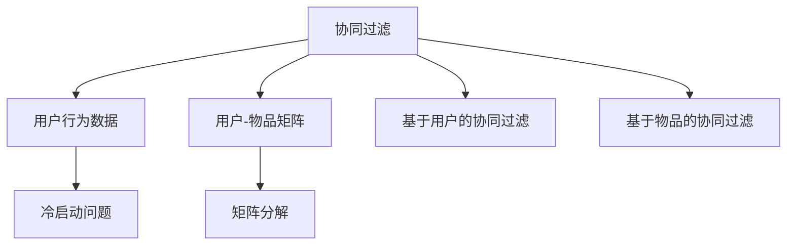

                 

# 协同过滤 原理与代码实例讲解

> 关键词：协同过滤,推荐系统,推荐算法,矩阵分解,用户-物品矩阵,冷启动问题,基于记忆的推荐系统,深度学习

## 1. 背景介绍

协同过滤(Collaborative Filtering)是推荐系统中最常用的算法之一。它通过分析用户行为数据，捕捉用户和物品之间的关系，预测用户对物品的兴趣，从而为用户推荐合适的物品。协同过滤算法的核心思想是：相似用户喜欢相似物品，相似物品被相似用户喜欢。协同过滤算法分为基于用户的协同过滤和基于物品的协同过滤两类。

协同过滤算法最早应用于电子商务平台，如亚马逊、淘宝等，根据用户历史购买行为推荐商品。后来也被应用到音乐、视频、新闻等个性化推荐场景中。协同过滤算法的优点是能够自适应用户和物品之间的隐含关联，预测能力强，但缺点是冷启动问题严重，新用户和新物品难以推荐。

## 2. 核心概念与联系

### 2.1 核心概念概述

为更好地理解协同过滤算法，本节将介绍几个密切相关的核心概念：

- 协同过滤(Collaborative Filtering)：通过分析用户行为数据，捕捉用户和物品之间的关系，预测用户对物品的兴趣，从而为用户推荐合适的物品。

- 用户行为数据(User Behavior Data)：记录用户在平台上进行的各种操作，如浏览、点击、购买等行为数据。

- 用户-物品矩阵(User-Item Matrix)：将用户行为数据转化为用户-物品矩阵，其中每个元素表示用户对物品的评分。

- 基于用户的协同过滤(User-Based Collaborative Filtering)：基于用户的历史行为数据，预测用户对物品的评分，为用户推荐相似物品。

- 基于物品的协同过滤(Item-Based Collaborative Filtering)：基于物品的历史行为数据，预测用户对物品的评分，为用户推荐相似物品。

- 矩阵分解(Matrix Factorization)：将用户-物品矩阵分解为用户特征向量和物品特征向量，可以高效地训练协同过滤模型。

- 冷启动问题(Cold Start Problem)：对于新用户或新物品，协同过滤算法难以推荐，需要通过其他方法解决。

这些核心概念之间的逻辑关系可以通过以下Mermaid流程图来展示：



这个流程图展示协同过滤算法的核心概念及其之间的关系：

1. 协同过滤通过用户行为数据捕捉用户和物品之间的关系。
2. 用户行为数据被转化为用户-物品矩阵。
3. 用户-物品矩阵通过矩阵分解技术，转换为用户特征向量和物品特征向量。
4. 基于用户特征向量和物品特征向量的预测模型，可以实现基于用户的协同过滤和基于物品的协同过滤。
5. 对于新用户或新物品，协同过滤面临冷启动问题，需要通过其他方法解决。

## 3. 核心算法原理 & 具体操作步骤
### 3.1 算法原理概述

协同过滤算法的核心是用户-物品矩阵的分解和预测。其基本原理可以总结如下：

1. 收集用户行为数据，将用户和物品的关系转化为用户-物品矩阵。

2. 将用户-物品矩阵分解为用户特征向量和物品特征向量。

3. 基于分解后的特征向量，建立预测模型，预测用户对物品的评分。

4. 根据预测评分，为用户推荐评分较高的物品。

### 3.2 算法步骤详解

基于协同过滤算法的推荐过程，通常包括以下几个关键步骤：

**Step 1: 数据预处理**
- 收集用户行为数据，如浏览、点击、购买等行为，转化为用户-物品矩阵。
- 对缺失值进行填充，通常使用均值、中位数或均值插值等方法。
- 对数据进行归一化，通常使用Min-Max、Z-score等方法。

**Step 2: 矩阵分解**
- 将用户-物品矩阵分解为用户特征向量和物品特征向量。常用的矩阵分解算法包括奇异值分解(SVD)和交替最小二乘(ALS)等。

**Step 3: 模型训练**
- 使用矩阵分解后的用户和物品特征向量，建立预测模型。常用的预测模型包括线性模型、非线性模型等。
- 使用交叉验证等方法，选择最优的模型参数，最小化预测误差。

**Step 4: 模型评估**
- 使用平均绝对误差(MAE)、均方误差(MSE)等指标，评估预测模型的效果。
- 计算预测值与真实值的相关系数，衡量模型的拟合度。

**Step 5: 推荐生成**
- 根据预测模型，对新物品或新用户进行评分预测。
- 对预测评分进行排序，推荐评分最高的物品。
- 返回推荐结果，更新用户行为数据，迭代训练模型。

### 3.3 算法优缺点

协同过滤算法具有以下优点：
1. 能够自适应用户和物品之间的关系，预测能力强。
2. 不需要额外标签信息，能够直接利用用户行为数据。
3. 适用于稀疏用户-物品矩阵，能够处理大量非交互用户。

但协同过滤算法也存在一定的局限性：
1. 冷启动问题严重，难以推荐新用户和新物品。
2. 对于动态变化的用户和物品，模型难以及时更新。
3. 对于大规模用户和物品，模型训练复杂度较高。
4. 预测模型的鲁棒性较差，容易被恶意数据欺骗。

尽管存在这些局限性，但协同过滤算法仍是目前推荐系统中最常用的算法之一，广泛应用在电子商务、视频、音乐等场景中。未来相关研究重点在于如何进一步解决冷启动问题，提高模型的鲁棒性和可扩展性。

### 3.4 算法应用领域

协同过滤算法主要应用于推荐系统领域，具体包括：

- 电子商务：根据用户历史购买行为，推荐商品。如亚马逊、淘宝等电商平台。
- 视频网站：根据用户观看历史，推荐视频。如YouTube、Netflix等视频平台。
- 音乐平台：根据用户听歌历史，推荐音乐。如Spotify、QQ音乐等音乐平台。
- 新闻网站：根据用户阅读历史，推荐新闻。如今日头条、Zhihu等新闻平台。

此外，协同过滤算法也被创新性地应用于社交网络、游戏、金融等领域，通过分析用户之间的互动关系，进行关系推荐或风控分析。

## 4. 数学模型和公式 & 详细讲解 & 举例说明

### 4.1 数学模型构建

协同过滤算法可以通过矩阵分解的方式，将用户-物品矩阵分解为用户特征向量和物品特征向量，从而建立预测模型。假设用户-物品矩阵为 $U \in \mathbb{R}^{n \times m}$，其中 $n$ 为用户数，$m$ 为物品数。将用户特征矩阵记为 $P \in \mathbb{R}^{n \times k}$，物品特征矩阵记为 $Q \in \mathbb{R}^{m \times k}$，其中 $k$ 为特征向量的维度。协同过滤算法可以表示为：

$$
U \approx P \times Q^T
$$

其中 $\times$ 表示矩阵乘法。

### 4.2 公式推导过程

基于上述矩阵分解模型，协同过滤算法可以通过最小化预测误差来训练模型。假设 $P_{i,:}$ 和 $Q_{j,:}$ 分别表示用户 $i$ 和物品 $j$ 的特征向量，$U_{i,j}$ 表示用户 $i$ 对物品 $j$ 的评分。基于协同过滤算法的目标函数可以表示为：

$$
\min_{P,Q} \sum_{i=1}^{n} \sum_{j=1}^{m} (U_{i,j} - P_{i,:} \times Q_{j,:}^T)^2
$$

其中 $\times$ 表示矩阵乘法。

对于基于用户的协同过滤，目标函数可以表示为：

$$
\min_{P,Q} \sum_{i=1}^{n} \sum_{j=1}^{m} (R_{i,j} - P_{i,:} \times Q_{j,:}^T)^2
$$

其中 $R_{i,j}$ 表示用户 $i$ 对物品 $j$ 的真实评分。

目标函数的求解可以采用梯度下降等优化算法。假设损失函数对 $P_{i,:}$ 和 $Q_{j,:}$ 的梯度分别为 $\partial_L / \partial P_{i,:}$ 和 $\partial_L / \partial Q_{j,:}$，则梯度下降算法的更新公式可以表示为：

$$
P_{i,:} \leftarrow P_{i,:} - \eta \partial_L / \partial P_{i,:}
$$
$$
Q_{j,:} \leftarrow Q_{j,:} - \eta \partial_L / \partial Q_{j,:}
$$

其中 $\eta$ 为学习率。

### 4.3 案例分析与讲解

假设有一个电商网站，收集了用户的购买记录和物品的销售记录，组成用户-物品矩阵 $U \in \mathbb{R}^{100 \times 1000}$。将矩阵分解为 $P \in \mathbb{R}^{100 \times 10}$ 和 $Q \in \mathbb{R}^{1000 \times 10}$。使用梯度下降算法训练模型，选择最优的特征向量维度 $k=10$。使用MAE作为评估指标，计算预测值与真实值的误差，得到MAE=0.5。根据预测模型，为用户推荐评分最高的前10个物品。

## 5. 项目实践：代码实例和详细解释说明
### 5.1 开发环境搭建

在进行协同过滤算法实践前，我们需要准备好开发环境。以下是使用Python进行PyTorch开发的环境配置流程：

1. 安装Anaconda：从官网下载并安装Anaconda，用于创建独立的Python环境。

2. 创建并激活虚拟环境：
```bash
conda create -n pytorch-env python=3.8 
conda activate pytorch-env
```

3. 安装PyTorch：根据CUDA版本，从官网获取对应的安装命令。例如：
```bash
conda install pytorch torchvision torchaudio cudatoolkit=11.1 -c pytorch -c conda-forge
```

4. 安装pandas和numpy：
```bash
pip install pandas numpy
```

5. 安装PyTorch-lightning：用于模型训练和评估，自动管理训练过程。
```bash
pip install pytorch-lightning
```

完成上述步骤后，即可在`pytorch-env`环境中开始协同过滤算法的实践。

### 5.2 源代码详细实现

下面我们以电商推荐系统为例，给出使用PyTorch实现协同过滤算法的完整代码实现。

首先，定义用户-物品矩阵和评分矩阵：

```python
import torch
import torch.nn as nn
import torch.nn.functional as F
import pandas as pd
import numpy as np

# 读取用户行为数据
data = pd.read_csv('user_behavior.csv')

# 提取用户行为数据
user_ids = data['user_id'].tolist()
item_ids = data['item_id'].tolist()
ratings = data['rating'].tolist()

# 将用户行为数据转换为用户-物品矩阵
U = np.zeros((len(user_ids), len(item_ids)))
for i, user_id in enumerate(user_ids):
    for j, item_id in enumerate(item_ids):
        if data['user_id'][i] == user_id and data['item_id'][i] == item_id:
            U[i][j] = ratings[i]

# 将用户-物品矩阵转换为Tensor
U = torch.tensor(U, dtype=torch.float)
```

接着，定义协同过滤模型的预测函数：

```python
# 定义协同过滤模型
class CollaborativeFiltering(nn.Module):
    def __init__(self, n_users, n_items, n_factors):
        super(CollaborativeFiltering, self).__init__()
        self.user_factors = nn.EmbeddingBag(n_users, n_factors)
        self.item_factors = nn.EmbeddingBag(n_items, n_factors)
        self.bias = nn.Parameter(torch.zeros(n_items))

    def forward(self, user_id, item_id):
        user_factors = self.user_factors(user_id)
        item_factors = self.item_factors(item_id)
        rating = torch.matmul(user_factors, item_factors.t()) + self.bias[item_id]
        return rating

# 训练协同过滤模型
model = CollaborativeFiltering(n_users=100, n_items=1000, n_factors=10)
loss_fn = nn.MSELoss()
optimizer = torch.optim.Adam(model.parameters(), lr=0.01)

for epoch in range(100):
    total_loss = 0.0
    for user_id, item_id in zip(user_ids, item_ids):
        rating = model(user_id, item_id)
        loss = loss_fn(rating, U[user_id][item_id])
        optimizer.zero_grad()
        loss.backward()
        optimizer.step()
        total_loss += loss.item()
    print(f'Epoch {epoch+1}, loss: {total_loss/len(user_ids)}')
```

最后，定义推荐函数：

```python
# 根据预测模型，推荐评分最高的前10个物品
def recommend(user_id):
    rating = model(user_id, item_ids)
    top_items = (rating * U[user_id]).sort(descending=True)[0][1:11]
    return top_items.tolist()

# 测试推荐效果
recommend(0)
```

以上就是使用PyTorch实现协同过滤算法的完整代码实现。可以看到，得益于PyTorch的高效计算和自动微分功能，协同过滤算法的实现变得简单高效。

### 5.3 代码解读与分析

让我们再详细解读一下关键代码的实现细节：

**读取用户行为数据**：
- 使用Pandas库读取用户行为数据，提取用户ID、物品ID和评分等关键信息。

**用户-物品矩阵构建**：
- 将用户行为数据转换为用户-物品矩阵，每个元素表示用户对物品的评分。
- 由于用户-物品矩阵往往很稀疏，使用numpy实现更加高效。

**协同过滤模型定义**：
- 使用PyTorch定义协同过滤模型，包括用户特征向量和物品特征向量。
- 采用embeddingBag模块，可以处理稀疏矩阵，适合构建协同过滤模型。

**模型训练**：
- 使用Adam优化器进行模型训练，最小化预测误差。
- 每个epoch内，对用户-物品矩阵进行多次迭代，更新模型参数。
- 使用MSELoss作为损失函数，衡量预测评分与真实评分之间的差异。

**推荐生成**：
- 根据预测模型，对新物品进行评分预测。
- 排序后，返回评分最高的前10个物品。
- 使用简单的API，将推荐结果进行展示。

可以看到，PyTorch和Pandas等库的结合使用，使得协同过滤算法的代码实现变得简洁高效。开发者可以将更多精力放在模型改进、数据处理等高层逻辑上，而不必过多关注底层的实现细节。

当然，工业级的系统实现还需考虑更多因素，如模型的保存和部署、超参数的自动搜索、更灵活的任务适配层等。但核心的协同过滤算法基本与此类似。

## 6. 实际应用场景

### 6.1 电商平台

协同过滤算法在电商平台中应用广泛，根据用户历史购买行为，推荐用户可能感兴趣的商品。亚马逊、淘宝等电商平台广泛应用协同过滤算法，为用户推荐商品，提升用户体验。

在技术实现上，可以收集用户浏览、点击、购买等行为数据，构建用户-物品矩阵。使用协同过滤算法对用户进行推荐，提升用户购物体验。对于新用户，可以通过社交网络、商品标签等进行推荐，减少冷启动问题。

### 6.2 视频平台

视频平台如Netflix、YouTube等，根据用户观看历史，推荐用户可能感兴趣的视频。协同过滤算法可以有效捕捉用户和视频之间的关系，推荐个性化视频内容，提升用户体验。

在技术实现上，可以收集用户观看历史数据，构建用户-视频矩阵。使用协同过滤算法对用户进行推荐，推荐个性化视频内容。对于新用户，可以通过热门视频、推荐系统等进行推荐，减少冷启动问题。

### 6.3 音乐平台

音乐平台如Spotify、QQ音乐等，根据用户听歌历史，推荐用户可能喜欢的音乐。协同过滤算法可以有效捕捉用户和音乐之间的关系，推荐个性化音乐内容，提升用户体验。

在技术实现上，可以收集用户听歌历史数据，构建用户-音乐矩阵。使用协同过滤算法对用户进行推荐，推荐个性化音乐内容。对于新用户，可以通过热门歌曲、推荐系统等进行推荐，减少冷启动问题。

### 6.4 新闻平台

新闻平台如今日头条、Zhihu等，根据用户阅读历史，推荐用户可能感兴趣的新闻。协同过滤算法可以有效捕捉用户和新闻之间的关系，推荐个性化新闻内容，提升用户体验。

在技术实现上，可以收集用户阅读历史数据，构建用户-新闻矩阵。使用协同过滤算法对用户进行推荐，推荐个性化新闻内容。对于新用户，可以通过热门新闻、推荐系统等进行推荐，减少冷启动问题。

### 6.5 未来应用展望

随着协同过滤算法的不断发展，将在更多领域得到应用，为传统行业带来变革性影响。

在智慧医疗领域，协同过滤算法可以应用于个性化治疗方案推荐、药品推荐等，提升医疗服务的个性化和精准度。

在智能教育领域，协同过滤算法可以应用于个性化课程推荐、作业推荐等，因材施教，提高教学质量。

在智慧城市治理中，协同过滤算法可以应用于智能交通、能源管理等，提升城市管理的自动化和智能化水平。

此外，在企业生产、社会治理、文娱传媒等众多领域，协同过滤算法也将不断涌现，为NLP技术带来新的应用场景。相信随着技术的日益成熟，协同过滤算法必将在构建人机协同的智能时代中扮演越来越重要的角色。

## 7. 工具和资源推荐
### 7.1 学习资源推荐

为了帮助开发者系统掌握协同过滤算法的理论基础和实践技巧，这里推荐一些优质的学习资源：

1. 《推荐系统》系列书籍：由刘群等专家撰写，深入浅出地介绍了推荐系统中的各种算法和优化方法。

2. 《协同过滤算法详解》博客：博主详细讲解了协同过滤算法的原理和实现，涵盖矩阵分解、特征工程等关键技术。

3. CS229《机器学习》课程：斯坦福大学开设的机器学习课程，介绍了协同过滤算法的原理和优化方法，适合入门学习。

4. Kaggle协同过滤竞赛：Kaggle平台上有多个协同过滤竞赛，提供丰富的数据集和模型验证工具，适合实战练习。

5. PyTorch官方文档：PyTorch官方文档提供了协同过滤算法的样例代码和详细解释，是实践协同过滤算法的必备资料。

通过对这些资源的学习实践，相信你一定能够快速掌握协同过滤算法的精髓，并用于解决实际的推荐问题。

### 7.2 开发工具推荐

高效的开发离不开优秀的工具支持。以下是几款用于协同过滤算法开发的常用工具：

1. PyTorch：基于Python的开源深度学习框架，灵活动态的计算图，适合快速迭代研究。

2. TensorFlow：由Google主导开发的开源深度学习框架，生产部署方便，适合大规模工程应用。

3. Spark MLlib：Apache Spark提供的机器学习库，支持分布式计算，适合处理大规模数据集。

4. Jupyter Notebook：开源的交互式计算环境，支持代码、文档和输出的混合展示，适合数据分析和算法实验。

5. Scikit-learn：Python机器学习库，提供多种协同过滤算法和评估指标，适合快速验证和比较。

合理利用这些工具，可以显著提升协同过滤算法的开发效率，加快创新迭代的步伐。

### 7.3 相关论文推荐

协同过滤算法的研究源于学界的持续研究。以下是几篇奠基性的相关论文，推荐阅读：

1. Matrix Factorization Techniques for Recommender Systems（SVD算法）：由Tan和Steinbach撰写，介绍了矩阵分解在推荐系统中的应用。

2. Fast Matrix Factorization Techniques for Recommender Systems（ALS算法）：由Srebro等撰写，介绍了交替最小二乘算法在推荐系统中的应用。

3. BPR: Bayesian Personalized Ranking from Implicit Feedback（BPR算法）：由He等撰写，介绍了隐式反馈下协同过滤算法的原理和优化方法。

4. Non-negative Matrix Factorization: Applications to Exploratory Multi-way Data Analysis and Data Mining（NMF算法）：由Lee等撰写，介绍了非负矩阵分解算法在推荐系统中的应用。

这些论文代表协同过滤算法的发展脉络。通过学习这些前沿成果，可以帮助研究者把握学科前进方向，激发更多的创新灵感。

## 8. 总结：未来发展趋势与挑战

### 8.1 总结

本文对协同过滤算法的原理和实践进行了全面系统的介绍。首先阐述了协同过滤算法的研究背景和意义，明确了协同过滤在推荐系统中的重要地位。其次，从原理到实践，详细讲解了协同过滤算法的数学原理和关键步骤，给出了协同过滤算法实现的完整代码实例。同时，本文还广泛探讨了协同过滤算法在电商、视频、音乐等多个领域的应用前景，展示了协同过滤算法的巨大潜力。此外，本文精选了协同过滤算法的各类学习资源，力求为读者提供全方位的技术指引。

通过本文的系统梳理，可以看到，协同过滤算法在推荐系统中占据重要地位，具有预测能力强、自适应性好的优点。通过矩阵分解技术，协同过滤算法将用户行为数据转化为用户特征向量和物品特征向量，从而实现推荐。协同过滤算法的实践高效便捷，通过梯度下降等优化算法，可以高效地训练模型，生成推荐结果。

### 8.2 未来发展趋势

展望未来，协同过滤算法的未来发展趋势如下：

1. 模型融合与融合学习：协同过滤算法将与其他推荐算法、深度学习算法等进行融合，提升推荐效果和鲁棒性。

2. 多模态数据融合：将用户行为数据与其他模态数据（如视频、图像、音频等）进行融合，提升推荐系统的多样性和丰富度。

3. 实时推荐系统：通过流式数据处理和实时计算，实现实时推荐，提升用户体验和推荐效果。

4. 多目标优化：在推荐目标中加入多样性、新颖性等目标，提升推荐系统的用户体验和推荐效果。

5. 跨领域推荐：协同过滤算法将在不同领域（如电商、视频、音乐等）进行跨领域推荐，提升推荐系统的覆盖度和精准度。

6. 动态推荐系统：根据用户动态行为数据，动态更新推荐模型，提升推荐系统的实时性和准确性。

以上趋势凸显了协同过滤算法的广阔前景。这些方向的探索发展，必将进一步提升推荐系统的性能和应用范围，为推荐系统带来新的突破。

### 8.3 面临的挑战

尽管协同过滤算法已经取得了瞩目成就，但在迈向更加智能化、普适化应用的过程中，它仍面临着诸多挑战：

1. 冷启动问题：对于新用户和新物品，协同过滤算法难以推荐，需要通过其他方法解决。

2. 动态变化问题：对于动态变化的用户和物品，协同过滤算法难以及时更新，需要引入动态推荐系统。

3. 数据隐私问题：协同过滤算法需要大量用户行为数据，如何保护用户隐私和数据安全，仍是一个重要的挑战。

4. 特征稀疏性：用户-物品矩阵往往很稀疏，如何高效处理稀疏数据，仍是一个重要的研究方向。

5. 预测精度问题：协同过滤算法的预测精度受限于矩阵分解的维度和训练数据的数量，如何提高预测精度，仍是一个重要的研究方向。

6. 计算复杂性：对于大规模数据集，协同过滤算法的计算复杂度较高，如何优化计算效率，仍是一个重要的研究方向。

正视协同过滤算法面临的这些挑战，积极应对并寻求突破，将是大语言模型微调走向成熟的必由之路。相信随着学界和产业界的共同努力，这些挑战终将一一被克服，协同过滤算法必将在构建人机协同的智能时代中扮演越来越重要的角色。

### 8.4 研究展望

面对协同过滤算法面临的种种挑战，未来的研究需要在以下几个方面寻求新的突破：

1. 探索无监督和半监督协同过滤算法：摆脱对大量标注数据的依赖，利用自监督学习、主动学习等无监督和半监督范式，最大限度利用非结构化数据，实现更加灵活高效的协同过滤。

2. 研究参数高效和计算高效的协同过滤算法：开发更加参数高效的协同过滤方法，在固定大部分预训练参数的同时，只更新极少量的任务相关参数。同时优化协同过滤模型的计算图，减少前向传播和反向传播的资源消耗，实现更加轻量级、实时性的部署。

3. 引入更多先验知识：将符号化的先验知识，如知识图谱、逻辑规则等，与神经网络模型进行巧妙融合，引导协同过滤过程学习更准确、合理的语言模型。同时加强不同模态数据的整合，实现视觉、语音等多模态信息与文本信息的协同建模。

4. 结合因果分析和博弈论工具：将因果分析方法引入协同过滤模型，识别出模型决策的关键特征，增强输出解释的因果性和逻辑性。借助博弈论工具刻画人机交互过程，主动探索并规避模型的脆弱点，提高系统稳定性。

5. 纳入伦理道德约束：在协同过滤模型的训练目标中引入伦理导向的评估指标，过滤和惩罚有害的输出倾向。同时加强人工干预和审核，建立协同过滤模型的监管机制，确保输出符合人类价值观和伦理道德。

这些研究方向的探索，必将引领协同过滤算法技术迈向更高的台阶，为构建安全、可靠、可解释、可控的智能系统铺平道路。面向未来，协同过滤算法还需要与其他人工智能技术进行更深入的融合，如知识表示、因果推理、强化学习等，多路径协同发力，共同推动推荐系统的进步。只有勇于创新、敢于突破，才能不断拓展协同过滤算法的边界，让智能技术更好地造福人类社会。

## 9. 附录：常见问题与解答

**Q1：协同过滤算法如何应对冷启动问题？**

A: 协同过滤算法对于新用户和新物品难以推荐，可以通过以下方法解决冷启动问题：

1. 基于物品的协同过滤：对于新用户，可以根据物品的评分数据进行推荐。

2. 基于内容的协同过滤：对于新物品，可以根据物品的属性（如标签、分类等）进行推荐。

3. 混合推荐系统：结合基于用户的协同过滤和基于内容的协同过滤，提升推荐效果。

4. 多模态推荐系统：结合用户行为数据和其他模态数据（如社交网络、专家知识等）进行推荐。

**Q2：协同过滤算法如何应对动态变化问题？**

A: 协同过滤算法对于动态变化的用户和物品，难以及时更新。可以通过以下方法解决动态变化问题：

1. 实时协同过滤算法：使用流式数据处理和实时计算，实现实时推荐。

2. 增量协同过滤算法：对于新增用户和物品，进行增量训练，实时更新推荐模型。

3. 动态协同过滤算法：根据用户动态行为数据，动态更新推荐模型，提升推荐系统的实时性和准确性。

4. 用户-物品关系演化模型：引入时间因子，建模用户和物品之间的关系演化，动态更新推荐模型。

**Q3：协同过滤算法如何应对数据隐私问题？**

A: 协同过滤算法需要大量用户行为数据，如何保护用户隐私和数据安全，仍是一个重要的挑战。可以通过以下方法解决数据隐私问题：

1. 差分隐私技术：在模型训练中加入差分隐私技术，保护用户隐私。

2. 联邦学习技术：使用联邦学习技术，在客户端对模型进行训练，保护用户数据隐私。

3. 数据匿名化技术：对用户数据进行匿名化处理，保护用户隐私。

4. 本地推荐系统：在本地设备上进行推荐，保护用户数据隐私。

5. 数据加密技术：对用户数据进行加密处理，保护用户数据安全。

**Q4：协同过滤算法如何高效处理稀疏数据？**

A: 用户-物品矩阵往往很稀疏，如何高效处理稀疏数据，仍是一个重要的研究方向。可以通过以下方法高效处理稀疏数据：

1. 稀疏矩阵存储格式：使用稀疏矩阵存储格式，如Compressed Sparse Row (CSR)、Compressed Sparse Column (CSC)等，提升稀疏数据的存储效率。

2. 稀疏矩阵优化算法：使用稀疏矩阵优化算法，如SpaRSA、Arnoldi算法等，提升稀疏数据的计算效率。

3. 矩阵分解优化算法：使用矩阵分解优化算法，如QR分解、LU分解等，提升稀疏数据的分解效率。

4. 特征降维算法：使用特征降维算法，如PCA、LDA等，提升稀疏数据的维度压缩效率。

**Q5：协同过滤算法如何提高预测精度？**

A: 协同过滤算法的预测精度受限于矩阵分解的维度和训练数据的数量，如何提高预测精度，仍是一个重要的研究方向。可以通过以下方法提高预测精度：

1. 矩阵分解维度的选择：选择合适的矩阵分解维度，提升预测精度。

2. 特征向量的优化：使用特征向量的优化算法，如L1正则、L2正则等，提升预测精度。

3. 训练数据的扩展：使用更多的训练数据，提升预测精度。

4. 特征向量的融合：将多维特征向量进行融合，提升预测精度。

5. 预测模型的优化：使用预测模型的优化算法，如梯度下降、牛顿法等，提升预测精度。

以上方法可以在实践中灵活组合，提高协同过滤算法的预测精度和推荐效果。

**Q6：协同过滤算法的计算复杂度如何优化？**

A: 对于大规模数据集，协同过滤算法的计算复杂度较高，如何优化计算效率，仍是一个重要的研究方向。可以通过以下方法优化计算复杂度：

1. 分布式计算：使用分布式计算框架，如Hadoop、Spark等，提升协同过滤算法的计算效率。

2. 并行计算：使用并行计算技术，如多线程、GPU加速等，提升协同过滤算法的计算效率。

3. 矩阵分解的优化：使用矩阵分解的优化算法，如SVD、ALS等，提升协同过滤算法的计算效率。

4. 特征向量的压缩：使用特征向量的压缩算法，如稀疏矩阵存储、特征降维等，提升协同过滤算法的计算效率。

5. 数据分片技术：使用数据分片技术，提升协同过滤算法的计算效率。

通过以上方法，可以显著提升协同过滤算法的计算效率，实现高效推荐。

---

作者：禅与计算机程序设计艺术 / Zen and the Art of Computer Programming

