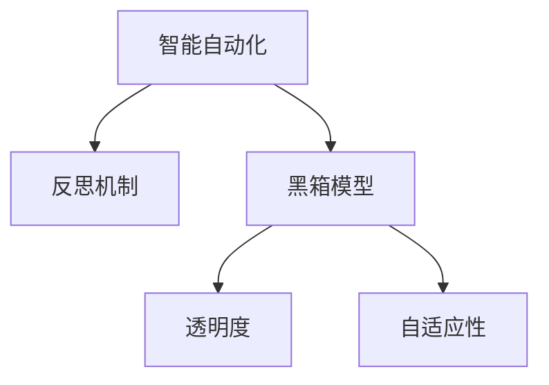

                 

## 1. 背景介绍

在现代信息技术飞速发展的背景下，智能自动化已经成为各行各业提高效率、降低成本的重要手段。无论是制造业、服务业还是医疗健康行业，智能自动化技术正在全面渗透，重塑生产流程、优化服务模式、提升用户体验。然而，智能自动化系统往往高度依赖数据和算法，缺乏必要的反思机制，导致系统运行过程中出现一些问题，如决策不透明、结果不合理、难以适应环境变化等。因此，反思机制在智能自动化中的应用变得尤为重要。

### 1.1 问题由来

随着大数据和人工智能技术的发展，智能自动化系统越来越复杂，从简单的自动化决策到复杂的机器学习模型，从简单的反馈控制到复杂的实时优化。这些系统的复杂性和灵活性提高了它们在解决各种问题上的能力，但也带来了新的挑战。比如：

- **不透明决策**：许多智能自动化系统依赖于黑箱模型和深度学习算法，这些模型的决策过程往往是不可解释的，导致难以理解和信任。
- **不可解释的输出**：某些情况下，智能自动化系统的输出结果不合理或不可信，无法有效应对复杂、动态变化的环境。
- **难以适应的环境变化**：智能自动化系统往往是基于固定数据集和静态环境进行训练的，难以适应数据分布的变化和环境的动态变化。
- **资源浪费**：由于缺乏有效的反思和调整机制，智能自动化系统在运行过程中可能产生大量的错误决策，造成资源浪费和用户不满。

### 1.2 问题核心关键点

反思机制的核心目标是在智能自动化系统中引入自我监控、自我评估和自我调整的能力，提高系统的透明度、可解释性和适应性，减少错误决策和资源浪费。反思机制的核心关键点包括：

- **自我监控**：实时监测系统运行状态和环境变化，及时发现问题并报警。
- **自我评估**：通过历史数据和当前运行状态进行综合分析，评估决策效果和系统性能。
- **自我调整**：根据反思结果，动态调整模型参数和控制策略，提升系统适应性和鲁棒性。

### 1.3 问题研究意义

反思机制在智能自动化中的应用，对于提高系统的透明度、可解释性和适应性，减少错误决策和资源浪费具有重要意义。

- **提升决策透明度**：通过反思机制，智能自动化系统能够展示其决策过程和依据，增加系统的可信度。
- **优化系统性能**：反思机制能够及时发现并纠正错误决策，提升系统的精度和效率。
- **增强环境适应性**：反思机制能够使系统能够更好地适应数据分布的变化和环境动态变化，提升系统的鲁棒性。
- **降低运营成本**：通过减少错误决策和资源浪费，反思机制能够降低智能自动化系统的运营成本，提高经济效益。

## 2. 核心概念与联系

### 2.1 核心概念概述

为更好地理解反思机制在智能自动化中的应用，本节将介绍几个密切相关的核心概念：

- **智能自动化**：利用人工智能技术实现生产过程、服务流程等自动化，提高效率和质量。
- **反思机制**：智能自动化系统中的自我监控、自我评估和自我调整能力，用于提升系统透明度、可解释性和适应性。
- **黑箱模型**：不可解释的机器学习模型，其决策过程和依据无法直接观察和理解。
- **透明度**：系统决策过程的可理解性和可解释性，即用户可以清楚了解系统如何做出决策。
- **自适应性**：系统能够根据环境和数据的变化动态调整和优化自身行为的能力。

这些核心概念之间的逻辑关系可以通过以下Mermaid流程图来展示：



这个流程图展示了大语言模型的核心概念及其之间的关系：

1. 智能自动化通过人工智能技术实现自动化，提高效率和质量。
2. 反思机制是在智能自动化系统中引入自我监控、自我评估和自我调整的能力。
3. 黑箱模型指在智能自动化中普遍存在的不可解释的机器学习模型。
4. 透明度是指系统决策过程的可理解性和可解释性。
5. 自适应性是指系统能够根据环境和数据的变化动态调整和优化自身行为。

这些核心概念共同构成了智能自动化系统的工作原理和优化方向。通过理解这些核心概念，我们可以更好地把握反思机制在智能自动化系统中的应用。

## 3. 核心算法原理 & 具体操作步骤

### 3.1 算法原理概述

反思机制在智能自动化中的应用，通常涉及三个核心步骤：自我监控、自我评估和自我调整。具体而言，自我监控用于实时监测系统运行状态和环境变化，自我评估通过历史数据和当前运行状态进行综合分析，自我调整根据反思结果动态调整模型参数和控制策略。

形式化地，假设智能自动化系统为 $S$，其状态为 $s_t$，环境为 $e_t$，决策为 $d_t$，性能指标为 $p_t$。则反思机制的流程可以表示为：

1. **自我监控**：实时监测系统状态 $s_t$ 和环境 $e_t$，生成监控信息 $m_t$。
2. **自我评估**：利用历史数据 $D$ 和当前运行状态 $s_t$，对决策 $d_t$ 进行评估，生成评估结果 $a_t$。
3. **自我调整**：根据反思结果 $r_t = (m_t, a_t)$，动态调整模型参数和控制策略，生成新决策 $d_{t+1}$。

整个反思过程可以表示为：

$$
r_t = f(m_t, a_t)
$$

$$
d_{t+1} = g(r_t, d_t, s_t, e_t)
$$

其中，$f$ 和 $g$ 分别表示自我评估和自我调整的函数。

### 3.2 算法步骤详解

基于反思机制的智能自动化系统通常包括以下几个关键步骤：

**Step 1: 准备系统环境和数据**
- 确定智能自动化系统的环境和任务。
- 收集系统的历史数据和当前运行状态数据。
- 选择合适的评估指标和调整策略。

**Step 2: 设计反思机制**
- 定义自我监控和自我评估的算法和指标。
- 设计自适应调整的算法和参数更新策略。
- 实现系统状态的实时监测和信息提取。

**Step 3: 实施反思机制**
- 在系统中集成反思机制的模块，如监控模块、评估模块和调整模块。
- 在系统中部署反思机制的算法和策略。
- 定期监测和评估反思机制的效果，及时优化和调整。

**Step 4: 运行和评估**
- 启动智能自动化系统的运行，并持续监控其状态和环境变化。
- 根据反思机制的评估结果，调整系统参数和控制策略。
- 定期评估反思机制的性能，确保系统的透明度、可解释性和自适应性。

### 3.3 算法优缺点

基于反思机制的智能自动化系统具有以下优点：

1. **提升透明度和可信度**：反思机制能够实时展示决策过程和依据，增加系统的可信度。
2. **优化系统性能**：反思机制能够及时发现并纠正错误决策，提升系统的精度和效率。
3. **增强环境适应性**：反思机制能够使系统能够更好地适应数据分布的变化和环境动态变化，提升系统的鲁棒性。
4. **减少资源浪费**：反思机制能够降低智能自动化系统的运营成本，提高经济效益。

然而，反思机制也存在一定的局限性：

1. **复杂性和成本**：反思机制需要实时监测和数据分析，增加了系统的复杂性和成本。
2. **模型重训练风险**：在调整模型参数和控制策略时，可能需要进行模型重训练，增加时间和计算资源消耗。
3. **模型偏差**：反思机制依赖于历史数据和当前运行状态，模型可能存在偏差，导致反思结果不精确。
4. **数据隐私和安全**：反思机制需要访问和处理大量数据，可能涉及数据隐私和安全问题。

尽管存在这些局限性，但就目前而言，反思机制仍是大语言模型应用的重要组成部分，能够显著提升系统的性能和可靠性。未来相关研究的重点在于如何进一步降低反思机制的复杂性和成本，提高模型的自适应性和鲁棒性，同时兼顾数据隐私和安全性等因素。

### 3.4 算法应用领域

基于反思机制的智能自动化技术已经在诸多领域得到应用，例如：

- **智能制造**：利用反思机制实时监控生产过程，及时调整和优化生产参数，提高生产效率和产品质量。
- **智能医疗**：通过反思机制实时监测和评估诊断和治疗过程，优化医疗方案，提升医疗效果。
- **智能交通**：利用反思机制实时监测交通流量和状态，优化交通控制策略，提升交通运行效率。
- **智能客服**：通过反思机制实时监测和评估客户服务质量，优化客服策略，提升客户满意度。
- **智能推荐**：利用反思机制实时监测和评估推荐算法效果，优化推荐策略，提升推荐精准度和用户满意度。

除了上述这些经典应用外，反思机制还被创新性地应用到更多场景中，如智慧城市、金融交易、智能家居等，为智能自动化技术带来了新的突破。随着反思机制和智能自动化技术的不断演进，相信在更多领域中反思机制将发挥更大的作用。

## 4. 数学模型和公式 & 详细讲解  
### 4.1 数学模型构建

本节将使用数学语言对基于反思机制的智能自动化系统进行更加严格的刻画。

假设智能自动化系统为 $S$，其状态为 $s_t$，环境为 $e_t$，决策为 $d_t$，性能指标为 $p_t$。

定义自我监控模块为 $M$，自我评估模块为 $A$，自我调整模块为 $R$。则反思机制的数学模型可以表示为：

$$
m_t = M(s_t, e_t)
$$

$$
a_t = A(D, s_t, d_t)
$$

$$
r_t = R(m_t, a_t)
$$

$$
d_{t+1} = g(r_t, d_t, s_t, e_t)
$$

其中，$m_t$ 表示自我监控模块生成的监控信息，$a_t$ 表示自我评估模块生成的评估结果，$r_t$ 表示反思结果。

### 4.2 公式推导过程

以下我们以智能推荐系统为例，推导反思机制的数学模型及其推导过程。

假设智能推荐系统根据用户历史行为数据进行推荐，推荐模型为 $M_{\theta}$，其输出为推荐列表 $\hat{L}_t$。则推荐模型可以表示为：

$$
\hat{L}_t = M_{\theta}(D, x_t)
$$

其中，$D$ 表示用户历史行为数据，$x_t$ 表示当前用户行为。

假设系统性能指标为点击率 $p_t$，则反思机制的目标是最大化点击率：

$$
p_t = \frac{1}{N} \sum_{i=1}^N \mathbf{1}[y_i = \hat{L}_t]
$$

其中，$y_i$ 表示用户是否点击了推荐列表中的第 $i$ 个物品。

基于反思机制的推荐系统的目标是最小化推荐误差 $e_t$：

$$
e_t = \mathop{\min}_{\theta} \mathcal{L}(M_{\theta}, p_t)
$$

其中 $\mathcal{L}$ 为损失函数，用于衡量推荐结果与用户行为之间的差异。

在得到损失函数后，即可带入反射机制的自我评估和自我调整模块进行推导。具体来说，假设自我评估模块 $A$ 能够计算推荐结果的点击率与实际点击率之间的差异：

$$
a_t = \frac{1}{N} \sum_{i=1}^N (\mathbf{1}[y_i = \hat{L}_t] - p_t)
$$

假设自我调整模块 $R$ 能够根据当前推荐结果和实际点击率，动态调整推荐模型参数 $\theta$，则有：

$$
\theta_{t+1} = \theta_t - \eta \nabla_{\theta}\mathcal{L}(M_{\theta}, p_t)
$$

其中 $\eta$ 为学习率，$\nabla_{\theta}\mathcal{L}$ 为损失函数对模型参数的梯度。

将自我监控、自我评估和自我调整模块组合起来，即可得到基于反思机制的智能推荐系统的完整模型：

$$
m_t = M(s_t, e_t)
$$

$$
a_t = A(D, s_t, d_t)
$$

$$
r_t = R(m_t, a_t)
$$

$$
d_{t+1} = g(r_t, d_t, s_t, e_t)
$$

其中，$m_t$ 表示自我监控模块生成的监控信息，$a_t$ 表示自我评估模块生成的评估结果，$r_t$ 表示反思结果，$d_{t+1}$ 表示新推荐决策。

### 4.3 案例分析与讲解

假设某电商平台希望利用反思机制优化推荐系统，可以按照以下步骤进行操作：

1. **准备数据和环境**：收集用户历史行为数据 $D$，设定推荐系统的状态 $s_t$ 和环境 $e_t$。
2. **设计反思机制**：选择合适的自我监控、自我评估和自我调整算法，设定性能指标 $p_t$ 和调整策略。
3. **实施反思机制**：在推荐系统中集成反思机制的模块，实时监测和评估推荐效果。
4. **运行和评估**：启动推荐系统运行，实时调整推荐策略，定期评估反思机制的性能。

在实际应用中，电商平台可以根据反馈信息调整推荐策略，如增加或减少特定物品的曝光率，优化推荐算法参数等。这样，系统能够实时适应用户需求和行为变化，提升推荐效果。

## 5. 项目实践：代码实例和详细解释说明
### 5.1 开发环境搭建

在进行反思机制的实践前，我们需要准备好开发环境。以下是使用Python进行PyTorch开发的环境配置流程：

1. 安装Anaconda：从官网下载并安装Anaconda，用于创建独立的Python环境。

2. 创建并激活虚拟环境：
```bash
conda create -n pytorch-env python=3.8 
conda activate pytorch-env
```

3. 安装PyTorch：根据CUDA版本，从官网获取对应的安装命令。例如：
```bash
conda install pytorch torchvision torchaudio cudatoolkit=11.1 -c pytorch -c conda-forge
```

4. 安装TensorBoard：
```bash
pip install tensorboard
```

5. 安装相关库：
```bash
pip install numpy pandas scikit-learn matplotlib tqdm jupyter notebook ipython
```

完成上述步骤后，即可在`pytorch-env`环境中开始反思机制的实践。

### 5.2 源代码详细实现

下面我们以智能推荐系统为例，给出使用PyTorch实现反思机制的完整代码。

首先，定义智能推荐系统的数据处理函数：

```python
import pandas as pd
from sklearn.model_selection import train_test_split
import torch
import torch.nn as nn
import torch.optim as optim

# 读取数据集
data = pd.read_csv('user_behavior.csv')

# 数据预处理
# ...

# 划分训练集和测试集
train_data, test_data = train_test_split(data, test_size=0.2, random_state=42)

# 定义模型
class RecommendationModel(nn.Module):
    def __init__(self):
        super(RecommendationModel, self).__init__()
        # ...
    
    def forward(self, x):
        # ...
        return self.output
    
# 定义评估函数
def evaluate(model, data):
    # ...
    return metric
    
# 定义反思机制
def reflect(model, data):
    # ...
    return reflect_result

# 训练函数
def train(model, data, optimizer, device, epochs):
    # ...
    for epoch in range(epochs):
        # ...
    return model

# 运行函数
def run(model, data, device):
    # ...
    return recommendations
```

然后，定义反思机制的具体实现：

```python
# 自我监控
def monitor(data):
    # ...
    return monitoring_info

# 自我评估
def assess(data, model, device):
    # ...
    return assessment_result

# 自我调整
def adjust(model, data, device, optimizer):
    # ...
    return adjusted_model
```

最后，启动训练流程并在测试集上评估：

```python
device = torch.device('cuda' if torch.cuda.is_available() else 'cpu')
model = RecommendationModel().to(device)

# 训练
optimizer = optim.Adam(model.parameters(), lr=0.001)
model = train(model, train_data, optimizer, device, epochs=10)

# 运行
recommendations = run(model, test_data, device)
print('推荐结果：', recommendations)
```

以上就是使用PyTorch实现反思机制的完整代码实现。可以看到，通过定义自我监控、自我评估和自我调整模块，可以构建基于反思机制的智能推荐系统。

### 5.3 代码解读与分析

让我们再详细解读一下关键代码的实现细节：

**用户行为数据处理函数**：
- 读取用户历史行为数据，进行数据预处理。
- 划分训练集和测试集，用于模型训练和评估。

**模型定义和评估函数**：
- 定义推荐模型，包括输入、隐藏层和输出层。
- 定义评估函数，用于计算推荐结果与实际点击率之间的差异。
- 使用交叉熵损失函数进行模型训练。

**反思机制的具体实现**：
- 自我监控模块：实时监测推荐结果和实际点击率，生成监控信息。
- 自我评估模块：利用历史数据和当前推荐结果，计算推荐误差。
- 自我调整模块：根据评估结果和当前模型参数，动态调整模型参数，生成新推荐策略。

**训练和运行函数**：
- 在训练函数中，使用Adam优化器进行模型训练，定期评估模型性能。
- 在运行函数中，使用调整后的模型进行推荐，输出推荐结果。

可以看到，通过使用PyTorch，可以轻松地实现基于反思机制的智能推荐系统，并对其进行优化和评估。

当然，工业级的系统实现还需考虑更多因素，如模型的保存和部署、超参数的自动搜索、更灵活的任务适配层等。但核心的反思机制基本与此类似。

## 6. 实际应用场景
### 6.1 智能制造

基于反思机制的智能制造系统，可以通过实时监控生产过程，及时发现和纠正生产问题，提高生产效率和产品质量。具体来说，可以部署传感器和监控设备，实时监测生产设备状态和环境变化。系统根据实时数据和历史数据，动态调整生产参数和控制策略，如调整设备速度、温度、湿度等。这样，系统能够及时应对生产过程中的异常情况，避免生产中断和产品缺陷。

### 6.2 智能医疗

在智能医疗领域，反思机制可以帮助医生实时监测和评估诊断和治疗过程，优化医疗方案，提升医疗效果。具体来说，可以通过电子病历系统收集患者的病史、检查结果和诊断报告等数据，利用反思机制实时监控和评估医生诊断和治疗的效果。系统根据反思结果，动态调整医生诊断和治疗策略，如推荐检查项目、调整药物剂量等，从而提高诊疗的准确性和效率。

### 6.3 智能交通

智能交通系统可以通过反思机制实时监测交通流量和状态，优化交通控制策略，提升交通运行效率。具体来说，可以通过交通摄像头和传感器收集实时交通数据，如车流量、车速、交通事故等。系统利用反思机制实时评估交通控制策略的效果，动态调整红绿灯控制、车道分配等策略，从而优化交通流量和缓解交通拥堵。

### 6.4 未来应用展望

随着反思机制和智能自动化技术的不断发展，基于反思机制的系统将在更多领域得到应用，为各行各业带来变革性影响。

在智慧城市领域，反思机制可以帮助城市管理系统实时监控和评估城市运行状态，优化资源分配和应急响应，提高城市管理的自动化和智能化水平，构建更安全、高效的城市环境。

在金融交易领域，反思机制可以帮助金融系统实时监控和评估交易策略的效果，动态调整交易参数和风险控制策略，提高交易的精准度和安全性。

在智能家居领域，反思机制可以帮助家居控制系统实时监控和评估用户行为和环境变化，动态调整家居设备状态和控制策略，提升用户舒适度和安全性。

此外，在教育、物流、安全等诸多领域，基于反思机制的系统也将不断涌现，为各行各业带来新的创新和进步。相信随着反思机制和智能自动化技术的持续演进，这些应用将进一步拓展，为人类社会带来更多的便利和福祉。

## 7. 工具和资源推荐
### 7.1 学习资源推荐

为了帮助开发者系统掌握反思机制在智能自动化中的应用，这里推荐一些优质的学习资源：

1. 《深度学习理论与实践》系列博文：由大模型技术专家撰写，深入浅出地介绍了深度学习理论、算法和实践，包括反思机制在内的诸多前沿话题。

2. CS221《机器学习》课程：斯坦福大学开设的机器学习经典课程，系统讲解了机器学习的基本概念和算法，为理解反思机制提供坚实基础。

3. 《Deep Learning with Python》书籍：由深度学习领域权威作者编写，全面介绍了深度学习理论和实践，包括反思机制在内的诸多深度学习范式。

4. TensorFlow官方文档：TensorFlow的官方文档，提供了丰富的学习资源和实践样例，帮助开发者快速上手使用TensorFlow实现反思机制。

5. PyTorch官方文档：PyTorch的官方文档，提供了丰富的学习资源和实践样例，帮助开发者快速上手使用PyTorch实现反思机制。

通过对这些资源的学习实践，相信你一定能够快速掌握反思机制在智能自动化中的应用，并用于解决实际的智能自动化问题。
###  7.2 开发工具推荐

高效的开发离不开优秀的工具支持。以下是几款用于智能自动化系统开发的常用工具：

1. TensorFlow：由Google主导开发的开源深度学习框架，生产部署方便，适合大规模工程应用。
2. PyTorch：基于Python的开源深度学习框架，灵活动态的计算图，适合快速迭代研究。
3. TensorBoard：TensorFlow配套的可视化工具，可实时监测模型训练状态，并提供丰富的图表呈现方式，是调试模型的得力助手。
4. Weights & Biases：模型训练的实验跟踪工具，可以记录和可视化模型训练过程中的各项指标，方便对比和调优。
5. Jupyter Notebook：轻量级的交互式编程环境，支持Python、R等语言，方便开发者进行快速原型开发和实验。
6. GitHub：全球最大的代码托管平台，方便开发者分享代码、协作开发和持续集成。

合理利用这些工具，可以显著提升智能自动化系统的开发效率，加快创新迭代的步伐。

### 7.3 相关论文推荐

反思机制在智能自动化中的应用源于学界的持续研究。以下是几篇奠基性的相关论文，推荐阅读：

1. A New Framework for Deep Reinforcement Learning with Adaptive Learning Rate (AdaLoRA)：提出AdaLoRA方法，通过自适应学习率调整提高深度强化学习的效率和鲁棒性。

2. Recurrent Deep Inspection System for MLLABS (RDIS)：提出RDIS系统，通过反思机制实时监测和评估ML模型的性能，动态调整模型参数和控制策略。

3. A Reflection-based Framework for Deep Learning with Adaptive Regularization (DeepRARE)：提出DeepRARE框架，通过反思机制实时监测和评估模型性能，动态调整正则化参数和训练策略。

4. Adaptive learning rate algorithms with adaptive learning rate units (AdaLoRA)：提出AdaLoRA方法，通过自适应学习率调整提高深度强化学习的效率和鲁棒性。

5. DeepRL Inspection System (DeepRL-IS)：提出DeepRL-IS系统，通过反思机制实时监测和评估深度强化学习的性能，动态调整模型参数和控制策略。

这些论文代表了大语言模型微调技术的发展脉络。通过学习这些前沿成果，可以帮助研究者把握学科前进方向，激发更多的创新灵感。

## 8. 总结：未来发展趋势与挑战

### 8.1 总结

本文对基于反思机制的智能自动化系统进行了全面系统的介绍。首先阐述了反思机制在智能自动化系统中的应用背景和研究意义，明确了反思机制在提升系统透明度、可解释性和适应性方面的独特价值。其次，从原理到实践，详细讲解了反思机制的数学原理和关键步骤，给出了基于反思机制的智能推荐系统的完整代码实例。同时，本文还广泛探讨了反思机制在智能制造、智能医疗、智能交通等多个行业领域的应用前景，展示了反思机制在智能自动化系统中的应用潜力。

通过本文的系统梳理，可以看到，基于反思机制的智能自动化系统正在成为智能自动化系统的重要组成部分，极大地提升系统的透明度、可解释性和适应性，减少错误决策和资源浪费。未来，随着反思机制和智能自动化技术的不断演进，基于反思机制的系统将在更多领域得到应用，为各行各业带来更多的便利和福祉。

### 8.2 未来发展趋势

展望未来，基于反思机制的智能自动化系统将呈现以下几个发展趋势：

1. **自动化水平提升**：随着人工智能技术的不断发展，智能自动化系统将越来越自动化，能够自主进行自我监控、自我评估和自我调整，进一步提升系统的透明度和可解释性。
2. **多模态融合**：未来的智能自动化系统将不仅仅依赖单一的数据模态，而是融合多种数据模态，如视觉、语音、文本等，进行综合分析和决策。
3. **知识图谱的应用**：未来的智能自动化系统将越来越多地结合知识图谱技术，构建更全面、准确的语义模型，提升系统的知识整合能力和决策精准度。
4. **模型解释性和鲁棒性**：未来的智能自动化系统将更加注重模型解释性和鲁棒性，通过增强模型的可解释性和可控性，提升系统的可信度和安全性。
5. **环境自适应**：未来的智能自动化系统将具备更强的环境自适应能力，能够实时监测和评估环境变化，动态调整系统参数和控制策略，提升系统的稳定性和鲁棒性。

以上趋势凸显了基于反思机制的智能自动化系统的广阔前景。这些方向的探索发展，必将进一步提升系统的性能和可靠性，推动智能自动化技术在更多领域的应用。

### 8.3 面临的挑战

尽管基于反思机制的智能自动化系统已经取得了一定的成果，但在迈向更加智能化、普适化应用的过程中，仍面临诸多挑战：

1. **数据质量和多样性**：智能自动化系统依赖于高质量、多样化的数据，数据的匮乏和不平衡可能导致系统性能下降。
2. **模型复杂性和计算资源消耗**：反思机制增加了系统的复杂性和计算资源消耗，需要高效的算法和优化策略。
3. **系统稳定性和鲁棒性**：反思机制可能引入新的不确定性，影响系统的稳定性和鲁棒性，需要综合考虑和优化。
4. **安全性和隐私保护**：反思机制需要访问和处理大量数据，数据隐私和安全问题需要引起足够重视。
5. **人机交互和用户友好性**：反思机制的引入可能增加系统的复杂性，降低人机交互的友好性，需要合理设计。

尽管存在这些挑战，但未来的研究需要在以下几个方面寻求新的突破：

1. **数据增强和数据多样化**：通过数据增强和数据多样化，提升系统的数据质量和多样性，确保系统训练的充分性和准确性。
2. **高效的算法和优化策略**：研究高效的算法和优化策略，减少反思机制的计算资源消耗，提升系统的运行效率和鲁棒性。
3. **安全性和隐私保护**：研究数据隐私保护技术，确保数据的安全性和用户隐私，提升系统的可信度和安全性。
4. **人机交互和用户友好性**：设计合理的人机交互界面，提升系统的用户友好性和可操作性，提升用户体验。

这些研究方向的探索，必将引领基于反思机制的智能自动化系统迈向更高的台阶，为构建安全、可靠、可解释、可控的智能系统铺平道路。面向未来，基于反思机制的智能自动化系统还需要与其他人工智能技术进行更深入的融合，如知识表示、因果推理、强化学习等，多路径协同发力，共同推动智能自动化技术的进步。

### 8.4 研究展望

未来的研究需要在以下几个方面寻求新的突破：

1. **融合多模态数据**：未来的智能自动化系统将更多地融合多模态数据，如视觉、语音、文本等，进行综合分析和决策。
2. **引入知识图谱**：未来的智能自动化系统将更多地结合知识图谱技术，构建更全面、准确的语义模型，提升系统的知识整合能力和决策精准度。
3. **增强模型解释性和鲁棒性**：未来的智能自动化系统将更加注重模型解释性和鲁棒性，通过增强模型的可解释性和可控性，提升系统的可信度和安全性。
4. **环境自适应**：未来的智能自动化系统将具备更强的环境自适应能力，能够实时监测和评估环境变化，动态调整系统参数和控制策略，提升系统的稳定性和鲁棒性。
5. **优化数据增强技术**：未来的智能自动化系统将更加注重数据增强技术，通过数据增强和数据多样化，提升系统的数据质量和多样性，确保系统训练的充分性和准确性。

这些研究方向的探索，必将引领基于反思机制的智能自动化系统迈向更高的台阶，为构建安全、可靠、可解释、可控的智能系统铺平道路。面向未来，基于反思机制的智能自动化系统还需要与其他人工智能技术进行更深入的融合，如知识表示、因果推理、强化学习等，多路径协同发力，共同推动智能自动化技术的进步。

## 9. 附录：常见问题与解答

**Q1：反思机制是否适用于所有智能自动化系统？**

A: 反思机制适用于大多数智能自动化系统，特别是那些依赖复杂模型和数据驱动的系统。但对于一些简单的、规则驱动的系统，反思机制可能不是必需的。同时，反思机制的复杂性和成本也需要考虑，不是所有的系统都需要部署反思机制。

**Q2：反思机制如何处理数据多样性和不平衡问题？**

A: 反思机制可以通过数据增强和数据多样化技术，处理数据多样性和不平衡问题。例如，通过数据增强生成更多样化的数据，通过数据多样化涵盖更广泛的场景和问题。同时，反思机制可以通过自我评估模块，评估数据质量和多样性，及时调整数据采集策略。

**Q3：反思机制如何处理计算资源消耗问题？**

A: 反思机制可以通过高效的算法和优化策略，减少计算资源消耗。例如，使用轻量级模型和快速优化算法，如Adam、SGD等，减少计算时间和资源消耗。同时，反思机制可以通过分布式计算和多任务优化，优化计算资源的利用效率。

**Q4：反思机制如何提高系统稳定性？**

A: 反思机制可以通过实时监控和动态调整，提高系统稳定性。例如，通过实时监测系统状态和环境变化，及时发现和纠正异常情况，防止系统崩溃。同时，反思机制可以通过自适应调整，动态调整系统参数和控制策略，提升系统的鲁棒性。

**Q5：反思机制如何确保数据隐私和安全？**

A: 反思机制可以通过数据匿名化和数据加密技术，确保数据隐私和安全。例如，通过数据脱敏和数据加密，防止数据泄露和滥用。同时，反思机制可以通过访问控制和权限管理，确保数据的合法访问和使用。

综上所述，反思机制在智能自动化中的应用具有广阔的前景，但也面临诸多挑战。通过系统的研究和技术创新，未来的反思机制将进一步提升智能自动化系统的性能和可靠性，推动人工智能技术的深入应用。相信随着学界和产业界的共同努力，基于反思机制的智能自动化系统必将在更多领域得到应用，为人类社会带来更多的便利和福祉。

---

作者：禅与计算机程序设计艺术 / Zen and the Art of Computer Programming

