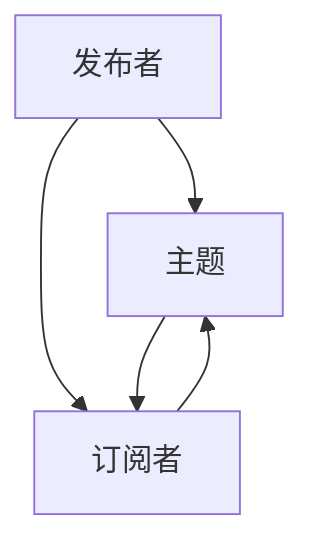

                 

# 发布订阅 原理与代码实例讲解

> 关键词：发布订阅,消息队列,事件驱动,观察者,事件驱动架构,观察者模式

## 1. 背景介绍

### 1.1 问题由来
在软件工程领域，随着系统复杂度的不断提升，传统的单体应用架构逐渐向微服务化、分布式化演变。为了应对大规模、高并发的系统需求，架构设计师们引入了诸多中间件技术，其中就包括消息队列与发布订阅模式。这些技术大大提升了系统的弹性、灵活性和稳定性，但也带来了新的设计挑战，如如何设计灵活、高效、可维护的消息传递机制。

### 1.2 问题核心关键点
发布订阅（Publish-Subscribe, Pub/Sub）是一种消息传递机制，由发布者（Publisher）发布消息（Message），订阅者（Subscriber）根据消息内容进行响应。该模式以其灵活、异步、解耦的特性，广泛应用于事件驱动架构（Event-Driven Architecture, EDA）和观察者模式（Observer Pattern）中。但实践中，发布订阅模式的复杂性、性能瓶颈、可靠性保证等问题也成为其技术瓶颈。

## 2. 核心概念与联系

### 2.1 核心概念概述

为更好地理解发布订阅模式的工作原理和应用场景，本节将介绍几个关键概念：

- **发布者(Publisher)**：负责创建和发送消息的对象，其作用是传递消息给订阅者。
- **订阅者(Subscriber)**：负责接收和处理消息的对象，其作用是根据消息内容进行相应的操作。
- **消息(Message)**：由发布者发送的、包含具体业务逻辑的数据单元。
- **主题(Topic)**：一种消息分类方式，不同的主题可以聚合多种相关消息。
- **订阅(Subscription)**：订阅者与主题之间的关联，订阅者可以订阅多个主题，每个主题可以有多个订阅者。
- **观察者模式(Observer Pattern)**：一种设计模式，通过将主题与订阅者解耦，实现一种松耦合的消息传递机制。

这些概念之间的逻辑关系可以通过以下Mermaid流程图来展示：



这个流程图展示了发布订阅模式的简单逻辑：发布者向主题发布消息，订阅者则根据主题接收和处理消息，发布者与订阅者之间通过主题进行解耦。

## 3. 核心算法原理 & 具体操作步骤
### 3.1 算法原理概述

发布订阅模式的工作原理大致如下：

1. **发布者发布消息**：发布者创建并发送一条消息到指定主题。
2. **订阅者订阅主题**：订阅者选择感兴趣的主题，并注册接收该主题的最新消息。
3. **消息传递与处理**：当发布者发送消息到指定主题时，所有订阅该主题的订阅者都会接收到该消息，并根据消息内容进行处理。

这一过程中，消息传递与处理的过程是异步的，订阅者可以在任何时间接收到发布者发布的消息，并且可以按照自身逻辑进行处理。这种异步、解耦的特性，使得发布订阅模式非常适合处理高并发、高弹性的系统需求。

### 3.2 算法步骤详解

以Java平台上的Apache Kafka为例，展示发布订阅模式的具体实现步骤：

1. **创建主题**：
   ```java
   KafkaProducer<String, String> producer = new KafkaProducer<>(config);
   producer.send(new ProducerRecord<String, String>("my-topic", "my-key", "my-value"));
   ```

2. **订阅主题**：
   ```java
   KafkaConsumer<String, String> consumer = new KafkaConsumer<>(config);
   consumer.subscribe(Arrays.asList("my-topic"));
   ```

3. **接收与处理消息**：
   ```java
   while (true) {
       ConsumerRecords<String, String> records = consumer.poll(Duration.ofMillis(100));
       for (ConsumerRecord<String, String> record : records) {
           System.out.printf("offset = %d, key = %s, value = %s%n", record.offset(), record.key(), record.value());
           // 处理消息逻辑
       }
   }
   ```

以上是Apache Kafka在Java平台上的发布订阅实现步骤，其中包含了主题创建、消息发送、主题订阅和消息接收处理等关键环节。

### 3.3 算法优缺点

发布订阅模式的主要优点包括：

1. **异步处理**：发布者发送消息后，订阅者可以在任意时间接收到消息，可以实现真正的异步处理。
2. **解耦合**：发布者与订阅者之间通过主题进行解耦，相互独立，提高了系统的灵活性和可维护性。
3. **高效性**：发布订阅模式可以处理高并发、高弹性的系统需求，适合大规模分布式系统。
4. **可扩展性**：主题可以扩展到任意数量的订阅者，支持水平扩展。

同时，发布订阅模式也存在一些局限：

1. **处理延迟**：由于异步处理特性，消息传递可能会有一定的延迟。
2. **可靠性问题**：如何保证消息的可靠性和一致性，是发布订阅模式的一个重要挑战。
3. **系统复杂度**：发布订阅模式可能会引入一定的系统复杂度，特别是在处理高并发、高可靠的系统需求时，需要仔细设计。

## 4. 数学模型和公式 & 详细讲解 & 举例说明
### 4.1 数学模型构建

本节将使用数学语言对发布订阅模式进行更加严格的刻画。

假设发布者发布的消息序列为 $M=\{m_1, m_2, \ldots, m_n\}$，其中每个消息 $m_i$ 包含一个唯一的消息ID $id_i$ 和对应的数据 $d_i$。订阅者 $S$ 订阅了主题 $T$，并定义了消息处理函数 $f$，用于对每个消息进行处理。发布订阅模型的数学模型可以描述为：

$$
F = \{ (p_i,s_i) | p_i \in M, s_i \in S, p_i \text{ 发布给 } s_i \}
$$

其中，$p_i$ 表示发布者 $p$ 发布的消息，$s_i$ 表示订阅者 $s$ 订阅的主题。发布订阅的过程可以看作是从消息序列 $M$ 到订阅者集合 $S$ 的映射。

### 4.2 公式推导过程

在数学模型中，发布订阅过程可以看作是从消息序列 $M$ 到订阅者集合 $S$ 的映射。如果将消息 $m_i$ 视为事件 $e_i$，那么发布订阅过程就可以表示为事件 $e$ 到订阅者 $s$ 的映射。

以Apache Kafka为例，其发布订阅过程可以表示为：

$$
F = \{ (p_i,s_i) | p_i \in M, s_i \in S, p_i \text{ 发布给 } s_i \}
$$

其中，$p_i$ 表示发布者 $p$ 发布的消息，$s_i$ 表示订阅者 $s$ 订阅的主题。发布订阅的过程可以看作是从消息序列 $M$ 到订阅者集合 $S$ 的映射。

在实际应用中，发布订阅过程还涉及一些具体的技术实现细节，如消息的可靠传输、订阅者的重试机制等。这些技术细节需要通过具体的代码实现来保证。

### 4.3 案例分析与讲解

以Apache Kafka为例，展示发布订阅模式的具体应用场景。

假设有一个电商平台，需要处理用户的下单信息、支付信息等。为了方便处理，可以使用发布订阅模式来解耦不同的业务模块。例如，用户下单信息可以通过消息队列传递给订单模块、库存模块、支付模块等，每个模块独立处理对应的消息，最终完成订单处理流程。

具体实现步骤如下：

1. **创建主题**：
   ```java
   KafkaProducer<String, String> producer = new KafkaProducer<>(config);
   producer.send(new ProducerRecord<String, String>("order-topic", "user-id", "order-id"));
   producer.send(new ProducerRecord<String, String>("inventory-topic", "product-id", "quantity"));
   producer.send(new ProducerRecord<String, String>("payment-topic", "user-id", "amount"));
   ```

2. **订阅主题**：
   ```java
   KafkaConsumer<String, String> orderConsumer = new KafkaConsumer<>(config);
   orderConsumer.subscribe(Arrays.asList("order-topic", "inventory-topic", "payment-topic"));
   
   KafkaConsumer<String, String> inventoryConsumer = new KafkaConsumer<>(config);
   inventoryConsumer.subscribe(Arrays.asList("inventory-topic", "payment-topic"));
   
   KafkaConsumer<String, String> paymentConsumer = new KafkaConsumer<>(config);
   paymentConsumer.subscribe(Arrays.asList("payment-topic", "order-topic"));
   ```

3. **接收与处理消息**：
   ```java
   while (true) {
       ConsumerRecords<String, String> orderRecords = orderConsumer.poll(Duration.ofMillis(100));
       for (ConsumerRecord<String, String> record : orderRecords) {
           System.out.printf("order-topic offset = %d, key = %s, value = %s%n", record.offset(), record.key(), record.value());
           // 处理订单消息
       }
       
       ConsumerRecords<String, String> inventoryRecords = inventoryConsumer.poll(Duration.ofMillis(100));
       for (ConsumerRecord<String, String> record : inventoryRecords) {
           System.out.printf("inventory-topic offset = %d, key = %s, value = %s%n", record.offset(), record.key(), record.value());
           // 处理库存消息
       }
       
       ConsumerRecords<String, String> paymentRecords = paymentConsumer.poll(Duration.ofMillis(100));
       for (ConsumerRecord<String, String> record : paymentRecords) {
           System.out.printf("payment-topic offset = %d, key = %s, value = %s%n", record.offset(), record.key(), record.value());
           // 处理支付消息
       }
   }
   ```

以上是Apache Kafka在Java平台上的发布订阅实现步骤，其中包含了主题创建、消息发送、主题订阅和消息接收处理等关键环节。

## 5. 项目实践：代码实例和详细解释说明
### 5.1 开发环境搭建

在进行发布订阅模式实践前，我们需要准备好开发环境。以下是使用Java开发环境搭建的步骤：

1. 安装JDK：从官网下载并安装JDK，用于编写Java代码。
2. 配置Maven：从官网下载并安装Maven，用于管理Java项目依赖。
3. 创建项目：使用Maven创建新的Java项目，如：
   ```
   mvn archetype:generate -DgroupId=com.example -DartifactId=pubsub-demo -DarchetypeArtifactId=maven-archetype-quickstart -DinteractiveMode=false
   cd pubsub-demo
   ```

### 5.2 源代码详细实现

这里我们以Apache Kafka为例，展示Java平台上的发布订阅模式实现。

首先，创建Kafka Producer和Consumer：

```java
Properties props = new Properties();
props.put("bootstrap.servers", "localhost:9092");
props.put("key.serializer", "org.apache.kafka.common.serialization.StringSerializer");
props.put("value.serializer", "org.apache.kafka.common.serialization.StringSerializer");

KafkaProducer<String, String> producer = new KafkaProducer<>(props);
KafkaConsumer<String, String> consumer = new KafkaConsumer<>(props);
```

接着，创建主题并进行消息发送：

```java
producer.send(new ProducerRecord<String, String>("my-topic", "my-key", "my-value"));
```

然后，订阅主题并进行消息接收处理：

```java
consumer.subscribe(Arrays.asList("my-topic"));
while (true) {
    ConsumerRecords<String, String> records = consumer.poll(Duration.ofMillis(100));
    for (ConsumerRecord<String, String> record : records) {
        System.out.printf("offset = %d, key = %s, value = %s%n", record.offset(), record.key(), record.value());
        // 处理消息逻辑
    }
}
```

以上是Java平台上的发布订阅模式实现，代码简洁明了，包含了消息发送、主题订阅、消息接收处理等关键环节。

### 5.3 代码解读与分析

让我们再详细解读一下关键代码的实现细节：

**KafkaProducer和KafkaConsumer**：
- `Properties` 对象用于配置Kafka客户端的参数，如服务器地址、序列化方式等。
- `KafkaProducer` 用于发送消息，`send` 方法用于将消息发送到指定主题。
- `KafkaConsumer` 用于接收消息，`subscribe` 方法用于订阅指定主题。
- `poll` 方法用于异步获取新的消息，返回一个 `ConsumerRecords` 对象，包含所有新的消息记录。
- 循环处理每个消息记录，可以通过 `offset`、`key`、`value` 获取消息的详细信息，并根据业务需求进行逻辑处理。

**消息发送与接收**：
- 使用 `send` 方法发送消息，可以指定消息的主题、键、值等参数。
- 使用 `subscribe` 方法订阅主题，可以订阅多个主题，实现多主题监听。
- 使用 `poll` 方法异步获取新的消息，可以设置轮询间隔时间，保证系统的响应性和性能。
- 循环处理每个消息记录，可以使用 `offset`、`key`、`value` 获取消息的详细信息，并根据业务需求进行逻辑处理。

**运行结果展示**：
- 运行上述代码，可以看到发布者发送的消息被订阅者接收并处理。
- 可以通过修改 `my-topic`、`my-key`、`my-value` 等参数，来测试不同的消息发送和接收逻辑。
- 可以通过添加异常处理、日志记录等机制，来增强代码的健壮性和可维护性。

## 6. 实际应用场景
### 6.1 事件驱动架构(EDA)

发布订阅模式是事件驱动架构（Event-Driven Architecture, EDA）的核心组件之一。EDA将系统的业务逻辑转化为事件驱动的模型，通过事件来驱动系统的运行。发布订阅模式使得不同模块之间可以独立处理消息，提高了系统的灵活性和可维护性。

例如，电商平台的订单处理流程可以通过发布订阅模式来实现：

1. **订单创建事件**：当用户下单时，订单模块发送订单创建事件到订单处理队列，等待库存模块、支付模块等进行处理。
2. **库存变更事件**：库存模块接收到订单创建事件后，发送库存变更事件到库存处理队列，更新库存信息。
3. **支付完成事件**：支付模块接收到订单创建事件后，发送支付完成事件到支付处理队列，完成支付流程。
4. **订单确认事件**：订单模块接收到支付完成事件后，发送订单确认事件到订单处理队列，完成订单确认流程。

这种事件驱动的方式，使得系统各个模块可以独立处理消息，提高了系统的灵活性和可维护性。

### 6.2 观察者模式(Observer Pattern)

发布订阅模式与观察者模式（Observer Pattern）密切相关。观察者模式是一种设计模式，通过将主题与订阅者解耦，实现一种松耦合的消息传递机制。

例如，在一个银行系统中，账户余额的变化需要通知多个订阅者（如账单系统、通知系统等）进行处理。可以使用发布订阅模式来实现这种需求：

1. **账户余额变化事件**：当账户余额发生变化时，账户模块发送余额变化事件到事件队列，等待订阅者进行处理。
2. **账单更新事件**：账单系统订阅余额变化事件，接收事件并更新账单信息。
3. **通知推送事件**：通知系统订阅余额变化事件，接收事件并推送通知信息。
4. **异常处理事件**：异常处理系统订阅余额变化事件，接收事件并处理异常情况。

这种观察者模式，使得系统各个订阅者可以独立处理事件，提高了系统的灵活性和可维护性。

### 6.3 未来应用展望

发布订阅模式在未来将有更广阔的应用前景。随着分布式、微服务化的应用场景不断增加，发布订阅模式将成为一种不可或缺的消息传递机制。

在智能制造领域，发布订阅模式可以实现设备间的异步通信，提高生产效率和系统稳定性。

在智能交通领域，发布订阅模式可以实现车辆与车辆、车辆与基础设施间的实时通信，提高交通管理和安全水平。

在智慧城市领域，发布订阅模式可以实现不同系统间的异步通信，提高城市管理的自动化和智能化水平。

## 7. 工具和资源推荐
### 7.1 学习资源推荐

为了帮助开发者系统掌握发布订阅模式的理论基础和实践技巧，这里推荐一些优质的学习资源：

1. **《Design Patterns》书籍**：由Erich Gamma等人所著，介绍了常用的23种设计模式，其中就包括观察者模式和发布订阅模式。
2. **《Kafka: The Definitive Guide》书籍**：由Kafka社区成员Tom White所著，全面介绍了Kafka平台的设计理念和实现细节，是学习Kafka的权威教材。
3. **《Event-Driven Architecture》课程**：由Khan Academy提供，系统介绍了事件驱动架构的原理和应用场景，适合初学者入门。
4. **《Apache Kafka Tutorials》文档**：由Apache Kafka社区提供，包含Kafka平台的各类教程和示例代码，是学习Kafka的重要资源。
5. **《Java并发编程》书籍**：由Brian Goetz等人所著，详细介绍了Java并发编程的实现原理和应用技巧，帮助理解发布订阅模式的实现细节。

通过对这些资源的学习实践，相信你一定能够快速掌握发布订阅模式的精髓，并用于解决实际的系统设计问题。

### 7.2 开发工具推荐

高效的开发离不开优秀的工具支持。以下是几款用于发布订阅模式开发的常用工具：

1. **Kafka**：由Apache基金会开源的消息队列平台，支持高并发、高可靠的消息传递，是发布订阅模式的核心组件。
2. **RabbitMQ**：由RabbitMQ公司开源的消息队列平台，支持多种消息传递协议，是企业级应用的首选。
3. **ActiveMQ**：由Apache基金会开源的消息队列平台，支持分布式部署和消息事务处理，适合大规模应用场景。
4. **Storm**：由Apache基金会开源的实时计算平台，支持高并发、高可靠的消息传递，适合实时数据处理应用。
5. **Kubernates**：由Google开源的容器编排平台，支持微服务化的发布订阅模式，适合分布式应用部署。

合理利用这些工具，可以显著提升发布订阅模式的开发效率，加快创新迭代的步伐。

### 7.3 相关论文推荐

发布订阅模式的发展源于学界的持续研究。以下是几篇奠基性的相关论文，推荐阅读：

1. **《The Publisher-Subscriber Model in Large-Scale Distributed Computing》论文**：由Codd、Kapoor等人所著，介绍了发布订阅模式的理论基础和应用场景，奠定了发布订阅模式的研究基础。
2. **《Event-Driven Systems in Network and Systems Programming》论文**：由Weinger等人所著，系统介绍了事件驱动系统的原理和实现技巧，为发布订阅模式的研究提供了理论支持。
3. **《Observability in Practice: Production-Grade Observability, APM, and Distributed Tracing》论文**：由Kronos等开源社区发布，介绍了分布式系统中的观察者模式和发布订阅模式，展示了其在游戏化系统中的应用效果。
4. **《Dissecting the Kafka Architecture》论文**：由Kafka社区成员Tom White所著，全面介绍了Kafka平台的设计理念和实现细节，是学习Kafka的权威文献。

这些论文代表了大规模分布式系统中发布订阅模式的研究脉络。通过学习这些前沿成果，可以帮助研究者把握学科前进方向，激发更多的创新灵感。

## 8. 总结：未来发展趋势与挑战
### 8.1 总结

本文对发布订阅模式进行了全面系统的介绍。首先阐述了发布订阅模式的研究背景和应用场景，明确了发布订阅模式在事件驱动架构和观察者模式中的重要地位。其次，从原理到实践，详细讲解了发布订阅模式的核心算法和具体操作步骤，给出了Java平台上的发布订阅模式代码实现。同时，本文还广泛探讨了发布订阅模式在事件驱动架构、观察者模式等多个领域的应用前景，展示了发布订阅模式的广泛应用价值。

通过本文的系统梳理，可以看到，发布订阅模式在分布式、微服务化的应用场景中具有巨大的应用潜力。发布订阅模式以其灵活、异步、解耦的特性，为系统设计带来了新的思路和方法。未来，随着分布式、微服务化的应用场景不断增加，发布订阅模式将成为一种不可或缺的消息传递机制，推动系统设计的创新与发展。

### 8.2 未来发展趋势

展望未来，发布订阅模式将呈现以下几个发展趋势：

1. **大规模分布式系统**：随着微服务化的普及，发布订阅模式将在更多分布式系统中得到应用，支持高并发、高可靠的消息传递。
2. **跨语言和跨平台支持**：未来的发布订阅模式将支持更多的编程语言和平台，提高其应用范围和灵活性。
3. **实时数据处理**：发布订阅模式将在实时数据处理场景中发挥更大的作用，支持毫秒级的消息传递和处理。
4. **数据流架构**：发布订阅模式将与数据流架构（如Apache Flink、Apache Beam等）相结合，支持数据流的异步处理和状态管理。
5. **事件驱动架构**：发布订阅模式将成为事件驱动架构（EDA）的核心组件，推动EDA的普及和应用。

以上趋势凸显了发布订阅模式的广阔前景。这些方向的探索发展，必将进一步提升系统设计的灵活性和可维护性，为分布式系统带来新的技术突破。

### 8.3 面临的挑战

尽管发布订阅模式已经取得了瞩目成就，但在迈向更加智能化、普适化应用的过程中，它仍面临着诸多挑战：

1. **系统复杂度**：发布订阅模式可能会引入一定的系统复杂度，特别是在处理高并发、高可靠的系统需求时，需要仔细设计。
2. **消息延迟**：异步处理特性可能导致消息传递有一定延迟，需要考虑如何优化消息传递速度。
3. **可靠性保证**：如何保证消息的可靠性和一致性，是发布订阅模式的一个重要挑战。
4. **安全性和隐私保护**：发布订阅模式可能会泄露敏感数据，需要考虑如何保护数据安全和隐私。
5. **技术栈和工具选择**：选择不同的消息队列和分布式架构，可能会影响系统的性能和可维护性。

这些挑战需要系统设计师在设计和实践中加以注意，并在技术选型和架构设计中加以考虑，方能充分利用发布订阅模式的优势，提高系统的性能和稳定性。

### 8.4 研究展望

面对发布订阅模式面临的挑战，未来的研究需要在以下几个方面寻求新的突破：

1. **可靠性保证**：研究如何提高消息传递的可靠性和一致性，减少消息丢失和重复处理等问题。
2. **延迟优化**：研究如何优化消息传递的速度，提高系统的实时性和响应性。
3. **安全性和隐私保护**：研究如何在发布订阅模式中保护数据安全和隐私，防止敏感数据的泄露。
4. **跨语言和跨平台支持**：研究如何支持更多的编程语言和平台，提高发布订阅模式的应用范围和灵活性。
5. **实时数据处理**：研究如何将发布订阅模式与实时数据处理框架相结合，实现数据流的异步处理和状态管理。

这些研究方向的研究成果，必将进一步提升发布订阅模式的性能和应用价值，推动系统设计的创新与发展。

## 9. 附录：常见问题与解答

**Q1：发布订阅模式与消息队列有什么区别？**

A: 发布订阅模式和消息队列都是消息传递机制，但两者有显著区别。发布订阅模式强调的是消息的发布与订阅之间的解耦，不同订阅者可以独立处理消息。消息队列则强调的是消息的存储和传递，主要解决的是异步通信和消息存储的问题。

**Q2：如何处理发布订阅模式中的消息延迟？**

A: 发布订阅模式的异步特性可能导致消息传递有一定延迟，可以通过以下方法优化：
1. **提高轮询间隔时间**：将轮询间隔时间调大，减少轮询次数，降低系统负载。
2. **使用流水线处理**：将消息传递过程分为多个阶段，每个阶段独立处理一部分消息，提高处理效率。
3. **优化消息传递协议**：使用高效率的消息传递协议，减少消息传递的开销。

**Q3：发布订阅模式中的可靠性保证有哪些方法？**

A: 发布订阅模式中的可靠性保证可以通过以下方法实现：
1. **确认机制**：发布者向订阅者发送消息后，订阅者必须发送确认消息，表示已成功接收。发布者收到确认后，才认为消息传递成功。
2. **超时机制**：发布者发送消息后，如果一定时间内未收到订阅者的确认，则认为消息传递失败，重新发送消息。
3. **消息存储**：将消息存储到分布式数据库中，防止消息丢失和重复处理。
4. **故障恢复**：当系统出现故障时，从消息存储中恢复消息，保证消息传递的可靠性。

这些方法可以结合使用，根据具体需求选择合适的方式，提高发布订阅模式的可靠性。

**Q4：发布订阅模式中的安全性和隐私保护有哪些方法？**

A: 发布订阅模式中的安全性和隐私保护可以通过以下方法实现：
1. **数据加密**：对消息进行加密处理，防止敏感数据泄露。
2. **访问控制**：对订阅者进行访问控制，防止未授权访问。
3. **消息审计**：对消息传递过程进行审计，记录所有消息的发送和接收情况，防止恶意攻击。
4. **分布式部署**：将发布订阅系统进行分布式部署，分散风险，提高系统可靠性。

这些方法可以结合使用，根据具体需求选择合适的方式，提高发布订阅模式的安全性和隐私保护。

**Q5：发布订阅模式中的跨语言和跨平台支持有哪些方法？**

A: 发布订阅模式中的跨语言和跨平台支持可以通过以下方法实现：
1. **中间件技术**：使用中间件技术，如RabbitMQ、Kafka等，支持多种编程语言和平台。
2. **序列化和反序列化**：对消息进行序列化和反序列化处理，支持不同平台的消息传递。
3. **消息中间件标准**：采用标准化的消息中间件协议，如AMQP、STOMP等，支持跨平台的消息传递。
4. **容器技术**：使用容器技术，如Docker、Kubernetes等，支持跨平台和跨容器的消息传递。

这些方法可以结合使用，根据具体需求选择合适的方式，提高发布订阅模式的跨语言和跨平台支持。

以上是发布订阅模式的基本介绍和实践技巧，通过本文的系统梳理，相信你一定能够掌握发布订阅模式的精髓，并用于解决实际的系统设计问题。

