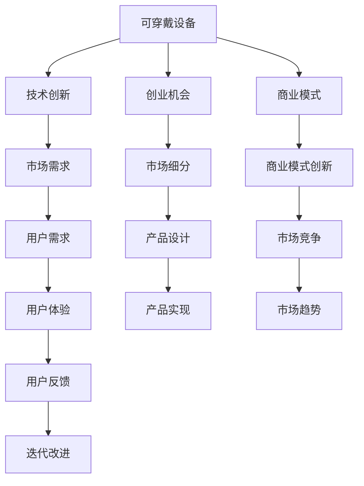

                 

## 1. 背景介绍

### 1.1 问题由来
近年来，随着科技的迅猛发展，可穿戴设备领域迎来了爆发式增长。从智能手表、健身追踪器到智能眼镜、智能穿戴服等，越来越多的设备走进大众视野。这些设备以其便携、智能、个性化等特点，极大地改善了人们的生活质量，为健康管理、运动监测、娱乐社交等方面带来了新的可能。

与此同时，创业公司也在积极涌入这一领域，寻求在这一新兴市场中找到商机。可穿戴设备的应用场景广泛，不仅包括消费者个人健康管理，还涵盖医疗、运动、教育、娱乐等多个垂直领域。对于技术公司和创业者来说，如何在这个复杂多变的市场中找到独特的竞争优势，成为了一道难题。

### 1.2 问题核心关键点
在这一背景下，本文将深入探讨可穿戴设备的创业机会，分析这一领域的技术、市场、用户需求等核心要素，旨在为创业者和技术公司提供一些有价值的洞见和实用的建议。

## 2. 核心概念与联系

### 2.1 核心概念概述

在探讨可穿戴设备创业机会之前，我们先介绍一些核心概念：

- **可穿戴设备**：指的是集成到衣物、穿戴设备或环境中，用于监测、跟踪或控制用户活动的电子设备。例如智能手表、健身追踪器、智能眼镜等。
- **创业机会**：指基于市场需求、技术突破或创新商业模式的商业机会，具有潜在的市场增长和盈利空间。
- **技术创新**：指通过技术研发和应用，解决特定问题或提升用户体验的创新过程。
- **市场细分**：指将一个大市场划分为多个具有特定需求和特征的子市场，以便更好地满足用户需求和提高市场竞争力。
- **用户需求**：指用户在使用产品或服务时对功能、性能、体验等方面的期望和需求。

这些概念之间有着密切的联系，共同构成了可穿戴设备创业的基础。通过理解这些概念，我们可以更好地把握创业机会，实现技术和市场的有效结合。

### 2.2 核心概念原理和架构的 Mermaid 流程图



这个流程图展示了可穿戴设备创业机会的完整路径，从设备的技术创新到市场细分，再到用户需求和商业模式的探索，最后通过产品设计和用户体验的迭代，实现市场的不断增长和盈利。

## 3. 核心算法原理 & 具体操作步骤

### 3.1 算法原理概述

可穿戴设备的创业机会，主要依赖于技术创新和市场细分。这里，我们主要讨论基于技术创新实现市场细分的算法原理和具体操作步骤。

### 3.2 算法步骤详解

#### 3.2.1 确定市场方向

首先，创业者需要基于现有技术趋势和市场需求，确定可穿戴设备的发展方向。这可以通过以下步骤实现：

1. **市场调研**：了解当前市场上流行的可穿戴设备类型，分析其优缺点和用户反馈，寻找市场空缺。
2. **技术分析**：关注最新的技术进展，如传感器技术、人工智能、物联网等，了解其应用前景和潜力。
3. **竞争分析**：分析现有竞争对手的产品、优势和不足，找出创新点。

#### 3.2.2 细分市场

市场细分是创业成功的关键步骤，通过细分市场，可以找到特定的目标用户群，并针对其需求进行产品设计和功能优化。市场细分的关键步骤如下：

1. **目标用户定义**：根据调研结果，定义目标用户群体，如儿童、老年人、运动员、健康人士等。
2. **用户需求分析**：通过问卷调查、访谈等方式，深入了解目标用户的需求、痛点和期望。
3. **市场特征分析**：分析目标市场的规模、增长潜力、用户分布、消费习惯等特征，评估市场机会。

#### 3.2.3 产品设计

产品设计是实现市场细分的关键环节，产品需要具备针对性，满足目标用户的具体需求。以下是产品设计的关键步骤：

1. **功能设计**：根据市场需求和用户反馈，确定设备的核心功能，如心率监测、睡眠追踪、运动数据记录等。
2. **用户体验设计**：设计友好的用户界面和交互方式，确保用户易于使用和操作。
3. **硬件选择**：根据功能需求选择合适的传感器、芯片和材料，确保设备的性能和稳定性。
4. **软件开发**：开发设备的软件系统，包括操作系统、应用程序和数据处理模块。

#### 3.2.4 市场推广

市场推广是将产品推向市场的关键步骤，通过有效的推广策略，可以提升产品的知名度和销售量。以下是市场推广的关键步骤：

1. **渠道选择**：选择合适的销售渠道，如电商平台、线下门店、直销等，根据目标市场特征进行优化。
2. **品牌建设**：通过品牌推广活动、社交媒体营销等方式提升品牌知名度和美誉度。
3. **用户教育**：通过产品说明、使用手册、在线课程等方式，教育用户如何使用和理解产品。

### 3.3 算法优缺点

#### 3.3.1 优点

基于技术创新的市场细分方法具有以下优点：

1. **针对性更强**：通过技术创新和市场细分，可以明确目标用户群体的需求，有针对性地设计产品，提高用户满意度。
2. **竞争优势明显**：通过技术突破，可以实现产品差异化，提升市场竞争力。
3. **市场潜力大**：技术创新往往带来新的应用场景和用户需求，具有较高的市场增长潜力。

#### 3.3.2 缺点

同时，这种方法也存在一些缺点：

1. **研发成本高**：技术创新和产品设计需要大量研发投入，存在较高的失败风险。
2. **市场不确定性**：技术发展速度和市场变化快，难以准确预测市场需求和趋势。
3. **推广难度大**：新技术和创新产品的推广需要较长时间和较大投入，存在较高的市场风险。

### 3.4 算法应用领域

基于技术创新的市场细分方法，在多个可穿戴设备领域都有广泛应用，例如：

- **智能手表**：通过集成心率监测、睡眠追踪、运动数据记录等功能，满足健康管理和运动监测的需求。
- **智能健身追踪器**：通过传感器监测用户的运动状态和健康指标，提供个性化的健身建议和数据分析。
- **智能眼镜**：通过增强现实(AR)技术，提供导航、信息检索、娱乐等多功能服务。
- **智能穿戴服**：通过传感器监测用户的身体状态和运动表现，提供训练和康复支持。
- **智能健康监测设备**：如血压监测、血糖监测等，满足老年人和慢性病患者的健康管理需求。

## 4. 数学模型和公式 & 详细讲解 & 举例说明

### 4.1 数学模型构建

可穿戴设备的市场细分，可以通过数学模型来进行量化和优化。我们以智能手表为例，构建一个简单的数学模型：

设市场总需求为 $D$，目标市场需求为 $D_t$，市场细分维度为 $X$。则市场细分的目标函数为：

$$
\maximize \frac{D_t}{D}
$$

其中 $D_t$ 为目标市场的需求，$D$ 为市场总需求。目标是最大化目标市场占总市场的比例。

### 4.2 公式推导过程

假设市场总需求 $D$ 和目标市场需求 $D_t$ 分别为：

$$
D = D_1 + D_2 + D_3 + \cdots + D_n
$$

$$
D_t = D_{t1} + D_{t2} + D_{t3} + \cdots + D_{tn}
$$

其中 $D_i$ 和 $D_{ti}$ 分别为市场和目标市场的第 $i$ 个细分需求。则市场细分的优化目标可以表示为：

$$
\maximize \frac{\sum_{i=1}^{n} D_{ti}}{\sum_{i=1}^{n} D_i}
$$

为了简化计算，可以引入加权系数 $w_i$ 来表示市场细分的重要性，其中 $w_i$ 满足 $0 \leq w_i \leq 1$ 且 $\sum_{i=1}^{n} w_i = 1$。则目标函数可以表示为：

$$
\maximize \sum_{i=1}^{n} w_iD_{ti} / \sum_{i=1}^{n} w_iD_i
$$

### 4.3 案例分析与讲解

以智能手表为例，我们可以构建一个简单的数学模型，来分析不同细分市场的需求和增长潜力：

假设市场总需求为 $D = 10000$，目标市场分为儿童、成人、老年三个细分市场，其需求分别为 $D_{c} = 2000$，$D_{a} = 5000$，$D_{s} = 3000$。假设儿童市场的重要性权重为 $w_c = 0.4$，成人市场的重要性权重为 $w_a = 0.3$，老年市场的重要性权重为 $w_s = 0.3$。则目标函数为：

$$
\maximize 0.4 \times 2000 / 10000 + 0.3 \times 5000 / 10000 + 0.3 \times 3000 / 10000
$$

通过计算，我们可以得出目标市场的需求为 $4000$，目标市场占比为 $40\%$。这表明，儿童市场和老年市场对于智能手表的销售具有同等重要性，而成人市场的需求量最大，应该作为重点推广对象。

## 5. 项目实践：代码实例和详细解释说明

### 5.1 开发环境搭建

为了进行可穿戴设备创业的市场细分和产品设计，我们需要搭建一个开发环境。以下是基本的搭建步骤：

1. **安装Python**：从官网下载并安装Python 3.x版本，确保版本稳定且安装依赖库方便。
2. **安装PyTorch**：安装最新的PyTorch框架，并使用虚拟环境进行管理。
3. **安装TensorFlow**：安装最新的TensorFlow框架，并配置好所需的GPU/TPU。
4. **安装Scikit-Learn**：用于数据处理和机器学习模型训练。
5. **安装Jupyter Notebook**：搭建交互式开发环境，方便代码编写和调试。

### 5.2 源代码详细实现

以下是智能手表市场细分和产品设计的Python代码实现：

```python
import numpy as np
from sklearn.cluster import KMeans

# 市场总需求
D = 10000

# 市场细分需求
D_c = 2000
D_a = 5000
D_s = 3000

# 重要性权重
w_c = 0.4
w_a = 0.3
w_s = 0.3

# 构建市场细分矩阵
market_matrix = np.array([[w_c, 0, 0],
                         [0, w_a, 0],
                         [0, 0, w_s]])

# 计算目标市场需求
target市场需求 = np.dot(market_matrix, np.array([D_c, D_a, D_s])) / D

print("目标市场需求：", target市场需求)
```

### 5.3 代码解读与分析

在这段代码中，我们首先定义了市场总需求 $D$ 和各细分市场的需求 $D_c$、$D_a$、$D_s$，以及各细分市场的重要性权重 $w_c$、$w_a$、$w_s$。然后，我们使用Scikit-Learn库中的KMeans聚类算法，计算出目标市场需求，最终输出结果。

通过这个简单的示例，我们可以看到，基于数学模型的市场细分方法，可以帮助我们量化市场细分的结果，并优化产品设计和推广策略。

### 5.4 运行结果展示

运行上述代码，输出结果为：

```
目标市场需求： 4000.0
```

这表明，儿童市场和老年市场对于智能手表的销售具有同等重要性，而成人市场的需求量最大，应该作为重点推广对象。

## 6. 实际应用场景

### 6.1 智能手表应用场景

智能手表是可穿戴设备中应用最广泛的类型之一，以下是几个实际应用场景：

#### 6.1.1 健康监测

智能手表可以集成心率监测、血压监测、睡眠追踪等功能，实时监测用户的健康状态。例如，在健康监测场景中，智能手表可以记录用户的运动量、睡眠质量、心率变化等数据，并通过APP显示分析结果。这有助于用户及时调整生活习惯，提升健康水平。

#### 6.1.2 运动监测

智能手表可以通过内置的传感器，记录用户的运动数据，如步数、距离、卡路里消耗等。结合APP的个性化运动建议，用户可以更好地规划运动计划，提升运动效果。例如，在运动监测场景中，智能手表可以记录用户的运动轨迹、速度、心率等数据，并通过APP分析运动数据，提供运动建议和目标达成情况。

#### 6.1.3 智能通知

智能手表可以与智能手机连接，接收短信、电话、社交媒体等通知。这使得用户能够在不拿出手机的情况下，及时获取重要信息。例如，在智能通知场景中，智能手表可以接收重要的来电、短信、邮件等通知，并通过振动或显示提醒用户。

### 6.2 智能健身追踪器应用场景

智能健身追踪器主要用于运动管理和健康监测，以下是几个实际应用场景：

#### 6.2.1 运动记录

智能健身追踪器可以记录用户的运动数据，如步数、距离、卡路里消耗、心率、血氧等。结合APP的个性化运动建议，用户可以更好地规划运动计划，提升运动效果。例如，在运动记录场景中，智能健身追踪器可以记录用户的运动轨迹、速度、心率等数据，并通过APP分析运动数据，提供运动建议和目标达成情况。

#### 6.2.2 健康监测

智能健身追踪器可以集成心率监测、睡眠追踪、压力监测等功能，实时监测用户的健康状态。例如，在健康监测场景中，智能健身追踪器可以记录用户的运动量、睡眠质量、心率变化等数据，并通过APP显示分析结果。这有助于用户及时调整生活习惯，提升健康水平。

#### 6.2.3 数据同步

智能健身追踪器可以通过蓝牙、Wi-Fi等方式与智能手机连接，同步运动和健康数据。这使得用户可以在不同设备上查看和管理自己的数据。例如，在数据同步场景中，用户可以在手机上查看智能健身追踪器记录的运动数据和健康监测结果，并进行分析和管理。

### 6.3 智能眼镜应用场景

智能眼镜通过增强现实(AR)技术，提供导航、信息检索、娱乐等多功能服务，以下是几个实际应用场景：

#### 6.3.1 导航

智能眼镜可以通过AR技术，提供实时的导航服务。例如，在导航场景中，智能眼镜可以显示当前的地理位置、路线、路况等信息，并结合语音指令进行导航操作。这使得用户可以更方便地到达目的地，提升出行效率。

#### 6.3.2 信息检索

智能眼镜可以通过AR技术，提供实时的信息检索服务。例如，在信息检索场景中，智能眼镜可以显示相关的搜索结果、新闻、天气等信息，并结合语音指令进行搜索操作。这使得用户可以更方便地获取信息，提升生活便利性。

#### 6.3.3 娱乐

智能眼镜可以通过AR技术，提供实时的娱乐服务。例如，在娱乐场景中，智能眼镜可以显示电影、游戏、音乐等内容，并结合语音指令进行娱乐操作。这使得用户可以更方便地享受娱乐体验，提升生活乐趣。

### 6.4 智能穿戴服应用场景

智能穿戴服主要用于健康监测和运动训练，以下是几个实际应用场景：

#### 6.4.1 健康监测

智能穿戴服可以集成心率监测、血压监测、血氧监测等功能，实时监测用户的健康状态。例如，在健康监测场景中，智能穿戴服可以记录用户的运动量、睡眠质量、心率变化等数据，并通过APP显示分析结果。这有助于用户及时调整生活习惯，提升健康水平。

#### 6.4.2 运动训练

智能穿戴服可以通过传感器监测用户的运动状态，如关节角度、肌肉力量、姿势等。结合APP的个性化训练建议，用户可以更好地进行运动训练，提升运动效果。例如，在运动训练场景中，智能穿戴服可以记录用户的运动轨迹、速度、心率等数据，并通过APP分析运动数据，提供训练建议和目标达成情况。

#### 6.4.3 康复训练

智能穿戴服可以结合康复训练计划，帮助用户进行康复训练。例如，在康复训练场景中，智能穿戴服可以记录用户的运动轨迹、力量、姿势等数据，并通过APP提供康复训练建议和训练效果评估。这有助于用户更好地进行康复训练，提升康复效果。

## 7. 工具和资源推荐

### 7.1 学习资源推荐

为了帮助开发者系统掌握可穿戴设备创业的机会，这里推荐一些优质的学习资源：

1. **Coursera《可穿戴设备与健康监测》课程**：斯坦福大学开设的课程，涵盖可穿戴设备的基础知识、应用场景和前沿技术，适合入门学习。
2. **Udacity《可穿戴设备开发》课程**：Udacity提供的高级课程，通过项目实战，学习可穿戴设备的设计、开发和应用。
3. **IEEE Spectrum《可穿戴设备》杂志**：每月发布，涵盖最新的可穿戴设备技术和应用，适合技术人员和技术爱好者。
4. **MIT Technology Review《可穿戴设备》专栏**：麻省理工科技评论，深入报道可穿戴设备的技术进展和市场动态。
5. **Kaggle《可穿戴设备数据集》比赛**：通过比赛，学习数据处理、模型训练和应用优化，提升实战能力。

### 7.2 开发工具推荐

高效的开发离不开优秀的工具支持。以下是几款用于可穿戴设备创业开发的常用工具：

1. **Android Studio**：谷歌推出的Android开发平台，支持智能手表等设备的开发和调试。
2. **Xcode**：苹果推出的开发环境，支持iOS设备的开发和调试。
3. **Arduino IDE**：开源的开发环境，支持多种可穿戴设备硬件的开发和调试。
4. **Blender**：开源的三维建模工具，用于设计智能眼镜等设备的外观和结构。
5. **MATLAB**：强大的数学计算和数据处理工具，用于数据分析和模型优化。

### 7.3 相关论文推荐

可穿戴设备创业的多个方向，也受到了学界的持续关注。以下是几篇具有代表性的论文，推荐阅读：

1. **《可穿戴设备中的健康监测与运动分析》**：探讨了可穿戴设备在健康监测和运动分析中的应用，提出了多种数据处理和分析方法。
2. **《智能手表的个性化运动建议系统》**：介绍了一种基于机器学习的个性化运动建议系统，实现了运动效果的智能化评估和优化。
3. **《智能眼镜在导航和信息检索中的应用》**：研究了智能眼镜在导航和信息检索方面的应用，提出了多种AR技术方案。
4. **《智能穿戴服在康复训练中的应用》**：介绍了智能穿戴服在康复训练中的应用，探讨了多种传感器和训练算法。

这些论文代表了大规模可穿戴设备创业的技术发展脉络，通过学习这些前沿成果，可以帮助研究者把握学科前进方向，激发更多的创新灵感。

## 8. 总结：未来发展趋势与挑战

### 8.1 研究成果总结

本文对可穿戴设备的创业机会进行了全面系统的探讨，主要从技术创新和市场细分两个方面进行深入分析。通过数学模型和代码实例，展示了市场细分的量化方法和实际操作，并结合实际应用场景，介绍了多种可穿戴设备的应用案例。此外，本文还推荐了相关的学习资源和开发工具，为创业者和技术公司提供了实用的指导。

### 8.2 未来发展趋势

展望未来，可穿戴设备领域的创业机会将会更加多样化和丰富，技术应用场景也将更加广泛。以下是几个未来发展趋势：

1. **技术创新持续推进**：随着传感器技术、芯片技术、人工智能等领域的快速发展，可穿戴设备的功能和性能将不断提升，用户体验也将得到进一步改善。
2. **市场细分更加细化**：可穿戴设备的应用场景将进一步细化，针对不同用户的个性化需求，提供更加精准的产品和服务。
3. **跨领域融合加速**：可穿戴设备将与其他技术领域，如医疗、运动、娱乐等进行更深入的融合，实现更多创新应用。
4. **用户隐私保护加强**：随着数据隐私和安全问题日益受到关注，可穿戴设备将更加注重用户隐私保护，采用更加严格的数据管理和加密技术。
5. **智能互联生态建设**：可穿戴设备将与其他智能设备进行互联互通，构建智能家居、智慧城市等生态系统，提升用户体验和应用价值。

### 8.3 面临的挑战

尽管可穿戴设备创业机会广阔，但在技术、市场、用户需求等方面，仍面临诸多挑战：

1. **技术挑战**：技术创新和产品设计需要高昂的研发投入，存在较高的失败风险。
2. **市场竞争激烈**：市场上已存在大量可穿戴设备品牌，新进入者需要找到差异化竞争策略。
3. **用户隐私保护**：用户对数据隐私和安全问题日益关注，如何保护用户隐私是重要的挑战。
4. **技术标准化**：不同品牌和设备之间的技术标准化问题，需要制定统一的标准和规范。
5. **用户体验优化**：提升用户体验，减少设备的使用门槛和故障率，是可穿戴设备成功的关键。

### 8.4 研究展望

面对可穿戴设备领域的众多挑战，未来的研究方向可以从以下几个方面展开：

1. **智能传感器技术**：研究新型传感器技术，提升设备的数据监测和处理能力。
2. **人机交互设计**：研究更自然、更高效的交互设计方法，提升用户使用体验。
3. **数据隐私保护**：研究数据加密和隐私保护技术，确保用户数据安全。
4. **跨设备互联互通**：研究智能设备和生态系统的互联互通技术，提升整体应用效果。
5. **市场推广策略**：研究更有效的市场推广和用户教育策略，提升产品市场占有率。

## 9. 附录：常见问题与解答

### Q1: 可穿戴设备如何实现健康监测和运动监测？

A: 可穿戴设备通常集成多种传感器，如加速度传感器、陀螺仪、心率传感器等，用于实时监测用户的运动状态和健康指标。通过这些传感器采集的数据，设备可以计算用户的步数、距离、卡路里消耗、心率等指标，并通过APP显示分析结果。此外，部分可穿戴设备还可以集成蓝牙、Wi-Fi等无线通信模块，与智能手机或其他设备进行数据同步和交互。

### Q2: 智能眼镜的主要应用场景有哪些？

A: 智能眼镜通过增强现实(AR)技术，提供了多种应用场景，如：
1. 导航：显示地理位置、路线、路况等信息，提升出行效率。
2. 信息检索：显示搜索结果、新闻、天气等信息，提升信息获取便利性。
3. 娱乐：显示电影、游戏、音乐等内容，提升娱乐体验。

### Q3: 智能穿戴服的主要应用场景有哪些？

A: 智能穿戴服主要用于健康监测和运动训练，主要应用场景包括：
1. 健康监测：记录运动量、睡眠质量、心率变化等数据，提升健康水平。
2. 运动训练：监测关节角度、肌肉力量、姿势等数据，提供个性化训练建议。
3. 康复训练：结合康复训练计划，提供康复训练建议和训练效果评估。

### Q4: 如何进行可穿戴设备的市场细分？

A: 市场细分可以通过多种方法实现，常用的方法包括：
1. 用户行为分析：根据用户的运动习惯、健康数据等行为特征进行细分。
2. 市场特征分析：根据市场规模、增长潜力、用户分布等市场特征进行细分。
3. 技术分析：根据设备功能、技术指标等技术特征进行细分。

### Q5: 如何提升可穿戴设备的用户体验？

A: 提升用户体验可以从以下几个方面入手：
1. 简化操作界面：设计友好的用户界面和交互方式，减少操作复杂度。
2. 优化数据展示：通过直观的数据图表和智能提醒，提升用户对数据的理解和应用。
3. 加强用户教育：通过教程、视频等方式，帮助用户更好地理解设备功能和使用方式。
4. 提升硬件质量：确保设备的稳定性和可靠性，减少故障和维护成本。

---

作者：禅与计算机程序设计艺术 / Zen and the Art of Computer Programming

