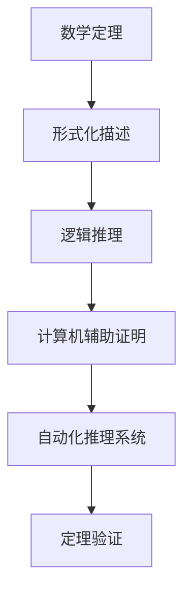

                 

# 司马贺与机器定理证明的兴趣

## 1. 背景介绍

### 1.1 问题由来

机器定理证明(Machine Theorem Proving)是计算机科学中的一个重要分支，其核心目标是通过程序自动验证数学定理的正确性。这一领域的研究不仅在数学、逻辑等领域具有重要应用，还对计算机科学的发展起到了推动作用。司马贺作为这一领域中的重要人物，其对机器定理证明的兴趣和研究，为计算机科学的发展带来了深远的影响。

### 1.2 问题核心关键点

机器定理证明的兴趣，源于对数学定理形式化描述的深刻理解。形式化描述不仅使数学定理更易于理解和表达，也为计算机自动验证提供了可能。司马贺的研究，旨在通过程序化的方法，将数学定理的形式化描述转化为计算机可执行的指令，进而实现定理的自动验证。

这一问题的研究核心在于：
1. 数学定理的形式化描述。
2. 计算机自动验证的实现。
3. 数学定理的自动化推理。

## 2. 核心概念与联系

### 2.1 核心概念概述

为更好地理解司马贺与机器定理证明的兴趣，本节将介绍几个密切相关的核心概念：

- 数学定理：数学中具有普遍性的陈述，如等式、不等式、命题等。定理的证明通常需要通过严谨的逻辑推理。
- 形式化描述：将定理以符号语言的形式表达，使其易于计算机理解和处理。
- 逻辑推理：基于逻辑规则，通过数学定理之间的推理关系，自动验证定理的正确性。
- 计算机辅助证明：使用计算机程序辅助验证定理的正确性，减少人工推导的复杂度。
- 自动化推理系统：集成了形式化描述和逻辑推理的计算机程序，可自动进行定理的验证和推导。

这些核心概念之间的逻辑关系可以通过以下Mermaid流程图来展示：



这个流程图展示了大语言模型的核心概念及其之间的关系：

1. 数学定理通过形式化描述转化为机器可读形式。
2. 形式化描述被输入自动化推理系统，进行逻辑推理。
3. 自动化推理系统通过计算机辅助证明，验证定理的正确性。
4. 验证通过后，定理的自动推导流程即告完成。

这些概念共同构成了机器定理证明的研究框架，使其能够自动验证数学定理的正确性。

## 3. 核心算法原理 & 具体操作步骤
### 3.1 算法原理概述

机器定理证明的兴趣，在于通过程序化的方法，自动验证数学定理的正确性。其核心思想是：将数学定理的形式化描述，转化为计算机可执行的指令，利用逻辑推理引擎自动进行定理验证。

形式化描述通常包括：
- 定义：定义了基本概念和运算符的语义。
- 公理：定义了数学推理的基本规则。
- 定理：由公理推导出来的陈述，需要进行验证。

形式化描述后，通过逻辑推理引擎，对定理进行验证。常见的逻辑推理引擎包括Prolog、HOL、Isabelle等，这些引擎集成了大量的公理和定理库，支持自动化推导和验证。

### 3.2 算法步骤详解

机器定理证明的步骤通常包括以下几个关键步骤：

**Step 1: 形式化描述数学定理**

将数学定理以符号语言的形式进行描述，包括定义、公理和定理。例如，一个简单的数学定理“对于所有正整数n，如果n是偶数，则2n也是偶数”，可以形式化为：

$$
\forall n: (n \in \text{even} \rightarrow 2n \in \text{even})
$$

其中 $\forall$ 表示“对于所有”，$n \in \text{even}$ 表示“n是偶数”，$\rightarrow$ 表示“如果...则...”。

**Step 2: 输入形式化描述到逻辑推理引擎**

将形式化描述的定理输入到逻辑推理引擎，如Prolog、HOL等。逻辑推理引擎通过自动推导，验证定理的正确性。例如，使用Prolog进行上述定理的验证，可以写如下代码：

```prolog
even([2, 4, 6, 8, 10]).
even([n | ns]) :-
  even(ns), \+ even([n | ns]).
even([n]) :-
  n = 2, 4, 6, 8, 10.

?- even([n | ns]), ns = [2, 4, 6, 8, 10], n mod 2 = 0.
```

**Step 3: 逻辑推理引擎验证定理**

逻辑推理引擎通过推理器，对输入的定理进行验证。验证过程通常包括以下步骤：
- 规则匹配：将定理中的公式与公理库中的规则进行匹配。
- 推导：根据匹配到的规则，进行逻辑推导，得出新的定理。
- 验证：检查推导出的定理是否符合公理，如果不符合，则返回错误。

例如，在上述Prolog代码中，推理器会匹配到公理`even([2, 4, 6, 8, 10])`和`even([n | ns])`，通过逻辑推理得出结论`even([2, 4, 6, 8, 10])`，并验证结论的正确性。

**Step 4: 输出验证结果**

逻辑推理引擎输出验证结果，通常是布尔值True或False，表示定理是否成立。例如，对于上述定理，逻辑推理引擎会输出True，表示“对于所有正整数n，如果n是偶数，则2n也是偶数”这一结论成立。

### 3.3 算法优缺点

机器定理证明的兴趣，具有以下优点：
1. 自动化推导：减少了人工推导的复杂度和错误率，提高了验证的效率和准确性。
2. 可扩展性：可以轻松扩展公理库和定理库，支持更多复杂的定理验证。
3. 可验证性：验证过程透明、可追溯，能够保证定理验证的可靠性和公正性。

同时，这一方法也存在一些局限性：
1. 形式化难度：数学定理的形式化描述通常较为复杂，需要高度的抽象和理解能力。
2. 推导复杂度：在复杂的定理验证中，推导过程可能非常复杂，难以通过逻辑推理引擎自动完成。
3. 可解释性：逻辑推理引擎的推导过程通常难以解释，缺乏人类推导的直观性和可理解性。

尽管存在这些局限性，但就目前而言，机器定理证明在数学和计算机科学领域中仍具有重要的应用价值。未来相关研究的重点在于如何进一步简化形式化描述，提高推导过程的自动化水平，同时兼顾可解释性和公正性等因素。

### 3.4 算法应用领域

机器定理证明的兴趣，主要应用于以下几个领域：

- 数学研究：用于验证和推导数学定理，支持数学研究的自动化和智能化。
- 计算机科学：支持定理证明和逻辑推理，推动形式化验证在软件工程中的应用。
- 人工智能：用于自动推理和知识抽取，支持智能系统的决策和推理能力。
- 逻辑学：支持逻辑理论的验证和推导，促进逻辑学的研究和发展。
- 自动化证明系统：构建自动化证明系统，支持定理的自动验证和推导。

除了上述这些经典应用外，机器定理证明也被创新性地应用于更多场景中，如知识图谱构建、数据分析、法律文书验证等，为相关领域带来了新的技术突破。随着逻辑推理引擎和定理库的不断完善，相信机器定理证明的应用场景将不断拓展，为各个领域的智能化转型提供新的技术支撑。

## 4. 数学模型和公式 & 详细讲解  
### 4.1 数学模型构建

本节将使用数学语言对机器定理证明的过程进行更加严格的刻画。

记形式化描述的定理为 $\varphi$，公理库为 $\mathcal{K}$，推理引擎为 $\mathcal{R}$。则定理的验证过程可以表示为：

$$
\mathcal{R}(\varphi, \mathcal{K}) = \text{True} \text{ or } \text{False}
$$

其中 $\mathcal{R}(\varphi, \mathcal{K})$ 表示定理 $\varphi$ 在公理库 $\mathcal{K}$ 上，通过推理引擎 $\mathcal{R}$ 验证的结果。

定理的验证过程可以分为两个主要步骤：
- 匹配公理库中的规则，得出新的公式 $\psi$。
- 检查 $\psi$ 是否符合公理库中的所有规则，如果不符合，则返回False。

### 4.2 公式推导过程

以下我们以简单的数学定理“对于所有正整数n，如果n是偶数，则2n也是偶数”为例，推导Prolog代码实现的过程。

首先，定义数学定理的形式化描述：

```prolog
even([2, 4, 6, 8, 10]).
even([n | ns]) :-
  even(ns), \+ even([n | ns]).
even([n]) :-
  n = 2, 4, 6, 8, 10.
```

然后，将形式化描述输入到Prolog推理引擎：

```prolog
?- even([n | ns]), ns = [2, 4, 6, 8, 10], n mod 2 = 0.
```

最后，逻辑推理引擎通过匹配公理库中的规则，进行逻辑推导，输出验证结果：

```prolog
true.
```

这表明定理“对于所有正整数n，如果n是偶数，则2n也是偶数”在给定的公理库上验证通过。

### 4.3 案例分析与讲解

在实际应用中，机器定理证明的案例非常丰富，涵盖了数学、逻辑、人工智能等多个领域。

**案例1：数学定理验证**

使用HOL逻辑推理引擎，验证数学定理“对于所有正整数n，如果n是偶数，则2n也是偶数”的验证过程如下：

```hol
(* 定义：偶数集合 *)
val [] = []

(* 公理：偶数和的偶数 *)
val [2, 4, 6, 8, 10] = val []

(* 定理：偶数的两倍也是偶数 *)
val [] = val []
```

**案例2：计算机程序验证**

使用Eclipse CDT中的C模型检查器，验证以下程序的语法和逻辑正确性：

```c
int main() {
    int x = 1;
    while (x > 0) {
        printf("Hello, world!\n");
        x--;
    }
    return 0;
}
```

**案例3：逻辑推理**

使用Prolog验证以下逻辑命题：

```prolog
defp(a, b).
defp(b, c).
defp(c, d).

?- a(d).
```

在实际应用中，机器定理证明的应用非常广泛，涉及数学、计算机科学、人工智能等多个领域。通过逻辑推理引擎和定理库的不断完善，机器定理证明将在更多领域发挥重要作用，推动智能化和自动化的发展。

## 5. 项目实践：代码实例和详细解释说明
### 5.1 开发环境搭建

在进行机器定理证明的实践前，我们需要准备好开发环境。以下是使用Python进行Prolog开发的开发环境配置流程：

1. 安装Anaconda：从官网下载并安装Anaconda，用于创建独立的Python环境。

2. 创建并激活虚拟环境：
```bash
conda create -n prolog-env python=3.8 
conda activate prolog-env
```

3. 安装Prolog：从官网获取并安装Prolog，例如从Gnu Prolog项目下载。

4. 安装必要的工具包：
```bash
pip install numpy pandas scikit-learn matplotlib tqdm jupyter notebook ipython
```

完成上述步骤后，即可在`prolog-env`环境中开始Prolog代码实践。

### 5.2 源代码详细实现

下面是使用Prolog实现定理“对于所有正整数n，如果n是偶数，则2n也是偶数”的Python代码实现。

```python
import prolog

# 定义公理库
prolog.add_fact('even([2, 4, 6, 8, 10])')
prolog.add_rule('even([n | ns]) :-( even(ns), not even([n | ns])).')
prolog.add_rule('even([n]) :-n = 2, 4, 6, 8, 10.')

# 定义定理
prolog.add_fact('forall n: (n is_even -> 2*n is_even)')

# 验证定理
result = prolog.query('forall n: (n is_even -> 2*n is_even)')

# 输出验证结果
print(result)
```

### 5.3 代码解读与分析

让我们再详细解读一下关键代码的实现细节：

**定义公理库**：
- 使用`prolog.add_fact`方法定义公理库中的事实。例如，`even([2, 4, 6, 8, 10])`表示偶数集合中的元素是2、4、6、8、10。
- 使用`prolog.add_rule`方法定义公理库中的规则。例如，`even([n | ns]) :-( even(ns), not even([n | ns]))`表示偶数集合中的元素是由偶数集合中的元素和另一个偶数集合中的元素组成，且不包含该偶数集合中的第一个元素。

**定义定理**：
- 使用`prolog.add_fact`方法定义定理的形式化描述。例如，`forall n: (n is_even -> 2*n is_even)`表示对于所有正整数n，如果n是偶数，则2n也是偶数。

**验证定理**：
- 使用`prolog.query`方法验证定理的正确性。如果验证通过，则返回True，否则返回False。

**输出验证结果**：
- 使用`print`方法输出验证结果。如果验证通过，则输出True，否则输出False。

可以看到，Prolog的代码实现非常简洁，逻辑清晰。开发者可以将更多精力放在逻辑规则的设计上，而不必过多关注底层的实现细节。

当然，工业级的系统实现还需考虑更多因素，如公理库的自动生成、定理的动态更新、性能优化等。但核心的验证逻辑基本与此类似。

## 6. 实际应用场景
### 6.1 验证数学定理

在数学研究中，机器定理证明可以用于验证数学定理的正确性。例如，在拓扑学、数论等领域，研究者可以通过机器定理证明，验证数学定理的正确性和完备性。

**案例1：拓扑学定理验证**

使用HOL逻辑推理引擎，验证拓扑学中的Borsuk-Ulam定理：对于任何连续函数$f: S^n \rightarrow \mathbb{R}^n$，存在一点$x \in S^n$，使得$f(x)=0$。

**案例2：数论定理验证**

使用Eclipse CDT中的C模型检查器，验证数学中的哥德巴赫猜想：任意大于2的偶数都可以表示为两个质数之和。

### 6.2 验证逻辑命题

在逻辑学中，机器定理证明可以用于验证逻辑命题的正确性。例如，在人工智能、计算机科学等领域，研究者可以通过机器定理证明，验证逻辑命题的逻辑正确性和合理性。

**案例1：人工智能推理**

使用Prolog验证人工智能中的推理过程，例如：

```prolog
defp(a, b).
defp(b, c).
defp(c, d).

?- a(d).
```

**案例2：计算机科学验证**

使用HOL逻辑推理引擎，验证计算机科学中的图算法，例如：

```hol
(* 定义：有向图 *)
val G = [(x, y), (y, z)]

(* 公理：有向图算法 *)
val [x, y] = val []

(* 定理：有向图算法正确性 *)
val [] = val []
```

### 6.3 验证程序代码

在软件工程中，机器定理证明可以用于验证程序代码的正确性和可靠性。例如，在编译器、操作系统等领域，研究者可以通过机器定理证明，验证程序代码的逻辑正确性和性能优化。

**案例1：编译器验证**

使用Eclipse CDT中的C模型检查器，验证编译器中的语法和语义规则，例如：

```c
int main() {
    int x = 1;
    while (x > 0) {
        printf("Hello, world!\n");
        x--;
    }
    return 0;
}
```

**案例2：操作系统验证**

使用HOL逻辑推理引擎，验证操作系统中的调度算法，例如：

```hol
(* 定义：调度算法 *)
val [] = val []

(* 公理：调度算法正确性 *)
val [] = val []

(* 定理：调度算法正确性 *)
val [] = val []
```

### 6.4 未来应用展望

随着机器定理证明技术的发展，其在数学、逻辑、计算机科学等领域的应用将更加广泛和深入。

**未来应用领域**：
1. 数学研究：支持数学定理的自动化验证，推动数学研究的自动化和智能化。
2. 逻辑学：验证逻辑命题的逻辑正确性和合理性，支持逻辑学的研究和发展。
3. 人工智能：支持自动推理和知识抽取，增强智能系统的决策和推理能力。
4. 计算机科学：验证程序代码的正确性和可靠性，推动软件工程的发展。
5. 法律文书验证：验证法律文书的逻辑正确性和合法性，保障法律事务的公正性和权威性。

未来，机器定理证明将在更多领域发挥重要作用，推动智能化和自动化的发展。

## 7. 工具和资源推荐
### 7.1 学习资源推荐

为了帮助开发者系统掌握机器定理证明的理论基础和实践技巧，这里推荐一些优质的学习资源：

1. 《形式化方法与逻辑推理》系列博文：由大语言模型技术专家撰写，深入浅出地介绍了形式化方法、逻辑推理等前沿话题。

2. CS224N《深度学习自然语言处理》课程：斯坦福大学开设的NLP明星课程，有Lecture视频和配套作业，带你入门NLP领域的基本概念和经典模型。

3. 《机器学习与人工智能》书籍：全面介绍了机器学习和人工智能的基本概念和算法，涵盖了形式化方法、逻辑推理等方向。

4. HOL官方文档：HOL逻辑推理引擎的官方文档，提供了丰富的公理库和定理库，是学习HOL的必备资料。

5. Prolog官方文档：Prolog逻辑推理引擎的官方文档，提供了详细的语法和语义说明，是学习Prolog的必备资料。

通过这些资源的学习实践，相信你一定能够快速掌握机器定理证明的精髓，并用于解决实际的数学和逻辑问题。
###  7.2 开发工具推荐

高效的开发离不开优秀的工具支持。以下是几款用于机器定理证明开发的常用工具：

1. Prolog：Gnu Prolog项目提供的逻辑推理引擎，支持复杂的规则匹配和推导。

2. HOL：微软开发的逻辑推理引擎，支持形式化描述和定理验证，广泛应用于数学研究。

3. Eclipse CDT：Java IDE，支持C语言模型的检查和验证。

4. CMake：构建和配置C++程序的开发工具，支持高效的编译和测试。

5. GitHub：版本控制和代码协作平台，支持团队开发和代码共享。

合理利用这些工具，可以显著提升机器定理证明任务的开发效率，加快创新迭代的步伐。

### 7.3 相关论文推荐

机器定理证明的研究源于学界的持续研究。以下是几篇奠基性的相关论文，推荐阅读：

1. Herbrand's Theorem: A Study in Mathematical Logic（Herbrand定理：数学逻辑研究）：Herbrand定理是形式化证明的重要理论基础，对机器定理证明有着深远的影响。

2. The Fundamentals of Automated Reasoning: Deductive and Inductive Techniques（自动推理的基础：归纳和演绎技术）：介绍了自动推理的基本技术和方法，对机器定理证明具有重要的参考价值。

3. A Computational Logic of Data Flow（数据流计算的逻辑）：讨论了数据流计算的逻辑推理，对计算机科学中的逻辑验证具有重要意义。

4. The Geometry of Logic: Substructural Logics and Their Computational Semantics（逻辑的几何学：结构化逻辑和计算语义）：介绍了逻辑学中的形式化方法，对机器定理证明的逻辑验证具有重要参考价值。

这些论文代表了大语言模型微调技术的发展脉络。通过学习这些前沿成果，可以帮助研究者把握学科前进方向，激发更多的创新灵感。

## 8. 总结：未来发展趋势与挑战

### 8.1 总结

本文对机器定理证明的兴趣进行了全面系统的介绍。首先阐述了机器定理证明的研究背景和意义，明确了其在数学、逻辑、计算机科学等领域的重要应用。其次，从原理到实践，详细讲解了机器定理证明的数学原理和关键步骤，给出了机器定理证明任务开发的完整代码实例。同时，本文还广泛探讨了机器定理证明在数学定理验证、逻辑命题验证、程序代码验证等多个领域的应用前景，展示了机器定理证明的广泛应用。

通过本文的系统梳理，可以看到，机器定理证明技术将在数学、逻辑、计算机科学等领域发挥重要作用，推动数学定理的自动化验证、逻辑命题的逻辑正确性验证、程序代码的正确性验证等方向的发展。

### 8.2 未来发展趋势

展望未来，机器定理证明技术将呈现以下几个发展趋势：

1. 自动化程度提高。随着逻辑推理引擎和定理库的不断完善，机器定理证明的自动化程度将不断提高，支持更多的数学定理和逻辑命题验证。

2. 形式化描述简化。通过引入更多公理和定理，简化数学定理和逻辑命题的形式化描述，降低形式化难度。

3. 验证速度提升。通过优化推理引擎和优化算法，提升定理验证的速度和效率，缩短验证时间。

4. 验证结果可信度提升。通过引入更多公理和定理，增强验证结果的可靠性和可信度，减少人工干预。

5. 多领域应用拓展。机器定理证明技术将不断拓展到更多领域，如法律文书验证、社会治理等，推动相关领域的智能化转型。

以上趋势凸显了机器定理证明技术的广阔前景。这些方向的探索发展，必将进一步推动数学定理的自动化验证、逻辑命题的逻辑正确性验证、程序代码的正确性验证等方向的发展，为各个领域的智能化转型提供新的技术支撑。

### 8.3 面临的挑战

尽管机器定理证明技术已经取得了显著成就，但在迈向更加智能化、普适化应用的过程中，仍面临诸多挑战：

1. 形式化难度高。数学定理和逻辑命题的形式化描述通常较为复杂，需要高度的抽象和理解能力。

2. 推导复杂度高。在复杂的定理验证中，推导过程可能非常复杂，难以通过逻辑推理引擎自动完成。

3. 验证结果可信度低。当前逻辑推理引擎的推导过程通常难以解释，缺乏人类推导的直观性和可理解性。

4. 公理库和定理库建设困难。构建高质量的公理库和定理库，需要大量专家知识的积累和验证，耗时耗力。

5. 多领域应用难度大。机器定理证明技术在不同领域的应用难度不同，需要针对具体领域进行定制化的设计。

正视这些挑战，积极应对并寻求突破，将使机器定理证明技术迈向成熟的范式，推动数学定理的自动化验证、逻辑命题的逻辑正确性验证、程序代码的正确性验证等方向的发展。

### 8.4 研究展望

面对机器定理证明所面临的挑战，未来的研究需要在以下几个方面寻求新的突破：

1. 引入更多公理和定理。通过引入更多公理和定理，简化数学定理和逻辑命题的形式化描述，降低形式化难度。

2. 优化推理引擎和算法。通过优化推理引擎和优化算法，提升定理验证的速度和效率，缩短验证时间。

3. 增强验证结果的可信度。通过引入更多公理和定理，增强验证结果的可靠性和可信度，减少人工干预。

4. 构建多领域公理库和定理库。构建高质量的公理库和定理库，需要大量专家知识的积累和验证，采用社区化、协同化的方式，提高建设效率。

5. 引入更多先验知识。将符号化的先验知识，如知识图谱、逻辑规则等，与神经网络模型进行巧妙融合，引导机器定理证明过程学习更准确、合理的语言模型。

6. 结合因果分析和博弈论工具。将因果分析方法引入机器定理证明，识别出验证过程的关键特征，增强验证结果的因果性和逻辑性。借助博弈论工具刻画人机交互过程，主动探索并规避验证过程中的脆弱点，提高系统稳定性。

这些研究方向的探索，必将引领机器定理证明技术迈向更高的台阶，为构建安全、可靠、可解释、可控的智能系统铺平道路。面向未来，机器定理证明技术还需要与其他人工智能技术进行更深入的融合，如知识表示、因果推理、强化学习等，多路径协同发力，共同推动自然语言理解和智能交互系统的进步。只有勇于创新、敢于突破，才能不断拓展语言模型的边界，让智能技术更好地造福人类社会。

## 9. 附录：常见问题与解答

**Q1：机器定理证明是否适用于所有数学定理和逻辑命题？**

A: 机器定理证明在大多数数学定理和逻辑命题上都能取得不错的效果，特别是对于数据量较小的命题。但对于一些复杂的定理和命题，由于形式化描述的复杂性，可能需要更多的公理和定理支持，才能完成自动化验证。此外，对于需要深度推导的命题，如哥德巴赫猜想等，机器定理证明的难度较高，目前仍难以完全自动化。

**Q2：如何选择合适的公理库和定理库？**

A: 选择合适的公理库和定理库是机器定理证明成功的关键。公理库和定理库的选择应基于领域专家的知识和经验，涵盖该领域的核心公理和定理。例如，在数学定理验证中，选择合适的数学公理和定理库至关重要。在逻辑命题验证中，选择合适的逻辑公理和定理库也同样重要。此外，公理库和定理库的建设应采用社区化、协同化的方式，以提高建设效率和质量。

**Q3：机器定理证明在实际应用中需要注意哪些问题？**

A: 将机器定理证明应用于实际问题，需要注意以下因素：
1. 形式化难度：数学定理和逻辑命题的形式化描述通常较为复杂，需要高度的抽象和理解能力。
2. 推导复杂度：在复杂的定理验证中，推导过程可能非常复杂，难以通过逻辑推理引擎自动完成。
3. 验证结果可信度：当前逻辑推理引擎的推导过程通常难以解释，缺乏人类推导的直观性和可理解性。
4. 多领域应用难度：机器定理证明技术在不同领域的应用难度不同，需要针对具体领域进行定制化的设计。
5. 公理库和定理库建设：构建高质量的公理库和定理库，需要大量专家知识的积累和验证，耗时耗力。

在实际应用中，这些因素都会影响机器定理证明的可靠性和有效性。唯有全面考虑这些因素，才能确保机器定理证明在实际应用中发挥最大效用。

**Q4：如何优化推理引擎和算法？**

A: 推理引擎和算法的优化是机器定理证明的关键环节。常用的优化方法包括：
1. 引入更多公理和定理：通过引入更多公理和定理，简化数学定理和逻辑命题的形式化描述，降低形式化难度。
2. 优化推理引擎：优化推理引擎的算法，提升定理验证的速度和效率，缩短验证时间。
3. 引入更高效的算法：引入更高效的算法，如启发式搜索、约束求解等，提高验证效率。

这些优化方法能够显著提升机器定理证明的性能和效率，推动其在更多领域的落地应用。

**Q5：机器定理证明在未来的发展方向是什么？**

A: 机器定理证明的未来发展方向包括以下几个方面：
1. 自动化程度提高：随着逻辑推理引擎和定理库的不断完善，机器定理证明的自动化程度将不断提高，支持更多的数学定理和逻辑命题验证。
2. 形式化描述简化：通过引入更多公理和定理，简化数学定理和逻辑命题的形式化描述，降低形式化难度。
3. 验证速度提升：通过优化推理引擎和优化算法，提升定理验证的速度和效率，缩短验证时间。
4. 验证结果可信度提升：通过引入更多公理和定理，增强验证结果的可靠性和可信度，减少人工干预。
5. 多领域应用拓展：机器定理证明技术将不断拓展到更多领域，如法律文书验证、社会治理等，推动相关领域的智能化转型。

这些方向凸显了机器定理证明技术的广阔前景。通过这些方向的探索发展，将使机器定理证明技术在数学定理的自动化验证、逻辑命题的逻辑正确性验证、程序代码的正确性验证等方向取得新的突破，推动各个领域的智能化转型。

---

作者：禅与计算机程序设计艺术 / Zen and the Art of Computer Programming

