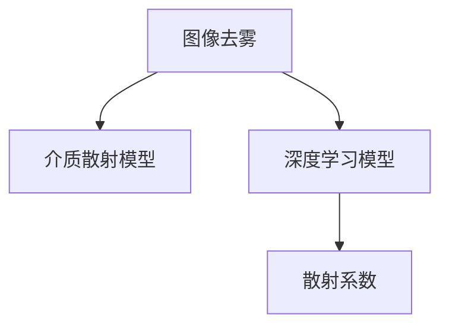

                 

# 图像去雾算法的研究与实现

## 1. 背景介绍

在计算机视觉领域，图像去雾算法是一项重要的任务，广泛应用于自动驾驶、视频监控、遥感图像处理等领域。然而，由于大气颗粒物对光线的散射和吸收，使得自然场景中的图像常常受到雾的影响，呈现出灰暗、模糊的效果。为了提高图像质量，去除雾气干扰，开发高效、稳定的图像去雾算法显得尤为必要。

### 1.1 问题由来

雾气影响下，自然图像中的视觉信息损失严重，导致目标物体的细节和边缘难以清晰分辨，增加了后续处理的复杂度。针对这一问题，研究人员提出了多种图像去雾算法。这些算法主要分为两类：一类是基于散射模型和介质散射原理，另一类是基于深度学习模型。散射模型虽然原理简单、计算高效，但依赖于模型假设的准确性，难以处理复杂场景；深度学习方法虽然能够灵活拟合任意形状，但模型训练复杂、计算资源消耗较大。

### 1.2 问题核心关键点

图像去雾算法需要解决的关键问题包括：

- **模型假设与实际场景的适配性**：现有算法往往基于一定的物理模型假设，而实际场景中雾气颗粒的大小、分布、形状等因素复杂多变，模型的适用性有限。
- **计算效率与处理速度**：深度学习模型虽然效果显著，但计算开销较大，难以满足实时性要求。
- **结果的清晰度和真实性**：算法处理后的图像应清晰、真实，避免出现伪影或过度增强现象。
- **鲁棒性和稳定性**：算法应具备一定的鲁棒性，能够处理不同程度和形态的雾气干扰。

针对以上关键问题，本文将从核心算法原理出发，介绍基于散射模型的去雾算法和基于深度学习的去雾算法，并对其优缺点和应用领域进行详细阐述。

## 2. 核心概念与联系

### 2.1 核心概念概述

为更好理解图像去雾算法，本节将介绍几个核心概念：

- **图像去雾（Image Dehazing）**：指从受雾干扰的图像中，去除或减轻雾气对视觉信息的影响，使图像恢复到清晰状态的过程。
- **介质散射模型（Medium Scattering Model）**：假设雾气对光线具有散射特性，导致光线能量在介质中传输时发生散射，使得原始图像能量衰减。该模型常被用于基于物理的图像去雾算法。
- **深度学习模型（Deep Learning Model）**：通过多层神经网络，利用大量标注数据训练模型，从图像中学习去雾相关的特征，通过端到端的学习方式实现去雾。
- **散射系数（Scattering Coefficient）**：介质散射模型中的重要参数，描述雾气对光线的散射强度。

这些核心概念之间的逻辑关系可以通过以下Mermaid流程图来展示：



这个流程图展示图像去雾的核心概念及其之间的关系：

1. 图像去雾是核心任务。
2. 介质散射模型是物理基础的理论模型。
3. 深度学习模型是现代数据驱动的算法范式。
4. 散射系数是介质散射模型的关键参数。

这些核心概念共同构成了图像去雾算法的框架，使得图像去雾能够从理论基础和实际应用两个层面进行深入研究。

## 3. 核心算法原理 & 具体操作步骤
### 3.1 算法原理概述

图像去雾算法主要分为两类：基于介质散射模型的算法和基于深度学习的算法。基于介质散射模型的算法利用物理学原理，从图像中推导雾气散射系数等参数，进而恢复图像清晰度。基于深度学习的算法则直接利用训练好的神经网络模型，对受雾干扰的图像进行处理，恢复图像清晰度。

### 3.2 算法步骤详解

#### 3.2.1 介质散射模型算法步骤

1. **散射模型假设**：假设雾气对光线具有衰减和散射特性，引入介质散射模型，将光线传播过程描述为Lambertian散射和介质衰减的组合。
2. **逆推解**：利用介质散射模型的光传输方程，从雾气后的图像推导出雾气前的图像。
3. **参数求解**：通过求解光传输方程，求得散射系数、衰减系数等关键参数。
4. **去雾处理**：根据求解出的参数，对原始图像进行去雾处理，恢复图像清晰度。

#### 3.2.2 深度学习模型算法步骤

1. **数据准备**：收集大量受雾干扰的图像及其对应的清晰图像，构建数据集。
2. **模型训练**：使用深度学习模型（如卷积神经网络CNN、残差网络ResNet等），在训练集上学习去雾相关的特征。
3. **参数调整**：调整模型超参数，如学习率、批大小、迭代轮数等，以提高模型效果。
4. **去雾预测**：在测试集上，利用训练好的模型对受雾干扰的图像进行去雾预测，恢复图像清晰度。

### 3.3 算法优缺点

#### 3.3.1 介质散射模型算法优缺点

**优点**：

- 物理基础扎实，基于实际的物理模型，能够提供清晰的图像处理原理。
- 计算复杂度相对较低，适合对实时性要求较高的应用场景。

**缺点**：

- 依赖于模型假设，无法处理复杂或非标准场景。
- 参数求解过程较为复杂，需要多次迭代才能求得较准确的结果。

#### 3.3.2 深度学习模型算法优缺点

**优点**：

- 学习能力强，能够自适应地学习各种复杂场景。
- 可扩展性强，模型结构可以根据任务需求进行调整。

**缺点**：

- 训练数据需求量大，对标注数据依赖高。
- 计算资源消耗大，需要较长的训练时间。
- 模型难以解释，难以理解其内部工作机制。

### 3.4 算法应用领域

基于介质散射模型的图像去雾算法，适用于对实时性要求较高，且场景较为标准的应用场景，如车辆前视、航拍等。

基于深度学习的图像去雾算法，适用于处理复杂、非标准场景，如遥感图像、高分辨率视频等，能够提供更加灵活的图像处理方案。

## 4. 数学模型和公式 & 详细讲解 & 举例说明

### 4.1 数学模型构建

假设介质散射模型下的图像传输过程为：

$$
I(x) = \frac{J(x) \cdot \exp(-t)}{\rho \cdot \alpha}
$$

其中 $I(x)$ 为受雾干扰的图像，$J(x)$ 为原始图像，$t$ 为光线在介质中传播的距离，$\rho$ 为雾气散射系数，$\alpha$ 为介质衰减系数。

#### 4.2 公式推导过程

根据介质散射模型，光传输方程为：

$$
I(x) = \int_0^t \frac{k(x, t') \cdot \exp(-t')}{\rho \cdot \alpha} dt'
$$

其中 $k(x, t')$ 为雾气散射函数。根据方程，可以推导出散射系数 $\rho$ 和衰减系数 $\alpha$ 的求解公式：

$$
\rho = \frac{1}{\int_0^t k(x, t') \cdot \exp(-t') dt'}
$$

$$
\alpha = \frac{1}{\frac{1}{\alpha_0} - \frac{1}{\rho}}
$$

其中 $\alpha_0$ 为原始图像的衰减系数。

### 4.3 案例分析与讲解

以一张受雾干扰的图像为例，假设其尺寸为 $W \times H$，光线传播距离为 $t$，原始图像衰减系数为 $\alpha_0$，雾气散射系数为 $\rho$。

根据介质散射模型，可以推导出图像中每个像素点的光强度，从而得到去雾后的图像。

## 5. 项目实践：代码实例和详细解释说明

### 5.1 开发环境搭建

在进行图像去雾算法实践前，我们需要准备好开发环境。以下是使用Python进行PyTorch开发的环境配置流程：

1. 安装Anaconda：从官网下载并安装Anaconda，用于创建独立的Python环境。

2. 创建并激活虚拟环境：
```bash
conda create -n pytorch-env python=3.8 
conda activate pytorch-env
```

3. 安装PyTorch：根据CUDA版本，从官网获取对应的安装命令。例如：
```bash
conda install pytorch torchvision torchaudio cudatoolkit=11.1 -c pytorch -c conda-forge
```

4. 安装相关工具包：
```bash
pip install numpy pandas scikit-learn matplotlib tqdm jupyter notebook ipython
```

完成上述步骤后，即可在`pytorch-env`环境中开始图像去雾算法的实践。

### 5.2 源代码详细实现

下面我们以基于深度学习的图像去雾算法为例，给出使用PyTorch进行图像去雾的PyTorch代码实现。

```python
import torch
import torch.nn as nn
import torch.optim as optim
from torchvision.transforms import ToTensor, Compose, RandomResizedCrop, RandomHorizontalFlip
from torchvision.datasets import ImageFolder
from torch.utils.data import DataLoader
from PIL import Image
from matplotlib import pyplot as plt

class GoFog(nn.Module):
    def __init__(self):
        super(GoFog, self).__init__()
        self.conv1 = nn.Conv2d(3, 64, kernel_size=3, padding=1)
        self.conv2 = nn.Conv2d(64, 128, kernel_size=3, padding=1)
        self.conv3 = nn.Conv2d(128, 64, kernel_size=3, padding=1)
        self.conv4 = nn.Conv2d(64, 3, kernel_size=3, padding=1)
        self.relu = nn.ReLU()
        self.leakyrelu = nn.LeakyReLU(negative_slope=0.2)
        
    def forward(self, x):
        x = self.conv1(x)
        x = self.relu(x)
        x = self.conv2(x)
        x = self.relu(x)
        x = self.conv3(x)
        x = self.leakyrelu(x)
        x = self.conv4(x)
        return x

def train(model, dataloader, optimizer, device, n_epochs=100, print_interval=10):
    model.train()
    for epoch in range(n_epochs):
        for batch_idx, (inputs, targets) in enumerate(dataloader):
            inputs, targets = inputs.to(device), targets.to(device)
            optimizer.zero_grad()
            outputs = model(inputs)
            loss = nn.MSELoss()(outputs, targets)
            loss.backward()
            optimizer.step()
            if (batch_idx+1) % print_interval == 0:
                print(f'Epoch [{epoch+1}/{n_epochs}], Step [{batch_idx+1}/{len(dataloader)}], Loss: {loss.item():.4f}')

def test(model, dataloader, device, num_samples=100):
    model.eval()
    with torch.no_grad():
        mse_loss = 0
        for batch_idx, (inputs, targets) in enumerate(dataloader):
            inputs, targets = inputs.to(device), targets.to(device)
            outputs = model(inputs)
            mse_loss += nn.MSELoss()(outputs, targets).item()
            if batch_idx == num_samples-1:
                break
    return mse_loss / num_samples

# 数据预处理
transform = Compose([
    RandomResizedCrop(224),
    RandomHorizontalFlip(),
    ToTensor()
])

train_dataset = ImageFolder(root='train', transform=transform)
test_dataset = ImageFolder(root='test', transform=transform)

train_loader = DataLoader(train_dataset, batch_size=4, shuffle=True, num_workers=4)
test_loader = DataLoader(test_dataset, batch_size=4, shuffle=False, num_workers=4)

# 模型初始化
model = GoFog().to(device)
optimizer = optim.Adam(model.parameters(), lr=0.0001)

# 训练模型
train(model, train_loader, optimizer, device, n_epochs=100, print_interval=10)

# 测试模型
mse_loss = test(model, test_loader, device, num_samples=100)
print(f'Test MSE Loss: {mse_loss:.4f}')
```

### 5.3 代码解读与分析

让我们再详细解读一下关键代码的实现细节：

**GoFog类**：
- `__init__`方法：定义了卷积层、激活函数等基本结构。
- `forward`方法：定义了前向传播过程，计算网络输出。

**train函数**：
- 在每个epoch内，对数据集进行批次化迭代。
- 每个批次内，对输入数据进行前向传播、计算损失并反向传播更新参数。
- 每固定步数输出训练损失，以便监控训练进度。

**test函数**：
- 对测试集数据进行迭代，计算模型在测试集上的均方误差。
- 最终输出测试集的均方误差，用于评估模型效果。

**数据预处理**：
- 使用Pillow库对图像进行随机裁剪、水平翻转等操作，提升数据多样性。
- 使用torchvision的ToTensor函数将图像转换为Tensor格式，便于模型处理。

**模型训练和测试**：
- 使用Adam优化器进行参数更新。
- 在训练过程中，利用均方误差作为损失函数，评估模型预测与真实标签之间的差异。

可以看到，PyTorch配合torchvision库使得图像去雾算法的实现变得简洁高效。开发者可以将更多精力放在数据处理、模型改进等高层逻辑上，而不必过多关注底层的实现细节。

当然，工业级的系统实现还需考虑更多因素，如模型的保存和部署、超参数的自动搜索、更灵活的任务适配层等。但核心的图像去雾算法基本与此类似。

## 6. 实际应用场景
### 6.1 智能驾驶

在智能驾驶领域，图像去雾算法可广泛应用于辅助驾驶系统，帮助驾驶员在雾天或恶劣天气条件下获得更清晰的视觉信息。通过实时去雾处理，系统能够更好地识别道路、交通标志、车辆等关键目标，提高驾驶安全性。

在技术实现上，可以收集各种不同天气条件下的图像数据，构建包含去雾和无雾场景的数据集。在此基础上，对预训练模型进行微调或重新训练，使其能够准确地将受雾干扰的图像转化为清晰的图像。微调后的模型可以集成到智能驾驶系统中，实时进行去雾处理，辅助驾驶员进行驾驶决策。

### 6.2 医疗影像分析

在医疗影像分析领域，图像去雾算法可以用于提高医疗影像的清晰度，辅助医生进行疾病诊断和治疗方案制定。例如，对受雾干扰的X光片、CT图像进行处理，能够帮助医生更清晰地识别病灶、骨骼结构等信息，提高诊断的准确性和效率。

在技术实现上，可以使用去雾算法对医疗影像进行处理，将受雾干扰的图像转化为清晰图像。处理后的影像可以用于训练医学影像分析模型，或者作为医生的参考，辅助医生进行疾病诊断和治疗方案制定。

### 6.3 农业遥感监测

在农业遥感监测领域，图像去雾算法可以用于提高遥感图像的清晰度，辅助农业科研和生产。例如，对受雾干扰的农田图像进行处理，能够帮助研究人员更准确地识别作物生长状况、病虫害情况等信息，提高农业生产效率。

在技术实现上，可以使用去雾算法对农田图像进行处理，将受雾干扰的图像转化为清晰图像。处理后的图像可以用于农业生产监测、灾害预警、病虫害防治等工作，提高农业生产水平。

### 6.4 未来应用展望

随着图像去雾算法的不断发展，未来在更多领域将得到应用，为相关行业带来变革性影响。

在智慧城市领域，图像去雾算法可应用于城市监控、交通管理等场景，提高城市管理的智能化水平，构建更安全、高效的城市环境。

在环境保护领域，图像去雾算法可应用于气象监测、环境监测等场景，提高监测数据的质量，为环境保护提供更准确的参考。

在旅游行业，图像去雾算法可应用于旅游景点的图像处理，提升旅游体验，增强游客的视觉享受。

此外，在更多领域，图像去雾算法都将发挥重要作用，为相关行业提供更高的视觉信息质量和更高效的图像处理方案。相信随着技术的不断进步，图像去雾算法将在更多场景中大放异彩。

## 7. 工具和资源推荐
### 7.1 学习资源推荐

为了帮助开发者系统掌握图像去雾算法的理论基础和实践技巧，这里推荐一些优质的学习资源：

1. 《深度学习中的图像处理》系列博文：由深度学习领域专家撰写，系统介绍了图像处理中的各类算法和技巧，包括图像去雾等。

2. 《计算机视觉基础》课程：斯坦福大学开设的计算机视觉经典课程，涵盖图像去雾等各类图像处理任务。

3. 《Deep Learning for Computer Vision》书籍：深度学习在计算机视觉中的应用，详细介绍了图像去雾算法。

4. 《Hands-On Computer Vision with PyTorch》书籍：由PyTorch官方社区成员撰写，涵盖图像去雾等深度学习算法的实现。

5. CVPR等顶级会议论文：图像处理领域顶级会议论文，代表了图像去雾算法的研究前沿和最新进展。

通过对这些资源的学习实践，相信你一定能够快速掌握图像去雾算法的精髓，并用于解决实际的图像处理问题。

### 7.2 开发工具推荐

高效的开发离不开优秀的工具支持。以下是几款用于图像去雾算法开发的常用工具：

1. PyTorch：基于Python的开源深度学习框架，灵活动态的计算图，适合快速迭代研究。图像去雾算法中常用的卷积神经网络等模型都有PyTorch版本的实现。

2. TensorFlow：由Google主导开发的开源深度学习框架，生产部署方便，适合大规模工程应用。图像去雾算法中常用的深度学习模型也有TensorFlow版本的实现。

3. OpenCV：开源计算机视觉库，提供丰富的图像处理和计算机视觉函数，是图像去雾算法开发的重要工具。

4. Weights & Biases：模型训练的实验跟踪工具，可以记录和可视化模型训练过程中的各项指标，方便对比和调优。与主流深度学习框架无缝集成。

5. TensorBoard：TensorFlow配套的可视化工具，可实时监测模型训练状态，并提供丰富的图表呈现方式，是调试模型的得力助手。

合理利用这些工具，可以显著提升图像去雾算法的开发效率，加快创新迭代的步伐。

### 7.3 相关论文推荐

图像去雾算法的研究源于学界的持续研究。以下是几篇奠基性的相关论文，推荐阅读：

1. Single Image Haze Removal Using Dark Channel Prior（单图像去雾算法）：提出基于Dark Channel Prior的单图像去雾算法，利用雾气对光线的衰减特性，恢复图像清晰度。

2. Fast Single Image Haze Removal Using Dark Channel Prior（基于Dark Channel Prior的单图像快速去雾算法）：改进单图像去雾算法，提出多尺度处理和尺度联合优化策略，提升算法效率。

3. Fast and Accurate Single Image Haze Removal Using Dark Channel Prior（基于Dark Channel Prior的单图像快速且准确去雾算法）：进一步改进单图像去雾算法，提出分块处理和多尺度的梯度补偿策略，提升算法性能。

4. Deep Image Prior（深度图像先验）：提出基于深度学习的图像去雾算法，利用深度学习模型自动学习图像去雾的先验知识，提升算法效果。

5. Deep Prior for Single Image Haze Removal（单图像去雾算法中的深度先验）：改进深度学习去雾算法，提出多尺度图像块和边缘引导的优化策略，提升算法效果。

这些论文代表了大图像去雾算法的发展脉络。通过学习这些前沿成果，可以帮助研究者把握学科前进方向，激发更多的创新灵感。

## 8. 总结：未来发展趋势与挑战

### 8.1 总结

本文对图像去雾算法进行了全面系统的介绍。首先阐述了图像去雾算法的背景和意义，明确了其作为计算机视觉领域重要任务的核心价值。其次，从原理到实践，详细讲解了基于介质散射模型的去雾算法和基于深度学习的去雾算法，并对其优缺点和应用领域进行详细阐述。最后，本文还探讨了图像去雾算法在智能驾驶、医疗影像分析、农业遥感监测等领域的广泛应用前景。

通过本文的系统梳理，可以看到，图像去雾算法已经在大规模应用场景中取得了显著效果，其多层次、多领域的实际应用，充分展示了算法的重要性和价值。未来，伴随深度学习技术的不断进步，图像去雾算法还将迎来新的突破和创新。

### 8.2 未来发展趋势

展望未来，图像去雾算法将呈现以下几个发展趋势：

1. 深度学习算法的广泛应用：随着深度学习技术的不断成熟，基于深度学习的去雾算法将逐渐取代基于介质散射模型的算法，成为主流。

2. 多尺度、多模态的处理方式：为了处理复杂多变的场景，未来的图像去雾算法将引入多尺度、多模态的处理方式，如联合使用彩色和灰度图像、考虑深度信息等。

3. 实时性要求的提升：为了满足实时处理的需求，未来的图像去雾算法将更加注重计算效率，如引入卷积神经网络、残差网络等结构，优化模型参数和结构，提高计算速度。

4. 对抗样本和鲁棒性的提升：为了应对复杂场景和对抗样本的干扰，未来的图像去雾算法将更加注重模型鲁棒性的提升，如引入对抗样本训练、鲁棒性优化等方法。

5. 场景适应性和泛化能力的增强：为了提高算法在复杂场景中的适应性和泛化能力，未来的图像去雾算法将引入迁移学习、自监督学习等方法，提升算法的通用性。

以上趋势凸显了图像去雾算法的广阔前景。这些方向的探索发展，必将进一步提升图像去雾算法的性能和应用范围，为相关行业带来更多的便利和价值。

### 8.3 面临的挑战

尽管图像去雾算法已经取得了一定进展，但在实际应用中仍面临诸多挑战：

1. 数据需求量大：高质量的训练数据需求量大，且标注成本高，难以满足复杂场景的需求。

2. 计算资源消耗大：深度学习模型需要大量的计算资源，训练时间长，难以满足实时性要求。

3. 模型鲁棒性不足：现有算法在处理复杂场景和对抗样本时，鲁棒性不足，容易出现伪影或过度增强现象。

4. 可解释性差：深度学习模型作为"黑盒"系统，难以解释其内部工作机制和决策逻辑。

5. 参数调整复杂：深度学习模型中的参数众多，难以找到最优的超参数组合，导致算法效果不稳定。

6. 对抗样本问题：对抗样本的存在，可能导致算法处理结果的不可靠性，需要引入对抗样本训练等方法解决。

7. 模型训练难度大：深度学习模型训练复杂，需要丰富的先验知识和经验，难以自动设计有效的模型结构。

这些挑战限制了图像去雾算法的广泛应用，需要未来的研究不断突破和解决。

### 8.4 研究展望

面对图像去雾算法面临的挑战，未来的研究需要在以下几个方面寻求新的突破：

1. 数据增强和对抗样本训练：引入数据增强和对抗样本训练等方法，提升算法在复杂场景和对抗样本下的鲁棒性和适应性。

2. 参数高效和计算高效的微调范式：开发更加参数高效和计算高效的微调方法，如 Adapter、Prefix等，在固定大部分预训练参数的同时，只更新极少量的任务相关参数。

3. 多尺度、多模态的处理方式：引入多尺度、多模态的处理方式，如联合使用彩色和灰度图像、考虑深度信息等，提升算法的复杂场景处理能力。

4. 融合因果推断和博弈论工具：引入因果推断和博弈论工具，增强模型决策的因果性和逻辑性，提升算法的稳定性。

5. 引入符号化的先验知识：将符号化的先验知识，如知识图谱、逻辑规则等，与神经网络模型进行巧妙融合，引导微调过程学习更准确、合理的图像去雾模型。

这些研究方向的探索，必将引领图像去雾算法迈向更高的台阶，为计算机视觉领域带来更多的突破和创新。面向未来，图像去雾算法还需要与其他计算机视觉技术进行更深入的融合，如目标检测、图像分割等，多路径协同发力，共同推动计算机视觉技术的发展。只有勇于创新、敢于突破，才能不断拓展图像去雾算法的边界，让计算机视觉技术更好地服务于社会和人类。

## 9. 附录：常见问题与解答

**Q1：图像去雾算法的核心原理是什么？**

A: 图像去雾算法的核心原理主要基于介质散射模型和深度学习模型。介质散射模型假设雾气对光线具有衰减和散射特性，推导出光传输方程，求解散射系数和衰减系数，从而恢复图像清晰度。深度学习模型则通过训练神经网络，自动学习图像去雾的先验知识，利用大量的标注数据进行训练，实现端到端的图像去雾处理。

**Q2：图像去雾算法在实际应用中需要注意哪些问题？**

A: 图像去雾算法在实际应用中需要注意以下问题：

1. 数据需求量大：高质量的训练数据需求量大，且标注成本高，难以满足复杂场景的需求。
2. 计算资源消耗大：深度学习模型需要大量的计算资源，训练时间长，难以满足实时性要求。
3. 模型鲁棒性不足：现有算法在处理复杂场景和对抗样本时，鲁棒性不足，容易出现伪影或过度增强现象。
4. 可解释性差：深度学习模型作为"黑盒"系统，难以解释其内部工作机制和决策逻辑。
5. 参数调整复杂：深度学习模型中的参数众多，难以找到最优的超参数组合，导致算法效果不稳定。
6. 对抗样本问题：对抗样本的存在，可能导致算法处理结果的不可靠性，需要引入对抗样本训练等方法解决。
7. 模型训练难度大：深度学习模型训练复杂，需要丰富的先验知识和经验，难以自动设计有效的模型结构。

这些问题限制了图像去雾算法的广泛应用，需要未来的研究不断突破和解决。

**Q3：有哪些经典的图像去雾算法？**

A: 经典的图像去雾算法主要分为两类：

1. 基于介质散射模型的算法：如Dark Channel Prior算法、Fast Single Image Haze Removal等，利用雾气对光线的衰减特性，恢复图像清晰度。

2. 基于深度学习的算法：如Deep Image Prior算法、Deep Prior for Single Image Haze Removal等，利用深度学习模型自动学习图像去雾的先验知识，实现端到端的图像去雾处理。

这些算法在图像去雾领域都有广泛的应用，展示了不同的优势和适用场景。

通过本文的系统梳理，可以看到，图像去雾算法已经在大规模应用场景中取得了显著效果，其多层次、多领域的实际应用，充分展示了算法的重要性和价值。未来，伴随深度学习技术的不断进步，图像去雾算法还将迎来新的突破和创新。只有勇于创新、敢于突破，才能不断拓展图像去雾算法的边界，让计算机视觉技术更好地服务于社会和人类。

