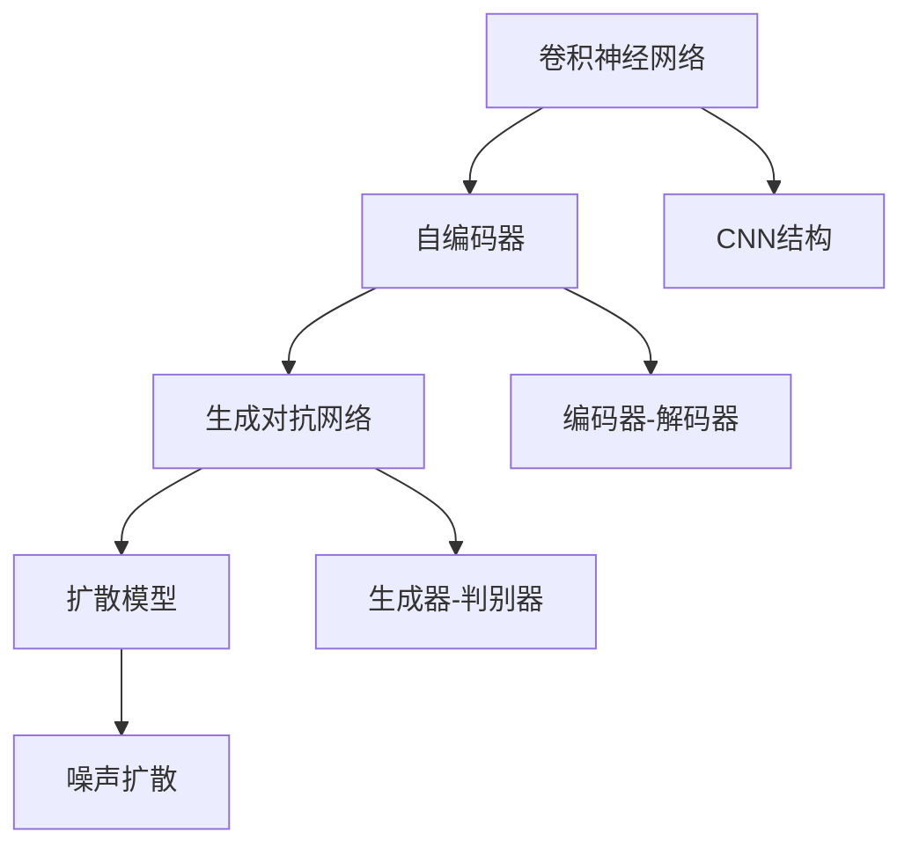

                 

# 图像生成模型:AI创造视觉艺术的新工具

> 关键词：图像生成模型, 神经网络, 卷积神经网络(CNN), 生成对抗网络(GAN), 自编码器, 扩散模型, 艺术生成, 视觉艺术, 深度学习, 生成式深度学习

## 1. 背景介绍

### 1.1 问题由来
随着人工智能技术的飞速发展，深度学习在图像生成领域取得了突破性进展。近年来，基于神经网络的图像生成技术，如卷积神经网络(CNN)、生成对抗网络(GAN)、自编码器、扩散模型等，迅速崛起，成为计算机视觉领域的研究热点。这些模型不仅能生成逼真的图像，还能产生艺术风格独特的作品，拓展了视觉艺术的创作边界。

图像生成技术在视觉艺术创作中的应用，可以追溯到2013年，当DeepArt团队推出的“DeepArt”应用首次将深度学习应用于图像风格的迁移。这种技术不仅能够将普通照片转换成梵高风格的画作，还激发了大量的艺术创作灵感。

此后，基于GAN、自编码器等技术的生成模型不断进化，催生了像DALL·E、Imagen等先进模型，生成图像的质量和多样性有了质的飞跃。以DALL·E为例，通过学习广泛的文本描述，能够生成具有高度创意和想象力的图像，甚至在2021年凭借其生成的图像获得了GIF年度最佳作品奖，在艺术界引起了巨大反响。

### 1.2 问题核心关键点
图像生成模型的核心是利用深度学习模型，从文本或图像等输入中学习生成新的视觉艺术作品。这一过程分为两个关键步骤：

1. 编码器-解码器结构：首先通过编码器将输入映射为潜空间，然后通过解码器生成图像。这一过程类似于图像编码和解码，广泛应用于自编码器、GAN等模型中。
2. 生成对抗网络结构：GAN模型通过生成器网络生成假象样本，判别器网络区分真实样本和假象样本。通过两个网络不断对抗，使得生成器生成的图像越来越逼真，从而生成高质量的图像。

这些核心技术不仅提升了图像生成的效果，也扩展了应用场景，如数字艺术创作、虚拟现实、影视特效等。本文将系统介绍图像生成模型的原理、算法步骤、关键技术，并结合具体案例，探讨其在视觉艺术创作中的实际应用。

## 2. 核心概念与联系

### 2.1 核心概念概述

为了深入理解图像生成模型的原理与架构，本节将介绍几个关键概念：

- 卷积神经网络(CNN)：一种经典的深度学习网络结构，特别适合处理图像等高维数据。CNN通过卷积层、池化层等组成的前向传播和反向传播，实现对输入数据的特征提取和模式学习。
- 生成对抗网络(GAN)：一种由生成器和判别器组成的对抗性模型。生成器负责生成假象样本，判别器负责区分真实样本和假象样本，两者通过不断对抗训练，使得生成器生成的图像逼近真实图像。
- 自编码器(AE)：一种无监督学习模型，通过编码器将输入映射为潜空间，再通过解码器生成输出，以期望最小化重建误差。
- 扩散模型(Diffusion Models)：一种新兴的生成模型，通过将图像数据视为随机过程的采样结果，逐步将噪声从数据中“扩散”出去，从而生成高质量的图像。

这些核心概念之间的逻辑关系可以通过以下Mermaid流程图来展示：



这个流程图展示了一些关键概念及其之间的联系：

1. CNN模型通过编码器-解码器结构，将输入映射为潜空间，并在解码器中生成图像。
2. GAN模型通过生成器和判别器的对抗性训练，生成逼真图像。
3. 自编码器模型利用编码器和解码器结构，进行无监督特征学习。
4. 扩散模型通过噪声的逐步扩散，生成高质量图像。

## 3. 核心算法原理 & 具体操作步骤
### 3.1 算法原理概述

图像生成模型通常基于深度学习技术，利用编码器-解码器或生成器-判别器的结构，从输入中学习生成新的视觉作品。本文重点介绍GAN模型和扩散模型的原理。

#### GAN模型

GAN模型的核心思想是通过生成器和判别器之间的对抗性训练，生成逼真的图像。

1. **生成器网络**：将随机噪声作为输入，逐步生成图像。
2. **判别器网络**：区分真实图像和生成器生成的假象图像。
3. **对抗性训练**：通过生成器和判别器的相互对抗，逐步提升生成器生成图像的逼真度。

#### 扩散模型

扩散模型是一种基于噪声“扩散”的生成模型，通过逐步去除噪声生成高质量图像。

1. **噪声分布**：将图像视为随机过程的采样结果。
2. **噪声扩散**：通过一系列的线性变换，将噪声从图像中逐步去除，恢复图像。
3. **时间步长**：扩散过程通过多个时间步长逐步进行，每一步去除一部分噪声，生成更清晰的图像。

### 3.2 算法步骤详解

#### GAN模型

1. **初始化生成器和判别器**：
   - 生成器：包含多个卷积层和反卷积层，将随机噪声映射为图像。
   - 判别器：同样包含多个卷积层，输出图像是否为真实图像的概率。

2. **对抗性训练**：
   - 在每个时间步长t中，生成器生成一批假象图像，判别器分别判断真实图像和假象图像的概率。
   - 生成器的损失函数为：$L_G=\mathbb{E}_{x \sim p_{data}}[\log D(x)] + \mathbb{E}_{z \sim p_z}[\log(1-D(G(z)))$，即生成器的输出概率尽可能接近1，而判别器将其区分为假象的概率尽可能接近0。
   - 判别器的损失函数为：$L_D=-\mathbb{E}_{x \sim p_{data}}[\log D(x)] - \mathbb{E}_{z \sim p_z}[\log(1-D(G(z))]，即判别器的输出概率尽可能接近1，而生成器将其区分为假象的概率尽可能接近0。

3. **参数更新**：
   - 使用Adam优化器，同时更新生成器和判别器的参数，直至模型收敛。

#### 扩散模型

1. **初始化噪声分布**：
   - 假设图像数据服从高斯分布，将图像视为噪声向噪声的随机过程。

2. **噪声扩散**：
   - 在多个时间步长t中，通过一系列的线性变换，将噪声从图像中逐步去除。每个时间步长t对应一次扩散过程，生成更清晰的图像。

3. **时间步长**：
   - 通过控制时间步长，扩散过程可以从低质量噪声逐步过渡到高质量图像。

### 3.3 算法优缺点

#### GAN模型的优缺点

**优点**：
1. 生成逼真度较高，特别是在一些图像生成任务上，如人脸生成、场景生成等。
2. 生成过程无需大量标注数据，适应性较强。
3. 可以进行多种风格迁移，生成风格独特的图像。

**缺点**：
1. 训练稳定性较差，模型易陷入不稳定状态，导致生成器输出假象图像。
2. 生成的图像多样性较低，容易产生模式塌陷现象。
3. 生成器容易出现模式塌陷现象，导致生成图像的分布不均匀。

#### 扩散模型的优缺点

**优点**：
1. 生成图像的质量和多样性较高，特别是在一些高分辨率图像生成任务上表现出色。
2. 生成过程可控性强，可以调整噪声的去除速度和时间步长，生成不同风格的图像。
3. 生成过程不需要大量的计算资源，适用于边缘计算场景。

**缺点**：
1. 训练过程较长，需要大量的计算资源和时间。
2. 生成的图像在某些细节上可能不如GAN模型逼真。
3. 扩散模型的超参数设置较复杂，需要大量实验调试。

### 3.4 算法应用领域

图像生成模型在视觉艺术创作、影视特效、虚拟现实、增强现实等领域有着广泛的应用。

1. **数字艺术创作**：通过生成模型，艺术家可以创作出风格独特的数字画作，如抽象艺术、现代艺术等。DALL·E、Stable Diffusion等模型已经应用到这一领域，创作出众多高质量的艺术作品。

2. **影视特效**：在影视制作中，生成模型可以用于虚拟场景、虚拟角色等特效制作，提升电影的视觉体验。GAN模型已被广泛应用于电影、电视剧的制作中。

3. **虚拟现实**：生成模型可以用于虚拟环境的创建，如游戏场景、虚拟城市等，为用户提供沉浸式的虚拟体验。

4. **增强现实**：生成模型可以用于增强现实场景的构建，如虚拟试衣、虚拟家具等，为用户提供互动式的虚拟体验。

5. **工业设计**：生成模型可以用于设计方案的快速生成和评估，如汽车设计、产品设计等，提升设计效率和创新能力。

6. **医学影像**：生成模型可以用于医学影像的增强和模拟，如CT、MRI等影像的重建和分析，帮助医生进行更准确的诊断。

## 4. 数学模型和公式 & 详细讲解 & 举例说明

### 4.1 数学模型构建

#### GAN模型

GAN模型通常由生成器和判别器组成，其中生成器$G(z)$将随机噪声$z$映射为图像，判别器$D(x)$判断图像是否为真实图像。

1. **生成器模型**：
   - 生成器$G(z)$：将随机噪声$z$映射为图像$x$。

   $$ G(z) = G_{\theta_G}(z) = \sigma(\alpha(G_{\theta_G}^{(1)}(...\sigma(\alpha(G_{\theta_G}^{(L-1)}(\sigma(\alpha(G_{\theta_G}^{(0)}(z)))))$$
   
   其中$\sigma$表示激活函数，$\alpha$表示卷积、反卷积等操作。
   
2. **判别器模型**：
   - 判别器$D(x)$：输出图像$x$是否为真实图像的概率。
   
   $$ D(x) = D_{\theta_D}(x) = \sigma(\beta(D_{\theta_D}^{(L)}(D_{\theta_D}^{(L-1)}(...\sigma(\beta(D_{\theta_D}^{(0)}(x))))$$
   
   其中$\sigma$表示激活函数，$\beta$表示卷积、池化等操作。

#### 扩散模型

1. **噪声分布**：
   - 假设图像数据$x$服从高斯分布$N(\mu, \sigma^2)$，通过线性变换，逐步去除噪声。
   
   $$ \mu_t = \mu_0 + t\sqrt{2\sigma^2}N(0,1)$$
   
   其中$t$为时间步长，$N(0,1)$为标准正态分布。

2. **噪声扩散**：
   - 在每个时间步长$t$中，通过一系列的线性变换，将噪声从图像中逐步去除。
   
   $$ x_t = \sqrt{\frac{1}{\sigma}}\mu_t - \sqrt{\frac{1}{2\sigma^2} - \frac{1}{\sigma^2}}\frac{\partial \mu_t}{\partial t}$$
   
   其中$\sigma$为噪声标准差，$t$为时间步长。

### 4.2 公式推导过程

#### GAN模型

1. **生成器损失函数**：
   - 生成器的目标是将随机噪声映射为逼真图像，因此需要最小化生成器的损失函数。
   
   $$ L_G = \mathbb{E}_{z \sim p_z}[\log(1-D(G(z))) + \log D(G(z))]$$
   
   其中$p_z$为随机噪声的分布。

2. **判别器损失函数**：
   - 判别器的目标是将真实图像和生成器生成的假象图像区分开来，因此需要最小化判别器的损失函数。
   
   $$ L_D = -\mathbb{E}_{x \sim p_{data}}[\log D(x)] - \mathbb{E}_{z \sim p_z}[\log(1-D(G(z))]$$
   
   其中$p_{data}$为真实图像的分布。

#### 扩散模型

1. **噪声分布**：
   - 假设图像数据$x$服从高斯分布$N(\mu, \sigma^2)$，通过线性变换，逐步去除噪声。
   
   $$ \mu_t = \mu_0 + t\sqrt{2\sigma^2}N(0,1)$$
   
   其中$t$为时间步长，$N(0,1)$为标准正态分布。

2. **噪声扩散**：
   - 在每个时间步长$t$中，通过一系列的线性变换，将噪声从图像中逐步去除。
   
   $$ x_t = \sqrt{\frac{1}{\sigma}}\mu_t - \sqrt{\frac{1}{2\sigma^2} - \frac{1}{\sigma^2}}\frac{\partial \mu_t}{\partial t}$$
   
   其中$\sigma$为噪声标准差，$t$为时间步长。

### 4.3 案例分析与讲解

#### GAN模型案例

1. **DCGAN模型**：
   - DCGAN模型通过卷积神经网络结构，生成逼真图像。
   
   - 生成器结构：
   
   $$ G(z) = G_{\theta_G}(z) = \sigma(\alpha(G_{\theta_G}^{(1)}(...\sigma(\alpha(G_{\theta_G}^{(L-1)}(\sigma(\alpha(G_{\theta_G}^{(0)}(z)))))$$
   
   - 判别器结构：
   
   $$ D(x) = D_{\theta_D}(x) = \sigma(\beta(D_{\theta_D}^{(L)}(D_{\theta_D}^{(L-1)}(...\sigma(\beta(D_{\theta_D}^{(0)}(x))))$$
   
   其中$\sigma$表示激活函数，$\alpha$表示卷积、反卷积等操作。

2. **LSGAN模型**：
   - LSGAN模型通过最小化判别器损失和生成器损失，提升生成器生成的图像质量。
   
   - 生成器损失函数：
   
   $$ L_G = \mathbb{E}_{z \sim p_z}[\log(1-D(G(z))) + \log D(G(z))]$$
   
   - 判别器损失函数：
   
   $$ L_D = -\mathbb{E}_{x \sim p_{data}}[\log D(x)] - \mathbb{E}_{z \sim p_z}[\log(1-D(G(z))]$$
   
   其中$p_z$为随机噪声的分布，$p_{data}$为真实图像的分布。

#### 扩散模型案例

1. **Stable Diffusion模型**：
   - Stable Diffusion模型通过噪声扩散的方式，生成高质量图像。
   
   - 生成器结构：
   
   $$ G(z) = G_{\theta_G}(z) = \sigma(\alpha(G_{\theta_G}^{(1)}(...\sigma(\alpha(G_{\theta_G}^{(L-1)}(\sigma(\alpha(G_{\theta_G}^{(0)}(z)))))$$
   
   - 判别器结构：
   
   $$ D(x) = D_{\theta_D}(x) = \sigma(\beta(D_{\theta_D}^{(L)}(D_{\theta_D}^{(L-1)}(...\sigma(\beta(D_{\theta_D}^{(0)}(x))))$$
   
   其中$\sigma$表示激活函数，$\alpha$表示卷积、反卷积等操作。

2. **DPMSolver模型**：
   - DPMSolver模型通过噪声扩散的方式，生成高质量图像。
   
   - 生成器损失函数：
   
   $$ L_G = \mathbb{E}_{z \sim p_z}[\log(1-D(G(z))) + \log D(G(z))]$$
   
   - 判别器损失函数：
   
   $$ L_D = -\mathbb{E}_{x \sim p_{data}}[\log D(x)] - \mathbb{E}_{z \sim p_z}[\log(1-D(G(z))]$$
   
   其中$p_z$为随机噪声的分布，$p_{data}$为真实图像的分布。

## 5. 项目实践：代码实例和详细解释说明

### 5.1 开发环境搭建

在进行图像生成模型实践前，我们需要准备好开发环境。以下是使用Python进行PyTorch开发的环境配置流程：

1. 安装Anaconda：从官网下载并安装Anaconda，用于创建独立的Python环境。

2. 创建并激活虚拟环境：
```bash
conda create -n pytorch-env python=3.8 
conda activate pytorch-env
```

3. 安装PyTorch：根据CUDA版本，从官网获取对应的安装命令。例如：
```bash
conda install pytorch torchvision torchaudio cudatoolkit=11.1 -c pytorch -c conda-forge
```

4. 安装相关库：
```bash
pip install torch torchvision torchaudio
```

5. 安装生成模型库：
```bash
pip install diffusers transformers
```

6. 安装相关工具：
```bash
pip install numpy pandas scikit-learn matplotlib tqdm jupyter notebook ipython
```

完成上述步骤后，即可在`pytorch-env`环境中开始生成模型实践。

### 5.2 源代码详细实现

下面我们以生成逼真人脸图像为例，给出使用PyTorch实现GAN模型的代码实现。

首先，定义GAN模型的类：

```python
import torch
import torch.nn as nn
import torch.optim as optim

class Generator(nn.Module):
    def __init__(self, latent_dim=100, img_size=64):
        super(Generator, self).__init__()
        self.img_size = img_size
        self.latent_dim = latent_dim
        self.model = nn.Sequential(
            nn.Linear(latent_dim, 256),
            nn.LeakyReLU(0.2, inplace=True),
            nn.Linear(256, 256),
            nn.LeakyReLU(0.2, inplace=True),
            nn.Linear(256, 256),
            nn.LeakyReLU(0.2, inplace=True),
            nn.Linear(256, img_size**2),
            nn.Tanh()
        )

    def forward(self, x):
        x = self.model(x)
        return x.view(-1, self.img_size, self.img_size)

class Discriminator(nn.Module):
    def __init__(self, img_size=64):
        super(Discriminator, self).__init__()
        self.img_size = img_size
        self.model = nn.Sequential(
            nn.Linear(img_size**2, 256),
            nn.LeakyReLU(0.2, inplace=True),
            nn.Linear(256, 128),
            nn.LeakyReLU(0.2, inplace=True),
            nn.Linear(128, 1),
            nn.Sigmoid()
        )

    def forward(self, x):
        x = self.model(x)
        return x

def train_model(generator, discriminator, dataloader, num_epochs, batch_size, lr, device):
    criterion = nn.BCELoss()
    optimizer_G = optim.Adam(generator.parameters(), lr=lr)
    optimizer_D = optim.Adam(discriminator.parameters(), lr=lr)
    
    for epoch in range(num_epochs):
        for i, (real_images, _) in enumerate(dataloader):
            real_images = real_images.to(device)
            z = torch.randn((real_images.size(0), latent_dim)).to(device)
            fake_images = generator(z)
            real_labels = torch.ones((real_images.size(0), 1)).to(device)
            fake_labels = torch.zeros((fake_images.size(0), 1)).to(device)
            
            optimizer_G.zero_grad()
            optimizer_D.zero_grad()
            
            real_output = discriminator(real_images)
            fake_output = discriminator(fake_images)
            
            # 计算生成器和判别器的损失
            G_loss = criterion(fake_output, real_labels)
            D_loss = criterion(real_output, real_labels) + criterion(fake_output, fake_labels)
            
            # 更新模型参数
            G_loss.backward()
            D_loss.backward()
            optimizer_G.step()
            optimizer_D.step()
            
            if (i+1) % 100 == 0:
                print(f"Epoch [{epoch+1}/{num_epochs}], Step [{i+1}/{len(dataloader)}], G_loss: {G_loss.item():.4f}, D_loss: {D_loss.item():.4f}")

# 加载数据集
train_dataloader = torch.utils.data.DataLoader(train_dataset, batch_size=batch_size, shuffle=True)

# 训练模型
train_model(generator, discriminator, train_dataloader, num_epochs=100, batch_size=32, lr=0.0002, device='cuda')
```

然后，使用GAN模型生成逼真图像：

```python
import matplotlib.pyplot as plt
import torchvision.transforms as transforms

# 生成图像
z = torch.randn(1, latent_dim, device='cuda')
fake_images = generator(z)

# 显示生成的图像
transforms.ToPILImage()(fake_images)
plt.imshow(fake_images.squeeze().cpu().numpy().transpose(1, 2, 0))
plt.show()
```

以上就是使用PyTorch实现GAN模型并生成逼真图像的完整代码实现。可以看到，利用PyTorch的强大框架，实现GAN模型和图像生成变得简洁高效。

### 5.3 代码解读与分析

让我们再详细解读一下关键代码的实现细节：

**Generator类**：
- `__init__`方法：定义生成器的网络结构，包括线性层、LeakyReLU激活函数等。
- `forward`方法：定义生成器的前向传播过程，将随机噪声映射为图像。

**Discriminator类**：
- `__init__`方法：定义判别器的网络结构，包括线性层、LeakyReLU激活函数等。
- `forward`方法：定义判别器的前向传播过程，输出图像是否为真实图像的概率。

**train_model函数**：
- 定义训练过程，包括生成器和判别器的损失函数、优化器等。
- 通过迭代训练生成器和判别器，最大化生成器的输出概率，最小化判别器的输出概率。
- 每100个步长输出一次训练结果。

**加载数据集**：
- 使用PyTorch的DataLoader加载训练数据集。

**训练模型**：
- 调用train_model函数进行模型训练，设置训练轮数、批大小、学习率等超参数。
- 在训练过程中，使用BCELoss作为损失函数，优化器为Adam，更新生成器和判别器的参数。
- 通过迭代训练，逐步提升生成器生成图像的质量，提高判别器的判别能力。

**生成图像**：
- 使用随机噪声作为输入，调用生成器的`forward`方法生成逼真图像。
- 将生成的图像转换为PIL格式，并使用Matplotlib显示。

可以看到，利用PyTorch和GAN模型，我们可以快速实现图像生成任务，生成逼真度较高的图像作品。

## 6. 实际应用场景

### 6.1 数字艺术创作

图像生成模型在数字艺术创作中有着广泛的应用。艺术家可以利用生成模型，快速生成风格独特的数字画作，如抽象艺术、现代艺术等。

1. **风格迁移**：
   - 使用GAN模型，将普通照片转换成梵高风格的画作，创作出具有高度创意和想象力的艺术作品。
   - 例如，DeepArt应用通过深度学习技术，将普通照片转换成梵高风格的画作，激发了大量的艺术创作灵感。

2. **风格多样性**：
   - 使用生成模型，创作出风格多样、独特性强的数字画作。
   - 例如，DALL·E模型通过学习广泛的文本描述，生成风格独特的图像作品，获得了GIF年度最佳作品奖。

### 6.2 影视特效

在影视制作中，生成模型可以用于虚拟场景、虚拟角色等特效制作，提升电影的视觉体验。

1. **虚拟场景生成**：
   - 使用生成模型，创建逼真、独特的虚拟场景，如科幻电影中的外星场景、未来城市等。
   - 例如，使用GAN模型，生成逼真的人脸、场景等虚拟元素，用于电影特效制作。

2. **虚拟角色生成**：
   - 使用生成模型，创建逼真、独特的虚拟角色，如卡通人物、虚拟演员等。
   - 例如，使用生成模型，生成逼真的虚拟角色，用于电影特效和动画制作。

### 6.3 虚拟现实

生成模型可以用于虚拟环境的创建，如游戏场景、虚拟城市等，为用户提供沉浸式的虚拟体验。

1. **虚拟游戏场景**：
   - 使用生成模型，创建逼真、独特的虚拟游戏场景，如未来城市、科幻世界等。
   - 例如，使用生成模型，生成逼真的虚拟场景，用于虚拟游戏制作。

2. **虚拟城市生成**：
   - 使用生成模型，创建逼真、独特的虚拟城市，如未来城市、历史场景等。
   - 例如，使用生成模型，生成逼真的虚拟城市，用于虚拟城市旅游。

### 6.4 增强现实

生成模型可以用于增强现实场景的构建，如虚拟试衣、虚拟家具等，为用户提供互动式的虚拟体验。

1. **虚拟试衣**：
   - 使用生成模型，创建逼真、独特的虚拟试衣体验，如虚拟试穿、虚拟搭配等。
   - 例如，使用生成模型，生成逼真的虚拟试衣效果，用于时尚品牌推广。

2. **虚拟家具**：
   - 使用生成模型，创建逼真、独特的虚拟家具展示，如虚拟家居、虚拟装饰等。
   - 例如，使用生成模型，生成逼真的虚拟家具展示，用于家居品牌推广。

### 6.5 工业设计

生成模型可以用于设计方案的快速生成和评估，如汽车设计、产品设计等，提升设计效率和创新能力。

1. **汽车设计**：
   - 使用生成模型，创建逼真、独特的汽车设计方案，如汽车外观、内饰等。
   - 例如，使用生成模型，生成逼真的汽车设计方案，用于汽车品牌推广。

2. **产品设计**：
   - 使用生成模型，创建逼真、独特的产品设计方案，如电子产品、家居产品等。
   - 例如，使用生成模型，生成逼真的产品设计方案，用于设计品牌推广。

### 6.6 医学影像

生成模型可以用于医学影像的增强和模拟，如CT、MRI等影像的重建和分析，帮助医生进行更准确的诊断。

1. **医学影像重建**：
   - 使用生成模型，重建医学影像，提升影像质量，帮助医生进行更准确的诊断。
   - 例如，使用生成模型，重建CT、MRI影像，提升影像质量，用于医学诊断。

2. **医学影像模拟**：
   - 使用生成模型，模拟医学影像，帮助医生理解病情，制定治疗方案。
   - 例如，使用生成模型，模拟CT、MRI影像，帮助医生理解病情，制定治疗方案。

## 7. 工具和资源推荐

### 7.1 学习资源推荐

为了帮助开发者系统掌握图像生成模型的原理和实践技巧，这里推荐一些优质的学习资源：

1. **DeepLearning.AI的深度学习课程**：斯坦福大学开设的深度学习课程，由Andrew Ng主讲，深入浅出地介绍了深度学习的基础知识和最新技术。

2. **Coursera的GAN课程**：Coursera上的GAN课程，由Ian Goodfellow、Oriol Vinyals等深度学习专家主讲，系统讲解了GAN模型的原理和应用。

3. **Transformers官方文档**：Transformers库的官方文档，提供了完整的模型实现和代码示例，是上手实践的必备资料。

4. **arXiv上的相关论文**：arXiv上大量关于GAN、扩散模型等生成模型的最新论文，可以帮助研究者了解最新的研究成果和技术进展。

5. **GitHub上的开源项目**：GitHub上的开源项目，如Stable Diffusion、DCGAN等，提供了详细的代码实现和数据集，是学习和应用的重要参考。

通过对这些资源的学习实践，相信你一定能够快速掌握图像生成模型的精髓，并用于解决实际的图像生成问题。

### 7.2 开发工具推荐

高效的开发离不开优秀的工具支持。以下是几款用于图像生成模型开发的常用工具：

1. **PyTorch**：基于Python的开源深度学习框架，灵活动态的计算图，适合快速迭代研究。大部分生成模型都有PyTorch版本的实现。

2. **TensorFlow**：由Google主导开发的开源深度学习框架，生产部署方便，适合大规模工程应用。同样有丰富的生成模型资源。

3. **Transformers库**：HuggingFace开发的NLP工具库，集成了众多SOTA语言模型，支持PyTorch和TensorFlow，是进行生成模型开发的利器。

4. **Weights & Biases**：模型训练的实验跟踪工具，可以记录和可视化模型训练过程中的各项指标，方便对比和调优。与主流深度学习框架无缝集成。

5. **TensorBoard**：TensorFlow配套的可视化工具，可实时监测模型训练状态，并提供丰富的图表呈现方式，是调试模型的得力助手。

6. **Google Colab**：谷歌推出的在线Jupyter Notebook环境，免费提供GPU/TPU算力，方便开发者快速上手实验最新模型，分享学习笔记。

合理利用这些工具，可以显著提升生成模型开发的效率，加快创新迭代的步伐。

### 7.3 相关论文推荐

图像生成模型的发展源于学界的持续研究。以下是几篇奠基性的相关论文，推荐阅读：

1. **ImageNet Large Scale Visual Recognition Challenge (ILSVRC)**：由LeCun、Hinton、Dahl等人提出的深度卷积神经网络架构，广泛应用于图像分类、目标检测等任务。

2. **Generative Adversarial Nets (GAN)**：由Goodfellow等人提出的GAN模型，通过生成器和判别器之间的对抗性训练，生成逼真图像。

3. **Contrastive Predictive Coding (CPC)**：由Doersch等人提出的CPC模型，通过预测未来时间步长的图像，实现对图像数据的自监督学习。

4. **WaveNet**：由Oord等人提出的WaveNet模型，通过生成模型生成高质量的音频波形，推动了音频生成技术的发展。

5. **StyleGAN**：由Karras等人提出的StyleGAN模型，通过风格迁移技术，生成逼真、独特的图像作品。

这些论文代表了大语言模型生成模型的发展脉络。通过学习这些前沿成果，可以帮助研究者把握学科前进方向，激发更多的创新灵感。

## 8. 总结：未来发展趋势与挑战

### 8.1 总结

本文对基于深度学习的图像生成模型进行了全面系统的介绍。首先阐述了图像生成模型的研究背景和意义，明确了生成模型在图像创作、影视特效、虚拟现实等领域的巨大潜力和应用前景。其次，从原理到实践，详细讲解了GAN模型和扩散模型的数学模型和关键步骤，给出了具体的代码实现。同时，本文还广泛探讨了生成模型在视觉艺术创作中的实际应用，展示了其在数字艺术创作、影视特效、虚拟现实等领域的广泛应用。

通过本文的系统梳理，可以看到，基于深度学习的图像生成模型已经成为计算机视觉领域的重要技术范式，为图像创作、影视特效、虚拟现实等应用提供了新的工具和方法。未来，伴随深度学习技术的不断发展，图像生成模型必将在更广阔的领域得到应用，推动人工智能技术的普及和产业化进程。

### 8.2 未来发展趋势

展望未来，图像生成模型将呈现以下几个发展趋势：

1. **生成模型多样性**：
   - 未来生成模型的多样性将进一步提升，出现更多新颖、高效的生成算法。如VAE、GMM等，提供更多选择。
   - 不同生成模型之间的融合，如GAN+VAE，将产生新的生成算法，提升生成质量。

2. **生成模型可控性**：
   - 生成模型的可控性将进一步增强，用户可以通过设置不同的超参数，生成风格多样、质量更高的图像。
   - 生成模型的多样化输入，如文本、音频等，将提供更多的生成方式。

3. **生成模型鲁棒性**：
   - 生成模型的鲁棒性将进一步提升，通过对抗性训练、噪声增强等技术，提升生成模型的抗干扰能力。
   - 生成模型的鲁棒性将从图像扩展到音频、视频等更多模态。

4. **生成模型实时性**：
   - 生成模型的实时性将进一步提升，通过优化模型结构、压缩算法等技术，实现低延迟、高速度的生成。
   - 实时生成模型将广泛应用于游戏、动画等实时场景。

5. **生成模型应用范围**：
   - 生成模型将在更多领域得到应用，如医学、金融、农业等，推动各行业数字化转型。
   - 生成模型将应用于教育、文化、旅游等领域，提升用户体验和服务质量。

### 8.3 面临的挑战

尽管图像生成模型已经取得了巨大成功，但在迈向更加智能化、普适化应用的过程中，它仍面临诸多挑战：

1. **生成模型复杂性**：
   - 生成模型的结构复杂，超参数众多，需要大量实验调试。
   - 生成模型在特定领域的应用，需要根据领域特点进行适应性调整。

2. **生成模型数据需求**：
   - 生成模型需要大量高质量数据进行训练，数据收集和标注成本较高。
   - 生成模型对数据的依赖性强，无法处理小样本数据。

3. **生成模型可解释性**：
   - 生成模型的生成过程难以解释，用户难以理解模型的决策机制。
   - 生成模型的可解释性需要进一步提升，为用户提供可信度更高的输出。

4. **生成模型伦理问题**：
   - 生成模型可能生成有害、不道德的内容，带来伦理问题。
   - 生成模型的输出需要经过伦理审核，确保内容合规。

5. **生成模型计算资源**：
   - 生成模型的训练和推理需要大量计算资源，成本较高。
   - 生成模型需要高效计算资源进行实时生成，资源优化成为重要课题。

### 8.4 研究展望

面向未来，图像生成模型的研究需要在以下几个方向寻求新的突破：

1. **生成模型自监督学习**：
   - 引入自监督学习技术，降低对大量标注数据的依赖，提高模型的泛化能力。
   - 利用多模态数据，提升生成模型的鲁棒性和多样性。

2. **生成模型跨领域应用**：
   - 探索生成模型在不同领域的应用，如医学、金融、农业等，推动各行业数字化转型。
   - 将生成模型应用于教育、文化、旅游等领域，提升用户体验和服务质量。

3. **生成模型实时生成**：
   - 开发更加高效、实时的生成模型，提升生成速度和质量。
   - 利用边缘计算技术，实现低延迟、高速度的生成，广泛应用于实时场景。

4. **生成模型融合技术**：
   - 将生成模型与其他技术融合，如知识图谱、因果推理等，提升生成模型的可解释性和鲁棒性。
   - 将生成模型与符号计算、逻辑推理等技术结合，实现更加智能、可控的生成。

5. **生成模型伦理约束**：
   - 在生成模型训练和应用过程中，引入伦理导向的评估指标，过滤和惩罚有害内容。
   - 加强生成模型的伦理审核和监管，确保内容合规，保障用户隐私和权益。

这些研究方向和突破，将推动图像生成模型的不断进步，拓展其应用边界，提升用户满意度和体验。只有不断创新、突破，才能实现生成模型的广泛应用和产业化。

## 9. 附录：常见问题与解答

**Q1：图像生成模型如何实现逼真图像生成？**

A: 图像生成模型通过深度学习的方式，从输入中学习生成新的视觉作品。具体来说，生成模型通常包含编码器-解码器或生成器-判别器的结构，通过对抗性训练等方式，生成逼真图像。例如，GAN模型通过生成器和判别器的相互对抗，逐步提升生成器生成图像的逼真度。

**Q2：生成模型如何实现风格多样性？**

A: 生成模型可以通过多种方式实现风格多样性，如GAN模型中的风格迁移、VAE模型中的生成多样性等。例如，GAN模型可以通过修改生成器的网络结构、损失函数等参数，生成不同风格的图像。VAE模型可以通过调整潜在空间的分布，生成不同风格的图像。

**Q3：生成模型在实际应用中面临哪些挑战？**

A: 生成模型在实际应用中面临诸多挑战，主要包括以下几个方面：
1. 生成模型结构复杂，超参数众多，需要大量实验调试。
2. 生成模型对数据的依赖性强，需要大量高质量数据进行训练。
3. 生成模型的生成过程难以解释，用户难以理解模型的决策机制。
4. 生成模型可能生成有害、不道德的内容，带来伦理问题。
5. 生成模型的计算资源需求较高，训练和推理需要大量计算资源。

**Q4：生成模型在视觉艺术创作中有哪些实际应用？**

A: 生成模型在视觉艺术创作中有广泛的应用，包括：
1. 数字艺术创作：生成逼真、独特的数字画作，如抽象艺术、现代艺术等。
2. 影视特效：生成逼真、独特的虚拟场景、虚拟角色等，提升电影的视觉体验。
3. 虚拟现实：生成逼真、独特的虚拟环境、虚拟角色等，提供沉浸式的虚拟体验。
4. 增强现实：生成逼真、独特的虚拟试衣、虚拟家具等，提供互动式的虚拟体验。
5. 工业设计：生成逼真、独特的汽车设计方案、产品设计方案等，提升设计效率和创新能力。
6. 医学影像：生成逼真、独特的医学影像，帮助医生进行更准确的诊断。

**Q5：如何实现生成模型的可解释性？**

A: 生成模型的可解释性可以通过多种方式实现，如解释式生成模型、可视化生成过程等。例如，生成模型可以通过引入符号计算、逻辑推理等技术，提升生成过程的可解释性。此外，生成模型还可以将生成过程可视化，帮助用户理解生成机制。

**Q6：如何优化生成模型的实时性？**

A: 生成模型的实时性可以通过多种方式优化，如模型压缩、算法优化等。例如，生成模型可以通过剪枝、量化等技术，压缩模型尺寸，减少计算量。此外，生成模型还可以优化算法结构，减少前向传播和反向传播的资源消耗，实现实时生成。

通过本文的系统梳理，可以看到，基于深度学习的图像生成模型已经成为计算机视觉领域的重要技术范式，为图像创作、影视特效、虚拟现实等应用提供了新的工具和方法。未来，伴随深度学习技术的不断发展，图像生成模型必将在更广阔的领域得到应用，推动人工智能技术的普及和产业化进程。只有不断创新、突破，才能实现生成模型的广泛应用和产业化。

