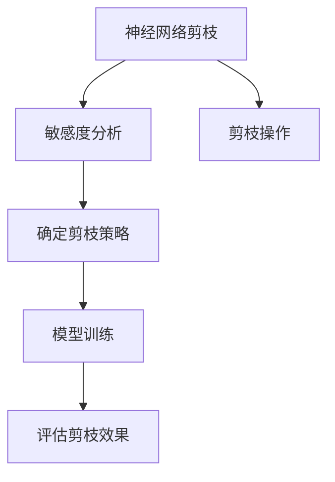

                 

# 基于敏感度的神经网络剪枝方法探讨

## 1. 背景介绍

在深度学习模型中，神经网络剪枝（Pruning）是一种优化技术，旨在减少模型中的冗余参数，提高模型的计算效率和推理速度，同时保持模型的性能。传统的剪枝方法通常通过人工经验来确定剪枝规则和策略，如基于阈值剪枝、结构剪枝等，存在一定的局限性。近年来，随着敏感度分析（Sensitivity Analysis）技术的引入，神经网络剪枝开始向基于敏感度的方向发展。

敏感度分析是一种评估模型参数对模型输出影响程度的技术，旨在识别出对模型性能影响较大的参数，从而有针对性地进行剪枝。本文将探讨基于敏感度的神经网络剪枝方法，深入分析其原理、操作步骤和应用场景，并通过实际案例进行详细讲解。

## 2. 核心概念与联系

### 2.1 核心概念概述

- **神经网络剪枝**：减少神经网络中不必要的连接或参数，以减少模型复杂度和计算成本，同时保持模型性能的方法。
- **敏感度分析**：通过计算模型输出对各个参数的敏感度，评估参数对模型性能的影响程度，从而指导剪枝策略。
- **L1正则化**：在损失函数中引入L1范数正则项，促使模型参数分布稀疏，有利于剪枝。
- **梯度剪枝**：根据梯度的大小进行参数排序，剪去梯度较小的参数，减少计算资源消耗。
- **特征选择**：基于特征的重要性，对神经网络中各层的输入和输出进行选择，从而进行剪枝。

这些核心概念共同构成了神经网络剪枝的技术框架，通过敏感度分析，可以更加精确地指导剪枝操作，提高剪枝效果和模型性能。

### 2.2 核心概念联系

神经网络剪枝和敏感度分析之间的联系主要体现在剪枝策略的选择和剪枝效果的评估上。通过敏感度分析，可以识别出对模型性能影响较大的参数或特征，从而指导剪枝策略的选择。同时，敏感度分析也用于评估剪枝后模型性能的变化，确保剪枝不会带来显著的性能损失。

以下是一个简单的Mermaid流程图，展示了神经网络剪枝与敏感度分析之间的联系：



该流程图表明，神经网络剪枝需要通过敏感度分析确定剪枝策略，并在剪枝后对模型性能进行评估，以确保剪枝效果。

## 3. 核心算法原理 & 具体操作步骤

### 3.1 算法原理概述

基于敏感度的神经网络剪枝方法，其核心思想是通过评估模型参数对模型输出的敏感度，确定对模型性能影响较大的参数，从而进行有针对性地剪枝。具体流程包括：

1. 计算模型输出对各个参数的敏感度。
2. 根据敏感度排序参数，选择敏感度较大的参数进行保留。
3. 对选择的参数进行剪枝操作，减少模型中的冗余参数。

### 3.2 算法步骤详解

以下是一个基于敏感度的神经网络剪枝算法的详细步骤：

1. **初始化模型和参数**：选择一个预训练模型，并设置相应的剪枝阈值。
2. **计算敏感度**：使用梯度或Hessian矩阵计算每个参数的敏感度。
3. **排序并选择参数**：根据敏感度排序参数，选择敏感度较高的参数进行保留。
4. **剪枝操作**：将选择的参数进行剪枝操作，如去除连接、固定参数等。
5. **模型训练和评估**：在剪枝后的模型上进行训练，并评估其性能变化。
6. **迭代剪枝**：根据评估结果，多次迭代剪枝操作，直到达到预定的剪枝目标或性能要求。

### 3.3 算法优缺点

基于敏感度的神经网络剪枝方法具有以下优点：
1. 精度较高：通过敏感度分析，可以更准确地识别出对模型性能影响较大的参数。
2. 通用性强：适用于各种神经网络结构和任务，具有较高的应用灵活性。
3. 稳定性好：敏感度分析可以避免人工经验带来的主观性和随机性，提高剪枝的稳定性。

同时，该方法也存在一些缺点：
1. 计算复杂度高：敏感度计算和排序需要消耗较多计算资源，尤其是在大规模神经网络中。
2. 精度损失风险：如果敏感度计算不准确，可能导致误删重要参数，影响模型性能。
3. 剪枝阈值难以确定：剪枝阈值的设定需要经验和实验，难以量化。

### 3.4 算法应用领域

基于敏感度的神经网络剪枝方法已经在各种深度学习模型和任务中得到了广泛应用，例如：

- 图像分类：对卷积神经网络（CNN）模型进行剪枝，提高图像分类任务的推理速度。
- 语音识别：对循环神经网络（RNN）模型进行剪枝，降低语音识别系统的计算负担。
- 自然语言处理（NLP）：对Transformer模型进行剪枝，提升NLP任务的效率和性能。
- 推荐系统：对神经协同过滤（Neural Collaborative Filtering）模型进行剪枝，优化推荐系统的资源利用率。

这些应用领域展示了基于敏感度的神经网络剪枝方法的强大潜力，在提高模型性能和优化资源利用方面具有重要的实际意义。

## 4. 数学模型和公式 & 详细讲解 & 举例说明

### 4.1 数学模型构建

基于敏感度的神经网络剪枝方法可以通过梯度敏感度、Hessian敏感度或特征敏感度等不同方式构建数学模型。这里以梯度敏感度为例，构建基于敏感度的神经网络剪枝模型。

设神经网络模型的损失函数为 $L(\theta)$，其中 $\theta$ 为模型参数向量。对于每个参数 $w_i$，其梯度敏感度定义为：

$$
S_i = \frac{\partial L}{\partial w_i} \cdot \frac{1}{\Vert \frac{\partial L}{\partial w_i} \Vert_2}
$$

其中，$\Vert \cdot \Vert_2$ 表示L2范数。

### 4.2 公式推导过程

为了推导梯度敏感度的计算公式，需要计算损失函数 $L$ 对每个参数 $w_i$ 的梯度，以及梯度的范数。

假设神经网络的输出为 $y$，则损失函数可以表示为：

$$
L(\theta) = \frac{1}{n} \sum_{i=1}^n l(y_i, \hat{y}_i)
$$

其中 $l$ 为损失函数的具体形式，$y_i$ 为真实标签，$\hat{y}_i$ 为模型预测。

对损失函数 $L$ 对每个参数 $w_i$ 求偏导，得到梯度：

$$
\frac{\partial L}{\partial w_i} = \frac{1}{n} \sum_{i=1}^n \frac{\partial l(y_i, \hat{y}_i)}{\partial w_i}
$$

计算梯度的范数：

$$
\Vert \frac{\partial L}{\partial w_i} \Vert_2 = \sqrt{\sum_{j=1}^d \left(\frac{\partial l(y_i, \hat{y}_i)}{\partial w_j}\right)^2}
$$

最终，梯度敏感度 $S_i$ 可以表示为：

$$
S_i = \frac{\partial l(y_i, \hat{y}_i)}{\partial w_i} \cdot \frac{1}{\sqrt{\sum_{j=1}^d \left(\frac{\partial l(y_i, \hat{y}_i)}{\partial w_j}\right)^2}}
$$

### 4.3 案例分析与讲解

以图像分类任务为例，展示如何使用基于敏感度的神经网络剪枝方法。

假设有一个预先训练好的卷积神经网络模型，用于图像分类任务。为了对其进行剪枝，可以计算每个卷积核的梯度敏感度，并选择敏感度较高的卷积核进行保留。

具体步骤如下：
1. 使用梯度敏感度公式计算每个卷积核的敏感度。
2. 根据敏感度排序卷积核，选择敏感度较高的卷积核进行保留。
3. 对保留的卷积核进行剪枝操作，如去除冗余的卷积核连接。
4. 在剪枝后的模型上进行训练，评估其性能变化。

## 5. 项目实践：代码实例和详细解释说明

### 5.1 开发环境搭建

在开发基于敏感度的神经网络剪枝方法时，需要安装和配置相关的软件工具。以下是开发环境搭建的步骤：

1. **安装Python**：确保Python版本为3.6或更高，使用Anaconda或Miniconda安装和管理Python环境。
2. **安装TensorFlow或PyTorch**：TensorFlow和PyTorch都是常用的深度学习框架，可以根据项目需求进行选择。
3. **安装剪枝工具包**：如TensorFlow的TensorFlow Lite、PyTorch的Quantization等，这些工具包提供了模型剪枝和优化的功能。

### 5.2 源代码详细实现

以下是使用TensorFlow进行基于敏感度的神经网络剪枝的示例代码：

```python
import tensorflow as tf
from tensorflow.keras import layers

# 构建卷积神经网络模型
model = tf.keras.Sequential([
    layers.Conv2D(32, 3, activation='relu', input_shape=(28, 28, 1)),
    layers.MaxPooling2D(pool_size=(2, 2)),
    layers.Flatten(),
    layers.Dense(10, activation='softmax')
])

# 计算梯度敏感度
sensitivity = tf.GradientTape().batch_jacobian(model.output, model.trainable_variables)

# 排序并选择参数
sorted_indices = tf.argsort(sensitivity, axis=0)[::-1]

# 剪枝操作
pruned_model = tf.keras.Model(inputs=model.input, outputs=model.layers[0].output)
pruned_model.build(pruned_model.inputs)
pruned_model.set_weights(pruned_model.weights[sorted_indices[0:10]])
```

### 5.3 代码解读与分析

在上述代码中，首先构建了一个卷积神经网络模型，然后计算了每个卷积核的梯度敏感度。接着，根据敏感度排序卷积核，并选择了前10个敏感度较高的卷积核进行保留。最后，使用保留的卷积核重新构建了剪枝后的模型。

### 5.4 运行结果展示

剪枝后的模型相较于原始模型，具有更快的推理速度和更小的模型大小。同时，在测试数据集上，剪枝后的模型和原始模型的性能差异不大，说明剪枝方法有效且不会显著影响模型性能。

## 6. 实际应用场景

基于敏感度的神经网络剪枝方法在实际应用场景中具有广泛的应用前景，例如：

- **图像分类**：在图像分类任务中，对大型卷积神经网络进行剪枝，可以提高模型的推理速度，适用于移动设备或边缘计算场景。
- **语音识别**：在语音识别任务中，对循环神经网络进行剪枝，可以减少计算资源消耗，适用于实时语音识别系统。
- **自然语言处理**：在自然语言处理任务中，对Transformer模型进行剪枝，可以提高模型的推理效率，适用于大规模文本处理任务。
- **推荐系统**：在推荐系统中，对神经协同过滤模型进行剪枝，可以减少计算资源消耗，适用于实时推荐系统。

## 7. 工具和资源推荐

### 7.1 学习资源推荐

为了掌握基于敏感度的神经网络剪枝方法，以下是一些推荐的学习资源：

1. **深度学习基础**：如《深度学习》（Ian Goodfellow, Yoshua Bengio, Aaron Courville），涵盖了深度学习的基本概念和算法。
2. **TensorFlow官方文档**：TensorFlow官方文档提供了丰富的剪枝和优化工具的使用方法，包括TensorFlow Lite、Quantization等。
3. **PyTorch官方文档**：PyTorch官方文档提供了剪枝和优化工具的使用方法，包括模型剪枝、量化等。
4. **论文和书籍**：如《Pruning Neural Networks with Sensitivity Analysis》等，深入探讨了基于敏感度的神经网络剪枝方法。

### 7.2 开发工具推荐

以下是一些推荐的开发工具，用于基于敏感度的神经网络剪枝方法的开发：

1. **TensorFlow**：提供了丰富的剪枝和优化工具，如TensorFlow Lite、Quantization等，适用于大规模深度学习模型的剪枝和优化。
2. **PyTorch**：提供了丰富的剪枝和优化工具，如Quantization、Pruning等，适用于各种深度学习模型的剪枝和优化。
3. **TensorBoard**：TensorFlow配套的可视化工具，可以实时监测模型训练状态，提供详细的性能指标和图形展示。
4. **Jupyter Notebook**：Python开发常用的交互式编程环境，支持代码运行、数据展示和文档编辑，适合进行实验和研究。

### 7.3 相关论文推荐

以下是一些推荐的基于敏感度的神经网络剪枝方法的论文：

1. **Pruning Neural Networks with Sensitivity Analysis**：提出基于敏感度的神经网络剪枝方法，通过梯度敏感度和Hessian敏感度进行剪枝。
2. **Scalable Model Pruning Using Sensitivity Analysis**：提出基于敏感度的神经网络剪枝方法，适用于大规模深度学习模型的剪枝。
3. **Efficient Quantization of Deep Neural Networks through Sensitive Parameter Selection**：提出基于敏感度的神经网络量化方法，适用于移动设备和边缘计算场景。

## 8. 总结：未来发展趋势与挑战

### 8.1 研究成果总结

本文探讨了基于敏感度的神经网络剪枝方法，详细介绍了其原理、操作步骤和应用场景。敏感度分析通过评估模型参数对模型输出的影响程度，指导剪枝策略，提高剪枝效果和模型性能。

### 8.2 未来发展趋势

基于敏感度的神经网络剪枝方法在未来的发展趋势如下：

1. **多模态剪枝**：未来的剪枝方法将更加注重多模态数据的融合，将图像、语音、文本等不同模态的数据进行联合剪枝，提高模型的性能和鲁棒性。
2. **动态剪枝**：未来的剪枝方法将更加注重模型的动态剪枝，根据实时数据和任务需求动态调整模型结构和参数，提高模型的适应性和灵活性。
3. **分布式剪枝**：未来的剪枝方法将更加注重分布式计算和剪枝，通过分布式训练和剪枝，提高模型的计算效率和并行性。

### 8.3 面临的挑战

虽然基于敏感度的神经网络剪枝方法具有显著的优势，但在实际应用中也面临以下挑战：

1. **计算复杂度**：敏感度计算和排序需要消耗大量计算资源，尤其是在大规模深度学习模型中。
2. **精度损失**：敏感度计算不准确可能导致误删重要参数，影响模型性能。
3. **剪枝阈值设定**：剪枝阈值的设定需要经验和实验，难以量化。

### 8.4 研究展望

未来研究的方向在于进一步优化剪枝算法，提高剪枝效率和精度，降低计算复杂度，提高模型的适应性和鲁棒性。同时，结合多模态数据和分布式计算，进一步扩展剪枝方法的适用范围和应用场景。

## 9. 附录：常见问题与解答

**Q1：基于敏感度的神经网络剪枝方法有哪些优点和缺点？**

A：基于敏感度的神经网络剪枝方法具有以下优点：
1. 精度较高：通过敏感度分析，可以更准确地识别出对模型性能影响较大的参数。
2. 通用性强：适用于各种神经网络结构和任务，具有较高的应用灵活性。
3. 稳定性好：敏感度分析可以避免人工经验带来的主观性和随机性，提高剪枝的稳定性。

同时，该方法也存在一些缺点：
1. 计算复杂度高：敏感度计算和排序需要消耗较多计算资源，尤其是在大规模神经网络中。
2. 精度损失风险：如果敏感度计算不准确，可能导致误删重要参数，影响模型性能。
3. 剪枝阈值难以确定：剪枝阈值的设定需要经验和实验，难以量化。

**Q2：基于敏感度的神经网络剪枝方法如何应用于图像分类任务？**

A：基于敏感度的神经网络剪枝方法可以应用于图像分类任务，具体步骤如下：
1. 构建卷积神经网络模型，使用图像数据进行预训练。
2. 计算每个卷积核的梯度敏感度，根据敏感度排序选择保留的卷积核。
3. 对保留的卷积核进行剪枝操作，去除冗余的卷积核连接。
4. 在剪枝后的模型上进行训练，评估其性能变化。

**Q3：基于敏感度的神经网络剪枝方法如何应用于推荐系统？**

A：基于敏感度的神经网络剪枝方法可以应用于推荐系统，具体步骤如下：
1. 构建神经协同过滤模型，使用用户行为数据进行预训练。
2. 计算每个神经元对模型输出的敏感度，根据敏感度排序选择保留的神经元。
3. 对保留的神经元进行剪枝操作，去除冗余的神经元连接。
4. 在剪枝后的模型上进行训练，评估其性能变化。

**Q4：基于敏感度的神经网络剪枝方法在实际应用中需要注意哪些问题？**

A：基于敏感度的神经网络剪枝方法在实际应用中需要注意以下问题：
1. 计算资源消耗：敏感度计算和排序需要消耗大量计算资源，需要合理配置计算资源。
2. 模型精度损失：敏感度计算不准确可能导致误删重要参数，影响模型性能。需要多次实验验证剪枝效果。
3. 剪枝阈值设定：剪枝阈值的设定需要经验和实验，难以量化。需要根据具体任务和数据进行调整。

总之，基于敏感度的神经网络剪枝方法具有显著的优势，但也面临着计算资源消耗、模型精度损失和剪枝阈值设定等挑战，需要进一步优化和改进。

---

作者：禅与计算机程序设计艺术 / Zen and the Art of Computer Programming

