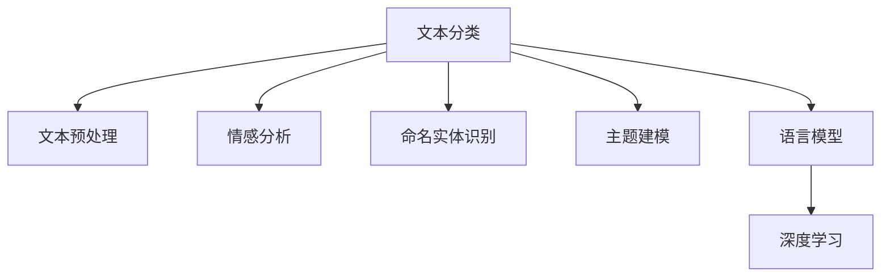

                 

# 基于机器学习的文本语义分析工具

> 关键词：文本语义分析,机器学习,深度学习,自然语言处理(NLP),情感分析,实体识别,主题建模,语言模型

## 1. 背景介绍

### 1.1 问题由来
在当今信息爆炸的时代，文本数据日益增多，从社交媒体、新闻报道到科学论文，文本信息构成了我们日常生活的核心内容。如何高效地分析、理解和利用这些文本数据，成为了各行业关注的焦点。传统文本分析方法主要依赖于规则引擎和关键词提取等技术，但这些方法难以处理大规模、复杂语义结构丰富的文本。机器学习，尤其是深度学习技术的崛起，为文本语义分析带来了新的可能性。

### 1.2 问题核心关键点
文本语义分析的目标是通过计算模型来理解文本内容，识别出文本中的关键信息，并进行分类、情感分析、实体识别、主题建模等多种任务。机器学习模型能够处理大规模数据，自动提取特征，通过训练学习复杂的语义模式。

基于机器学习的文本语义分析工具，通常采用监督学习或无监督学习方法，构建文本分类器、情感分析器、命名实体识别器等。常见的模型包括朴素贝叶斯、支持向量机(SVM)、深度神经网络等。

## 2. 核心概念与联系

### 2.1 核心概念概述

为更好地理解基于机器学习的文本语义分析工具，本节将介绍几个关键概念：

- 文本分类：将文本根据内容自动分配到预定义的类别中。
- 情感分析：分析文本中的情感倾向，判断文本情绪是积极、消极还是中性。
- 命名实体识别：从文本中识别出人名、地名、机构名等实体。
- 主题建模：从文本中发现隐藏的主题分布，并进行主题抽取。
- 语言模型：基于统计语言模型或神经网络语言模型，捕捉文本的语义信息。
- 深度学习：一种基于神经网络的机器学习技术，能够处理高维数据和非线性模式。

这些核心概念之间的逻辑关系可以通过以下Mermaid流程图来展示：



这个流程图展示了几类常见的文本语义分析任务，以及它们与深度学习的联系：

1. 文本分类：通过机器学习模型将文本分类到不同的类别。
2. 情感分析：利用深度学习模型分析文本的情感倾向。
3. 命名实体识别：通过深度学习模型识别文本中的实体。
4. 主题建模：基于深度学习模型发现文本中的主题分布。
5. 语言模型：深度学习模型捕捉文本的语义信息。
6. 深度学习：核心技术支持，能够处理复杂非线性模式。

这些概念共同构成了文本语义分析的基础框架，使得机器学习模型能够在各种文本任务上发挥作用。

## 3. 核心算法原理 & 具体操作步骤
### 3.1 算法原理概述

基于机器学习的文本语义分析工具通常采用监督学习或无监督学习方法，构建文本分类器、情感分析器、命名实体识别器等。以下是常见的方法及其原理：

- 监督学习：通过标注数据训练模型，学习从文本到类别的映射关系。常用的模型包括朴素贝叶斯、支持向量机(SVM)、随机森林等。
- 无监督学习：无需标注数据，通过数据自发现模式，进行聚类、降维等任务。常用的模型包括K-means、LDA主题模型、Word2Vec等。
- 深度学习：通过多层神经网络模型，学习非线性语义模式，实现端到端的文本分析任务。常用的模型包括卷积神经网络(CNN)、循环神经网络(RNN)、Transformer等。

这些方法通过将文本表示为向量，然后应用各种算法进行语义分析。例如，使用词袋模型(BOW)、TF-IDF等方法将文本转换为向量，再通过分类器进行分类。

### 3.2 算法步骤详解

以下以深度学习在文本情感分析中的应用为例，详细介绍算法步骤：

**Step 1: 准备数据**
- 收集文本数据，并打上情感标签。
- 将文本数据转换为模型所需的格式，如单词向量或句向量。

**Step 2: 构建模型**
- 选择合适的深度学习模型，如LSTM、GRU、Transformer等。
- 设计模型架构，包括输入层、嵌入层、隐藏层、输出层等。
- 选择合适的损失函数和优化器。

**Step 3: 训练模型**
- 使用训练数据对模型进行训练，更新模型参数。
- 在验证集上评估模型性能，防止过拟合。
- 根据评估结果调整模型超参数，如学习率、批次大小等。

**Step 4: 测试模型**
- 使用测试集对模型进行测试，评估其泛化能力。
- 分析模型的误差来源，进一步优化模型性能。

**Step 5: 应用模型**
- 将训练好的模型应用到新的文本数据上，进行情感分析、分类、实体识别等任务。
- 提供API接口，实现模型集成和调用。

### 3.3 算法优缺点

基于机器学习的文本语义分析工具具有以下优点：
- 能够处理大规模文本数据，自动提取特征。
- 深度学习模型能够学习复杂的非线性语义模式。
- 算法模型具有良好的可解释性和可复用性。

同时，这些工具也存在一定的局限性：
- 需要大量标注数据进行训练，标注成本高。
- 模型过于复杂，训练和推理速度较慢。
- 对文本质量要求较高，难以处理噪音文本。
- 模型泛化能力受数据分布影响较大。

尽管存在这些局限性，但就目前而言，基于机器学习的文本语义分析工具仍是处理大规模文本数据和复杂语义任务的最有效方法之一。

### 3.4 算法应用领域

基于机器学习的文本语义分析工具在多个领域得到了广泛应用，例如：

- 社交媒体情感分析：对用户评论、帖子等进行分析，了解公众情绪和态度。
- 客户服务：通过分析客户反馈和投诉，改进产品和服务质量。
- 舆情监控：对新闻报道、论坛帖子等进行情感分析和主题建模，掌握社会舆论动态。
- 搜索引擎优化(SEO)：通过文本分析和关键词提取，优化网页内容，提升搜索引擎排名。
- 智能写作辅助：分析文本风格和内容，辅助撰写高质量文章和文档。

除了这些常见的应用领域，文本语义分析技术还在金融、医疗、教育等更多场景中发挥了重要作用，推动了各行业的数字化转型。

## 4. 数学模型和公式 & 详细讲解 & 举例说明
### 4.1 数学模型构建

在文本语义分析中，数学模型通常用于文本表示和分类。以下是几个常见的数学模型及其构建方法：

- 词袋模型(BOW)：将文本表示为一个词频向量，忽略词序。
- TF-IDF模型：根据词频和逆文档频率，计算每个词的重要性。
- 卷积神经网络(CNN)：使用卷积层和池化层，捕捉局部特征和全局特征。
- 循环神经网络(RNN)：使用循环结构，处理序列数据。
- 自注意力机制(Transformer)：通过自注意力机制，捕捉长距离依赖关系。

以卷积神经网络为例，其数学模型可以表示为：

$$
X \in \mathbb{R}^{m \times n}, W \in \mathbb{R}^{k \times m}, b \in \mathbb{R}^k
$$

其中，$X$ 为输入文本的词向量矩阵，$W$ 为卷积核矩阵，$b$ 为偏置向量。

### 4.2 公式推导过程

以卷积神经网络为例，其前向传播过程可以表示为：

$$
H_k = \max_{0 \leq i < n} ReLU(W_k \ast X + b_k)
$$

其中，$H_k$ 为第$k$个卷积层的输出，$ReLU$ 为激活函数，$\ast$ 为卷积运算。

在反向传播过程中，损失函数对卷积核的梯度可以表示为：

$$
\frac{\partial L}{\partial W_k} = \frac{\partial L}{\partial H_k} * (\frac{\partial H_k}{\partial X} * W_k)
$$

其中，$\frac{\partial L}{\partial H_k}$ 为损失函数对卷积层输出的梯度，$\frac{\partial H_k}{\partial X}$ 为卷积层的导数。

### 4.3 案例分析与讲解

以情感分析为例，使用卷积神经网络模型进行文本情感分类。数据集为IMDB电影评论数据集，包含25,000条电影评论，每个评论打上了正面或负面的情感标签。

**Step 1: 数据预处理**
- 将评论文本转换为词向量，使用预训练的Word2Vec模型或GloVe模型。
- 将评论文本按固定长度截断或填充，以适应模型输入。

**Step 2: 模型构建**
- 使用卷积神经网络作为分类器，包含多个卷积层和池化层。
- 使用softmax函数进行情感分类，输出0或1的分类概率。

**Step 3: 训练模型**
- 使用随机梯度下降算法，对模型进行训练，更新卷积核权重和偏置。
- 在验证集上评估模型性能，选择最优模型进行测试。

**Step 4: 测试模型**
- 使用测试集对模型进行测试，评估其分类准确率。
- 分析误差来源，优化模型结构和参数。

## 5. 项目实践：代码实例和详细解释说明
### 5.1 开发环境搭建

在进行文本语义分析实践前，我们需要准备好开发环境。以下是使用Python进行Keras框架开发的环境配置流程：

1. 安装Anaconda：从官网下载并安装Anaconda，用于创建独立的Python环境。

2. 创建并激活虚拟环境：
```bash
conda create -n keras-env python=3.8 
conda activate keras-env
```

3. 安装Keras：
```bash
pip install keras tensorflow numpy pandas
```

4. 安装各类工具包：
```bash
pip install jupyter notebook matplotlib sklearn joblib
```

完成上述步骤后，即可在`keras-env`环境中开始文本语义分析的实践。

### 5.2 源代码详细实现

下面我们以情感分析为例，给出使用Keras框架对文本数据进行情感分类的PyTorch代码实现。

首先，定义情感分析任务的数据处理函数：

```python
import numpy as np
from keras.preprocessing.text import Tokenizer
from keras.preprocessing.sequence import pad_sequences
from keras.utils import to_categorical

class SentimentAnalysisDataset:
    def __init__(self, texts, labels):
        self.texts = texts
        self.labels = labels
        self.tokenizer = Tokenizer(num_words=10000, oov_token='<OOV>')
        self.tokenizer.fit_on_texts(self.texts)
        self.word_index = self.tokenizer.word_index
        self sequences = self.tokenizer.texts_to_sequences(self.texts)
        self.data = pad_sequences(self.sequences, maxlen=120)
        self.labels = to_categorical(self.labels)

# 创建dataset
tokenizer = Tokenizer(num_words=10000, oov_token='<OOV>')
train_dataset = SentimentAnalysisDataset(train_texts, train_labels)
dev_dataset = SentimentAnalysisDataset(dev_texts, dev_labels)
test_dataset = SentimentAnalysisDataset(test_texts, test_labels)
```

然后，定义模型和优化器：

```python
from keras.models import Sequential
from keras.layers import Embedding, Conv1D, GlobalMaxPooling1D, Dense

model = Sequential()
model.add(Embedding(input_dim=10000, output_dim=128, input_length=120))
model.add(Conv1D(128, 5, activation='relu'))
model.add(GlobalMaxPooling1D())
model.add(Dense(2, activation='softmax'))
model.compile(optimizer='adam', loss='categorical_crossentropy', metrics=['accuracy'])
```

接着，定义训练和评估函数：

```python
from keras.callbacks import EarlyStopping

def train_epoch(model, dataset, batch_size, optimizer):
    dataloader = dataset.batch(batch_size)
    model.fit_generator(dataloader, steps_per_epoch=len(dataset), epochs=10, verbose=2)
    return model

def evaluate(model, dataset, batch_size):
    dataloader = dataset.batch(batch_size)
    return model.evaluate_generator(dataloader, steps=len(dataset))

# 启动训练流程并在测试集上评估
epochs = 10
batch_size = 128

for epoch in range(epochs):
    model = train_epoch(model, train_dataset, batch_size, optimizer)
    print(f"Epoch {epoch+1}, train loss: {model.loss:.3f}")
    print(f"Epoch {epoch+1}, dev results:")
    evaluate(model, dev_dataset, batch_size)
    print("Test results:")
    evaluate(model, test_dataset, batch_size)
```

以上就是使用Keras框架对文本数据进行情感分类的完整代码实现。可以看到，Keras的封装使得文本语义分析的模型构建和训练过程变得简单高效。

### 5.3 代码解读与分析

让我们再详细解读一下关键代码的实现细节：

**SentimentAnalysisDataset类**：
- `__init__`方法：初始化文本和标签，构建tokenizer，将文本转换为序列，进行padding，并转换为模型所需的输入和输出。

**tokenizer变量**：
- 定义了一个tokenizer对象，用于将文本转换为序列。

**模型构建**：
- 使用Sequential模型，添加嵌入层、卷积层、池化层和输出层。
- 使用softmax函数进行分类。
- 使用交叉熵损失函数和Adam优化器进行训练。

**训练函数**：
- 使用Keras的fit_generator函数对模型进行训练。
- 在验证集上评估模型性能。

**测试函数**：
- 使用Keras的evaluate_generator函数对模型进行测试。

可以看到，Keras框架提供的高级API使得文本语义分析的模型构建和训练过程变得简单直观。开发者可以将更多精力放在数据处理和模型优化上，而不必过多关注底层的实现细节。

当然，工业级的系统实现还需考虑更多因素，如模型的保存和部署、超参数的自动搜索、更灵活的任务适配层等。但核心的模型构建和训练范式基本与此类似。

## 6. 实际应用场景
### 6.1 社交媒体情感分析

社交媒体情感分析是文本情感分析的一个重要应用场景。通过分析用户在社交平台上的评论和帖子，可以了解公众情绪和态度，为品牌营销和舆情监控提供重要依据。

在技术实现上，可以收集社交媒体平台上的评论数据，对其进行情感分析，统计正面、负面和中性评论的数量。通过可视化工具将结果呈现出来，可以直观地了解用户情绪的变化趋势，帮助企业及时调整策略，提高品牌形象和用户满意度。

### 6.2 客户服务

客户服务是企业与用户互动的重要渠道，通过分析客户反馈和投诉，可以改进产品和服务质量。使用文本语义分析工具，可以自动分析客户评论和投诉，识别出客户的主要诉求和不满意点，帮助企业及时处理问题和改进产品。

在实际应用中，可以将客户反馈和投诉数据作为训练集，训练文本分类器，自动识别负面评论。然后，对负面评论进行情感分析，进一步识别出具体的不满意点和改进建议，形成反馈报告，供企业决策参考。

### 6.3 舆情监控

舆情监控是政府和企业进行信息管理和公共安全的重要手段。通过分析新闻报道、论坛帖子等文本数据，可以掌握社会舆论动态，及时发现和应对潜在的风险。

在技术实现上，可以收集互联网上的新闻报道和论坛帖子，进行情感分析和主题建模。统计不同主题下的情感分布，找出热门话题和负面舆情，供决策者参考。同时，可以使用实时文本流分析技术，对舆情进行实时监控和预警，及时应对突发事件。

### 6.4 未来应用展望

随着文本语义分析技术的不断发展，其在更多领域的应用前景也将更加广阔：

- 医疗领域：通过分析医疗记录和病历，可以了解患者情绪和症状，为医生诊疗提供参考。
- 金融领域：通过分析投资报告和市场评论，可以了解市场情绪和趋势，辅助投资决策。
- 教育领域：通过分析学生评论和反馈，可以了解教学效果和学习氛围，优化教学方法。
- 新闻领域：通过分析新闻报道和评论，可以了解公众对某一事件的看法，提供新闻选题和报道参考。

随着深度学习技术的不断进步，文本语义分析工具在多领域的应用将会更加深入和广泛。相信在未来，文本语义分析技术将成为数字化转型不可或缺的重要工具，为各行各业带来深刻的变革。

## 7. 工具和资源推荐
### 7.1 学习资源推荐

为了帮助开发者系统掌握文本语义分析的理论基础和实践技巧，这里推荐一些优质的学习资源：

1. 《自然语言处理综论》：周志华、林轩田等著，全面介绍NLP的基本概念和核心技术。
2. CS224N《深度学习自然语言处理》课程：斯坦福大学开设的NLP明星课程，提供Lecture视频和配套作业。
3. 《深度学习》：Ian Goodfellow等著，介绍深度学习的基本原理和算法。
4. TensorFlow官方文档：Google开源的深度学习框架，提供丰富的API和样例代码。
5. Keras官方文档：Rajat Precup等著，介绍Keras的API和使用方法。

通过对这些资源的学习实践，相信你一定能够快速掌握文本语义分析的精髓，并用于解决实际的NLP问题。
###  7.2 开发工具推荐

高效的开发离不开优秀的工具支持。以下是几款用于文本语义分析开发的常用工具：

1. TensorFlow：由Google主导开发的开源深度学习框架，生产部署方便，适合大规模工程应用。
2. PyTorch：基于Python的开源深度学习框架，灵活动态的计算图，适合快速迭代研究。
3. Keras：高层次的深度学习API，易于上手使用。
4. Weights & Biases：模型训练的实验跟踪工具，可以记录和可视化模型训练过程中的各项指标。
5. TensorBoard：TensorFlow配套的可视化工具，可实时监测模型训练状态，并提供丰富的图表呈现方式。

合理利用这些工具，可以显著提升文本语义分析任务的开发效率，加快创新迭代的步伐。

### 7.3 相关论文推荐

文本语义分析技术的发展源于学界的持续研究。以下是几篇奠基性的相关论文，推荐阅读：

1. TextRank: Bringing Order into Texts《文本排序》：提出TextRank算法，用于文本排序和摘要生成。
2. Word2Vec: Distributed Representations of Words and Phrases and their Compositionality《Word2Vec：单词和短语的分布式表示及组合性》：提出Word2Vec算法，用于词向量表示学习。
3. Convolutional Neural Networks for Sentence Classification《卷积神经网络在句子分类中的应用》：提出CNN模型，用于文本分类任务。
4. Recurrent Neural Network based Sentiment Analysis《基于递归神经网络的情感分析》：提出RNN模型，用于文本情感分析。
5. Attention is All You Need《注意力机制是全部》：提出Transformer模型，用于文本生成和翻译。

这些论文代表了大语言模型微调技术的发展脉络。通过学习这些前沿成果，可以帮助研究者把握学科前进方向，激发更多的创新灵感。

## 8. 总结：未来发展趋势与挑战
### 8.1 总结

本文对基于机器学习的文本语义分析工具进行了全面系统的介绍。首先阐述了文本语义分析的研究背景和意义，明确了其在大规模文本处理和复杂语义任务中的独特价值。其次，从原理到实践，详细讲解了文本分类、情感分析、实体识别等核心算法的构建和应用。同时，本文还广泛探讨了文本语义分析在社交媒体、客户服务、舆情监控等多个行业领域的应用前景，展示了其强大的应用潜力。此外，本文精选了文本语义分析技术的各类学习资源，力求为读者提供全方位的技术指引。

通过本文的系统梳理，可以看到，基于机器学习的文本语义分析工具已经在多个领域得到了广泛应用，为数字化转型提供了强有力的技术支持。未来，随着深度学习技术的不断进步，文本语义分析技术必将走向更加智能化、普适化，为人类认知智能的进步带来深远影响。

### 8.2 未来发展趋势

展望未来，文本语义分析技术将呈现以下几个发展趋势：

1. 模型规模持续增大。随着算力成本的下降和数据规模的扩张，深度学习模型将更加复杂和强大。超大规模模型能够学习到更加丰富的语义信息，提升文本分析的精度和泛化能力。

2. 多模态融合增强。文本语义分析将越来越多地与其他模态数据结合，如图像、语音、视频等，实现更加全面和深入的理解。多模态信息的融合，将显著提升文本分析的性能和应用范围。

3. 自监督学习兴起。无监督学习能够从大规模非标注数据中学习语义模式，减少对标注数据的依赖。自监督学习与监督学习相结合，将使得文本分析技术更加高效和灵活。

4. 实时性要求提高。在智能客服、实时舆情监控等场景中，文本语义分析需要实时处理大量数据，快速输出结果。未来，实时化处理将变得更加重要，要求系统具备更强的计算能力和实时性。

5. 跨领域知识整合。文本分析技术将越来越多地与其他知识库、规则库结合，实现跨领域的知识整合和应用。这将使得文本分析技术在更广泛领域发挥作用，推动各行业的发展。

这些趋势凸显了文本语义分析技术的广阔前景。这些方向的探索发展，必将进一步提升文本分析系统的性能和应用范围，为数字化转型提供更强的技术支撑。

### 8.3 面临的挑战

尽管文本语义分析技术已经取得了瞩目成就，但在迈向更加智能化、普适化应用的过程中，它仍面临着诸多挑战：

1. 标注成本瓶颈。文本语义分析任务往往需要大量标注数据进行训练，标注成本高昂。如何利用自监督学习等无监督方法，减少标注数据需求，是未来研究的重要方向。

2. 模型鲁棒性不足。当前模型在处理噪声文本、长尾数据等复杂场景时，泛化性能差。如何提高模型的鲁棒性和泛化能力，需要更多的技术突破。

3. 可解释性不足。深度学习模型的“黑盒”特性，使得其决策过程难以解释。如何提高模型的可解释性，增加用户的信任度和理解度，是未来研究的重要任务。

4. 资源消耗大。深度学习模型需要大量的计算资源和存储空间，如何优化模型结构和参数，提高计算效率，是未来研究的重点。

5. 模型偏见和伦理问题。深度学习模型容易学习到数据中的偏见和有害信息，如何从数据和算法层面消除偏见，确保模型输出的公平性和安全性，是未来研究的重要课题。

正视这些挑战，积极应对并寻求突破，将使文本语义分析技术更加成熟和稳定，为各行各业提供更加高效和可靠的技术支持。

### 8.4 研究展望

面对文本语义分析技术所面临的种种挑战，未来的研究需要在以下几个方面寻求新的突破：

1. 探索更加高效的无监督学习方法。利用自监督学习、主动学习等方法，从大规模非标注数据中学习语义模式，减少对标注数据的依赖。

2. 研究更加高效和灵活的模型架构。引入自注意力机制、残差连接等技术，优化模型结构和参数，提高计算效率和泛化能力。

3. 结合因果推断和博弈论工具。将因果推断方法引入模型，识别出模型决策的关键特征，增强输出解释的因果性和逻辑性。借助博弈论工具刻画人机交互过程，主动探索并规避模型的脆弱点，提高系统稳定性。

4. 加强跨领域知识整合。将符号化的先验知识，如知识图谱、逻辑规则等，与神经网络模型进行巧妙融合，引导文本分析过程学习更准确、合理的语义模式。同时加强不同模态数据的整合，实现视觉、语音等多模态信息与文本信息的协同建模。

5. 纳入伦理道德约束。在模型训练目标中引入伦理导向的评估指标，过滤和惩罚有偏见、有害的输出倾向。同时加强人工干预和审核，建立模型行为的监管机制，确保输出符合人类价值观和伦理道德。

这些研究方向的探索，必将引领文本语义分析技术迈向更高的台阶，为构建安全、可靠、可解释、可控的智能系统铺平道路。面向未来，文本语义分析技术还需要与其他人工智能技术进行更深入的融合，如知识表示、因果推理、强化学习等，多路径协同发力，共同推动自然语言理解和智能交互系统的进步。只有勇于创新、敢于突破，才能不断拓展文本语义分析的边界，让智能技术更好地造福人类社会。

## 9. 附录：常见问题与解答
**Q1：文本语义分析工具如何处理噪音文本？**

A: 噪音文本通常包含大量的噪声词或错别字，会影响模型的性能。为处理噪音文本，可以采用以下方法：
1. 文本清洗：使用正则表达式等工具对文本进行清洗，去除无意义的字符和标点。
2. 词向量去噪：使用Word2Vec、GloVe等预训练模型进行词向量学习，过滤掉低频词和高频噪音词。
3. 多模态融合：将文本与图像、语音等模态数据结合，利用多模态信息进行噪音文本的识别和去除。

**Q2：如何选择合适的深度学习模型？**

A: 选择合适的深度学习模型需要根据具体任务的特点进行选择。以下是一些常用的模型及其适用场景：
1. 词袋模型(BOW)：适用于文本分类和主题建模任务。
2. 卷积神经网络(CNN)：适用于文本分类、情感分析等任务。
3. 循环神经网络(RNN)：适用于序列标注任务，如命名实体识别。
4. 自注意力机制(Transformer)：适用于文本生成、翻译等任务。
5. 预训练模型：如BERT、GPT等，可以适应各种文本任务，提升模型性能。

**Q3：深度学习模型在文本分析中如何避免过拟合？**

A: 深度学习模型容易发生过拟合，尤其是在标注数据较少的情况下。为避免过拟合，可以采用以下方法：
1. 数据增强：通过回译、近义替换等方式扩充训练集。
2. 正则化技术：使用L2正则、Dropout等技术，防止模型过度适应训练集。
3. 模型集成：使用多个模型进行集成，取平均输出，提高泛化能力。
4. 模型裁剪：去除不必要的层和参数，减小模型尺寸，加快推理速度。
5. 超参数优化：通过网格搜索、随机搜索等方法，优化模型超参数，提升模型性能。

这些方法往往需要根据具体任务和数据特点进行灵活组合，以达到最优的模型性能。

**Q4：文本语义分析工具在多语言处理中需要注意哪些问题？**

A: 文本语义分析工具在多语言处理中，需要注意以下问题：
1. 数据集的多语言标注：收集多语言标注数据，保证数据集的覆盖面。
2. 模型参数的迁移：利用跨语言预训练模型，迁移模型参数，提高多语言处理性能。
3. 语言模型的融合：结合多种语言模型，提高多语言处理的准确性和鲁棒性。
4. 语言之间的相似性：考虑不同语言之间的语义相似性和差异性，选择合适的模型架构和训练策略。

这些问题的解决，将使文本语义分析工具在多语言处理中更加高效和准确。

**Q5：文本语义分析工具如何应用到工业级系统中？**

A: 将文本语义分析工具应用到工业级系统中，需要考虑以下几个方面：
1. 模型部署：将训练好的模型部署到生产环境中，实现实时分析和推理。
2. 接口设计：提供标准化的API接口，方便系统集成和调用。
3. 数据采集：设计高效的数据采集和预处理流程，保证数据的质量和时效性。
4. 实时监控：实时监测模型性能和系统状态，及时发现和解决问题。
5. 系统优化：根据实际应用需求，对模型进行裁剪、量化、分布式训练等优化，提高系统效率和性能。

合理应用文本语义分析工具，可以显著提升系统的智能化水平，推动各行业的数字化转型。

---

作者：禅与计算机程序设计艺术 / Zen and the Art of Computer Programming

