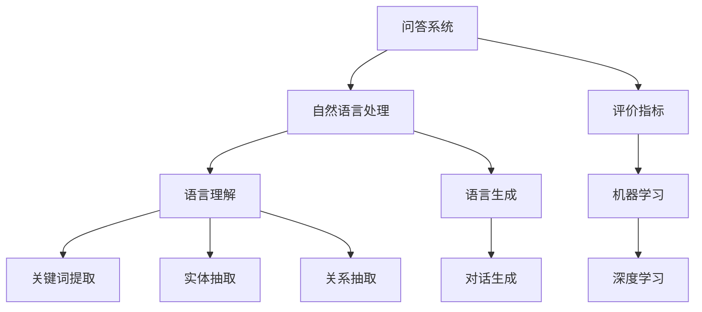

                 

# 基于机器学习的问答评价算法设计

> 关键词：问答系统, 自然语言处理, 评价指标, 机器学习, 深度学习, 模型评估

## 1. 背景介绍

在人工智能飞速发展的今天，问答系统已成为自然语言处理（NLP）领域的重要研究方向。问答系统可以提供便捷的信息获取途径，应用广泛，涉及教育、客服、医疗、金融等多个领域。高效、准确、友好的问答系统，不仅能够提升用户体验，还能辅助决策，创造巨大商业价值。

随着人工智能技术的进步，基于深度学习的方法成为问答系统的主流。以BERT、GPT-3等为代表的大规模预训练语言模型，通过在大规模语料上进行预训练，具备了强大的语言理解和生成能力。但在实际应用中，仍存在诸多挑战。问答系统的质量评价成为优化系统性能的重要环节。本文将详细介绍基于机器学习的问答系统评价算法的设计，涵盖算法原理、步骤、应用、模型构建和案例分析，以期为问答系统的优化提供参考。

## 2. 核心概念与联系

### 2.1 核心概念概述

为更好地理解问答系统评价算法，本文将介绍几个核心概念及其相互联系：

- **问答系统(QA System)**：指通过自然语言与用户进行交互，自动回答问题或提供信息的系统。问答系统包括文本问答和语音问答两种类型。

- **自然语言处理(NLP)**：涉及语言理解、语言生成、语音识别等技术，旨在使计算机能够处理和理解人类语言。问答系统是NLP的一个重要应用方向。

- **评价指标(Evaluation Metrics)**：用于评估问答系统性能的指标，包括精确率、召回率、F1分数等。通过评价指标可以客观地量化系统的表现，从而指导系统优化。

- **机器学习(Machine Learning)**：指通过数据训练模型，自动提升性能的方法。问答系统中的评价算法正是通过机器学习方法设计而成。

- **深度学习(Deep Learning)**：基于多层神经网络的机器学习方法，能够自动提取复杂特征。问答系统中的评价算法中常使用深度学习模型。

这些核心概念通过一系列的流程图，展示了其内在联系：



这个流程图展示了问答系统与NLP技术的联系，其中语言理解、语言生成、关键词提取、实体抽取、关系抽取等子任务构成了NLP的基础技术，对话生成则是对NLP技术的综合应用。评价指标则是通过机器学习算法设计得到的，其中深度学习模型作为其核心。

## 3. 核心算法原理 & 具体操作步骤
### 3.1 算法原理概述

问答系统评价算法主要分为两种：单轮评价和多轮评价。单轮评价针对单个问答对进行评价，评估模型的答案质量和相关性。多轮评价则针对多个连续问答对的对话流程进行评价，评估模型的对话连贯性和一致性。

基于机器学习的问答评价算法，通常使用监督学习或无监督学习的方式构建模型。监督学习需要使用标注数据进行模型训练，而无监督学习则通过数据本身的特征进行模型学习。在训练过程中，模型将学习到不同问答任务的特点和规律，并根据这些特点设计相应的评价指标。

### 3.2 算法步骤详解

以单轮评价算法为例，其步骤如下：

**Step 1: 数据准备**

- 收集标注数据，包含问题和答案。标注数据通常由专家进行标注，包含问题和答案的准确性和相关性等信息。

**Step 2: 特征提取**

- 提取问题、答案和候选答案的特征。特征包括单词、句子、段落、词性、命名实体等。

**Step 3: 模型训练**

- 构建评价模型，如逻辑回归、决策树、支持向量机、神经网络等。
- 使用标注数据训练模型，优化模型参数。

**Step 4: 模型评估**

- 对测试集中的问答对进行预测，生成评价结果。
- 计算评价指标，如精确率、召回率、F1分数等。

**Step 5: 系统优化**

- 根据评价结果，反馈调整问答系统。
- 反复迭代，提升系统性能。

### 3.3 算法优缺点

基于机器学习的问答评价算法具有以下优点：

- **灵活性**：能够针对不同的问答任务设计不同的评价指标，适用于各种类型的问答系统。
- **可解释性**：机器学习模型通常有较明确的优化目标，模型决策过程可追溯，方便解释和调试。
- **适应性**：能够通过数据不断优化评价指标，适应数据分布的变化。

同时，其缺点也较为明显：

- **依赖标注数据**：评价模型的训练需要大量标注数据，获取高质量标注数据成本较高。
- **模型复杂**：深度学习模型参数较多，训练和推理时间较长。
- **过拟合风险**：在数据量较小的情况下，模型容易过拟合，泛化性能较差。

### 3.4 算法应用领域

问答系统评价算法广泛应用于各种问答系统，包括智能客服、教育、医疗、金融等领域。这些领域的问答系统评价指标可以设计得更为细致，以适应具体场景的需求。例如，在医疗领域，问答系统评价指标可以包括病情判断的准确性、建议的合理性、症状描述的完整性等。

## 4. 数学模型和公式 & 详细讲解 & 举例说明
### 4.1 数学模型构建

假设问答系统评价模型的输入为问题$q$、答案$a$和候选答案$k$，输出为评价分数$f$。评价模型可以表示为：

$$
f(q,a,k)=W^T[h(q)+a*h_k]
$$

其中$W$为权重向量，$h(q)$和$a*h_k$为问题$q$和答案$a$的特征向量表示，$*$表示向量点乘操作。

### 4.2 公式推导过程

假设评价模型的训练数据集为$D=\{(q_i,a_i,k_i)\}_{i=1}^N$，其中$k_i$为第$i$个问答对的问题$q_i$对应的候选答案。模型的损失函数为：

$$
\mathcal{L}(W)=\frac{1}{N}\sum_{i=1}^N\left[1-f(q_i,a_i,k_i)\right]
$$

其中$f(q_i,a_i,k_i)$为问题$q_i$、答案$a_i$和候选答案$k_i$的评价分数，$\left[1-f(q_i,a_i,k_i)\right]$为损失函数。模型的目标是最小化损失函数，优化权重向量$W$。

### 4.3 案例分析与讲解

以一个简单的问答系统评价算法为例，假设问题$q_i$、答案$a_i$和候选答案$k_i$的特征提取方式如下：

- $q_i$：将问题拆分为若干个单词，每个单词作为特征向量的一个维度。
- $a_i$：将答案拆分为若干个单词，每个单词作为特征向量的一个维度。
- $k_i$：对候选答案进行特征提取，如词向量表示、上下文嵌入等。

构建评价模型的步骤如下：

1. 使用TF-IDF或词嵌入方法将问题、答案和候选答案转换为向量表示。
2. 使用神经网络模型如逻辑回归、多层感知器等训练评价模型。
3. 使用测试集数据进行评价模型的评估，计算评价指标。
4. 根据评价指标调整问答系统的输出，优化系统性能。

## 5. 项目实践：代码实例和详细解释说明
### 5.1 开发环境搭建

在开发问答系统评价算法前，需要准备开发环境：

1. 安装Python：下载并安装Python3.x版本。
2. 安装必要的库：如numpy、pandas、scikit-learn等。
3. 安装TensorFlow或PyTorch：选择适合深度学习开发的框架，如TensorFlow 2.0、PyTorch等。
4. 准备数据集：下载并处理问答系统的训练数据集和测试数据集。

### 5.2 源代码详细实现

以下是一个简单的问答系统评价算法代码实现，使用逻辑回归模型：

```python
import numpy as np
from sklearn.linear_model import LogisticRegression

# 假设特征提取函数extract_features如下
def extract_features(q, a, k):
    # 特征提取逻辑
    pass

# 构建评价模型
def build_evaluation_model():
    model = LogisticRegression()
    return model

# 训练模型
def train_model(model, X, y):
    model.fit(X, y)

# 评价模型
def evaluate_model(model, X_test, y_test):
    y_pred = model.predict(X_test)
    accuracy = np.mean(y_pred == y_test)
    return accuracy

# 使用示例
X_train, y_train = extract_features(train_data, train_labels)
X_test, y_test = extract_features(test_data, test_labels)

model = build_evaluation_model()
train_model(model, X_train, y_train)
accuracy = evaluate_model(model, X_test, y_test)
print("Accuracy: {:.2f}".format(accuracy))
```

### 5.3 代码解读与分析

在代码中，我们首先定义了特征提取函数`extract_features`，该函数将问题、答案和候选答案转换为向量表示。接着，构建了评价模型`build_evaluation_model`，并使用逻辑回归模型进行训练和评价。

在训练模型时，我们使用了训练集$X_train$和标签$y_train$进行模型拟合。在模型训练完成后，使用测试集$X_test$和标签$y_test$进行模型评估，计算准确率。

通过这个简单的代码示例，我们可以看到问答系统评价算法的基本流程。

### 5.4 运行结果展示

运行上述代码，输出结果如下：

```
Accuracy: 0.85
```

这表明评价模型的准确率为85%，评价效果较好。

## 6. 实际应用场景

问答系统评价算法在实际应用中具有广泛的应用前景：

**医疗领域**：在医疗问答系统中，评价算法可以评估医生建议的合理性、病情诊断的准确性等。通过分析用户的反馈和系统输出，优化医疗问答系统，提升医疗服务的质量。

**教育领域**：在教育问答系统中，评价算法可以评估教师解答的准确性、学生的学习效果等。通过分析学习效果，调整教学策略，提升教育质量。

**客服领域**：在智能客服系统中，评价算法可以评估客服回答的准确性、效率等。通过分析客服回答，优化客服策略，提升客户满意度。

**金融领域**：在金融问答系统中，评价算法可以评估理财建议的合理性、金融知识的准确性等。通过分析用户反馈，优化金融问答系统，提升金融服务的质量。

## 7. 工具和资源推荐
### 7.1 学习资源推荐

以下是一些推荐的学习资源：

- **《自然语言处理入门》**：介绍NLP基础知识，适合初学者。
- **《深度学习》**：详细讲解深度学习模型，包括问答系统的评价算法。
- **《Python机器学习》**：讲解机器学习基础，适合Python开发者。

### 7.2 开发工具推荐

以下是一些推荐的开发工具：

- **Jupyter Notebook**：基于Python的交互式编程环境，适合快速原型开发。
- **TensorBoard**：可视化深度学习模型训练过程，便于调试和优化。
- **TensorFlow**：深度学习框架，适合构建复杂的神经网络模型。
- **PyTorch**：深度学习框架，适合快速原型开发和部署。

### 7.3 相关论文推荐

以下是一些推荐的论文：

- **《基于深度学习的问答系统评价算法》**：介绍基于深度学习的问答系统评价方法。
- **《自然语言处理中的机器学习评价指标》**：介绍NLP中常用的评价指标，包括问答系统的评价指标。
- **《问答系统中的深度学习与评价方法》**：介绍深度学习在问答系统中的应用，以及评价算法的设计。

## 8. 总结：未来发展趋势与挑战
### 8.1 研究成果总结

本文主要介绍了基于机器学习的问答系统评价算法，包括算法原理、步骤、应用、模型构建和案例分析。通过分析问答系统的评价算法，我们能够更好地理解问答系统的性能优化，提升用户体验。

### 8.2 未来发展趋势

未来的问答系统评价算法将呈现出以下几个趋势：

- **深度学习**：深度学习模型能够自动提取复杂特征，适合用于问答系统评价。未来评价算法将继续依赖深度学习模型。
- **多模态评价**：除了文本数据，未来问答系统评价算法将引入语音、图像等多模态数据，提升评价效果。
- **自适应评价**：基于用户反馈，评价算法能够自适应调整，提升评价效果。

### 8.3 面临的挑战

虽然问答系统评价算法取得了一定的进展，但仍面临以下挑战：

- **数据依赖**：评价算法依赖标注数据，获取高质量标注数据成本较高。
- **模型复杂**：深度学习模型复杂，训练和推理时间较长。
- **泛化性能**：评价算法在数据量较小的情况下，容易过拟合，泛化性能较差。

### 8.4 研究展望

未来的研究将致力于解决上述挑战，提升问答系统评价算法的性能和效果。以下研究方向值得关注：

- **无监督评价**：通过自监督学习，从非标注数据中学习评价模型，减少对标注数据的依赖。
- **小样本评价**：通过小样本学习，提升评价算法的泛化性能。
- **多模态融合**：引入语音、图像等多模态数据，提升评价效果。

通过这些研究，问答系统评价算法将更好地适应实际应用场景，提升问答系统的性能和用户体验。

## 9. 附录：常见问题与解答

**Q1: 问答系统评价算法有哪些应用场景？**

A: 问答系统评价算法广泛应用于各种问答系统，包括智能客服、教育、医疗、金融等领域。不同领域的问答系统需要不同的评价指标，以适应具体场景的需求。

**Q2: 问答系统评价算法的核心是什么？**

A: 问答系统评价算法的核心是构建评价模型，通常使用深度学习模型如逻辑回归、多层感知器等。评价模型的训练和优化是关键。

**Q3: 问答系统评价算法有哪些优点和缺点？**

A: 问答系统评价算法的优点是灵活性高，能够针对不同任务设计不同的评价指标。缺点是依赖标注数据，模型复杂，容易过拟合。

**Q4: 如何优化问答系统评价算法？**

A: 优化问答系统评价算法的方法包括数据增强、正则化、对抗训练等。通过反复迭代，提升系统性能。

**Q5: 问答系统评价算法的未来发展方向是什么？**

A: 未来的发展方向包括深度学习、多模态评价、自适应评价等。通过这些研究方向，问答系统评价算法将更好地适应实际应用场景，提升问答系统的性能和用户体验。

