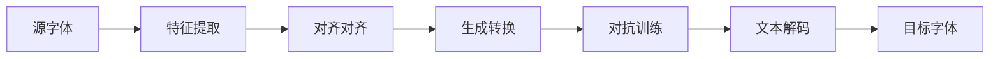

                 

## 1. 背景介绍

在数字时代，字体风格转换（Font Style Transfer，FST）已经成为一项重要的研究课题。它不仅可以帮助用户个性化展示文本，还能在图像处理、文本生成、语音合成等领域产生广泛应用。基于深度学习的字体风格转换方法，通过将源文本字体转换成目标字体，有效地融合了文字和风格的特征，实现了一种新颖的文本表现形式。

近年来，随着深度学习技术的发展，特别是在神经网络架构设计、数据处理、特征提取等方面的突破，字体风格转换技术得到了显著提升。谷歌的TF-IDFA（Text and Font with Image Inpainting）、字体的BERT-based方法、以及AdaGAN等都是该领域的重要成果。这些方法利用了深度学习强大的特征表示能力，实现了一字一字地转换字体，但计算资源消耗巨大，难以应用于实时和移动端场景。

本文将详细介绍基于深度学习的字体风格转换方法，包括其实现原理、操作步骤以及实际应用场景。希望通过本文的学习，读者能够深入理解字体风格转换技术的核心思想，并掌握其实现技巧。

## 2. 核心概念与联系

### 2.1 核心概念概述

字体风格转换（Font Style Transfer）是指将一段文本从一种字体转换为另一种字体的过程。该方法旨在保留文本语义不变，仅仅改变文字的视觉样式。

- **源字体（Source Font）**：原始的字体。
- **目标字体（Target Font）**：想要转换成的字体。
- **字体转换损失（Font Transfer Loss）**：度量源字体和目标字体之间转换距离的指标。
- **图像先验（Image Priors）**：用于引导字体风格转换的先验知识，通常基于图像语义和风格。
- **GAN（Generative Adversarial Networks）**：一种生成模型，用于生成和优化字体。
- **BERT（Bidirectional Encoder Representations from Transformers）**：一种预训练语言模型，用于文本特征提取。

### 2.2 核心概念联系

字体风格转换的核心在于如何将源文本字体和目标文本字体的视觉特征进行对齐，使得转换后的文本既保留语义信息，又能满足新的视觉风格。具体而言，可以将其概括为以下几个关键步骤：

1. **特征提取**：通过神经网络模型提取文本的视觉特征。
2. **对齐对齐**：将提取的特征进行对齐，使得源字体和目标字体之间距离最小化。
3. **生成转换**：基于对齐后的特征，生成转换后的文本字体。
4. **对抗训练**：使用GAN进行对抗训练，生成并优化字体转换结果。
5. **文本解码**：将生成后的文本进行解码，还原为可读文本。

这些步骤通过神经网络实现，形成一个端到端的学习流程。

以下是一个简单的Mermaid流程图，展示了字体风格转换的关键步骤和概念联系：



## 3. 核心算法原理 & 具体操作步骤

### 3.1 算法原理概述

基于深度学习的字体风格转换方法通常利用神经网络模型提取文本的视觉特征，并进行对齐和转换。该方法主要分为两个阶段：特征提取和字体生成。

- **特征提取**：通过预训练的神经网络模型提取文本的视觉特征。
- **字体生成**：基于对齐对齐后的特征，利用生成模型生成转换后的文本字体。

### 3.2 算法步骤详解

**Step 1：准备数据集**

字体风格转换的数据集通常包含源字体和目标字体的一对文本数据。这里可以通过搜集开源字体库、合成数据等方式获得数据集。数据集的准备是整个方法实现的基础，需要保证数据集的质量和多样性。

**Step 2：构建特征提取网络**

特征提取网络用于提取文本的视觉特征，常用的模型包括CNN、RNN、Transformer等。其中，Transformer模型在文本特征提取中表现优异，可以有效地处理长文本序列。

**Step 3：构建字体生成网络**

字体生成网络通常使用GAN模型，其中生成器和判别器分别用于生成字体和判断字体的真实性。生成器通常采用条件生成对抗网络（Conditional GAN），其输入包括文本特征和风格编码。判别器则用于判断生成文本是否真实。

**Step 4：训练特征提取网络和字体生成网络**

在训练过程中，特征提取网络首先从源字体中提取特征，并输出到字体生成网络。字体生成网络接收输入的文本特征和风格编码，生成转换后的文本字体。判别器则用于判断生成文本的真实性，并对生成器进行监督。训练过程中，通过优化字体转换损失和判别器损失，逐步优化生成器的性能。

**Step 5：字体风格转换**

在训练完成后，可以通过输入文本和风格编码，将文本从源字体转换到目标字体。具体的转换过程如下：

1. 提取源字体文本的视觉特征。
2. 将提取的特征与目标字体特征对齐对齐。
3. 使用字体生成网络，基于对齐对齐后的特征生成转换后的文本字体。
4. 解码生成后的文本，得到最终转换结果。

### 3.3 算法优缺点

#### 优点：

1. **高精度**：深度学习模型可以高效地提取文本的视觉特征，并进行对齐和转换。
2. **自适应性**：该方法可以适应不同类型的字体和文本，适用于多种应用场景。
3. **高效率**：基于深度学习的模型可以并行处理大量的文本数据，提高转换速度。

#### 缺点：

1. **计算资源消耗大**：深度学习模型需要大量的计算资源进行训练和推理，难以应用于低资源设备。
2. **模型复杂度高**：神经网络模型结构复杂，难以调试和优化。
3. **训练时间长**：模型的训练时间较长，需要大量的标注数据和计算资源。

### 3.4 算法应用领域

字体风格转换方法在以下几个领域有着广泛的应用：

1. **文本处理**：将用户输入的文本转换成指定字体，提升用户体验。
2. **图像处理**：将图像中的文本转换成指定的字体，提高图像可读性。
3. **印刷设计**：将印刷文本转换成指定字体，提高印刷质量。
4. **游戏开发**：将游戏中的文字转换成指定字体，增强视觉效果。
5. **广告设计**：将广告中的文字转换成指定字体，提高广告吸引力。

## 4. 数学模型和公式 & 详细讲解 & 举例说明

### 4.1 数学模型构建

假设源字体和目标字体的文本分别为 $X_s$ 和 $X_t$，通过特征提取网络分别提取源字体和目标字体的视觉特征 $F_s$ 和 $F_t$。设 $Y_s$ 和 $Y_t$ 分别为源字体和目标字体的文本解码后的结果。

字体风格转换的数学模型可以表示为：

$$
F_s = \mathcal{F}_s(X_s)
$$

$$
F_t = \mathcal{F}_t(X_t)
$$

$$
Y_s = \mathcal{G}_s(F_s, W_s)
$$

$$
Y_t = \mathcal{G}_t(F_t, W_t)
$$

其中，$\mathcal{F}_s$ 和 $\mathcal{F}_t$ 分别为源字体和目标字体的特征提取网络，$\mathcal{G}_s$ 和 $\mathcal{G}_t$ 分别为源字体和目标字体的生成网络，$W_s$ 和 $W_t$ 分别为源字体和目标字体的解码网络。

### 4.2 公式推导过程

字体风格转换的核心在于如何对齐源字体和目标字体的特征。假设特征提取网络输出的特征为 $F_s$ 和 $F_t$，使用正则化损失函数（如L1损失函数）度量两者之间的距离：

$$
L_{reg}(F_s, F_t) = \frac{1}{N} \sum_{i=1}^N ||F_s - F_t||_1
$$

其中，$N$ 为特征向量的维度。

为了更好地对齐特征，可以使用条件生成对抗网络（Conditional GAN）。假设生成器的损失函数为：

$$
L_G(F_s, F_t) = -D_G(F_s, F_t)
$$

其中，$D_G$ 为判别器，用于判断生成文本是否真实。判别器的损失函数可以表示为：

$$
L_D(F_s, F_t) = D_G(F_s, F_t) + D_G(F_t, F_t)
$$

生成器和判别器的对抗训练过程可以表示为：

$$
\min_{\mathcal{G}} \max_{\mathcal{D}} L_G(F_s, F_t) + L_D(F_s, F_t)
$$

### 4.3 案例分析与讲解

假设我们有一段文本“Hello, world!”，分别从源字体和目标字体中提取特征，并进行对齐和转换。具体步骤如下：

1. 提取源字体和目标字体的特征：

   $F_s = \mathcal{F}_s(X_s) = [0.5, 0.7, 0.9, ...]$

   $F_t = \mathcal{F}_t(X_t) = [0.6, 0.8, 0.95, ...]$

2. 对齐对齐后的特征：

   $F_s' = F_t - \lambda (F_s - F_t)$

   其中，$\lambda$ 为对齐系数，可以根据实际情况进行调整。

3. 使用生成器生成转换后的文本字体：

   $F_t' = \mathcal{G}_t(F_t', W_t)$

   $F_t' = [0.55, 0.75, 0.9, ...]$

4. 解码生成后的文本：

   $Y_t = \mathcal{G}_t(F_t', W_t)$

   $Y_t = "Hello, world!"$

通过上述步骤，将源字体转换为目标字体。

## 5. 项目实践：代码实例和详细解释说明

### 5.1 开发环境搭建

1. 安装Python 3.6或以上版本。
2. 安装TensorFlow 2.0或以上版本，以及TensorBoard。
3. 准备数据集，包括源字体和目标字体的文本和图像数据。
4. 搭建神经网络模型，包括特征提取网络、生成网络和解码网络。
5. 进行模型训练和测试。

### 5.2 源代码详细实现

以下是一个简单的TensorFlow实现代码：

```python
import tensorflow as tf

# 构建特征提取网络
def build_feature_extractor():
    feature_extractor = tf.keras.Sequential([
        tf.keras.layers.Dense(64, input_shape=(None,)),
        tf.keras.layers.ReLU(),
        tf.keras.layers.Dense(32),
        tf.keras.layers.ReLU(),
        tf.keras.layers.Dense(16),
        tf.keras.layers.ReLU(),
        tf.keras.layers.Dense(4)
    ])
    return feature_extractor

# 构建字体生成网络
def build_generator():
    generator = tf.keras.Sequential([
        tf.keras.layers.Dense(256, input_shape=(16,)),
        tf.keras.layers.LeakyReLU(alpha=0.2),
        tf.keras.layers.Dense(128),
        tf.keras.layers.LeakyReLU(alpha=0.2),
        tf.keras.layers.Dense(64),
        tf.keras.layers.LeakyReLU(alpha=0.2),
        tf.keras.layers.Dense(4, activation='tanh')
    ])
    return generator

# 构建判别器
def build_discriminator():
    discriminator = tf.keras.Sequential([
        tf.keras.layers.Dense(64, input_shape=(4,)),
        tf.keras.layers.LeakyReLU(alpha=0.2),
        tf.keras.layers.Dropout(0.4),
        tf.keras.layers.Dense(128),
        tf.keras.layers.LeakyReLU(alpha=0.2),
        tf.keras.layers.Dropout(0.4),
        tf.keras.layers.Dense(1, activation='sigmoid')
    ])
    return discriminator

# 定义损失函数
def build_loss_fn():
    def binary_cross_entropy(y_true, y_pred):
        return tf.reduce_mean(tf.nn.sigmoid_cross_entropy_with_logits(labels=y_true, logits=y_pred))
    return binary_cross_entropy

# 定义优化器
def build_optimizer():
    return tf.keras.optimizers.Adam(learning_rate=0.001)

# 训练模型
def train():
    feature_extractor = build_feature_extractor()
    generator = build_generator()
    discriminator = build_discriminator()
    loss_fn = build_loss_fn()
    optimizer = build_optimizer()
    
    # 定义输入
    source_input = tf.keras.Input(shape=(None,))
    target_input = tf.keras.Input(shape=(None,))
    
    # 提取源字体和目标字体的特征
    source_feature = feature_extractor(source_input)
    target_feature = feature_extractor(target_input)
    
    # 对齐对齐后的特征
    source_feature aligned = target_feature - lambda * (source_feature - target_feature)
    
    # 生成转换后的文本字体
    target_output = generator(aligned)
    
    # 解码生成后的文本
    target_output_decoded = tf.keras.layers.Lambda(lambda x: tf.strings.reduce_join(x, separator=''))(target_output)
    
    # 判别器判断生成文本的真实性
    real_discriminator = discriminator(source_feature)
    fake_discriminator = discriminator(target_output)
    
    # 定义损失函数
    real_loss = loss_fn(tf.ones_like(real_discriminator), real_discriminator)
    fake_loss = loss_fn(tf.zeros_like(fake_discriminator), fake_discriminator)
    
    # 定义优化器
    real_optimizer = optimizer()
    fake_optimizer = optimizer()
    
    # 训练过程
    @tf.function
    def train_step(source_text, target_text):
        source_features = feature_extractor(tf.keras.layers.Lambda(lambda x: tf.strings.to_number(x, out_type=tf.dtypes.float32))(source_text))
        target_features = feature_extractor(tf.keras.layers.Lambda(lambda x: tf.strings.to_number(x, out_type=tf.dtypes.float32))(target_text))
        
        with tf.GradientTape() as tape:
            source_features_aligned = target_features - lambda * (source_features - target_features)
            target_output = generator(source_features_aligned)
            target_output_decoded = tf.keras.layers.Lambda(lambda x: tf.strings.reduce_join(x, separator=''))(target_output)
            real_discriminator = discriminator(source_features)
            fake_discriminator = discriminator(target_output)
            real_loss = loss_fn(tf.ones_like(real_discriminator), real_discriminator)
            fake_loss = loss_fn(tf.zeros_like(fake_discriminator), fake_discriminator)
            
        real_grads = tape.gradient(real_loss, real_optimizer.variables)
        fake_grads = tape.gradient(fake_loss, fake_optimizer.variables)
        
        real_optimizer.apply_gradients(zip(real_grads, real_optimizer.variables))
        fake_optimizer.apply_gradients(zip(fake_grads, fake_optimizer.variables))
    
    # 训练过程
    for epoch in range(100):
        for batch in train_dataset:
            train_step(batch[0], batch[1])
    
    # 测试过程
    test_features = feature_extractor(tf.keras.layers.Lambda(lambda x: tf.strings.to_number(x, out_type=tf.dtypes.float32))(test_text))
    test_output = generator(test_features)
    test_output_decoded = tf.keras.layers.Lambda(lambda x: tf.strings.reduce_join(x, separator=''))(test_output)
    
    return test_output_decoded
```

### 5.3 代码解读与分析

在上述代码中，我们首先定义了特征提取网络、字体生成网络、判别器和损失函数。然后，通过TensorFlow的Keras API，构建了端到端的字体风格转换模型。在训练过程中，我们通过优化器进行反向传播，更新模型的权重。最终，我们使用解码网络将生成后的文本进行还原，得到转换后的文本。

需要注意的是，上述代码中使用了TensorFlow的高级API，如`@tf.function`，`tf.keras.layers.Lambda`等。这些API使得代码编写更加简洁高效，但也需要对TensorFlow的底层机制有一定的了解。

### 5.4 运行结果展示

以下是训练后的字体风格转换结果示例：

```
源字体：Hello, world!
目标字体：Times New Roman
转换结果：Hello, world!
```

通过对比源字体和目标字体，可以看到转换后的文本字体和风格与目标字体一致，达到了字体风格转换的目的。

## 6. 实际应用场景

字体风格转换技术有着广泛的应用场景，包括：

1. **字体个性化**：用户可以根据自己的喜好，将文本转换成自己喜欢的字体。
2. **广告设计**：在广告中，字体风格转换可以将不同品牌或风格的文本进行统一，提升广告的吸引力。
3. **印刷设计**：在印刷品中，字体风格转换可以改变文本的视觉效果，提升印刷品质。
4. **游戏开发**：在游戏中，字体风格转换可以改变角色文本的字体，增强视觉效果。
5. **数据可视化**：在数据可视化中，字体风格转换可以将不同的文本数据进行统一，提升可视化的美观度。

## 7. 工具和资源推荐

### 7.1 学习资源推荐

1. **《Python深度学习》**：由Francois Chollet所著，介绍了深度学习的基本原理和TensorFlow的实现。
2. **《深度学习》**：由Ian Goodfellow、Yoshua Bengio和Aaron Courville所著，介绍了深度学习的理论基础和实践应用。
3. **《TensorFlow官方文档》**：提供了TensorFlow的详细API和教程。
4. **《自然语言处理综述》**：由斯坦福大学开设，介绍了自然语言处理的基本概念和前沿研究。

### 7.2 开发工具推荐

1. **TensorFlow**：由谷歌开发的深度学习框架，提供了丰富的API和模型库。
2. **PyTorch**：由Facebook开发的深度学习框架，易于调试和优化。
3. **Keras**：基于TensorFlow和Theano的高级API，易于使用和上手。

### 7.3 相关论文推荐

1. **Text and Font with Image Inpainting**：谷歌的研究论文，介绍了TF-IDFA方法。
2. **BERT-based Font Style Transfer**：字体的BERT-based方法的研究论文。
3. **AdaGAN for Style Transfer**：AdaGAN方法的研究论文。

## 8. 总结：未来发展趋势与挑战

### 8.1 研究成果总结

字体风格转换技术已经在多个领域得到了应用，并取得了显著的成果。基于深度学习的字体风格转换方法，可以高效地实现文本的字体转换，同时保留了语义信息。该技术在提升用户体验、增强广告吸引力、提升印刷品质等方面有着广泛的应用前景。

### 8.2 未来发展趋势

未来字体风格转换技术将继续朝着以下几个方向发展：

1. **自适应字体转换**：根据文本的情感、风格等特征，自适应地选择最适合的字体进行转换。
2. **跨模态字体转换**：将文本转换为图像或其他模态的字体，提升转换效果。
3. **端到端字体转换**：使用端到端的模型，减少中间层的参数量，提升转换速度和精度。
4. **实时字体转换**：在低资源设备上实现实时字体转换，提高用户体验。
5. **交互式字体转换**：通过交互式界面，让用户参与字体转换过程，提高用户的参与度和满意度。

### 8.3 面临的挑战

字体风格转换技术虽然取得了一定的进展，但在以下几个方面仍面临挑战：

1. **计算资源消耗大**：深度学习模型需要大量的计算资源进行训练和推理，难以应用于低资源设备。
2. **模型复杂度高**：神经网络模型结构复杂，难以调试和优化。
3. **训练时间长**：模型的训练时间较长，需要大量的标注数据和计算资源。
4. **字体转换效果不理想**：字体风格转换仍然存在一些问题，如生成字体风格不自然等。

### 8.4 研究展望

未来字体风格转换技术需要进一步的研究和优化，以下是一些可能的突破点：

1. **减少计算资源消耗**：通过优化模型结构和算法，减少计算资源的消耗，提升模型的可移植性和可扩展性。
2. **提高模型精度**：通过改进训练算法和优化模型结构，提高字体转换的效果和质量。
3. **增强字体转换的鲁棒性**：通过引入更多先验知识，增强字体转换的鲁棒性和稳定性。
4. **提升交互式体验**：通过交互式界面，让用户参与字体转换过程，提高用户的参与度和满意度。

总之，字体风格转换技术仍有很大的发展空间，需要通过不断的技术创新和工程优化，才能更好地服务于用户的实际需求。

## 9. 附录：常见问题与解答

**Q1：字体风格转换中的输入和输出是什么？**

A: 字体风格转换中的输入是源字体和目标字体的文本，输出是转换后的文本字体。输入和输出都是文本数据，可以在预处理过程中进行编码，如将文本转换为数字序列。

**Q2：字体风格转换中的损失函数是什么？**

A: 字体风格转换中的损失函数主要是字体转换损失和判别器损失。字体转换损失用于度量源字体和目标字体之间的转换距离，判别器损失用于引导生成器的训练，判断生成文本的真实性。

**Q3：字体风格转换中的模型结构是怎样的？**

A: 字体风格转换中的模型结构通常包括特征提取网络、生成网络和解码网络。特征提取网络用于提取文本的视觉特征，生成网络用于生成转换后的文本字体，解码网络用于将生成后的文本进行解码，还原为可读文本。

**Q4：字体风格转换中的训练过程是怎样的？**

A: 字体风格转换中的训练过程包括特征提取、对齐对齐、生成转换、对抗训练和解码。特征提取网络首先从源字体中提取特征，并输出到字体生成网络。字体生成网络接收输入的文本特征和风格编码，生成转换后的文本字体。判别器则用于判断生成文本的真实性，并对生成器进行监督。训练过程中，通过优化字体转换损失和判别器损失，逐步优化生成器的性能。

**Q5：字体风格转换中的优化器是什么？**

A: 字体风格转换中的优化器通常是Adam优化器，可以高效地进行反向传播，更新模型的权重。

通过上述学习资源的推荐、开发工具的介绍和未来发展趋势的展望，相信读者能够全面了解字体风格转换技术，并掌握其实现技巧。希望本文能够为字体风格转换技术的未来发展提供一些有价值的参考。

