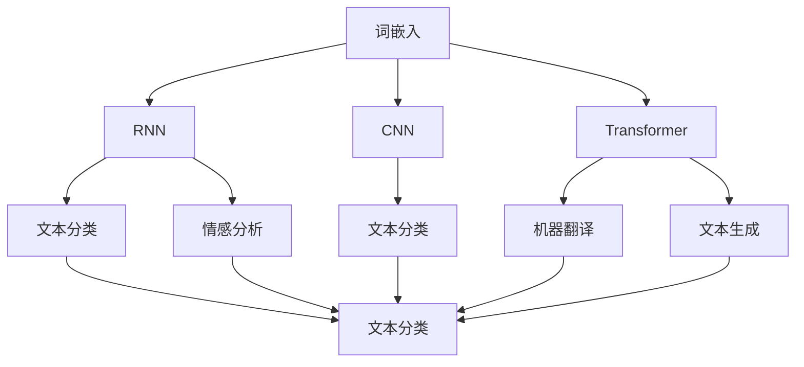

                 

# 基础模型在NLP中的应用

> 关键词：基础模型,自然语言处理,文本分类,情感分析,语言模型,机器翻译,命名实体识别,预训练模型

## 1. 背景介绍

在近年来深度学习技术的迅猛发展下，自然语言处理（Natural Language Processing, NLP）领域取得了显著的进展。基础模型作为深度学习模型的重要分支，已经在NLP中得到了广泛的应用。基础模型包括词嵌入（Word Embedding）、循环神经网络（Recurrent Neural Network, RNN）、卷积神经网络（Convolutional Neural Network, CNN）、Transformer等。本文将详细探讨基础模型在NLP中的应用，包括文本分类、情感分析、语言模型、机器翻译、命名实体识别等领域。

## 2. 核心概念与联系

### 2.1 核心概念概述

基础模型主要包括词嵌入、循环神经网络、卷积神经网络和Transformer等，这些模型在NLP中起到了重要的作用。它们通过学习自然语言中的特征和模式，对文本进行分类、情感分析、翻译和命名实体识别等任务，实现了自然语言处理的自动化和智能化。

1. **词嵌入（Word Embedding）**：将单词映射到低维向量空间中，使得语义相近的单词在向量空间中距离较近，便于计算和处理。常见的词嵌入模型有Word2Vec、GloVe等。

2. **循环神经网络（RNN）**：能够处理变长的序列数据，通过隐藏状态的传递，捕捉序列中的长期依赖关系。RNN包括LSTM和GRU等变种。

3. **卷积神经网络（CNN）**：通过卷积操作提取局部特征，适用于处理具有局部结构的信息。在NLP中常用于文本分类任务。

4. **Transformer**：一种基于自注意力机制的模型，能够并行计算，处理长序列数据，广泛应用于机器翻译、文本生成等领域。

这些核心概念之间的联系可以通过以下Mermaid流程图来展示：



这个流程图展示了基础模型在NLP中的应用场景：

1. 词嵌入模型将单词映射到低维向量空间，是RNN、CNN和Transformer等模型的基础。
2. RNN可以处理序列数据，常用于情感分析和文本分类等任务。
3. CNN适用于文本分类等任务，能够提取局部特征。
4. Transformer能够处理长序列数据，广泛应用于机器翻译和文本生成等任务。

## 3. 核心算法原理 & 具体操作步骤
### 3.1 算法原理概述

基础模型在NLP中的应用，主要是通过学习文本中的特征和模式，从而实现文本分类、情感分析、机器翻译和命名实体识别等任务。这些任务可以通过监督学习和无监督学习两种方式进行训练。

### 3.2 算法步骤详解

#### 文本分类

**步骤1：数据准备**  
准备文本数据和对应的标签数据。通常情况下，标签数据是二分类或多分类标签。

**步骤2：模型训练**  
使用词嵌入模型将文本数据转换为向量表示。将转换后的向量输入到RNN、CNN或Transformer等模型中，进行监督学习训练。常用的优化器包括SGD、Adam等。

**步骤3：模型评估**  
在测试集上对模型进行评估，常用的评估指标包括准确率、精确率、召回率和F1分数等。

#### 情感分析

**步骤1：数据准备**  
准备文本数据和对应的情感标签，通常为二分类（正负情感）或三分类（正、负、中性情感）。

**步骤2：模型训练**  
将文本数据转换为向量表示，输入到RNN或Transformer等模型中进行训练。同样使用监督学习方法，优化器选择SGD或Adam。

**步骤3：模型评估**  
在测试集上对模型进行评估，评估指标同文本分类任务。

#### 语言模型

**步骤1：数据准备**  
收集大规模无标签文本数据，用于预训练语言模型。

**步骤2：模型预训练**  
使用预训练技术，如自监督学习（遮掩语言模型、预测下一位等），训练语言模型。

**步骤3：模型微调**  
使用特定任务的数据集，对预训练的语言模型进行微调。微调时可以使用监督学习，优化器选择SGD或Adam。

#### 机器翻译

**步骤1：数据准备**  
准备源语言和目标语言的平行语料库。

**步骤2：模型训练**  
将源语言和目标语言的句子对输入到Transformer等模型中，进行监督学习训练。优化器选择Adam。

**步骤3：模型评估**  
在测试集上对模型进行评估，常用的评估指标包括BLEU分数和ROUGE分数等。

#### 命名实体识别

**步骤1：数据准备**  
准备标注了命名实体的文本数据，包括人名、地名、机构名等。

**步骤2：模型训练**  
将文本数据转换为向量表示，输入到RNN或Transformer等模型中进行训练。优化器选择Adam。

**步骤3：模型评估**  
在测试集上对模型进行评估，常用的评估指标包括准确率、召回率和F1分数等。

### 3.3 算法优缺点

#### 文本分类

**优点**：
1. 能够处理大规模文本数据。
2. 模型结构简单，易于实现。
3. 适用于多种文本分类任务。

**缺点**：
1. 需要大量标注数据进行训练。
2. 对文本预处理依赖较大。

#### 情感分析

**优点**：
1. 能够处理文本中的情感信息。
2. 模型精度较高。

**缺点**：
1. 需要大量标注数据进行训练。
2. 对文本预处理依赖较大。

#### 语言模型

**优点**：
1. 能够生成自然流畅的文本。
2. 适用于多种文本生成任务。

**缺点**：
1. 需要大量标注数据进行预训练。
2. 训练和推理耗时较长。

#### 机器翻译

**优点**：
1. 能够实现高质量的自动翻译。
2. 适用于多种语言之间的翻译。

**缺点**：
1. 需要大量平行语料库进行训练。
2. 训练和推理耗时较长。

#### 命名实体识别

**优点**：
1. 能够准确识别文本中的命名实体。
2. 适用于多种文本处理任务。

**缺点**：
1. 需要大量标注数据进行训练。
2. 对文本预处理依赖较大。

### 3.4 算法应用领域

基础模型在NLP中的应用领域非常广泛，以下是几个典型的应用场景：

- **文本分类**：包括垃圾邮件过滤、新闻分类、产品评论情感分析等。
- **情感分析**：包括社交媒体情感分析、产品评论情感分析等。
- **语言模型**：包括自动摘要、文本生成、机器翻译等。
- **机器翻译**：包括英中翻译、法德翻译、日韩翻译等。
- **命名实体识别**：包括人名识别、地名识别、机构名识别等。

## 4. 数学模型和公式 & 详细讲解 & 举例说明

### 4.1 数学模型构建

#### 文本分类

假设文本数据为 $\{x_1, x_2, \dots, x_n\}$，对应的标签数据为 $\{y_1, y_2, \dots, y_n\}$，其中 $y_i \in \{0, 1\}$ 表示文本 $x_i$ 属于第 $y_i$ 类。文本分类模型可以表示为：

$$
p(y_i|x_i) = \frac{p(y_i)}{p(x_i)} \prod_{j=1}^n p(w_j|y_i)
$$

其中 $p(y_i)$ 为标签 $y_i$ 的概率，$p(x_i)$ 为文本 $x_i$ 的概率，$p(w_j|y_i)$ 为单词 $w_j$ 在标签 $y_i$ 下出现的概率。

### 4.2 公式推导过程

#### 文本分类

$$
\log p(y_i|x_i) = \log \frac{p(y_i)}{p(x_i)} + \sum_{j=1}^n \log p(w_j|y_i)
$$

将上式改写为：

$$
\log p(y_i|x_i) = \log \frac{p(y_i)}{p(x_i)} + \sum_{j=1}^n \log \frac{p(w_j|y_i)}{p(w_j)}
$$

则模型的损失函数可以表示为：

$$
\mathcal{L} = -\sum_{i=1}^n \left[ y_i \log p(y_i|x_i) + (1-y_i) \log (1-p(y_i|x_i)) \right]
$$

### 4.3 案例分析与讲解

**案例1：情感分析**

假设文本数据为 $\{x_1, x_2, \dots, x_n\}$，对应的情感标签为 $\{0, 1\}$，其中 $0$ 表示负面情感，$1$ 表示正面情感。情感分析模型可以表示为：

$$
p(y_i=1|x_i) = \sigma(\mathbf{W}^T \mathbf{h}(x_i) + b)
$$

其中 $\sigma$ 为 sigmoid 函数，$\mathbf{W}$ 和 $b$ 为模型参数。

假设文本 $x_i$ 的词嵌入向量为 $\mathbf{h}(x_i)$，则模型的损失函数可以表示为：

$$
\mathcal{L} = -\sum_{i=1}^n [y_i \log p(y_i=1|x_i) + (1-y_i) \log (1-p(y_i=1|x_i))]
$$

**案例2：语言模型**

假设文本数据为 $\{x_1, x_2, \dots, x_n\}$，对应的单词序列为 $\{w_1, w_2, \dots, w_n\}$。语言模型可以表示为：

$$
p(\{x_1, x_2, \dots, x_n\}) = \prod_{i=1}^n p(x_i|x_{i-1})
$$

其中 $p(x_i|x_{i-1})$ 为单词 $x_i$ 在 $x_{i-1}$ 下的条件概率。

假设单词 $x_i$ 的词嵌入向量为 $\mathbf{h}(x_i)$，则模型的损失函数可以表示为：

$$
\mathcal{L} = -\sum_{i=1}^n \log p(x_i|x_{i-1})
$$

## 5. 项目实践：代码实例和详细解释说明

### 5.1 开发环境搭建

在进行项目实践前，我们需要准备好开发环境。以下是使用Python进行PyTorch开发的环境配置流程：

1. 安装Anaconda：从官网下载并安装Anaconda，用于创建独立的Python环境。

2. 创建并激活虚拟环境：
```bash
conda create -n pytorch-env python=3.8 
conda activate pytorch-env
```

3. 安装PyTorch：根据CUDA版本，从官网获取对应的安装命令。例如：
```bash
conda install pytorch torchvision torchaudio cudatoolkit=11.1 -c pytorch -c conda-forge
```

4. 安装TensorFlow：由Google主导开发的开源深度学习框架，生产部署方便，适合大规模工程应用。同样有丰富的预训练语言模型资源。

5. 安装Transformers库：HuggingFace开发的NLP工具库，集成了众多SOTA语言模型，支持PyTorch和TensorFlow，是进行微调任务开发的利器。

6. 安装各类工具包：
```bash
pip install numpy pandas scikit-learn matplotlib tqdm jupyter notebook ipython
```

完成上述步骤后，即可在`pytorch-env`环境中开始项目实践。

### 5.2 源代码详细实现

这里我们以情感分析任务为例，给出使用Transformers库对BERT模型进行微调的PyTorch代码实现。

首先，定义情感分析任务的数据处理函数：

```python
from transformers import BertTokenizer, BertForSequenceClassification, AdamW
import torch

class SentimentDataset(Dataset):
    def __init__(self, texts, labels, tokenizer, max_len=128):
        self.texts = texts
        self.labels = labels
        self.tokenizer = tokenizer
        self.max_len = max_len
        
    def __len__(self):
        return len(self.texts)
    
    def __getitem__(self, item):
        text = self.texts[item]
        label = self.labels[item]
        
        encoding = self.tokenizer(text, return_tensors='pt', max_length=self.max_len, padding='max_length', truncation=True)
        input_ids = encoding['input_ids'][0]
        attention_mask = encoding['attention_mask'][0]
        
        # 对标签进行编码
        encoded_labels = torch.tensor(label, dtype=torch.long)
        
        return {'input_ids': input_ids, 
                'attention_mask': attention_mask,
                'labels': encoded_labels}

# 创建dataset
tokenizer = BertTokenizer.from_pretrained('bert-base-cased')

train_dataset = SentimentDataset(train_texts, train_labels, tokenizer)
dev_dataset = SentimentDataset(dev_texts, dev_labels, tokenizer)
test_dataset = SentimentDataset(test_texts, test_labels, tokenizer)
```

然后，定义模型和优化器：

```python
model = BertForSequenceClassification.from_pretrained('bert-base-cased', num_labels=2)

optimizer = AdamW(model.parameters(), lr=2e-5)
```

接着，定义训练和评估函数：

```python
from torch.utils.data import DataLoader
from tqdm import tqdm
from sklearn.metrics import accuracy_score, precision_recall_fscore_support

device = torch.device('cuda') if torch.cuda.is_available() else torch.device('cpu')
model.to(device)

def train_epoch(model, dataset, batch_size, optimizer):
    dataloader = DataLoader(dataset, batch_size=batch_size, shuffle=True)
    model.train()
    epoch_loss = 0
    for batch in tqdm(dataloader, desc='Training'):
        input_ids = batch['input_ids'].to(device)
        attention_mask = batch['attention_mask'].to(device)
        labels = batch['labels'].to(device)
        model.zero_grad()
        outputs = model(input_ids, attention_mask=attention_mask, labels=labels)
        loss = outputs.loss
        epoch_loss += loss.item()
        loss.backward()
        optimizer.step()
    return epoch_loss / len(dataloader)

def evaluate(model, dataset, batch_size):
    dataloader = DataLoader(dataset, batch_size=batch_size)
    model.eval()
    preds, labels = [], []
    with torch.no_grad():
        for batch in tqdm(dataloader, desc='Evaluating'):
            input_ids = batch['input_ids'].to(device)
            attention_mask = batch['attention_mask'].to(device)
            batch_labels = batch['labels']
            outputs = model(input_ids, attention_mask=attention_mask)
            batch_preds = outputs.logits.argmax(dim=2).to('cpu').tolist()
            batch_labels = batch_labels.to('cpu').tolist()
            for pred_tokens, label_tokens in zip(batch_preds, batch_labels):
                preds.append(pred_tokens)
                labels.append(label_tokens)
                
    accuracy = accuracy_score(labels, preds)
    precision, recall, f1, _ = precision_recall_fscore_support(labels, preds, average='binary')
    return accuracy, precision, recall, f1

epochs = 5
batch_size = 16

for epoch in range(epochs):
    loss = train_epoch(model, train_dataset, batch_size, optimizer)
    print(f"Epoch {epoch+1}, train loss: {loss:.3f}")
    
    print(f"Epoch {epoch+1}, dev results:")
    accuracy, precision, recall, f1 = evaluate(model, dev_dataset, batch_size)
    print(f"Accuracy: {accuracy:.2f}, Precision: {precision:.2f}, Recall: {recall:.2f}, F1: {f1:.2f}")
    
print("Test results:")
accuracy, precision, recall, f1 = evaluate(model, test_dataset, batch_size)
print(f"Accuracy: {accuracy:.2f}, Precision: {precision:.2f}, Recall: {recall:.2f}, F1: {f1:.2f}")
```

以上就是使用PyTorch对BERT进行情感分析任务微调的完整代码实现。可以看到，得益于Transformers库的强大封装，我们可以用相对简洁的代码完成BERT模型的加载和微调。

### 5.3 代码解读与分析

让我们再详细解读一下关键代码的实现细节：

**SentimentDataset类**：
- `__init__`方法：初始化文本、标签、分词器等关键组件。
- `__len__`方法：返回数据集的样本数量。
- `__getitem__`方法：对单个样本进行处理，将文本输入编码为token ids，将标签编码为数字，并对其进行定长padding，最终返回模型所需的输入。

**模型和优化器**：
- `model`定义了情感分析模型的构建，使用了BERT模型。
- `optimizer`定义了AdamW优化器的构建，设置学习率为2e-5。

**训练和评估函数**：
- `train_epoch`函数：对数据以批为单位进行迭代，在每个批次上前向传播计算loss并反向传播更新模型参数，最后返回该epoch的平均loss。
- `evaluate`函数：与训练类似，不同点在于不更新模型参数，并在每个batch结束后将预测和标签结果存储下来，最后使用sklearn的accuracy_score和precision_recall_fscore_support函数对整个评估集的预测结果进行打印输出。

**训练流程**：
- 定义总的epoch数和batch size，开始循环迭代
- 每个epoch内，先在训练集上训练，输出平均loss
- 在验证集上评估，输出准确率、精确率、召回率和F1分数
- 所有epoch结束后，在测试集上评估，给出最终测试结果

可以看到，PyTorch配合Transformers库使得BERT微调的代码实现变得简洁高效。开发者可以将更多精力放在数据处理、模型改进等高层逻辑上，而不必过多关注底层的实现细节。

当然，工业级的系统实现还需考虑更多因素，如模型的保存和部署、超参数的自动搜索、更灵活的任务适配层等。但核心的微调范式基本与此类似。

## 6. 实际应用场景

### 6.1 智能客服系统

基于基础模型的智能客服系统，可以广泛应用于智能客服系统的构建。传统客服往往需要配备大量人力，高峰期响应缓慢，且一致性和专业性难以保证。而使用基于基础模型的智能客服系统，可以7x24小时不间断服务，快速响应客户咨询，用自然流畅的语言解答各类常见问题。

在技术实现上，可以收集企业内部的历史客服对话记录，将问题和最佳答复构建成监督数据，在此基础上对预训练的词嵌入模型、RNN或Transformer等模型进行微调。微调后的模型能够自动理解用户意图，匹配最合适的答案模板进行回复。对于客户提出的新问题，还可以接入检索系统实时搜索相关内容，动态组织生成回答。如此构建的智能客服系统，能大幅提升客户咨询体验和问题解决效率。

### 6.2 金融舆情监测

金融机构需要实时监测市场舆论动向，以便及时应对负面信息传播，规避金融风险。传统的人工监测方式成本高、效率低，难以应对网络时代海量信息爆发的挑战。基于基础模型的文本分类和情感分析技术，为金融舆情监测提供了新的解决方案。

具体而言，可以收集金融领域相关的新闻、报道、评论等文本数据，并对其进行主题标注和情感标注。在此基础上对预训练的语言模型进行微调，使其能够自动判断文本属于何种主题，情感倾向是正面、中性还是负面。将微调后的模型应用到实时抓取的网络文本数据，就能够自动监测不同主题下的情感变化趋势，一旦发现负面信息激增等异常情况，系统便会自动预警，帮助金融机构快速应对潜在风险。

### 6.3 个性化推荐系统

当前的推荐系统往往只依赖用户的历史行为数据进行物品推荐，无法深入理解用户的真实兴趣偏好。基于基础模型的推荐系统可以更好地挖掘用户行为背后的语义信息，从而提供更精准、多样的推荐内容。

在实践中，可以收集用户浏览、点击、评论、分享等行为数据，提取和用户交互的物品标题、描述、标签等文本内容。将文本内容作为模型输入，用户的后续行为（如是否点击、购买等）作为监督信号，在此基础上微调预训练语言模型。微调后的模型能够从文本内容中准确把握用户的兴趣点。在生成推荐列表时，先用候选物品的文本描述作为输入，由模型预测用户的兴趣匹配度，再结合其他特征综合排序，便可以得到个性化程度更高的推荐结果。

### 6.4 未来应用展望

随着基础模型的不断发展，其应用前景将更加广阔。未来，基础模型将更加适用于更多领域，带来更多应用场景。

- **智能客服**：通过自然语言处理，智能客服系统将更加高效、智能，能够更加准确地理解和回答客户问题。
- **金融舆情监测**：金融领域将更加依赖文本分类和情感分析技术，实现对市场舆情的实时监测和风险预警。
- **个性化推荐**：推荐系统将更加智能，能够从用户行为数据中提取更多的语义信息，提供更加精准的推荐。
- **文本生成**：基于基础模型的文本生成技术将更加先进，能够生成更加自然流畅的文本。
- **机器翻译**：机器翻译将更加准确，能够实现高质量的跨语言交流。

总之，基础模型在NLP领域的应用前景广阔，未来将带来更多的创新和发展。

## 7. 工具和资源推荐

### 7.1 学习资源推荐

为了帮助开发者系统掌握基础模型的理论基础和实践技巧，这里推荐一些优质的学习资源：

1. **《深度学习》书籍**：Ian Goodfellow、Yoshua Bengio和Aaron Courville合著的深度学习经典书籍，详细介绍了深度学习的原理和应用。

2. **《自然语言处理综述》书籍**：Stanford大学 natural language processing 课程的教材，涵盖了NLP领域的各种技术和方法。

3. **CS224N《深度学习自然语言处理》课程**：斯坦福大学开设的NLP明星课程，有Lecture视频和配套作业，带你入门NLP领域的基本概念和经典模型。

4. **自然语言处理课程**：各大高校和在线教育平台上的自然语言处理课程，如Coursera、edX等，提供了大量高质量的教学资源。

5. **NLP论文集**：arXiv和JMLR等平台的NLP论文集，提供了大量的前沿研究和技术进展。

通过对这些资源的学习实践，相信你一定能够快速掌握基础模型的精髓，并用于解决实际的NLP问题。

### 7.2 开发工具推荐

高效的开发离不开优秀的工具支持。以下是几款用于基础模型开发常用的工具：

1. **PyTorch**：基于Python的开源深度学习框架，灵活动态的计算图，适合快速迭代研究。

2. **TensorFlow**：由Google主导开发的开源深度学习框架，生产部署方便，适合大规模工程应用。

3. **Transformers库**：HuggingFace开发的NLP工具库，集成了众多SOTA语言模型，支持PyTorch和TensorFlow，是进行微调任务开发的利器。

4. **Weights & Biases**：模型训练的实验跟踪工具，可以记录和可视化模型训练过程中的各项指标，方便对比和调优。与主流深度学习框架无缝集成。

5. **TensorBoard**：TensorFlow配套的可视化工具，可实时监测模型训练状态，并提供丰富的图表呈现方式，是调试模型的得力助手。

6. **Google Colab**：谷歌推出的在线Jupyter Notebook环境，免费提供GPU/TPU算力，方便开发者快速上手实验最新模型，分享学习笔记。

合理利用这些工具，可以显著提升基础模型的开发效率，加快创新迭代的步伐。

### 7.3 相关论文推荐

基础模型在NLP中的应用得益于学界的持续研究。以下是几篇奠基性的相关论文，推荐阅读：

1. **Word2Vec**：Mikolov等人在2013年提出的词嵌入模型，将单词映射到低维向量空间中，能够捕捉单词之间的语义关系。

2. **LSTM**：Hochreiter和Schmidhuber在1997年提出的长短期记忆网络，能够处理序列数据，捕捉长期依赖关系。

3. **CNN**：LeCun等人在1998年提出的卷积神经网络，能够提取局部特征，适用于文本分类等任务。

4. **Transformer**：Vaswani等人在2017年提出的Transformer模型，使用自注意力机制，能够并行计算，处理长序列数据。

5. **BERT**：Devlin等人在2018年提出的BERT模型，通过掩码语言模型和预测下一位等自监督学习任务，训练了大规模无标签文本数据，获得了显著的性能提升。

这些论文代表了大语言模型微调技术的发展脉络。通过学习这些前沿成果，可以帮助研究者把握学科前进方向，激发更多的创新灵感。

## 8. 总结：未来发展趋势与挑战

### 8.1 总结

本文对基础模型在NLP中的应用进行了全面系统的介绍。首先阐述了基础模型和微调技术的研究背景和意义，明确了基础模型在NLP任务中的广泛应用。其次，从原理到实践，详细讲解了基础模型在文本分类、情感分析、语言模型、机器翻译和命名实体识别等任务中的应用方法，给出了微调任务开发的完整代码实例。同时，本文还探讨了基础模型在智能客服、金融舆情监测、个性化推荐等诸多行业领域的应用前景，展示了基础模型的巨大潜力。

通过本文的系统梳理，可以看到，基础模型在NLP领域的应用前景广阔，未来将带来更多的创新和发展。

### 8.2 未来发展趋势

展望未来，基础模型在NLP中的应用将呈现以下几个发展趋势：

1. **模型规模持续增大**：随着算力成本的下降和数据规模的扩张，预训练语言模型的参数量还将持续增长。超大规模语言模型蕴含的丰富语言知识，有望支撑更加复杂多变的下游任务微调。

2. **模型性能提升**：未来，基础模型将通过更多深度学习技术和算法创新，提升模型精度和泛化能力。

3. **应用场景拓展**：基础模型将应用于更多领域，如医疗、法律、金融等，为这些领域的自动化和智能化提供支持。

4. **模型结构优化**：未来，基础模型将通过模型压缩、剪枝等技术，提高模型的推理速度和效率。

5. **多模态融合**：基础模型将与视觉、语音等模态的信息进行融合，提升跨模态任务的性能。

6. **模型鲁棒性增强**：未来，基础模型将通过对抗训练、正则化等技术，增强模型的鲁棒性和泛化能力。

### 8.3 面临的挑战

尽管基础模型在NLP中的应用已经取得了显著成果，但在迈向更加智能化、普适化应用的过程中，它仍面临诸多挑战：

1. **标注数据不足**：在特定领域的微调任务中，获取高质量标注数据仍是一个瓶颈。如何通过少样本学习和迁移学习等技术，减少对标注数据的依赖，将是一大难题。

2. **模型鲁棒性不足**：基础模型面对域外数据时，泛化性能往往大打折扣。对于测试样本的微小扰动，模型的预测也容易发生波动。如何提高模型的鲁棒性，避免灾难性遗忘，还需要更多理论和实践的积累。

3. **推理效率有待提高**：大模型虽然精度高，但在实际部署时往往面临推理速度慢、内存占用大等效率问题。如何通过模型压缩、混合精度训练等技术，优化推理速度，降低内存占用，将是重要的优化方向。

4. **可解释性不足**：当前基础模型通常缺乏可解释性，难以解释其内部工作机制和决策逻辑。对于医疗、金融等高风险应用，算法的可解释性和可审计性尤为重要。如何赋予模型更强的可解释性，将是亟待攻克的难题。

5. **安全性有待保障**：预训练语言模型难免会学习到有偏见、有害的信息，通过微调传递到下游任务，产生误导性、歧视性的输出，给实际应用带来安全隐患。如何从数据和算法层面消除模型偏见，避免恶意用途，确保输出的安全性，也将是重要的研究课题。

### 8.4 研究展望

面对基础模型面临的这些挑战，未来的研究需要在以下几个方面寻求新的突破：

1. **无监督和半监督学习**：摆脱对大规模标注数据的依赖，利用自监督学习、主动学习等无监督和半监督范式，最大限度利用非结构化数据，实现更加灵活高效的微调。

2. **参数高效和计算高效**：开发更加参数高效的微调方法，在固定大部分预训练参数的同时，只更新极少量的任务相关参数。同时优化模型的计算图，减少前向传播和反向传播的资源消耗，实现更加轻量级、实时性的部署。

3. **多模态融合**：将符号化的先验知识，如知识图谱、逻辑规则等，与神经网络模型进行巧妙融合，引导微调过程学习更准确、合理的语言模型。同时加强不同模态数据的整合，实现视觉、语音等多模态信息与文本信息的协同建模。

4. **因果分析和博弈论**：将因果分析方法引入微调模型，识别出模型决策的关键特征，增强输出解释的因果性和逻辑性。借助博弈论工具刻画人机交互过程，主动探索并规避模型的脆弱点，提高系统稳定性。

5. **知识表示与推理**：引入因果推理和知识图谱等知识表示技术，提高模型的推理能力和知识整合能力，更好地利用外部的先验知识。

6. **安全性和公平性**：在模型训练目标中引入伦理导向的评估指标，过滤和惩罚有偏见、有害的输出倾向。同时加强人工干预和审核，建立模型行为的监管机制，确保输出符合人类价值观和伦理道德。

这些研究方向的探索，必将引领基础模型微调技术迈向更高的台阶，为构建安全、可靠、可解释、可控的智能系统铺平道路。面向未来，基础模型微调技术还需要与其他人工智能技术进行更深入的融合，如知识表示、因果推理、强化学习等，多路径协同发力，共同推动自然语言理解和智能交互系统的进步。只有勇于创新、敢于突破，才能不断拓展基础模型的边界，让智能技术更好地造福人类社会。

## 9. 附录：常见问题与解答

**Q1：基础模型是否适用于所有NLP任务？**

A: 基础模型在大多数NLP任务上都能取得不错的效果，特别是对于数据量较小的任务。但对于一些特定领域的任务，如医学、法律等，仅仅依靠通用语料预训练的模型可能难以很好地适应。此时需要在特定领域语料上进一步预训练，再进行微调，才能获得理想效果。此外，对于一些需要时效性、个性化很强的任务，如对话、推荐等，基础模型也需要针对性的改进优化。

**Q2：基础模型的学习率和优化器如何选择？**

A: 基础模型的学习率和优化器需要根据具体任务进行调节。通常情况下，学习率建议从1e-3或1e-4开始，逐步减小。对于优化器，常用的有SGD、Adam等，其中Adam在实践中表现较好，适用于大多数任务。

**Q3：基础模型的训练和推理耗时如何优化？**

A: 基础模型的训练和推理耗时较长，可以通过模型压缩、剪枝等技术，提高模型的推理速度和效率。同时，使用混合精度训练等技术，可以显著降低计算资源消耗。

**Q4：基础模型的鲁棒性如何提升？**

A: 基础模型的鲁棒性可以通过对抗训练、正则化等技术进行提升。此外，引入多任务学习等技术，可以使模型在多个任务上同时进行训练，提升泛化能力。

**Q5：基础模型的可解释性如何增强？**

A: 基础模型的可解释性可以通过可视化技术、模型压缩等技术进行增强。同时，引入因果推理等方法，可以使模型输出更加符合因果逻辑，提高可解释性。

这些问题的解答可以帮助开发者更好地理解基础模型的原理和实践技巧，为解决实际NLP问题提供指导。

---

作者：禅与计算机程序设计艺术 / Zen and the Art of Computer Programming

