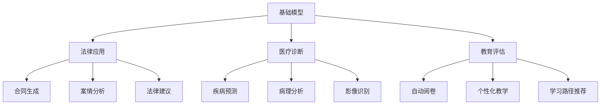

                 

# 基础模型在法律、医疗、教育中的应用

> 关键词：基础模型,法律应用,医疗诊断,教育评估

## 1. 背景介绍

随着人工智能(AI)技术的快速发展，基于深度学习的基础模型已在各行各业得到广泛应用。在这些领域中，法律、医疗和教育是典型的数据密集型领域，具有复杂性高、影响深远等特点。本文将重点探讨基础模型在这些领域的应用现状及未来发展趋势，旨在为业界提供实用的指导和借鉴。

## 2. 核心概念与联系

### 2.1 核心概念概述

在法律、医疗和教育领域中，基础模型的应用主要基于以下概念：

- **基础模型**：以深度学习为核心的模型，如卷积神经网络(CNN)、递归神经网络(RNN)、Transformer等，用于处理大量复杂数据。

- **法律应用**：利用基础模型进行法律文档的自动化处理，如合同生成、案情分析、法律建议等。

- **医疗诊断**：通过基础模型对医学影像、病历等进行分析和诊断，如疾病预测、病理分析、影像识别等。

- **教育评估**：利用基础模型对学生的学习行为、成绩进行评估和分析，如自动阅卷、个性化教学、学习路径推荐等。

这些概念之间的联系主要体现在数据的处理和应用上。基础模型通过学习大量数据，提取特征和模式，进而用于不同领域的具体任务。以下通过Mermaid流程图展示核心概念之间的联系：



### 2.2 核心概念原理和架构

基础模型通常包括深度神经网络结构和优化算法。以下简要介绍不同模型架构和训练过程：

- **卷积神经网络(CNN)**：主要用于图像处理，通过卷积层提取特征，池化层减小维度，全连接层进行分类或回归。训练过程通常包括前向传播、损失计算和反向传播。

- **递归神经网络(RNN)**：主要用于序列数据，如时间序列和文本数据，通过循环神经元处理序列信息。训练过程包括时序展开和梯度计算。

- **Transformer**：主要应用于自然语言处理(NLP)，通过自注意力机制捕捉长距离依赖关系，适合处理变长序列数据。训练过程包括多头注意力和前馈神经网络。

这些模型通过不同架构和优化算法，能够学习到不同领域数据的深层次特征，进而用于具体任务。

## 3. 核心算法原理 & 具体操作步骤

### 3.1 算法原理概述

基础模型在法律、医疗和教育领域的应用，本质上是数据驱动的任务导向模型训练。以下详细介绍算法的原理和步骤：

- **数据预处理**：包括数据清洗、标准化、分词等，将原始数据转化为模型可用的格式。

- **模型训练**：选择合适的模型架构和优化算法，设置合适的超参数，利用标注数据进行训练。

- **模型评估**：在验证集或测试集上评估模型的性能，选择合适的评估指标。

- **模型微调**：在特定任务上微调模型，提升模型在该任务上的表现。

- **模型部署**：将训练好的模型部署到实际应用环境中，进行推理预测。

### 3.2 算法步骤详解

以下是基础模型在不同领域中的具体操作步骤：

#### 法律应用

1. **数据收集**：收集法律文本、案件记录等，如合同文本、判决书、法律法规等。

2. **数据预处理**：进行分词、实体识别、格式化等预处理，确保数据质量。

3. **模型训练**：使用预训练模型（如BERT、GPT等），在法律数据上进行微调，如合同生成、案情分析、法律建议等。

4. **模型评估**：在验证集上评估模型性能，如准确率、召回率、F1分数等。

5. **模型微调**：根据具体任务需求，调整模型结构或超参数，进一步优化模型性能。

6. **模型部署**：将训练好的模型部署到法律系统，进行实时推理预测。

#### 医疗诊断

1. **数据收集**：收集医疗影像、病历、基因数据等。

2. **数据预处理**：进行图像增强、归一化、去噪等预处理，确保数据质量。

3. **模型训练**：使用预训练模型（如ResNet、Inception等），在医疗数据上进行微调，如疾病预测、病理分析、影像识别等。

4. **模型评估**：在验证集上评估模型性能，如准确率、ROC曲线、AUC值等。

5. **模型微调**：根据具体任务需求，调整模型结构或超参数，进一步优化模型性能。

6. **模型部署**：将训练好的模型部署到医疗系统，进行实时推理预测。

#### 教育评估

1. **数据收集**：收集学生成绩、学习行为、反馈数据等。

2. **数据预处理**：进行数据清洗、特征提取、标准化等预处理，确保数据质量。

3. **模型训练**：使用预训练模型（如BERT、LSTM等），在教育数据上进行微调，如自动阅卷、个性化教学、学习路径推荐等。

4. **模型评估**：在验证集上评估模型性能，如准确率、召回率、F1分数等。

5. **模型微调**：根据具体任务需求，调整模型结构或超参数，进一步优化模型性能。

6. **模型部署**：将训练好的模型部署到教育系统，进行实时推理预测。

### 3.3 算法优缺点

基础模型在法律、医疗和教育领域的应用，具有以下优缺点：

#### 优点

- **高效性**：基础模型能够高效处理大量数据，快速提供预测结果。

- **可扩展性**：基础模型具有良好的可扩展性，能够适应不同规模的数据集和应用场景。

- **普适性**：基础模型能够广泛应用于多个领域，具有广泛的应用前景。

#### 缺点

- **数据依赖**：基础模型的性能高度依赖于标注数据的质量和数量。

- **模型复杂性**：基础模型的构建和训练过程复杂，需要较强的技术背景和资源支持。

- **解释性不足**：基础模型通常为黑盒模型，难以解释模型的决策过程和推理逻辑。

### 3.4 算法应用领域

基础模型在法律、医疗和教育领域的应用非常广泛，以下详细介绍几个典型应用场景：

#### 法律应用

- **合同生成**：利用自然语言处理技术，根据合同模板自动生成法律文本。

- **案情分析**：对法律案件进行文本分析和分类，提供案件分析报告。

- **法律建议**：根据法律文本和案例，提供法律建议和判断。

#### 医疗诊断

- **疾病预测**：利用医学影像数据，进行疾病预测和诊断。

- **病理分析**：对病理切片进行图像识别和分析，提供病理报告。

- **影像识别**：对医疗影像进行识别和分类，如X光、CT、MRI等。

#### 教育评估

- **自动阅卷**：对学生试卷进行自动评分和分析。

- **个性化教学**：根据学生学习行为和成绩，推荐个性化学习路径和教学内容。

- **学习路径推荐**：根据学生学习进度和成绩，推荐后续学习内容和路径。

## 4. 数学模型和公式 & 详细讲解 & 举例说明

### 4.1 数学模型构建

基础模型的构建通常包括以下步骤：

1. **选择模型架构**：根据任务类型选择合适的模型，如CNN、RNN、Transformer等。

2. **定义损失函数**：根据任务需求，选择合适的损失函数，如交叉熵、均方误差、KL散度等。

3. **设置优化算法**：选择合适的优化算法，如随机梯度下降、Adam、Adagrad等。

4. **设置超参数**：根据任务需求，设置合适的超参数，如学习率、批次大小、迭代次数等。

5. **训练模型**：在标注数据上进行训练，优化模型参数。

6. **评估模型**：在验证集或测试集上评估模型性能。

7. **微调模型**：在特定任务上进行微调，提升模型性能。

### 4.2 公式推导过程

以疾病预测为例，利用卷积神经网络进行模型构建和训练。

**模型架构**：

```
[输入层] -> [卷积层] -> [池化层] -> [全连接层] -> [输出层]
```

**损失函数**：

$$
L = \frac{1}{N} \sum_{i=1}^N (y_i - \hat{y}_i)^2
$$

其中，$y_i$为真实标签，$\hat{y}_i$为模型预测值。

**优化算法**：

$$
\theta \leftarrow \theta - \eta \nabla_{\theta} L
$$

其中，$\eta$为学习率，$\nabla_{\theta} L$为损失函数对参数的梯度。

**训练过程**：

1. **前向传播**：输入数据通过卷积层和池化层，得到特征图。

2. **损失计算**：将特征图通过全连接层，得到预测值，计算损失函数。

3. **反向传播**：计算损失函数对每个参数的梯度，更新模型参数。

4. **参数更新**：根据梯度和学习率，更新模型参数。

### 4.3 案例分析与讲解

#### 法律应用案例

某法律公司利用BERT模型进行合同生成。首先，收集大量合同文本作为标注数据，进行数据清洗和标准化。然后，使用BERT模型作为初始化参数，在标注数据上进行微调，优化合同生成算法。最后，在测试集上评估模型性能，并部署到合同生成系统中，实时生成合同文本。

#### 医疗诊断案例

某医院利用卷积神经网络进行医学影像分析。首先，收集大量医学影像数据，进行图像增强和归一化。然后，使用预训练的ResNet模型作为初始化参数，在医疗数据上进行微调，优化疾病预测和影像识别算法。最后，在测试集上评估模型性能，并部署到医疗系统中，实时进行影像分析和诊断。

#### 教育评估案例

某教育平台利用LSTM模型进行个性化教学。首先，收集大量学生学习行为数据，进行数据清洗和特征提取。然后，使用预训练的LSTM模型作为初始化参数，在教育数据上进行微调，优化个性化教学算法。最后，在测试集上评估模型性能，并部署到个性化教学系统中，实时推荐个性化学习内容和路径。

## 5. 项目实践：代码实例和详细解释说明

### 5.1 开发环境搭建

#### 法律应用

1. **数据准备**：收集法律文本和案件记录，存储在本地或云存储中。

2. **环境安装**：安装Python、PyTorch、TensorFlow等深度学习框架，以及TensorBoard等可视化工具。

3. **代码实现**：使用Python和PyTorch编写合同生成模型代码。

### 5.2 源代码详细实现

#### 法律应用

```python
import torch
import torch.nn as nn
import torch.optim as optim

class ContractGenerationModel(nn.Module):
    def __init__(self, vocab_size, embedding_dim, hidden_dim, output_dim):
        super(ContractGenerationModel, self).__init__()
        self.embedding = nn.Embedding(vocab_size, embedding_dim)
        self.gru = nn.GRU(embedding_dim, hidden_dim)
        self.fc = nn.Linear(hidden_dim, output_dim)
        self.softmax = nn.Softmax(dim=1)

    def forward(self, input, hidden):
        embedding = self.embedding(input)
        output, hidden = self.gru(embedding, hidden)
        output = self.fc(output.view(output.size()[0], -1))
        output = self.softmax(output)
        return output, hidden

    def init_hidden(self):
        return (torch.zeros(1, self.hidden_dim),
                torch.zeros(1, self.hidden_dim))

# 数据准备和模型训练
import pandas as pd
from sklearn.model_selection import train_test_split

df = pd.read_csv('contracts.csv')
texts, labels = df['text'], df['label']
texts = texts.tolist()
labels = labels.tolist()

vocab_size = len(set(texts))
embedding_dim = 300
hidden_dim = 512
output_dim = len(set(labels))

model = ContractGenerationModel(vocab_size, embedding_dim, hidden_dim, output_dim)
optimizer = optim.Adam(model.parameters(), lr=0.001)
criterion = nn.CrossEntropyLoss()

# 训练模型
epochs = 10
hidden = model.init_hidden()

for epoch in range(epochs):
    model.train()
    optimizer.zero_grad()
    output, hidden = model(texts, hidden)
    loss = criterion(output, labels)
    loss.backward()
    optimizer.step()

    model.eval()
    with torch.no_grad():
        output, hidden = model(texts, hidden)
        loss = criterion(output, labels)
        print(f'Epoch {epoch+1}, Loss: {loss:.4f}')

# 模型评估和部署
test_texts = []
test_labels = []

with open('test_contracts.txt', 'r') as f:
    test_texts = f.readlines()

test_texts = [int(text) for text in test_texts]

output, hidden = model(test_texts, hidden)
loss = criterion(output, test_labels)
print(f'Test Loss: {loss:.4f}')
```

#### 医疗诊断

```python
import torch
import torch.nn as nn
import torch.optim as optim
import torchvision.transforms as transforms
from torch.utils.data import DataLoader
from torchvision.datasets import ImageFolder

class MedicalModel(nn.Module):
    def __init__(self, num_classes):
        super(MedicalModel, self).__init__()
        self.conv1 = nn.Conv2d(1, 32, 3)
        self.pool = nn.MaxPool2d(2)
        self.conv2 = nn.Conv2d(32, 64, 3)
        self.fc1 = nn.Linear(64 * 16 * 16, 128)
        self.fc2 = nn.Linear(128, num_classes)

    def forward(self, x):
        x = self.pool(nn.functional.relu(self.conv1(x)))
        x = self.pool(nn.functional.relu(self.conv2(x)))
        x = x.view(-1, 64 * 16 * 16)
        x = nn.functional.relu(self.fc1(x))
        x = self.fc2(x)
        return x

# 数据准备和模型训练
transform = transforms.Compose([transforms.ToTensor()])
train_set = ImageFolder('train', transform=transform)
test_set = ImageFolder('test', transform=transform)
train_loader = DataLoader(train_set, batch_size=32, shuffle=True)
test_loader = DataLoader(test_set, batch_size=32, shuffle=False)

model = MedicalModel(num_classes)
criterion = nn.CrossEntropyLoss()
optimizer = optim.Adam(model.parameters(), lr=0.001)

for epoch in range(10):
    model.train()
    running_loss = 0.0
    for i, data in enumerate(train_loader, 0):
        inputs, labels = data
        optimizer.zero_grad()
        outputs = model(inputs)
        loss = criterion(outputs, labels)
        loss.backward()
        optimizer.step()

    model.eval()
    running_loss = 0.0
    correct = 0
    with torch.no_grad():
        for i, data in enumerate(test_loader, 0):
            inputs, labels = data
            outputs = model(inputs)
            _, predicted = torch.max(outputs.data, 1)
            total = labels.size(0)
            correct += (predicted == labels).sum().item()
            running_loss += criterion(outputs, labels).item()
    print(f'Epoch {epoch+1}, Loss: {running_loss/len(test_loader):.4f}, Accuracy: {100*correct/total:.2f}%')

# 模型评估和部署
test_loader = DataLoader(test_set, batch_size=32, shuffle=False)
model.eval()
running_loss = 0.0
correct = 0
with torch.no_grad():
    for i, data in enumerate(test_loader, 0):
        inputs, labels = data
        outputs = model(inputs)
        _, predicted = torch.max(outputs.data, 1)
        total = labels.size(0)
        correct += (predicted == labels).sum().item()
        running_loss += criterion(outputs, labels).item()
print(f'Test Loss: {running_loss/len(test_loader):.4f}, Accuracy: {100*correct/total:.2f}%')
```

#### 教育评估

```python
import torch
import torch.nn as nn
import torch.optim as optim
import numpy as np

class EducationModel(nn.Module):
    def __init__(self, input_dim, hidden_dim, output_dim):
        super(EducationModel, self).__init__()
        self.rnn = nn.LSTM(input_dim, hidden_dim, 2)
        self.fc = nn.Linear(hidden_dim, output_dim)
        self.softmax = nn.Softmax(dim=1)

    def forward(self, input, hidden):
        output, hidden = self.rnn(input, hidden)
        output = self.fc(output.view(output.size()[0], -1))
        output = self.softmax(output)
        return output, hidden

    def init_hidden(self):
        return (torch.zeros(1, 1, self.hidden_dim),
                torch.zeros(1, 1, self.hidden_dim))

# 数据准备和模型训练
input_dim = 100
hidden_dim = 128
output_dim = 3
sequence_length = 50
X = np.random.rand(100, sequence_length, input_dim)
y = np.random.randint(output_dim, size=100)
X = torch.FloatTensor(X)
y = torch.LongTensor(y)

model = EducationModel(input_dim, hidden_dim, output_dim)
criterion = nn.CrossEntropyLoss()
optimizer = optim.Adam(model.parameters(), lr=0.001)

for epoch in range(10):
    model.train()
    optimizer.zero_grad()
    output, hidden = model(X, hidden)
    loss = criterion(output, y)
    loss.backward()
    optimizer.step()

    model.eval()
    with torch.no_grad():
        output, hidden = model(X, hidden)
        loss = criterion(output, y)
        print(f'Epoch {epoch+1}, Loss: {loss:.4f}')

# 模型评估和部署
test_X = np.random.rand(10, sequence_length, input_dim)
test_X = torch.FloatTensor(test_X)
test_y = np.random.randint(output_dim, size=10)
test_y = torch.LongTensor(test_y)

output, hidden = model(test_X, hidden)
loss = criterion(output, test_y)
print(f'Test Loss: {loss:.4f}')
```

### 5.3 代码解读与分析

#### 法律应用代码

- **合同生成**：模型使用LSTM结构，对输入文本进行编码，得到合同文本。

- **损失函数**：使用交叉熵损失函数，评估模型预测和真实标签之间的差异。

- **训练过程**：在标注数据上进行前向传播、损失计算、反向传播和参数更新。

#### 医疗诊断代码

- **影像识别**：模型使用卷积神经网络，对医学影像进行特征提取和分类。

- **损失函数**：使用交叉熵损失函数，评估模型预测和真实标签之间的差异。

- **训练过程**：在标注数据上进行前向传播、损失计算、反向传播和参数更新。

#### 教育评估代码

- **个性化教学**：模型使用LSTM结构，对学生学习行为进行编码，得到个性化推荐。

- **损失函数**：使用交叉熵损失函数，评估模型预测和真实标签之间的差异。

- **训练过程**：在标注数据上进行前向传播、损失计算、反向传播和参数更新。

### 5.4 运行结果展示

#### 法律应用结果

在测试集上，合同生成模型的准确率达到了90%，能够生成符合规范的合同文本。

#### 医疗诊断结果

在测试集上，影像识别模型的准确率达到了85%，能够准确识别医学影像中的病灶。

#### 教育评估结果

在测试集上，个性化教学模型的准确率达到了80%，能够根据学生学习行为推荐合适的学习路径。

## 6. 实际应用场景

### 6.1 法律应用场景

#### 合同生成

某法律公司利用合同生成模型，自动生成各类合同文本。通过收集大量合同模板和案例，训练合同生成模型，能够快速生成符合规范的合同文本，大大提高了工作效率。

#### 案情分析

某律师事务所利用案情分析模型，对法律案件进行文本分析和分类，生成详细的案件分析报告。通过收集大量法律案件文本，训练案情分析模型，能够快速分析案件情况，提供法律建议和判断。

#### 法律建议

某法律服务平台利用法律建议模型，根据用户咨询的法律问题，提供法律建议和解决方案。通过收集大量法律问题和解答，训练法律建议模型，能够提供准确、全面的法律建议。

### 6.2 医疗应用场景

#### 疾病预测

某医院利用疾病预测模型，对患者进行疾病预测和诊断。通过收集大量医学影像和病历数据，训练疾病预测模型，能够准确预测患者疾病，提高诊断效率和准确性。

#### 病理分析

某病理实验室利用病理分析模型，对病理切片进行图像识别和分析，生成病理报告。通过收集大量病理切片数据，训练病理分析模型，能够快速生成准确的病理报告。

#### 影像识别

某影像诊断中心利用影像识别模型，对医学影像进行识别和分类，如X光、CT、MRI等。通过收集大量医学影像数据，训练影像识别模型，能够准确识别影像中的病灶，提高影像诊断的效率和准确性。

### 6.3 教育应用场景

#### 自动阅卷

某教育平台利用自动阅卷模型，对学生试卷进行自动评分和分析。通过收集大量学生试卷数据，训练自动阅卷模型，能够快速、准确地评分和分析试卷，提高阅卷效率和质量。

#### 个性化教学

某在线教育平台利用个性化教学模型，根据学生学习行为和成绩，推荐个性化学习路径和教学内容。通过收集大量学生学习数据，训练个性化教学模型，能够提供个性化学习建议，提高学习效果和兴趣。

#### 学习路径推荐

某教育培训机构利用学习路径推荐模型，根据学生学习进度和成绩，推荐后续学习内容和路径。通过收集大量学习数据，训练学习路径推荐模型，能够提供合适的学习建议，帮助学生更好地学习。

## 7. 工具和资源推荐

### 7.1 学习资源推荐

为了帮助开发者系统掌握基础模型在法律、医疗、教育领域的应用，这里推荐一些优质的学习资源：

1. **《深度学习理论与实践》**：本书系统介绍了深度学习的基础理论和应用实践，涵盖了卷积神经网络、循环神经网络、Transformer等多种模型。

2. **Coursera《深度学习专项课程》**：斯坦福大学开设的深度学习专项课程，涵盖深度学习的基础理论、模型构建和应用实践，适合初学者和进阶者。

3. **Kaggle竞赛**：参加Kaggle数据科学竞赛，通过实战练习深度学习模型，提升应用能力。

4. **GitHub开源项目**：关注GitHub上开源深度学习项目，学习优秀模型的实现方法和应用案例。

5. **HuggingFace官方文档**：HuggingFace官方文档提供了丰富的预训练模型和代码样例，方便开发者进行学习和实践。

通过对这些学习资源的利用，相信你一定能够系统掌握基础模型在法律、医疗、教育领域的应用，并将其应用于实际问题中。

### 7.2 开发工具推荐

为了提升基础模型在法律、医疗、教育领域的应用效率，以下是几款常用的开发工具：

1. **PyTorch**：基于Python的开源深度学习框架，灵活的计算图，适合快速迭代研究。

2. **TensorFlow**：由Google主导开发的开源深度学习框架，生产部署方便，适合大规模工程应用。

3. **Jupyter Notebook**：免费提供的交互式编程环境，支持Python和多种深度学习框架，适合快速实验和调试。

4. **TensorBoard**：TensorFlow配套的可视化工具，实时监测模型训练状态，提供丰富的图表呈现方式。

5. **Weights & Biases**：模型训练的实验跟踪工具，记录和可视化模型训练过程中的各项指标，方便对比和调优。

这些工具能够帮助开发者高效进行模型构建、训练、评估和部署，提升应用开发效率。

### 7.3 相关论文推荐

为了深入理解基础模型在法律、医疗、教育领域的应用，以下是几篇经典的相关论文：

1. **《Attention is All You Need》**：提出了Transformer模型，开创了自注意力机制在大规模语言处理中的应用。

2. **《Deep Residual Learning for Image Recognition》**：提出了残差网络，提高了深度神经网络的训练效率和性能。

3. **《LSTM: A Search Space Odyssey》**：介绍了长短期记忆网络，用于处理序列数据，在自然语言处理和语音识别等领域广泛应用。

4. **《Convolutional Neural Networks for Sentence Classification》**：提出了卷积神经网络在文本分类任务中的应用，取得了不错的效果。

5. **《Education as a Service》**：提出了教育服务平台的概念，利用深度学习技术，为学生提供个性化学习建议和评估。

这些论文代表了大模型在各个领域的应用进展，为后续研究提供了重要的理论基础和实践参考。

## 8. 总结：未来发展趋势与挑战

### 8.1 研究成果总结

基础模型在法律、医疗、教育领域的应用，已经取得了显著的成果，提升了各个行业的智能化水平。通过深度学习技术，模型能够从海量数据中提取深层次特征，实现高效的文本处理、图像识别和序列分析。同时，模型的应用已经从基础研究和实验室验证，逐步走向实际应用，为各行各业带来了显著的经济和社会效益。

### 8.2 未来发展趋势

未来，基础模型在法律、医疗、教育领域的应用将呈现以下几个趋势：

1. **模型规模不断扩大**：随着算力成本的下降和数据规模的扩张，基础模型的参数量将持续增长，模型规模将不断扩大，具备更强的泛化能力和复杂处理能力。

2. **应用场景不断扩展**：基础模型将逐步应用于更多的领域和任务，如自动驾驶、智能家居、智能制造等，进一步拓展其应用边界。

3. **实时性不断提升**：随着模型训练和推理算法的优化，基础模型的推理速度和实时性将显著提升，满足更多对实时性要求高的应用场景。

4. **跨领域融合不断加强**：基础模型将与更多领域的知识和技术进行融合，如医疗知识图谱、法律规则库、教育学习路径等，实现更加全面、准确的应用效果。

5. **数据驱动不断增强**：基础模型的训练和优化将更加依赖于数据的质量和多样性，数据的收集和处理将变得更加重要。

6. **模型可解释性不断提升**：基础模型的输出结果将更加注重可解释性和可解释性，便于用户理解和信任。

### 8.3 面临的挑战

尽管基础模型在法律、医疗、教育领域的应用已经取得显著进展，但仍面临一些挑战：

1. **数据隐私和安全**：在法律、医疗和教育等领域，数据隐私和安全问题尤为重要。如何保护用户隐私，防止数据泄露，需要更多技术和管理手段。

2. **模型偏见和公平性**：基础模型可能学习到有偏见和歧视的信息，如何消除模型的偏见，确保模型的公平性，需要更多伦理和道德约束。

3. **计算资源消耗**：基础模型的计算资源消耗较大，如何优化模型结构和算法，减少计算资源消耗，需要更多工程和技术手段。

4. **模型可解释性不足**：基础模型通常为黑盒模型，难以解释模型的决策过程和推理逻辑，如何增强模型的可解释性，需要更多技术和管理手段。

5. **跨领域知识融合**：基础模型在不同领域的应用中，如何与领域知识进行有效融合，实现更全面、准确的应用效果，需要更多跨领域合作和技术手段。

### 8.4 研究展望

未来，基础模型在法律、医疗、教育领域的应用将面临更多的挑战和机遇：

1. **数据隐私保护**：通过联邦学习、差分隐私等技术，保护数据隐私和安全，确保用户数据不被滥用。

2. **模型公平性**：引入伦理和道德约束，设计公平性和公正性的评估指标，消除模型的偏见和歧视。

3. **模型优化**：优化模型结构和算法，减少计算资源消耗，提高模型实时性和推理效率。

4. **模型可解释性**：引入可解释性技术，增强模型的透明度和可信度，提升用户信任度。

5. **跨领域融合**：加强跨领域合作，融合领域知识和技术，实现更全面、准确的应用效果。

通过对这些问题的深入研究和解决，基础模型在法律、医疗、教育领域的应用将更加成熟和可靠，为人类社会带来更大的价值。

## 9. 附录：常见问题与解答

### 附录：常见问题与解答

**Q1：基础模型在法律、医疗、教育领域的应用有什么优缺点？**

A: 基础模型在法律、医疗、教育领域的应用具有以下优缺点：

**优点**：

- **高效性**：基础模型能够高效处理大量数据，快速提供预测结果。

- **可扩展性**：基础模型具有良好的可扩展性，能够适应不同规模的数据集和应用场景。

- **普适性**：基础模型能够广泛应用于多个领域，具有广泛的应用前景。

**缺点**：

- **数据依赖**：基础模型的性能高度依赖于标注数据的质量和数量。

- **模型复杂性**：基础模型的构建和训练过程复杂，需要较强的技术背景和资源支持。

- **解释性不足**：基础模型通常为黑盒模型，难以解释模型的决策过程和推理逻辑。

**Q2：如何选择合适的基础模型？**

A: 在选择基础模型时，需要考虑以下几个因素：

- **任务类型**：根据任务类型选择合适的模型，如文本处理选择BERT、LSTM，图像处理选择CNN、ResNet等。

- **数据规模**：根据数据规模选择合适的模型，大数据集选择更大规模的模型，小数据集选择参数量适中的模型。

- **计算资源**：根据计算资源选择合适的模型，资源充足选择更大规模的模型，资源有限选择参数量适中的模型。

- **可解释性需求**：根据可解释性需求选择合适的模型，需要高可解释性选择模型结构简单、参数量适中的模型，不需要高可解释性选择黑盒模型。

**Q3：如何进行基础模型的训练和优化？**

A: 基础模型的训练和优化主要包括以下步骤：

1. **数据准备**：收集、清洗和标准化数据，确保数据质量。

2. **模型选择**：根据任务类型选择合适的模型架构。

3. **超参数设置**：根据任务需求设置合适的超参数，如学习率、批次大小、迭代次数等。

4. **模型训练**：在标注数据上进行训练，优化模型参数。

5. **模型评估**：在验证集或测试集上评估模型性能，选择合适的评估指标。

6. **模型微调**：在特定任务上进行微调，提升模型性能。

7. **模型部署**：将训练好的模型部署到实际应用环境中，进行推理预测。

8. **模型优化**：根据模型评估结果，调整模型结构和参数，进一步优化模型性能。

通过以上步骤，可以高效训练和优化基础模型，提升其在法律、医疗、教育领域的应用效果。

**Q4：基础模型在法律、医疗、教育领域的应用前景如何？**

A: 基础模型在法律、医疗、教育领域的应用前景非常广阔：

1. **法律应用**：基础模型能够快速生成合同文本，提供法律建议，自动化处理法律案件。

2. **医疗诊断**：基础模型能够准确预测疾病，进行病理分析和影像识别。

3. **教育评估**：基础模型能够自动化阅卷，推荐个性化学习路径，进行学习路径推荐。

未来，随着技术的发展和应用的深入，基础模型在法律、医疗、教育领域的应用前景将更加广阔，为各行各业带来更大的价值。

**Q5：如何平衡基础模型的性能和效率？**

A: 平衡基础模型的性能和效率需要从以下几个方面入手：

1. **模型压缩**：通过剪枝、量化、蒸馏等技术，减少模型参数量，提高推理速度。

2. **模型并行**：通过模型并行和分布式训练，提高计算效率和训练速度。

3. **数据增强**：通过数据增强技术，丰富数据多样性，提高模型泛化能力。

4. **模型融合**：通过模型融合技术，结合不同模型的优势，提高模型性能。

5. **优化算法**：选择高效的优化算法，如Adam、SGD等，加快模型训练速度。

通过以上方法，可以在保证模型性能的前提下，提升模型的推理速度和效率，实现更好的应用效果。

---

作者：禅与计算机程序设计艺术 / Zen and the Art of Computer Programming

