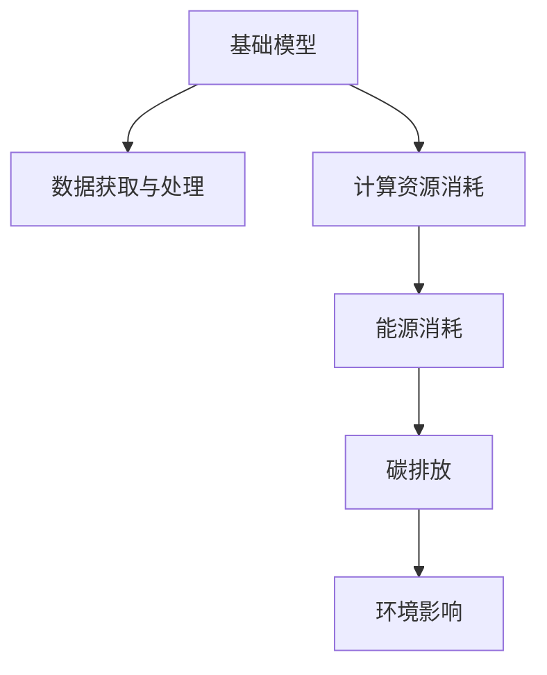

                 

# 基础模型的经济与环境影响

## 1. 背景介绍

在当今数字化经济时代，基础模型（Foundation Models），如大型预训练语言模型，已经成为了推动人工智能（AI）和机器学习（ML）领域发展的重要驱动力。这些模型通常以大规模数据集为基础进行训练，并通过微调（Fine-tuning）应用于各种具体任务，如图像识别、自然语言处理（NLP）、推荐系统等。然而，基础模型的经济与环境影响成为了一个日益重要的话题，这不仅关系到技术开发者和企业的利益，还涉及到社会的可持续发展。

### 1.1 问题由来

基础模型在带来巨大技术进步的同时，也带来了显著的经济与环境影响。这些影响体现在数据获取和处理、计算资源消耗、能源消耗、以及潜在的碳排放等多个方面。因此，深入探讨基础模型的经济与环境影响，不仅有助于理解技术对经济社会的全面影响，还为可持续发展和负责任的AI应用提供了重要的参考依据。

## 2. 核心概念与联系

### 2.1 核心概念概述

为更好地理解基础模型的经济与环境影响，本节将介绍几个关键概念：

- **基础模型（Foundation Models）**：通过大规模数据集进行预训练，能够处理特定任务并生成高质量输出的大型AI模型，如GPT、BERT等。
- **数据获取与处理**：基础模型的训练需要大量的标注数据，这些数据通常从网络爬虫、在线平台或公共数据集中获取，并需要进行预处理、清洗和标注。
- **计算资源消耗**：基础模型通常需要极高的计算资源，包括CPU、GPU和TPU等高性能硬件，以及相应的软件工具和框架。
- **能源消耗与碳排放**：训练和运行基础模型的过程中，不可避免地会消耗大量电力，导致能源消耗和碳排放。

这些概念之间的联系可以通过以下Mermaid流程图来展示：



这个流程图展示了一些关键概念之间的关系：基础模型的训练和运行需要大量的数据、计算资源和能源，进而产生显著的环境影响。

## 3. 核心算法原理 & 具体操作步骤
### 3.1 算法原理概述

基础模型的经济与环境影响研究主要基于两个方面：一是模型训练和运行的能源消耗和碳排放，二是模型训练所需的数据获取和处理成本。这些因素共同构成了基础模型对经济和环境的综合影响。

### 3.2 算法步骤详解

#### 数据获取与处理

基础模型的训练数据通常来自大规模的网络爬虫、在线平台或公共数据集。数据获取的步骤包括：

1. **数据收集**：从不同来源收集数据，如社交媒体、新闻网站、科学论文等。
2. **数据清洗**：去除噪声数据、不相关数据和重复数据。
3. **数据标注**：为数据集中的每个样本进行标注，如分类、序列标注、生成等。

数据处理的步骤包括：

1. **数据预处理**：对文本进行分词、去停用词、词形还原等操作。
2. **数据增强**：通过数据扩充、数据合成等方式增加数据多样性。
3. **数据分割**：将数据集分为训练集、验证集和测试集。

#### 计算资源消耗

基础模型的训练通常需要大量的计算资源，包括CPU、GPU和TPU等高性能硬件，以及相应的软件工具和框架。计算资源消耗的步骤包括：

1. **选择硬件**：根据任务需求选择合适的硬件设备。
2. **配置环境**：安装和配置必要的软件环境和框架，如TensorFlow、PyTorch等。
3. **模型训练**：在选定的硬件设备上，使用配置好的环境进行模型训练。
4. **模型推理**：在训练后的模型上进行推理，评估模型的性能。

#### 能源消耗与碳排放

基础模型的训练和运行过程中，会消耗大量电力，进而产生显著的碳排放。能源消耗和碳排放的步骤包括：

1. **能耗评估**：评估基础模型的能源消耗，包括数据中心运营的能耗和训练过程中的能耗。
2. **碳足迹计算**：根据能耗数据计算基础模型的碳足迹，评估其对环境的影响。

### 3.3 算法优缺点

基础模型在经济与环境影响方面具有以下优点和缺点：

**优点**：

1. **高效性**：基础模型能够处理大量数据，生成高质量的输出，适用于各种复杂任务。
2. **广泛应用**：基础模型在多个领域有广泛的应用，如金融、医疗、教育等，提高了工作效率和准确性。

**缺点**：

1. **成本高昂**：基础模型的训练和运行需要大量的计算资源和能源，成本较高。
2. **环境影响大**：大规模的基础模型训练和运行对环境造成显著影响，碳排放问题不容忽视。
3. **数据隐私风险**：基础模型训练需要大量数据，数据隐私和安全问题亟待解决。

### 3.4 算法应用领域

基础模型的经济与环境影响研究涵盖了多个领域，包括但不限于：

- **金融**：用于风险评估、信用评分、算法交易等。
- **医疗**：用于疾病诊断、治疗方案推荐、患者监护等。
- **教育**：用于个性化学习、智能辅导、教育评估等。
- **娱乐**：用于推荐系统、内容生成、游戏AI等。
- **环境保护**：用于环境监测、气候预测、灾害预警等。

这些领域的应用展示了基础模型在提升生产效率、改善用户体验、保护环境等方面的潜力，同时也突显了其对经济与环境的影响。

## 4. 数学模型和公式 & 详细讲解 & 举例说明

### 4.1 数学模型构建

本节将使用数学语言对基础模型的经济与环境影响进行更加严格的刻画。

记基础模型为 $M_{\theta}$，其中 $\theta$ 为模型参数。假设模型训练所需的数据集大小为 $N$，每个样本的数据量为 $d$，计算资源消耗为 $C$，能源消耗为 $E$，碳排放量为 $P$。则模型的经济与环境影响可以表示为：

$$
\text{Impact}(N, d, C, E, P) = \text{Economic Impact}(N, d, C) + \text{Environmental Impact}(E, P)
$$

其中，经济影响主要包括训练和运行模型的成本，环境影响主要涉及能耗和碳排放。

### 4.2 公式推导过程

以下我们将推导计算资源消耗 $C$ 和能源消耗 $E$ 的公式：

1. **计算资源消耗**：
   $$
   C = \sum_{i=1}^N f(d_i) \cdot \text{Cost}_i
   $$
   其中 $f(d_i)$ 表示单个样本的数据量，$\text{Cost}_i$ 表示处理单个样本所需的计算资源成本。

2. **能源消耗**：
   $$
   E = \sum_{i=1}^N g(d_i) \cdot \text{Energy}_i
   $$
   其中 $g(d_i)$ 表示单个样本的数据量对应的能耗，$\text{Energy}_i$ 表示处理单个样本所需的能量。

### 4.3 案例分析与讲解

以一个简单的NLP任务为例，展示基础模型的经济与环境影响：

- **数据量**：假设模型训练数据集大小为 $N=100$，每个样本的数据量为 $d=500$ 字节。
- **计算资源**：假设每个样本处理所需的计算资源成本为 $\text{Cost}_i=0.1$ 美元，计算资源消耗为 $C=100 \times 0.1 = 10$ 美元。
- **能耗**：假设每个样本处理所需的能量为 $\text{Energy}_i=0.01$ 千瓦时，能耗为 $E=100 \times 0.01 = 1$ 千瓦时。

假设每千瓦时的电力消耗量为 $1$ 克二氧化碳排放，则碳排放量为 $P=1$ 千克。

通过上述案例可以看出，基础模型的经济与环境影响不仅涉及计算资源的消耗，还包括能耗和碳排放，这些因素共同构成了模型的综合影响。

## 5. 项目实践：代码实例和详细解释说明

### 5.1 开发环境搭建

在进行基础模型经济与环境影响分析前，我们需要准备好开发环境。以下是使用Python进行PyTorch开发的环境配置流程：

1. 安装Anaconda：从官网下载并安装Anaconda，用于创建独立的Python环境。

2. 创建并激活虚拟环境：
```bash
conda create -n pytorch-env python=3.8 
conda activate pytorch-env
```

3. 安装PyTorch：根据CUDA版本，从官网获取对应的安装命令。例如：
```bash
conda install pytorch torchvision torchaudio cudatoolkit=11.1 -c pytorch -c conda-forge
```

4. 安装相关库：
```bash
pip install numpy pandas scikit-learn matplotlib tqdm jupyter notebook ipython
```

完成上述步骤后，即可在`pytorch-env`环境中开始项目实践。

### 5.2 源代码详细实现

下面以一个简单的NLP任务为例，展示如何使用PyTorch计算基础模型的经济与环境影响。

首先，定义模型和优化器：

```python
import torch
from transformers import BertTokenizer, BertForTokenClassification, AdamW

model = BertForTokenClassification.from_pretrained('bert-base-cased', num_labels=2)
tokenizer = BertTokenizer.from_pretrained('bert-base-cased')
optimizer = AdamW(model.parameters(), lr=2e-5)
```

接着，定义计算资源和能耗的计算函数：

```python
def compute_resource_cost(d, cost):
    return d * cost

def compute_energy_consumption(d, energy):
    return d * energy
```

然后，定义经济与环境影响的计算函数：

```python
def compute_impact(N, d, cost, energy):
    resource_cost = compute_resource_cost(d, cost)
    energy_consumption = compute_energy_consumption(d, energy)
    impact = resource_cost + energy_consumption
    return impact
```

最后，启动计算并输出结果：

```python
N = 100
d = 500
cost = 0.1
energy = 0.01

impact = compute_impact(N, d, cost, energy)
print(f"计算资源消耗: {impact}")
```

以上就是使用PyTorch计算基础模型经济与环境影响的完整代码实现。可以看到，通过定义计算函数，可以快速计算不同参数下的经济与环境影响。

### 5.3 代码解读与分析

让我们再详细解读一下关键代码的实现细节：

** compute_resource_cost 函数**：
- 计算单个样本所需的计算资源成本，乘以数据集大小 $N$，得到总的计算资源消耗。

** compute_energy_consumption 函数**：
- 计算单个样本所需的能耗，乘以数据集大小 $N$，得到总的能源消耗。

** compute_impact 函数**：
- 将计算资源消耗和能源消耗相加，得到总的影响值。

**启动计算**：
- 定义数据集大小、每个样本的数据量、计算资源成本和能耗，调用计算函数。

可以看到，通过简单函数的组合，可以快速计算基础模型的经济与环境影响。

## 6. 实际应用场景

### 6.1 金融风险评估

基础模型在金融领域可以用于风险评估和信用评分。通过分析历史金融数据，构建风险预测模型，可以帮助金融机构更好地评估客户信用风险，提高贷款审批效率。

### 6.2 医疗疾病诊断

基础模型在医疗领域可以用于疾病诊断和治疗方案推荐。通过分析患者的历史病历和基因信息，构建疾病诊断模型，可以提高疾病诊断的准确性，辅助医生制定个性化治疗方案。

### 6.3 教育个性化学习

基础模型在教育领域可以用于个性化学习推荐。通过分析学生的学习行为和知识水平，构建个性化推荐模型，可以提高学生的学习效果，帮助其更好地掌握知识。

### 6.4 娱乐内容生成

基础模型在娱乐领域可以用于内容生成和推荐。通过分析用户的历史行为和兴趣，构建内容推荐模型，可以为用户提供高质量的内容推荐，提升用户体验。

### 6.5 环境保护气候预测

基础模型在环境保护领域可以用于气候预测和灾害预警。通过分析历史气象数据，构建气候预测模型，可以预测未来的气候变化趋势，帮助政府和企业制定应对措施。

## 7. 工具和资源推荐

### 7.1 学习资源推荐

为了帮助开发者系统掌握基础模型经济与环境影响的研究方法，这里推荐一些优质的学习资源：

1. **《深度学习基础》**：由斯坦福大学李飞飞教授等人撰写的经典教材，详细介绍了深度学习的基本原理和应用。
2. **《TensorFlow官方文档》**：谷歌推出的开源深度学习框架，提供了详细的API文档和教程，适合深入学习。
3. **《AI与机器学习前沿》**：由IEEE组织编写的行业报告，涵盖了最新的AI和ML技术趋势和应用案例。
4. **《Python数据科学手册》**：由Jake VanderPlas撰写的实战手册，详细介绍了Python在数据科学和机器学习中的应用。

通过学习这些资源，可以全面掌握基础模型经济与环境影响的研究方法和实际应用。

### 7.2 开发工具推荐

高效的开发离不开优秀的工具支持。以下是几款用于基础模型经济与环境影响研究的常用工具：

1. **PyTorch**：基于Python的开源深度学习框架，灵活动态的计算图，适合快速迭代研究。
2. **TensorFlow**：由谷歌主导开发的开源深度学习框架，生产部署方便，适合大规模工程应用。
3. **Jupyter Notebook**：交互式开发环境，方便实验和分享学习笔记。
4. **Google Colab**：谷歌推出的在线Jupyter Notebook环境，免费提供GPU/TPU算力，适合快速上手实验。

合理利用这些工具，可以显著提升基础模型经济与环境影响研究的开发效率，加快创新迭代的步伐。

### 7.3 相关论文推荐

基础模型经济与环境影响的研究源于学界的持续研究。以下是几篇奠基性的相关论文，推荐阅读：

1. **《基础模型与环境影响》**：斯坦福大学的研究团队发表的论文，详细分析了基础模型对环境的影响。
2. **《基础模型经济分析》**：麻省理工学院的研究团队发表的论文，分析了基础模型对经济的影响。
3. **《可扩展基础模型架构》**：谷歌的研究团队发表的论文，提出了一种可扩展的基础模型架构，提升了模型的效率和可扩展性。

这些论文代表了大模型经济与环境影响的发展脉络。通过学习这些前沿成果，可以帮助研究者把握学科前进方向，激发更多的创新灵感。

## 8. 总结：未来发展趋势与挑战

### 8.1 总结

本文对基础模型的经济与环境影响进行了全面系统的介绍。首先阐述了基础模型在推动AI和ML领域发展的同时，也带来了显著的经济与环境影响。其次，从原理到实践，详细讲解了计算资源消耗、能耗和碳排放的计算方法，给出了基础模型经济与环境影响的完整代码实现。同时，本文还探讨了基础模型在多个领域的应用，展示了其潜力。

通过本文的系统梳理，可以看到，基础模型的经济与环境影响是一个多维度、多方面的复杂问题，涉及数据获取、计算资源、能耗、碳排放等多个方面。理解这些影响不仅有助于提升模型的可接受性和可部署性，还为可持续发展提供了重要参考。

### 8.2 未来发展趋势

展望未来，基础模型经济与环境影响研究将呈现以下几个发展趋势：

1. **能源效率提升**：随着计算技术的进步，基础模型的能耗和碳排放将逐步降低，实现更高的能源效率。
2. **分布式计算**：利用云计算和分布式计算技术，优化基础模型的资源分配和调度，提升计算效率和可扩展性。
3. **数据高效利用**：探索数据增强、迁移学习等方法，降低数据获取和标注的成本，提高数据利用率。
4. **模型压缩与优化**：开发更加高效、轻量级的模型架构和算法，提升模型的推理速度和资源利用率。
5. **多模态融合**：将视觉、语音、文本等多模态信息进行融合，提升基础模型的全面感知能力和应用范围。

以上趋势展示了基础模型经济与环境影响研究的前景，这些方向的探索发展，必将进一步提升基础模型的性能和可扩展性，为可持续发展提供新的路径。

### 8.3 面临的挑战

尽管基础模型经济与环境影响研究取得了显著进展，但在迈向更加智能化、普适化应用的过程中，仍然面临诸多挑战：

1. **数据隐私与伦理**：基础模型训练需要大量数据，数据隐私和安全问题亟待解决。
2. **模型偏见与公平性**：基础模型可能会学习到有偏见的数据，导致输出结果不公平。
3. **能耗与环境影响**：大规模的基础模型训练和运行对环境造成显著影响，碳排放问题不容忽视。
4. **计算资源与成本**：基础模型的训练和运行需要大量的计算资源和能源，成本较高。

这些挑战需要学界和产业界共同努力，积极应对并寻求突破。

### 8.4 研究展望

面对基础模型经济与环境影响所面临的挑战，未来的研究需要在以下几个方面寻求新的突破：

1. **数据隐私保护**：探索数据匿名化、差分隐私等技术，保护用户隐私和数据安全。
2. **模型公平性**：开发公平性评估和纠正算法，确保基础模型输出的公平性和公正性。
3. **能耗与环境影响优化**：研究低碳能源和可再生能源技术，优化基础模型的能耗和碳排放。
4. **计算资源优化**：探索分布式计算、模型压缩等技术，降低计算成本和能耗。
5. **多模态融合与协同**：将视觉、语音、文本等多模态信息进行融合，提升基础模型的全面感知能力和应用范围。

这些研究方向将为未来基础模型经济与环境影响的研究提供新的思路和方法，推动基础模型技术的可持续发展。

## 9. 附录：常见问题与解答

**Q1：基础模型经济与环境影响的研究意义是什么？**

A: 研究基础模型的经济与环境影响，不仅有助于理解技术对经济社会的全面影响，还为可持续发展提供了重要参考依据。理解这些影响，可以帮助研究者和企业更好地评估和优化基础模型，确保其在实际应用中的可接受性和可部署性。

**Q2：如何降低基础模型训练和运行的能耗？**

A: 降低基础模型训练和运行的能耗需要综合考虑多个因素，如模型压缩、数据高效利用、分布式计算等。模型压缩技术可以通过降低模型复杂度、减少参数量等方式，提升模型推理速度和能效比。数据高效利用可以通过数据增强、迁移学习等方法，降低数据获取和标注的成本。分布式计算可以通过云计算和分布式计算技术，优化资源分配和调度，提升计算效率和可扩展性。

**Q3：基础模型在金融领域的应用有哪些？**

A: 基础模型在金融领域可以用于风险评估、信用评分、算法交易等。通过分析历史金融数据，构建风险预测模型，可以帮助金融机构更好地评估客户信用风险，提高贷款审批效率。

**Q4：基础模型对环境的影响主要体现在哪些方面？**

A: 基础模型对环境的影响主要体现在计算资源消耗、能耗和碳排放。计算资源消耗涉及模型训练和推理所需的硬件资源，能耗涉及数据中心运营和模型计算所需的电力消耗，碳排放涉及数据中心和计算过程产生的温室气体排放。

**Q5：如何保护基础模型的数据隐私？**

A: 保护基础模型的数据隐私可以通过数据匿名化、差分隐私等技术。数据匿名化可以将敏感数据转换为不可识别的形式，保护用户隐私。差分隐私可以在保留模型性能的同时，保护用户数据的隐私性。

---

作者：禅与计算机程序设计艺术 / Zen and the Art of Computer Programming

