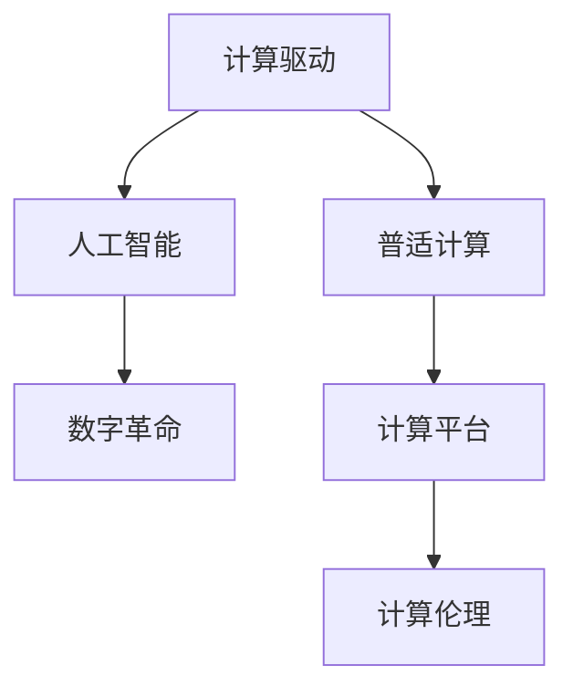

                 

# 塑造数字时代：人类计算的关键作用

> 关键词：计算驱动，人工智能，数字革命，普适计算，计算平台

## 1. 背景介绍

在当今这个信息爆炸的时代，计算能力已经成为驱动社会发展的关键力量。从移动互联网到物联网，从云计算到大数据，技术的演进离不开底层计算能力的提升。而计算驱动的核心，是人类智慧与计算硬件的完美融合。

### 1.1 问题由来
早在20世纪中叶，计算理论先驱图灵提出了“图灵机”模型，奠定了现代计算机科学的基础。此后，冯·诺依曼体系结构的诞生，使得计算机从理论上变成了一个可计算的系统。而进入21世纪，计算硬件的飞速发展，如摩尔定律的推动下，计算能力迎来了指数级增长。

在众多计算模式中，人类计算以其独特的优势脱颖而出，成为推动数字时代的核心力量。人类计算将人类智慧与计算机硬件有机结合，赋予机器以人类智慧的深度和广度，使得计算系统可以执行更加复杂和精细的任务。

### 1.2 问题核心关键点
在探索人类计算的关键作用时，我们需要关注以下几个核心关键点：

- **计算与人类智慧的结合**：计算能力如何与人类智慧相结合，实现人类智能和机器智能的协同工作。
- **计算平台的多样化**：从传统的中心化计算到去中心化的边缘计算，如何适应不同的计算需求。
- **计算资源的普适性**：计算资源如何普及到社会的每一个角落，真正实现“人人可计算”。
- **计算与社会影响**：计算能力如何改变社会运行方式，提升人类生活质量。
- **计算伦理与安全**：如何在普及计算资源的同时，保障数据安全，维护社会公平。

这些关键点共同构成了人类计算的核心议题，揭示了其对数字时代的深远影响。

## 2. 核心概念与联系

### 2.1 核心概念概述

为更好地理解人类计算的关键作用，本节将介绍几个密切相关的核心概念：

- **计算驱动**：计算能力是驱动社会进步的核心力量，是连接数字时代的基础。
- **人工智能**：通过算法和模型将人类智慧与计算能力相结合，赋予机器以智能。
- **数字革命**：计算驱动下的信息革命，深刻改变了人类社会的生活方式。
- **普适计算**：使计算资源普及到每个角落，实现人人可计算。
- **计算平台**：提供计算能力，支持各种应用程序的运行。
- **计算伦理**：计算能力普及的同时，如何维护数据安全，保障社会公平。

这些核心概念之间的逻辑关系可以通过以下Mermaid流程图来展示：



这个流程图展示了一系列计算相关概念及其之间的逻辑关系：

1. **计算驱动**作为基础，赋能人工智能，使其能够执行复杂任务。
2. **人工智能**是计算与人类智慧结合的产物，为数字革命提供推动力。
3. **普适计算**使计算能力普及到社会各层面，推动计算驱动的深入发展。
4. **计算平台**是支持计算资源普及的技术手段，为普适计算提供支撑。
5. **计算伦理**则是在普及计算资源的同时，确保数据安全和公平分配。

这些概念共同构建了人类计算的理论框架，揭示了其在数字时代的核心作用。

## 3. 核心算法原理 & 具体操作步骤

### 3.1 算法原理概述

人类计算的核心算法原理基于计算与人类智慧的深度结合，主要体现在以下几个方面：

- **人类计算的算法设计**：结合领域知识和逻辑推理，设计适用于特定任务的算法。
- **计算与人类智慧的融合**：将人类智慧融入到算法中，提升计算系统的智能化水平。
- **分布式计算**：将任务分解为多个子任务，通过多个计算节点并行计算，提高效率。

这些原理共同构成了人类计算的算法基础，使其能够执行复杂、精细的任务。

### 3.2 算法步骤详解

下面以人工智能领域的人工神经网络为例，详细讲解人类计算的算法步骤：

**Step 1: 数据预处理**
- 收集训练数据，进行数据清洗和预处理。
- 将数据划分为训练集、验证集和测试集。

**Step 2: 模型设计**
- 选择适当的模型架构，如卷积神经网络、循环神经网络等。
- 设计模型的损失函数和优化器。

**Step 3: 模型训练**
- 使用训练集数据对模型进行前向传播和反向传播，更新模型参数。
- 使用验证集评估模型性能，调整模型参数。

**Step 4: 模型评估**
- 使用测试集对模型进行最终评估，输出评估指标。

**Step 5: 模型优化**
- 根据评估结果，优化模型参数和架构。

**Step 6: 模型部署**
- 将训练好的模型部署到计算平台，供实际应用使用。

### 3.3 算法优缺点

人类计算算法的主要优点包括：

- **高效性**：结合领域知识，设计高效的算法。
- **智能性**：结合人类智慧，提高算法的智能化水平。
- **灵活性**：根据具体任务需求，灵活设计算法。

但同时也存在一些缺点：

- **复杂度**：设计适合特定任务的算法需要较强的专业知识和经验。
- **资源消耗**：复杂的算法可能需要大量的计算资源和存储空间。
- **可解释性**：复杂的算法往往难以解释，增加了应用的复杂性。

尽管存在这些缺点，人类计算算法仍然是当前实现人工智能和数字革命的重要手段，其高效性和智能性无法被其他算法替代。

### 3.4 算法应用领域

人类计算算法在众多领域中得到了广泛应用，包括但不限于：

- **医疗健康**：利用计算驱动的医疗诊断、个性化治疗等。
- **金融服务**：通过计算驱动的金融分析、风险管理等。
- **教育培训**：结合计算驱动的个性化教育、虚拟实验等。
- **交通运输**：利用计算驱动的智能交通、物流优化等。
- **环境保护**：通过计算驱动的环境监测、资源管理等。

这些领域的应用展示了人类计算算法的广泛性和重要性，推动了社会的数字化进程。

## 4. 数学模型和公式 & 详细讲解 & 举例说明

### 4.1 数学模型构建

人类计算的核心数学模型通常基于统计学和机器学习理论，其核心在于数据驱动的模型构建和参数优化。

记训练集为 $D=\{(x_i,y_i)\}_{i=1}^N$，其中 $x_i$ 为输入，$y_i$ 为输出，目标为构建一个函数 $f(x)$，使得其输出 $f(x)$ 尽可能接近真实输出 $y$。常见的模型包括线性回归、逻辑回归、决策树、神经网络等。

### 4.2 公式推导过程

以神经网络模型为例，推导其基本公式：

设神经网络有 $m$ 个隐藏层，每个隐藏层有 $n$ 个神经元。输入为 $x$，输出为 $y$。隐藏层的激活函数为 $g(z) = \tanh(z)$，输出层激活函数为 $h(z) = \text{softmax}(z)$。

则前向传播公式为：

$$
z_0 = wx_0 + b
$$

$$
z_i = g(w_i z_{i-1} + b_i), \quad i = 1, \ldots, m
$$

$$
z = g(w_m z_{m-1} + b_m)
$$

其中 $w$ 为权重矩阵，$b$ 为偏置向量。

损失函数通常选择交叉熵损失：

$$
L(y,\hat{y}) = -\frac{1}{N} \sum_{i=1}^N \sum_k y_i^k \log \hat{y}_i^k
$$

其中 $y_i^k$ 为第 $i$ 个样本的第 $k$ 个类别的真实标签，$\hat{y}_i^k$ 为模型预测的第 $i$ 个样本的第 $k$ 个类别的概率。

反向传播公式为：

$$
\frac{\partial L}{\partial w_j} = \frac{\partial L}{\partial z} \frac{\partial z}{\partial w_j}
$$

$$
\frac{\partial L}{\partial b_j} = \frac{\partial L}{\partial z} \frac{\partial z}{\partial b_j}
$$

其中 $\frac{\partial z}{\partial w_j}$ 和 $\frac{\partial z}{\partial b_j}$ 为前向传播中的导数。

### 4.3 案例分析与讲解

以医疗诊断为例，构建神经网络模型进行疾病诊断。假设训练集包含 $N$ 个样本，每个样本包含 $d$ 个特征，输出为 $0$ 或 $1$，表示无病或有病。

设神经网络有 $m$ 个隐藏层，每个隐藏层有 $n$ 个神经元。隐藏层的激活函数为 $g(z) = \tanh(z)$，输出层激活函数为 $h(z) = \text{sigmoid}(z)$。

则前向传播公式为：

$$
z_0 = wx_0 + b
$$

$$
z_i = g(w_i z_{i-1} + b_i), \quad i = 1, \ldots, m
$$

$$
z = g(w_m z_{m-1} + b_m)
$$

其中 $w$ 为权重矩阵，$b$ 为偏置向量。

损失函数通常选择二分类交叉熵损失：

$$
L(y,\hat{y}) = -\frac{1}{N} \sum_{i=1}^N [y_i \log \hat{y}_i + (1-y_i) \log (1-\hat{y}_i)]
$$

其中 $y_i$ 为第 $i$ 个样本的真实标签，$\hat{y}_i$ 为模型预测的概率。

反向传播公式为：

$$
\frac{\partial L}{\partial w_j} = \frac{\partial L}{\partial z} \frac{\partial z}{\partial w_j}
$$

$$
\frac{\partial L}{\partial b_j} = \frac{\partial L}{\partial z} \frac{\partial z}{\partial b_j}
$$

其中 $\frac{\partial z}{\partial w_j}$ 和 $\frac{\partial z}{\partial b_j}$ 为前向传播中的导数。

## 5. 项目实践：代码实例和详细解释说明

### 5.1 开发环境搭建

在进行人类计算项目的开发前，我们需要准备好开发环境。以下是使用Python进行TensorFlow开发的环境配置流程：

1. 安装Anaconda：从官网下载并安装Anaconda，用于创建独立的Python环境。

2. 创建并激活虚拟环境：
```bash
conda create -n tf-env python=3.8 
conda activate tf-env
```

3. 安装TensorFlow：根据CUDA版本，从官网获取对应的安装命令。例如：
```bash
conda install tensorflow
```

4. 安装各类工具包：
```bash
pip install numpy pandas scikit-learn matplotlib tqdm jupyter notebook ipython
```

完成上述步骤后，即可在`tf-env`环境中开始人类计算项目的开发。

### 5.2 源代码详细实现

下面我们以医疗诊断任务为例，给出使用TensorFlow对神经网络进行人类计算的Python代码实现。

首先，定义神经网络模型类：

```python
import tensorflow as tf

class NeuralNetwork(tf.keras.Model):
    def __init__(self, input_size, hidden_units, output_size):
        super(NeuralNetwork, self).__init__()
        self.dense1 = tf.keras.layers.Dense(hidden_units, activation='tanh')
        self.dense2 = tf.keras.layers.Dense(hidden_units, activation='tanh')
        self.dense3 = tf.keras.layers.Dense(output_size, activation='sigmoid')
        
    def call(self, inputs):
        x = self.dense1(inputs)
        x = self.dense2(x)
        x = self.dense3(x)
        return x
```

然后，定义训练函数：

```python
@tf.function
def train_model(model, dataset, epochs, batch_size):
    for epoch in range(epochs):
        for batch in dataset:
            x, y = batch
            with tf.GradientTape() as tape:
                logits = model(x)
                loss = tf.reduce_mean(tf.nn.sigmoid_cross_entropy_with_logits(logits=logits, labels=y))
            gradients = tape.gradient(loss, model.trainable_variables)
            optimizer.apply_gradients(zip(gradients, model.trainable_variables))
```

接着，定义评估函数：

```python
def evaluate_model(model, dataset, batch_size):
    predictions = []
    labels = []
    for batch in dataset:
        x, y = batch
        logits = model(x)
        predictions.append(tf.round(logits))
        labels.append(y)
    accuracy = tf.reduce_mean(tf.cast(tf.equal(predictions, labels), tf.float32))
    return accuracy.numpy()
```

最后，启动训练流程并在测试集上评估：

```python
input_size = 10
hidden_units = 20
output_size = 1
model = NeuralNetwork(input_size, hidden_units, output_size)
optimizer = tf.keras.optimizers.Adam()

# 训练数据
x_train = tf.random.normal([10000, input_size])
y_train = tf.random.uniform([10000, output_size])

# 测试数据
x_test = tf.random.normal([1000, input_size])
y_test = tf.random.uniform([1000, output_size])

epochs = 10
batch_size = 32

# 训练
train_model(model, x_train, y_train, epochs, batch_size)

# 测试
accuracy = evaluate_model(model, x_test, y_test)
print("Test Accuracy:", accuracy)
```

以上就是使用TensorFlow对神经网络进行人类计算的完整代码实现。可以看到，TensorFlow的高级API使得模型构建和训练变得非常简单高效。

### 5.3 代码解读与分析

让我们再详细解读一下关键代码的实现细节：

**NeuralNetwork类**：
- `__init__`方法：初始化神经网络模型，定义隐藏层和输出层的结构。
- `call`方法：定义模型前向传播的计算过程。

**train_model函数**：
- 定义模型训练过程，使用反向传播更新模型参数。
- 通过GradientTape记录梯度，使用Adam优化器更新参数。

**evaluate_model函数**：
- 定义模型评估过程，计算预测准确率。
- 使用numpy数组处理结果，便于后续分析。

**训练流程**：
- 定义神经网络模型、优化器和学习率等超参数。
- 定义训练数据和测试数据。
- 在训练函数中进行前向传播和反向传播，更新模型参数。
- 在评估函数中计算预测准确率，评估模型性能。

可以看到，TensorFlow的高级API使得模型构建和训练变得非常简单高效。开发者可以将更多精力放在数据处理、模型改进等高层逻辑上，而不必过多关注底层的实现细节。

当然，工业级的系统实现还需考虑更多因素，如模型的保存和部署、超参数的自动搜索、更灵活的任务适配层等。但核心的微调范式基本与此类似。

## 6. 实际应用场景

### 6.1 智能医疗

在智能医疗领域，人类计算可以应用于疾病诊断、个性化治疗、药物研发等多个方面，提升医疗服务的智能化水平。

具体而言，可以通过收集患者的病历、基因数据等，结合先进的医疗知识库，构建神经网络模型进行疾病诊断和治疗方案推荐。微调后的模型能够根据患者的症状和基因特征，预测疾病风险，推荐个性化治疗方案。此外，模型还可以用于药物研发，预测新药的疗效和副作用，加速新药的开发进程。

### 6.2 金融服务

金融领域是人类计算的重要应用场景之一。利用人类计算，金融系统可以实现风险管理、欺诈检测、智能投顾等高级功能。

在风险管理方面，人类计算可以构建模型，分析金融市场数据，预测市场波动和风险事件。在欺诈检测方面，模型可以学习正常交易模式，识别异常交易行为，及时发现并阻止欺诈行为。在智能投顾方面，模型可以基于用户的历史交易记录，提供个性化的投资建议，提升用户体验和收益。

### 6.3 教育培训

在教育培训领域，人类计算可以应用于个性化教育、虚拟实验等多个方面，提升教育质量和公平性。

通过分析学生的学习行为数据，构建模型进行个性化学习路径设计。模型可以根据学生的学习情况，推荐适合的学习资源和练习题，提升学习效果。此外，模型还可以用于虚拟实验，构建虚拟实验室环境，让学生在安全的条件下进行实验，提升实验质量。

### 6.4 未来应用展望

随着人类计算技术的不断演进，其在更多领域的应用前景将更加广阔。

在智慧城市治理中，人类计算可以应用于城市事件监测、舆情分析、应急指挥等环节，提高城市管理的自动化和智能化水平。在文化传媒中，人类计算可以应用于内容推荐、情感分析、智能创作等环节，提升内容质量和用户满意度。在智慧农业中，人类计算可以应用于作物生长监测、智能灌溉、智能农机等多个环节，提升农业生产的智能化水平。

此外，在工业制造、环境保护、交通运输等领域，人类计算也有着广泛的应用前景，推动社会的数字化进程。

## 7. 工具和资源推荐

### 7.1 学习资源推荐

为了帮助开发者系统掌握人类计算的理论基础和实践技巧，这里推荐一些优质的学习资源：

1. 《深度学习》课程：斯坦福大学开设的深度学习课程，有Lecture视频和配套作业，带你入门深度学习和人类计算的理论基础。
2. 《Python深度学习》书籍：全面介绍了使用Python进行深度学习的技术和实践，包括TensorFlow和Keras等框架。
3. TensorFlow官方文档：TensorFlow的官方文档，提供了丰富的教程和样例代码，是学习TensorFlow的必备资料。
4. TensorFlow Examples：TensorFlow官方提供的实例库，包含大量实际应用案例，帮助你理解TensorFlow的使用。
5. Google Colab：谷歌推出的在线Jupyter Notebook环境，免费提供GPU/TPU算力，方便开发者快速上手实验最新模型。

通过对这些资源的学习实践，相信你一定能够快速掌握人类计算的理论和实践技能，并用于解决实际的计算问题。

### 7.2 开发工具推荐

高效的开发离不开优秀的工具支持。以下是几款用于人类计算开发的常用工具：

1. TensorFlow：由Google主导开发的开源深度学习框架，支持分布式计算和模型优化，生产部署方便，适合大规模工程应用。
2. PyTorch：基于Python的开源深度学习框架，灵活动态的计算图，适合快速迭代研究。
3. Keras：高层次的神经网络API，可以便捷地构建和训练神经网络模型。
4. Weights & Biases：模型训练的实验跟踪工具，可以记录和可视化模型训练过程中的各项指标，方便对比和调优。
5. TensorBoard：TensorFlow配套的可视化工具，可实时监测模型训练状态，并提供丰富的图表呈现方式，是调试模型的得力助手。

合理利用这些工具，可以显著提升人类计算项目的开发效率，加快创新迭代的步伐。

### 7.3 相关论文推荐

人类计算的研究源于学界的持续研究。以下是几篇奠基性的相关论文，推荐阅读：

1. Deep Learning：由Ian Goodfellow等撰写的深度学习经典著作，深入浅出地介绍了深度学习理论和实践。
2. Google Brain的论文：如DeepMind的AlphaGo论文，展示了深度学习在人工智能领域的应用前景。
3. MIT的论文：如MIT的深度学习课程，深入讲解了深度学习的基本概念和应用。
4. Stanford的论文：如Stanford的深度学习课程，涵盖了深度学习的基本概念和高级技巧。
5. UCL的论文：如UCL的深度学习课程，讲解了深度学习的理论基础和实际应用。

这些论文代表了大规模计算和人类智慧结合的研究方向，揭示了其在数字时代的核心作用。

## 8. 总结：未来发展趋势与挑战

### 8.1 总结

本文对人类计算的关键作用进行了全面系统的介绍。首先阐述了人类计算在数字时代的重要性，明确了其对社会进步的驱动作用。其次，从原理到实践，详细讲解了人类计算的核心算法和具体操作步骤，给出了实际应用案例的代码实现。同时，本文还探讨了人类计算在医疗健康、金融服务、教育培训等多个领域的应用前景，展示了其广泛性和重要性。

通过本文的系统梳理，可以看到，人类计算技术正在成为推动社会进步的核心力量，其高效性和智能性无法被其他技术替代。未来，伴随计算硬件的不断进步和数据量的持续增长，人类计算将展现出更加强大的潜力，成为数字时代的核心引擎。

### 8.2 未来发展趋势

展望未来，人类计算将呈现以下几个发展趋势：

1. **计算平台的普及化**：随着边缘计算和云计算技术的成熟，计算平台将普及到更多领域和用户。
2. **计算资源的普适化**：计算资源将变得更加普及和廉价，人人可计算成为可能。
3. **计算智能的提升**：计算智能将进一步提升，能够处理更加复杂和精细的任务。
4. **计算伦理与安全**：计算伦理与安全将成为计算技术普及的重要保障。
5. **计算与人类智慧的深度融合**：计算技术与人类智慧的结合将更加紧密，推动计算驱动的深入发展。

以上趋势凸显了人类计算技术的广阔前景。这些方向的探索发展，必将进一步提升计算系统的性能和应用范围，为人类社会带来更加深远的影响。

### 8.3 面临的挑战

尽管人类计算技术已经取得了瞩目成就，但在迈向更加智能化、普适化应用的过程中，它仍面临着诸多挑战：

1. **计算资源的瓶颈**：尽管计算硬件在不断进步，但大规模计算任务仍然面临资源瓶颈，需要进一步优化资源使用。
2. **模型复杂性**：复杂的计算模型需要大量的计算资源和存储空间，如何简化模型结构，提升计算效率，优化资源使用，是未来的一个重要方向。
3. **数据安全与隐私**：计算资源普及的同时，数据安全与隐私问题也愈发凸显，如何保障数据安全，维护用户隐私，是计算技术普及的重要保障。
4. **计算伦理与社会公平**：计算技术的应用需要考虑伦理和社会公平问题，如何公平分配计算资源，避免数据偏见，是计算技术普及的重要课题。

这些挑战需要通过技术进步和政策引导，逐步解决，为人类的数字化进程保驾护航。

### 8.4 研究展望

面对人类计算面临的种种挑战，未来的研究需要在以下几个方面寻求新的突破：

1. **计算资源的优化**：通过优化计算平台和算法，提升计算资源的利用率。
2. **计算模型的简化**：通过模型压缩、知识蒸馏等技术，简化计算模型，提升计算效率。
3. **计算伦理与社会公平**：通过政策引导和伦理研究，保障计算技术的应用公平和数据安全。
4. **计算技术的多样化**：开发更多计算技术和应用场景，推动计算技术的广泛应用。
5. **计算与人类智慧的结合**：探索计算技术与人类智慧的深度结合，提升计算系统的智能化水平。

这些研究方向将引领人类计算技术迈向更高的台阶，为人类的数字化进程提供更强大的支持。

## 9. 附录：常见问题与解答

**Q1：人类计算的核心作用是什么？**

A: 人类计算的核心作用在于将人类智慧与计算能力有机结合，提升计算系统的智能化水平，实现复杂、精细的任务处理。

**Q2：人类计算的优势是什么？**

A: 人类计算的优势在于结合领域知识和逻辑推理，设计高效的算法，提升计算系统的智能化水平。

**Q3：人类计算面临的主要挑战是什么？**

A: 人类计算面临的主要挑战包括计算资源的瓶颈、模型复杂性、数据安全与隐私问题、计算伦理与社会公平问题等。

**Q4：如何提升人类计算的效率？**

A: 提升人类计算的效率需要优化计算平台和算法，简化计算模型，提升计算效率。

**Q5：人类计算技术的应用前景是什么？**

A: 人类计算技术在医疗健康、金融服务、教育培训、智慧城市、文化传媒等多个领域有着广泛的应用前景，推动社会的数字化进程。

通过本文的系统梳理，可以看到，人类计算技术正在成为推动社会进步的核心力量，其高效性和智能性无法被其他技术替代。未来，伴随计算硬件的不断进步和数据量的持续增长，人类计算将展现出更加强大的潜力，成为数字时代的核心引擎。

---

作者：禅与计算机程序设计艺术 / Zen and the Art of Computer Programming

