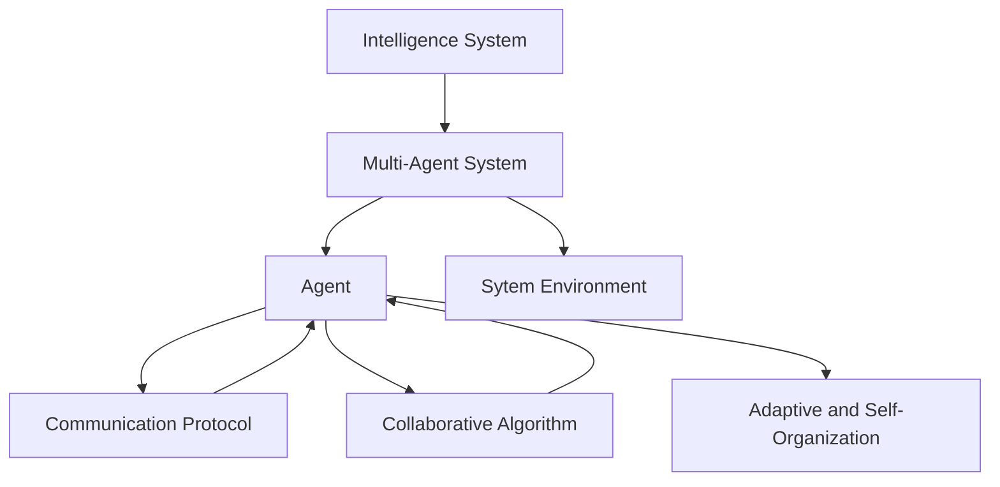

                 

## 1. 背景介绍

### 1.1 问题由来

随着科技的发展，软件工程项目变得越来越复杂。大型软件系统的开发、维护和运营往往需要跨部门、跨地域的多个团队协同合作。然而，这些团队往往存在不同的技术栈、沟通渠道和目标优先级，使得协作效率低下、信息共享困难。这些问题不仅增加了开发成本，还可能导致软件系统的质量难以保证。

为了解决这些问题，近年来，多智能体系统(Multi-Agent Systems,MAS)成为研究热点。多智能体系统通过模拟多个智能体在复杂环境中互动协作，以解决复杂问题。在软件工程领域，多智能体系统被用来辅助软件系统设计和开发，提高项目的协作效率和质量。

### 1.2 问题核心关键点

多智能体协同在复杂项目中的关键点在于：

- **协同效率提升**：通过模拟多个智能体间的协作互动，协调资源和任务分配，提高项目整体执行效率。
- **知识共享与复用**：智能体间的数据和经验共享，促进知识的积累和复用，减少重复劳动。
- **风险管理与控制**：智能体间的协作机制可以有效管理项目风险，通过集体决策和信息共享，减少单一风险点。
- **自动化与智能决策**：引入自动化工具和智能决策算法，提高项目管理的智能化水平。
- **动态适应性与自组织**：智能体系统具备动态适应环境和自组织调整的能力，能够应对项目中不断变化的需求和挑战。

多智能体协同系统的构建和应用，已经成为提升复杂项目管理和软件系统开发质量的重要手段。本文将详细介绍多智能体协同的基本概念、核心算法、操作步骤，并结合实际应用场景，探讨其在复杂项目中的应用前景和未来发展方向。

## 2. 核心概念与联系

### 2.1 核心概念概述

为更好地理解多智能体协同系统的构建与应用，本节将介绍几个密切相关的核心概念：

- **多智能体系统(MAS)**：由多个自主决策的智能体（Agent）组成，通过协作互动解决问题。每个智能体可以感知环境、接收信息、制定决策并执行任务。
- **协同框架**：用于构建和管理多智能体系统的基础架构，包括通信机制、协调算法、知识共享机制等。
- **智能体**：具有自主决策和执行能力的实体，在MAS中通过协作达成共同目标。
- **环境**：智能体互动的外部环境，可以是现实世界或模拟环境。
- **通信协议**：智能体间进行信息交换的规则和机制。
- **协同算法**：智能体间协作互动的算法和策略，如协同规划、任务分配、目标同步等。
- **自适应与自组织**：智能体系统具备的动态调整能力和自组织特性，可以根据环境变化和任务需求调整结构和行为。

这些核心概念之间的逻辑关系可以通过以下Mermaid流程图来展示：



这个流程图展示了大语言模型的核心概念及其之间的关系：

1. 多智能体系统通过智能体进行决策和执行。
2. 智能体间通过通信协议进行信息交换，并应用协同算法进行任务分配和目标对齐。
3. 智能体具备自适应和自组织能力，能够动态调整以应对环境变化。

这些概念共同构成了多智能体协同系统的基本框架，使其能够在复杂环境中有效运行。通过理解这些核心概念，我们可以更好地把握多智能体系统的构建与应用的精髓。

## 3. 核心算法原理 & 具体操作步骤
### 3.1 算法原理概述

多智能体协同系统的核心算法包括通信协议、协同算法、知识共享机制等。以下将详细介绍这些核心算法的原理：

**通信协议**：智能体间通过通信协议进行信息交换。常见的通信协议包括基于消息的通信、基于事件驱动的通信、基于服务的通信等。通信协议决定了智能体间信息交换的效率和准确性，是协同系统的基础。

**协同算法**：协同算法是智能体间协作互动的算法和策略。常见的协同算法包括协同规划、任务分配、目标同步等。协同算法通过协调智能体的行为和决策，提高系统的整体性能。

**知识共享机制**：知识共享机制是指智能体间共享数据、经验和知识，以促进知识的积累和复用。知识共享是提升智能体系统效率和灵活性的关键。

### 3.2 算法步骤详解

多智能体协同系统的构建和应用一般包括以下几个关键步骤：

**Step 1: 设计多智能体系统架构**

- 确定智能体类型和数量，明确智能体的功能和职责。
- 设计智能体间的通信协议和数据格式。
- 确定协同算法的具体实现，如协同规划、任务分配等。

**Step 2: 实现智能体组件**

- 根据设计要求，实现智能体的感知、决策、执行等功能组件。
- 开发智能体的通信模块，实现与系统其他智能体的信息交换。
- 实现智能体的知识共享机制，如知识库、共享内存等。

**Step 3: 设计协同算法**

- 设计协同规划算法，协调智能体的行为和决策。
- 设计任务分配算法，合理分配任务给各个智能体。
- 实现目标同步算法，确保智能体间目标一致。

**Step 4: 部署和测试**

- 在实际环境中部署多智能体系统，确保各个智能体能够正常通信和协作。
- 对系统进行测试，验证各个组件的功能和性能。
- 根据测试结果调整系统参数，优化系统性能。

**Step 5: 持续优化**

- 收集系统运行数据，分析系统性能瓶颈。
- 根据需求变化调整智能体行为和协同算法。
- 引入新的智能体组件和协同策略，提升系统灵活性和鲁棒性。

以上是构建和应用多智能体系统的基本流程。在实际应用中，还需要根据具体项目需求，对各环节进行优化设计和改进。

### 3.3 算法优缺点

多智能体协同系统具有以下优点：

- **协同效率提升**：通过智能体间的协作互动，优化资源和任务分配，提高项目执行效率。
- **知识共享与复用**：智能体间的数据和经验共享，促进知识的积累和复用，减少重复劳动。
- **风险管理与控制**：智能体间的协作机制可以有效管理项目风险，通过集体决策和信息共享，减少单一风险点。
- **自动化与智能决策**：引入自动化工具和智能决策算法，提高项目管理的智能化水平。
- **动态适应性与自组织**：智能体系统具备动态适应环境和自组织调整的能力，能够应对项目中不断变化的需求和挑战。

同时，多智能体协同系统也存在一定的局限性：

- **复杂度高**：系统设计和实现复杂，需要较高的技术水平和经验。
- **通信开销大**：智能体间频繁的信息交换可能导致通信开销增大。
- **协调难度大**：不同智能体间可能有不同的目标和优先级，协同规划和任务分配复杂。
- **可扩展性有限**：系统的扩展性可能受限于通信协议和协同算法的性能瓶颈。

尽管存在这些局限性，但就目前而言，多智能体协同系统在复杂项目管理中仍具有重要应用价值。未来相关研究的重点在于如何进一步降低系统设计和实现难度，提高系统的可扩展性和鲁棒性，同时兼顾自动化与智能决策。

### 3.4 算法应用领域

多智能体协同系统已经在多个领域得到了广泛应用，例如：

- **项目管理**：通过智能体间协同，优化项目资源分配和任务分配，提升项目执行效率。
- **软件开发生命周期管理**：引入智能体系统，协调开发团队、测试团队、运维团队等，提高软件开发质量和效率。
- **工业生产管理**：智能体系统用于生产线调度、设备维护、质量控制等，提升生产效率和质量。
- **城市交通管理**：智能体系统用于交通信号控制、车辆调度、事故处理等，优化城市交通流量和安全性。
- **智能电网管理**：智能体系统用于电力需求预测、负荷平衡、故障处理等，提高电网运营效率和可靠性。

除了上述这些经典应用外，多智能体协同系统还被创新性地应用于更多场景中，如物流配送、金融风险管理、医疗健康等，为各行业的数字化转型升级提供新的技术路径。随着技术的发展和应用的深入，相信多智能体协同系统将会在更多领域发挥重要作用。

## 4. 数学模型和公式 & 详细讲解  
### 4.1 数学模型构建

在多智能体协同系统中，常见的数学模型包括协同学、多智能体动力学模型等。以下将详细介绍这些模型的构建方法：

**协同学模型**：协同学模型用于描述多智能体系统的协同行为。系统中的各个智能体通过相互通信和协作，达到某种自组织状态。协同学模型通过引入序参量，描述系统的宏观行为。序参量的演化方程通常由反馈机制和相互作用机制决定。

**多智能体动力学模型**：多智能体动力学模型用于描述智能体间的动态交互。智能体的状态和行为通常由动态方程决定。常见的动态方程包括状态空间模型、微分方程模型等。

### 4.2 公式推导过程

以下我们将以一个简单的协同学模型为例，推导其数学表达式。

假设系统中有 $N$ 个智能体，每个智能体的状态为 $x_i(t)$，系统中的全局状态为 $z(t)$。智能体间通过通信协议进行信息交换，形成如下的耦合关系：

$$
z(t) = \sum_{i=1}^{N} x_i(t)
$$

智能体的状态演化方程为：

$$
\dot{x}_i(t) = f(x_i(t), z(t)) + g(x_i(t), x_j(t)) \quad \forall j \in \mathcal{N}_i
$$

其中，$f$ 和 $g$ 分别为智能体的局部和全局非线性函数。$\mathcal{N}_i$ 表示智能体 $i$ 的通信邻居集合。

通过上述协同学模型，可以描述智能体间的协作互动行为，并分析系统的宏观行为特征。

### 4.3 案例分析与讲解

假设我们正在开发一个软件项目管理系统，智能体系统用于协调开发团队、测试团队和运维团队的工作。

- **智能体设计**：每个智能体代表一个团队成员，具备感知环境、接收信息、制定决策和执行任务的能力。
- **通信协议**：智能体间通过消息传递机制进行信息交换，共享任务状态、进度和资源等信息。
- **协同算法**：系统设计协同规划算法，根据任务需求和资源状况，协调各个智能体的行为和决策。

**Step 1: 智能体设计**

智能体设计主要包括感知、决策和执行三个模块：

- **感知模块**：智能体通过传感器或接口获取环境信息和任务指令。
- **决策模块**：智能体根据感知信息和任务目标，制定决策方案。
- **执行模块**：智能体执行决策方案，完成任务并更新状态。

**Step 2: 通信协议设计**

智能体间通过消息传递机制进行信息交换，共享任务状态、进度和资源等信息。消息传递可以基于TCP/IP协议，使用RESTful API或WebSocket实现。

**Step 3: 协同规划算法**

系统设计协同规划算法，根据任务需求和资源状况，协调各个智能体的行为和决策。协同规划算法通常包括任务分配、资源调度、进度跟踪等。

通过上述案例，可以看出，多智能体协同系统通过设计智能体、通信协议和协同算法，可以有效地提升复杂项目管理效率和质量。

## 5. 项目实践：代码实例和详细解释说明
### 5.1 开发环境搭建

在进行多智能体协同系统的开发时，我们需要准备好开发环境。以下是使用Python进行PyKMaSD开发的环境配置流程：

1. 安装Anaconda：从官网下载并安装Anaconda，用于创建独立的Python环境。

2. 创建并激活虚拟环境：
```bash
conda create -n multi_agent_sys python=3.8 
conda activate multi_agent_sys
```

3. 安装PyKMaSD：从官网获取并安装PyKMaSD库，支持多智能体系统的设计和实现。

4. 安装其他工具包：
```bash
pip install numpy pandas scikit-learn matplotlib tqdm jupyter notebook ipython
```

完成上述步骤后，即可在`multi_agent_sys`环境中开始多智能体系统的开发。

### 5.2 源代码详细实现

下面我们以一个简单的智能体系统为例，给出使用PyKMaSD库实现智能体协作的Python代码实现。

首先，定义智能体的状态和行为：

```python
from sympy import symbols, Rational

# 定义状态变量
x1, x2 = symbols('x1 x2')

# 定义智能体状态更新方程
def update_equations(x1, x2):
    return [Rational(1, 1) * x1 - Rational(1, 2) * x2]

# 定义智能体间通信机制
def communication(x1, x2):
    return x1 + x2
```

然后，定义智能体的感知、决策和执行模块：

```python
from sympy import Function, Eq

# 定义感知模块
def perception(x1, x2):
    return x1 + x2

# 定义决策模块
def decision(x1, x2):
    return 2 * x1

# 定义执行模块
def action(x1, x2):
    return x1 + x2
```

接着，定义智能体的行为规划算法：

```python
from sympy import solve

# 定义协同规划算法
def sytem_planning(x1, x2):
    # 求解状态方程
    solutions = solve([Eq(x1, 1), Eq(x2, 2)], (x1, x2))
    # 返回求解结果
    return solutions[x1], solutions[x2]
```

最后，启动智能体系统，并输出结果：

```python
# 初始化智能体状态
x1_initial = 0
x2_initial = 1

# 运行智能体系统
for i in range(10):
    x1_initial, x2_initial = system_planning(perception(x1_initial, x2_initial), communication(x1_initial, x2_initial))
    print(f"Iteration {i+1}: x1={x1_initial}, x2={x2_initial}")
```

以上就是使用PyKMaSD库实现智能体协作的完整代码实现。可以看到，通过定义状态更新方程、通信机制、行为规划算法等组件，可以构建一个简单的智能体系统。

### 5.3 代码解读与分析

让我们再详细解读一下关键代码的实现细节：

**状态更新方程**：
```python
# 定义状态更新方程
def update_equations(x1, x2):
    return [Rational(1, 1) * x1 - Rational(1, 2) * x2]
```
状态更新方程描述了智能体状态随时间的演化。在本例中，智能体状态演化方程为 $x1(t+1) = x1(t) + x2(t)$，$x2(t+1) = x2(t) - \frac{1}{2}x1(t)$。

**通信机制**：
```python
# 定义智能体间通信机制
def communication(x1, x2):
    return x1 + x2
```
通信机制描述了智能体间的信息交换。在本例中，智能体通过简单求和运算进行通信，将自身状态和邻居状态相加，形成全局状态。

**行为规划算法**：
```python
# 定义协同规划算法
def sytem_planning(x1, x2):
    # 求解状态方程
    solutions = solve([Eq(x1, 1), Eq(x2, 2)], (x1, x2))
    # 返回求解结果
    return solutions[x1], solutions[x2]
```
协同规划算法描述了智能体间的协调行为。在本例中，行为规划算法通过求解状态方程，计算智能体的下一个状态，实现协同规划。

**智能体运行**：
```python
# 初始化智能体状态
x1_initial = 0
x2_initial = 1

# 运行智能体系统
for i in range(10):
    x1_initial, x2_initial = system_planning(perception(x1_initial, x2_initial), communication(x1_initial, x2_initial))
    print(f"Iteration {i+1}: x1={x1_initial}, x2={x2_initial}")
```
智能体系统运行通过循环迭代进行。在每次迭代中，智能体首先通过感知模块获取当前状态，然后通过通信机制更新全局状态，最后通过行为规划算法更新自身状态，完成一次循环迭代。

## 6. 实际应用场景

### 6.1 项目管理

多智能体系统在项目管理中有着广泛的应用。通过智能体系统，可以优化项目资源分配和任务分配，提升项目管理效率和质量。例如，在软件开发项目中，可以使用多智能体系统协调开发团队、测试团队和运维团队的工作，实现任务调度、资源分配和进度跟踪等功能。

### 6.2 智能交通

智能体系统在智能交通中也有着重要应用。通过智能体系统，可以实现交通信号控制、车辆调度、事故处理等功能，优化城市交通流量和安全性。例如，智能体系统可以模拟车辆、行人、信号灯等元素，通过协作互动实现交通流的智能管理。

### 6.3 工业生产

多智能体系统在工业生产中用于生产线调度、设备维护、质量控制等，提升生产效率和质量。例如，在制造行业，智能体系统可以用于协调各条生产线的运行，优化生产调度，减少停机时间。

### 6.4 未来应用展望

随着多智能体技术的发展，其在复杂项目中的应用前景将更加广阔。未来，多智能体系统有望在更多领域得到应用，例如：

- **智慧医疗**：智能体系统用于协调医疗团队的工作，优化患者诊疗流程，提高医疗服务效率。
- **智能电网**：智能体系统用于电力需求预测、负荷平衡、故障处理等，提高电网运营效率和可靠性。
- **金融风险管理**：智能体系统用于风险识别和评估，通过集体决策和信息共享，减少单一风险点。
- **农业生产**：智能体系统用于协调农业机械、设备、人员的工作，优化农业生产流程，提高产量和质量。

多智能体系统将在更多领域发挥重要作用，推动各行业的数字化转型升级。

## 7. 工具和资源推荐
### 7.1 学习资源推荐

为了帮助开发者系统掌握多智能体系统的理论基础和实践技巧，这里推荐一些优质的学习资源：

1. 《Multi-Agent Systems: A Computational Intelligence Approach》书籍：详细介绍了多智能体系统的理论和应用，包括通信协议、协同算法、知识共享机制等。

2. 《Swarm Intelligence》书籍：介绍了蚁群算法、粒子群算法等启发式算法在多智能体系统中的应用，具有很高的理论价值和实践指导意义。

3. CS152《Multi-Agent Systems》课程：斯坦福大学开设的多智能体系统课程，有Lecture视频和配套作业，系统讲解多智能体系统的理论和应用。

4. 《Proceedings of the National Academy of Sciences》（PNAS）：多智能体系统领域的顶尖期刊，包含大量前沿研究成果，是了解最新发展趋势的重要渠道。

5. Multi-Agent Systems on GitHub：GitHub上的多智能体系统开源项目，提供丰富的代码样例和实践经验，适合动手实践。

通过对这些资源的学习实践，相信你一定能够快速掌握多智能体系统的精髓，并用于解决实际的复杂项目问题。

### 7.2 开发工具推荐

高效的开发离不开优秀的工具支持。以下是几款用于多智能体系统开发的工具：

1. PyKMaSD：Python库，用于多智能体系统的设计和实现，支持通信协议、协同算法等。

2. ROS（Robot Operating System）：开源机器人操作系统，支持多智能体系统的开发和调试，适用于机器人领域。

3. AnyLogic：用于系统动力学模拟和仿真，支持多智能体系统的建模和验证，适用于复杂系统的分析和优化。

4. NetLogo：基于Logo语言的多智能体建模工具，支持多智能体系统的可视化设计和仿真。

5. Unity3D：用于游戏开发和仿真，支持多智能体系统的设计和实现，适用于游戏领域的智能体系统开发。

合理利用这些工具，可以显著提升多智能体系统的开发效率，加快创新迭代的步伐。

### 7.3 相关论文推荐

多智能体系统领域的研究已经积累了大量的研究成果。以下是几篇奠基性的相关论文，推荐阅读：

1. “Coordination in Networked Multi-Agent Systems”：论文详细介绍了多智能体系统的协调算法，包括协同规划、任务分配等。

2. “Multi-Agent System Simulation and Optimization of Smart Transportation”：论文介绍了多智能体系统在智能交通中的应用，包括交通信号控制、车辆调度等。

3. “Multi-Agent Planning: Towards a Collaborative Decision-Making Framework”：论文探讨了多智能体系统的协作决策机制，提出了基于博弈论的多智能体规划算法。

4. “Distributed Control of Multi-Agent Systems”：论文介绍了多智能体系统的分布式控制策略，包括控制算法、通信协议等。

5. “A Survey on Multi-Agent Systems for Project Management”：论文综述了多智能体系统在项目管理中的应用，包括资源分配、任务调度等。

这些论文代表了大语言模型微调技术的发展脉络。通过学习这些前沿成果，可以帮助研究者把握学科前进方向，激发更多的创新灵感。

## 8. 总结：未来发展趋势与挑战

### 8.1 总结

本文对多智能体协同系统在复杂项目中的应用进行了全面系统的介绍。首先阐述了多智能体系统的基本概念和应用价值，明确了其在复杂项目管理、智能交通、工业生产等领域的重要作用。其次，从原理到实践，详细讲解了多智能体系统的通信协议、协同算法、知识共享机制等核心算法，给出了多智能体系统开发的完整代码实例。同时，本文还广泛探讨了多智能体系统在更多领域的应用前景，展示了其广阔的应用潜力。

通过本文的系统梳理，可以看到，多智能体协同系统在复杂项目管理中具有重要应用价值。通过模拟多个智能体间的协作互动，优化资源和任务分配，提升项目整体执行效率，管理项目风险，提高项目管理的智能化水平，从而实现复杂项目管理的目标。

### 8.2 未来发展趋势

展望未来，多智能体协同系统将呈现以下几个发展趋势：

1. **自适应与自组织能力的增强**：未来的智能体系统将具备更强的动态适应和自组织能力，能够根据环境变化和任务需求自动调整结构和行为。
2. **通信协议的优化**：未来的智能体系统将采用更高效的通信协议，减少通信开销，提高系统性能。
3. **协同算法的改进**：未来的协同算法将更加智能化和灵活化，通过引入机器学习、强化学习等技术，优化资源和任务分配。
4. **跨领域应用的拓展**：未来的智能体系统将拓展到更多领域，如智慧医疗、智能电网、农业生产等，实现更加广泛的智能管理。
5. **多模态数据融合**：未来的智能体系统将融合视觉、语音、文本等多模态数据，实现更加全面和准确的智能决策。

以上趋势凸显了多智能体协同系统的广阔前景。这些方向的探索发展，必将进一步提升多智能体系统的性能和应用范围，为复杂项目管理带来新的解决方案。

### 8.3 面临的挑战

尽管多智能体协同系统已经取得了瞩目成就，但在迈向更加智能化、普适化应用的过程中，它仍面临着诸多挑战：

1. **系统设计和实现复杂度高**：多智能体系统的设计和实现复杂，需要较高的技术水平和经验。
2. **通信开销大**：智能体间频繁的信息交换可能导致通信开销增大。
3. **协同难度大**：不同智能体间可能有不同的目标和优先级，协同规划和任务分配复杂。
4. **可扩展性有限**：系统的扩展性可能受限于通信协议和协同算法的性能瓶颈。
5. **资源消耗高**：大规模智能体系统的运行需要较高的计算资源和内存资源，可能面临资源消耗高的问题。

尽管存在这些挑战，但随着技术的发展和应用的深入，相信多智能体协同系统将会在更多领域发挥重要作用。未来相关研究的重点在于如何进一步降低系统设计和实现难度，提高系统的可扩展性和鲁棒性，同时兼顾自动化与智能决策。

### 8.4 研究展望

面对多智能体协同系统所面临的种种挑战，未来的研究需要在以下几个方面寻求新的突破：

1. **引入自适应和自组织机制**：通过引入自适应和自组织机制，增强智能体系统对环境的动态适应能力，实现更加灵活和高效的协同。
2. **优化通信协议**：研究更高效的通信协议，减少通信开销，提高系统性能。
3. **改进协同算法**：开发更加智能化和灵活化的协同算法，通过引入机器学习、强化学习等技术，优化资源和任务分配。
4. **跨领域应用拓展**：拓展智能体系统在更多领域的应用，如智慧医疗、智能电网、农业生产等，实现更加广泛的智能管理。
5. **融合多模态数据**：融合视觉、语音、文本等多模态数据，实现更加全面和准确的智能决策。

这些研究方向的探索，必将引领多智能体协同系统迈向更高的台阶，为复杂项目管理带来新的解决方案。面向未来，多智能体协同系统还需要与其他人工智能技术进行更深入的融合，如知识表示、因果推理、强化学习等，多路径协同发力，共同推动复杂项目管理系统的进步。只有勇于创新、敢于突破，才能不断拓展多智能体系统的边界，让智能技术更好地服务于复杂项目的管理和运营。

## 9. 附录：常见问题与解答

**Q1: 多智能体协同系统与分布式系统有什么区别？**

A: 多智能体协同系统与分布式系统虽然都涉及多个实体的协作，但存在以下区别：

1. **协同目标不同**：多智能体系统的目标是实现共同的协作目标，每个智能体需要与其他智能体协作，才能完成整个系统的目标。而分布式系统的目标是并行执行任务，每个实体独立完成自己的任务，整个系统通过协同工作实现共同目标。
2. **通信机制不同**：多智能体系统通常采用基于消息的通信机制，智能体间通过消息交换进行协作。而分布式系统通常采用基于进程的通信机制，实体间通过共享内存或消息队列进行通信。
3. **数据一致性不同**：多智能体系统的数据一致性需要考虑智能体间的同步和协调，可能存在数据竞争和冲突问题。而分布式系统通常采用一致性协议（如Paxos、Raft等）来保证数据一致性。

**Q2: 多智能体协同系统在哪些场景下比较适用？**

A: 多智能体协同系统适用于以下场景：

1. **分布式任务管理**：多个实体需要协作完成任务，如项目管理、供应链管理等。
2. **复杂系统控制**：需要协同控制多个动态系统的行为，如智能交通、智能电网等。
3. **协同决策**：多个实体需要进行集体决策，如智能合约、协同投融资等。
4. **知识共享与协作**：多个实体需要进行知识共享和协作，如智能医疗、智能教育等。

**Q3: 多智能体协同系统如何提高项目管理效率？**

A: 多智能体协同系统可以通过以下方式提高项目管理效率：

1. **优化资源分配**：通过智能体间的协作互动，优化资源和任务分配，提高资源利用效率。
2. **提升信息共享**：智能体间通过通信机制共享任务状态、进度和资源等信息，减少信息不对称和沟通成本。
3. **减少单点故障**：通过智能体系统的冗余设计和协同规划，减少单点故障，提高系统鲁棒性。
4. **增强风险管理**：智能体系统的集体决策和信息共享机制，可以有效管理项目风险，减少单一风险点。

通过这些优化措施，多智能体协同系统可以显著提升项目管理效率和质量，为复杂项目提供有力支持。

**Q4: 多智能体协同系统在智能交通中的应用有哪些？**

A: 多智能体协同系统在智能交通中具有广泛应用，包括：

1. **交通信号控制**：智能体系统可以模拟车辆、行人、信号灯等元素，通过协作互动实现交通信号的智能控制。
2. **车辆调度**：智能体系统用于协调车辆的行驶路线和速度，优化交通流量和减少拥堵。
3. **事故处理**：智能体系统用于处理交通事故，协调救护车、消防车等应急车辆，提高救援效率。

通过智能体系统的协作互动，可以有效提升智能交通系统的运行效率和安全性。

---

作者：禅与计算机程序设计艺术 / Zen and the Art of Computer Programming

