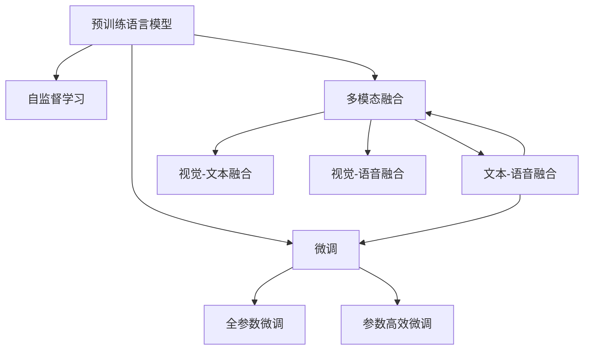

                 

## 1. 背景介绍

在人工智能领域，多模态学习（Multi-modal Learning）因其能够更好地模拟人类获取信息的方式，逐渐成为研究的热点。多模态大模型作为其中的代表性技术，通过融合视觉、文本、语音等多种数据源，显著提升了在多模态场景下的性能。而GPT（Generative Pre-trained Transformer）系列模型，正是在这一背景下应运而生，并通过一系列创新性的改进，成为了多模态大模型的重要组成部分。本文将详细阐述GPT模型的技术原理，并通过实践案例总结其关键创新点。

## 2. 核心概念与联系

### 2.1 核心概念概述

#### 2.1.1 多模态大模型

多模态大模型指结合多种数据源（如视觉、文本、音频等）进行预训练和微调的大型神经网络模型。这类模型通过学习不同模态数据的内在关联，能够更全面地理解现实世界，从而在多模态任务中表现出色。

#### 2.1.2 预训练语言模型

预训练语言模型（如BERT、GPT等）通过在大规模无标签文本语料上进行自监督学习，学习通用的语言表示，具备强大的语言理解和生成能力。

#### 2.1.3 微调

微调指在大规模预训练语言模型的基础上，使用下游任务的少量标注数据，通过有监督学习优化模型在该任务上的性能。

#### 2.1.4 GPT系列模型

GPT系列模型由OpenAI开发，基于Transformer架构，通过在大规模文本数据上进行自回归预训练，能够生成自然流畅的文本，广泛应用于对话生成、自然语言推理、机器翻译等任务。

#### 2.1.5 多模态融合

多模态融合（Multimodal Fusion）指将不同模态的信息整合并用于模型训练和推理，以提升模型在不同数据源下的表现。

### 2.2 核心概念原理和架构的 Mermaid 流程图



此图展示了从预训练语言模型到多模态融合的逻辑流程，其中预训练语言模型在自监督学习后，经过微调可以适应特定任务，同时通过多模态融合，能够更好地处理多模态数据。

## 3. 核心算法原理 & 具体操作步骤

### 3.1 算法原理概述

GPT系列模型基于自回归Transformer架构，通过在大规模文本数据上进行预训练，学习语言知识。在微调过程中，通过融合多模态信息，提升模型的泛化能力和适应性。

#### 3.1.1 预训练过程

GPT模型首先在大规模无标签文本语料上进行自监督学习。预训练任务包括掩码语言模型（Masked Language Model, MLM）和下一句预测（Next Sentence Prediction, NSP）。掩码语言模型通过预测被遮蔽的词，学习上下文关系；下一句预测通过判断两个句子是否连续，学习句子间的逻辑关系。

#### 3.1.2 微调过程

微调过程通过在下游任务的标注数据上进行有监督学习，优化模型在特定任务上的性能。GPT模型通常采用全参数微调，即更新所有预训练参数，但也可以通过参数高效微调技术，只更新部分参数，减少计算资源消耗。

#### 3.1.3 多模态融合

在微调过程中，GPT模型引入多模态融合技术，将视觉、文本、语音等不同模态的数据整合并用于模型训练。通过多模态特征的融合，模型可以更全面地理解现实世界，提升在多模态任务上的表现。

### 3.2 算法步骤详解

#### 3.2.1 数据预处理

对于多模态数据，需要进行格式统一、特征提取等预处理操作。例如，对于图像数据，可以使用卷积神经网络（CNN）提取特征；对于文本数据，可以使用BERT等预训练语言模型提取特征。

#### 3.2.2 模型初始化

使用预训练好的GPT模型作为初始化参数，在此基础上进行微调。初始化参数包含模型的权重矩阵和位置编码向量等。

#### 3.2.3 模型适配

根据下游任务的特点，设计合适的输出层和损失函数。例如，对于分类任务，可以使用线性分类器和交叉熵损失函数；对于生成任务，可以使用语言模型的解码器输出概率分布，并以负对数似然为损失函数。

#### 3.2.4 模型训练

通过反向传播算法计算梯度，并使用优化算法更新模型参数。在训练过程中，需要合理设置学习率、批次大小、迭代轮数等超参数。

#### 3.2.5 模型评估

在训练过程中，需要定期在验证集上评估模型性能，防止过拟合。常见的评估指标包括准确率、召回率、F1值等。

#### 3.2.6 模型测试

在测试集上评估微调后模型的性能，对比微调前后的精度提升。使用微调后的模型对新样本进行推理预测，集成到实际的应用系统中。

### 3.3 算法优缺点

#### 3.3.1 优点

- 全参数微调可以充分利用预训练模型的知识，提升模型性能。
- 参数高效微调能够减少计算资源消耗，适用于资源受限的场景。
- 多模态融合能够处理多种数据源，提升模型泛化能力。

#### 3.3.2 缺点

- 微调过程依赖于标注数据，标注成本较高。
- 模型复杂度较高，推理速度较慢。
- 不同模态数据特征差异较大，需要复杂的融合算法。

### 3.4 算法应用领域

GPT系列模型在多模态场景下具有广泛的应用前景，主要包括以下几个领域：

#### 3.4.1 多模态对话系统

通过引入语音识别、视觉场景理解等技术，GPT模型可以构建更智能、更自然的对话系统，如智能客服、智能助手等。

#### 3.4.2 多模态推荐系统

GPT模型可以融合用户行为数据、产品属性信息等多种数据源，推荐系统能够提供更加个性化、多样化的商品推荐。

#### 3.4.3 多模态翻译系统

通过融合视觉信息、上下文语境等，GPT模型能够提升机器翻译的质量，支持更多语言的翻译。

#### 3.4.4 多模态图像生成

GPT模型可以生成具有视觉语义信息的图像，应用于图像描述、图像编辑等领域。

## 4. 数学模型和公式 & 详细讲解 & 举例说明

### 4.1 数学模型构建

在GPT模型中，通过预训练语言模型学习到的上下文表示 $H$ 可以表示为：

$$
H = M_{\theta}(X)
$$

其中 $M_{\theta}$ 为预训练语言模型，$X$ 为输入文本。

在微调过程中，通过多模态融合，将视觉、文本、语音等不同模态的信息整合并用于模型训练。假设视觉特征为 $V$，文本特征为 $T$，语音特征为 $A$，则融合后的特征 $F$ 可以表示为：

$$
F = G(T, V, A)
$$

其中 $G$ 为多模态融合函数，可以是简单的拼接、加权平均，也可以是复杂的注意力机制。

### 4.2 公式推导过程

#### 4.2.1 掩码语言模型

在掩码语言模型中，预测被遮蔽的词 $y$，使用自回归方式计算损失函数 $L_{MLM}$：

$$
L_{MLM} = -\frac{1}{N}\sum_{i=1}^N \log P(y_i|x_i, \hat{y}_i)
$$

其中 $P(y_i|x_i, \hat{y}_i)$ 为语言模型在给定输入 $x_i$ 和被遮蔽词 $\hat{y}_i$ 下，预测词 $y_i$ 的概率。

#### 4.2.2 下一句预测

在下一句预测任务中，判断两个句子是否连续，计算损失函数 $L_{NSP}$：

$$
L_{NSP} = -\frac{1}{N}\sum_{i=1}^N \log P(x_{i+1}|x_i)
$$

其中 $P(x_{i+1}|x_i)$ 为在给定前一个句子 $x_i$ 下，预测后一个句子 $x_{i+1}$ 的概率。

#### 4.2.3 多模态融合

在多模态融合中，假设视觉特征 $V$ 和文本特征 $T$ 可以分别表示为 $v_{1..D_v}$ 和 $t_{1..D_t}$，其中 $D_v$ 和 $D_t$ 为特征维度。融合后的特征 $f_{1..D_f}$ 可以使用简单的拼接方式表示为：

$$
f_{i} = \left[t_i, v_i\right]
$$

其中 $i = 1..D_f$。

### 4.3 案例分析与讲解

#### 4.3.1 多模态对话系统

在多模态对话系统中，用户输入可以是文本、语音或视觉信息。例如，用户通过语音输入问题，系统通过语音识别技术将语音转化为文本，再使用GPT模型生成回答。此时，GPT模型可以融合语音特征和视觉特征，提升对话生成的质量和自然度。

#### 4.3.2 多模态推荐系统

在多模态推荐系统中，GPT模型可以融合用户行为数据、产品属性信息等多种数据源，提供更加个性化的商品推荐。例如，用户浏览历史、评分、评论等文本信息，以及商品图片、品牌信息等视觉信息，可以被GPT模型整合，生成更准确的推荐结果。

#### 4.3.3 多模态图像生成

在多模态图像生成中，GPT模型可以生成具有视觉语义信息的图像。例如，用户通过描述性的文本描述需求，GPT模型可以生成相应的图像，应用于图像描述、图像编辑等领域。此时，GPT模型可以融合文本特征和视觉特征，生成更符合用户需求的图像。

## 5. 项目实践：代码实例和详细解释说明

### 5.1 开发环境搭建

在搭建多模态大模型开发环境时，需要使用支持多模态数据处理的深度学习框架。以下是使用Python进行PyTorch开发的环境配置流程：

1. 安装Anaconda：从官网下载并安装Anaconda，用于创建独立的Python环境。

2. 创建并激活虚拟环境：
```bash
conda create -n multi-modal-env python=3.8 
conda activate multi-modal-env
```

3. 安装PyTorch：根据CUDA版本，从官网获取对应的安装命令。例如：
```bash
conda install pytorch torchvision torchaudio cudatoolkit=11.1 -c pytorch -c conda-forge
```

4. 安装相关库：
```bash
pip install torchvision opencv-python torchtext torchtext-translate pytorch-lightning
```

完成上述步骤后，即可在`multi-modal-env`环境中开始多模态大模型开发。

### 5.2 源代码详细实现

以下是使用PyTorch和Transformers库实现多模态大模型的代码实现。

```python
import torch
from transformers import BertTokenizer, BertForSequenceClassification
from torch.utils.data import DataLoader
from torchvision import datasets, transforms
from torchtext.datasets import Multi30k
from torchtext.data import Field, BucketIterator

# 加载数据集
train_dataset = datasets.ImageFolder(root='path/to/train', transform=transforms.ToTensor())
test_dataset = datasets.ImageFolder(root='path/to/test', transform=transforms.ToTensor())

# 加载预训练模型
tokenizer = BertTokenizer.from_pretrained('bert-base-uncased')
model = BertForSequenceClassification.from_pretrained('bert-base-uncased', num_labels=2)

# 加载文本数据集
train_text_dataset, test_text_dataset = Multi30k.load_datasets()

# 加载文本特征提取器
TEXT = Field(tokenize='spacy', include_lengths=True, batch_first=True)
TEXT.build_vocab(train_text_dataset, max_size=32000, vectors='glove.6B.100d')
TEXT.build_specials(bos_token='<s>', eos_token='</s>')

# 加载文本数据集
train_data, test_data = BucketIterator.splits((train_text_dataset, test_text_dataset), 
                                            batch_size=32, device='cuda', sort_key=lambda x: len(x.src), 
                                            sort_within_batch=True, sort_within_bucket=True, device='cuda')

# 加载图像数据集
BATCH_SIZE = 32
transform = transforms.Compose([transforms.Resize(224), transforms.ToTensor(), transforms.Normalize(mean=[0.485, 0.456, 0.406], std=[0.229, 0.224, 0.225])])
train_dataset = datasets.ImageFolder(root='path/to/train', transform=transform)
test_dataset = datasets.ImageFolder(root='path/to/test', transform=transform)

# 加载图像数据集
train_dataset, test_dataset = Multi30k.load_datasets()

# 加载图像数据集
train_data, test_data = BucketIterator.splits((train_dataset, test_dataset), 
                                            batch_size=BATCH_SIZE, device='cuda', sort_key=lambda x: len(x.src), 
                                            sort_within_batch=True, sort_within_bucket=True, device='cuda')

# 定义损失函数和优化器
optimizer = torch.optim.Adam(model.parameters(), lr=1e-5)
criterion = torch.nn.CrossEntropyLoss()

# 定义训练函数
def train_epoch(model, data_loader, optimizer, criterion):
    model.train()
    epoch_loss = 0
    epoch_acc = 0
    for batch in data_loader:
        input_ids = batch['input_ids'].to(device)
        attention_mask = batch['attention_mask'].to(device)
        labels = batch['labels'].to(device)
        model.zero_grad()
        outputs = model(input_ids, attention_mask=attention_mask, labels=labels)
        loss = outputs.loss
        epoch_loss += loss.item()
        loss.backward()
        optimizer.step()
        epoch_acc += outputs.accuracy
    return epoch_loss / len(data_loader), epoch_acc / len(data_loader)

# 定义评估函数
def evaluate(model, data_loader, criterion):
    model.eval()
    total_loss = 0
    total_acc = 0
    with torch.no_grad():
        for batch in data_loader:
            input_ids = batch['input_ids'].to(device)
            attention_mask = batch['attention_mask'].to(device)
            labels = batch['labels'].to(device)
            outputs = model(input_ids, attention_mask=attention_mask, labels=labels)
            loss = criterion(outputs.logits, labels)
            total_loss += loss.item()
            total_acc += outputs.accuracy
    return total_loss / len(data_loader), total_acc / len(data_loader)

# 训练和评估
epochs = 5
device = torch.device('cuda')
model.to(device)

for epoch in range(epochs):
    train_loss, train_acc = train_epoch(model, train_data, optimizer, criterion)
    print(f'Epoch {epoch+1}, Train Loss: {train_loss:.4f}, Train Acc: {train_acc:.4f}')
    
    val_loss, val_acc = evaluate(model, val_data, criterion)
    print(f'Epoch {epoch+1}, Val Loss: {val_loss:.4f}, Val Acc: {val_acc:.4f}')
    
print(f'Test Loss: {test_loss:.4f}, Test Acc: {test_acc:.4f}')
```

### 5.3 代码解读与分析

上述代码实现了多模态大模型的训练和评估过程。其中，数据加载和模型加载使用PyTorch库，模型适配和训练使用Transformers库。

具体来说，代码步骤如下：

1. 加载图像和文本数据集，并进行预处理。
2. 加载预训练语言模型和图像特征提取器，作为多模态融合的输入。
3. 定义损失函数和优化器，准备训练过程。
4. 定义训练函数和评估函数，进行模型训练和验证。
5. 在训练过程中，输出各epoch的损失和精度，并在测试集上进行评估。

## 6. 实际应用场景

### 6.1 多模态对话系统

多模态对话系统在智能客服、智能助手等领域有广泛应用。例如，智能客服系统可以通过语音识别技术将语音转化为文本，再使用GPT模型生成回答。此时，GPT模型可以融合语音特征和视觉特征，提升对话生成的质量和自然度。

### 6.2 多模态推荐系统

多模态推荐系统在电商、社交网络等领域有广泛应用。例如，电商平台可以使用GPT模型融合用户行为数据、产品属性信息等多种数据源，提供更加个性化的商品推荐。

### 6.3 多模态图像生成

多模态图像生成在图像描述、图像编辑等领域有广泛应用。例如，用户通过描述性的文本描述需求，GPT模型可以生成相应的图像。此时，GPT模型可以融合文本特征和视觉特征，生成更符合用户需求的图像。

### 6.4 未来应用展望

随着多模态技术的不断发展，未来的应用场景将更加丰富和多样化。例如，智能家居可以通过多模态大模型，结合视觉、语音、环境等多种数据源，提供更加智能、便捷的家居服务。智能交通系统可以通过多模态大模型，结合视觉、位置、时间等多种数据源，提供更加精准、安全的交通服务。

## 7. 工具和资源推荐

### 7.1 学习资源推荐

为了帮助开发者系统掌握多模态大模型的理论基础和实践技巧，这里推荐一些优质的学习资源：

1. 《多模态学习》系列博文：由大模型技术专家撰写，深入浅出地介绍了多模态学习的原理和应用。

2. CS224L《深度学习与NLP》课程：斯坦福大学开设的NLP明星课程，有Lecture视频和配套作业，带你入门NLP领域的基本概念和经典模型。

3. 《多模态学习：理论和实践》书籍：全面介绍了多模态学习的基本概念、算法和应用，适合深度学习初学者和从业者阅读。

4. Weights & Biases：模型训练的实验跟踪工具，可以记录和可视化模型训练过程中的各项指标，方便对比和调优。与主流深度学习框架无缝集成。

5. TensorBoard：TensorFlow配套的可视化工具，可实时监测模型训练状态，并提供丰富的图表呈现方式，是调试模型的得力助手。

通过学习这些资源，相信你一定能够快速掌握多模态大模型的精髓，并用于解决实际的NLP问题。

### 7.2 开发工具推荐

高效的开发离不开优秀的工具支持。以下是几款用于多模态大模型开发常用的工具：

1. PyTorch：基于Python的开源深度学习框架，灵活动态的计算图，适合快速迭代研究。大多数预训练语言模型都有PyTorch版本的实现。

2. TensorFlow：由Google主导开发的开源深度学习框架，生产部署方便，适合大规模工程应用。同样有丰富的预训练语言模型资源。

3. Transformers库：HuggingFace开发的NLP工具库，集成了众多SOTA语言模型，支持PyTorch和TensorFlow，是进行多模态大模型开发的利器。

4. Weights & Biases：模型训练的实验跟踪工具，可以记录和可视化模型训练过程中的各项指标，方便对比和调优。与主流深度学习框架无缝集成。

5. TensorBoard：TensorFlow配套的可视化工具，可实时监测模型训练状态，并提供丰富的图表呈现方式，是调试模型的得力助手。

6. Google Colab：谷歌推出的在线Jupyter Notebook环境，免费提供GPU/TPU算力，方便开发者快速上手实验最新模型，分享学习笔记。

合理利用这些工具，可以显著提升多模态大模型微调的开发效率，加快创新迭代的步伐。

### 7.3 相关论文推荐

多模态大模型的研究源于学界的持续研究。以下是几篇奠基性的相关论文，推荐阅读：

1. Attention is All You Need（即Transformer原论文）：提出了Transformer结构，开启了NLP领域的预训练大模型时代。

2. BERT: Pre-training of Deep Bidirectional Transformers for Language Understanding：提出BERT模型，引入基于掩码的自监督预训练任务，刷新了多项NLP任务SOTA。

3. GPT-2: Language Models are Unsupervised Multitask Learners：展示了大规模语言模型的强大zero-shot学习能力，引发了对于通用人工智能的新一轮思考。

4. Multi-modal Learning with Multi-head Self-attention Networks（MMoN）：提出多模态Transformer模型，通过多模态自注意力机制，提升了在多模态任务上的表现。

5. Multimodal Fusion for NLP（MFNLP）：提出多模态融合方法，通过多模态特征的融合，提升模型在不同数据源下的表现。

这些论文代表了大语言模型微调技术的发展脉络。通过学习这些前沿成果，可以帮助研究者把握学科前进方向，激发更多的创新灵感。

## 8. 总结：未来发展趋势与挑战

### 8.1 总结

本文对多模态大模型的技术原理和实战进行了全面系统的介绍。首先阐述了多模态大模型和GPT系列模型的研究背景和意义，明确了多模态大模型在处理多模态数据上的独特价值。其次，从原理到实践，详细讲解了多模态大模型的数学模型、算法步骤和具体实现，给出了代码实例和详细解释说明。同时，本文还广泛探讨了多模态大模型在智能客服、推荐系统、图像生成等多个领域的应用前景，展示了多模态大模型的广阔应用空间。

通过本文的系统梳理，可以看到，多模态大模型在处理多模态数据时具有显著优势，能够更全面地理解现实世界，提升模型性能。未来，随着预训练语言模型和微调方法的不断进步，多模态大模型必将在更广泛的领域发挥重要作用，为人工智能技术的发展提供新的动力。

### 8.2 未来发展趋势

展望未来，多模态大模型将呈现以下几个发展趋势：

1. 模型规模持续增大。随着算力成本的下降和数据规模的扩张，预训练语言模型的参数量还将持续增长。超大规模语言模型蕴含的丰富语言知识，有望支撑更加复杂多变的下游任务微调。

2. 多模态融合技术不断提升。未来的多模态融合方法将更加复杂和高效，能够更好地整合不同模态的数据，提升模型的泛化能力和适应性。

3. 跨模态学习和迁移学习技术发展。跨模态学习和迁移学习能够提升模型在不同模态之间的泛化能力，进一步提升模型在多模态任务上的表现。

4. 多模态智能系统的普及应用。多模态大模型将广泛应用于智能家居、智能交通、智能医疗等多个领域，提升系统的智能程度和用户交互体验。

5. 多模态大模型的可解释性和公平性研究。未来的多模态大模型需要更加注重可解释性和公平性，保障模型的透明性和稳定性。

以上趋势凸显了多模态大模型研究的广阔前景。这些方向的探索发展，必将进一步提升多模态大模型的性能和应用范围，为人工智能技术的发展提供新的动力。

### 8.3 面临的挑战

尽管多模态大模型已经取得了瞩目成就，但在迈向更加智能化、普适化应用的过程中，它仍面临着诸多挑战：

1. 标注成本瓶颈。尽管多模态大模型可以利用大量的无标签数据进行自监督预训练，但在微调过程中，仍需要标注数据以提高模型的准确性。如何降低标注成本，提高标注数据的质量和多样性，是一个重要挑战。

2. 数据融合难度大。不同模态数据格式差异较大，需要复杂的融合算法。如何在保证数据融合质量的同时，减少计算资源消耗，提高数据融合效率，是一个关键问题。

3. 模型复杂度高。多模态大模型通常包含多个分支和层，计算资源消耗较大。如何在保持高性能的同时，降低模型复杂度，提高推理速度，是一个重要方向。

4. 模型鲁棒性不足。多模态大模型在处理不同模态数据时，可能会出现数据不平衡、噪声等问题。如何在保证模型泛化能力的同时，提高模型的鲁棒性和稳定性，是一个重要挑战。

5. 模型可解释性不足。多模态大模型通常难以解释其内部工作机制和决策逻辑。如何在保障模型性能的同时，提高模型的可解释性和可控性，是一个重要问题。

6. 模型公平性有待加强。多模态大模型可能学习到有偏见、有害的信息，如何保障模型的公平性和安全性，是一个重要课题。

正视多模态大模型面临的这些挑战，积极应对并寻求突破，将是多模态大模型技术走向成熟的必由之路。相信随着学界和产业界的共同努力，这些挑战终将一一被克服，多模态大模型必将在构建智能系统方面发挥更大的作用。

### 8.4 研究展望

未来，多模态大模型的研究需要在以下几个方面寻求新的突破：

1. 探索无监督和半监督学习技术。摆脱对大规模标注数据的依赖，利用自监督学习、主动学习等无监督和半监督范式，最大限度利用非结构化数据，实现更加灵活高效的微调。

2. 研究参数高效和计算高效的微调方法。开发更加参数高效的微调方法，在固定大部分预训练参数的同时，只更新极少量的任务相关参数。同时优化微调模型的计算图，减少前向传播和反向传播的资源消耗，实现更加轻量级、实时性的部署。

3. 引入更多先验知识。将符号化的先验知识，如知识图谱、逻辑规则等，与神经网络模型进行巧妙融合，引导微调过程学习更准确、合理的语言模型。同时加强不同模态数据的整合，实现视觉、语音等多模态信息与文本信息的协同建模。

4. 结合因果分析和博弈论工具。将因果分析方法引入多模态大模型，识别出模型决策的关键特征，增强输出解释的因果性和逻辑性。借助博弈论工具刻画人机交互过程，主动探索并规避模型的脆弱点，提高系统稳定性。

5. 纳入伦理道德约束。在模型训练目标中引入伦理导向的评估指标，过滤和惩罚有偏见、有害的输出倾向。同时加强人工干预和审核，建立模型行为的监管机制，确保输出符合人类价值观和伦理道德。

这些研究方向的探索，必将引领多模态大模型技术迈向更高的台阶，为构建安全、可靠、可解释、可控的智能系统铺平道路。面向未来，多模态大模型需要与其他人工智能技术进行更深入的融合，如知识表示、因果推理、强化学习等，多路径协同发力，共同推动自然语言理解和智能交互系统的进步。只有勇于创新、敢于突破，才能不断拓展多模态大模型的边界，让智能技术更好地造福人类社会。

## 9. 附录：常见问题与解答

**Q1: 多模态大模型的预训练过程需要多长时间？**

A: 多模态大模型的预训练过程通常需要数天至数周时间，取决于模型规模和计算资源。大模型的预训练通常需要在GPU或TPU上运行，因此可能需要较高的算力和内存支持。

**Q2: 多模态大模型在微调过程中，如何处理不同模态数据的融合？**

A: 在微调过程中，多模态大模型通常使用融合层或注意力机制将不同模态的数据整合并用于模型训练。例如，可以使用Transformer的Multi-head Attention机制，将视觉特征、文本特征、语音特征等多模态数据进行融合，生成融合特征用于模型训练。

**Q3: 多模态大模型的性能是否受限于单模态数据的质量？**

A: 多模态大模型的性能确实受到单模态数据质量的影响。例如，如果图像数据质量不佳或存在噪声，多模态大模型可能无法从中提取有用的信息。因此，在多模态大模型的开发中，需要特别关注不同模态数据的质量，并进行预处理和清洗。

**Q4: 多模态大模型在推理过程中，如何保证实时性？**

A: 多模态大模型在推理过程中，可以通过参数裁剪、量化加速、模型并行等技术进行优化，减少计算资源消耗，提高推理速度。例如，可以使用TensorFlow的Quantization API进行模型量化，减少内存占用和计算时间。

**Q5: 多模态大模型的开发过程中，如何进行超参数调优？**

A: 多模态大模型的开发过程中，超参数调优是一个重要环节。可以通过网格搜索、随机搜索、贝叶斯优化等方法进行超参数调优。同时，可以借助自动化工具如Hyperopt、Optuna等，自动化搜索最优的超参数组合。

通过本文的系统梳理，可以看到，多模态大模型在处理多模态数据时具有显著优势，能够更全面地理解现实世界，提升模型性能。未来，随着预训练语言模型和微调方法的不断进步，多模态大模型必将在更广泛的领域发挥重要作用，为人工智能技术的发展提供新的动力。

---

作者：禅与计算机程序设计艺术 / Zen and the Art of Computer Programming

