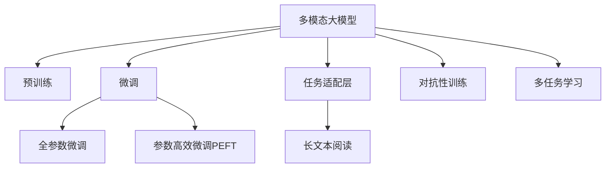

                 

# 多模态大模型：技术原理与实战 如何提高长文本阅读能力

> 关键词：多模态大模型,长文本阅读,Transformer,BERT,预训练,微调,任务适配层,参数高效微调,自然语言处理(NLP)

## 1. 背景介绍

### 1.1 问题由来

近年来，随着深度学习技术的快速发展，自然语言处理(Natural Language Processing, NLP)领域取得了显著进展，其中以Transformer架构为代表的大规模预训练语言模型在各类NLP任务中表现优异。这些模型通过在大量文本数据上进行预训练，学习到了丰富的语言知识，能够较好地理解文本中的语义信息。然而，在大规模文本阅读任务中，长文本处理仍是难点。

长文本阅读任务要求模型能够理解复杂的文本结构，识别并提取关键信息。常见任务包括新闻摘要、文本分类、机器翻译等。尽管现有模型在某些任务上取得了优异成绩，但在处理超长文本时，仍存在效率低、理解浅等问题。因此，如何提高长文本阅读能力，增强模型对复杂文本的理解和生成能力，成为当前NLP研究的前沿话题。

### 1.2 问题核心关键点

多模态大模型在长文本阅读中的研究重点在于如何更好地结合文本、图像、音频等多模态信息，提升模型对文本的理解深度和广度。主要关键点包括：

- 长文本的结构和信息提取：如何建模文本的层次结构和语义信息，提取关键信息。
- 多模态信息的融合：如何将文本与其他模态信息如视觉、听觉信息结合，提升模型对文本的综合理解。
- 参数高效微调：如何在固定大部分预训练参数的前提下，优化少量任务相关参数，提高微调效率。
- 对抗性训练：如何提高模型对输入噪声和对抗样本的鲁棒性。
- 多任务学习：如何利用同一模型进行多任务学习，提高模型的泛化能力。

本文聚焦于基于多模态大模型的长文本阅读能力提升，将详细阐述其核心算法原理与操作步骤，并通过具体代码实例和案例分析，帮助读者深入理解多模态大模型在长文本阅读中的实际应用。

## 2. 核心概念与联系

### 2.1 核心概念概述

为了更好地理解基于多模态大模型的长文本阅读能力提升，首先需要介绍几个关键概念：

- 多模态大模型(Multimodal Large Models)：结合文本、图像、音频等多模态信息进行训练的语言模型。通常采用Transformer架构，可以同时处理多种类型的数据。
- 长文本阅读(Reading Comprehension)：指模型对超长文本段落的理解和信息提取能力。长文本通常包含复杂语义结构，需要模型具备强大的语义理解和结构建模能力。
- 预训练(Pre-training)：指在大规模无标签文本数据上，通过自监督学习任务训练模型的过程。预训练使得模型学习到通用语言表示，能够更好地进行下游任务微调。
- 微调(Fine-tuning)：在预训练模型的基础上，使用下游任务的少量标注数据，通过有监督学习优化模型在特定任务上的性能。
- 任务适配层(Task Adapting Layer)：根据任务类型，在预训练模型顶层设计合适的输出层和损失函数。
- 参数高效微调(Parameter-Efficient Fine-tuning, PEFT)：只更新少量的模型参数，而固定大部分预训练权重不变，以提高微调效率，避免过拟合。
- 对抗性训练(Adversarial Training)：加入对抗样本，提高模型鲁棒性，避免模型对噪声和对抗样本的过拟合。
- 多任务学习(Multi-task Learning)：利用同一模型进行多任务学习，提高模型的泛化能力。

这些概念之间的逻辑关系可以通过以下Mermaid流程图来展示：



这个流程图展示了大语言模型处理长文本阅读的核心概念及其之间的关系：

1. 多模态大模型通过预训练获得基础能力。
2. 微调是对预训练模型进行任务特定的优化，可以分为全参数微调和参数高效微调（PEFT）。
3. 任务适配层根据任务类型设计输出层和损失函数。
4. 长文本阅读任务在任务适配层的辅助下，由多模态大模型进行处理。
5. 对抗性训练提高模型鲁棒性，避免模型对输入噪声和对抗样本的过拟合。
6. 多任务学习利用同一模型进行多任务学习，提高模型的泛化能力。

这些核心概念共同构成了多模态大模型处理长文本阅读能力的理论基础和实践框架。

## 3. 核心算法原理 & 具体操作步骤
### 3.1 算法原理概述

基于多模态大模型的长文本阅读能力提升，其核心思想是通过预训练和多模态融合，增强模型对文本信息的理解和提取能力。具体而言，多模态大模型在预训练阶段学习到通用语言表示，通过微调任务适配层，使其适应特定的长文本阅读任务，同时引入多模态信息，提升模型对文本的综合理解能力。

### 3.2 算法步骤详解

基于多模态大模型的长文本阅读能力提升一般包括以下几个关键步骤：

**Step 1: 准备预训练模型和数据集**
- 选择合适的预训练多模态模型（如BERT、GPT等）作为初始化参数。
- 准备长文本阅读任务的标注数据集，划分为训练集、验证集和测试集。

**Step 2: 设计任务适配层**
- 根据长文本阅读任务类型，设计合适的输出层和损失函数。
- 对于分类任务，通常使用线性分类器和交叉熵损失函数。
- 对于生成任务，通常使用语言模型的解码器输出概率分布，并以负对数似然为损失函数。

**Step 3: 设置微调超参数**
- 选择合适的优化算法及其参数，如 AdamW、SGD 等，设置学习率、批大小、迭代轮数等。
- 设置正则化技术及强度，包括权重衰减、Dropout、Early Stopping等。
- 确定冻结预训练参数的策略，如仅微调顶层，或全部参数都参与微调。

**Step 4: 执行梯度训练**
- 将训练集数据分批次输入模型，前向传播计算损失函数。
- 反向传播计算参数梯度，根据设定的优化算法和学习率更新模型参数。
- 周期性在验证集上评估模型性能，根据性能指标决定是否触发 Early Stopping。
- 重复上述步骤直到满足预设的迭代轮数或 Early Stopping 条件。

**Step 5: 测试和部署**
- 在测试集上评估微调后模型，对比微调前后的精度提升。
- 使用微调后的模型对新样本进行推理预测，集成到实际的应用系统中。
- 持续收集新的数据，定期重新微调模型，以适应数据分布的变化。

以上是基于多模态大模型的长文本阅读能力提升的一般流程。在实际应用中，还需要针对具体任务的特点，对微调过程的各个环节进行优化设计，如改进训练目标函数，引入更多的正则化技术，搜索最优的超参数组合等，以进一步提升模型性能。

### 3.3 算法优缺点

基于多模态大模型的长文本阅读能力提升方法具有以下优点：
1. 简单高效。只需准备少量标注数据，即可对预训练模型进行快速适配，获得较大的性能提升。
2. 通用适用。适用于各种NLP下游任务，包括分类、匹配、生成等，设计简单的任务适配层即可实现微调。
3. 参数高效。利用参数高效微调技术，在固定大部分预训练参数的情况下，仍可取得不错的提升。
4. 效果显著。在学术界和工业界的诸多任务上，基于微调的方法已经刷新了最先进的性能指标。

同时，该方法也存在一定的局限性：
1. 依赖标注数据。微调的效果很大程度上取决于标注数据的质量和数量，获取高质量标注数据的成本较高。
2. 迁移能力有限。当目标任务与预训练数据的分布差异较大时，微调的性能提升有限。
3. 可解释性不足。微调模型的决策过程通常缺乏可解释性，难以对其推理逻辑进行分析和调试。
4. 多模态信息的融合复杂。多模态信息的融合涉及到跨模态对齐和融合，过程较为复杂，需要设计合理的融合策略。

尽管存在这些局限性，但就目前而言，基于多模态大模型的微调方法仍是大语言模型处理长文本阅读任务的主流范式。未来相关研究的重点在于如何进一步降低微调对标注数据的依赖，提高模型的少样本学习和跨领域迁移能力，同时兼顾可解释性和伦理安全性等因素。

### 3.4 算法应用领域

基于多模态大模型的长文本阅读能力提升方法在NLP领域已经得到了广泛的应用，覆盖了几乎所有常见任务，例如：

- 新闻摘要：将长新闻文章压缩成简短摘要。将文章-摘要对作为微调数据，使模型学习抓取要点。
- 文本分类：如情感分析、主题分类、意图识别等。通过微调使模型学习文本-标签映射。
- 命名实体识别：识别文本中的人名、地名、机构名等特定实体。通过微调使模型掌握实体边界和类型。
- 关系抽取：从文本中抽取实体之间的语义关系。通过微调使模型学习实体-关系三元组。
- 问答系统：对自然语言问题给出答案。将问题-答案对作为微调数据，训练模型学习匹配答案。
- 机器翻译：将源语言文本翻译成目标语言。通过微调使模型学习语言-语言映射。
- 文本生成：生成连贯、有意义的文本。通过微调使模型学习文本生成策略。

除了上述这些经典任务外，多模态大模型微调也被创新性地应用到更多场景中，如可控文本生成、常识推理、代码生成、数据增强等，为NLP技术带来了全新的突破。随着预训练模型和微调方法的不断进步，相信NLP技术将在更广阔的应用领域大放异彩。

## 4. 数学模型和公式 & 详细讲解  
### 4.1 数学模型构建

本节将使用数学语言对基于多模态大模型的长文本阅读过程进行更加严格的刻画。

记预训练多模态模型为 $M_{\theta}$，其中 $\theta$ 为预训练得到的模型参数。假设长文本阅读任务 $T$ 的训练集为 $D=\{(x_i,y_i)\}_{i=1}^N, x_i \in \mathcal{X}, y_i \in \mathcal{Y}$。

定义模型 $M_{\theta}$ 在输入 $x$ 上的输出为 $\hat{y}=M_{\theta}(x) \in [0,1]$，表示样本属于正类的概率。真实标签 $y \in \{0,1\}$。则二分类交叉熵损失函数定义为：

$$
\ell(M_{\theta}(x),y) = -[y\log \hat{y} + (1-y)\log (1-\hat{y})]
$$

将其代入经验风险公式，得：

$$
\mathcal{L}(\theta) = -\frac{1}{N}\sum_{i=1}^N [y_i\log M_{\theta}(x_i)+(1-y_i)\log(1-M_{\theta}(x_i))]
$$

根据链式法则，损失函数对参数 $\theta_k$ 的梯度为：

$$
\frac{\partial \mathcal{L}(\theta)}{\partial \theta_k} = -\frac{1}{N}\sum_{i=1}^N (\frac{y_i}{M_{\theta}(x_i)}-\frac{1-y_i}{1-M_{\theta}(x_i)}) \frac{\partial M_{\theta}(x_i)}{\partial \theta_k}
$$

其中 $\frac{\partial M_{\theta}(x_i)}{\partial \theta_k}$ 可进一步递归展开，利用自动微分技术完成计算。

### 4.2 公式推导过程

以下我们以文本分类任务为例，推导交叉熵损失函数及其梯度的计算公式。

假设模型 $M_{\theta}$ 在输入 $x$ 上的输出为 $\hat{y}=M_{\theta}(x) \in [0,1]$，表示样本属于正类的概率。真实标签 $y \in \{0,1\}$。则二分类交叉熵损失函数定义为：

$$
\ell(M_{\theta}(x),y) = -[y\log \hat{y} + (1-y)\log (1-\hat{y})]
$$

将其代入经验风险公式，得：

$$
\mathcal{L}(\theta) = -\frac{1}{N}\sum_{i=1}^N [y_i\log M_{\theta}(x_i)+(1-y_i)\log(1-M_{\theta}(x_i))]
$$

根据链式法则，损失函数对参数 $\theta_k$ 的梯度为：

$$
\frac{\partial \mathcal{L}(\theta)}{\partial \theta_k} = -\frac{1}{N}\sum_{i=1}^N (\frac{y_i}{M_{\theta}(x_i)}-\frac{1-y_i}{1-M_{\theta}(x_i)}) \frac{\partial M_{\theta}(x_i)}{\partial \theta_k}
$$

其中 $\frac{\partial M_{\theta}(x_i)}{\partial \theta_k}$ 可进一步递归展开，利用自动微分技术完成计算。

在得到损失函数的梯度后，即可带入参数更新公式，完成模型的迭代优化。重复上述过程直至收敛，最终得到适应下游任务的最优模型参数 $\theta^*$。

## 5. 项目实践：代码实例和详细解释说明
### 5.1 开发环境搭建

在进行多模态大模型微调实践前，我们需要准备好开发环境。以下是使用Python进行PyTorch开发的环境配置流程：

1. 安装Anaconda：从官网下载并安装Anaconda，用于创建独立的Python环境。

2. 创建并激活虚拟环境：
```bash
conda create -n pytorch-env python=3.8 
conda activate pytorch-env
```

3. 安装PyTorch：根据CUDA版本，从官网获取对应的安装命令。例如：
```bash
conda install pytorch torchvision torchaudio cudatoolkit=11.1 -c pytorch -c conda-forge
```

4. 安装Transformers库：
```bash
pip install transformers
```

5. 安装各类工具包：
```bash
pip install numpy pandas scikit-learn matplotlib tqdm jupyter notebook ipython
```

完成上述步骤后，即可在`pytorch-env`环境中开始微调实践。

### 5.2 源代码详细实现

下面我们以文本分类任务为例，给出使用Transformers库对BERT模型进行微调的PyTorch代码实现。

首先，定义文本分类任务的数据处理函数：

```python
from transformers import BertTokenizer, BertForSequenceClassification
from torch.utils.data import Dataset
import torch

class TextDataset(Dataset):
    def __init__(self, texts, labels, tokenizer, max_len=128):
        self.texts = texts
        self.labels = labels
        self.tokenizer = tokenizer
        self.max_len = max_len
        
    def __len__(self):
        return len(self.texts)
    
    def __getitem__(self, item):
        text = self.texts[item]
        label = self.labels[item]
        
        encoding = self.tokenizer(text, return_tensors='pt', max_length=self.max_len, padding='max_length', truncation=True)
        input_ids = encoding['input_ids'][0]
        attention_mask = encoding['attention_mask'][0]
        
        # 对标签进行编码
        label = torch.tensor([label], dtype=torch.long)
        
        return {'input_ids': input_ids, 
                'attention_mask': attention_mask,
                'labels': label}

# 标签与id的映射
label2id = {'negative': 0, 'positive': 1}
id2label = {v: k for k, v in label2id.items()}

# 创建dataset
tokenizer = BertTokenizer.from_pretrained('bert-base-cased')

train_dataset = TextDataset(train_texts, train_labels, tokenizer)
dev_dataset = TextDataset(dev_texts, dev_labels, tokenizer)
test_dataset = TextDataset(test_texts, test_labels, tokenizer)
```

然后，定义模型和优化器：

```python
from transformers import AdamW

model = BertForSequenceClassification.from_pretrained('bert-base-cased', num_labels=len(label2id))

optimizer = AdamW(model.parameters(), lr=2e-5)
```

接着，定义训练和评估函数：

```python
from torch.utils.data import DataLoader
from tqdm import tqdm
from sklearn.metrics import classification_report

device = torch.device('cuda') if torch.cuda.is_available() else torch.device('cpu')
model.to(device)

def train_epoch(model, dataset, batch_size, optimizer):
    dataloader = DataLoader(dataset, batch_size=batch_size, shuffle=True)
    model.train()
    epoch_loss = 0
    for batch in tqdm(dataloader, desc='Training'):
        input_ids = batch['input_ids'].to(device)
        attention_mask = batch['attention_mask'].to(device)
        labels = batch['labels'].to(device)
        model.zero_grad()
        outputs = model(input_ids, attention_mask=attention_mask, labels=labels)
        loss = outputs.loss
        epoch_loss += loss.item()
        loss.backward()
        optimizer.step()
    return epoch_loss / len(dataloader)

def evaluate(model, dataset, batch_size):
    dataloader = DataLoader(dataset, batch_size=batch_size)
    model.eval()
    preds, labels = [], []
    with torch.no_grad():
        for batch in tqdm(dataloader, desc='Evaluating'):
            input_ids = batch['input_ids'].to(device)
            attention_mask = batch['attention_mask'].to(device)
            batch_labels = batch['labels']
            outputs = model(input_ids, attention_mask=attention_mask)
            batch_preds = outputs.logits.argmax(dim=1).to('cpu').tolist()
            batch_labels = batch_labels.to('cpu').tolist()
            for pred, label in zip(batch_preds, batch_labels):
                preds.append(pred)
                labels.append(label)
                
    print(classification_report(labels, preds))
```

最后，启动训练流程并在测试集上评估：

```python
epochs = 5
batch_size = 16

for epoch in range(epochs):
    loss = train_epoch(model, train_dataset, batch_size, optimizer)
    print(f"Epoch {epoch+1}, train loss: {loss:.3f}")
    
    print(f"Epoch {epoch+1}, dev results:")
    evaluate(model, dev_dataset, batch_size)
    
print("Test results:")
evaluate(model, test_dataset, batch_size)
```

以上就是使用PyTorch对BERT进行文本分类任务微调的完整代码实现。可以看到，得益于Transformers库的强大封装，我们可以用相对简洁的代码完成BERT模型的加载和微调。

### 5.3 代码解读与分析

让我们再详细解读一下关键代码的实现细节：

**TextDataset类**：
- `__init__`方法：初始化文本、标签、分词器等关键组件。
- `__len__`方法：返回数据集的样本数量。
- `__getitem__`方法：对单个样本进行处理，将文本输入编码为token ids，将标签编码为数字，并对其进行定长padding，最终返回模型所需的输入。

**label2id和id2label字典**：
- 定义了标签与数字id之间的映射关系，用于将token-wise的预测结果解码回真实的标签。

**训练和评估函数**：
- 使用PyTorch的DataLoader对数据集进行批次化加载，供模型训练和推理使用。
- 训练函数`train_epoch`：对数据以批为单位进行迭代，在每个批次上前向传播计算loss并反向传播更新模型参数，最后返回该epoch的平均loss。
- 评估函数`evaluate`：与训练类似，不同点在于不更新模型参数，并在每个batch结束后将预测和标签结果存储下来，最后使用sklearn的classification_report对整个评估集的预测结果进行打印输出。

**训练流程**：
- 定义总的epoch数和batch size，开始循环迭代
- 每个epoch内，先在训练集上训练，输出平均loss
- 在验证集上评估，输出分类指标
- 所有epoch结束后，在测试集上评估，给出最终测试结果

可以看到，PyTorch配合Transformers库使得BERT微调的代码实现变得简洁高效。开发者可以将更多精力放在数据处理、模型改进等高层逻辑上，而不必过多关注底层的实现细节。

当然，工业级的系统实现还需考虑更多因素，如模型的保存和部署、超参数的自动搜索、更灵活的任务适配层等。但核心的微调范式基本与此类似。

## 6. 实际应用场景
### 6.1 智能客服系统

基于多模态大模型的对话技术，可以广泛应用于智能客服系统的构建。传统客服往往需要配备大量人力，高峰期响应缓慢，且一致性和专业性难以保证。而使用多模态大模型进行微调，可以7x24小时不间断服务，快速响应客户咨询，用自然流畅的语言解答各类常见问题。

在技术实现上，可以收集企业内部的历史客服对话记录，将问题和最佳答复构建成监督数据，在此基础上对多模态大模型进行微调。微调后的对话模型能够自动理解用户意图，匹配最合适的答案模板进行回复。对于客户提出的新问题，还可以接入检索系统实时搜索相关内容，动态组织生成回答。如此构建的智能客服系统，能大幅提升客户咨询体验和问题解决效率。

### 6.2 金融舆情监测

金融机构需要实时监测市场舆论动向，以便及时应对负面信息传播，规避金融风险。传统的人工监测方式成本高、效率低，难以应对网络时代海量信息爆发的挑战。基于多模态大模型的文本分类和情感分析技术，为金融舆情监测提供了新的解决方案。

具体而言，可以收集金融领域相关的新闻、报道、评论等文本数据，并对其进行主题标注和情感标注。在此基础上对预训练语言模型进行微调，使其能够自动判断文本属于何种主题，情感倾向是正面、中性还是负面。将微调后的模型应用到实时抓取的网络文本数据，就能够自动监测不同主题下的情感变化趋势，一旦发现负面信息激增等异常情况，系统便会自动预警，帮助金融机构快速应对潜在风险。

### 6.3 个性化推荐系统

当前的推荐系统往往只依赖用户的历史行为数据进行物品推荐，无法深入理解用户的真实兴趣偏好。基于多模态大模型的个性化推荐系统可以更好地挖掘用户行为背后的语义信息，从而提供更精准、多样的推荐内容。

在实践中，可以收集用户浏览、点击、评论、分享等行为数据，提取和用户交互的物品标题、描述、标签等文本内容。将文本内容作为模型输入，用户的后续行为（如是否点击、购买等）作为监督信号，在此基础上微调预训练语言模型。微调后的模型能够从文本内容中准确把握用户的兴趣点。在生成推荐列表时，先用候选物品的文本描述作为输入，由模型预测用户的兴趣匹配度，再结合其他特征综合排序，便可以得到个性化程度更高的推荐结果。

### 6.4 未来应用展望

随着多模态大模型和微调方法的不断发展，基于微调范式将在更多领域得到应用，为传统行业带来变革性影响。

在智慧医疗领域，基于多模态大模型的问答、病历分析、药物研发等应用将提升医疗服务的智能化水平，辅助医生诊疗，加速新药开发进程。

在智能教育领域，多模态大模型可应用于作业批改、学情分析、知识推荐等方面，因材施教，促进教育公平，提高教学质量。

在智慧城市治理中，多模态大模型可用于城市事件监测、舆情分析、应急指挥等环节，提高城市管理的自动化和智能化水平，构建更安全、高效的未来城市。

此外，在企业生产、社会治理、文娱传媒等众多领域，基于多模态大模型的AI应用也将不断涌现，为经济社会发展注入新的动力。相信随着技术的日益成熟，多模态大模型微调技术将成为人工智能落地应用的重要范式，推动人工智能技术向更广阔的领域加速渗透。

## 7. 工具和资源推荐
### 7.1 学习资源推荐

为了帮助开发者系统掌握多模态大模型微调的理论基础和实践技巧，这里推荐一些优质的学习资源：

1. 《Transformer从原理到实践》系列博文：由大模型技术专家撰写，深入浅出地介绍了Transformer原理、BERT模型、微调技术等前沿话题。

2. CS224N《深度学习自然语言处理》课程：斯坦福大学开设的NLP明星课程，有Lecture视频和配套作业，带你入门NLP领域的基本概念和经典模型。

3. 《Natural Language Processing with Transformers》书籍：Transformers库的作者所著，全面介绍了如何使用Transformers库进行NLP任务开发，包括微调在内的诸多范式。

4. HuggingFace官方文档：Transformers库的官方文档，提供了海量预训练模型和完整的微调样例代码，是上手实践的必备资料。

5. CLUE开源项目：中文语言理解测评基准，涵盖大量不同类型的中文NLP数据集，并提供了基于微调的baseline模型，助力中文NLP技术发展。

通过对这些资源的学习实践，相信你一定能够快速掌握多模态大模型微调的精髓，并用于解决实际的NLP问题。
###  7.2 开发工具推荐

高效的开发离不开优秀的工具支持。以下是几款用于多模态大模型微调开发的常用工具：

1. PyTorch：基于Python的开源深度学习框架，灵活动态的计算图，适合快速迭代研究。大部分预训练语言模型都有PyTorch版本的实现。

2. TensorFlow：由Google主导开发的开源深度学习框架，生产部署方便，适合大规模工程应用。同样有丰富的预训练语言模型资源。

3. Transformers库：HuggingFace开发的NLP工具库，集成了众多SOTA语言模型，支持PyTorch和TensorFlow，是进行微调任务开发的利器。

4. Weights & Biases：模型训练的实验跟踪工具，可以记录和可视化模型训练过程中的各项指标，方便对比和调优。与主流深度学习框架无缝集成。

5. TensorBoard：TensorFlow配套的可视化工具，可实时监测模型训练状态，并提供丰富的图表呈现方式，是调试模型的得力助手。

6. Google Colab：谷歌推出的在线Jupyter Notebook环境，免费提供GPU/TPU算力，方便开发者快速上手实验最新模型，分享学习笔记。

合理利用这些工具，可以显著提升多模态大模型微调任务的开发效率，加快创新迭代的步伐。

### 7.3 相关论文推荐

多模态大模型和微调技术的发展源于学界的持续研究。以下是几篇奠基性的相关论文，推荐阅读：

1. Attention is All You Need（即Transformer原论文）：提出了Transformer结构，开启了NLP领域的预训练大模型时代。

2. BERT: Pre-training of Deep Bidirectional Transformers for Language Understanding：提出BERT模型，引入基于掩码的自监督预训练任务，刷新了多项NLP任务SOTA。

3. Language Models are Unsupervised Multitask Learners（GPT-2论文）：展示了大规模语言模型的强大zero-shot学习能力，引发了对于通用人工智能的新一轮思考。

4. Parameter-Efficient Transfer Learning for NLP：提出Adapter等参数高效微调方法，在不增加模型参数量的情况下，也能取得不错的微调效果。

5. Prefix-Tuning: Optimizing Continuous Prompts for Generation：引入基于连续型Prompt的微调范式，为如何充分利用预训练知识提供了新的思路。

6. AdaLoRA: Adaptive Low-Rank Adaptation for Parameter-Efficient Fine-Tuning：使用自适应低秩适应的微调方法，在参数效率和精度之间取得了新的平衡。

这些论文代表了大语言模型微调技术的发展脉络。通过学习这些前沿成果，可以帮助研究者把握学科前进方向，激发更多的创新灵感。

## 8. 总结：未来发展趋势与挑战

### 8.1 总结

本文对基于多模态大模型的长文本阅读能力提升方法进行了全面系统的介绍。首先阐述了大语言模型和微调技术的研究背景和意义，明确了多模态大模型在长文本阅读中的独特价值。其次，从原理到实践，详细讲解了基于多模态大模型的长文本阅读能力提升的数学原理和关键步骤，给出了多模态大模型微调的完整代码实例。同时，本文还广泛探讨了多模态大模型在长文本阅读中的实际应用场景，展示了多模态大模型微调范式的广阔前景。

通过本文的系统梳理，可以看到，基于多模态大模型的微调方法在长文本阅读领域具有广泛的应用前景，极大地拓展了预训练语言模型的应用边界，催生了更多的落地场景。未来，伴随预训练语言模型和微调方法的不断进步，基于多模态大模型的微调技术必将在构建人机协同的智能时代中扮演越来越重要的角色。

### 8.2 未来发展趋势

展望未来，基于多模态大模型的长文本阅读能力提升方法将呈现以下几个发展趋势：

1. 模型规模持续增大。随着算力成本的下降和数据规模的扩张，预训练语言模型的参数量还将持续增长。超大规模语言模型蕴含的丰富语言知识，有望支撑更加复杂多变的下游任务微调。

2. 多模态信息的融合复杂度降低。未来将出现更多多模态数据融合的技术，如跨模态对齐、融合等，使得多模态信息的融合更加高效、精准。

3. 持续学习成为常态。随着数据分布的不断变化，多模态大模型也需要持续学习新知识以保持性能。如何在不遗忘原有知识的同时，高效吸收新样本信息，将成为重要的研究课题。

4. 对抗性训练和对抗性样本的应用更加广泛。面对噪声和对抗样本的攻击，模型需要具备更强的鲁棒性。未来的研究将更加关注对抗性训练和对抗性样本的生成与防御策略。

5. 多任务学习将进一步发展。多模态大模型可应用于多任务学习，如问答系统、推荐系统等，通过共享底层特征，提升模型的泛化能力和任务适应性。

6. 自然语言生成能力提升。多模态大模型在长文本阅读中的生成能力将得到进一步提升，能够生成更加连贯、准确、自然的文本。

以上趋势凸显了大语言模型微调技术的广阔前景。这些方向的探索发展，必将进一步提升NLP系统的性能和应用范围，为人类认知智能的进化带来深远影响。

### 8.3 面临的挑战

尽管基于多模态大模型的微调方法已经取得了瞩目成就，但在迈向更加智能化、普适化应用的过程中，它仍面临着诸多挑战：

1. 标注成本瓶颈。虽然微调大大降低了标注数据的需求，但对于长文本阅读任务，仍需大量标注数据以获得理想的微调效果。如何进一步降低微调对标注样本的依赖，将是一大难题。

2. 对抗性训练效果有限。现有方法虽然在一定程度上提升了模型的鲁棒性，但在面对复杂的对抗样本攻击时，效果仍不尽人意。如何设计更加有效的对抗性训练策略，是一个重要的研究方向。

3. 多模态信息融合效果有限。多模态信息的融合仍存在对齐不准确、融合效果不佳等问题，限制了多模态大模型在长文本阅读中的应用。如何提升多模态信息的融合效果，将是未来的重要课题。

4. 参数高效微调的效果有限。现有的参数高效微调方法在减少参数量的同时，对微调效果也有一定影响。如何进一步优化参数高效微调方法，使其在减少参数量的情况下仍能取得良好效果，是一个重要研究方向。

5. 跨模态计算效率问题。多模态信息的融合计算复杂度较高，如何在不显著增加计算成本的前提下提升多模态信息的融合效果，是一个挑战。

6. 可解释性不足。现有方法中，多模态大模型通常被视为"黑盒"系统，缺乏可解释性。如何赋予模型更强的可解释性，将是未来的研究方向。

正视多模态大模型微调面临的这些挑战，积极应对并寻求突破，将是大语言模型微调走向成熟的必由之路。相信随着学界和产业界的共同努力，这些挑战终将一一被克服，多模态大模型微调技术必将在构建人机协同的智能时代中扮演越来越重要的角色。

### 8.4 研究展望

面对基于多模态大模型的长文本阅读能力提升所面临的种种挑战，未来的研究需要在以下几个方面寻求新的突破：

1. 探索无监督和半监督微调方法。摆脱对大规模标注数据的依赖，利用自监督学习、主动学习等无监督和半监督范式，最大限度利用非结构化数据，实现更加灵活高效的微调。

2. 研究更加高效的对抗性训练策略。设计更加鲁棒的对抗性训练方法，提高模型对噪声和对抗样本的抵抗能力。

3. 引入更多先验知识。将符号化的先验知识，如知识图谱、逻辑规则等，与神经网络模型进行巧妙融合，引导微调过程学习更准确、合理的语言模型。

4. 加强多模态信息的融合能力。研发跨模态对齐和融合算法，提升多模态信息的融合效果，增强模型的综合理解能力。

5. 开发更高效的参数高效微调方法。设计更加参数高效的多模态大模型微调方法，在减少参数量的同时，提升微调效果。

6. 结合因果分析和博弈论工具。将因果分析方法引入多模态大模型，识别出模型决策的关键特征，增强输出解释的因果性和逻辑性。借助博弈论工具刻画人机交互过程，主动探索并规避模型的脆弱点，提高系统稳定性。

7. 引入更多先验知识。将符号化的先验知识，如知识图谱、逻辑规则等，与神经网络模型进行巧妙融合，引导微调过程学习更准确、合理的语言模型。

这些研究方向的探索，必将引领多模态大模型微调技术迈向更高的台阶，为构建安全、可靠、可解释、可控的智能系统铺平道路。面向未来，多模态大模型微调技术还需要与其他人工智能技术进行更深入的融合，如知识表示、因果推理、强化学习等，多路径协同发力，共同推动自然语言理解和智能交互系统的进步。只有勇于创新、敢于突破，才能不断拓展语言模型的边界，让智能技术更好地造福人类社会。

## 9. 附录：常见问题与解答
**Q1：多模态大模型和传统大语言模型有何不同？**

A: 多模态大模型相较于传统大语言模型，在数据输入和模型结构上均有不同。传统大语言模型仅依赖文本数据进行训练，而多模态大模型可以同时处理文本、图像、音频等多种类型的数据。在模型结构上，多模态大模型通常采用Transformer架构，具备自注意力机制，可以处理更复杂的输入数据。

**Q2：多模态大模型在长文本阅读中如何提升效果？**

A: 多模态大模型通过预训练获得通用语言表示，结合任务适配层进行微调，使其能够更好地适应特定长文本阅读任务。此外，多模态大模型通过融合多模态信息，提升模型对文本的综合理解能力。在长文本阅读中，多模态大模型可以结合上下文信息、图片、音频等多源数据，更加全面地理解文本内容，提取关键信息。

**Q3：如何设计多模态信息的融合策略？**

A: 多模态信息的融合策略需要考虑多种因素，如数据对齐、特征融合等。一种常用的方法是使用交叉注意力机制，将不同模态的信息进行交互，提取融合后的特征。另外，也可以使用跨模态对齐算法，如神经符号对齐、深度跨模态对齐等，将不同模态的数据映射到相同的语义空间中，进行融合。

**Q4：多模态大模型在实际应用中面临哪些挑战？**

A: 多模态大模型在实际应用中面临以下挑战：
1. 标注数据成本高：长文本阅读任务需要大量标注数据，获取高质量标注数据的成本较高。
2. 对抗性训练效果有限：对抗性训练方法在面对复杂的对抗样本攻击时，效果不尽人意。
3. 多模态信息融合复杂：多模态信息的融合仍存在对齐不准确、融合效果不佳等问题。
4. 参数高效微调效果有限：现有参数高效微调方法在减少参数量的同时，对微调效果也有一定影响。
5. 可解释性不足：多模态大模型通常被视为"黑盒"系统，缺乏可解释性。

**Q5：未来如何提高多模态大模型的长文本阅读能力？**

A: 未来提高多模态大模型的长文本阅读能力，可以从以下几个方向进行研究：
1. 探索无监督和半监督微调方法，最大限度利用非结构化数据。
2. 设计更加鲁棒的对抗性训练策略，提升模型鲁棒性。
3. 研发跨模态对齐和融合算法，提升多模态信息的融合效果。
4. 开发更高效的参数高效微调方法，提升微调效果。
5. 结合因果分析和博弈论工具，增强模型的综合理解能力和稳定性。

通过不断优化多模态大模型的长文本阅读能力，相信其在NLP领域的应用将更加广泛，为人类认知智能的进化带来深远影响。

---

作者：禅与计算机程序设计艺术 / Zen and the Art of Computer Programming

