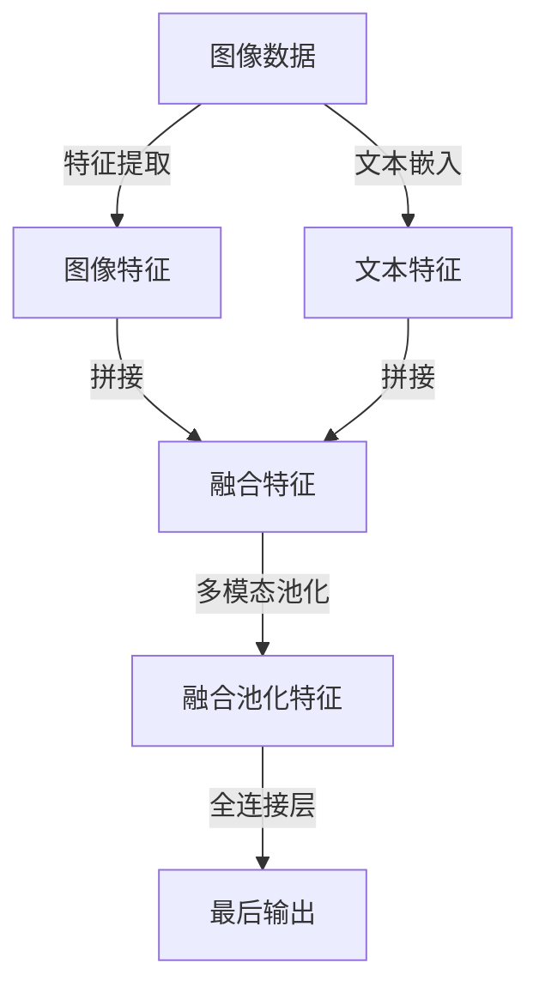

                 

# 多模态深度学习：图像和文本的融合

## 1. 背景介绍

在人工智能领域，多模态深度学习（Multi-Modal Deep Learning）是一种融合不同模态数据的深度学习技术，这些模态包括但不限于视觉、听觉、文本、时间序列等。多模态学习不仅能够有效地利用多种信息源，还可以提高模型对复杂场景的建模能力，提升任务的表现。

近年来，随着深度学习在计算机视觉、自然语言处理等领域的快速发展，多模态深度学习成为研究热点，广泛应用于图像描述、视频理解、智能对话、视觉问答等众多任务中。然而，多模态数据往往具有不同的结构和特征，如何在统一框架下进行融合建模，是当前研究的难点和热点问题。

本文将重点介绍多模态深度学习的核心概念、关键技术以及实际应用场景，希望能为读者提供全面的技术指导，推动多模态学习在各领域的应用。

## 2. 核心概念与联系

### 2.1 核心概念概述

多模态深度学习旨在将多个模态的数据进行融合，以提高模型对多源数据的理解和推理能力。常用的模态包括图像、文本、语音等，其中图像和文本的融合应用最为广泛。

图像是二维的视觉信息，文本是字符序列的语言信息，二者具有不同的特征表示和数据结构。图像描述、视觉问答、图像 captioning 等任务，需要模型能够同时理解和利用这两种模态的信息，才能取得最佳效果。

### 2.2 核心概念原理和架构的 Mermaid 流程图

以下是融合图像和文本模态的数据流图，展示了从输入数据到模型输出的完整流程：



该流程图中，图像数据首先经过特征提取器（如卷积神经网络 CNN）提取特征，然后与文本特征进行拼接，并经过多模态池化层进行融合，最终由全连接层输出预测结果。

## 3. 核心算法原理 & 具体操作步骤

### 3.1 算法原理概述

多模态深度学习的核心思想是将不同模态的数据融合为统一的特征表示，并在统一的特征空间中进行学习。常用的融合方法包括特征拼接、特征平均、多模态池化等，具体选择哪种方法取决于具体任务和数据特性。

**特征拼接**是最简单的融合方法，将不同模态的特征直接拼接起来，如将图像特征和文本特征拼接为向量。这种方法简单易行，但忽略了模态之间的相互作用，可能造成信息冗余或信息损失。

**特征平均**是将不同模态的特征进行平均，得到一个更鲁棒的特征表示。这种方法可以缓解信息冗余问题，但可能会丢失一些重要的信息。

**多模态池化**是一种更高级的融合方法，通过池化操作将不同模态的特征进行融合，保留有信息量的特征。例如，可以使用全局池化或注意力机制进行特征融合，将不同模态的特征表示成统一的结构。

### 3.2 算法步骤详解

**Step 1: 准备数据集**

多模态学习通常需要大量的标注数据。可以选择公开的多模态数据集，如COCO-Text、Flickr30K等，或者自己收集和标注数据。确保数据集包含足够的图像和文本样本，且样本的分布应该覆盖多模态数据的全貌。

**Step 2: 特征提取**

对于图像数据，通常使用卷积神经网络（CNN）提取特征。对于文本数据，可以使用预训练的语言模型（如BERT、GPT等）提取特征。

**Step 3: 特征融合**

选择适合的特征融合方法，如特征拼接、特征平均或多模态池化。其中，多模态池化是一种更先进的方法，可以有效地融合不同模态的信息。

**Step 4: 训练模型**

在融合后的特征上，构建多模态深度学习模型，如多模态卷积神经网络（MMCNN）、多模态注意力网络（MMAN）等。使用交叉熵等损失函数进行训练，优化模型参数。

**Step 5: 评估和优化**

在测试集上评估模型性能，如准确率、F1-score等指标。根据评估结果调整模型结构、超参数等，进行模型优化。

### 3.3 算法优缺点

多模态深度学习的主要优点包括：

- 充分利用不同模态的数据，提高模型的表现力和泛化能力。
- 能够处理复杂的多模态任务，如图像描述、视觉问答等。

然而，多模态深度学习也存在一些缺点：

- 需要大量的标注数据，标注成本较高。
- 数据源不一致，需要进行特征对齐和融合，过程复杂。
- 模型训练复杂度较高，需要更强的计算资源。

### 3.4 算法应用领域

多模态深度学习在以下几个领域有广泛的应用：

- 图像描述和图像 captioning：将图像特征和文本特征融合，生成图像描述或视觉问答。
- 视觉问答：结合图像和文本，理解图像内容并回答用户问题。
- 文本摘要和文本生成：融合文本特征和图像特征，生成更准确、详细的摘要或生成文本。
- 情感分析：结合图像和文本，更准确地分析用户的情感倾向。
- 医疗影像分析：结合影像特征和病历文本，提升疾病诊断的准确性。

## 4. 数学模型和公式 & 详细讲解 & 举例说明

### 4.1 数学模型构建

以图像描述任务为例，假设图像特征表示为 $\mathbf{I} \in \mathbb{R}^{C \times H \times W}$，文本特征表示为 $\mathbf{T} \in \mathbb{R}^{N \times D}$，其中 $N$ 为词汇表大小，$D$ 为文本向量维度。

将图像特征和文本特征拼接，得到融合特征 $\mathbf{F} = \begin{bmatrix} \mathbf{I} \\ \mathbf{T} \end{bmatrix}$。然后通过多模态池化层，得到池化后的融合特征 $\mathbf{Z}$，最后经过全连接层输出预测结果 $\hat{d}$。

### 4.2 公式推导过程

假设多模态池化层使用最大池化，则融合特征 $\mathbf{Z}$ 可以表示为：

$$
\mathbf{Z} = \max(\mathbf{F}): \mathbb{R}^{C \times H \times W + N \times D} \rightarrow \mathbb{R}^{N \times D}
$$

假设全连接层为 $h$ 层，则最终输出 $\hat{d}$ 可以表示为：

$$
\hat{d} = \sigma(\mathbf{W}^{(h)} \mathbf{Z} + \mathbf{b}^{(h)})
$$

其中，$\sigma$ 为激活函数，$\mathbf{W}^{(h)}$ 和 $\mathbf{b}^{(h)}$ 为全连接层的权重和偏置。

### 4.3 案例分析与讲解

以COCO-Text数据集为例，该数据集包含200,000张图像，每张图像有五个文本描述。为了训练多模态模型，需要进行数据预处理，如图像缩放、归一化、文本分词等。然后将图像和文本特征进行融合和池化，构建多模态卷积神经网络（MMCNN）或多模态注意力网络（MMAN），进行训练和测试。

在实际应用中，多模态深度学习通常需要大量的计算资源，如GPU或TPU。此外，模型的训练时间较长，需要对超参数进行调优。在测试时，模型需要能够处理大规模数据，并具有较高的推理速度。

## 5. 项目实践：代码实例和详细解释说明

### 5.1 开发环境搭建

多模态深度学习的开发环境搭建需要考虑多个方面，包括数据集准备、特征提取、模型训练等。这里以TensorFlow为例，介绍多模态学习的开发环境搭建流程：

1. 安装TensorFlow：
```
pip install tensorflow
```

2. 准备数据集：
从公开数据集下载数据，并进行预处理。

3. 特征提取：
对于图像数据，可以使用预训练的图像模型（如ResNet、VGG等）提取特征；对于文本数据，可以使用预训练的语言模型（如BERT、GPT等）提取特征。

4. 特征融合：
使用特征拼接、特征平均或多模态池化方法，将不同模态的特征进行融合。

5. 模型训练：
构建多模态深度学习模型，使用交叉熵等损失函数进行训练，优化模型参数。

### 5.2 源代码详细实现

以下是一个简单的多模态卷积神经网络（MMCNN）代码实现，用于图像描述任务：

```python
import tensorflow as tf
from tensorflow.keras.layers import Input, Conv2D, MaxPooling2D, Flatten, Concatenate, Dense, Embedding, Bidirectional, LSTM
from tensorflow.keras.models import Model

# 定义图像和文本输入层
image_input = Input(shape=(299, 299, 3))
text_input = Input(shape=(512,))

# 图像特征提取
x = Conv2D(64, (3, 3), activation='relu')(image_input)
x = MaxPooling2D((2, 2))(x)
x = Conv2D(128, (3, 3), activation='relu')(x)
x = MaxPooling2D((2, 2))(x)
x = Flatten()(x)

# 文本特征提取
y = Embedding(30000, 128)(text_input)
y = Bidirectional(LSTM(128))(y)

# 特征融合
z = Concatenate()([x, y])

# 全连接层
z = Dense(256, activation='relu')(z)
z = Dense(128, activation='relu')(z)
d = Dense(1, activation='sigmoid')(z)

# 构建模型
model = Model(inputs=[image_input, text_input], outputs=[d])

# 编译模型
model.compile(optimizer='adam', loss='binary_crossentropy', metrics=['accuracy'])

# 训练模型
model.fit([train_images, train_texts], train_labels, batch_size=32, epochs=10)
```

### 5.3 代码解读与分析

在上述代码中，我们首先定义了图像和文本的输入层，然后分别使用卷积神经网络和双向LSTM提取特征。接着，通过拼接将图像和文本特征融合，并使用全连接层进行分类。最后，编译模型并使用交叉熵损失进行训练。

### 5.4 运行结果展示

训练完成后，可以在测试集上评估模型性能。以下是一个简单的评估函数：

```python
def evaluate(model, test_images, test_texts, test_labels):
    test_loss, test_acc = model.evaluate([test_images, test_texts], test_labels, batch_size=32)
    print(f'Test loss: {test_loss:.4f}')
    print(f'Test accuracy: {test_acc:.4f}')
```

在实际应用中，多模态深度学习模型通常需要较大的计算资源，如GPU或TPU。因此，需要在开发过程中进行性能优化，确保模型能够在实际部署中运行流畅。

## 6. 实际应用场景

多模态深度学习在多个实际应用场景中具有广泛的应用：

### 6.1 图像描述

图像描述是典型的多模态学习任务，旨在生成自然语言描述图像内容。该任务通常使用预训练的视觉特征和语言模型进行融合，构建多模态卷积神经网络（MMCNN）或多模态注意力网络（MMAN），进行训练和测试。

### 6.2 视觉问答

视觉问答是另一个重要的多模态任务，旨在理解图像内容并回答用户问题。该任务通常使用预训练的视觉特征和语言模型进行融合，构建多模态注意力网络（MMAN），进行训练和测试。

### 6.3 情感分析

情感分析是一种自然语言处理任务，旨在分析文本的情感倾向。该任务通常使用预训练的语言模型和情感分类器进行融合，构建多模态深度学习模型，进行训练和测试。

### 6.4 医疗影像分析

医疗影像分析是一种重要的医疗应用场景，旨在帮助医生诊断疾病。该任务通常使用预训练的影像特征和病历文本进行融合，构建多模态深度学习模型，进行训练和测试。

## 7. 工具和资源推荐

### 7.1 学习资源推荐

为了帮助读者系统掌握多模态深度学习的理论基础和实践技巧，以下是一些优质的学习资源推荐：

1. 《深度学习》课程：由斯坦福大学开设的深度学习课程，详细介绍了多模态深度学习的原理和应用。
2. 《多模态深度学习》书籍：全面介绍了多模态深度学习的基本概念和关键技术。
3. TensorFlow官方文档：提供了多模态深度学习的详细教程和代码示例。
4. PyTorch官方文档：提供了多模态深度学习的详细教程和代码示例。
5. Keras官方文档：提供了多模态深度学习的详细教程和代码示例。

### 7.2 开发工具推荐

多模态深度学习的开发工具推荐如下：

1. TensorFlow：开源的深度学习框架，支持多模态深度学习的开发。
2. PyTorch：开源的深度学习框架，支持多模态深度学习的开发。
3. Keras：高级深度学习框架，支持多模态深度学习的开发。
4. OpenCV：开源的计算机视觉库，支持图像特征提取。
5. NLTK：自然语言处理库，支持文本特征提取。

### 7.3 相关论文推荐

多模态深度学习的研究论文众多，以下是一些经典论文推荐：

1. 《Show and Tell: A Neural Image Caption Generator》：提出了一种基于CNN和RNN的多模态卷积神经网络，用于图像描述任务。
2. 《Show, Attend and Tell: Neural Image Caption Generation with Visual Attention》：提出了一种基于注意力机制的多模态深度学习模型，用于图像描述任务。
3. 《Leveraging Multimodal Cues for Bilingual Image Captioning》：提出了一种基于多模态池化的模型，用于图像描述和翻译任务。
4. 《Multimodal Deep Neural Networks for Knowledge Discovery from Multimedia Social Data》：提出了一种基于多模态深度学习的知识发现模型，用于社交媒体数据分析。

## 8. 总结：未来发展趋势与挑战

### 8.1 未来发展趋势

未来，多模态深度学习将在以下几个方面呈现发展趋势：

1. 更高效的融合方法：随着融合方法的不断改进，多模态深度学习将能够更有效地利用不同模态的信息，提高模型的表现力。
2. 更智能的推理模型：随着推理模型的不断改进，多模态深度学习将能够更智能地理解复杂的多模态场景，提升任务的表现力。
3. 更广泛的落地应用：随着多模态深度学习技术的不断成熟，将能够在更多领域得到应用，如医疗、金融、教育等。
4. 更强大的迁移学习能力：随着迁移学习方法的不断改进，多模态深度学习将能够更好地在不同场景下迁移知识，提高模型的泛化能力。
5. 更灵活的可解释性：随着可解释性方法的不断改进，多模态深度学习将能够更好地解释模型的推理过程，提高模型的可解释性。

### 8.2 面临的挑战

多模态深度学习虽然取得了不少进展，但仍面临以下挑战：

1. 数据获取困难：多模态数据获取困难，尤其是高分辨率图像和复杂文本数据的获取成本较高。
2. 模型训练复杂：多模态深度学习模型的训练复杂度高，需要大量的计算资源和优化方法。
3. 模型可解释性不足：多模态深度学习模型的可解释性不足，难以解释模型的推理过程。
4. 跨模态数据对齐困难：不同模态的数据特征不一致，需要进行特征对齐和融合，过程复杂。

### 8.3 研究展望

未来，多模态深度学习需要在以下几个方面进行更多研究：

1. 改进特征对齐方法：提出更高效的特征对齐方法，降低跨模态数据融合的难度。
2. 改进模型训练方法：提出更高效的模型训练方法，提高模型的训练效率和性能。
3. 改进可解释性方法：提出更高效的可解释性方法，提高模型的可解释性和可理解性。
4. 扩展多模态应用场景：扩展多模态深度学习在更多领域的应用，推动技术落地。

总之，多模态深度学习作为未来人工智能发展的重要方向，需要更多的研究和探索，才能真正实现其在实际应用中的价值。

## 9. 附录：常见问题与解答

**Q1: 多模态深度学习中的特征对齐方法有哪些？**

A: 多模态深度学习中的特征对齐方法包括特征拼接、特征平均、多模态池化等。特征拼接是最简单的对齐方法，特征平均可以缓解信息冗余问题，多模态池化是一种更高级的对齐方法，可以更好地融合不同模态的信息。

**Q2: 多模态深度学习模型需要哪些超参数？**

A: 多模态深度学习模型需要多个超参数，包括学习率、批次大小、正则化系数、优化器等。这些超参数需要根据具体任务进行调优，以获得最佳的模型性能。

**Q3: 多模态深度学习模型训练时间长，如何优化？**

A: 多模态深度学习模型训练时间较长，可以通过以下方法进行优化：

1. 使用GPU或TPU等高性能计算资源，提高模型训练速度。
2. 使用更高效的优化算法，如Adam、Adagrad等。
3. 使用更高效的特征提取方法，如ResNet、Inception等。
4. 使用更高效的融合方法，如多模态池化、注意力机制等。

**Q4: 多模态深度学习在医疗影像分析中有什么应用？**

A: 多模态深度学习在医疗影像分析中有广泛的应用，可以用于医学影像的分类、分割、检测等任务。例如，可以使用多模态深度学习模型结合影像特征和病历文本，提升疾病诊断的准确性。

**Q5: 多模态深度学习在实际应用中需要注意哪些问题？**

A: 多模态深度学习在实际应用中需要注意以下问题：

1. 数据获取困难，需要大量的标注数据。
2. 模型训练复杂，需要高性能计算资源。
3. 模型可解释性不足，难以解释推理过程。
4. 跨模态数据对齐困难，需要进行特征对齐和融合。

通过不断优化模型结构、优化超参数、改进特征对齐方法等手段，可以克服这些挑战，推动多模态深度学习技术的进步。

---

作者：禅与计算机程序设计艺术 / Zen and the Art of Computer Programming

