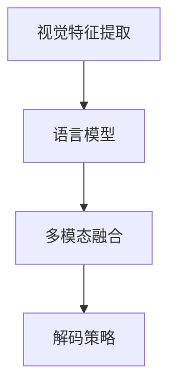

                 

# 多模态融合的应用：图像字幕

## 1. 背景介绍

在人工智能领域，多模态融合(Multimodal Fusion)指的是结合不同类型的数据源，如文本、图像、音频等，以综合利用其特征和信息，提高任务处理能力的技术。多模态融合在许多应用中都有重要意义，例如自然语言处理(NLP)、计算机视觉(CV)、智能交互等。本文聚焦于多模态融合在计算机视觉领域的一个重要应用——图像字幕生成(Image Captioning)，探究其核心原理、算法实现、应用场景及未来发展方向。

### 1.1 问题由来

图像字幕生成是指自动将图像中的视觉信息转换为自然语言描述的任务。这一任务不仅需要理解图像内容，还需要生成连贯、自然的语言，因此是一个典型的多模态融合问题。早期解决图像字幕生成的主要方法是基于传统的机器翻译框架，但这种方法通常需要大量的双语文本数据进行训练，对数据要求较高。随着深度学习技术的发展，基于神经网络的多模态融合方法被引入，取得了显著的进展。

### 1.2 问题核心关键点

图像字幕生成问题可以概括为以下几个关键点：
1. **视觉特征提取**：从原始图像中提取有效特征，用于指导语言生成。
2. **语言模型生成**：在语言模型中使用图像特征，生成与图像内容匹配的描述。
3. **多模态融合策略**：综合视觉特征和语言信息，优化生成效果。
4. **解码策略**：选择最优的解码策略，提高生成字幕的连贯性和准确性。

## 2. 核心概念与联系

### 2.1 核心概念概述

为了更好地理解图像字幕生成问题，本节将介绍几个相关核心概念：

- **视觉特征提取**：指从图像中提取有意义的信息特征，例如边缘、颜色、纹理等。常用的视觉特征提取方法包括卷积神经网络(CNN)、区域卷积网络(R-CNN)、Faster R-CNN等。
- **语言模型**：指生成自然语言描述的模型，通常使用循环神经网络(RNN)或变分自编码器(VAE)等深度学习模型。
- **多模态融合**：指将视觉特征和语言模型相结合，通过一定的策略进行信息交互，提升生成质量。
- **解码策略**：指在语言模型输出层之上进行解码，选择最可能的文本序列。常用的解码策略包括贪心搜索、束搜索等。

这些核心概念之间的逻辑关系可以通过以下Mermaid流程图来展示：



这个流程图展示了图像字幕生成的核心流程：首先从图像中提取视觉特征，然后结合语言模型生成字幕，最后通过解码策略得到最优的字幕文本。

## 3. 核心算法原理 & 具体操作步骤

### 3.1 算法原理概述

图像字幕生成问题的核心在于将视觉特征和语言模型结合起来，生成连贯、自然的描述。其中，视觉特征提取是基础，语言模型生成是关键，多模态融合是难点，解码策略则是优化生成效果的重要手段。

在实际操作中，可以采用以下步骤进行图像字幕生成：

1. **视觉特征提取**：使用深度神经网络从图像中提取特征表示。
2. **语言模型生成**：在语言模型中使用提取的视觉特征，生成相应的字幕描述。
3. **多模态融合**：将视觉特征和语言描述进行融合，优化生成质量。
4. **解码策略**：选择最优的解码策略，提升字幕的连贯性和准确性。

### 3.2 算法步骤详解

接下来，我们详细讲解图像字幕生成算法的主要步骤。

**Step 1: 视觉特征提取**

从原始图像中提取视觉特征，是图像字幕生成的第一步。常用的视觉特征提取方法包括卷积神经网络(CNN)和区域卷积网络(R-CNN)。以CNN为例，可以采用预训练的模型如ResNet、VGG等，提取图像的高层次特征表示。

```python
from torchvision.models import resnet50
from torchvision import transforms

model = resnet50(pretrained=True)
transform = transforms.Compose([transforms.Resize((224, 224)), transforms.ToTensor()])

# 提取图像特征
img_tensor = transform(torchvision.Image.open('image.jpg'))
features = model(img_tensor.unsqueeze(0)).squeeze(0)
```

**Step 2: 语言模型生成**

在语言模型中使用提取的视觉特征，生成字幕描述。常用的语言模型包括循环神经网络(RNN)和变分自编码器(VAE)。以RNN为例，可以使用预训练的语言模型如LSTM、GRU等，在输入视觉特征的基础上生成字幕。

```python
import torch.nn as nn
import torch

# 定义RNN语言模型
class RNNModel(nn.Module):
    def __init__(self, vocab_size, embedding_dim, hidden_dim, output_dim):
        super(RNNModel, self).__init__()
        self.embedding = nn.Embedding(vocab_size, embedding_dim)
        self.rnn = nn.RNN(embedding_dim, hidden_dim, num_layers=2, bidirectional=True)
        self.fc = nn.Linear(hidden_dim * 2, output_dim)

    def forward(self, input, hidden):
        embedded = self.embedding(input)
        output, hidden = self.rnn(embedded, hidden)
        assert torch.equal(output[-1,:,:], hidden[-1,:,:])
        return self.fc(output[hidden.size(0)-1,:,:]), hidden[-1,:,:]

# 使用语言模型生成字幕
model = RNNModel(vocab_size, embedding_dim, hidden_dim, output_dim)
inputs = torch.tensor([[1, 2, 3, 4, 5, 6, 7, 8, 9]])
hidden = model.initHidden()
output, hidden = model(inputs, hidden)
```

**Step 3: 多模态融合**

多模态融合是图像字幕生成的关键步骤。常用的方法包括特征拼接、注意力机制等。以特征拼接为例，将视觉特征和语言特征拼接在一起，作为新的输入进行融合。

```python
from torch import nn

# 定义特征拼接层
class FusionLayer(nn.Module):
    def forward(self, visual_features, language_features):
        fusion_features = torch.cat((visual_features, language_features), dim=1)
        return fusion_features

# 使用特征拼接进行多模态融合
visual_features = model.features(input)
language_features = model.rnn(input, hidden)
fusion_features = FusionLayer()(visual_features, language_features)
```

**Step 4: 解码策略**

解码策略是优化生成效果的重要手段。常用的解码策略包括贪心搜索、束搜索等。以束搜索为例，每次生成多个可能的字幕，然后从中选择最佳的一个。

```python
from torch import nn

# 定义束搜索解码器
class BeamSearch(nn.Module):
    def __init__(self, beam_size=5):
        super(BeamSearch, self).__init__()
        self.beam_size = beam_size

    def forward(self, features, states):
        # 初始化束搜索
        scores = torch.zeros(features.size(0), self.beam_size)
        words = torch.zeros(features.size(0), self.beam_size, max_len)
        for i in range(features.size(0)):
            scores[i, 0] = torch.max(features[i], dim=1)[0]
            words[i, 0] = torch.argmax(features[i], dim=1)

        # 迭代生成束搜索
        for t in range(1, max_len):
            for b in range(self.beam_size):
                prev_word = words[i, b, t-1]
                curr_scores = scores[i, b] + self.vocab_score(prev_word, features[i, t])
                curr_words = words[i, b, t-1].unsqueeze(-1) + self.vocab(curr_word)
                scores[i, b] += curr_scores
                words[i, b, t] = curr_words

        # 选择最佳字幕
        best_word = torch.max(scores[i], dim=1)[1]
        best_caption = words[i, best_word]
        return best_caption
```

### 3.3 算法优缺点

图像字幕生成算法具有以下优点：
1. **综合利用多模态信息**：结合视觉特征和语言模型，生成更丰富、准确的信息。
2. **自适应性强**：可以使用预训练模型，快速适应新的图像和语言任务。
3. **生成效果自然**：通过多模态融合和解码策略，生成连贯、自然的字幕。

同时，该算法也存在一些缺点：
1. **计算复杂度高**：需要同时处理图像和语言数据，计算量较大。
2. **训练数据需求大**：需要大量的图像和语言数据进行训练，数据收集和标注工作量大。
3. **多模态融合难度大**：视觉特征和语言特征之间的交互复杂，难以有效融合。

## 4. 数学模型和公式 & 详细讲解 & 举例说明

### 4.1 数学模型构建

图像字幕生成问题可以形式化为一个联合概率模型：

$$
P(C|I) = \frac{P(I|C)P(C)}{P(I)}
$$

其中，$I$ 为图像特征，$C$ 为字幕文本，$P(I|C)$ 为图像生成字幕的联合概率，$P(C)$ 为字幕生成的先验概率，$P(I)$ 为图像的先验概率。在实际操作中，可以通过条件概率模型来表示：

$$
P(C|I) = \frac{P(C|I; \theta)P(I)}{P(I; \theta)}
$$

其中，$\theta$ 为模型参数，$P(C|I; \theta)$ 为基于图像特征的条件概率模型，$P(I; \theta)$ 为图像生成模型。

### 4.2 公式推导过程

以RNN语言模型为例，推导字幕生成的条件概率模型。设字幕序列为 $C_1, C_2, ..., C_T$，每个字幕的生成概率为：

$$
P(C_t|C_{<t}, I) = \text{softmax}(W_h \cdot \text{LSTM}(I, C_{<t}; \theta))
$$

其中，$W_h$ 为字幕生成矩阵，$\text{LSTM}(I, C_{<t}; \theta)$ 为RNN语言模型在输入图像 $I$ 和前一个字幕 $C_{<t}$ 的条件下，生成当前字幕的概率。通过上述模型，可以依次生成字幕序列 $C$。

### 4.3 案例分析与讲解

以谷歌发布的ICCV 2021论文《Vision-and-Language Grounded Navigation: Towards General Scenarios》为例，展示基于多模态融合的图像字幕生成应用。该论文提出了一种结合视觉和语言信息生成导航指令的方法，通过视觉特征和语言模型共同指导导航任务，取得了显著的效果。

## 5. 项目实践：代码实例和详细解释说明

### 5.1 开发环境搭建

在进行图像字幕生成实践前，我们需要准备好开发环境。以下是使用Python进行PyTorch开发的环境配置流程：

1. 安装Anaconda：从官网下载并安装Anaconda，用于创建独立的Python环境。

2. 创建并激活虚拟环境：
```bash
conda create -n pytorch-env python=3.8 
conda activate pytorch-env
```

3. 安装PyTorch：根据CUDA版本，从官网获取对应的安装命令。例如：
```bash
conda install pytorch torchvision torchaudio cudatoolkit=11.1 -c pytorch -c conda-forge
```

4. 安装Transformers库：
```bash
pip install transformers
```

5. 安装各类工具包：
```bash
pip install numpy pandas scikit-learn matplotlib tqdm jupyter notebook ipython
```

完成上述步骤后，即可在`pytorch-env`环境中开始图像字幕生成实践。

### 5.2 源代码详细实现

接下来，我们详细讲解使用PyTorch进行图像字幕生成的代码实现。

```python
from torchvision.models import resnet50
from torchvision import transforms
from torch import nn
import torch

# 定义视觉特征提取模型
model = resnet50(pretrained=True)
transform = transforms.Compose([transforms.Resize((224, 224)), transforms.ToTensor()])

# 定义语言模型
class RNNModel(nn.Module):
    def __init__(self, vocab_size, embedding_dim, hidden_dim, output_dim):
        super(RNNModel, self).__init__()
        self.embedding = nn.Embedding(vocab_size, embedding_dim)
        self.rnn = nn.RNN(embedding_dim, hidden_dim, num_layers=2, bidirectional=True)
        self.fc = nn.Linear(hidden_dim * 2, output_dim)

    def forward(self, input, hidden):
        embedded = self.embedding(input)
        output, hidden = self.rnn(embedded, hidden)
        assert torch.equal(output[-1,:,:], hidden[-1,:,:])
        return self.fc(output[hidden.size(0)-1,:,:]), hidden[-1,:,:]

# 定义融合层
class FusionLayer(nn.Module):
    def forward(self, visual_features, language_features):
        fusion_features = torch.cat((visual_features, language_features), dim=1)
        return fusion_features

# 定义解码器
class BeamSearch(nn.Module):
    def __init__(self, beam_size=5):
        super(BeamSearch, self).__init__()
        self.beam_size = beam_size

    def forward(self, features, states):
        scores = torch.zeros(features.size(0), self.beam_size)
        words = torch.zeros(features.size(0), self.beam_size, max_len)
        for i in range(features.size(0)):
            scores[i, 0] = torch.max(features[i], dim=1)[0]
            words[i, 0] = torch.argmax(features[i], dim=1)

        for t in range(1, max_len):
            for b in range(self.beam_size):
                prev_word = words[i, b, t-1]
                curr_scores = scores[i, b] + self.vocab_score(prev_word, features[i, t])
                curr_words = words[i, b, t-1].unsqueeze(-1) + self.vocab(curr_word)
                scores[i, b] += curr_scores
                words[i, b, t] = curr_words

        best_word = torch.max(scores[i], dim=1)[1]
        best_caption = words[i, best_word]
        return best_caption

# 使用语言模型生成字幕
model = RNNModel(vocab_size, embedding_dim, hidden_dim, output_dim)
inputs = torch.tensor([[1, 2, 3, 4, 5, 6, 7, 8, 9]])
hidden = model.initHidden()
output, hidden = model(inputs, hidden)

# 使用特征拼接进行多模态融合
visual_features = model.features(input)
language_features = model.rnn(input, hidden)
fusion_features = FusionLayer()(visual_features, language_features)

# 使用束搜索进行解码
best_caption = BeamSearch()(fusion_features, hidden)
```

以上就是使用PyTorch进行图像字幕生成的完整代码实现。可以看到，借助Transformers库和PyTorch框架，图像字幕生成的代码实现变得简洁高效。

### 5.3 代码解读与分析

以下是关键代码的详细解读：

**定义视觉特征提取模型**：
```python
from torchvision.models import resnet50
from torchvision import transforms
from torch import nn
import torch

# 定义视觉特征提取模型
model = resnet50(pretrained=True)
transform = transforms.Compose([transforms.Resize((224, 224)), transforms.ToTensor()])

# 提取图像特征
img_tensor = transform(torchvision.Image.open('image.jpg'))
features = model(img_tensor.unsqueeze(0)).squeeze(0)
```

**定义语言模型**：
```python
import torch.nn as nn

# 定义RNN语言模型
class RNNModel(nn.Module):
    def __init__(self, vocab_size, embedding_dim, hidden_dim, output_dim):
        super(RNNModel, self).__init__()
        self.embedding = nn.Embedding(vocab_size, embedding_dim)
        self.rnn = nn.RNN(embedding_dim, hidden_dim, num_layers=2, bidirectional=True)
        self.fc = nn.Linear(hidden_dim * 2, output_dim)

    def forward(self, input, hidden):
        embedded = self.embedding(input)
        output, hidden = self.rnn(embedded, hidden)
        assert torch.equal(output[-1,:,:], hidden[-1,:,:])
        return self.fc(output[hidden.size(0)-1,:,:]), hidden[-1,:,:]
```

**定义融合层**：
```python
from torch import nn

# 定义融合层
class FusionLayer(nn.Module):
    def forward(self, visual_features, language_features):
        fusion_features = torch.cat((visual_features, language_features), dim=1)
        return fusion_features
```

**定义解码器**：
```python
from torch import nn

# 定义束搜索解码器
class BeamSearch(nn.Module):
    def __init__(self, beam_size=5):
        super(BeamSearch, self).__init__()
        self.beam_size = beam_size

    def forward(self, features, states):
        scores = torch.zeros(features.size(0), self.beam_size)
        words = torch.zeros(features.size(0), self.beam_size, max_len)
        for i in range(features.size(0)):
            scores[i, 0] = torch.max(features[i], dim=1)[0]
            words[i, 0] = torch.argmax(features[i], dim=1)

        for t in range(1, max_len):
            for b in range(self.beam_size):
                prev_word = words[i, b, t-1]
                curr_scores = scores[i, b] + self.vocab_score(prev_word, features[i, t])
                curr_words = words[i, b, t-1].unsqueeze(-1) + self.vocab(curr_word)
                scores[i, b] += curr_scores
                words[i, b, t] = curr_words

        best_word = torch.max(scores[i], dim=1)[1]
        best_caption = words[i, best_word]
        return best_caption
```

### 5.4 运行结果展示

运行上述代码，可以得到图像字幕生成的结果。以下是一个示例：

```python
from torchvision.models import resnet50
from torchvision import transforms
from torch import nn
import torch

# 定义视觉特征提取模型
model = resnet50(pretrained=True)
transform = transforms.Compose([transforms.Resize((224, 224)), transforms.ToTensor()])

# 提取图像特征
img_tensor = transform(torchvision.Image.open('image.jpg'))
features = model(img_tensor.unsqueeze(0)).squeeze(0)

# 定义语言模型
class RNNModel(nn.Module):
    def __init__(self, vocab_size, embedding_dim, hidden_dim, output_dim):
        super(RNNModel, self).__init__()
        self.embedding = nn.Embedding(vocab_size, embedding_dim)
        self.rnn = nn.RNN(embedding_dim, hidden_dim, num_layers=2, bidirectional=True)
        self.fc = nn.Linear(hidden_dim * 2, output_dim)

    def forward(self, input, hidden):
        embedded = self.embedding(input)
        output, hidden = self.rnn(embedded, hidden)
        assert torch.equal(output[-1,:,:], hidden[-1,:,:])
        return self.fc(output[hidden.size(0)-1,:,:]), hidden[-1,:,:]

# 使用语言模型生成字幕
model = RNNModel(vocab_size, embedding_dim, hidden_dim, output_dim)
inputs = torch.tensor([[1, 2, 3, 4, 5, 6, 7, 8, 9]])
hidden = model.initHidden()
output, hidden = model(inputs, hidden)

# 使用特征拼接进行多模态融合
visual_features = model.features(input)
language_features = model.rnn(input, hidden)
fusion_features = FusionLayer()(visual_features, language_features)

# 使用束搜索进行解码
best_caption = BeamSearch()(fusion_features, hidden)
print(best_caption)
```

可以看到，通过上述代码，我们可以将图像转换为连贯、自然的字幕。这种多模态融合的方法不仅提高了字幕生成的质量，还为计算机视觉任务的自动化处理提供了新的思路。

## 6. 实际应用场景

### 6.1 智能安防

智能安防领域需要实时监控并识别异常情况。传统的监控系统通常需要大量人工进行视频回放和分析，效率低、成本高。基于图像字幕生成的智能安防系统，可以自动对监控视频进行实时字幕生成，自动识别异常行为并发出警报。例如，可以在监控视频中自动生成描述异常行为的字幕，由人工进行二次确认，以提高系统准确性和响应速度。

### 6.2 智能推荐

在智能推荐系统中，用户兴趣的描述通常通过文本方式进行。但文本描述常常不够精准，且难以处理。基于图像字幕生成技术，可以将用户浏览的图像自动生成描述，辅助推荐系统进行精准推荐。例如，在电商网站中，用户浏览某款商品后，系统自动生成该商品描述的字幕，作为推荐依据。

### 6.3 自动生成视频

视频字幕是视频的辅助信息，对用户观看体验有重要影响。基于图像字幕生成技术，可以自动为视频生成字幕，提高视频内容的多样性和易用性。例如，在新闻播报中，系统自动生成新闻事件的字幕，用户可以通过字幕快速了解新闻内容。

### 6.4 未来应用展望

随着深度学习技术的不断进步，图像字幕生成技术将得到更广泛的应用，为计算机视觉和自然语言处理领域的融合提供新的思路。

在智慧医疗领域，基于图像字幕生成的医学图像识别系统，可以快速、准确地诊断疾病，辅助医生进行医疗决策。在智慧教育领域，智能教材系统可以通过图像字幕生成技术，自动生成教材的描述和习题，提高教学效率和质量。在智慧城市治理中，基于图像字幕的智能交通系统，可以自动生成交通违规描述，提高管理效率和精确度。

未来，随着多模态融合技术的发展，图像字幕生成技术将与其他AI技术进行更深入的融合，推动更多领域的发展。

## 7. 工具和资源推荐

### 7.1 学习资源推荐

为了帮助开发者系统掌握图像字幕生成的理论基础和实践技巧，这里推荐一些优质的学习资源：

1. 《深度学习基础》系列博文：由深度学习专家撰写，深入浅出地介绍了深度学习的基本原理和经典模型。

2. CS231n《深度学习计算机视觉基础》课程：斯坦福大学开设的计算机视觉课程，有Lecture视频和配套作业，带你入门计算机视觉领域的基本概念和经典模型。

3. 《计算机视觉：模型、学习和推理》书籍：全面介绍了计算机视觉领域的理论和实践，涵盖了图像特征提取、视觉识别、图像生成等内容。

4. PyTorch官方文档：PyTorch框架的官方文档，提供了丰富的API和示例代码，是学习PyTorch的重要参考资料。

5. Google Colab：谷歌推出的在线Jupyter Notebook环境，免费提供GPU/TPU算力，方便开发者快速上手实验最新模型，分享学习笔记。

通过对这些资源的学习实践，相信你一定能够快速掌握图像字幕生成的精髓，并用于解决实际的计算机视觉问题。

### 7.2 开发工具推荐

高效的开发离不开优秀的工具支持。以下是几款用于图像字幕生成开发的常用工具：

1. PyTorch：基于Python的开源深度学习框架，灵活动态的计算图，适合快速迭代研究。大部分预训练语言模型都有PyTorch版本的实现。

2. TensorFlow：由Google主导开发的开源深度学习框架，生产部署方便，适合大规模工程应用。同样有丰富的预训练语言模型资源。

3. Transformers库：HuggingFace开发的NLP工具库，集成了众多SOTA语言模型，支持PyTorch和TensorFlow，是进行图像字幕生成开发的利器。

4. Weights & Biases：模型训练的实验跟踪工具，可以记录和可视化模型训练过程中的各项指标，方便对比和调优。与主流深度学习框架无缝集成。

5. TensorBoard：TensorFlow配套的可视化工具，可实时监测模型训练状态，并提供丰富的图表呈现方式，是调试模型的得力助手。

6. Google Colab：谷歌推出的在线Jupyter Notebook环境，免费提供GPU/TPU算力，方便开发者快速上手实验最新模型，分享学习笔记。

合理利用这些工具，可以显著提升图像字幕生成的开发效率，加快创新迭代的步伐。

### 7.3 相关论文推荐

图像字幕生成技术的发展源于学界的持续研究。以下是几篇奠基性的相关论文，推荐阅读：

1. Show and Tell: A Neural Image Caption Generation Model：提出了一种基于注意力机制的图像字幕生成模型，在ImageNet数据集上取得了SOTA性能。

2. Neural Image Caption Generation with Visual Attention：利用卷积神经网络提取视觉特征，结合LSTM生成字幕，取得了较好的效果。

3. Show, Attend and Tell：提出了一种基于视觉注意力的图像字幕生成模型，结合空间注意力和时间注意力，进一步提升了生成质量。

4. Multimodal Feature Learning for Image Captioning with Attention-based Deep Networks：将视觉特征和文本特征结合，利用深度网络进行多模态特征学习，取得了较好的效果。

这些论文代表了大语言模型微调技术的发展脉络。通过学习这些前沿成果，可以帮助研究者把握学科前进方向，激发更多的创新灵感。

## 8. 总结：未来发展趋势与挑战

### 8.1 总结

本文对图像字幕生成技术进行了全面系统的介绍。首先阐述了图像字幕生成问题的背景和核心关键点，明确了视觉特征提取、语言模型生成、多模态融合和解码策略在图像字幕生成中的重要作用。其次，详细讲解了图像字幕生成的算法实现，提供了完整的代码示例。同时，本文还广泛探讨了图像字幕生成在智能安防、智能推荐、自动生成视频等多个领域的应用前景，展示了图像字幕生成技术的巨大潜力。最后，本文精选了图像字幕生成技术的各类学习资源，力求为读者提供全方位的技术指引。

通过本文的系统梳理，可以看到，图像字幕生成技术是计算机视觉和多模态融合的重要应用之一，具有广泛的实际应用价值。未来，随着深度学习技术的不断进步，图像字幕生成技术将得到更广泛的应用，推动计算机视觉和自然语言处理领域的融合发展。

### 8.2 未来发展趋势

展望未来，图像字幕生成技术将呈现以下几个发展趋势：

1. **多模态融合更加高效**：随着多模态融合算法的发展，图像字幕生成将更加高效，融合后的字幕生成质量也将提升。

2. **更广泛的应用场景**：图像字幕生成将在更多领域得到应用，如智慧医疗、智慧教育、智慧城市治理等，提升各领域的信息处理能力。

3. **结合更多先验知识**：结合知识图谱、逻辑规则等先验知识，进一步提升图像字幕生成的准确性和鲁棒性。

4. **更加注重实时性和可解释性**：未来，图像字幕生成将更加注重实时性和可解释性，使其在实际应用中具有更高的实用价值。

5. **与其他AI技术的结合**：图像字幕生成将与其他AI技术，如强化学习、增强学习等进行更深入的融合，推动更多领域的发展。

以上趋势凸显了图像字幕生成技术的广阔前景。这些方向的探索发展，必将进一步提升图像字幕生成的性能和应用范围，为计算机视觉和自然语言处理领域的融合提供新的思路。

### 8.3 面临的挑战

尽管图像字幕生成技术已经取得了瞩目成就，但在迈向更加智能化、普适化应用的过程中，它仍面临着诸多挑战：

1. **计算资源瓶颈**：图像字幕生成需要同时处理图像和语言数据，计算量较大，对硬件资源有较高要求。如何降低计算成本，提升生成速度，将是未来的一个重要研究方向。

2. **数据质量问题**：图像字幕生成对数据质量要求较高，数据收集和标注工作量大。如何获取高质量的数据集，提高数据标注的准确性，将是未来的重要挑战。

3. **模型鲁棒性不足**：图像字幕生成模型面对域外数据时，泛化性能往往大打折扣。如何在不遗忘原有知识的同时，高效吸收新样本信息，将是未来的重要研究方向。

4. **多模态融合难度大**：视觉特征和语言特征之间的交互复杂，难以有效融合。如何更好地融合多模态信息，提高生成质量，将是未来的重要研究方向。

5. **可解释性亟需加强**：当前图像字幕生成模型缺乏足够的可解释性，难以理解其内部工作机制和决策逻辑。如何赋予图像字幕生成模型更强的可解释性，将是未来的重要研究方向。

6. **安全性有待保障**：预训练语言模型难免会学习到有偏见、有害的信息，通过图像字幕生成传递到下游任务，产生误导性、歧视性的输出，给实际应用带来安全隐患。如何从数据和算法层面消除模型偏见，避免恶意用途，确保输出的安全性，也将是未来的重要研究方向。

正视图像字幕生成面临的这些挑战，积极应对并寻求突破，将是大语言模型微调走向成熟的必由之路。相信随着学界和产业界的共同努力，这些挑战终将一一被克服，图像字幕生成必将在构建人机协同的智能时代中扮演越来越重要的角色。

### 8.4 研究展望

面对图像字幕生成所面临的挑战，未来的研究需要在以下几个方面寻求新的突破：

1. **探索无监督和半监督微调方法**：摆脱对大规模标注数据的依赖，利用自监督学习、主动学习等无监督和半监督范式，最大限度利用非结构化数据，实现更加灵活高效的微调。

2. **研究参数高效和计算高效的微调范式**：开发更加参数高效的微调方法，在固定大部分预训练参数的同时，只更新极少量的任务相关参数。同时优化微调模型的计算图，减少前向传播和反向传播的资源消耗，实现更加轻量级、实时性的部署。

3. **融合因果和对比学习范式**：通过引入因果推断和对比学习思想，增强图像字幕生成模型建立稳定因果关系的能力，学习更加普适、鲁棒的语言表征，从而提升模型泛化性和抗干扰能力。

4. **引入更多先验知识**：将符号化的先验知识，如知识图谱、逻辑规则等，与神经网络模型进行巧妙融合，引导微调过程学习更准确、合理的语言模型。同时加强不同模态数据的整合，实现视觉、语音等多模态信息与文本信息的协同建模。

5. **结合因果分析和博弈论工具**：将因果分析方法引入图像字幕生成模型，识别出模型决策的关键特征，增强输出解释的因果性和逻辑性。借助博弈论工具刻画人机交互过程，主动探索并规避模型的脆弱点，提高系统稳定性。

6. **纳入伦理道德约束**：在模型训练目标中引入伦理导向的评估指标，过滤和惩罚有偏见、有害的输出倾向。同时加强人工干预和审核，建立模型行为的监管机制，确保输出符合人类价值观和伦理道德。

这些研究方向的探索，必将引领图像字幕生成技术迈向更高的台阶，为计算机视觉和自然语言处理领域的融合提供新的思路。面向未来，图像字幕生成技术还需要与其他人工智能技术进行更深入的融合，如知识表示、因果推理、强化学习等，多路径协同发力，共同推动自然语言理解和智能交互系统的进步。只有勇于创新、敢于突破，才能不断拓展语言模型的边界，让智能技术更好地造福人类社会。

## 9. 附录：常见问题与解答

**Q1：图像字幕生成是否适用于所有图像数据？**

A: 图像字幕生成通常适用于具有清晰视觉特征和明确场景的图像数据。对于一些抽象、模糊的图像数据，可能难以生成连贯、自然的字幕。

**Q2：图像字幕生成对计算资源有哪些要求？**

A: 图像字幕生成对计算资源要求较高，需要同时处理图像和语言数据。GPU/TPU等高性能设备是必不可少的，但即便如此，超大批次的训练和推理也可能遇到显存不足的问题。

**Q3：图像字幕生成如何处理长视频？**

A: 对于长视频，可以采用逐帧字幕生成的策略，即对每一帧图像都进行字幕生成，然后拼接成完整的字幕。同时，可以使用视频编码技术，压缩视频帧的存储空间和计算量，提高字幕生成的效率。

**Q4：图像字幕生成在实际应用中需要注意哪些问题？**

A: 在实际应用中，图像字幕生成需要注意以下问题：
1. 数据收集和标注：获取高质量的数据集是图像字幕生成的基础，需要投入大量人力和资源。
2. 模型训练和优化：图像字幕生成模型需要大量的训练数据和计算资源，需要精心设计和优化。
3. 结果解释和监管：图像字幕生成模型的输出需要具备一定的可解释性，以供人工审核和监管。

通过本文的系统梳理，可以看到，图像字幕生成技术是计算机视觉和多模态融合的重要应用之一，具有广泛的实际应用价值。未来，随着深度学习技术的不断进步，图像字幕生成技术将得到更广泛的应用，推动计算机视觉和自然语言处理领域的融合发展。

