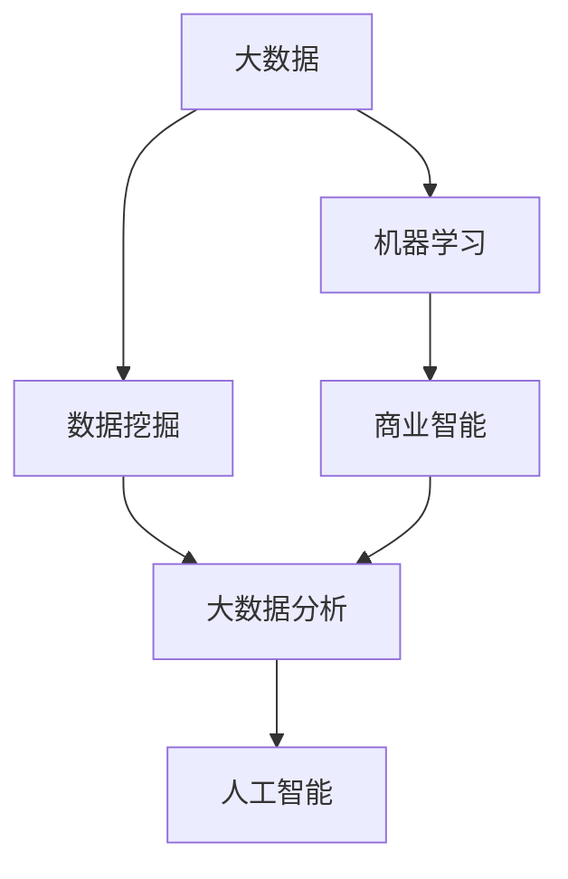

                 

# 大数据创业：洞察未来的商业智慧

## 1. 背景介绍

### 1.1 问题由来

当前，随着数字化进程的加快和互联网技术的不断进步，大数据已经成为了各个行业关注的焦点。大数据不仅可以帮助企业提高决策效率、优化资源配置，还能够在个性化推荐、精准营销、金融风控等领域创造巨大价值。然而，大数据的复杂性和多样性也带来了诸多挑战，如数据安全、数据处理效率、数据价值挖掘等问题。

### 1.2 问题核心关键点

大数据创业的核心在于如何高效利用海量数据，挖掘数据背后的商业价值，构建具有竞争力的数据驱动型业务。当前，大数据创业面临的主要问题包括：

- 数据获取和处理：如何高效获取高质量的数据，并将其转化为可供分析利用的数据集。
- 数据存储与管理：如何高效存储和处理海量数据，避免数据丢失和冗余。
- 数据挖掘与分析：如何从数据中挖掘出有价值的信息，生成商业洞察。
- 数据应用与落地：如何将数据价值转化为实际的商业应用，实现业务创新和转型。

这些问题不仅需要专业的技术手段解决，还需要跨领域、跨学科的协作。因此，探索和解决这些问题，将对大数据创业的成败具有重要影响。

## 2. 核心概念与联系

### 2.1 核心概念概述

为更好地理解大数据创业的过程，本节将介绍几个密切相关的核心概念：

- 大数据（Big Data）：指规模巨大、多样性广泛、高速流动的数据集，通常具有“3V”特性：Volume（体积大）、Velocity（速度快）、Variety（多样性）。
- 数据挖掘（Data Mining）：指从海量数据中发现隐藏在其中的有价值信息、知识、规律的过程。
- 机器学习（Machine Learning）：指让计算机通过数据学习，自动改进算法，从而实现智能决策。
- 商业智能（Business Intelligence, BI）：指利用数据分析、可视化等技术，为商业决策提供支持。
- 大数据分析（Big Data Analytics）：指对大规模数据集进行清洗、转换、分析，以获得商业洞察和决策支持。
- 人工智能（Artificial Intelligence, AI）：指模拟人类智能，使计算机具备感知、理解、学习和执行任务的能力。

这些核心概念之间的逻辑关系可以通过以下Mermaid流程图来展示：



这个流程图展示了大数据创业的核心概念及其之间的关系：

1. 大数据是数据挖掘、机器学习和人工智能的基础。
2. 数据挖掘和机器学习通过数据驱动，提升大数据分析的效率和效果。
3. 商业智能通过可视化和决策支持，将数据分析结果转化为商业价值。
4. 人工智能技术在大数据场景下，进一步提升了数据处理和分析的智能化水平。

## 3. 核心算法原理 & 具体操作步骤
### 3.1 算法原理概述

大数据创业的核心算法原理可以概括为以下几个方面：

- **数据采集**：通过爬虫、API、传感器等多种方式，高效、准确地获取数据。
- **数据清洗与预处理**：对数据进行去重、去噪、格式转换等预处理操作，确保数据的准确性和一致性。
- **数据存储与管理**：使用分布式文件系统、数据库等技术，高效存储和管理海量数据。
- **数据挖掘与分析**：应用机器学习算法和统计方法，挖掘数据中的模式、趋势和关联。
- **数据可视化和报告**：通过图表、仪表盘等手段，将分析结果可视化，提供直观的商业洞察。
- **决策支持**：利用商业智能系统，生成可操作的商业建议和决策支持。

### 3.2 算法步骤详解

大数据创业的一般步骤包括：

1. **需求分析**：明确业务目标和需求，确定数据采集和分析的范围。
2. **数据采集与清洗**：确定数据源，使用爬虫、API等技术采集数据，进行预处理。
3. **数据存储与管理**：选择合适的大数据存储技术，设计数据模型，优化存储结构。
4. **数据挖掘与分析**：选择合适的机器学习算法，对数据进行特征工程和模型训练，生成商业洞察。
5. **数据可视化和报告**：使用数据可视化工具，将分析结果展示出来，生成报告和仪表盘。
6. **决策支持**：利用商业智能系统，将分析结果转化为可操作的商业决策。

### 3.3 算法优缺点

大数据创业的算法具有以下优点：

- **高效性**：通过自动化数据处理和分析，大幅提高了数据处理的效率和准确性。
- **智能化**：利用机器学习和人工智能技术，提升了数据分析的智能化水平，生成更加精准的商业洞察。
- **可扩展性**：大数据技术具备良好的可扩展性，可以处理大规模数据，适应快速变化的商业环境。

同时，这些算法也存在一些局限性：

- **技术复杂性**：大数据技术涉及多种技术栈和工具，需要专业团队进行维护和管理。
- **数据隐私和安全**：在数据采集和存储过程中，需要严格遵守数据隐私和安全法规。
- **数据质量和一致性**：数据的准确性和一致性直接影响分析结果，需要严格的数据清洗和预处理。

### 3.4 算法应用领域

大数据创业的应用领域非常广泛，涵盖了多个行业：

- **金融**：通过大数据分析，提升金融风险控制、客户行为分析、产品推荐等能力。
- **电商**：通过大数据分析，优化库存管理、个性化推荐、精准营销等业务。
- **医疗**：通过大数据分析，提高疾病预测、治疗方案推荐、患者管理等医疗水平。
- **物流**：通过大数据分析，优化运输路线、仓储管理、供应链管理等流程。
- **营销**：通过大数据分析，提升市场洞察、品牌管理、客户细分等营销效果。

## 4. 数学模型和公式 & 详细讲解 & 举例说明
### 4.1 数学模型构建

在大数据创业中，常用的数学模型包括：

- **回归模型**：用于预测连续型变量，如房价、销售量等。
- **分类模型**：用于预测离散型变量，如客户是否购买、是否流失等。
- **聚类模型**：用于将数据集分成不同的类别，如客户细分、产品分组等。
- **时间序列模型**：用于预测未来趋势，如股票价格、销售增长等。

### 4.2 公式推导过程

以回归模型为例，假设有一个线性回归模型：

$$ y = \beta_0 + \beta_1 x_1 + \beta_2 x_2 + \cdots + \beta_n x_n + \epsilon $$

其中 $y$ 为目标变量，$x_i$ 为自变量，$\beta_i$ 为回归系数，$\epsilon$ 为误差项。

假设我们有 $n$ 个样本数据 $(x_{ij}, y_i), i=1,2,\ldots,n$，则最小二乘估计的回归系数可以通过求解最小化损失函数：

$$ \min_{\beta_0,\beta_1,\ldots,\beta_n} \sum_{i=1}^n (y_i - \beta_0 - \beta_1 x_{1i} - \cdots - \beta_n x_{ni})^2 $$

求解上述最小化问题，得到回归系数的估计值。

### 4.3 案例分析与讲解

以电商领域的销售预测为例，假设需要预测某产品的月销售量。数据集包含历史销售数据和相关特征，如季节、节假日、促销活动等。

首先，对数据进行清洗和预处理，包括缺失值处理、异常值检测、特征工程等。然后，构建线性回归模型，选择相关特征，训练模型并预测未来销售量。

具体步骤如下：

1. **数据清洗与预处理**：对销售数据进行缺失值处理，删除异常值，并生成季节、节假日等特征。
2. **特征选择**：选择相关特征，如季节、促销活动、节假日等。
3. **模型训练**：构建线性回归模型，使用历史数据训练模型。
4. **预测与验证**：使用训练好的模型预测未来销售量，并进行交叉验证，评估模型性能。

## 5. 项目实践：代码实例和详细解释说明
### 5.1 开发环境搭建

在进行大数据创业实践前，我们需要准备好开发环境。以下是使用Python进行PyTorch开发的环境配置流程：

1. 安装Anaconda：从官网下载并安装Anaconda，用于创建独立的Python环境。

2. 创建并激活虚拟环境：
```bash
conda create -n pytorch-env python=3.8 
conda activate pytorch-env
```

3. 安装PyTorch：根据CUDA版本，从官网获取对应的安装命令。例如：
```bash
conda install pytorch torchvision torchaudio cudatoolkit=11.1 -c pytorch -c conda-forge
```

4. 安装各类工具包：
```bash
pip install numpy pandas scikit-learn matplotlib tqdm jupyter notebook ipython
```

完成上述步骤后，即可在`pytorch-env`环境中开始大数据创业实践。

### 5.2 源代码详细实现

这里我们以电商领域的销售预测为例，给出使用PyTorch进行线性回归的PyTorch代码实现。

首先，定义模型和损失函数：

```python
import torch
import torch.nn as nn
import torch.optim as optim

class LinearRegression(nn.Module):
    def __init__(self, input_dim):
        super(LinearRegression, self).__init__()
        self.linear = nn.Linear(input_dim, 1)
    
    def forward(self, x):
        return self.linear(x)

criterion = nn.MSELoss()
```

然后，定义训练和评估函数：

```python
from torch.utils.data import DataLoader
from tqdm import tqdm

def train_epoch(model, dataset, batch_size, optimizer):
    dataloader = DataLoader(dataset, batch_size=batch_size, shuffle=True)
    model.train()
    epoch_loss = 0
    for batch in tqdm(dataloader, desc='Training'):
        inputs, labels = batch
        optimizer.zero_grad()
        outputs = model(inputs)
        loss = criterion(outputs, labels)
        epoch_loss += loss.item()
        loss.backward()
        optimizer.step()
    return epoch_loss / len(dataloader)

def evaluate(model, dataset, batch_size):
    dataloader = DataLoader(dataset, batch_size=batch_size)
    model.eval()
    preds, labels = [], []
    with torch.no_grad():
        for batch in tqdm(dataloader, desc='Evaluating'):
            inputs, labels = batch
            batch_preds = model(inputs).detach().cpu().numpy()
            batch_labels = labels.cpu().numpy()
            for pred, label in zip(batch_preds, batch_labels):
                preds.append(pred[0])
                labels.append(label[0])
                
    print('MSE:', np.mean((np.array(preds) - np.array(labels))**2))
```

最后，启动训练流程并在测试集上评估：

```python
epochs = 100
batch_size = 64

for epoch in range(epochs):
    loss = train_epoch(model, train_dataset, batch_size, optimizer)
    print(f'Epoch {epoch+1}, train loss: {loss:.3f}')
    
    print(f'Epoch {epoch+1}, dev MSE:')
    evaluate(model, dev_dataset, batch_size)
    
print('Final dev MSE:')
evaluate(model, test_dataset, batch_size)
```

以上就是使用PyTorch进行线性回归的完整代码实现。可以看到，通过PyTorch库的封装，我们可以用相对简洁的代码完成线性回归模型的训练和评估。

### 5.3 代码解读与分析

让我们再详细解读一下关键代码的实现细节：

**LinearRegression类**：
- `__init__`方法：初始化线性回归模型，定义一个线性层，将输入映射到输出。
- `forward`方法：前向传播，输入经过线性层映射为输出。

**train_epoch函数**：
- 使用PyTorch的DataLoader对数据集进行批次化加载，供模型训练使用。
- 在每个批次上前向传播计算损失函数，并反向传播更新模型参数，最后返回该epoch的平均loss。

**evaluate函数**：
- 与训练类似，不同点在于不更新模型参数，并在每个batch结束后将预测和标签结果存储下来，最后使用MSE计算评估指标。

**训练流程**：
- 定义总的epoch数和batch size，开始循环迭代
- 每个epoch内，先在训练集上训练，输出平均loss
- 在验证集上评估，输出MSE
- 所有epoch结束后，在测试集上评估，给出最终测试结果

可以看到，PyTorch配合TensorFlow库使得大数据创业的代码实现变得简洁高效。开发者可以将更多精力放在数据处理、模型改进等高层逻辑上，而不必过多关注底层的实现细节。

当然，工业级的系统实现还需考虑更多因素，如模型的保存和部署、超参数的自动搜索、更灵活的任务适配层等。但核心的数据处理和模型训练过程基本与此类似。

## 6. 实际应用场景
### 6.1 智能客服系统

大数据创业技术可以广泛应用于智能客服系统的构建。传统客服往往需要配备大量人力，高峰期响应缓慢，且一致性和专业性难以保证。通过大数据创业技术，可以构建智能客服系统，提升客服效率和用户体验。

在技术实现上，可以收集企业内部的历史客服对话记录，对客户问题进行分类和聚类，识别出常见问题和客户细分，然后利用机器学习算法训练模型，生成智能客服机器人。智能客服机器人可以根据客户输入，快速匹配相似问题和解答，提高响应速度和准确性。

### 6.2 金融舆情监测

金融机构需要实时监测市场舆论动向，以便及时应对负面信息传播，规避金融风险。大数据创业技术可以应用于金融舆情监测，提升金融机构的风险控制能力。

具体而言，可以收集金融领域相关的新闻、报道、评论等文本数据，使用自然语言处理技术进行情感分析和主题分析，识别出市场情绪变化和热点事件，然后利用机器学习算法训练模型，预测市场风险，生成预警报告。金融机构可以根据预警报告，采取相应的风险控制措施，避免潜在风险。

### 6.3 个性化推荐系统

当前的推荐系统往往只依赖用户的历史行为数据进行物品推荐，无法深入理解用户的真实兴趣偏好。大数据创业技术可以应用于个性化推荐系统，提升推荐效果和用户满意度。

在实践中，可以收集用户浏览、点击、评论、分享等行为数据，提取和用户交互的物品标题、描述、标签等文本内容。使用机器学习算法训练模型，分析用户兴趣和行为特征，生成个性化推荐列表，满足用户的多样化需求。

### 6.4 未来应用展望

随着大数据创业技术的不断发展，未来的应用场景将更加广泛，如智慧城市治理、智慧医疗、智慧制造等。大数据创业技术将与物联网、区块链、人工智能等技术深度融合，推动各行各业的数字化转型和智能化升级。

## 7. 工具和资源推荐
### 7.1 学习资源推荐

为了帮助开发者系统掌握大数据创业的理论基础和实践技巧，这里推荐一些优质的学习资源：

1. 《大数据分析与挖掘》系列书籍：系统介绍了大数据分析的基本概念、技术和方法，适合入门学习和深入研究。
2. Coursera《Applied Data Science with Python》课程：由Johns Hopkins University开设的大数据创业课程，涵盖数据清洗、特征工程、模型训练等核心内容。
3. Kaggle数据竞赛平台：提供大量真实世界的数据集和竞赛题目，可以锻炼数据处理和分析能力，学习前沿技术。
4. PyTorch官方文档：详细介绍了PyTorch库的使用方法，包括数据处理、模型构建、训练和评估等环节。
5. HuggingFace官方文档：详细介绍了Transformers库的使用方法，支持多种NLP任务，包括文本分类、序列标注、文本生成等。

通过对这些资源的学习实践，相信你一定能够快速掌握大数据创业的精髓，并用于解决实际的NLP问题。
###  7.2 开发工具推荐

高效的开发离不开优秀的工具支持。以下是几款用于大数据创业开发的常用工具：

1. Python：广泛应用的数据科学语言，拥有丰富的第三方库和工具支持。
2. PyTorch：基于Python的开源深度学习框架，支持分布式计算和自动微分，适合大数据创业任务。
3. TensorFlow：由Google主导开发的开源深度学习框架，支持GPU/TPU加速，适合大规模工程应用。
4. Apache Hadoop和Spark：大数据处理和计算框架，支持分布式存储和计算，适合大规模数据处理。
5. Apache Kafka和Flink：数据流处理框架，支持实时数据采集和处理，适合大数据创业中的数据流处理。
6. Jupyter Notebook：开源的交互式计算环境，支持多种编程语言和库，适合快速迭代和实验。

合理利用这些工具，可以显著提升大数据创业任务的开发效率，加快创新迭代的步伐。

### 7.3 相关论文推荐

大数据创业技术的不断发展源于学界的持续研究。以下是几篇奠基性的相关论文，推荐阅读：

1. 《Big Data: Principles and Best Practices of Scalable Realtime Data Systems》：斯坦福大学BigData小组的综述论文，系统介绍了大数据处理的基本概念和技术。
2. 《Hadoop: The Ultimate Big Data Solution》：Hadoop官方文档，详细介绍了Hadoop生态系统的架构和使用方法。
3. 《Big Data Mining: Statistical Learning Methods》：统计学习领域的经典书籍，介绍了大数据挖掘的基本方法和技术。
4. 《Data Science for Business》：Foster教授的商务数据分析课程，涵盖数据清洗、特征工程、模型训练等核心内容。
5. 《Deep Learning》：Ian Goodfellow的深度学习教材，介绍了深度学习的基本概念和算法，包括回归、分类、聚类等任务。

这些论文代表了大数据创业技术的发展脉络。通过学习这些前沿成果，可以帮助研究者把握学科前进方向，激发更多的创新灵感。

## 8. 总结：未来发展趋势与挑战
### 8.1 总结

本文对大数据创业的过程进行了全面系统的介绍。首先阐述了大数据创业的背景和意义，明确了大数据创业的核心目标和方法。其次，从原理到实践，详细讲解了大数据创业的数学模型和核心步骤，给出了大数据创业任务开发的完整代码实例。同时，本文还广泛探讨了大数据创业技术在多个行业领域的应用前景，展示了大数据创业技术的巨大潜力。

通过本文的系统梳理，可以看到，大数据创业技术正在成为各行各业的重要工具，极大地提升了数据分析和决策的效率和效果。未来，伴随大数据技术的持续演进，大数据创业必将在更多领域大放异彩，深刻影响人类的生产生活方式。

### 8.2 未来发展趋势

展望未来，大数据创业技术将呈现以下几个发展趋势：

1. **数据获取和处理**：数据获取方式将更加多样化，如物联网、传感器数据、社交媒体等，数据处理技术也将更加智能化和自动化。
2. **数据存储与管理**：分布式存储和计算技术将不断优化，数据治理和安全管理将更加完善。
3. **数据挖掘与分析**：大数据分析技术将与人工智能深度融合，提升数据挖掘的智能化水平，生成更加精准的商业洞察。
4. **数据可视化和报告**：数据可视化技术将更加便捷和灵活，生成更加直观的商业洞察和决策支持。
5. **决策支持**：商业智能系统将更加智能化和个性化，生成更加可操作的商业建议和决策支持。

以上趋势凸显了大数据创业技术的广阔前景。这些方向的探索发展，必将进一步提升数据分析和决策的效率和效果，为各行各业提供更加智能和高效的数据驱动型业务。

### 8.3 面临的挑战

尽管大数据创业技术已经取得了瞩目成就，但在迈向更加智能化、普适化应用的过程中，它仍面临着诸多挑战：

1. **数据隐私和安全**：在数据采集和存储过程中，需要严格遵守数据隐私和安全法规。
2. **数据质量和一致性**：数据的准确性和一致性直接影响分析结果，需要严格的数据清洗和预处理。
3. **技术复杂性**：大数据技术涉及多种技术栈和工具，需要专业团队进行维护和管理。
4. **计算资源成本**：大数据处理和计算需要大量的计算资源，成本较高。
5. **数据流动性**：数据的流动性需要考虑实时性和延迟性，确保数据的实时性和可靠性。

这些挑战需要在未来的研究中进一步解决，以推动大数据创业技术的进一步发展。

### 8.4 研究展望

未来，大数据创业技术还需要在以下几个方面寻求新的突破：

1. **数据采集和处理自动化**：开发自动化的数据采集和处理工具，提升数据处理的效率和准确性。
2. **数据治理和安全**：开发数据治理和安全管理工具，确保数据隐私和安全。
3. **智能分析**：利用人工智能技术，提升数据挖掘的智能化水平，生成更加精准的商业洞察。
4. **数据可视化**：开发更加灵活和互动的数据可视化工具，提升数据洞察的直观性和易用性。
5. **数据驱动决策**：开发数据驱动的决策支持系统，提升决策的科学性和可操作性。

这些方向的探索，将进一步提升大数据创业技术的价值和应用范围，为各行各业提供更加智能和高效的数据驱动型业务。总之，大数据创业技术需要通过跨领域、跨学科的协作，不断创新和突破，才能真正实现其商业价值和社会效益。

## 9. 附录：常见问题与解答

**Q1：大数据创业是否适用于所有行业？**

A: 大数据创业技术适用于绝大多数行业，但不同行业的业务需求和数据特点各不相同。需要根据具体行业特点，选择合适的数据源和分析方法。

**Q2：大数据创业需要哪些关键技术？**

A: 大数据创业需要以下关键技术：
1. 数据采集：通过爬虫、API、传感器等技术，高效获取数据。
2. 数据清洗与预处理：对数据进行去重、去噪、格式转换等预处理操作。
3. 数据存储与管理：使用分布式文件系统、数据库等技术，高效存储和管理海量数据。
4. 数据挖掘与分析：应用机器学习算法和统计方法，挖掘数据中的模式、趋势和关联。
5. 数据可视化和报告：使用数据可视化工具，将分析结果展示出来，生成报告和仪表盘。
6. 决策支持：利用商业智能系统，生成可操作的商业建议和决策支持。

**Q3：大数据创业如何应对数据隐私和安全问题？**

A: 大数据创业需要严格遵守数据隐私和安全法规，保护用户数据隐私和安全。具体措施包括：
1. 数据匿名化：通过数据匿名化技术，保护用户隐私。
2. 数据加密：对数据进行加密存储和传输，防止数据泄露。
3. 访问控制：设置数据访问权限，限制数据访问范围。
4. 安全审计：定期进行安全审计，发现和修复安全漏洞。

**Q4：大数据创业如何提升数据处理效率？**

A: 大数据创业需要提升数据处理效率，主要措施包括：
1. 分布式计算：使用分布式计算框架，如Hadoop、Spark等，提升数据处理效率。
2. 数据压缩：使用数据压缩技术，减少数据存储和传输的体积和成本。
3. 数据缓存：使用数据缓存技术，减少数据读取和处理的延迟。
4. 自动化工具：开发自动化的数据处理工具，提升数据处理的效率和准确性。

**Q5：大数据创业如何提升数据分析效果？**

A: 大数据创业需要提升数据分析效果，主要措施包括：
1. 数据预处理：对数据进行去重、去噪、格式转换等预处理操作，确保数据的准确性和一致性。
2. 特征工程：进行数据特征提取和选择，提升数据建模效果。
3. 模型选择：选择合适的机器学习模型，提升数据挖掘效果。
4. 模型优化：通过超参数调优、模型融合等方法，提升模型效果。

这些关键技术和大数据分析方法，是实现大数据创业成功的基石。通过系统的学习、实践和创新，相信你一定能够掌握大数据创业的精髓，并用于解决实际的NLP问题。

---

作者：禅与计算机程序设计艺术 / Zen and the Art of Computer Programming

