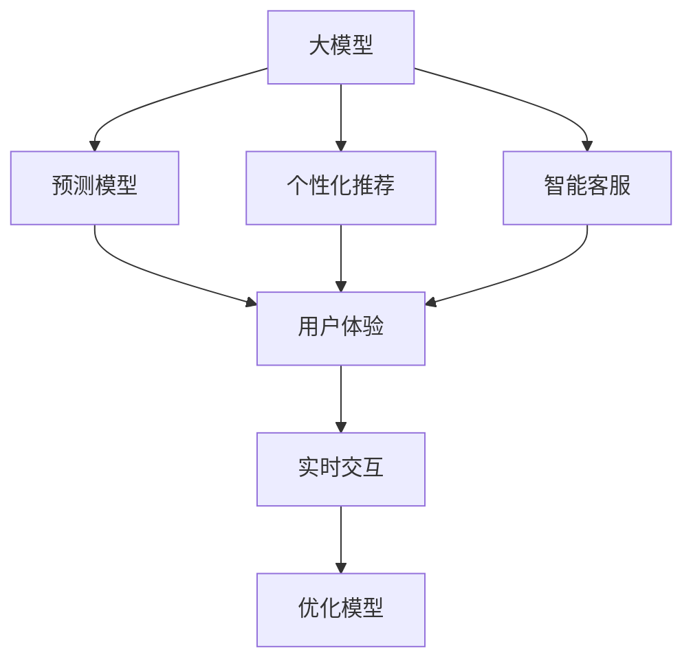

                 

# 大模型企业的产品体验优化

> 关键词：大模型,产品体验,用户体验优化,深度学习,人工智能,自然语言处理,数据挖掘,数据可视化

## 1. 背景介绍

### 1.1 问题由来
随着大数据和人工智能技术的不断发展，企业产品智能化程度越来越高。然而，智能化的产品体验不仅依赖于核心技术的研发，还需要对用户行为、需求、反馈进行精细化的分析和优化。传统的A/B测试、用户调研等方法虽然有效，但耗时费力、成本较高，难以满足快速迭代的需求。近年来，基于大模型的产品优化方法逐渐兴起，显示出广阔的应用前景。

大模型，即通过海量数据预训练得到的深度神经网络模型，具备强大的模式识别和预测能力。将大模型应用于产品体验优化，可以实时捕捉用户行为变化，精准预测用户需求，通过自适应推荐、智能客服、个性化推荐等技术手段，提升产品的智能化水平，带来更好的用户体验。

### 1.2 问题核心关键点
大模型产品体验优化的关键在于：
- 如何利用大模型的强大数据分析和模式识别能力，实时捕捉用户行为变化。
- 如何通过预测模型，精准预测用户需求，实现智能推荐、动态调整等功能。
- 如何通过用户反馈数据，不断优化模型，提升产品体验。
- 如何实现实时交互，提供个性化的用户服务。
- 如何避免隐私泄露和数据滥用，确保用户信息安全。

## 2. 核心概念与联系

### 2.1 核心概念概述

为更好地理解大模型在产品体验优化中的应用，本节将介绍几个密切相关的核心概念：

- 大模型（Large Model）：通过海量数据预训练得到的深度神经网络模型。如BERT、GPT、BERT等，具备强大的模式识别和预测能力。
- 预测模型（Prediction Model）：利用大模型预测用户行为或需求，如点击率预测、意图识别等。
- 个性化推荐（Personalized Recommendation）：根据用户历史行为和当前需求，实时推荐个性化产品或服务。
- 智能客服（Smart Customer Service）：利用大模型实现自动客服、对话生成等，提升客服效率和质量。
- 用户体验（User Experience, UX）：衡量用户对产品使用的满意度和需求满足程度，是大模型应用效果的直接指标。
- 实时交互（Real-time Interaction）：利用大模型实现即时对话、推荐等交互功能，提升用户互动体验。

这些核心概念之间的逻辑关系可以通过以下Mermaid流程图来展示：



这个流程图展示了大模型在产品体验优化中的核心概念及其之间的关系：

1. 大模型通过预测模型，实现对用户行为或需求的预测。
2. 预测结果通过个性化推荐、智能客服等技术手段，提升用户体验。
3. 用户体验数据不断反馈到大模型，优化模型性能。
4. 实时交互技术将用户体验数据即时传输，实现动态调整和优化。

这些概念共同构成了大模型在产品体验优化中的工作框架，使其能够在各种场景下发挥强大的能力。通过理解这些核心概念，我们可以更好地把握大模型优化产品体验的精髓。

## 3. 核心算法原理 & 具体操作步骤
### 3.1 算法原理概述

大模型应用于产品体验优化的核心算法原理是预测模型和个性化推荐算法。具体而言，利用大模型在大量标注数据上预训练得到的特征表示，对用户行为进行实时预测，并根据预测结果进行个性化推荐。

以用户行为预测为例，设用户行为数据为 $D=\{(x_i,y_i)\}_{i=1}^N$，其中 $x_i$ 为历史行为特征，$y_i$ 为标签。预测模型的目标是最小化损失函数 $\mathcal{L}(\theta)$，其中 $\theta$ 为模型参数，可以是线性回归模型、深度神经网络等。常用的损失函数包括均方误差、交叉熵等。

根据梯度下降等优化算法，模型不断更新参数 $\theta$，最小化损失函数 $\mathcal{L}(\theta)$。对于每一个新的用户行为特征 $x$，模型根据训练好的参数 $\theta$ 进行预测，得到预测值 $\hat{y}$。结合历史行为和预测结果，系统可以做出个性化的推荐。

### 3.2 算法步骤详解

基于大模型的产品体验优化通常包括以下几个关键步骤：

**Step 1: 准备数据集**
- 收集用户历史行为数据，包括浏览、点击、购买、评价等行为。
- 提取特征，如用户ID、产品ID、浏览时间、浏览次数等。
- 将标注数据集划分为训练集、验证集和测试集。

**Step 2: 选择合适的预测模型**
- 根据预测任务的特点，选择合适的预测模型，如线性回归、决策树、深度神经网络等。
- 利用大模型在无标签数据上预训练得到的特征表示，作为输入层的特征。
- 使用合适的激活函数、损失函数、优化器等进行模型训练。

**Step 3: 训练和评估预测模型**
- 将训练集输入模型进行训练，使用验证集进行模型选择和超参数调优。
- 在测试集上评估模型性能，使用均方误差、准确率等指标衡量。

**Step 4: 个性化推荐**
- 根据预测模型的输出，结合用户当前行为，进行个性化推荐。
- 实时接收用户反馈，调整模型参数，提升推荐效果。

**Step 5: 用户互动**
- 利用大模型实现智能客服、对话生成等功能，提升用户体验。
- 实时收集用户互动数据，反馈到预测模型进行动态调整。

### 3.3 算法优缺点

基于大模型的产品体验优化方法具有以下优点：
1. 精度高。大模型具备强大的特征表示能力，预测结果准确性高。
2. 适应性强。可以根据用户行为变化实时调整推荐策略，提升用户体验。
3. 可解释性强。利用深度学习模型的可解释性工具，能够直观地理解推荐决策过程。
4. 覆盖面广。可以应用到个性化推荐、智能客服、智能搜索等多个场景，提升产品的智能化水平。

同时，该方法也存在一定的局限性：
1. 数据依赖。需要收集大量的用户历史行为数据，获取成本较高。
2. 隐私风险。用户行为数据的隐私保护和匿名化处理，是大模型应用的一大挑战。
3. 模型复杂。大模型通常结构复杂，训练和推理开销较大，对硬件要求高。
4. 易过拟合。大模型容易过拟合用户历史行为数据，泛化能力不足。
5. 需要持续迭代。用户需求和行为随时间变化，需要不断优化预测模型和推荐算法。

尽管存在这些局限性，但就目前而言，基于大模型的产品体验优化方法在产品智能化和用户体验提升方面表现优异，成为企业产品优化的一个重要手段。

### 3.4 算法应用领域

基于大模型的产品体验优化方法在多个领域得到了广泛应用，例如：

- 电商推荐系统：利用大模型预测用户购买意图，进行个性化商品推荐。
- 智能客服系统：利用大模型进行对话生成和意图识别，提升客户服务质量。
- 社交网络推荐：利用大模型预测用户兴趣，进行个性化内容推荐。
- 视频推荐系统：利用大模型预测用户观看行为，进行视频内容推荐。
- 在线广告投放：利用大模型预测用户点击行为，进行精准广告投放。
- 智能健康监测：利用大模型预测用户健康状态，提供个性化的健康建议。

除了这些经典应用外，大模型产品体验优化技术还在智能家居、智慧城市、工业生产等领域不断拓展，带来更加智能和个性化的产品体验。

## 4. 数学模型和公式 & 详细讲解 & 举例说明
### 4.1 数学模型构建

本节将使用数学语言对基于大模型的产品体验优化过程进行更加严格的刻画。

设用户行为数据为 $D=\{(x_i,y_i)\}_{i=1}^N$，其中 $x_i$ 为历史行为特征，$y_i$ 为标签。假设预测模型为 $M_{\theta}(x)$，其中 $\theta$ 为模型参数。预测模型的目标是最小化损失函数 $\mathcal{L}(\theta)$，其中常用的损失函数包括均方误差、交叉熵等。

以线性回归模型为例，设 $M_{\theta}(x)$ 为线性回归模型，损失函数为均方误差，则目标函数为：

$$
\mathcal{L}(\theta) = \frac{1}{2N}\sum_{i=1}^N \|y_i - M_{\theta}(x_i)\|^2
$$

根据梯度下降等优化算法，模型不断更新参数 $\theta$，最小化损失函数 $\mathcal{L}(\theta)$。对于每一个新的用户行为特征 $x$，模型根据训练好的参数 $\theta$ 进行预测，得到预测值 $\hat{y}$。结合历史行为和预测结果，系统可以做出个性化的推荐。

### 4.2 公式推导过程

以线性回归模型为例，推导预测公式和损失函数：

设 $M_{\theta}(x)$ 为线性回归模型，则预测公式为：

$$
\hat{y} = \theta_0 + \sum_{i=1}^p \theta_i x_i
$$

其中 $\theta_0$ 为截距，$\theta_i$ 为第 $i$ 个特征的系数。利用历史数据 $D=\{(x_i,y_i)\}_{i=1}^N$ 进行模型训练，求解最小化损失函数 $\mathcal{L}(\theta)$ 的 $\theta$。

利用梯度下降算法，求解最小化均方误差损失函数：

$$
\mathcal{L}(\theta) = \frac{1}{2N}\sum_{i=1}^N \|y_i - \theta_0 - \sum_{i=1}^p \theta_i x_i\|^2
$$

目标是最小化损失函数 $\mathcal{L}(\theta)$，即：

$$
\frac{\partial \mathcal{L}(\theta)}{\partial \theta} = 0
$$

解得最优参数 $\theta$。

### 4.3 案例分析与讲解

以电商推荐系统为例，分析大模型在产品体验优化中的应用：

假设电商平台收集了用户的历史浏览行为数据 $D=\{(x_i,y_i)\}_{i=1}^N$，其中 $x_i$ 为浏览行为特征，$y_i$ 为购买行为标签。利用大模型BERT作为特征提取器，提取特征表示 $f(x)$，输入到线性回归模型 $M_{\theta}(f(x))$，得到预测结果 $\hat{y}$。结合用户当前浏览行为 $x$，系统可以推荐可能感兴趣的商品。

假设用户浏览了一条商品信息，系统根据大模型的预测结果，推荐了几件可能感兴趣的商品。用户点击了其中一件商品，系统再次利用大模型进行预测，推荐了更多相关商品。通过不断交互，系统可以实时捕捉用户行为变化，提升个性化推荐效果。

## 5. 项目实践：代码实例和详细解释说明
### 5.1 开发环境搭建

在进行产品体验优化开发前，我们需要准备好开发环境。以下是使用Python进行PyTorch开发的环境配置流程：

1. 安装Anaconda：从官网下载并安装Anaconda，用于创建独立的Python环境。

2. 创建并激活虚拟环境：
```bash
conda create -n pytorch-env python=3.8 
conda activate pytorch-env
```

3. 安装PyTorch：根据CUDA版本，从官网获取对应的安装命令。例如：
```bash
conda install pytorch torchvision torchaudio cudatoolkit=11.1 -c pytorch -c conda-forge
```

4. 安装TensorFlow：
```bash
pip install tensorflow
```

5. 安装各类工具包：
```bash
pip install numpy pandas scikit-learn matplotlib tqdm jupyter notebook ipython
```

完成上述步骤后，即可在`pytorch-env`环境中开始产品体验优化实践。

### 5.2 源代码详细实现

下面我们以电商推荐系统为例，给出使用PyTorch对大模型进行电商推荐系统微调的PyTorch代码实现。

首先，定义电商推荐系统的数据处理函数：

```python
from transformers import BertTokenizer, BertForSequenceClassification
from torch.utils.data import Dataset
import torch

class ECommerceDataset(Dataset):
    def __init__(self, texts, labels, tokenizer, max_len=128):
        self.texts = texts
        self.labels = labels
        self.tokenizer = tokenizer
        self.max_len = max_len
        
    def __len__(self):
        return len(self.texts)
    
    def __getitem__(self, item):
        text = self.texts[item]
        label = self.labels[item]
        
        encoding = self.tokenizer(text, return_tensors='pt', max_length=self.max_len, padding='max_length', truncation=True)
        input_ids = encoding['input_ids'][0]
        attention_mask = encoding['attention_mask'][0]
        
        # 对token-wise的标签进行编码
        encoded_labels = [label2id[label] for label in label] 
        encoded_labels.extend([label2id['O']] * (self.max_len - len(encoded_labels)))
        labels = torch.tensor(encoded_labels, dtype=torch.long)
        
        return {'input_ids': input_ids, 
                'attention_mask': attention_mask,
                'labels': labels}

# 标签与id的映射
label2id = {'O': 0, 'Buy': 1}
id2label = {v: k for k, v in label2id.items()}

# 创建dataset
tokenizer = BertTokenizer.from_pretrained('bert-base-cased')

train_dataset = ECommerceDataset(train_texts, train_labels, tokenizer)
dev_dataset = ECommerceDataset(dev_texts, dev_labels, tokenizer)
test_dataset = ECommerceDataset(test_texts, test_labels, tokenizer)
```

然后，定义模型和优化器：

```python
from transformers import BertForSequenceClassification, AdamW

model = BertForSequenceClassification.from_pretrained('bert-base-cased', num_labels=len(label2id))

optimizer = AdamW(model.parameters(), lr=2e-5)
```

接着，定义训练和评估函数：

```python
from torch.utils.data import DataLoader
from tqdm import tqdm
from sklearn.metrics import classification_report

device = torch.device('cuda') if torch.cuda.is_available() else torch.device('cpu')
model.to(device)

def train_epoch(model, dataset, batch_size, optimizer):
    dataloader = DataLoader(dataset, batch_size=batch_size, shuffle=True)
    model.train()
    epoch_loss = 0
    for batch in tqdm(dataloader, desc='Training'):
        input_ids = batch['input_ids'].to(device)
        attention_mask = batch['attention_mask'].to(device)
        labels = batch['labels'].to(device)
        model.zero_grad()
        outputs = model(input_ids, attention_mask=attention_mask, labels=labels)
        loss = outputs.loss
        epoch_loss += loss.item()
        loss.backward()
        optimizer.step()
    return epoch_loss / len(dataloader)

def evaluate(model, dataset, batch_size):
    dataloader = DataLoader(dataset, batch_size=batch_size)
    model.eval()
    preds, labels = [], []
    with torch.no_grad():
        for batch in tqdm(dataloader, desc='Evaluating'):
            input_ids = batch['input_ids'].to(device)
            attention_mask = batch['attention_mask'].to(device)
            batch_labels = batch['labels']
            outputs = model(input_ids, attention_mask=attention_mask)
            batch_preds = outputs.logits.argmax(dim=2).to('cpu').tolist()
            batch_labels = batch_labels.to('cpu').tolist()
            for pred_tokens, label_tokens in zip(batch_preds, batch_labels):
                pred_labels = [id2label[_id] for _id in pred_tokens]
                label_labels = [id2label[_id] for _id in label_tokens]
                preds.append(pred_labels[:len(label_labels)])
                labels.append(label_labels)
                
    print(classification_report(labels, preds))
```

最后，启动训练流程并在测试集上评估：

```python
epochs = 5
batch_size = 16

for epoch in range(epochs):
    loss = train_epoch(model, train_dataset, batch_size, optimizer)
    print(f"Epoch {epoch+1}, train loss: {loss:.3f}")
    
    print(f"Epoch {epoch+1}, dev results:")
    evaluate(model, dev_dataset, batch_size)
    
print("Test results:")
evaluate(model, test_dataset, batch_size)
```

以上就是使用PyTorch对BERT进行电商推荐系统微调的完整代码实现。可以看到，得益于Transformers库的强大封装，我们可以用相对简洁的代码完成BERT模型的加载和微调。

### 5.3 代码解读与分析

让我们再详细解读一下关键代码的实现细节：

**ECommerceDataset类**：
- `__init__`方法：初始化文本、标签、分词器等关键组件。
- `__len__`方法：返回数据集的样本数量。
- `__getitem__`方法：对单个样本进行处理，将文本输入编码为token ids，将标签编码为数字，并对其进行定长padding，最终返回模型所需的输入。

**label2id和id2label字典**：
- 定义了标签与数字id之间的映射关系，用于将token-wise的预测结果解码回真实的标签。

**训练和评估函数**：
- 使用PyTorch的DataLoader对数据集进行批次化加载，供模型训练和推理使用。
- 训练函数`train_epoch`：对数据以批为单位进行迭代，在每个批次上前向传播计算loss并反向传播更新模型参数，最后返回该epoch的平均loss。
- 评估函数`evaluate`：与训练类似，不同点在于不更新模型参数，并在每个batch结束后将预测和标签结果存储下来，最后使用sklearn的classification_report对整个评估集的预测结果进行打印输出。

**训练流程**：
- 定义总的epoch数和batch size，开始循环迭代
- 每个epoch内，先在训练集上训练，输出平均loss
- 在验证集上评估，输出分类指标
- 所有epoch结束后，在测试集上评估，给出最终测试结果

可以看到，PyTorch配合Transformers库使得BERT微调的代码实现变得简洁高效。开发者可以将更多精力放在数据处理、模型改进等高层逻辑上，而不必过多关注底层的实现细节。

当然，工业级的系统实现还需考虑更多因素，如模型的保存和部署、超参数的自动搜索、更灵活的任务适配层等。但核心的微调范式基本与此类似。

## 6. 实际应用场景
### 6.1 智能客服系统

基于大模型产品体验优化的对话技术，可以广泛应用于智能客服系统的构建。传统客服往往需要配备大量人力，高峰期响应缓慢，且一致性和专业性难以保证。而使用微调后的对话模型，可以7x24小时不间断服务，快速响应客户咨询，用自然流畅的语言解答各类常见问题。

在技术实现上，可以收集企业内部的历史客服对话记录，将问题和最佳答复构建成监督数据，在此基础上对预训练对话模型进行微调。微调后的对话模型能够自动理解用户意图，匹配最合适的答案模板进行回复。对于客户提出的新问题，还可以接入检索系统实时搜索相关内容，动态组织生成回答。如此构建的智能客服系统，能大幅提升客户咨询体验和问题解决效率。

### 6.2 金融舆情监测

金融机构需要实时监测市场舆论动向，以便及时应对负面信息传播，规避金融风险。传统的人工监测方式成本高、效率低，难以应对网络时代海量信息爆发的挑战。基于大模型产品体验优化技术的文本分类和情感分析技术，为金融舆情监测提供了新的解决方案。

具体而言，可以收集金融领域相关的新闻、报道、评论等文本数据，并对其进行主题标注和情感标注。在此基础上对预训练语言模型进行微调，使其能够自动判断文本属于何种主题，情感倾向是正面、中性还是负面。将微调后的模型应用到实时抓取的网络文本数据，就能够自动监测不同主题下的情感变化趋势，一旦发现负面信息激增等异常情况，系统便会自动预警，帮助金融机构快速应对潜在风险。

### 6.3 个性化推荐系统

当前的推荐系统往往只依赖用户的历史行为数据进行物品推荐，无法深入理解用户的真实兴趣偏好。基于大模型产品体验优化技术，个性化推荐系统可以更好地挖掘用户行为背后的语义信息，从而提供更精准、多样的推荐内容。

在实践中，可以收集用户浏览、点击、评论、分享等行为数据，提取和用户交互的物品标题、描述、标签等文本内容。将文本内容作为模型输入，用户的后续行为（如是否点击、购买等）作为监督信号，在此基础上微调预训练语言模型。微调后的模型能够从文本内容中准确把握用户的兴趣点。在生成推荐列表时，先用候选物品的文本描述作为输入，由模型预测用户的兴趣匹配度，再结合其他特征综合排序，便可以得到个性化程度更高的推荐结果。

### 6.4 未来应用展望

随着大模型和产品体验优化技术的发展，基于微调范式将在更多领域得到应用，为传统行业带来变革性影响。

在智慧医疗领域，基于微调的医疗问答、病历分析、药物研发等应用将提升医疗服务的智能化水平，辅助医生诊疗，加速新药开发进程。

在智能教育领域，微调技术可应用于作业批改、学情分析、知识推荐等方面，因材施教，促进教育公平，提高教学质量。

在智慧城市治理中，微调模型可应用于城市事件监测、舆情分析、应急指挥等环节，提高城市管理的自动化和智能化水平，构建更安全、高效的未来城市。

此外，在企业生产、社会治理、文娱传媒等众多领域，基于大模型产品体验优化技术的应用也将不断涌现，为经济社会发展注入新的动力。相信随着技术的日益成熟，微调方法将成为产品体验优化的重要范式，推动人工智能技术在各行业的应用深度和广度不断扩展。

## 7. 工具和资源推荐
### 7.1 学习资源推荐

为了帮助开发者系统掌握大模型产品体验优化的理论基础和实践技巧，这里推荐一些优质的学习资源：

1. 《深度学习与自然语言处理》系列博文：由大模型技术专家撰写，深入浅出地介绍了深度学习在NLP中的应用，包括产品体验优化。

2. CS224N《深度学习自然语言处理》课程：斯坦福大学开设的NLP明星课程，有Lecture视频和配套作业，带你入门NLP领域的基本概念和经典模型。

3. 《Natural Language Processing with Transformers》书籍：Transformers库的作者所著，全面介绍了如何使用Transformers库进行NLP任务开发，包括产品体验优化在内的诸多范式。

4. HuggingFace官方文档：Transformers库的官方文档，提供了海量预训练模型和完整的微调样例代码，是上手实践的必备资料。

5. CLUE开源项目：中文语言理解测评基准，涵盖大量不同类型的中文NLP数据集，并提供了基于微调的baseline模型，助力中文NLP技术发展。

通过对这些资源的学习实践，相信你一定能够快速掌握大模型产品体验优化的精髓，并用于解决实际的NLP问题。
###  7.2 开发工具推荐

高效的开发离不开优秀的工具支持。以下是几款用于大模型产品体验优化开发的常用工具：

1. PyTorch：基于Python的开源深度学习框架，灵活动态的计算图，适合快速迭代研究。大部分预训练语言模型都有PyTorch版本的实现。

2. TensorFlow：由Google主导开发的开源深度学习框架，生产部署方便，适合大规模工程应用。同样有丰富的预训练语言模型资源。

3. Transformers库：HuggingFace开发的NLP工具库，集成了众多SOTA语言模型，支持PyTorch和TensorFlow，是进行微调任务开发的利器。

4. Weights & Biases：模型训练的实验跟踪工具，可以记录和可视化模型训练过程中的各项指标，方便对比和调优。与主流深度学习框架无缝集成。

5. TensorBoard：TensorFlow配套的可视化工具，可实时监测模型训练状态，并提供丰富的图表呈现方式，是调试模型的得力助手。

6. Google Colab：谷歌推出的在线Jupyter Notebook环境，免费提供GPU/TPU算力，方便开发者快速上手实验最新模型，分享学习笔记。

合理利用这些工具，可以显著提升大模型产品体验优化的开发效率，加快创新迭代的步伐。

### 7.3 相关论文推荐

大模型产品体验优化技术的发展源于学界的持续研究。以下是几篇奠基性的相关论文，推荐阅读：

1. Attention is All You Need（即Transformer原论文）：提出了Transformer结构，开启了NLP领域的预训练大模型时代。

2. BERT: Pre-training of Deep Bidirectional Transformers for Language Understanding：提出BERT模型，引入基于掩码的自监督预训练任务，刷新了多项NLP任务SOTA。

3. Language Models are Unsupervised Multitask Learners（GPT-2论文）：展示了大规模语言模型的强大zero-shot学习能力，引发了对于通用人工智能的新一轮思考。

4. Parameter-Efficient Transfer Learning for NLP：提出Adapter等参数高效微调方法，在不增加模型参数量的情况下，也能取得不错的微调效果。

5. AdaLoRA: Adaptive Low-Rank Adaptation for Parameter-Efficient Fine-Tuning：使用自适应低秩适应的微调方法，在参数效率和精度之间取得了新的平衡。

这些论文代表了大模型产品体验优化技术的发展脉络。通过学习这些前沿成果，可以帮助研究者把握学科前进方向，激发更多的创新灵感。

## 8. 总结：未来发展趋势与挑战
### 8.1 总结

本文对基于大模型的产品体验优化方法进行了全面系统的介绍。首先阐述了大模型和微调技术的研究背景和意义，明确了微调在提升产品智能化水平、优化用户体验方面的独特价值。其次，从原理到实践，详细讲解了基于大模型的产品优化方法的数学原理和关键步骤，给出了电商推荐系统的完整代码实例。同时，本文还广泛探讨了大模型产品体验优化方法在智能客服、金融舆情、个性化推荐等多个领域的应用前景，展示了微调范式的巨大潜力。此外，本文精选了微调技术的各类学习资源，力求为读者提供全方位的技术指引。

通过本文的系统梳理，可以看到，基于大模型的产品体验优化方法在智能化产品设计和用户体验提升方面表现优异，成为企业产品优化的重要手段。得益于大模型的强大数据分析和模式识别能力，产品推荐、智能客服等功能得以实现，显著提升了用户的互动体验和满意度。未来，伴随大模型的不断进步和应用领域的不断拓展，基于微调的产品体验优化方法必将为企业产品设计提供更多创新思路，推动AI技术的广泛应用。

### 8.2 未来发展趋势

展望未来，大模型产品体验优化技术将呈现以下几个发展趋势：

1. 模型规模持续增大。随着算力成本的下降和数据规模的扩张，预训练语言模型的参数量还将持续增长。超大规模语言模型蕴含的丰富语言知识，有望支撑更加复杂多变的下游任务微调。

2. 微调方法日趋多样。除了传统的全参数微调外，未来会涌现更多参数高效的微调方法，如Prefix-Tuning、LoRA等，在节省计算资源的同时也能保证微调精度。

3. 持续学习成为常态。随着数据分布的不断变化，微调模型也需要持续学习新知识以保持性能。如何在不遗忘原有知识的同时，高效吸收新样本信息，将成为重要的研究课题。

4. 标注样本需求降低。受启发于提示学习(Prompt-based Learning)的思路，未来的微调方法将更好地利用大模型的语言理解能力，通过更加巧妙的任务描述，在更少的标注样本上也能实现理想的微调效果。

5. 多模态微调崛起。当前的微调主要聚焦于纯文本数据，未来会进一步拓展到图像、视频、语音等多模态数据微调。多模态信息的融合，将显著提升语言模型对现实世界的理解和建模能力。

6. 模型通用性增强。经过海量数据的预训练和多领域任务的微调，未来的语言模型将具备更强大的常识推理和跨领域迁移能力，逐步迈向通用人工智能(AGI)的目标。

以上趋势凸显了大模型产品体验优化技术的广阔前景。这些方向的探索发展，必将进一步提升产品智能化水平和用户体验，为人类认知智能的进化带来深远影响。

### 8.3 面临的挑战

尽管大模型产品体验优化技术已经取得了瞩目成就，但在迈向更加智能化、普适化应用的过程中，它仍面临着诸多挑战：

1. 数据依赖。需要收集大量的用户历史行为数据，获取成本较高。

2. 隐私风险。用户行为数据的隐私保护和匿名化处理，是大模型应用的一大挑战。

3. 模型复杂。大模型通常结构复杂，训练和推理开销较大，对硬件要求高。

4. 易过拟合。大模型容易过拟合用户历史行为数据，泛化能力不足。

5. 需要持续迭代。用户需求和行为随时间变化，需要不断优化预测模型和推荐算法。

尽管存在这些局限性，但就目前而言，基于大模型的产品体验优化方法在产品智能化和用户体验提升方面表现优异，成为企业产品优化的一个重要手段。

### 8.4 研究展望

面向未来，大模型产品体验优化技术需要在以下几个方面寻求新的突破：

1. 探索无监督和半监督微调方法。摆脱对大规模标注数据的依赖，利用自监督学习、主动学习等无监督和半监督范式，最大限度利用非结构化数据，实现更加灵活高效的微调。

2. 研究参数高效和计算高效的微调范式。开发更加参数高效的微调方法，在固定大部分预训练参数的同时，只更新极少量的任务相关参数。同时优化微调模型的计算图，减少前向传播和反向传播的资源消耗，实现更加轻量级、实时性的部署。

3. 融合因果和对比学习范式。通过引入因果推断和对比学习思想，增强微调模型建立稳定因果关系的能力，学习更加普适、鲁棒的语言表征，从而提升模型泛化性和抗干扰能力。

4. 引入更多先验知识。将符号化的先验知识，如知识图谱、逻辑规则等，与神经网络模型进行巧妙融合，引导微调过程学习更准确、合理的语言模型。同时加强不同模态数据的整合，实现视觉、语音等多模态信息与文本信息的协同建模。

5. 结合因果分析和博弈论工具。将因果分析方法引入微调模型，识别出模型决策的关键特征，增强输出解释的因果性和逻辑性。借助博弈论工具刻画人机交互过程，主动探索并规避模型的脆弱点，提高系统稳定性。

6. 纳入伦理道德约束。在模型训练目标中引入伦理导向的评估指标，过滤和惩罚有偏见、有害的输出倾向。同时加强人工干预和审核，建立模型行为的监管机制，确保输出符合人类价值观和伦理道德。

这些研究方向的探索，必将引领大模型产品体验优化技术迈向更高的台阶，为构建安全、可靠、可解释、可控的智能系统铺平道路。面向未来，大模型产品体验优化技术还需要与其他人工智能技术进行更深入的融合，如知识表示、因果推理、强化学习等，多路径协同发力，共同推动自然语言理解和智能交互系统的进步。只有勇于创新、敢于突破，才能不断拓展语言模型的边界，让智能技术更好地造福人类社会。

## 9. 附录：常见问题与解答

**Q1：大模型产品体验优化是否适用于所有NLP任务？**

A: 大模型产品体验优化在大多数NLP任务上都能取得不错的效果，特别是对于数据量较小的任务。但对于一些特定领域的任务，如医学、法律等，仅仅依靠通用语料预训练的模型可能难以很好地适应。此时需要在特定领域语料上进一步预训练，再进行微调，才能获得理想效果。此外，对于一些需要时效性、个性化很强的任务，如对话、推荐等，微调方法也需要针对性的改进优化。

**Q2：如何选择合适的预测模型？**

A: 选择预测模型的关键在于任务的性质和数据的特征。对于分类任务，如电商推荐系统中的购买意图预测，可以使用线性回归、逻辑回归、决策树等。对于生成任务，如智能客服中的对话生成，可以使用RNN、LSTM、Transformer等。同时，也可以结合任务特点进行自定义模型的设计，如基于图结构的推荐模型、基于时间序列的预测模型等。

**Q3：如何缓解微调过程中的过拟合问题？**

A: 缓解微调过程中的过拟合问题，通常可以从以下几个方面入手：

1. 数据增强：通过回译、近义替换等方式扩充训练集。
2. 正则化：使用L2正则、Dropout、Early Stopping等避免过拟合。
3. 对抗训练：引入对抗样本，提高模型鲁棒性。
4. 参数高效微调：只调整少量参数(如Adapter、Prefix等)，减小过拟合风险。
5. 多模型集成：训练多个微调模型，取平均输出，抑制过拟合。

这些策略往往需要根据具体任务和数据特点进行灵活组合。只有在数据、模型、训练、推理等各环节进行全面优化，才能最大限度地发挥大模型产品体验优化的潜力。

**Q4：大模型在产品优化中的作用是什么？**

A: 大模型在产品体验优化中的主要作用在于：

1. 提升智能化水平：利用大模型的强大数据分析和模式识别能力，实时捕捉用户行为变化，精准预测用户需求，实现智能推荐、动态调整等功能。
2. 优化用户体验：根据预测模型的输出，结合用户当前行为，进行个性化推荐，提升用户体验。
3. 实时交互：利用大模型实现智能客服、对话生成等功能，提升用户互动体验。
4. 不断优化：通过用户反馈数据，不断优化预测模型和推荐算法，提升产品体验。

通过这些手段，大模型可以显著提升产品的智能化水平和用户体验，为企业产品优化提供强有力的技术支持。

**Q5：大模型产品体验优化的应用场景有哪些？**

A: 大模型产品体验优化技术在多个领域得到了广泛应用，例如：

- 电商推荐系统：利用大模型预测用户购买意图，进行个性化商品推荐。
- 智能客服系统：利用大模型进行对话生成和意图识别，提升客户服务质量。
- 社交网络推荐：利用大模型预测用户兴趣，进行个性化内容推荐。
- 视频推荐系统：利用大模型预测用户观看行为，进行视频内容推荐。
- 在线广告投放：利用大模型预测用户点击行为，进行精准广告投放。
- 智能健康监测：利用大模型预测用户健康状态，提供个性化的健康建议。

除了这些经典应用外，大模型产品体验优化技术还在智能家居、智慧城市、工业生产等领域不断拓展，带来更加智能和个性化的产品体验。

---

作者：禅与计算机程序设计艺术 / Zen and the Art of Computer Programming

