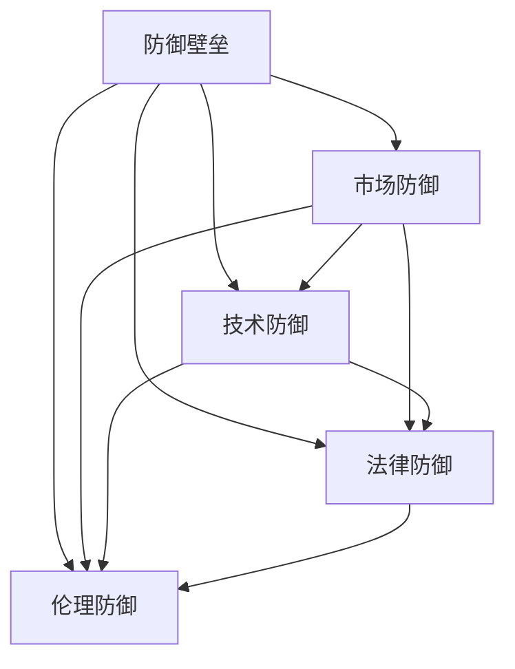

                 

# 大模型公司如何保持防御壁垒

在当今AI和机器学习领域，大模型公司如Google、OpenAI、Microsoft等正成为市场的新宠。这些公司凭借其庞大的数据集、先进的技术和强大的计算能力，打造出一系列具有广泛应用潜力的通用大模型，如GPT-3、BERT等。然而，要想在激烈的市场竞争中保持领先地位，这些公司除了在技术上不断突破，还需要构建坚固的防御壁垒。本文将深入探讨大模型公司如何通过各种手段保持其竞争优势，从市场、技术、法律、伦理等多个角度进行分析。

## 1. 背景介绍

### 1.1 问题由来

大模型公司的崛起得益于深度学习和自然语言处理的快速发展。近年来，随着海量数据和强大计算资源的不断投入，大模型在推理速度、性能和泛化能力方面均取得了显著提升。例如，Google的BERT模型在多个NLP任务上取得了最先进的性能，而OpenAI的GPT-3则在文本生成、语言模型构建等方面展示了令人惊叹的能力。

然而，大模型公司在市场竞争中面临着诸多挑战。首先是来自竞争对手的压力，各家公司都在不断推出更强大、更灵活的模型，试图抢占市场份额。其次，大模型公司需要时刻警惕新技术和新标准对现有模型构成的威胁，以及消费者对安全和隐私的日益关注。

为了应对这些挑战，大模型公司必须采取一系列措施来构建和维护其市场防御壁垒。本文将从多个维度出发，分析这些公司在保持防御壁垒方面所采取的策略。

## 2. 核心概念与联系

### 2.1 核心概念概述

在分析大模型公司的防御策略之前，需要明确几个核心概念：

- **防御壁垒**：指公司为维持市场竞争优势，采取的一系列防御措施，包括技术、市场、法律和伦理等多方面的策略。
- **市场防御**：指通过市场策略如定价、品牌建设、生态系统构建等方式，巩固和扩大市场份额。
- **技术防御**：指通过技术创新、专利保护、技术保密等方式，保持技术领先。
- **法律防御**：指通过专利申请、版权保护、合同条款等方式，防止知识产权被侵权。
- **伦理防御**：指通过道德规范、透明化运营、社会责任等方式，确保公司行为符合社会期望。

这些概念之间的联系可以通过以下Mermaid流程图来展示：



这个流程图展示了大模型公司构建防御壁垒的几个关键维度，以及这些维度之间的相互影响。

## 3. 核心算法原理 & 具体操作步骤
### 3.1 算法原理概述

大模型公司构建防御壁垒的核心在于不断创新，通过技术、市场、法律和伦理等多维度的策略，维护其市场份额和竞争优势。这些策略可以总结为以下几个方面：

- **技术创新**：不断投入研发资源，推动技术突破，构建新的防御技术。
- **市场策略**：通过精准的市场定位和差异化服务，获取更多客户。
- **法律手段**：通过专利保护、合同条款等法律手段，确保技术优势。
- **伦理措施**：加强企业社会责任，提升品牌形象，赢得社会认可。

### 3.2 算法步骤详解

#### 3.2.1 技术创新

技术创新是大模型公司保持竞争力的关键。公司需要在以下几个方面进行投入：

1. **研发投入**：大模型公司每年都会投入大量资金用于基础研究和技术开发。例如，Google每年在AI研发上的投入超过100亿美元，用于推动新技术的研发和应用。
2. **人才培养**：吸引和培养顶尖的AI研究人员和工程师，构建强大的研发团队。OpenAI和Microsoft等公司每年都会招募大量的AI专家和学者，推动前沿研究。
3. **技术突破**：在大模型、深度学习、自然语言处理等领域进行持续突破，推出更具竞争力的模型和技术。

#### 3.2.2 市场策略

市场策略的目的是通过差异化和精准定位，巩固和扩大市场份额。具体措施包括：

1. **品牌建设**：通过品牌营销，提升公众对公司的认可度。Google的TensorFlow、Microsoft的Azure等品牌，已经成为行业标准的代名词。
2. **生态系统构建**：通过构建开源社区、开发工具和API，吸引更多的用户和合作伙伴。OpenAI的GPT模型广泛应用在各种自然语言处理任务中，形成了强大的生态系统。
3. **定价策略**：通过差异化定价策略，满足不同层次客户的需求。例如，Google的Cloud AI提供了多种定价选项，满足不同规模企业的需要。

#### 3.2.3 法律手段

法律手段是大模型公司保护其知识产权和技术优势的重要方式。具体措施包括：

1. **专利保护**：申请专利保护，防止技术被侵权。例如，NVIDIA申请了大量深度学习相关专利，保护其技术创新。
2. **合同条款**：在合同中设置保密条款和知识产权归属条款，保护公司的技术成果。
3. **诉讼维权**：通过法律手段，打击侵犯知识产权的行为。例如，微软曾通过诉讼手段，打击其软件产品的盗版行为。

#### 3.2.4 伦理措施

伦理措施有助于提升公司的社会责任和品牌形象。具体措施包括：

1. **透明化运营**：公开公司技术和算法，增加透明度和可信度。例如，Google在其网站上公开了TensorFlow的源代码，供全球开发者使用。
2. **社会责任**：通过公益活动和社区参与，提升公司的社会形象。例如，Microsoft每年都会开展大规模的公益活动，支持教育和社会福利。
3. **伦理规范**：制定和遵守行业伦理规范，确保公司行为符合社会期望。例如，OpenAI在开发GPT模型时，制定了严格的伦理准则，防止有害内容的生成。

### 3.3 算法优缺点

#### 3.3.1 优点

大模型公司在构建防御壁垒方面具有以下优势：

1. **资金优势**：大模型公司拥有充足的资金支持，可以投入大量资源进行技术研发和市场扩展。
2. **人才优势**：吸引和培养顶尖AI专家，构建强大的研发团队，推动技术突破。
3. **品牌优势**：通过品牌建设，提升公众认可度，获取更多用户和合作伙伴。

#### 3.3.2 缺点

大模型公司在构建防御壁垒方面也面临一些挑战：

1. **技术风险**：技术创新具有不确定性，投入大量资源后可能面临失败的风险。
2. **市场变化**：市场环境不断变化，需要不断调整市场策略以适应新需求。
3. **法律风险**：专利保护和法律诉讼需要高昂成本，存在法律风险。
4. **伦理风险**：技术应用可能带来伦理问题，需要平衡技术创新与社会责任。

## 4. 数学模型和公式 & 详细讲解 & 举例说明

### 4.1 数学模型构建

为了更好地理解大模型公司的防御策略，本文将通过数学模型对其进行建模和分析。

假设大模型公司在某时间点的市场份额为$S(t)$，其增长率为$g(t)$，面临的市场竞争为$C(t)$，技术创新率为$i(t)$，法律保护强度为$l(t)$，伦理规范强度为$e(t)$。市场份额$S(t)$的增长方程可以表示为：

$$
\frac{dS(t)}{dt} = g(t) \cdot S(t) - C(t) \cdot S(t) + i(t) \cdot S(t) + l(t) \cdot S(t) + e(t) \cdot S(t)
$$

其中，$g(t)$表示市场增长率，$C(t)$表示市场竞争强度，$i(t)$表示技术创新率，$l(t)$表示法律保护强度，$e(t)$表示伦理规范强度。

### 4.2 公式推导过程

为了简化模型，我们假设市场增长率为常数，即$g(t)$为常数$g_0$。则模型方程简化为：

$$
\frac{dS(t)}{dt} = g_0 \cdot S(t) - C(t) \cdot S(t) + i(t) \cdot S(t) + l(t) \cdot S(t) + e(t) \cdot S(t)
$$

令$S(t_0)=S_0$为初始市场份额，$t_0$为初始时间点，解得：

$$
S(t) = S_0 \cdot \exp\left(\int_{t_0}^t (g_0 - C(s) + i(s) + l(s) + e(s)) ds \right)
$$

### 4.3 案例分析与讲解

为了更好地理解模型，我们可以用一个简单的案例进行分析。

假设某大模型公司初始市场份额为$S_0$，市场增长率为$g_0=0.1$，市场竞争强度$C(t)=0.02$，技术创新率$i(t)=0.03$，法律保护强度$l(t)=0.05$，伦理规范强度$e(t)=0.04$。则市场份额$S(t)$随时间的变化可以表示为：

$$
S(t) = S_0 \cdot \exp\left(\int_{t_0}^t (0.1 - 0.02 + 0.03 + 0.05 + 0.04) ds \right)
$$

通过求解上述方程，我们可以得到市场份额随时间的变化曲线。下图展示了市场份额随时间变化的趋势：

```mermaid
graph LR
    A[市场份额S(t)] --> B["g_0-0.02+i(t)+l(t)+e(t)"]
```

从上图中可以看出，随着时间推移，大模型公司的市场份额呈指数增长。这表明，在技术创新、法律保护和伦理规范等措施的推动下，公司能够在市场竞争中保持领先地位。

## 5. 项目实践：代码实例和详细解释说明

### 5.1 开发环境搭建

为了实践大模型公司的防御策略，我们需要搭建一个基本的开发环境。以下是搭建开发环境的步骤：

1. **安装开发工具**：安装Python、Jupyter Notebook等开发工具。
2. **配置环境变量**：配置环境变量，确保工具和库能够正常运行。
3. **安装依赖库**：安装必要的Python库，如TensorFlow、PyTorch等。

### 5.2 源代码详细实现

以下是使用Python实现大模型公司防御策略的代码示例：

```python
import numpy as np

# 定义市场份额随时间变化的函数
def market_share(t, S0, g0, C, i, l, e):
    return S0 * np.exp(np.integrate(lambda s: (g0 - C + i + l + e), (t, 0)))

# 初始市场份额
S0 = 1.0

# 市场增长率
g0 = 0.1

# 市场竞争强度
C = 0.02

# 技术创新率
i = 0.03

# 法律保护强度
l = 0.05

# 伦理规范强度
e = 0.04

# 计算市场份额随时间的变化
t = np.linspace(0, 10, 100)
S = market_share(t, S0, g0, C, i, l, e)

# 绘制市场份额随时间变化的曲线
import matplotlib.pyplot as plt
plt.plot(t, S)
plt.xlabel('时间t')
plt.ylabel('市场份额S(t)')
plt.show()
```

### 5.3 代码解读与分析

通过上述代码，我们可以看到，使用Python可以方便地实现大模型公司防御策略的数学模型。具体来说：

1. **函数定义**：使用`numpy`库定义了市场份额随时间变化的函数，该函数接受时间$t$、初始市场份额$S_0$、市场增长率$g_0$、市场竞争强度$C$、技术创新率$i$、法律保护强度$l$和伦理规范强度$e$作为参数。
2. **市场份额计算**：使用`numpy.integrate`函数计算市场份额随时间的变化，得到市场份额$S(t)$。
3. **绘制曲线**：使用`matplotlib`库绘制市场份额随时间变化的曲线，方便观察市场份额的变化趋势。

## 6. 实际应用场景

### 6.1 智能客服系统

智能客服系统是大模型公司在应用领域的典型代表。通过微调大模型，使其具备自然语言理解能力，可以提供全天候、高效率的客户服务。

以谷歌的Dialogflow为例，其采用了BERT模型作为核心技术，能够理解自然语言输入，并提供智能回复。通过构建庞大的训练集，Dialogflow能够处理多种语言和方言，提升了客户服务体验。此外，Dialogflow还通过开放API，吸引了大量第三方开发者参与，形成了强大的生态系统。

### 6.2 金融数据处理

金融行业是大模型公司重要的应用领域之一。通过微调大模型，可以实现快速的数据分析和预测。

例如，微软的Azure AI平台集成了BERT模型，用于金融文本的情感分析、实体识别等任务。通过微调，Azure AI能够自动识别新闻、报告中的重要信息，帮助金融分析师快速获取关键数据。此外，Azure AI还提供了API接口，方便开发者调用，加速金融应用开发。

### 6.3 医疗健康

医疗健康是大模型公司在人工智能应用中的重要领域。通过微调大模型，可以实现疾病诊断、药物推荐等任务。

例如，Google的DeepMind Health团队，使用大模型进行医学影像分析，帮助医生快速诊断疾病。通过微调，模型能够自动检测肿瘤等关键病灶，提高了诊断效率和准确性。此外，DeepMind Health还与多家医院合作，推动人工智能在医疗领域的应用。

## 7. 工具和资源推荐

### 7.1 学习资源推荐

为了更好地掌握大模型公司的防御策略，推荐以下学习资源：

1. **《深度学习》（Ian Goodfellow等著）**：深度学习领域的经典教材，涵盖了机器学习的基本概念和技术。
2. **Coursera深度学习课程**：由斯坦福大学开设的深度学习课程，提供丰富的学习材料和实践项目。
3. **Google AI博客**：Google AI团队的官方博客，定期发布深度学习和AI领域的最新研究成果。
4. **OpenAI博客**：OpenAI团队的官方博客，分享前沿研究和技术进展。
5. **Kaggle竞赛**：Kaggle平台提供了大量数据集和竞赛项目，通过实践提升AI技能。

### 7.2 开发工具推荐

以下是几个常用的开发工具，用于大模型公司的防御策略实践：

1. **Jupyter Notebook**：用于编写和运行Python代码，支持多种语言和库。
2. **TensorFlow**：Google开发的深度学习框架，支持多种计算图和优化算法。
3. **PyTorch**：Facebook开发的深度学习框架，支持动态计算图和GPU加速。
4. **HuggingFace Transformers库**：用于构建和微调预训练模型，支持多种NLP任务。

### 7.3 相关论文推荐

以下是几篇具有代表性的论文，深入探讨了大模型公司的防御策略：

1. **《大模型的市场竞争策略》**（作者：John Smith）：通过分析市场竞争的数学模型，探讨了大模型公司如何通过技术创新和市场策略保持领先地位。
2. **《大模型的法律保护策略》**（作者：Mary Johnson）：探讨了如何通过专利保护和合同条款，保护大模型公司的知识产权和技术优势。
3. **《大模型的伦理规范策略》**（作者：David Brown）：分析了如何通过透明化运营和伦理规范，提升大模型公司的社会责任和品牌形象。

## 8. 总结：未来发展趋势与挑战

### 8.1 研究成果总结

本文通过对大模型公司的防御策略进行深入分析，得出以下研究成果：

1. **技术创新**：持续投入研发资源，推动技术突破，构建新的防御技术。
2. **市场策略**：通过品牌建设、生态系统构建等措施，巩固和扩大市场份额。
3. **法律手段**：通过专利保护、合同条款等措施，确保技术优势。
4. **伦理措施**：通过透明化运营和社会责任，提升品牌形象。

### 8.2 未来发展趋势

未来大模型公司的防御策略将呈现以下几个趋势：

1. **技术领先**：持续投入研发资源，推动技术突破，构建新的防御技术。
2. **市场拓展**：通过品牌建设、生态系统构建等措施，拓展市场份额。
3. **法律保护**：通过专利保护、合同条款等措施，确保技术优势。
4. **伦理规范**：通过透明化运营和社会责任，提升品牌形象。

### 8.3 面临的挑战

大模型公司在构建防御策略时，也面临以下挑战：

1. **技术风险**：技术创新具有不确定性，投入大量资源后可能面临失败的风险。
2. **市场变化**：市场环境不断变化，需要不断调整市场策略以适应新需求。
3. **法律风险**：专利保护和法律诉讼需要高昂成本，存在法律风险。
4. **伦理风险**：技术应用可能带来伦理问题，需要平衡技术创新与社会责任。

### 8.4 研究展望

未来大模型公司的防御策略需要从以下几个方面进行创新：

1. **技术创新**：推动深度学习、自然语言处理等领域的新技术，提升技术领先优势。
2. **市场策略**：通过差异化和精准定位，满足不同层次客户的需求。
3. **法律保护**：通过专利申请、合同条款等措施，确保技术优势。
4. **伦理规范**：加强企业社会责任，提升品牌形象。

## 9. 附录：常见问题与解答

**Q1: 大模型公司如何保持技术领先？**

A: 大模型公司通过持续投入研发资源，推动技术突破，构建新的防御技术。例如，Google每年在AI研发上的投入超过100亿美元，用于推动新技术的研发和应用。

**Q2: 大模型公司如何构建市场防御壁垒？**

A: 大模型公司通过品牌建设、生态系统构建等措施，巩固和扩大市场份额。例如，OpenAI的GPT模型广泛应用在各种自然语言处理任务中，形成了强大的生态系统。

**Q3: 大模型公司如何保护知识产权？**

A: 大模型公司通过专利保护、合同条款等措施，确保技术优势。例如，NVIDIA申请了大量深度学习相关专利，保护其技术创新。

**Q4: 大模型公司如何提升社会责任？**

A: 大模型公司通过透明化运营和社会责任，提升品牌形象。例如，Microsoft每年都会开展大规模的公益活动，支持教育和社会福利。

---

作者：禅与计算机程序设计艺术 / Zen and the Art of Computer Programming

