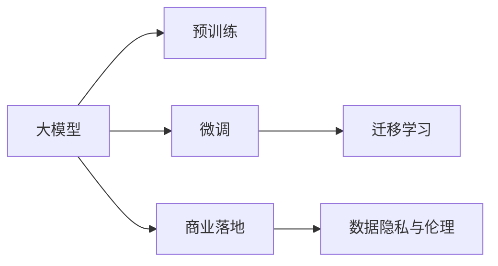

                 

# 大模型创业者的成功密码与挑战

## 1. 背景介绍

在人工智能的浪潮中，大模型成为了创业者和企业关注的焦点。从语言模型如GPT-3、BERT，到视觉模型如DALL·E、DETR，这些大模型不仅展现了强大的学习能力和应用潜力，也成为了创业公司争相投入的领域。大模型公司如OpenAI、DeepMind、Google等，凭借其先进的技术和巨大的商业成功，引领了人工智能的最新趋势。

然而，创业大模型公司的成功并非易事。除了拥有强大的技术储备，还需要具备深厚的商业洞察力和行业理解。本文将深入分析大模型创业者的成功密码与面临的挑战，探讨其在技术、市场、竞争等多方面的关键要素。

## 2. 核心概念与联系

### 2.1 核心概念概述

在大模型创业的旅程中，涉及众多核心概念，这些概念构成了公司成功的基石。

- **大模型（Large Model）**：指拥有数亿或更多参数的深度神经网络模型。大模型通过大规模训练数据，学习到丰富的语言、视觉等领域的知识，具备超强的泛化能力。
- **预训练（Pre-training）**：指在大规模无标签数据上对大模型进行训练，以学习通用特征。预训练模型可以作为初始化参数，应用于各种下游任务。
- **微调（Fine-tuning）**：指在大模型基础上，使用下游任务的少量标注数据进行有监督训练，优化模型针对特定任务的性能。微调是提升大模型实用性的重要手段。
- **迁移学习（Transfer Learning）**：指将在大规模数据上训练得到的知识，迁移到其他领域和任务中，提升模型泛化能力。大模型通常在多个领域和任务中表现优异，迁移学习是其重要特性。
- **商业落地（Commercialization）**：指将大模型技术转化为实际应用，包括模型部署、算法优化、业务集成等。商业落地是大模型创业的关键步骤。
- **数据隐私与伦理（Data Privacy and Ethics）**：指在模型训练和使用过程中，保护用户隐私、遵循伦理规范的必要性。数据隐私和伦理是大模型应用的底线。

### 2.2 核心概念原理和架构的 Mermaid 流程图



该流程图展示了大模型创业中涉及的核心概念及其相互联系。预训练是基础，微调和迁移学习是提升模型性能的关键，商业落地是应用落地的保障，数据隐私与伦理是应用的底线。

## 3. 核心算法原理 & 具体操作步骤

### 3.1 算法原理概述

大模型创业的成功离不开对核心算法的深刻理解。以下是大模型创业中涉及的主要算法原理。

- **自回归模型（Auto-Regressive Model）**：如GPT系列，通过预测下一个词的概率，反向计算模型参数。其核心在于语言生成中的因果关系。
- **自编码模型（Auto-Encoder Model）**：如BERT，通过预测隐藏表示重构输入，学习文本表示的语义信息。自编码模型在文本分类、生成等任务上表现优异。
- **Transformer结构**：Transformer通过多头自注意力机制，提升了模型的并行计算能力和泛化能力。Transformer在大模型中广泛应用。

### 3.2 算法步骤详解

大模型创业涉及的主要算法步骤如下：

1. **数据预处理**：对原始数据进行清洗、归一化、划分训练集和验证集等。
2. **模型预训练**：在大规模无标签数据上训练大模型，学习通用语言特征。
3. **模型微调**：在大模型基础上，使用下游任务的少量标注数据进行微调，提升模型针对特定任务的性能。
4. **模型部署与优化**：将微调后的模型部署到生产环境中，进行算法优化和性能调优。
5. **商业化应用**：将模型集成到实际应用场景中，解决实际问题。

### 3.3 算法优缺点

大模型创业中的算法具有以下优点：

- **强大的泛化能力**：大模型能够在多个任务和领域中表现优异，具有较强的泛化能力。
- **高效的参数优化**：大模型的参数量庞大，但通过预训练和微调，模型参数的优化效率较高。
- **广泛的适用性**：大模型适用于文本生成、语言理解、视觉识别等多个领域，具有广泛的适用性。

同时，大模型算法也存在以下缺点：

- **数据需求高**：大模型需要大量的标注数据进行微调，数据获取成本高。
- **计算资源消耗大**：大模型的训练和推理计算资源消耗大，对硬件要求高。
- **模型复杂度高**：大模型的结构复杂，训练和部署难度较大。

### 3.4 算法应用领域

大模型在以下几个领域有广泛应用：

- **自然语言处理（NLP）**：文本分类、情感分析、机器翻译、问答系统等。
- **计算机视觉（CV）**：图像分类、目标检测、图像生成等。
- **音频处理**：语音识别、语音合成、情感识别等。
- **推荐系统**：个性化推荐、用户行为预测等。

## 4. 数学模型和公式 & 详细讲解 & 举例说明

### 4.1 数学模型构建

在大模型创业中，数学模型的构建是其成功的核心。以下是一个简单的文本分类任务的数学模型构建示例：

- **输入**：文本序列 $x = \{x_1, x_2, ..., x_n\}$。
- **目标**：预测文本属于某个类别的概率 $y \in \{1, 2, ..., k\}$。
- **模型**：一个具有 $d$ 个隐藏层的多层感知器（MLP），其中每个隐藏层的节点数为 $h$。

### 4.2 公式推导过程

文本分类任务的数学模型推导如下：

1. **输入编码**：将文本 $x$ 编码为嵌入向量 $e_x \in \mathbb{R}^{d_x}$。
2. **隐藏层表示**：通过多层感知器，将输入向量 $e_x$ 转换为隐藏层表示 $h_x \in \mathbb{R}^d$。
3. **分类层输出**：通过一个全连接层，将隐藏层表示 $h_x$ 转换为类别概率 $p_y \in \mathbb{R}^k$。
4. **损失函数**：使用交叉熵损失函数 $L = -\frac{1}{N}\sum_{i=1}^N \sum_{j=1}^k y_i^j \log p_y^j(x_i)$，最小化模型预测与真实标签之间的差异。

### 4.3 案例分析与讲解

以BERT模型为例，其预训练任务包括掩码语言模型（Masked Language Modeling, MLM）和下一句预测（Next Sentence Prediction, NSP）。MLM任务通过掩码部分单词，预测掩码单词，学习单词的上下文关系。NSP任务通过预测两个句子是否为连续的文本，学习句子的语义信息。

BERT模型在大规模语料上进行预训练，然后通过微调应用于下游任务，如情感分析、命名实体识别等。微调过程中，只微调模型的顶层，固定预训练层权重，以降低计算复杂度。

## 5. 项目实践：代码实例和详细解释说明

### 5.1 开发环境搭建

大模型创业的开发环境搭建是成功的基础。以下是Python环境搭建示例：

1. 安装Anaconda：从官网下载并安装Anaconda，创建独立的Python环境。
2. 激活环境：`conda activate my_env`。
3. 安装相关库：`pip install torch transformers scikit-learn`。

### 5.2 源代码详细实现

以下是一个简单的BERT微调示例代码：

```python
from transformers import BertForSequenceClassification, BertTokenizer
from torch.utils.data import Dataset, DataLoader
import torch

class CustomDataset(Dataset):
    def __init__(self, texts, labels):
        self.texts = texts
        self.labels = labels
        self.tokenizer = BertTokenizer.from_pretrained('bert-base-uncased')
        
    def __len__(self):
        return len(self.texts)
    
    def __getitem__(self, item):
        text = self.texts[item]
        label = self.labels[item]
        
        encoding = self.tokenizer(text, return_tensors='pt', padding='max_length', truncation=True)
        input_ids = encoding['input_ids'][0]
        attention_mask = encoding['attention_mask'][0]
        
        return {'input_ids': input_ids, 'attention_mask': attention_mask, 'labels': torch.tensor(label, dtype=torch.long)}

# 加载预训练模型
model = BertForSequenceClassification.from_pretrained('bert-base-uncased', num_labels=2)
model.to('cuda')

# 加载数据集
train_dataset = CustomDataset(train_texts, train_labels)
dev_dataset = CustomDataset(dev_texts, dev_labels)
test_dataset = CustomDataset(test_texts, test_labels)

# 训练
model.train()
for epoch in range(epochs):
    optimizer = AdamW(model.parameters(), lr=2e-5)
    loss = 0
    for batch in DataLoader(train_dataset, batch_size=32, shuffle=True):
        optimizer.zero_grad()
        inputs = {k: v.to('cuda') for k, v in batch.items()}
        outputs = model(**inputs)
        loss += outputs.loss
        loss.backward()
        optimizer.step()
    print(f'Epoch {epoch+1}, loss: {loss/len(train_dataset)}')

# 评估
model.eval()
with torch.no_grad():
    eval_loss = 0
    for batch in DataLoader(dev_dataset, batch_size=32):
        inputs = {k: v.to('cuda') for k, v in batch.items()}
        outputs = model(**inputs)
        eval_loss += outputs.loss
    print(f'Dev loss: {eval_loss/len(dev_dataset)}')

# 测试
model.eval()
with torch.no_grad():
    test_loss = 0
    for batch in DataLoader(test_dataset, batch_size=32):
        inputs = {k: v.to('cuda') for k, v in batch.items()}
        outputs = model(**inputs)
        test_loss += outputs.loss
    print(f'Test loss: {test_loss/len(test_dataset)}')
```

### 5.3 代码解读与分析

在上述代码中，首先定义了一个自定义数据集 `CustomDataset`，用于加载和处理文本数据。然后，加载预训练的BERT模型，并设置训练轮数和批大小。在每个epoch中，使用AdamW优化器更新模型参数，最小化交叉熵损失。训练完成后，在验证集和测试集上进行评估，输出模型在各个集上的损失。

## 6. 实际应用场景

### 6.1 智能客服系统

智能客服系统是大模型创业的重要应用场景。通过预训练语言模型和微调，智能客服可以处理大量客户咨询，提升服务效率和质量。

- **问题识别**：智能客服能够理解自然语言，准确识别客户意图。
- **自动回复**：通过微调模型，智能客服能够生成自然流畅的回复，解决常见问题。
- **个性化服务**：根据客户历史行为和偏好，智能客服提供个性化推荐和解答。

### 6.2 金融舆情监测

金融舆情监测是大模型创业的另一个重要应用场景。通过预训练语言模型和微调，金融机构能够实时监测舆情，及时响应市场波动。

- **情感分析**：对新闻报道、评论等进行情感分析，判断市场情绪。
- **事件监测**：对金融事件进行实时监测，及时发现异常情况。
- **风险预警**：基于舆情分析，提供风险预警和策略建议。

### 6.3 个性化推荐系统

个性化推荐系统是大模型创业的重要方向。通过预训练语言模型和微调，推荐系统能够根据用户行为和兴趣，提供精准的推荐内容。

- **用户画像**：通过文本分析，构建用户兴趣画像。
- **内容推荐**：根据用户画像，推荐相关内容。
- **动态更新**：根据用户反馈，动态调整推荐策略。

## 7. 工具和资源推荐

### 7.1 学习资源推荐

- **书籍**：《深度学习》（Ian Goodfellow）、《动手学深度学习》（李沐）。
- **在线课程**：Coursera的“Deep Learning Specialization”、Udacity的“Deep Learning Nanodegree”。
- **研究论文**：Transformer论文、BERT论文、GPT系列论文。

### 7.2 开发工具推荐

- **编程语言**：Python。
- **深度学习框架**：PyTorch、TensorFlow。
- **预训练模型库**：HuggingFace Transformers、Google BERT。

### 7.3 相关论文推荐

- **Transformer论文**：Attention Is All You Need。
- **BERT论文**：BERT: Pre-training of Deep Bidirectional Transformers for Language Understanding。
- **GPT系列论文**：GPT-3: Language Models are Unsupervised Multitask Learners。

## 8. 总结：未来发展趋势与挑战

### 8.1 研究成果总结

大模型创业在多个领域取得了显著成果，其成功的关键在于以下几点：

- **强大的技术储备**：大模型拥有先进的深度学习技术，能够应对复杂任务。
- **丰富的应用场景**：大模型在智能客服、金融舆情、推荐系统等多个领域有广泛应用。
- **高效的商业化路径**：通过微调和迁移学习，大模型能够快速应用于实际业务，提升效率。

### 8.2 未来发展趋势

大模型创业的未来发展趋势如下：

- **多模态融合**：将视觉、语音等多模态信息与文本信息结合，提升模型的泛化能力。
- **持续学习**：模型能够持续从新数据中学习，保持性能。
- **联邦学习**：分布式训练，保护数据隐私。
- **自适应学习**：根据用户行为和环境变化，动态调整模型参数。

### 8.3 面临的挑战

大模型创业面临的挑战包括：

- **数据获取成本高**：大规模标注数据获取困难。
- **计算资源需求大**：训练和推理计算资源消耗高。
- **模型复杂度高**：模型结构复杂，训练和部署难度大。
- **伦理和安全问题**：数据隐私和模型偏见需注意。

### 8.4 研究展望

大模型创业的未来研究展望如下：

- **参数高效微调**：仅微调少量参数，提升效率。
- **零样本学习**：通过精心设计的提示，实现零样本和少样本学习。
- **跨领域迁移学习**：模型在不同领域和任务中的迁移能力。
- **安全性和公平性**：保护数据隐私，减少模型偏见。

## 9. 附录：常见问题与解答

**Q1: 如何选择合适的预训练模型？**

A: 应根据任务需求选择预训练模型。例如，文本分类任务可以使用BERT或GPT，视觉识别任务可以使用ResNet或Inception。

**Q2: 如何优化微调过程？**

A: 可以采用数据增强、正则化、对抗训练等技术，避免过拟合。同时，使用参数高效微调技术，如Adapter、Prefix等，降低计算成本。

**Q3: 如何保护用户隐私？**

A: 在模型训练和应用过程中，应采用数据去标识化、差分隐私等技术，保护用户隐私。

**Q4: 如何提高模型性能？**

A: 可以通过超参数调优、模型架构改进、模型融合等方法，提升模型性能。

**Q5: 如何应对计算资源限制？**

A: 可以采用模型压缩、模型并行等技术，优化模型资源占用。同时，采用云计算资源，降低计算成本。

---

作者：禅与计算机程序设计艺术 / Zen and the Art of Computer Programming

