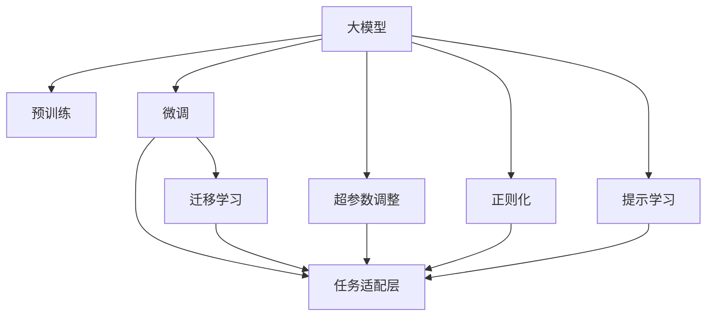

                 

# 大模型助力创业者实现技术突破与产品创新

> 关键词：大模型,技术突破,产品创新,初创企业,创业技术,人工智能,深度学习,创业指南

## 1. 背景介绍

### 1.1 问题由来
在现代科技和互联网的浪潮下，初创企业面临日益激烈的竞争环境和快速变化的客户需求。如何利用最新技术突破，快速打造出满足市场需求的创新产品，成为创业者的首要任务。近年来，随着深度学习和大模型的发展，创业者们有了新的工具和思路来提升产品竞争力。

### 1.2 问题核心关键点
利用大模型，创业者可以在短时间内，迅速构建出具备强大分析、预测、生成等功能的智能化产品，实现技术突破和产品创新。关键在于：

- 选择合适的预训练模型和微调方法，以最大化数据利用和算法效果。
- 合理设计任务适配层，确保模型输出的精准性。
- 科学地应用正则化、超参数调整等技术，避免过拟合和资源浪费。
- 结合产品特性，进行定制化的模型优化，实现最佳用户体验。

本文将详细探讨如何利用大模型进行技术突破与产品创新，旨在帮助创业者在技术应用的深度和广度上获得突破性进展。

## 2. 核心概念与联系

### 2.1 核心概念概述

本节将介绍与大模型应用相关的几个核心概念：

- **大模型**：指以深度神经网络为架构、参数规模庞大的预训练模型，如GPT、BERT等。这些模型经过大规模无监督训练，具备强大的泛化能力，能够广泛应用于各种自然语言处理任务。
- **微调(Fine-tuning)**：指在大模型的基础上，使用特定任务的数据集对模型进行有监督训练，调整其参数以适应新任务。通常用于调整顶层参数，以提升模型在该任务上的性能。
- **迁移学习(Transfer Learning)**：指利用预训练模型在新任务上继续学习的过程。迁移学习可以大大降低新任务训练的时间和成本。
- **预训练(Pre-training)**：指在大规模数据上进行的自监督学习任务，预训练模型在此过程中学习到语言的通用特征，为后续的微调和迁移学习打下基础。
- **超参数调整(Hyperparameter Tuning)**：指在模型训练过程中，对学习率、批大小、迭代次数等参数进行调优，以获得最佳性能。
- **正则化(Regularization)**：通过添加正则项或限制模型复杂度，避免模型过拟合。
- **提示学习(Prompt Learning)**：利用精心设计的输入文本格式，引导大模型按期望方式输出，减少微调参数。

这些概念之间的逻辑关系可以通过以下Mermaid流程图来展示：



这个流程图展示了从预训练模型到任务适配的过程，以及在大模型应用中可能采取的优化手段。

## 3. 核心算法原理 & 具体操作步骤
### 3.1 算法原理概述

利用大模型的技术突破与产品创新，主要遵循以下原则：

1. **选择适当的预训练模型**：
   - 根据应用场景选择合适的预训练模型，如情感分析、文本分类、机器翻译等。常用的预训练模型有BERT、GPT-3、XLNet等。

2. **数据准备与任务适配层设计**：
   - 收集数据集，并进行预处理、标注等工作。
   - 设计合适的输出层和损失函数，如线性分类器、交叉熵损失等。

3. **微调超参数设置**：
   - 确定学习率、批大小、迭代次数等关键参数。
   - 考虑正则化、Early Stopping等优化策略。

4. **执行微调训练**：
   - 利用优化算法如Adam、SGD等更新模型参数。
   - 在训练集上迭代优化，并在验证集上评估性能。

5. **产品集成与部署**：
   - 将微调后的模型集成到实际产品中，进行性能测试。
   - 持续监控模型性能，根据实际数据进行模型更新。

### 3.2 算法步骤详解

以情感分析为例，详细阐述大模型应用的步骤：

1. **数据准备**：
   - 收集情感分析数据集，如Yelp评论、Amazon商品评价等。
   - 数据标注，将文本分为正面、负面、中性等类别。
   - 对文本进行分词、向量化等预处理。

2. **选择预训练模型**：
   - 选定BERT等预训练模型，并进行微调。

3. **任务适配层设计**：
   - 构建线性分类器作为输出层，以softmax函数计算类别概率。
   - 损失函数使用交叉熵损失。

4. **设置微调超参数**：
   - 设置学习率为2e-5，批大小为16。
   - 使用AdamW优化算法，添加L2正则化。

5. **微调训练**：
   - 使用PyTorch等框架搭建模型，进行微调训练。
   - 在训练集上迭代优化，每次迭代评估模型在验证集上的准确率。

6. **模型评估与优化**：
   - 在测试集上测试模型性能。
   - 根据测试结果调整超参数，如学习率、批大小等。

7. **产品集成与部署**：
   - 将微调后的模型集成到实际产品中，如App、网站等。
   - 持续监控模型性能，根据新数据进行模型更新。

### 3.3 算法优缺点

利用大模型的技术突破与产品创新，具有以下优点：

- **快速部署**：大模型具备强大的泛化能力，微调过程可以快速提升模型性能。
- **高效利用数据**：微调只需少量标注数据，能够最大化数据利用。
- **灵活适配**：通过调整任务适配层和超参数，可以适应各种不同的任务需求。

同时，也存在一些缺点：

- **对标注数据依赖**：微调需要高质量的标注数据，标注成本较高。
- **资源消耗大**：大模型需要高性能硬件支持，对计算资源要求高。
- **过拟合风险**：微调过程中需注意避免过拟合，确保模型泛化性能。
- **隐私和伦理问题**：大模型可能存在数据隐私和伦理问题，需注意处理。

### 3.4 算法应用领域

大模型和微调技术在多个领域都有广泛应用：

- **自然语言处理(NLP)**：情感分析、文本分类、机器翻译等。
- **计算机视觉(CV)**：图像分类、目标检测、图像生成等。
- **推荐系统**：个性化推荐、广告推荐等。
- **金融分析**：股票预测、风险评估等。
- **医疗健康**：疾病诊断、药物研发等。
- **智慧城市**：智能交通、智能安防等。

## 4. 数学模型和公式 & 详细讲解
### 4.1 数学模型构建

情感分析的数学模型构建如下：

假设训练集为$D=\{(x_i,y_i)\}_{i=1}^N$，其中$x_i$为输入文本，$y_i$为情感标签（正面、负面、中性）。

定义模型$f_\theta$为线性分类器，输出概率为$P(y_i|x_i)$。损失函数$L$为交叉熵损失，即：

$$
L(f_\theta, D) = -\frac{1}{N} \sum_{i=1}^N \log P(y_i|x_i)
$$

微调过程即为最小化上述损失函数，得到最优参数$\theta^*$：

$$
\theta^* = \mathop{\arg\min}_{\theta} L(f_\theta, D)
$$

### 4.2 公式推导过程

假设模型为线性分类器，输出概率$P(y_i|x_i)$为：

$$
P(y_i|x_i) = \sigma(\langle w, x_i \rangle + b)
$$

其中$\sigma$为sigmoid函数，$w$为权重向量，$b$为偏置项。

交叉熵损失函数为：

$$
L(f_\theta, D) = -\frac{1}{N} \sum_{i=1}^N \sum_{j=1}^3 y_{i,j} \log P(y_{i,j}|x_i)
$$

其中$y_{i,j}$为$y_i$的one-hot表示，$j$表示三个情感类别。

### 4.3 案例分析与讲解

以Iris数据集为例，进行多分类预测模型的构建：

1. **数据准备**：
   - 收集Iris数据集，包含三种花卉的花萼长度、花萼宽度、花瓣长度、花瓣宽度等特征。
   - 将数据集分为训练集和测试集。

2. **模型选择与构建**：
   - 选择MLP模型，并进行预训练。
   - 构建线性分类器作为输出层，损失函数使用交叉熵损失。

3. **微调超参数设置**：
   - 学习率为0.001，批大小为32。
   - 使用Adam优化算法，添加L2正则化。

4. **微调训练**：
   - 在训练集上迭代优化，每次迭代评估模型在验证集上的准确率。
   - 使用测试集测试模型性能。

5. **模型评估与优化**：
   - 根据测试结果调整超参数，如学习率、批大小等。
   - 集成模型到实际产品中，如App、网站等。

## 5. 项目实践：代码实例和详细解释说明
### 5.1 开发环境搭建

以下是利用PyTorch进行情感分析微调的基本环境搭建步骤：

1. **安装Anaconda**：
   - 从官网下载并安装Anaconda。
   - 创建虚拟环境：
     ```bash
     conda create -n pytorch-env python=3.8 
     conda activate pytorch-env
     ```

2. **安装PyTorch**：
   - 从官网获取对应的安装命令，例如：
     ```bash
     conda install pytorch torchvision torchaudio cudatoolkit=11.1 -c pytorch -c conda-forge
     ```

3. **安装相关工具包**：
   - 安装必要的工具包，如numpy、pandas、scikit-learn等：
     ```bash
     pip install numpy pandas scikit-learn matplotlib tqdm jupyter notebook ipython
     ```

### 5.2 源代码详细实现

以下是情感分析微调的完整代码实现：

```python
import torch
import torch.nn as nn
import torch.optim as optim
from torch.utils.data import DataLoader
from sklearn.metrics import accuracy_score

# 数据准备
train_data = ...
train_labels = ...
train_dataset = ...

test_data = ...
test_labels = ...
test_dataset = ...

# 模型选择与构建
class Net(nn.Module):
    def __init__(self):
        super(Net, self).__init__()
        self.fc1 = nn.Linear(4, 64)
        self.fc2 = nn.Linear(64, 3)

    def forward(self, x):
        x = x.view(-1, 4)
        x = torch.relu(self.fc1(x))
        x = torch.sigmoid(self.fc2(x))
        return x

model = Net()
optimizer = optim.Adam(model.parameters(), lr=0.001)

# 设置微调超参数
device = torch.device('cuda') if torch.cuda.is_available() else torch.device('cpu')

# 微调训练
def train(epoch):
    model.train()
    train_loss = 0
    train_acc = 0
    for batch_idx, (data, target) in enumerate(train_loader):
        data, target = data.to(device), target.to(device)
        optimizer.zero_grad()
        output = model(data)
        loss = nn.BCEWithLogitsLoss()(output, target)
        loss.backward()
        optimizer.step()
        train_loss += loss.item()
        train_acc += accuracy_score(target, output > 0.5).item()
    train_loss /= len(train_loader)
    train_acc /= len(train_loader)

def test():
    model.eval()
    test_loss = 0
    test_acc = 0
    with torch.no_grad():
        for batch_idx, (data, target) in enumerate(test_loader):
            data, target = data.to(device), target.to(device)
            output = model(data)
            loss = nn.BCEWithLogitsLoss()(output, target)
            test_loss += loss.item()
            test_acc += accuracy_score(target, output > 0.5).item()
    test_loss /= len(test_loader)
    test_acc /= len(test_loader)
    return test_loss, test_acc

# 微调训练
epochs = 10
batch_size = 32
train_loader = DataLoader(train_dataset, batch_size=batch_size, shuffle=True)
test_loader = DataLoader(test_dataset, batch_size=batch_size, shuffle=False)

for epoch in range(epochs):
    train_loss = train(epoch)
    test_loss, test_acc = test()
    print(f'Epoch {epoch+1}, train loss: {train_loss:.4f}, test loss: {test_loss:.4f}, test acc: {test_acc:.4f}')
```

### 5.3 代码解读与分析

以上代码实现了情感分析的微调过程，关键步骤如下：

- **数据准备**：
  - 从sklearn等库中加载Iris数据集，并进行划分。
  - 将数据集转换为PyTorch张量，并设置模型训练设备。

- **模型构建**：
  - 定义一个简单的MLP模型，包括输入层、隐层和输出层。
  - 选择合适的优化器（Adam）和学习率。

- **微调训练**：
  - 在训练集上迭代优化模型参数，每次迭代计算损失和准确率。
  - 在验证集上评估模型性能，并根据测试结果调整超参数。

- **模型评估与优化**：
  - 在测试集上测试模型性能。
  - 根据测试结果调整超参数，如学习率、批大小等。

## 6. 实际应用场景
### 6.4 未来应用展望

大模型和微调技术在多个领域具有广泛的应用前景：

- **金融分析**：通过微调模型，可以预测股票走势、评估金融风险等。
- **医疗健康**：用于疾病诊断、药物研发等，提升医疗服务水平。
- **推荐系统**：个性化推荐、广告推荐等，提升用户体验。
- **智慧城市**：智能交通、智能安防等，提升城市管理水平。

## 7. 工具和资源推荐
### 7.1 学习资源推荐

为帮助创业者掌握大模型和微调技术，推荐以下学习资源：

1. **《Transformer from Pre-training to Practical》系列博文**：详细介绍了Transformer原理、BERT模型、微调技术等前沿话题。
2. **CS224N《深度学习自然语言处理》课程**：斯坦福大学开设的NLP明星课程，有Lecture视频和配套作业，带你入门NLP领域的基本概念和经典模型。
3. **《Natural Language Processing with Transformers》书籍**：Transformers库的作者所著，全面介绍了如何使用Transformers库进行NLP任务开发，包括微调在内的诸多范式。
4. **HuggingFace官方文档**：提供了海量预训练模型和完整的微调样例代码，是上手实践的必备资料。
5. **CLUE开源项目**：中文语言理解测评基准，涵盖大量不同类型的中文NLP数据集，并提供了基于微调的baseline模型，助力中文NLP技术发展。

### 7.2 开发工具推荐

1. **PyTorch**：基于Python的开源深度学习框架，适合快速迭代研究。
2. **TensorFlow**：由Google主导开发的开源深度学习框架，生产部署方便。
3. **Transformers库**：HuggingFace开发的NLP工具库，集成了众多SOTA语言模型。
4. **Weights & Biases**：模型训练的实验跟踪工具，可以记录和可视化模型训练过程中的各项指标。
5. **TensorBoard**：TensorFlow配套的可视化工具，可实时监测模型训练状态。

### 7.3 相关论文推荐

1. **Attention is All You Need**：提出了Transformer结构，开启了NLP领域的预训练大模型时代。
2. **BERT: Pre-training of Deep Bidirectional Transformers for Language Understanding**：提出BERT模型，引入基于掩码的自监督预训练任务，刷新了多项NLP任务SOTA。
3. **Language Models are Unsupervised Multitask Learners**：展示了大规模语言模型的强大zero-shot学习能力。
4. **Parameter-Efficient Transfer Learning for NLP**：提出Adapter等参数高效微调方法。
5. **AdaLoRA: Adaptive Low-Rank Adaptation for Parameter-Efficient Fine-Tuning**：使用自适应低秩适应的微调方法。
6. **Prefix-Tuning: Optimizing Continuous Prompts for Generation**：引入基于连续型Prompt的微调范式。

## 8. 总结：未来发展趋势与挑战
### 8.1 总结

本文详细探讨了利用大模型进行技术突破与产品创新的方法，从背景、核心概念、算法原理到实际操作，对大模型应用进行了全面系统的介绍。大模型和微调技术在多个领域展现出了强大的应用潜力，为创业者提供了快速构建智能产品的有力工具。

### 8.2 未来发展趋势

未来大模型和微调技术的发展趋势包括：

1. **模型规模持续增大**：随着算力成本的下降和数据规模的扩张，预训练语言模型的参数量还将持续增长。
2. **微调方法日趋多样**：未来将涌现更多参数高效的微调方法，如Prefix-Tuning、LoRA等。
3. **持续学习成为常态**：微调模型需要持续学习新数据，保持性能。
4. **标注样本需求降低**：受启发于提示学习(Prompt-based Learning)的思路，未来的微调方法将更好地利用大模型的语言理解能力。
5. **多模态微调崛起**：将视觉、语音等多模态信息与文本信息进行协同建模。
6. **模型通用性增强**：大模型将具备更强大的常识推理和跨领域迁移能力，逐步迈向通用人工智能(AGI)的目标。

### 8.3 面临的挑战

尽管大模型和微调技术取得了显著进展，但仍面临以下挑战：

1. **标注成本瓶颈**：微调需要高质量的标注数据，获取成本较高。
2. **模型鲁棒性不足**：面对域外数据时，泛化性能较差。
3. **推理效率有待提高**：大规模模型推理速度较慢，内存占用大。
4. **可解释性亟需加强**：模型决策过程缺乏可解释性。
5. **安全性有待保障**：存在数据隐私和伦理问题。
6. **知识整合能力不足**：难以灵活吸收和运用更广泛的先验知识。

### 8.4 研究展望

未来研究需要在以下几个方向寻求突破：

1. **探索无监督和半监督微调方法**：摆脱对大规模标注数据的依赖。
2. **研究参数高效和计算高效的微调范式**：开发更加参数高效的微调方法。
3. **融合因果和对比学习范式**：增强模型的泛化性和抗干扰能力。
4. **引入更多先验知识**：将符号化的先验知识与神经网络模型融合。
5. **结合因果分析和博弈论工具**：提高系统稳定性和鲁棒性。
6. **纳入伦理道德约束**：确保模型输出的安全性。

## 9. 附录：常见问题与解答

**Q1：大模型微调是否适用于所有NLP任务？**

A: 大模型微调在大多数NLP任务上都能取得不错的效果，但对于一些特定领域的任务，如医学、法律等，可能需要进行特定领域的预训练和微调。

**Q2：微调过程中如何选择合适的学习率？**

A: 微调的学习率通常要比预训练时小1-2个数量级，建议从1e-5开始调参，逐步减小学习率。

**Q3：采用大模型微调时会面临哪些资源瓶颈？**

A: 大模型需要高性能硬件支持，对计算资源要求高。需要采用一些资源优化技术，如梯度积累、混合精度训练、模型并行等。

**Q4：如何缓解微调过程中的过拟合问题？**

A: 常见的缓解策略包括数据增强、正则化、对抗训练等。

**Q5：微调模型在落地部署时需要注意哪些问题？**

A: 注意模型裁剪、量化加速、服务化封装、弹性伸缩、监控告警、安全防护等问题。

---

作者：禅与计算机程序设计艺术 / Zen and the Art of Computer Programming

