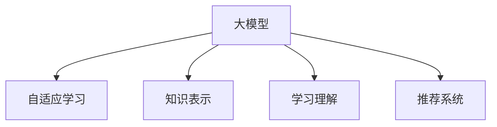

                 

# 大模型在个性化教育中的应用

> 关键词：大模型,个性化教育,学习理解,自适应,知识表示

## 1. 背景介绍

### 1.1 问题由来
教育是培养未来社会人才的基石。近年来，随着人工智能(AI)技术的飞速发展，人们开始尝试将其应用于教育领域，以期提升教育质量和教学效率。基于大模型的个性化教育，作为其中一种重要的实践方式，引起了广泛关注。

个性化教育旨在根据每个学生的特点和需求，量身定制个性化的学习路径和资源，以实现最佳学习效果。然而，传统基于规则的教育方案难以实现真正的个性化，特别是在大规模教育背景下。

大模型在教育中的应用，打破了这一限制。通过深度学习、自然语言处理等技术，大模型能够自动理解学习者的需求和表现，从而提供更加贴合个体特征的教育资源和建议。本文将系统介绍大模型在个性化教育中的原理与应用，希望能为教育领域的数字化转型提供有益参考。

### 1.2 问题核心关键点
当前，基于大模型的个性化教育范式主要基于以下几个关键点：

1. **自适应学习**：根据学生的学习进度和表现，动态调整学习内容和难度。
2. **知识表示**：利用知识图谱、语义网络等工具，建立和表示知识点之间的关系。
3. **学习理解**：通过理解学生的学习行为和反馈，提供针对性的教育建议。
4. **推荐系统**：根据学生的学习历史和偏好，推荐合适的学习资源和活动。

这些关键点通过深度学习模型和大规模语料库的训练，可以提升个性化教育的效果和灵活性。

## 2. 核心概念与联系

### 2.1 核心概念概述

本节将介绍几个密切相关的大模型和个性化教育的核心概念：

- **大模型**：以自回归或自编码模型为代表的大规模预训练语言模型。通过在大规模无标签文本语料上进行预训练，学习通用的语言表示，具备强大的语言理解和生成能力。
- **自适应学习**：根据学生的学习行为和反馈，动态调整学习内容和策略，以实现个性化学习。
- **知识表示**：通过语义网络、知识图谱等工具，表示和组织知识点之间的关系，方便模型进行知识推理和迁移。
- **学习理解**：通过理解学生的学习行为、情感和认知状态，提供针对性的学习建议和反馈。
- **推荐系统**：根据学生的学习历史和偏好，推荐合适的学习资源和活动。

这些概念之间的逻辑关系可以通过以下Mermaid流程图来展示：



这个流程图展示了大模型在个性化教育中的核心概念及其之间的关系：

1. 大模型通过预训练获得基础能力。
2. 自适应学习通过动态调整内容策略，实现个性化教育。
3. 知识表示通过语义网络等工具，建立知识点之间的关系。
4. 学习理解通过理解学生的学习行为和反馈，提供个性化建议。
5. 推荐系统通过分析学习历史，推荐合适的资源。

这些概念共同构成了大模型在个性化教育中的框架，使得模型能够更好地理解和适应学生的学习需求。

## 3. 核心算法原理 & 具体操作步骤
### 3.1 算法原理概述

基于大模型的个性化教育，本质上是一个自适应学习的优化过程。其核心思想是：利用大模型的语言理解能力，动态调整学习内容和策略，以实现个性化学习。

形式化地，假设有一个学习者 $L$ 和一个目标任务 $T$，其中 $L$ 包含多个子任务 $T_i$。我们定义 $f(\theta, L, T_i)$ 为学习者 $L$ 在任务 $T_i$ 上的表现，其中 $\theta$ 表示学习策略。微调的优化目标是最大化表现函数，即：

$$
\theta^* = \mathop{\arg\max}_{\theta} \sum_{i} f(\theta, L, T_i)
$$

通常，我们通过不断优化策略 $\theta$，调整学习内容和难度，使得 $f(\theta, L, T_i)$ 不断提升，从而实现个性化教育。

### 3.2 算法步骤详解

基于大模型的个性化教育一般包括以下几个关键步骤：

**Step 1: 数据收集与预处理**

- 收集学生的学习数据，包括学习行为、成绩、反馈等。
- 对数据进行预处理，如数据清洗、特征工程等。

**Step 2: 构建知识表示**

- 利用知识图谱、语义网络等工具，建立和表示知识点之间的关系。
- 通过语言模型对知识点进行编码，形成可理解的向量表示。

**Step 3: 设计学习策略**

- 根据学生的学习进度和表现，设计个性化的学习策略。
- 策略可能包括推荐学习资源、调整学习难度、安排学习任务等。

**Step 4: 训练大模型**

- 使用学生的数据和知识表示，训练大模型，使其能够理解学生的学习行为和反馈。
- 优化模型的训练目标函数，提高其自适应能力。

**Step 5: 自适应学习**

- 利用训练好的模型，根据学生的实时表现和反馈，动态调整学习内容和策略。
- 循环迭代，不断优化学习策略，提升个性化教育的效果。

### 3.3 算法优缺点

基于大模型的个性化教育具有以下优点：

1. **灵活性高**：大模型可以动态调整学习内容和策略，适应不同的学习者需求。
2. **自适应强**：通过学习学生的行为和反馈，能够实时调整学习策略，提高学习效率。
3. **泛化能力强**：大模型能够从大规模数据中学习通用语言知识，适应不同的知识点和任务。

同时，该方法也存在一定的局限性：

1. **数据依赖**：个性化教育的效果很大程度上依赖于学生数据的全面性和准确性。
2. **隐私问题**：学生的学习数据涉及个人隐私，数据收集和处理需要遵循严格的隐私保护措施。
3. **计算成本高**：大规模模型的训练和推理需要大量的计算资源，成本较高。
4. **模型复杂**：大模型结构复杂，难以解释其内部工作机制，需要进一步优化。

尽管存在这些局限性，但就目前而言，基于大模型的个性化教育方法仍是大规模教育的有效途径。未来相关研究的重点在于如何进一步降低对数据的依赖，提高模型的可解释性和隐私保护，同时兼顾计算效率。

### 3.4 算法应用领域

基于大模型的个性化教育方法在多个教育领域得到了广泛应用，例如：

- **K-12教育**：利用大模型进行自适应学习，提高基础教育的教学效果。
- **高等教育**：通过个性化的学习资源推荐，提升高等教育的自主学习效率。
- **职业培训**：根据学员的学习进度和反馈，提供定制化的职业培训课程和建议。
- **特殊教育**：为有特定需求的特殊儿童设计个性化的教育方案，提升其学习效果。

除了上述这些经典应用外，大模型在教育领域的应用还在不断拓展，如智能导师、在线辅导、虚拟实验室等，为教育技术的发展提供了新的可能。

## 4. 数学模型和公式 & 详细讲解 & 举例说明

### 4.1 数学模型构建

本节将使用数学语言对基于大模型的个性化教育过程进行更加严格的刻画。

假设有一个学生 $L$，其学习行为可以表示为一个时间序列 $\{a_t\}_{t=1}^T$，其中 $a_t$ 为学习者在第 $t$ 时刻的行为数据，如观看视频时长、做题得分等。我们希望构建一个自适应学习策略 $f(\theta, L)$，使其最大化学生的学习效果。

定义目标函数为：

$$
\mathcal{L}(\theta) = \sum_{t=1}^T \ell(f(\theta, a_t), y_t)
$$

其中 $\ell$ 为损失函数，用于衡量策略 $f(\theta, a_t)$ 的预测与实际学习效果 $y_t$ 之间的差异。

通过优化目标函数 $\mathcal{L}(\theta)$，我们可以找到最优策略 $\theta^*$，使得学生 $L$ 的学习效果最大化。

### 4.2 公式推导过程

以下我们以视频推荐系统为例，推导目标函数的梯度计算公式。

假设模型 $f(\theta, a_t)$ 通过大模型 $M_{\theta}$ 得到，其中 $a_t$ 为学生第 $t$ 次观看视频的时长。视频 $i$ 的评分表示为 $y_t$。目标函数为：

$$
\mathcal{L}(\theta) = \sum_{t=1}^T \ell(M_{\theta}(a_t), y_t)
$$

定义模型的预测结果为 $\hat{y_t}=M_{\theta}(a_t)$，则目标函数可以重写为：

$$
\mathcal{L}(\theta) = \sum_{t=1}^T \ell(\hat{y_t}, y_t)
$$

为了求解目标函数的梯度，我们需要计算损失函数 $\ell(\hat{y_t}, y_t)$ 对 $\theta$ 的偏导数。由于目标函数是求和形式，我们可以使用蒙特卡洛方法或随机梯度下降法等，对每个 $t$ 求偏导数并求平均，得到整体梯度：

$$
\frac{\partial \mathcal{L}(\theta)}{\partial \theta} = \frac{1}{T}\sum_{t=1}^T \frac{\partial \ell(\hat{y_t}, y_t)}{\partial \hat{y_t}} \frac{\partial \hat{y_t}}{\partial \theta}
$$

其中 $\frac{\partial \hat{y_t}}{\partial \theta}$ 可以通过反向传播算法计算得到。

### 4.3 案例分析与讲解

假设我们有一个学习者 $L$，其学习行为数据为 $\{a_t\}_{t=1}^T$，其中 $a_t$ 为观看视频的时长。我们希望构建一个推荐视频策略 $f(\theta, a_t)$，使其最大化学生的学习效果。

首先，我们需要构建一个视频评分模型 $M_{\theta}$，用于预测视频评分。模型的预测结果为 $\hat{y_t}=M_{\theta}(a_t)$。

然后，我们将目标函数 $\mathcal{L}(\theta)$ 对 $\theta$ 求偏导数，得到：

$$
\frac{\partial \mathcal{L}(\theta)}{\partial \theta} = \frac{1}{T}\sum_{t=1}^T \frac{\partial \ell(\hat{y_t}, y_t)}{\partial \hat{y_t}} \frac{\partial \hat{y_t}}{\partial \theta}
$$

其中 $\frac{\partial \hat{y_t}}{\partial \theta}$ 为反向传播计算得到的梯度。

最后，通过优化目标函数 $\mathcal{L}(\theta)$，我们可以找到最优策略 $\theta^*$，使得学生 $L$ 的视频推荐效果最大化。

## 5. 项目实践：代码实例和详细解释说明
### 5.1 开发环境搭建

在进行个性化教育实践前，我们需要准备好开发环境。以下是使用Python进行PyTorch开发的环境配置流程：

1. 安装Anaconda：从官网下载并安装Anaconda，用于创建独立的Python环境。

2. 创建并激活虚拟环境：
```bash
conda create -n pytorch-env python=3.8 
conda activate pytorch-env
```

3. 安装PyTorch：根据CUDA版本，从官网获取对应的安装命令。例如：
```bash
conda install pytorch torchvision torchaudio cudatoolkit=11.1 -c pytorch -c conda-forge
```

4. 安装相关库：
```bash
pip install transformers sklearn pandas jupyter notebook
```

完成上述步骤后，即可在`pytorch-env`环境中开始个性化教育实践。

### 5.2 源代码详细实现

下面以视频推荐系统为例，给出使用Transformers库进行大模型微调的PyTorch代码实现。

首先，定义推荐系统的数据处理函数：

```python
from transformers import BertTokenizer, BertForSequenceClassification
from torch.utils.data import Dataset, DataLoader
from sklearn.metrics import accuracy_score
import torch

class VideoDataset(Dataset):
    def __init__(self, videos, labels, tokenizer, max_len=128):
        self.videos = videos
        self.labels = labels
        self.tokenizer = tokenizer
        self.max_len = max_len
        
    def __len__(self):
        return len(self.videos)
    
    def __getitem__(self, item):
        video = self.videos[item]
        label = self.labels[item]
        
        encoding = self.tokenizer(video, return_tensors='pt', max_length=self.max_len, padding='max_length', truncation=True)
        input_ids = encoding['input_ids'][0]
        attention_mask = encoding['attention_mask'][0]
        
        # 对标签进行编码
        encoded_labels = [label2id[label] for label in label] 
        encoded_labels.extend([label2id['neutral']] * (self.max_len - len(encoded_labels)))
        labels = torch.tensor(encoded_labels, dtype=torch.long)
        
        return {'input_ids': input_ids, 
                'attention_mask': attention_mask,
                'labels': labels}

# 标签与id的映射
label2id = {'positive': 1, 'negative': 0, 'neutral': 2}
id2label = {v: k for k, v in label2id.items()}

# 创建dataset
tokenizer = BertTokenizer.from_pretrained('bert-base-cased')

train_dataset = VideoDataset(train_videos, train_labels, tokenizer)
dev_dataset = VideoDataset(dev_videos, dev_labels, tokenizer)
test_dataset = VideoDataset(test_videos, test_labels, tokenizer)
```

然后，定义模型和优化器：

```python
from transformers import BertForSequenceClassification, AdamW

model = BertForSequenceClassification.from_pretrained('bert-base-cased', num_labels=len(label2id))

optimizer = AdamW(model.parameters(), lr=2e-5)
```

接着，定义训练和评估函数：

```python
from tqdm import tqdm
import numpy as np

device = torch.device('cuda') if torch.cuda.is_available() else torch.device('cpu')
model.to(device)

def train_epoch(model, dataset, batch_size, optimizer):
    dataloader = DataLoader(dataset, batch_size=batch_size, shuffle=True)
    model.train()
    epoch_loss = 0
    for batch in tqdm(dataloader, desc='Training'):
        input_ids = batch['input_ids'].to(device)
        attention_mask = batch['attention_mask'].to(device)
        labels = batch['labels'].to(device)
        model.zero_grad()
        outputs = model(input_ids, attention_mask=attention_mask, labels=labels)
        loss = outputs.loss
        epoch_loss += loss.item()
        loss.backward()
        optimizer.step()
    return epoch_loss / len(dataloader)

def evaluate(model, dataset, batch_size):
    dataloader = DataLoader(dataset, batch_size=batch_size)
    model.eval()
    preds, labels = [], []
    with torch.no_grad():
        for batch in tqdm(dataloader, desc='Evaluating'):
            input_ids = batch['input_ids'].to(device)
            attention_mask = batch['attention_mask'].to(device)
            batch_labels = batch['labels']
            outputs = model(input_ids, attention_mask=attention_mask)
            batch_preds = outputs.logits.argmax(dim=2).to('cpu').tolist()
            batch_labels = batch_labels.to('cpu').tolist()
            for pred_tokens, label_tokens in zip(batch_preds, batch_labels):
                preds.append(pred_tokens[:len(label_tokens)])
                labels.append(label_tokens)
                
    acc = accuracy_score(labels, preds)
    return acc

# 训练流程
epochs = 5
batch_size = 16

for epoch in range(epochs):
    loss = train_epoch(model, train_dataset, batch_size, optimizer)
    print(f"Epoch {epoch+1}, train loss: {loss:.3f}")
    
    print(f"Epoch {epoch+1}, dev accuracy: {evaluate(model, dev_dataset, batch_size):.3f}")
    
print("Test accuracy:", evaluate(model, test_dataset, batch_size))
```

以上就是使用PyTorch对BERT进行视频推荐系统微调的完整代码实现。可以看到，得益于Transformers库的强大封装，我们可以用相对简洁的代码完成BERT模型的加载和微调。

### 5.3 代码解读与分析

让我们再详细解读一下关键代码的实现细节：

**VideoDataset类**：
- `__init__`方法：初始化视频、标签、分词器等关键组件。
- `__len__`方法：返回数据集的样本数量。
- `__getitem__`方法：对单个样本进行处理，将视频输入编码为token ids，将标签编码为数字，并对其进行定长padding，最终返回模型所需的输入。

**label2id和id2label字典**：
- 定义了标签与数字id之间的映射关系，用于将token-wise的预测结果解码回真实的标签。

**训练和评估函数**：
- 使用PyTorch的DataLoader对数据集进行批次化加载，供模型训练和推理使用。
- 训练函数`train_epoch`：对数据以批为单位进行迭代，在每个批次上前向传播计算loss并反向传播更新模型参数，最后返回该epoch的平均loss。
- 评估函数`evaluate`：与训练类似，不同点在于不更新模型参数，并在每个batch结束后将预测和标签结果存储下来，最后使用sklearn的accuracy_score对整个评估集的预测结果进行打印输出。

**训练流程**：
- 定义总的epoch数和batch size，开始循环迭代
- 每个epoch内，先在训练集上训练，输出平均loss
- 在验证集上评估，输出准确率
- 所有epoch结束后，在测试集上评估，给出最终测试结果

可以看到，PyTorch配合Transformers库使得BERT微调的视频推荐系统代码实现变得简洁高效。开发者可以将更多精力放在数据处理、模型改进等高层逻辑上，而不必过多关注底层的实现细节。

当然，工业级的系统实现还需考虑更多因素，如模型的保存和部署、超参数的自动搜索、更灵活的任务适配层等。但核心的微调范式基本与此类似。

## 6. 实际应用场景
### 6.1 智能辅导

智能辅导系统可以基于大模型的个性化教育方法，为学生提供个性化的学习支持。系统根据学生的学习进度和表现，动态调整学习内容和策略，提供针对性的辅导资源和建议。

在技术实现上，可以收集学生的历史学习数据，包括学习行为、成绩、反馈等，利用大模型构建学习策略，动态调整学习资源和难度，提供个性化的辅导方案。例如，对于学习薄弱的部分，可以推荐更多的相关视频、练习题，同时增加复习难度。对于学习效率高的部分，可以适当减少复习频率，推荐更有挑战性的学习材料。

### 6.2 虚拟课堂

虚拟课堂系统可以基于大模型的个性化教育方法，为学生提供灵活的在线学习环境。系统根据学生的学习进度和表现，动态调整课程内容和难度，提供个性化的学习路径和反馈。

在技术实现上，可以构建一个虚拟课堂平台，集成各类学习资源和活动，如视频课程、互动问答、小组讨论等。学生通过平台提交学习行为和反馈，大模型根据学生的表现，动态调整课程内容和难度，提供个性化的学习路径和反馈。例如，对于表现优秀的学生，可以推荐更高难度的课程，增加学习负担。对于表现一般的学生，可以降低课程难度，提供更多的辅导支持。

### 6.3 智能评估

智能评估系统可以基于大模型的个性化教育方法，为教师提供科学的学习评估工具。系统根据学生的学习进度和表现，动态调整评估内容和标准，提供个性化的评估报告和建议。

在技术实现上，可以构建一个智能评估平台，集成各类评估工具和数据，如在线测试、作业批改、考试系统等。教师通过平台收集学生的学习数据，大模型根据学生的表现，动态调整评估内容和标准，提供个性化的评估报告和建议。例如，对于学习薄弱的学生，可以增加测试频率，提供更多的复习建议。对于学习高效的学生，可以适当减少测试频率，提供更高难度的测试题目。

### 6.4 未来应用展望

随着大模型和个性化教育技术的不断发展，未来的教育系统将呈现以下几个趋势：

1. **自适应学习普及**：自适应学习将成为教育标准化的重要组成部分，提升教育质量。
2. **知识图谱应用广泛**：知识图谱将广泛应用于教育领域，提供更准确的知识表示和推理。
3. **个性化推荐普及**：推荐系统将广泛应用到教育各个环节，提升个性化教育的实现效果。
4. **AI导师普及**：AI导师将替代部分传统教师，提供个性化的学习指导和反馈。
5. **虚拟现实应用广泛**：虚拟现实技术将进一步应用于教育，提供沉浸式学习体验。
6. **智能评估普及**：智能评估将替代部分人工评估，提供科学、高效的学习反馈。

未来，基于大模型的个性化教育将更加智能化、普适化，提升教育质量和效率，为学生提供更加贴合个体特征的学习方案。

## 7. 工具和资源推荐
### 7.1 学习资源推荐

为了帮助开发者系统掌握大模型在个性化教育中的原理与应用，这里推荐一些优质的学习资源：

1. 《深度学习》课程：斯坦福大学开设的深度学习课程，全面介绍了深度学习的基本概念和前沿技术。
2. 《Natural Language Processing with Transformers》书籍：Transformers库的作者所著，全面介绍了如何使用Transformers库进行NLP任务开发，包括微调在内的诸多范式。
3. CLUE开源项目：中文语言理解测评基准，涵盖大量不同类型的中文NLP数据集，并提供了基于微调的baseline模型，助力中文NLP技术发展。
4. Kaggle竞赛：参加Kaggle上的NLP竞赛，如推荐系统、文本分类、情感分析等，积累实战经验。
5. 《Python深度学习》书籍：系统介绍了深度学习在NLP领域的应用，包括微调在内的多种技术。

通过对这些资源的学习实践，相信你一定能够快速掌握大模型在个性化教育中的原理与应用，并用于解决实际的NLP问题。

### 7.2 开发工具推荐

高效的开发离不开优秀的工具支持。以下是几款用于大模型个性化教育开发的常用工具：

1. PyTorch：基于Python的开源深度学习框架，灵活动态的计算图，适合快速迭代研究。
2. TensorFlow：由Google主导开发的开源深度学习框架，生产部署方便，适合大规模工程应用。
3. Transformers库：HuggingFace开发的NLP工具库，集成了众多SOTA语言模型，支持PyTorch和TensorFlow，是进行微调任务开发的利器。
4. Weights & Biases：模型训练的实验跟踪工具，可以记录和可视化模型训练过程中的各项指标，方便对比和调优。
5. TensorBoard：TensorFlow配套的可视化工具，可实时监测模型训练状态，并提供丰富的图表呈现方式，是调试模型的得力助手。
6. Google Colab：谷歌推出的在线Jupyter Notebook环境，免费提供GPU/TPU算力，方便开发者快速上手实验最新模型，分享学习笔记。

合理利用这些工具，可以显著提升大模型个性化教育的开发效率，加快创新迭代的步伐。

### 7.3 相关论文推荐

大模型在个性化教育领域的应用，源于学界的持续研究。以下是几篇奠基性的相关论文，推荐阅读：

1. Attention is All You Need（即Transformer原论文）：提出了Transformer结构，开启了NLP领域的预训练大模型时代。
2. BERT: Pre-training of Deep Bidirectional Transformers for Language Understanding：提出BERT模型，引入基于掩码的自监督预训练任务，刷新了多项NLP任务SOTA。
3. Knowledge-Graph-Enhanced Multi-Head Attention for Question Answering：研究了知识图谱增强的多头注意力机制，提高了模型的知识推理能力。
4. Learning to Ask Questions for Knowledge Answering：探讨了基于问题生成的知识抽取方法，提高了模型的问题生成能力和知识推理能力。
5. Learning to Select Subtrees with Inference Graphs：研究了推理图增强的序列标注模型，提升了模型的推理能力和泛化能力。

这些论文代表了大模型在个性化教育领域的研究进展。通过学习这些前沿成果，可以帮助研究者把握学科前进方向，激发更多的创新灵感。

## 8. 总结：未来发展趋势与挑战
### 8.1 总结

本文对基于大模型的个性化教育方法进行了全面系统的介绍。首先阐述了个性化教育的背景和目标，明确了大模型在其中的核心作用。其次，从原理到实践，详细讲解了个性化教育的数学模型和关键步骤，给出了完整的代码实现。同时，本文还探讨了个性化教育在智能辅导、虚拟课堂、智能评估等实际应用场景中的应用前景，展示了大模型在教育领域的广泛潜力。

通过本文的系统梳理，可以看到，基于大模型的个性化教育方法正在成为教育领域的重要范式，极大地提升了个性化教育的效果和灵活性。未来，随着大模型和个性化教育技术的不断发展，教育系统将进一步智能化、普适化，为学生提供更加贴合个体特征的学习方案，实现教育公平和效率的提升。

### 8.2 未来发展趋势

展望未来，大模型在个性化教育领域的应用将呈现以下几个趋势：

1. **自适应学习普及**：自适应学习将成为教育标准化的重要组成部分，提升教育质量。
2. **知识图谱应用广泛**：知识图谱将广泛应用于教育领域，提供更准确的知识表示和推理。
3. **个性化推荐普及**：推荐系统将广泛应用到教育各个环节，提升个性化教育的实现效果。
4. **AI导师普及**：AI导师将替代部分传统教师，提供个性化的学习指导和反馈。
5. **虚拟现实应用广泛**：虚拟现实技术将进一步应用于教育，提供沉浸式学习体验。
6. **智能评估普及**：智能评估将替代部分人工评估，提供科学、高效的学习反馈。

这些趋势凸显了大模型在个性化教育领域的广泛应用前景。这些方向的探索发展，必将进一步提升教育系统的性能和教育效果，为构建更加公平、高效、智能的教育体系奠定坚实基础。

### 8.3 面临的挑战

尽管大模型在个性化教育领域取得了显著成果，但在迈向更加智能化、普适化应用的过程中，仍面临诸多挑战：

1. **数据依赖**：个性化教育的效果很大程度上依赖于学生数据的全面性和准确性。如何全面、高效地收集和利用学生数据，是未来研究的重要方向。
2. **隐私问题**：学生的学习数据涉及个人隐私，数据收集和处理需要遵循严格的隐私保护措施。如何在保障隐私的同时，提高数据的利用效率，是未来研究的重要课题。
3. **计算成本高**：大规模模型的训练和推理需要大量的计算资源，成本较高。如何降低计算成本，提高模型训练和推理的效率，是未来研究的重要方向。
4. **模型复杂**：大模型结构复杂，难以解释其内部工作机制，需要进一步优化。如何提高模型的可解释性，使其更容易被教师和学生理解和接受，是未来研究的重要课题。
5. **智能不足**：尽管大模型在自适应学习、知识表示等方面取得了进展，但离真正的智能教育还有较大差距。如何构建更加智能、自适应的教育系统，是未来研究的重要方向。

正视个性化教育面临的这些挑战，积极应对并寻求突破，将是大模型在教育领域走向成熟的必由之路。相信随着学界和产业界的共同努力，这些挑战终将一一被克服，大模型在教育领域必将取得更加辉煌的成就。

### 8.4 研究展望

面对个性化教育所面临的种种挑战，未来的研究需要在以下几个方面寻求新的突破：

1. **探索无监督和半监督学习**：摆脱对大规模标注数据的依赖，利用自监督学习、主动学习等无监督和半监督范式，最大限度利用非结构化数据，实现更加灵活高效的个性化教育。
2. **研究参数高效和计算高效的微调方法**：开发更加参数高效的微调方法，在固定大部分预训练参数的同时，只更新极少量的任务相关参数。同时优化微调模型的计算图，减少前向传播和反向传播的资源消耗，实现更加轻量级、实时性的部署。
3. **融合因果和对比学习范式**：通过引入因果推断和对比学习思想，增强模型的因果关系能力和知识推理能力，学习更加普适、鲁棒的语言表征，从而提升模型的泛化性和抗干扰能力。
4. **结合因果分析和博弈论工具**：将因果分析方法引入微调模型，识别出模型决策的关键特征，增强输出解释的因果性和逻辑性。借助博弈论工具刻画人机交互过程，主动探索并规避模型的脆弱点，提高系统稳定性。
5. **纳入伦理道德约束**：在模型训练目标中引入伦理导向的评估指标，过滤和惩罚有偏见、有害的输出倾向。同时加强人工干预和审核，建立模型行为的监管机制，确保输出符合人类价值观和伦理道德。

这些研究方向的探索，必将引领大模型在个性化教育领域迈向更高的台阶，为构建安全、可靠、可解释、可控的智能教育系统铺平道路。面向未来，大模型在教育领域还需要与其他人工智能技术进行更深入的融合，如知识表示、因果推理、强化学习等，多路径协同发力，共同推动教育技术的发展。只有勇于创新、敢于突破，才能不断拓展大模型在教育领域的边界，让智能教育技术更好地造福全人类。

## 9. 附录：常见问题与解答

**Q1：大模型在个性化教育中如何处理数据隐私问题？**

A: 大模型在个性化教育中处理数据隐私问题，主要通过以下几种方式：
1. **数据匿名化**：在数据收集和处理过程中，对个人身份信息进行匿名化处理，确保数据的隐私性。
2. **数据加密**：对敏感数据进行加密存储和传输，防止数据泄露。
3. **差分隐私**：在数据收集和分析过程中，加入噪声，保护个体数据隐私，同时保障数据的统计合理性。
4. **模型蒸馏**：通过小模型对大模型进行蒸馏，保留大模型的主要特征，同时减少对隐私数据的依赖。
5. **联邦学习**：在分布式环境下，多个模型共同学习，无需传输原始数据，保护数据隐私。

通过这些技术手段，可以在保证数据隐私的同时，实现大模型在个性化教育中的应用。

**Q2：大模型在个性化教育中如何提高计算效率？**

A: 大模型在个性化教育中提高计算效率，主要通过以下几种方式：
1. **参数剪枝**：通过剪枝技术去除模型中冗余的参数，减少模型复杂度，提高推理速度。
2. **量化加速**：将浮点模型转为定点模型，压缩存储空间，提高计算效率。
3. **模型压缩**：通过模型蒸馏、知识蒸馏等技术，减小模型尺寸，提升推理速度。
4. **模型并行**：利用GPU/TPU等高性能设备，实现模型并行计算，提升计算效率。
5. **分布式训练**：在多台设备上并行训练，加速模型训练过程，降低计算成本。

通过这些优化手段，可以显著提高大模型在个性化教育中的计算效率，满足实际应用的需求。

**Q3：大模型在个性化教育中如何进行知识表示？**

A: 大模型在个性化教育中进行知识表示，主要通过以下几种方式：
1. **知识图谱**：利用知识图谱工具，表示和组织知识点之间的关系，方便模型进行知识推理和迁移。
2. **语义网络**：构建语义网络，将知识点表示为有向图，方便模型进行语义分析和推理。
3. **向量表示**：通过语言模型对知识点进行编码，形成可理解的向量表示，方便模型进行比较和匹配。
4. **嵌入表示**：利用嵌入表示技术，将知识点转换为高维向量，方便模型进行相似度计算和推理。

通过这些方法，大模型可以更好地理解和管理知识点，提升个性化教育的效果。

**Q4：大模型在个性化教育中的应用场景有哪些？**

A: 大模型在个性化教育中的应用场景主要包括以下几个方面：
1. **智能辅导**：根据学生的学习进度和表现，动态调整学习内容和策略，提供个性化的辅导资源和建议。
2. **虚拟课堂**：根据学生的学习进度和表现，动态调整课程内容和难度，提供个性化的学习路径和反馈。
3. **智能评估**：根据学生的学习进度和表现，动态调整评估内容和标准，提供个性化的评估报告和建议。
4. **个性化推荐**：根据学生的学习历史和偏好，推荐合适的学习资源和活动，提升个性化教育的实现效果。
5. **虚拟导师**：利用大模型构建虚拟导师，提供个性化的学习指导和反馈，提升学生的学习效果。

这些应用场景展示了大模型在个性化教育中的广泛潜力，未来随着技术的不断进步，大模型将在教育领域发挥更大的作用。

**Q5：大模型在个性化教育中如何进行自适应学习？**

A: 大模型在个性化教育中进行自适应学习，主要通过以下几种方式：
1. **动态调整学习内容**：根据学生的学习进度和表现，动态调整学习内容和难度，提供个性化的学习路径和反馈。
2. **学习行为分析**：通过分析学生的学习行为数据，识别学习障碍和薄弱环节，提供针对性的辅导方案。
3. **学习效果评估**：通过评估学生的学习效果，动态调整学习策略，提升个性化教育的效果。
4. **反馈机制**：根据学生的反馈，调整学习策略，提升个性化教育的适应性和灵活性。
5. **自适应算法**：引入自适应算法，根据学生的学习行为和反馈，动态调整学习策略，实现真正的个性化教育。

通过这些方法，大模型可以更好地适应学生的学习需求，提升个性化教育的效果。

---

作者：禅与计算机程序设计艺术 / Zen and the Art of Computer Programming

