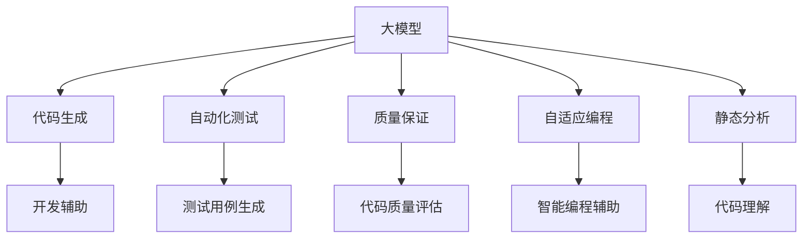

                 

# 大模型在软件开发中的应用

> 关键词：
> - 大模型
> - 软件开发
> - 代码生成
> - 自动化测试
> - 质量保证
> - 静态分析
> - 自适应编程

## 1. 背景介绍

### 1.1 问题由来

在现代软件开发过程中，人们越来越多地依赖于自动化工具和智能系统来提高效率和减少错误。然而，尽管现有工具如IDE、版本控制系统和自动化测试框架提供了极大的便利，但软件开发的复杂性和多样性仍然对开发人员提出了巨大挑战。特别是在大型软件项目中，代码编写、测试、维护等环节往往需要耗费大量时间和精力。

大模型，尤其是预训练语言模型，如GPT-3、BERT等，已经成为解决这些挑战的重要手段。通过大规模预训练和微调，大模型已经具备了强大的代码理解和生成能力，能够辅助开发人员自动生成代码、编写文档、测试代码等，显著提升了软件开发的速度和质量。

### 1.2 问题核心关键点

大模型在软件开发中的应用主要围绕以下几个核心关键点展开：

- **代码生成**：基于自然语言描述生成符合语法规范和逻辑结构的代码片段。
- **自动化测试**：通过大模型对代码进行逻辑推理和边界值测试，生成测试用例。
- **质量保证**：利用大模型对代码进行质量评估和风格检查。
- **自适应编程**：根据代码历史和上下文，大模型能够智能调整编写代码的策略和风格。
- **静态分析**：通过大模型对代码进行结构化分析和功能推断，帮助开发人员理解和重构复杂代码。

这些应用极大地简化了开发流程，提高了工作效率，为软件开发者带来了极大的便利。

## 2. 核心概念与联系

### 2.1 核心概念概述

为了更好地理解大模型在软件开发中的应用，我们需要先明确几个核心概念：

- **大模型**：以自回归模型（如GPT）或自编码模型（如BERT）为代表的大规模预训练语言模型。通过在大规模无标签文本语料上进行预训练，学习通用的语言表示，具备强大的语言理解和生成能力。

- **代码生成**：使用自然语言描述生成符合语法规范和逻辑结构的代码片段，帮助开发人员快速编写代码。

- **自动化测试**：通过自然语言描述生成测试用例，覆盖代码的逻辑和边界条件，提高测试的自动化程度。

- **质量保证**：使用大模型对代码进行质量评估和风格检查，确保代码符合规范和最佳实践。

- **自适应编程**：根据代码历史和上下文，大模型能够智能调整编写代码的策略和风格，提升代码质量。

- **静态分析**：使用大模型对代码进行结构化分析和功能推断，帮助开发人员理解和重构复杂代码。

这些概念之间的逻辑关系可以通过以下Mermaid流程图来展示：



这个流程图展示了大模型在软件开发中的应用场景及其与其他关键技术的关联。

## 3. 核心算法原理 & 具体操作步骤

### 3.1 算法原理概述

基于大模型的软件开发应用，核心原理是将大模型视为一个强大的"语言理解器和生成器"，通过对其输入自然语言描述，生成符合要求的代码片段或执行逻辑推理。具体来说，大模型先通过预训练学习语言表示，然后在微调阶段学习与特定任务相关的语言模式和代码规范，最终能够生成或推断代码。

### 3.2 算法步骤详解

基于大模型的软件开发应用一般包括以下几个关键步骤：

**Step 1: 准备数据和模型**

- 收集与软件任务相关的文本数据，如代码注释、开发文档、API文档等，作为大模型的训练材料。
- 选择合适的大模型（如GPT-3、BERT等），并下载其预训练参数。
- 在微调时，将任务相关的文本数据和自然语言指令作为输入，优化模型的输出格式和结构，以生成符合要求的代码片段或测试用例。

**Step 2: 添加任务适配层**

- 根据任务类型，设计合适的输出层和损失函数。例如，对于代码生成任务，可以设计一个代码生成器，并使用BLEU等评估指标。
- 对于测试用例生成任务，可以设计一个逻辑推理器，生成符合边界条件的测试用例。
- 对于质量保证任务，可以设计一个代码检查器，对代码进行风格和语义检查。

**Step 3: 设置微调超参数**

- 选择合适的优化算法及其参数，如AdamW、SGD等，设置学习率、批大小、迭代轮数等。
- 设置正则化技术及强度，包括权重衰减、Dropout、Early Stopping等。
- 确定冻结预训练参数的策略，如仅微调顶层，或全部参数都参与微调。

**Step 4: 执行梯度训练**

- 将训练集数据分批次输入模型，前向传播计算损失函数。
- 反向传播计算参数梯度，根据设定的优化算法和学习率更新模型参数。
- 周期性在验证集上评估模型性能，根据性能指标决定是否触发Early Stopping。
- 重复上述步骤直到满足预设的迭代轮数或Early Stopping条件。

**Step 5: 测试和部署**

- 在测试集上评估微调后模型的性能，对比微调前后的精度提升。
- 使用微调后的模型对新样本进行推理预测，集成到实际的应用系统中。
- 持续收集新的数据，定期重新微调模型，以适应数据分布的变化。

### 3.3 算法优缺点

基于大模型的软件开发应用具有以下优点：

1. **高效性**：大模型能够快速生成符合规范的代码片段或测试用例，显著提升开发效率。
2. **鲁棒性**：大模型经过大规模预训练和微调，具有较强的泛化能力，能够适应多种编程语言和开发环境。
3. **自动化**：大模型能够自动执行代码生成和测试任务，减少人工干预，提高工作自动化水平。
4. **灵活性**：大模型可以根据不同的任务需求，灵活调整输出格式和风格，适应各种开发场景。

然而，该方法也存在一定的局限性：

1. **依赖高质量数据**：大模型的性能很大程度上取决于训练数据的质量和数量，获取高质量标注数据成本较高。
2. **模型复杂性**：大模型通常具有大量的参数，需要较强的计算资源和存储资源，增加了系统复杂性。
3. **输出可解释性不足**：大模型的输出结果难以解释，难以理解和调试其内部工作机制。
4. **偏见问题**：大模型可能会学习到数据中的偏见，导致输出结果存在偏见。

尽管存在这些局限性，但基于大模型的软件开发应用已经展示了其在提升开发效率和质量方面的巨大潜力。

### 3.4 算法应用领域

基于大模型的软件开发应用已经在多个领域得到了广泛应用，包括但不限于：

- **代码生成**：自动生成函数代码、类代码、接口代码等。
- **测试用例生成**：自动生成单元测试、集成测试、端到端测试等。
- **代码理解**：分析代码结构、注释、API文档等，帮助开发人员理解代码。
- **文档生成**：自动生成代码文档、API文档、用户手册等。
- **代码重构**：使用大模型分析代码结构，提出重构建议。

## 4. 数学模型和公式 & 详细讲解

### 4.1 数学模型构建

本节将使用数学语言对基于大模型的软件开发应用过程进行更加严格的刻画。

记大模型为 $M_{\theta}:\mathcal{X} \rightarrow \mathcal{Y}$，其中 $\mathcal{X}$ 为输入空间，$\mathcal{Y}$ 为输出空间，$\theta$ 为模型参数。假设软件开发任务为 $T$，其训练集为 $D=\{(x_i,y_i)\}_{i=1}^N$，其中 $x_i \in \mathcal{X}$ 为自然语言描述，$y_i \in \mathcal{Y}$ 为生成的代码片段或测试用例。

定义模型 $M_{\theta}$ 在输入 $x$ 上的损失函数为 $\ell(M_{\theta}(x),y)$，则在数据集 $D$ 上的经验风险为：

$$
\mathcal{L}(\theta) = \frac{1}{N} \sum_{i=1}^N \ell(M_{\theta}(x_i),y_i)
$$

微调的优化目标是最小化经验风险，即找到最优参数：

$$
\theta^* = \mathop{\arg\min}_{\theta} \mathcal{L}(\theta)
$$

在实践中，我们通常使用基于梯度的优化算法（如SGD、Adam等）来近似求解上述最优化问题。设 $\eta$ 为学习率，$\lambda$ 为正则化系数，则参数的更新公式为：

$$
\theta \leftarrow \theta - \eta \nabla_{\theta}\mathcal{L}(\theta) - \eta\lambda\theta
$$

其中 $\nabla_{\theta}\mathcal{L}(\theta)$ 为损失函数对参数 $\theta$ 的梯度，可通过反向传播算法高效计算。

### 4.2 公式推导过程

以下我们以代码生成任务为例，推导损失函数及其梯度的计算公式。

假设模型 $M_{\theta}$ 在输入 $x$ 上的输出为 $\hat{y}=M_{\theta}(x)$，表示生成的代码片段。真实标签 $y \in \mathcal{Y}$。则代码生成任务的损失函数定义为：

$$
\ell(M_{\theta}(x),y) = \sum_{t=1}^T \ell_t(M_{\theta}(x),y_t)
$$

其中 $T$ 为代码片段的长度，$\ell_t$ 为第 $t$ 个位置的损失函数。对于代码生成任务，我们通常使用BLEU或ROUGE等评估指标，因此可以定义损失函数如下：

$$
\ell(M_{\theta}(x),y) = \frac{1}{T} \sum_{t=1}^T \min(1-\ell_t(M_{\theta}(x),y_t), 0)
$$

将其代入经验风险公式，得：

$$
\mathcal{L}(\theta) = \frac{1}{N} \sum_{i=1}^N \frac{1}{T} \sum_{t=1}^T \min(1-\ell_t(M_{\theta}(x_i),y_{i,t}), 0)
$$

根据链式法则，损失函数对参数 $\theta_k$ 的梯度为：

$$
\frac{\partial \mathcal{L}(\theta)}{\partial \theta_k} = \frac{1}{N} \sum_{i=1}^N \frac{1}{T} \sum_{t=1}^T \frac{\partial \ell_t}{\partial \theta_k}
$$

其中 $\frac{\partial \ell_t}{\partial \theta_k}$ 可进一步递归展开，利用自动微分技术完成计算。

在得到损失函数的梯度后，即可带入参数更新公式，完成模型的迭代优化。重复上述过程直至收敛，最终得到适应软件开发任务的最优模型参数 $\theta^*$。

## 5. 项目实践：代码实例和详细解释说明

### 5.1 开发环境搭建

在进行软件开发应用的大模型实践前，我们需要准备好开发环境。以下是使用Python进行PyTorch开发的环境配置流程：

1. 安装Anaconda：从官网下载并安装Anaconda，用于创建独立的Python环境。

2. 创建并激活虚拟环境：
```bash
conda create -n pytorch-env python=3.8 
conda activate pytorch-env
```

3. 安装PyTorch：根据CUDA版本，从官网获取对应的安装命令。例如：
```bash
conda install pytorch torchvision torchaudio cudatoolkit=11.1 -c pytorch -c conda-forge
```

4. 安装Transformers库：
```bash
pip install transformers
```

5. 安装各类工具包：
```bash
pip install numpy pandas scikit-learn matplotlib tqdm jupyter notebook ipython
```

完成上述步骤后，即可在`pytorch-env`环境中开始开发实践。

### 5.2 源代码详细实现

这里我们以代码生成任务为例，给出使用Transformers库对GPT模型进行代码生成的PyTorch代码实现。

首先，定义代码生成任务的数据处理函数：

```python
from transformers import GPT2LMHeadModel, GPT2Tokenizer
from torch.utils.data import Dataset
import torch

class CodeGenerationDataset(Dataset):
    def __init__(self, texts, targets, tokenizer, max_len=128):
        self.texts = texts
        self.targets = targets
        self.tokenizer = tokenizer
        self.max_len = max_len
        
    def __len__(self):
        return len(self.texts)
    
    def __getitem__(self, item):
        text = self.texts[item]
        target = self.targets[item]
        
        encoding = self.tokenizer(text, return_tensors='pt', max_length=self.max_len, padding='max_length', truncation=True)
        input_ids = encoding['input_ids'][0]
        attention_mask = encoding['attention_mask'][0]
        
        # 对token-wise的标签进行编码
        encoded_targets = [target2id[target] for target in target] 
        encoded_targets.extend([target2id['EOS']] * (self.max_len - len(encoded_targets)))
        targets = torch.tensor(encoded_targets, dtype=torch.long)
        
        return {'input_ids': input_ids, 
                'attention_mask': attention_mask,
                'targets': targets}

# 标签与id的映射
target2id = {'<START>': 0, 'END_OF_SEQUENCE': 1, '<SEP>': 2, '<TKN>': 3}
id2target = {v: k for k, v in target2id.items()}

# 创建dataset
tokenizer = GPT2Tokenizer.from_pretrained('gpt2')
train_dataset = CodeGenerationDataset(train_texts, train_targets, tokenizer)
dev_dataset = CodeGenerationDataset(dev_texts, dev_targets, tokenizer)
test_dataset = CodeGenerationDataset(test_texts, test_targets, tokenizer)
```

然后，定义模型和优化器：

```python
from transformers import GPT2LMHeadModel, AdamW

model = GPT2LMHeadModel.from_pretrained('gpt2', num_hidden_layers=12, num_attention_heads=12)
model = model.eval()  # 将模型设置为评估模式
optimizer = AdamW(model.parameters(), lr=2e-5)

# 冻结预训练参数
for param in model.parameters():
    param.requires_grad = False

# 解冻顶部几层
for param in model.get_input_embeddings().parameters():
    param.requires_grad = True

for param in model.transformer.out_proj.parameters():
    param.requires_grad = True
```

接着，定义训练和评估函数：

```python
from torch.utils.data import DataLoader
from tqdm import tqdm
from sklearn.metrics import accuracy_score

device = torch.device('cuda') if torch.cuda.is_available() else torch.device('cpu')
model.to(device)

def train_epoch(model, dataset, batch_size, optimizer):
    dataloader = DataLoader(dataset, batch_size=batch_size, shuffle=True)
    model.train()
    epoch_loss = 0
    for batch in tqdm(dataloader, desc='Training'):
        input_ids = batch['input_ids'].to(device)
        attention_mask = batch['attention_mask'].to(device)
        targets = batch['targets'].to(device)
        model.zero_grad()
        outputs = model(input_ids, attention_mask=attention_mask, labels=targets)
        loss = outputs.loss
        epoch_loss += loss.item()
        loss.backward()
        optimizer.step()
    return epoch_loss / len(dataloader)

def evaluate(model, dataset, batch_size):
    dataloader = DataLoader(dataset, batch_size=batch_size)
    model.eval()
    preds, labels = [], []
    with torch.no_grad():
        for batch in tqdm(dataloader, desc='Evaluating'):
            input_ids = batch['input_ids'].to(device)
            attention_mask = batch['attention_mask'].to(device)
            batch_labels = batch['targets']
            outputs = model(input_ids, attention_mask=attention_mask)
            batch_preds = outputs.logits.argmax(dim=2).to('cpu').tolist()
            batch_labels = batch_labels.to('cpu').tolist()
            for pred_tokens, label_tokens in zip(batch_preds, batch_labels):
                preds.append(pred_tokens[:len(label_tokens)])
                labels.append(label_tokens)
                
    print(accuracy_score(labels, preds))
```

最后，启动训练流程并在测试集上评估：

```python
epochs = 5
batch_size = 16

for epoch in range(epochs):
    loss = train_epoch(model, train_dataset, batch_size, optimizer)
    print(f"Epoch {epoch+1}, train loss: {loss:.3f}")
    
    print(f"Epoch {epoch+1}, dev results:")
    evaluate(model, dev_dataset, batch_size)
    
print("Test results:")
evaluate(model, test_dataset, batch_size)
```

以上就是使用PyTorch对GPT模型进行代码生成的完整代码实现。可以看到，得益于Transformers库的强大封装，我们可以用相对简洁的代码完成GPT模型的加载和微调。

### 5.3 代码解读与分析

让我们再详细解读一下关键代码的实现细节：

**CodeGenerationDataset类**：
- `__init__`方法：初始化文本、目标、分词器等关键组件。
- `__len__`方法：返回数据集的样本数量。
- `__getitem__`方法：对单个样本进行处理，将文本输入编码为token ids，将目标编码为数字，并对其进行定长padding，最终返回模型所需的输入。

**target2id和id2target字典**：
- 定义了目标与数字id之间的映射关系，用于将token-wise的预测结果解码回真实的目标。

**训练和评估函数**：
- 使用PyTorch的DataLoader对数据集进行批次化加载，供模型训练和推理使用。
- 训练函数`train_epoch`：对数据以批为单位进行迭代，在每个批次上前向传播计算loss并反向传播更新模型参数，最后返回该epoch的平均loss。
- 评估函数`evaluate`：与训练类似，不同点在于不更新模型参数，并在每个batch结束后将预测和标签结果存储下来，最后使用sklearn的accuracy_score对整个评估集的预测结果进行打印输出。

**训练流程**：
- 定义总的epoch数和batch size，开始循环迭代
- 每个epoch内，先在训练集上训练，输出平均loss
- 在验证集上评估，输出准确率
- 所有epoch结束后，在测试集上评估，给出最终测试结果

可以看到，PyTorch配合Transformers库使得GPT微调的代码实现变得简洁高效。开发者可以将更多精力放在数据处理、模型改进等高层逻辑上，而不必过多关注底层的实现细节。

当然，工业级的系统实现还需考虑更多因素，如模型的保存和部署、超参数的自动搜索、更灵活的任务适配层等。但核心的微调范式基本与此类似。

## 6. 实际应用场景

### 6.1 智能编程助手

基于大模型的软件开发应用，智能编程助手已成为软件开发者的得力助手。智能编程助手可以自动生成代码、编写文档、解释代码逻辑、调试代码错误等，极大地提高了开发效率和代码质量。

在技术实现上，智能编程助手通常将开发者的自然语言指令作为输入，使用大模型对输入进行理解、推理和生成。例如，开发者可以输入类似“输出前100个偶数的平方和”的指令，智能编程助手能够自动生成符合要求的Python代码。

### 6.2 代码自动补全

代码自动补全是大模型在软件开发应用中的另一个重要场景。大模型能够根据开发者的输入代码片段，自动生成可能的代码补全，帮助开发者快速完成代码编写。

例如，开发者在编写函数时，可以输入函数名和部分函数体，智能编程助手能够自动补全函数的参数、返回值、文档字符串等。这种自动补全功能可以大大提高代码编写速度，减少输入错误。

### 6.3 代码重构建议

代码重构是大模型在软件开发中的另一重要应用。通过分析代码结构和语义，大模型能够提出合理的代码重构建议，帮助开发者优化代码结构，提升代码可读性和维护性。

例如，开发者在阅读一段复杂的代码时，可以使用大模型分析代码结构，提出重构建议。这种重构建议可以帮助开发者更好地理解代码逻辑，优化代码性能。

### 6.4 未来应用展望

随着大模型的不断发展和完善，其在软件开发中的应用也将更加广泛和深入。

在智慧开发领域，基于大模型的智能编程助手、代码自动补全、代码重构等应用将提升开发者的工作效率，减少错误率，促进高质量软件产品的开发。

在企业级应用中，基于大模型的代码质量检测、自动化测试、代码生成等应用将提高软件开发的自动化水平，减少人工干预，提升软件质量和稳定性。

在开源社区中，基于大模型的开源代码理解、代码生成、代码重构等应用将提高代码的贡献度，加速开源社区的发展。

总之，大模型在软件开发中的应用将极大地提高开发效率和代码质量，为软件开发带来革命性的变革。未来，伴随大模型的进一步发展和应用，软件开发将变得更加高效、智能和自动化。

## 7. 工具和资源推荐

### 7.1 学习资源推荐

为了帮助开发者系统掌握大模型在软件开发中的应用，这里推荐一些优质的学习资源：

1. 《Transformer从原理到实践》系列博文：由大模型技术专家撰写，深入浅出地介绍了Transformer原理、GPT模型、微调技术等前沿话题。

2. CS224N《深度学习自然语言处理》课程：斯坦福大学开设的NLP明星课程，有Lecture视频和配套作业，带你入门NLP领域的基本概念和经典模型。

3. 《Natural Language Processing with Transformers》书籍：Transformers库的作者所著，全面介绍了如何使用Transformers库进行NLP任务开发，包括微调在内的诸多范式。

4. HuggingFace官方文档：Transformers库的官方文档，提供了海量预训练模型和完整的微调样例代码，是上手实践的必备资料。

5. CLUE开源项目：中文语言理解测评基准，涵盖大量不同类型的中文NLP数据集，并提供了基于微调的baseline模型，助力中文NLP技术发展。

通过对这些资源的学习实践，相信你一定能够快速掌握大模型在软件开发中的应用精髓，并用于解决实际的NLP问题。
###  7.2 开发工具推荐

高效的开发离不开优秀的工具支持。以下是几款用于大模型在软件开发应用开发的常用工具：

1. PyTorch：基于Python的开源深度学习框架，灵活动态的计算图，适合快速迭代研究。大部分预训练语言模型都有PyTorch版本的实现。

2. TensorFlow：由Google主导开发的开源深度学习框架，生产部署方便，适合大规模工程应用。同样有丰富的预训练语言模型资源。

3. Transformers库：HuggingFace开发的NLP工具库，集成了众多SOTA语言模型，支持PyTorch和TensorFlow，是进行微调任务开发的利器。

4. Weights & Biases：模型训练的实验跟踪工具，可以记录和可视化模型训练过程中的各项指标，方便对比和调优。与主流深度学习框架无缝集成。

5. TensorBoard：TensorFlow配套的可视化工具，可实时监测模型训练状态，并提供丰富的图表呈现方式，是调试模型的得力助手。

6. Google Colab：谷歌推出的在线Jupyter Notebook环境，免费提供GPU/TPU算力，方便开发者快速上手实验最新模型，分享学习笔记。

合理利用这些工具，可以显著提升大模型在软件开发应用开发的效率，加快创新迭代的步伐。

### 7.3 相关论文推荐

大模型在软件开发中的应用源于学界的持续研究。以下是几篇奠基性的相关论文，推荐阅读：

1. Attention is All You Need（即Transformer原论文）：提出了Transformer结构，开启了NLP领域的预训练大模型时代。

2. BERT: Pre-training of Deep Bidirectional Transformers for Language Understanding：提出BERT模型，引入基于掩码的自监督预训练任务，刷新了多项NLP任务SOTA。

3. Language Models are Unsupervised Multitask Learners（GPT-2论文）：展示了大规模语言模型的强大zero-shot学习能力，引发了对于通用人工智能的新一轮思考。

4. Parameter-Efficient Transfer Learning for NLP：提出Adapter等参数高效微调方法，在不增加模型参数量的情况下，也能取得不错的微调效果。

5. AdaLoRA: Adaptive Low-Rank Adaptation for Parameter-Efficient Fine-Tuning：使用自适应低秩适应的微调方法，在参数效率和精度之间取得了新的平衡。

这些论文代表了大模型在软件开发应用中的发展脉络。通过学习这些前沿成果，可以帮助研究者把握学科前进方向，激发更多的创新灵感。

## 8. 总结：未来发展趋势与挑战

### 8.1 总结

本文对基于大模型的软件开发应用进行了全面系统的介绍。首先阐述了大模型在软件开发中的研究背景和应用意义，明确了其在代码生成、自动化测试、质量保证等方面的独特价值。其次，从原理到实践，详细讲解了大模型的数学模型和关键步骤，给出了代码生成任务的完整代码实例。同时，本文还探讨了智能编程助手、代码自动补全、代码重构等实际应用场景，展示了其在软件开发中的巨大潜力。最后，本文精选了学习资源和开发工具，力求为读者提供全方位的技术指引。

通过本文的系统梳理，可以看到，基于大模型的软件开发应用正在成为软件开发的重要范式，极大地简化了开发流程，提高了工作效率。未来，伴随大模型的进一步发展和应用，软件开发将变得更加高效、智能和自动化。

### 8.2 未来发展趋势

展望未来，大模型在软件开发中的应用将呈现以下几个发展趋势：

1. **模型规模持续增大**：随着算力成本的下降和数据规模的扩张，预训练语言模型的参数量还将持续增长。超大规模语言模型蕴含的丰富语言知识，有望支撑更加复杂多变的软件开发任务。

2. **微调方法日趋多样**：开发更加参数高效的微调方法，在固定大部分预训练参数的同时，只更新极少量的任务相关参数。同时优化微调模型的计算图，减少前向传播和反向传播的资源消耗，实现更加轻量级、实时性的部署。

3. **持续学习成为常态**：随着数据分布的不断变化，微调模型也需要持续学习新知识以保持性能。如何在不遗忘原有知识的同时，高效吸收新样本信息，将成为重要的研究课题。

4. **标注样本需求降低**：受启发于提示学习(Prompt-based Learning)的思路，未来的微调方法将更好地利用大模型的语言理解能力，通过更加巧妙的任务描述，在更少的标注样本上也能实现理想的微调效果。

5. **多模态微调崛起**：当前的大模型应用主要聚焦于纯文本数据，未来会进一步拓展到图像、视频、语音等多模态数据微调。多模态信息的融合，将显著提升大模型对现实世界的理解和建模能力。

6. **融合因果分析和博弈论工具**：将因果分析方法引入微调模型，识别出模型决策的关键特征，增强输出解释的因果性和逻辑性。借助博弈论工具刻画人机交互过程，主动探索并规避模型的脆弱点，提高系统稳定性。

以上趋势凸显了大模型在软件开发中的应用前景。这些方向的探索发展，必将进一步提升软件开发的效率和质量，为软件开发带来革命性的变革。

### 8.3 面临的挑战

尽管大模型在软件开发中的应用已经取得了显著进展，但在迈向更加智能化、普适化应用的过程中，它仍面临着诸多挑战：

1. **标注成本瓶颈**：大模型的性能很大程度上取决于训练数据的质量和数量，获取高质量标注数据的成本较高。如何进一步降低微调对标注样本的依赖，将是一大难题。

2. **模型鲁棒性不足**：当前微调模型面对域外数据时，泛化性能往往大打折扣。对于测试样本的微小扰动，微调模型的预测也容易发生波动。如何提高微调模型的鲁棒性，避免灾难性遗忘，还需要更多理论和实践的积累。

3. **推理效率有待提高**：大规模语言模型虽然精度高，但在实际部署时往往面临推理速度慢、内存占用大等效率问题。如何在保证性能的同时，简化模型结构，提升推理速度，优化资源占用，将是重要的优化方向。

4. **可解释性亟需加强**：当前微调模型更像是"黑盒"系统，难以解释其内部工作机制和决策逻辑。对于医疗、金融等高风险应用，算法的可解释性和可审计性尤为重要。如何赋予微调模型更强的可解释性，将是亟待攻克的难题。

5. **安全性有待保障**：预训练语言模型难免会学习到数据中的偏见，导致输出结果存在偏见。如何从数据和算法层面消除模型偏见，避免恶意用途，确保输出的安全性，也将是重要的研究课题。

6. **知识整合能力不足**：现有的微调模型往往局限于任务内数据，难以灵活吸收和运用更广泛的先验知识。如何让微调过程更好地与外部知识库、规则库等专家知识结合，形成更加全面、准确的信息整合能力，还有很大的想象空间。

正视微调面临的这些挑战，积极应对并寻求突破，将是大模型在软件开发应用中走向成熟的必由之路。相信随着学界和产业界的共同努力，这些挑战终将一一被克服，大模型在软件开发中的应用必将在更广阔的领域发挥更大作用。

### 8.4 研究展望

面对大模型在软件开发应用中面临的诸多挑战，未来的研究需要在以下几个方面寻求新的突破：

1. **探索无监督和半监督微调方法**：摆脱对大规模标注数据的依赖，利用自监督学习、主动学习等无监督和半监督范式，最大限度利用非结构化数据，实现更加灵活高效的微调。

2. **研究参数高效和计算高效的微调范式**：开发更加参数高效的微调方法，在固定大部分预训练参数的同时，只更新极少量的任务相关参数。同时优化微调模型的计算图，减少前向传播和反向传播的资源消耗，实现更加轻量级、实时性的部署。

3. **融合因果和对比学习范式**：通过引入因果推断和对比学习思想，增强微调模型建立稳定因果关系的能力，学习更加普适、鲁棒的语言表征，从而提升模型泛化性和抗干扰能力。

4. **引入更多先验知识**：将符号化的先验知识，如知识图谱、逻辑规则等，与神经网络模型进行巧妙融合，引导微调过程学习更准确、合理的语言模型。同时加强不同模态数据的整合，实现视觉、语音等多模态信息与文本信息的协同建模。

5. **结合因果分析和博弈论工具**：将因果分析方法引入微调模型，识别出模型决策的关键特征，增强输出解释的因果性和逻辑性。借助博弈论工具刻画人机交互过程，主动探索并规避模型的脆弱点，提高系统稳定性。

6. **纳入伦理道德约束**：在模型训练目标中引入伦理导向的评估指标，过滤和惩罚有偏见、有害的输出倾向。同时加强人工干预和审核，建立模型行为的监管机制，确保输出符合人类价值观和伦理道德。

这些研究方向的探索，必将引领大模型在软件开发应用中迈向更高的台阶，为软件开发带来革命性的变革。面向未来，大模型在软件开发中的应用还需要与其他人工智能技术进行更深入的融合，如知识表示、因果推理、强化学习等，多路径协同发力，共同推动软件开发技术的进步。只有勇于创新、敢于突破，才能不断拓展大模型的边界，让智能技术更好地造福人类社会。

## 9. 附录：常见问题与解答

**Q1：大模型在软件开发中的应用是否适用于所有编程语言？**

A: 大模型在软件开发中的应用目前主要适用于支持自然语言描述的编程语言，如Python、JavaScript等。对于C、Java等低级别的编程语言，其开发和调试过程通常依赖于IDE等工具，大模型的应用场景受限。

**Q2：大模型在软件开发中的应用是否适用于所有开发任务？**

A: 大模型在软件开发中的应用主要适用于代码生成、自动化测试、代码理解等任务。对于某些需要深入理解代码逻辑和实现细节的任务，如代码重构、性能优化等，可能需要结合专业知识和工具，大模型的辅助效果有限。

**Q3：大模型在软件开发中的应用是否会取代人类开发者？**

A: 大模型在软件开发中的应用旨在辅助开发人员提升工作效率和代码质量，而不是取代人类开发者。大模型能够快速生成符合规范的代码片段、生成测试用例等，但复杂场景下的代码理解和优化仍需要人类开发者的经验和判断。

**Q4：大模型在软件开发中的应用是否会引入新的风险？**

A: 大模型在软件开发中的应用可能会引入一些新的风险，如代码质量不稳定、输出结果难以解释等。因此，在使用大模型时，需要结合人工干预和审核，确保输出的稳定性和安全性。

**Q5：大模型在软件开发中的应用是否需要大量的标注数据？**

A: 大模型在软件开发中的应用通常需要一定量的标注数据进行微调，以适应特定的任务需求。对于代码生成任务，可以使用已有的代码注释、API文档等数据进行训练；对于自动化测试和质量保证任务，可以使用已有的测试用例和代码审查数据进行训练。

总之，大模型在软件开发中的应用已经展示了其在提升开发效率和代码质量方面的巨大潜力。未来，随着大模型的不断发展和完善，其在软件开发中的应用将更加广泛和深入，为软件开发带来革命性的变革。

