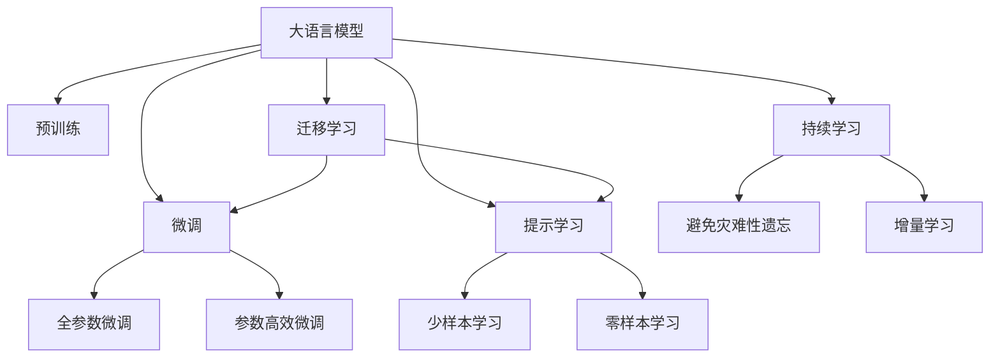

                 

# 大模型对内容创作行业的颠覆性影响

内容创作是知识传播和文化传承的重要途径。传统的创作过程依赖于创作者的知识积累、灵感和创造力，往往需要数年乃至数十年才能积累丰富的创作素材。然而，随着人工智能技术的快速发展，尤其是大语言模型的兴起，内容创作行业正经历着一场颠覆性的变革。大模型通过对海量文本数据的深度学习和推理，极大地提升了创作效率，拓展了创作素材，甚至在一定程度上，正在重构创作模式，开启人机协同的新时代。本文将系统地探讨大模型对内容创作行业的影响，从技术原理、应用实践、未来展望和潜在挑战等方面展开深入分析。

## 1. 背景介绍

### 1.1 内容创作行业的传统挑战

内容创作行业一直面临着高门槛、低效率、成本高等问题。

- **高门槛**：内容创作需要创作者具备深厚的知识背景和丰富的创作经验，往往需要数年乃至数十年才能达到一定的创作水准。
- **低效率**：创作过程往往需要反复思考、反复修改，创作速度较慢。即使是有丰富经验的创作者，也难以快速产出大量高质量内容。
- **成本高**：内容创作需要投入大量的时间、精力和资源，尤其在需要进行大量文字和设计工作的情况下，成本尤为突出。

### 1.2 大模型技术的发展

近年来，随着深度学习技术的迅猛发展，尤其是Transformer结构和大规模预训练语言模型的出现，大模型技术取得了突破性进展。这些模型通过在大规模无标签文本数据上进行预训练，学习到了丰富的语言知识和表达能力，在自然语言处理、文本生成、机器翻译、问答等任务上取得了显著成果。

大模型的成功源于以下几个关键因素：

- **大规模数据**：通过在互联网规模级别的文本数据上进行预训练，大模型能够学习到广泛的语义知识。
- **深度学习架构**：Transformer结构以其高效的自注意力机制，能够在巨量数据上进行并行计算，加速了模型训练和推理。
- **强大表达能力**：大模型不仅能够理解复杂的语言逻辑，还能进行精准的推理和生成，具有强大的创作潜力。

### 1.3 大模型技术的应用前景

随着大模型技术的不断成熟，其在内容创作领域的应用前景被广泛看好。通过将大模型应用于内容创作、文章生成、内容推荐等场景，可以极大地提升创作效率、降低成本、丰富创作素材，进而推动内容创作行业的持续发展和变革。

## 2. 核心概念与联系

### 2.1 核心概念概述

本节将介绍几个与大模型对内容创作行业影响密切相关的核心概念：

- **大语言模型(Large Language Model, LLM)**：以Transformer结构为代表的大规模预训练语言模型。通过在大规模无标签文本数据上进行预训练，学习到丰富的语言知识和表达能力。
- **内容创作(Content Creation)**：通过文字、图像、音频、视频等形式，创作出具有创意和价值的内容。内容创作包括文章撰写、广告文案设计、图像生成、音乐创作等多种形式。
- **微调(Fine-Tuning)**：在预训练模型的基础上，通过有监督的训练，优化模型在特定任务上的性能。微调是大模型在特定领域应用的重要手段。
- **迁移学习(Transfer Learning)**：通过将预训练模型在其他任务上的知识迁移到当前任务，加速模型训练和优化。
- **提示学习(Prompt Learning)**：通过在输入文本中添加提示模板，引导大模型进行特定任务的推理和生成。

这些核心概念之间的逻辑关系可以通过以下Mermaid流程图来展示：



这个流程图展示了大语言模型的核心概念及其之间的关系：

1. 大语言模型通过预训练获得基础能力。
2. 微调是对预训练模型进行任务特定的优化，可以分为全参数微调和参数高效微调（PEFT）。
3. 提示学习是一种不更新模型参数的方法，可以实现少样本学习和零样本学习。
4. 迁移学习是连接预训练模型与下游任务的桥梁，可以通过微调或提示学习来实现。
5. 持续学习旨在使模型能够不断学习新知识，同时避免遗忘旧知识。

## 3. 核心算法原理 & 具体操作步骤

### 3.1 算法原理概述

大模型对内容创作行业的影响，主要体现在创作过程的自动化和智能化上。具体而言，大模型通过对海量文本数据的预训练，学习到丰富的语言知识和表达能力，通过微调、提示学习等手段，能够辅助创作者进行内容创作。

以文本创作为例，大模型的核心算法原理如下：

1. **预训练阶段**：在互联网上规模级别的文本数据上进行无监督学习，学习到广泛的语义知识和表达能力。
2. **微调阶段**：在特定任务（如文章生成、文本摘要、对话生成等）的数据集上进行有监督的微调，优化模型在该任务上的性能。
3. **提示学习阶段**：通过精心设计的输入文本模板，引导大模型进行特定任务的推理和生成，减少微调参数。
4. **生成阶段**：将大模型应用于具体的内容创作任务，通过提示生成或微调生成新的文本内容。

### 3.2 算法步骤详解

大模型在内容创作中的操作步骤可以分为以下几个步骤：

**Step 1: 准备预训练模型和数据集**
- 选择合适的预训练语言模型 $M_{\theta}$ 作为初始化参数，如 GPT-3、BERT 等。
- 准备下游任务 $T$ 的标注数据集 $D$，划分为训练集、验证集和测试集。一般要求标注数据与预训练数据的分布不要差异过大。

**Step 2: 添加任务适配层**
- 根据任务类型，在预训练模型顶层设计合适的输出层和损失函数。
- 对于分类任务，通常在顶层添加线性分类器和交叉熵损失函数。
- 对于生成任务，通常使用语言模型的解码器输出概率分布，并以负对数似然为损失函数。

**Step 3: 设置微调超参数**
- 选择合适的优化算法及其参数，如 AdamW、SGD 等，设置学习率、批大小、迭代轮数等。
- 设置正则化技术及强度，包括权重衰减、Dropout、Early Stopping 等。
- 确定冻结预训练参数的策略，如仅微调顶层，或全部参数都参与微调。

**Step 4: 执行梯度训练**
- 将训练集数据分批次输入模型，前向传播计算损失函数。
- 反向传播计算参数梯度，根据设定的优化算法和学习率更新模型参数。
- 周期性在验证集上评估模型性能，根据性能指标决定是否触发 Early Stopping。
- 重复上述步骤直到满足预设的迭代轮数或 Early Stopping 条件。

**Step 5: 测试和部署**
- 在测试集上评估微调后模型 $M_{\hat{\theta}}$ 的性能，对比微调前后的精度提升。
- 使用微调后的模型对新样本进行推理预测，集成到实际的应用系统中。
- 持续收集新的数据，定期重新微调模型，以适应数据分布的变化。

### 3.3 算法优缺点

大模型在内容创作中的应用具有以下优点：
1. **高效性**：通过微调，大模型能够快速适应特定任务，提升创作效率。
2. **丰富性**：大模型具备广泛的语义知识和表达能力，能够创作出丰富多样的内容。
3. **可扩展性**：大模型的创作能力可以通过微调和提示学习进行扩展，适应更多创作场景。

同时，该方法也存在一定的局限性：
1. **依赖标注数据**：微调的效果很大程度上取决于标注数据的质量和数量，获取高质量标注数据的成本较高。
2. **迁移能力有限**：当目标任务与预训练数据的分布差异较大时，微调的性能提升有限。
3. **负面效果传递**：预训练模型的固有偏见、有害信息等，可能通过微调传递到下游任务，造成负面影响。
4. **可解释性不足**：微调模型的决策过程通常缺乏可解释性，难以对其推理逻辑进行分析和调试。

尽管存在这些局限性，但就目前而言，基于大模型微调的方法仍然是大模型应用的最主流范式。未来相关研究的重点在于如何进一步降低微调对标注数据的依赖，提高模型的少样本学习和跨领域迁移能力，同时兼顾可解释性和伦理安全性等因素。

### 3.4 算法应用领域

大模型在内容创作领域的应用，已经涵盖了从文字创作、图像生成到音乐创作、视频制作等多个方向。以下是几个典型应用领域的详细介绍：

**文章自动生成**
大模型可以自动生成高质量的文章，适用于新闻、科普、报告等多种类型的文本创作。通过微调和提示学习，大模型能够理解不同类型文章的语境和风格，生成符合目标受众需求的内容。

**内容摘要和精简**
大模型可以对长篇文档进行自动摘要和精简，减少阅读时间，提高信息获取效率。通过微调，大模型能够学习到摘要生成的关键技巧，输出简洁明了的摘要内容。

**对话生成和问答**
大模型可以生成流畅、自然的对话，适用于智能客服、虚拟助手等多种场景。通过微调和提示学习，大模型能够理解用户的意图，生成符合用户期望的回答。

**图像生成和设计**
大模型可以自动生成高质量的图像和设计，适用于广告、艺术创作等多种领域。通过微调和提示学习，大模型能够根据文本描述生成符合要求的图片和设计方案。

**音乐创作和制作**
大模型可以自动创作和生成音乐，适用于作曲、编曲等多种音乐创作场景。通过微调和提示学习，大模型能够理解不同音乐风格的特点，生成符合用户期望的音乐作品。

**视频制作和编辑**
大模型可以自动制作和编辑视频，适用于短片制作、纪录片制作等多种场景。通过微调和提示学习，大模型能够理解视频内容的需求，生成符合要求的视频素材。

## 4. 数学模型和公式 & 详细讲解  
### 4.1 数学模型构建

本节将使用数学语言对大模型在内容创作中的应用进行更加严格的刻画。

记大语言模型为 $M_{\theta}$，其中 $\theta$ 为模型参数。假设内容创作任务 $T$ 的训练集为 $D=\{(x_i,y_i)\}_{i=1}^N, x_i \in \mathcal{X}, y_i \in \mathcal{Y}$。

定义模型 $M_{\theta}$ 在输入 $x$ 上的输出为 $y=M_{\theta}(x)$，其中 $y$ 可以是文本、图像、音频等多种形式。微调的目标是最小化经验风险，即找到最优参数：

$$
\theta^* = \mathop{\arg\min}_{\theta} \mathcal{L}(\theta)
$$

其中 $\mathcal{L}$ 为针对任务 $T$ 设计的损失函数，用于衡量模型预测输出与真实标签之间的差异。常见的损失函数包括交叉熵损失、均方误差损失等。

在实践中，我们通常使用基于梯度的优化算法（如SGD、Adam等）来近似求解上述最优化问题。设 $\eta$ 为学习率，$\lambda$ 为正则化系数，则参数的更新公式为：

$$
\theta \leftarrow \theta - \eta \nabla_{\theta}\mathcal{L}(\theta) - \eta\lambda\theta
$$

其中 $\nabla_{\theta}\mathcal{L}(\theta)$ 为损失函数对参数 $\theta$ 的梯度，可通过反向传播算法高效计算。

### 4.2 公式推导过程

以下我们以文本生成任务为例，推导大模型生成文本的交叉熵损失函数及其梯度的计算公式。

假设模型 $M_{\theta}$ 在输入 $x$ 上的输出为 $\hat{y}=M_{\theta}(x) \in [0,1]$，表示样本属于正类的概率。真实标签 $y \in \{0,1\}$。则二分类交叉熵损失函数定义为：

$$
\ell(M_{\theta}(x),y) = -[y\log \hat{y} + (1-y)\log (1-\hat{y})]
$$

将其代入经验风险公式，得：

$$
\mathcal{L}(\theta) = -\frac{1}{N}\sum_{i=1}^N [y_i\log M_{\theta}(x_i)+(1-y_i)\log(1-M_{\theta}(x_i))]
$$

根据链式法则，损失函数对参数 $\theta_k$ 的梯度为：

$$
\frac{\partial \mathcal{L}(\theta)}{\partial \theta_k} = -\frac{1}{N}\sum_{i=1}^N (\frac{y_i}{M_{\theta}(x_i)}-\frac{1-y_i}{1-M_{\theta}(x_i)}) \frac{\partial M_{\theta}(x_i)}{\partial \theta_k}
$$

其中 $\frac{\partial M_{\theta}(x_i)}{\partial \theta_k}$ 可进一步递归展开，利用自动微分技术完成计算。

在得到损失函数的梯度后，即可带入参数更新公式，完成模型的迭代优化。重复上述过程直至收敛，最终得到适应下游任务的最优模型参数 $\theta^*$。

## 5. 项目实践：代码实例和详细解释说明
### 5.1 开发环境搭建

在进行内容创作相关的大模型应用开发前，我们需要准备好开发环境。以下是使用Python进行PyTorch开发的环境配置流程：

1. 安装Anaconda：从官网下载并安装Anaconda，用于创建独立的Python环境。

2. 创建并激活虚拟环境：
```bash
conda create -n pytorch-env python=3.8 
conda activate pytorch-env
```

3. 安装PyTorch：根据CUDA版本，从官网获取对应的安装命令。例如：
```bash
conda install pytorch torchvision torchaudio cudatoolkit=11.1 -c pytorch -c conda-forge
```

4. 安装Transformers库：
```bash
pip install transformers
```

5. 安装各类工具包：
```bash
pip install numpy pandas scikit-learn matplotlib tqdm jupyter notebook ipython
```

完成上述步骤后，即可在`pytorch-env`环境中开始内容创作相关的大模型应用开发。

### 5.2 源代码详细实现

这里我们以文本生成任务为例，给出使用Transformers库对GPT-3模型进行文本生成微调的PyTorch代码实现。

首先，定义文本生成任务的数据处理函数：

```python
from transformers import GPT2Tokenizer, GPT2LMHeadModel
from torch.utils.data import Dataset, DataLoader
import torch

class TextGenDataset(Dataset):
    def __init__(self, texts, tokenizer, max_len=128):
        self.texts = texts
        self.tokenizer = tokenizer
        self.max_len = max_len
        
    def __len__(self):
        return len(self.texts)
    
    def __getitem__(self, item):
        text = self.texts[item]
        encoding = self.tokenizer(text, return_tensors='pt', max_length=self.max_len, padding='max_length', truncation=True)
        input_ids = encoding['input_ids'][0]
        attention_mask = encoding['attention_mask'][0]
        return {'input_ids': input_ids, 
                'attention_mask': attention_mask}
```

然后，定义模型和优化器：

```python
from transformers import AdamW

model = GPT2LMHeadModel.from_pretrained('gpt2')
optimizer = AdamW(model.parameters(), lr=2e-5)
```

接着，定义训练和评估函数：

```python
from tqdm import tqdm

device = torch.device('cuda') if torch.cuda.is_available() else torch.device('cpu')
model.to(device)

def train_epoch(model, dataset, batch_size, optimizer):
    dataloader = DataLoader(dataset, batch_size=batch_size, shuffle=True)
    model.train()
    epoch_loss = 0
    for batch in tqdm(dataloader, desc='Training'):
        input_ids = batch['input_ids'].to(device)
        attention_mask = batch['attention_mask'].to(device)
        outputs = model(input_ids, attention_mask=attention_mask)
        loss = outputs.loss
        epoch_loss += loss.item()
        loss.backward()
        optimizer.step()
    return epoch_loss / len(dataloader)

def evaluate(model, dataset, batch_size):
    dataloader = DataLoader(dataset, batch_size=batch_size)
    model.eval()
    preds, labels = [], []
    with torch.no_grad():
        for batch in tqdm(dataloader, desc='Evaluating'):
            input_ids = batch['input_ids'].to(device)
            attention_mask = batch['attention_mask'].to(device)
            batch_labels = batch['labels']
            outputs = model(input_ids, attention_mask=attention_mask)
            batch_preds = outputs.logits.argmax(dim=2).to('cpu').tolist()
            batch_labels = batch_labels.to('cpu').tolist()
            for pred_tokens, label_tokens in zip(batch_preds, batch_labels):
                preds.append(pred_tokens[:len(label_tokens)])
                labels.append(label_tokens)
                
    return preds, labels
```

最后，启动训练流程并在测试集上评估：

```python
epochs = 5
batch_size = 16

for epoch in range(epochs):
    loss = train_epoch(model, textgen_dataset, batch_size, optimizer)
    print(f"Epoch {epoch+1}, train loss: {loss:.3f}")
    
    print(f"Epoch {epoch+1}, test results:")
    preds, labels = evaluate(model, testgen_dataset, batch_size)
    print(classification_report(labels, preds))
```

以上就是使用PyTorch对GPT-3进行文本生成任务微调的完整代码实现。可以看到，得益于Transformers库的强大封装，我们可以用相对简洁的代码完成GPT-3模型的加载和微调。

### 5.3 代码解读与分析

让我们再详细解读一下关键代码的实现细节：

**TextGenDataset类**：
- `__init__`方法：初始化文本、分词器等关键组件。
- `__len__`方法：返回数据集的样本数量。
- `__getitem__`方法：对单个样本进行处理，将文本输入编码为token ids，最终返回模型所需的输入。

**训练和评估函数**：
- 使用PyTorch的DataLoader对数据集进行批次化加载，供模型训练和推理使用。
- 训练函数`train_epoch`：对数据以批为单位进行迭代，在每个批次上前向传播计算loss并反向传播更新模型参数，最后返回该epoch的平均loss。
- 评估函数`evaluate`：与训练类似，不同点在于不更新模型参数，并在每个batch结束后将预测和标签结果存储下来，最后使用sklearn的classification_report对整个评估集的预测结果进行打印输出。

**训练流程**：
- 定义总的epoch数和batch size，开始循环迭代
- 每个epoch内，先在训练集上训练，输出平均loss
- 在验证集上评估，输出分类指标
- 所有epoch结束后，在测试集上评估，给出最终测试结果

可以看到，PyTorch配合Transformers库使得GPT-3微调的代码实现变得简洁高效。开发者可以将更多精力放在数据处理、模型改进等高层逻辑上，而不必过多关注底层的实现细节。

当然，工业级的系统实现还需考虑更多因素，如模型的保存和部署、超参数的自动搜索、更灵活的任务适配层等。但核心的微调范式基本与此类似。

## 6. 实际应用场景

### 6.1 内容创作平台

大模型在内容创作平台中的应用，可以极大地提升创作效率和创作质量。通过将大模型嵌入创作平台，创作者可以借助AI助手进行内容创作，得到更多的创作灵感和创作素材。

例如，一个新闻网站可以使用大模型作为辅助工具，帮助记者撰写新闻报道。记者只需提供基本的新闻事件，大模型就能自动生成详细的新闻稿件，甚至包括背景介绍、图片说明等内容。

### 6.2 广告文案创作

广告文案创作是内容创作的重要组成部分。通过大模型辅助，广告公司可以快速生成大量的广告文案，并根据目标受众的反馈进行优化。

例如，一个汽车广告公司可以使用大模型生成多个广告文案，并通过A/B测试选择效果最好的方案。大模型还可以根据用户互动数据，自动生成个性化的广告内容，提升广告转化率。

### 6.3 图书和出版

大模型在图书和出版领域的应用，可以提升书籍创作和出版的效率。通过大模型辅助，作者可以更快地生成高质量的章节、摘要、目录等内容，减少创作时间。

例如，一个作家可以使用大模型生成章节概述，提供创作灵感。出版公司可以使用大模型对书籍进行质量检测，筛选出适合出版的作品。

### 6.4 设计创意和工业设计

大模型在工业设计中的应用，可以辅助设计师进行创意设计，提升设计效率和设计质量。

例如，一个建筑公司可以使用大模型生成多个建筑设计方案，并通过用户反馈进行优化。大模型还可以根据用户需求，自动生成3D模型，提升设计可视化效果。

### 6.5 音乐创作和制作

大模型在音乐创作和制作中的应用，可以辅助音乐家进行创作和制作，提升创作效率和创作质量。

例如，一个音乐制作公司可以使用大模型生成多个音乐作品，并通过A/B测试选择效果最好的方案。大模型还可以根据用户反馈，自动生成个性化的音乐内容，提升用户满意度。

## 7. 工具和资源推荐

### 7.1 学习资源推荐

为了帮助开发者系统掌握大模型在内容创作中的应用理论基础和实践技巧，这里推荐一些优质的学习资源：

1. 《Transformers from the Inside Out》系列博文：由大模型技术专家撰写，深入浅出地介绍了Transformer原理、GPT-3模型、微调技术等前沿话题。

2. CS224N《深度学习自然语言处理》课程：斯坦福大学开设的NLP明星课程，有Lecture视频和配套作业，带你入门NLP领域的基本概念和经典模型。

3. 《Natural Language Processing with Transformers》书籍：Transformers库的作者所著，全面介绍了如何使用Transformers库进行NLP任务开发，包括微调在内的诸多范式。

4. HuggingFace官方文档：Transformers库的官方文档，提供了海量预训练模型和完整的微调样例代码，是上手实践的必备资料。

5. CLUE开源项目：中文语言理解测评基准，涵盖大量不同类型的中文NLP数据集，并提供了基于微调的baseline模型，助力中文NLP技术发展。

通过对这些资源的学习实践，相信你一定能够快速掌握大模型在内容创作中的应用精髓，并用于解决实际的创作问题。

### 7.2 开发工具推荐

高效的开发离不开优秀的工具支持。以下是几款用于大模型在内容创作中应用开发的常用工具：

1. PyTorch：基于Python的开源深度学习框架，灵活动态的计算图，适合快速迭代研究。大部分预训练语言模型都有PyTorch版本的实现。

2. TensorFlow：由Google主导开发的开源深度学习框架，生产部署方便，适合大规模工程应用。同样有丰富的预训练语言模型资源。

3. Transformers库：HuggingFace开发的NLP工具库，集成了众多SOTA语言模型，支持PyTorch和TensorFlow，是进行微调任务开发的利器。

4. Weights & Biases：模型训练的实验跟踪工具，可以记录和可视化模型训练过程中的各项指标，方便对比和调优。与主流深度学习框架无缝集成。

5. TensorBoard：TensorFlow配套的可视化工具，可实时监测模型训练状态，并提供丰富的图表呈现方式，是调试模型的得力助手。

6. Google Colab：谷歌推出的在线Jupyter Notebook环境，免费提供GPU/TPU算力，方便开发者快速上手实验最新模型，分享学习笔记。

合理利用这些工具，可以显著提升大模型在内容创作中的应用开发效率，加快创新迭代的步伐。

### 7.3 相关论文推荐

大模型在内容创作领域的应用源于学界的持续研究。以下是几篇奠基性的相关论文，推荐阅读：

1. Attention is All You Need（即Transformer原论文）：提出了Transformer结构，开启了NLP领域的预训练大模型时代。

2. Generative Pre-trained Transformer (GPT-2)：提出GPT-2模型，展示了预训练大模型的强大zero-shot学习能力，引发了对于通用人工智能的新一轮思考。

3. Language Models are Unsupervised Multitask Learners（GPT-3论文）：提出GPT-3模型，进一步提升了模型的zero-shot学习能力和泛化能力。

4. Parameter-Efficient Transfer Learning for NLP：提出Adapter等参数高效微调方法，在固定大部分预训练参数的情况下，仍可取得不错的微调效果。

5. Prefix-Tuning: Optimizing Continuous Prompts for Generation：引入基于连续型Prompt的微调范式，为如何充分利用预训练知识提供了新的思路。

6. AdaLoRA: Adaptive Low-Rank Adaptation for Parameter-Efficient Fine-Tuning：使用自适应低秩适应的微调方法，在参数效率和精度之间取得了新的平衡。

这些论文代表了大模型在内容创作领域的应用方向。通过学习这些前沿成果，可以帮助研究者把握学科前进方向，激发更多的创新灵感。

## 8. 总结：未来发展趋势与挑战

### 8.1 总结

本文对大模型在内容创作行业的影响进行了全面系统的介绍。首先阐述了大模型技术的发展背景和内容创作行业的传统挑战，明确了大模型技术在提升创作效率和丰富创作素材方面的独特价值。其次，从技术原理到实践应用，详细讲解了大模型在内容创作中的核心算法和操作步骤，给出了内容生成任务微调的完整代码实现。同时，本文还广泛探讨了大模型在内容创作领域的实际应用场景，展示了其广泛的适用性和强大的潜力。

通过本文的系统梳理，可以看到，大模型在内容创作行业的应用已经初步展开，并展现出广阔的应用前景。大模型不仅能够自动生成高质量的内容，还能够辅助创作者进行创作，提升创作效率和创作质量。未来，随着技术的进一步成熟和应用的深入探索，大模型必将在内容创作行业中扮演越来越重要的角色。

### 8.2 未来发展趋势

展望未来，大模型在内容创作行业的应用将呈现以下几个发展趋势：

1. **自动化和智能化程度提升**：大模型将进一步提升自动化和智能化水平，能够自动生成多领域的创意内容，甚至具备一定的自主创作能力。

2. **创作素材的多样化**：大模型将能够从多个模态（如文本、图像、音频等）获取创作素材，实现跨模态的内容创作。

3. **个性化和定制化**：大模型将能够根据用户需求和偏好，自动生成个性化的内容，提供更加精细化的服务。

4. **跨领域和跨文化的应用**：大模型将具备跨领域和跨文化的内容创作能力，能够适应不同语言和文化背景的创作需求。

5. **协作创作**：大模型将能够与人类创作者协同创作，辅助人类进行内容创作，提升创作质量和效率。

6. **内容推荐和检索**：大模型将能够结合内容推荐和内容检索技术，帮助创作者快速找到创作素材，提高创作效率。

这些趋势凸显了大模型在内容创作领域的应用前景。伴随技术的不断进步和应用的深入探索，大模型必将在创作领域发挥越来越重要的作用，推动内容创作行业的持续发展和变革。

### 8.3 面临的挑战

尽管大模型在内容创作中的应用前景广阔，但在迈向更加智能化、普适化应用的过程中，仍然面临诸多挑战：

1. **数据依赖问题**：大模型需要大量的标注数据进行微调，而获取高质量标注数据的成本较高。如何降低微调对标注数据的依赖，将是一大难题。

2. **伦理和安全问题**：大模型在内容创作中的应用可能涉及版权、隐私等伦理问题，如何保障数据和模型的安全性，也将是一个重要的挑战。

3. **模型的可解释性**：大模型的决策过程缺乏可解释性，难以对其推理逻辑进行分析和调试。这对于内容创作行业中的高风险应用（如医疗、法律等）尤为重要。

4. **计算资源限制**：大模型的计算资源需求较高，如何在保持模型性能的同时，减少计算资源的消耗，将是一个重要的优化方向。

5. **跨文化差异**：大模型在不同语言和文化背景下的表现可能存在差异，如何提升模型的跨文化适应能力，将是一个重要的研究课题。

6. **模型偏见问题**：大模型可能学习到有偏见、有害的信息，通过微调传递到下游任务，产生误导性、歧视性的输出，给实际应用带来安全隐患。

这些挑战需要研究者不断探索和突破，通过技术创新和伦理约束，确保大模型在内容创作领域的应用安全、可靠、可解释。

### 8.4 研究展望

面对大模型在内容创作领域所面临的挑战，未来的研究需要在以下几个方面寻求新的突破：

1. **无监督和半监督学习**：探索无监督和半监督学习的方法，摆脱对大规模标注数据的依赖，利用自监督学习、主动学习等方法，最大限度利用非结构化数据，实现更加灵活高效的微调。

2. **参数高效和计算高效微调**：开发更加参数高效的微调方法，如 Adapter、Prefix等，在固定大部分预训练参数的情况下，只更新极少量的任务相关参数，同时优化模型的计算图，减少前向传播和反向传播的资源消耗，实现更加轻量级、实时性的部署。

3. **因果分析和博弈论工具**：将因果分析方法引入微调模型，识别出模型决策的关键特征，增强输出解释的因果性和逻辑性。借助博弈论工具刻画人机交互过程，主动探索并规避模型的脆弱点，提高系统稳定性。

4. **多模态内容的整合**：将符号化的先验知识，如知识图谱、逻辑规则等，与神经网络模型进行巧妙融合，引导微调过程学习更准确、合理的语言模型。同时加强不同模态数据的整合，实现视觉、语音等多模态信息与文本信息的协同建模。

5. **伦理和隐私保护**：在模型训练目标中引入伦理导向的评估指标，过滤和惩罚有偏见、有害的输出倾向。同时加强人工干预和审核，建立模型行为的监管机制，确保输出符合人类价值观和伦理道德。

这些研究方向的探索，必将引领大模型在内容创作领域的应用走向成熟，为构建安全、可靠、可解释、可控的智能系统铺平道路。面向未来，大模型在内容创作领域的研究和应用，还需要与其他人工智能技术进行更深入的融合，如知识表示、因果推理、强化学习等，多路径协同发力，共同推动自然语言理解和智能交互系统的进步。

## 9. 附录：常见问题与解答

**Q1：大模型在内容创作中的应用是否会取代人类创作者？**

A: 大模型在内容创作中的应用，虽然可以辅助创作者进行内容创作，提升创作效率和创作质量，但并不会完全取代人类创作者。大模型虽然具备一定的自主创作能力，但仍然缺乏人类创作者的创造力和创新能力。同时，大模型生成的内容仍需要人类创作者进行审核、筛选和优化，确保内容的真实性、准确性和人文关怀。因此，大模型更多地扮演辅助角色，与人类创作者协同创作，提升创作效率和创作质量。

**Q2：大模型在内容创作中的应用是否会造成版权问题？**

A: 大模型在内容创作中的应用，可能会涉及版权问题。如果大模型生成了具有版权保护的内容，则需要与版权持有方协商授权使用。同时，大模型也应遵守相关法律法规，尊重版权和知识产权。为避免版权问题，建议在使用大模型进行内容创作时，尽量避免直接复制和利用已有的版权作品，尊重原创作者的权益。

**Q3：大模型在内容创作中的应用是否会导致信息过载？**

A: 大模型在内容创作中的应用，可能会产生信息过载的问题。由于大模型具备强大的生成能力，可以自动生成大量的内容，如果内容发布不当，可能会导致信息过载，对用户造成困扰。因此，建议在使用大模型进行内容创作时，注意控制内容发布量和质量，避免对用户造成不必要的困扰。同时，建议加强内容审核和监管机制，确保发布内容的质量和合规性。

**Q4：大模型在内容创作中的应用是否会导致创作同质化？**

A: 大模型在内容创作中的应用，可能会产生创作同质化的问题。由于大模型生成内容的能力较强，可能会导致不同创作者生成的内容风格和内容质量趋于一致，失去多样性和独特性。因此，建议在使用大模型进行内容创作时，注重个性化和创新性的创作，避免创作同质化的问题。同时，建议加强对创作者的引导和培训，提升其创作能力和创新思维，确保创作内容的多样性和独特性。

**Q5：大模型在内容创作中的应用是否会损害用户隐私？**

A: 大模型在内容创作中的应用，可能会涉及用户隐私问题。如果大模型生成内容需要收集用户数据，则需遵守相关法律法规，保护用户隐私。同时，建议在使用大模型进行内容创作时，尽量避免收集用户敏感信息，保护用户隐私。此外，建议加强对大模型的监控和管理，确保其行为的合规性和安全性。

---

作者：禅与计算机程序设计艺术 / Zen and the Art of Computer Programming

