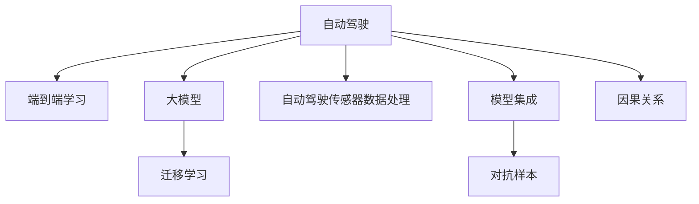

                 

## 1. 背景介绍

自动驾驶技术正日益成为全球科技竞争的焦点。自动驾驶汽车不仅能够大幅减少交通事故，提高道路通行效率，还将极大地推动智能化交通体系的发展。近年来，通过深度学习技术，自动驾驶技术在感知、决策、控制等方面取得了显著进步，但受限于传感器的物理特性，仍需在更复杂多变的环境下提升决策能力和鲁棒性。大模型技术的应用，将为自动驾驶带来新的突破。

### 1.1 问题由来

传统的自动驾驶系统多采用基于规则的决策方案，依赖于精确定位和高精度地图。但在实际行驶中，交通场景复杂多变，障碍物数量庞大，传感器的数据噪声和延迟等因素，使得基于规则的决策系统难以准确判断场景和环境。因此，自动驾驶系统需要引入更高层次的智能决策机制，从而提升决策效率和安全性。

随着深度学习技术的发展，端到端学习框架（End-to-End Framework）逐渐成为自动驾驶系统的主流架构。该架构通过深度神经网络，将传感器的数据直接映射为车辆行为决策，避免了繁琐的规则计算和数据融合过程，大幅提升了系统的响应速度和决策鲁棒性。

然而，端到端学习框架在处理复杂的因果关系和场景理解上仍存在局限。深度学习模型虽能在大规模数据上进行拟合，但面对实际驾驶中的意外情况时，往往难以做出合理决策。因此，结合大模型技术，引入更多外部知识，扩展模型表达能力，是提升自动驾驶系统性能的关键路径。

## 2. 核心概念与联系

### 2.1 核心概念概述

为更好地理解大模型技术在自动驾驶中的应用，本节将介绍几个密切相关的核心概念：

- **自动驾驶**：通过人工智能技术实现自动驾驶的系统，具有环境感知、路径规划、行为决策和控制等功能。
- **端到端学习**：自动驾驶系统的决策过程不依赖于传统规则，而是由神经网络直接处理传感器数据，生成车辆行为决策。
- **大模型**：通过海量数据预训练得到的模型，具备强大的表示能力和泛化能力。常见的大模型包括GPT、BERT等。
- **迁移学习**：利用预训练模型在大规模数据上学习到的知识，通过微调适配特定任务或领域的方法。
- **自动驾驶传感器数据处理**：包括激光雷达、摄像头、雷达等传感器的数据采集、校正和融合，是自动驾驶系统的重要组成部分。
- **模型集成**：在自动驾驶系统中，常常通过组合多个模型的决策结果，以提升决策准确性和鲁棒性。
- **对抗样本**：通过小幅度修改输入数据，使模型在对抗样本上表现不稳定，从而增强模型的鲁棒性。
- **因果关系**：在自动驾驶中，因果关系指的是车辆行为与环境变化之间的关系，以及行为决策对交通流的影响。

这些核心概念之间的逻辑关系可以通过以下Mermaid流程图来展示：



这个流程图展示了大模型技术的核心概念及其之间的关系：

1. 自动驾驶系统通过传感器获取环境数据。
2. 端到端学习模型直接处理传感器数据，生成行为决策。
3. 大模型提供强大的知识基础，通过迁移学习进行微调。
4. 传感器数据处理和模型集成提升系统鲁棒性。
5. 对抗样本和因果关系分析增强系统安全性。

这些概念共同构成了大模型在自动驾驶中的应用框架，使其能够在各种场景下发挥强大的智能决策能力。通过理解这些核心概念，我们可以更好地把握大模型技术的工作原理和优化方向。

## 3. 核心算法原理 & 具体操作步骤
### 3.1 算法原理概述

在大模型技术应用于自动驾驶时，主要通过迁移学习来实现从大规模数据学习到特定任务的微调。其核心思想是：使用预训练大模型作为特征提取器，对传感器数据进行表示学习，并通过微调过程调整模型参数，使其适应特定的自动驾驶任务。

形式化地，假设预训练大模型为 $M_{\theta}$，其中 $\theta$ 为预训练得到的模型参数。给定自动驾驶任务 $T$ 的训练集 $D=\{(x_i, y_i)\}_{i=1}^N, x_i \in \mathcal{X}, y_i \in \mathcal{Y}$，其中 $\mathcal{X}$ 为传感器数据空间，$\mathcal{Y}$ 为行为决策空间。微调的目标是找到新的模型参数 $\hat{\theta}$，使得：

$$
\hat{\theta}=\mathop{\arg\min}_{\theta} \mathcal{L}(M_{\theta},D)
$$

其中 $\mathcal{L}$ 为针对任务 $T$ 设计的损失函数，用于衡量模型预测输出与真实标签之间的差异。常见的损失函数包括交叉熵损失、均方误差损失等。

通过梯度下降等优化算法，微调过程不断更新模型参数 $\theta$，最小化损失函数 $\mathcal{L}$，使得模型输出逼近真实标签。由于 $\theta$ 已经通过预训练获得了较好的初始化，因此即便在自动驾驶任务中数据量较小，也能较快收敛到理想的模型参数 $\hat{\theta}$。

### 3.2 算法步骤详解

基于大模型技术在自动驾驶中的应用，微调过程一般包括以下几个关键步骤：

**Step 1: 准备预训练模型和数据集**
- 选择合适的预训练大模型 $M_{\theta}$，如BERT、GPT等。
- 准备自动驾驶任务 $T$ 的训练集 $D$，划分为训练集、验证集和测试集。一般要求训练数据与预训练数据的分布不要差异过大。

**Step 2: 添加任务适配层**
- 根据自动驾驶任务类型，在预训练模型顶层设计合适的输出层和损失函数。
- 对于行为决策任务，通常在顶层添加分类器或回归器，以交叉熵损失或均方误差损失为标准。
- 对于路径规划任务，可以设计神经网络模型，以预测路径点为目标，并引入L1/L2正则等进行优化。

**Step 3: 设置微调超参数**
- 选择合适的优化算法及其参数，如 AdamW、SGD 等，设置学习率、批大小、迭代轮数等。
- 设置正则化技术及强度，包括权重衰减、Dropout、Early Stopping等。
- 确定冻结预训练参数的策略，如仅微调顶层，或全部参数都参与微调。

**Step 4: 执行梯度训练**
- 将训练集数据分批次输入模型，前向传播计算损失函数。
- 反向传播计算参数梯度，根据设定的优化算法和学习率更新模型参数。
- 周期性在验证集上评估模型性能，根据性能指标决定是否触发 Early Stopping。
- 重复上述步骤直到满足预设的迭代轮数或 Early Stopping 条件。

**Step 5: 测试和部署**
- 在测试集上评估微调后模型 $M_{\hat{\theta}}$ 的性能，对比微调前后的精度提升。
- 使用微调后的模型对新样本进行推理预测，集成到实际的应用系统中。
- 持续收集新的数据，定期重新微调模型，以适应数据分布的变化。

以上是基于大模型技术在自动驾驶中的应用的一般流程。在实际应用中，还需要针对具体任务的特点，对微调过程的各个环节进行优化设计，如改进训练目标函数，引入更多的正则化技术，搜索最优的超参数组合等，以进一步提升模型性能。

### 3.3 算法优缺点

基于大模型技术在自动驾驶中的应用方法具有以下优点：
1. 数据需求小。相比于传统方法，微调方法在少量数据上也能取得较好的效果。
2. 快速迭代。微调模型可以在短时间内进行多次优化，快速适应不同的环境条件。
3. 鲁棒性强。通过结合大模型的知识，微调后的模型对环境变化具有较好的适应能力。
4. 可扩展性好。大模型可以不断引入新的知识，适应更复杂多变的任务。

同时，该方法也存在一定的局限性：
1. 依赖标注数据。微调的效果很大程度上取决于标注数据的质量和数量，获取高质量标注数据的成本较高。
2. 模型泛化能力有限。当任务与预训练数据的分布差异较大时，微调的性能提升有限。
3. 训练成本高。预训练模型和微调模型需要大量的计算资源和时间，训练成本较高。
4. 可解释性不足。微调模型难以解释其决策过程，难以进行调试和优化。

尽管存在这些局限性，但就目前而言，基于大模型的微调方法仍是自动驾驶领域的主流范式。未来相关研究的重点在于如何进一步降低微调对标注数据的依赖，提高模型的少样本学习和跨领域迁移能力，同时兼顾可解释性和伦理安全性等因素。

### 3.4 算法应用领域

基于大模型技术在自动驾驶中的应用方法，在自动驾驶领域已经得到了广泛的应用，覆盖了诸多关键任务，例如：

- **环境感知**：使用大模型处理多传感器数据，生成高层次的语义表示，用于定位和障碍物检测。
- **行为决策**：通过大模型学习驾驶员的行为模式，预测行为意图和决策。
- **路径规划**：使用大模型优化路线规划算法，提升路径规划的效率和准确性。
- **自驾驶模拟**：利用大模型生成的交通场景，进行自动驾驶车辆的行为预测和策略优化。
- **情境理解**：结合自然语言处理技术，理解交通标志、信号等情境信息，进行智能决策。
- **多车协同**：使用大模型优化车辆间的通信和协作策略，提升整体系统效率。

除了上述这些经典任务外，大模型技术还被创新性地应用到更多场景中，如车辆控制、故障诊断、车辆健康监测等，为自动驾驶技术带来了全新的突破。随着大模型技术的不断演进，相信自动驾驶系统将在更广泛的应用领域大放异彩。

## 4. 数学模型和公式 & 详细讲解
### 4.1 数学模型构建

本节将使用数学语言对基于大模型技术在自动驾驶中的应用过程进行更加严格的刻画。

记预训练大模型为 $M_{\theta}$，其中 $\theta$ 为预训练得到的模型参数。假设自动驾驶任务 $T$ 的训练集为 $D=\{(x_i, y_i)\}_{i=1}^N, x_i \in \mathcal{X}, y_i \in \mathcal{Y}$。

定义模型 $M_{\theta}$ 在输入 $x$ 上的输出为 $y=M_{\theta}(x)$，则自动驾驶任务的行为决策损失函数定义为：

$$
\ell(M_{\theta}(x),y) = \mathcal{L}(y,y')
$$

其中 $\mathcal{L}$ 为交叉熵损失，$y$ 为模型预测行为决策，$y'$ 为真实标签。

在无监督学习阶段，大模型 $M_{\theta}$ 在传感器数据集 $D_{\text{unsup}}=\{x_i\}_{i=1}^N$ 上进行预训练，学习到环境特征表示。假设预训练模型的损失函数为 $\mathcal{L}_{\text{unsup}}(\theta)$，则在数据集 $D_{\text{unsup}}$ 上的经验风险为：

$$
\mathcal{L}_{\text{unsup}}(\theta) = \frac{1}{N} \sum_{i=1}^N \ell(M_{\theta}(x_i), y_i)
$$

微调的优化目标是最小化行为决策损失，即找到最优参数：

$$
\theta^* = \mathop{\arg\min}_{\theta} \mathcal{L}(M_{\theta},D)
$$

在得到行为决策损失函数后，即可带入参数更新公式，完成模型的迭代优化。重复上述过程直至收敛，最终得到适应自动驾驶任务的行为决策模型参数 $\theta^*$。

### 4.2 公式推导过程

以下我们以行为决策任务为例，推导交叉熵损失函数及其梯度的计算公式。

假设模型 $M_{\theta}$ 在输入 $x$ 上的输出为 $y=M_{\theta}(x) \in [0,1]$，表示车辆行为为某种类型的概率。真实标签 $y \in \{0,1\}$。则二分类交叉熵损失函数定义为：

$$
\ell(M_{\theta}(x),y) = -[y\log \hat{y} + (1-y)\log (1-\hat{y})]
$$

将其代入行为决策损失函数，得：

$$
\mathcal{L}(\theta) = -\frac{1}{N}\sum_{i=1}^N [y_i\log M_{\theta}(x_i)+(1-y_i)\log(1-M_{\theta}(x_i))]
$$

根据链式法则，损失函数对参数 $\theta_k$ 的梯度为：

$$
\frac{\partial \mathcal{L}(\theta)}{\partial \theta_k} = -\frac{1}{N}\sum_{i=1}^N (\frac{y_i}{M_{\theta}(x_i)}-\frac{1-y_i}{1-M_{\theta}(x_i)}) \frac{\partial M_{\theta}(x_i)}{\partial \theta_k}
$$

其中 $\frac{\partial M_{\theta}(x_i)}{\partial \theta_k}$ 可进一步递归展开，利用自动微分技术完成计算。

在得到损失函数的梯度后，即可带入参数更新公式，完成模型的迭代优化。重复上述过程直至收敛，最终得到适应自动驾驶任务的行为决策模型参数 $\theta^*$。

## 5. 项目实践：代码实例和详细解释说明
### 5.1 开发环境搭建

在进行自动驾驶大模型微调实践前，我们需要准备好开发环境。以下是使用Python进行PyTorch开发的环境配置流程：

1. 安装Anaconda：从官网下载并安装Anaconda，用于创建独立的Python环境。

2. 创建并激活虚拟环境：
```bash
conda create -n pytorch-env python=3.8 
conda activate pytorch-env
```

3. 安装PyTorch：根据CUDA版本，从官网获取对应的安装命令。例如：
```bash
conda install pytorch torchvision torchaudio cudatoolkit=11.1 -c pytorch -c conda-forge
```

4. 安装各类工具包：
```bash
pip install numpy pandas scikit-learn matplotlib tqdm jupyter notebook ipython
```

完成上述步骤后，即可在`pytorch-env`环境中开始自动驾驶大模型微调实践。

### 5.2 源代码详细实现

下面我们以行为决策任务为例，给出使用Transformers库对BERT模型进行微调的PyTorch代码实现。

首先，定义行为决策任务的训练数据集：

```python
from transformers import BertTokenizer
from torch.utils.data import Dataset

class DrivingDataset(Dataset):
    def __init__(self, data, tokenizer, max_len=128):
        self.data = data
        self.tokenizer = tokenizer
        self.max_len = max_len

    def __len__(self):
        return len(self.data)

    def __getitem__(self, idx):
        input_ids = self.tokenizer.encode(self.data[idx], add_special_tokens=True, max_length=self.max_len, padding='max_length', truncation=True)
        input_ids = input_ids + [0] * (self.max_len - len(input_ids))
        input_ids = torch.tensor(input_ids)
        return {'input_ids': input_ids, 'labels': torch.tensor([self.data[idx] == 1])}
```

然后，定义模型和优化器：

```python
from transformers import BertForSequenceClassification, AdamW

model = BertForSequenceClassification.from_pretrained('bert-base-uncased', num_labels=2)
optimizer = AdamW(model.parameters(), lr=2e-5)
```

接着，定义训练和评估函数：

```python
from torch.utils.data import DataLoader
from tqdm import tqdm

device = torch.device('cuda') if torch.cuda.is_available() else torch.device('cpu')
model.to(device)

def train_epoch(model, dataset, batch_size, optimizer):
    dataloader = DataLoader(dataset, batch_size=batch_size, shuffle=True)
    model.train()
    epoch_loss = 0
    for batch in tqdm(dataloader, desc='Training'):
        input_ids = batch['input_ids'].to(device)
        labels = batch['labels'].to(device)
        model.zero_grad()
        outputs = model(input_ids, labels=labels)
        loss = outputs.loss
        epoch_loss += loss.item()
        loss.backward()
        optimizer.step()
    return epoch_loss / len(dataloader)

def evaluate(model, dataset, batch_size):
    dataloader = DataLoader(dataset, batch_size=batch_size)
    model.eval()
    preds, labels = [], []
    with torch.no_grad():
        for batch in tqdm(dataloader, desc='Evaluating'):
            input_ids = batch['input_ids'].to(device)
            labels = batch['labels'].to(device)
            batch_preds = model(input_ids).logits.argmax(dim=1).to('cpu').tolist()
            batch_labels = batch['labels'].to('cpu').tolist()
            for pred, label in zip(batch_preds, batch_labels):
                preds.append(pred)
                labels.append(label)
    print(classification_report(labels, preds))
```

最后，启动训练流程并在测试集上评估：

```python
epochs = 5
batch_size = 16

for epoch in range(epochs):
    loss = train_epoch(model, driving_dataset, batch_size, optimizer)
    print(f"Epoch {epoch+1}, train loss: {loss:.3f}")
    
    print(f"Epoch {epoch+1}, dev results:")
    evaluate(model, driving_dev_dataset, batch_size)
    
print("Test results:")
evaluate(model, driving_test_dataset, batch_size)
```

以上就是使用PyTorch对BERT进行行为决策任务微调的完整代码实现。可以看到，得益于Transformers库的强大封装，我们可以用相对简洁的代码完成BERT模型的加载和微调。

### 5.3 代码解读与分析

让我们再详细解读一下关键代码的实现细节：

**DrivingDataset类**：
- `__init__`方法：初始化训练数据、分词器等关键组件。
- `__len__`方法：返回数据集的样本数量。
- `__getitem__`方法：对单个样本进行处理，将文本输入编码为token ids，并将标签转换为模型可接受的格式，进行定长padding，最终返回模型所需的输入。

**BertForSequenceClassification类**：
- 从预训练BERT模型中加载对应版本的模型，设置输出层和标签数。

**train_epoch函数**：
- 定义一个迭代器，遍历数据集。
- 在每个批次上前向传播计算loss并反向传播更新模型参数，最后返回该epoch的平均loss。

**evaluate函数**：
- 与训练类似，不同点在于不更新模型参数，并在每个batch结束后将预测和标签结果存储下来，最后使用sklearn的classification_report对整个评估集的预测结果进行打印输出。

**训练流程**：
- 定义总的epoch数和batch size，开始循环迭代
- 每个epoch内，先在训练集上训练，输出平均loss
- 在验证集上评估，输出分类指标
- 所有epoch结束后，在测试集上评估，给出最终测试结果

可以看到，PyTorch配合Transformers库使得BERT微调的代码实现变得简洁高效。开发者可以将更多精力放在数据处理、模型改进等高层逻辑上，而不必过多关注底层的实现细节。

当然，工业级的系统实现还需考虑更多因素，如模型的保存和部署、超参数的自动搜索、更灵活的任务适配层等。但核心的微调范式基本与此类似。

## 6. 实际应用场景
### 6.1 智能驾驶系统

智能驾驶系统是自动驾驶技术的核心组成部分，涵盖了感知、决策、控制等多个方面。通过大模型技术的应用，智能驾驶系统将能够实现更加智能化和鲁棒化的功能。

在感知层面，大模型可以处理多源传感器数据，生成高层次的语义表示，用于定位和障碍物检测。通过微调，系统能够学习到不同传感器的特点和关联，提升感知准确性。

在决策层面，大模型可以学习驾驶员的行为模式，预测行为意图和决策。通过微调，系统能够更好地理解交通场景中的复杂因果关系，提高决策的准确性和鲁棒性。

在控制层面，大模型可以优化路径规划算法，提升路径规划的效率和准确性。通过微调，系统能够根据实时环境信息动态调整行驶策略，确保安全性和高效性。

智能驾驶系统的各个层面均可以通过大模型技术进行优化，从而实现更加智能和安全的自动驾驶体验。

### 6.2 自动驾驶数据生成

自动驾驶数据生成是自动驾驶系统开发过程中的重要环节，用于模拟复杂多变的交通场景，进行模型训练和性能评估。大模型技术可以用于自动驾驶数据生成，提升数据生成的多样性和逼真度。

通过微调，大模型能够生成符合特定交通场景的传感器数据，用于模型训练和验证。例如，可以使用大模型生成激光雷达扫描数据、摄像头图像、雷达数据等，用于模拟交通拥堵、停车、变道等场景。通过这些多样化的模拟数据，训练自动驾驶模型能够更好地适应实际驾驶环境，提升系统鲁棒性。

### 6.3 智能交通管理

智能交通管理是自动驾驶技术的重要应用方向，能够实现对交通流量的智能调控和管理。大模型技术可以用于智能交通管理的优化，提升交通系统的效率和安全性。

通过微调，大模型能够学习到交通流量变化规律，预测未来交通状况，提供交通流量调控策略。例如，可以根据实时交通数据，动态调整信号灯控制，优化交通流向，减少拥堵和事故发生率。大模型技术还能用于交通异常检测，及时发现交通事故、道路施工等异常情况，提前进行预警和处理，保障交通安全。

### 6.4 未来应用展望

随着大模型技术的发展，自动驾驶系统将在更广泛的应用领域大放异彩。未来，大模型技术有望在以下领域得到进一步应用：

- **无人配送**：利用大模型技术优化无人配送车队的路径规划和行驶策略，实现高效、安全的货物配送。
- **自动停车**：通过大模型技术学习停车场环境和车辆行为，优化自动停车过程，提升停车效率和安全性。
- **智能出租车**：结合自然语言处理和大模型技术，实现智能调度和路线优化，提升出租车运营效率和客户体验。
- **自动运输**：利用大模型技术优化自动运输系统的路径规划和调度算法，提高物流效率和成本效益。
- **交通仿真**：通过大模型技术生成逼真的交通场景，用于交通仿真的优化和交通管理策略的验证。

大模型技术在自动驾驶领域的应用前景广阔，必将深刻改变交通行业的面貌，提升整体效率和安全性。

## 7. 工具和资源推荐
### 7.1 学习资源推荐

为了帮助开发者系统掌握大模型技术在自动驾驶中的应用，这里推荐一些优质的学习资源：

1. **《Deep Learning for Autonomous Vehicles》书籍**：由TensorFlow官方出版的书籍，全面介绍了自动驾驶系统中的深度学习技术，包括感知、决策、控制等方面，提供了丰富的代码实现和案例分析。

2. **《Autonomous Driving with Python》课程**：由DeepLearning.AI提供的一系列在线课程，涵盖自动驾驶系统的各个方面，包括传感器数据处理、模型训练、系统集成等。

3. **《Practical Deep Learning for Autonomous Vehicles》在线课程**：由Udacity提供的深度学习实战课程，通过实际项目练习，让学员深入理解自动驾驶技术的实现细节。

4. **自动驾驶开源项目**：如CARLA模拟器、OpenAI Five等，提供了丰富的自动驾驶系统和模拟器资源，可以用于学习和测试大模型技术在自动驾驶中的应用。

通过对这些资源的学习实践，相信你一定能够快速掌握大模型技术在自动驾驶中的应用精髓，并用于解决实际的自动驾驶问题。

### 7.2 开发工具推荐

高效的开发离不开优秀的工具支持。以下是几款用于自动驾驶大模型微调开发的常用工具：

1. **PyTorch**：基于Python的开源深度学习框架，灵活动态的计算图，适合快速迭代研究。大部分预训练语言模型都有PyTorch版本的实现。

2. **TensorFlow**：由Google主导开发的开源深度学习框架，生产部署方便，适合大规模工程应用。同样有丰富的预训练语言模型资源。

3. **Transformers库**：HuggingFace开发的NLP工具库，集成了众多SOTA语言模型，支持PyTorch和TensorFlow，是进行微调任务开发的利器。

4. **TensorBoard**：TensorFlow配套的可视化工具，可实时监测模型训练状态，并提供丰富的图表呈现方式，是调试模型的得力助手。

5. **Weights & Biases**：模型训练的实验跟踪工具，可以记录和可视化模型训练过程中的各项指标，方便对比和调优。

6. **Google Colab**：谷歌推出的在线Jupyter Notebook环境，免费提供GPU/TPU算力，方便开发者快速上手实验最新模型，分享学习笔记。

合理利用这些工具，可以显著提升自动驾驶大模型微调任务的开发效率，加快创新迭代的步伐。

### 7.3 相关论文推荐

大模型技术在自动驾驶领域的应用研究源于学界的持续研究。以下是几篇奠基性的相关论文，推荐阅读：

1. **《Unsupervised Deep Learning for Urban Driving》**：提出了一种基于深度学习的城市驾驶模型，通过无监督学习，学习到城市驾驶场景的特征表示。

2. **《Learning from Scenario Modeling》**：探讨了自动驾驶中的场景建模技术，利用场景生成和模拟，提升模型对复杂场景的适应能力。

3. **《Deep Reinforcement Learning for Autonomous Vehicles》**：提出了一种基于深度强化学习的自动驾驶方法，通过模型预测和实时决策，实现车辆的智能控制。

4. **《Adversarial Examples for Adversarial Neural Networks》**：研究了对抗样本在自动驾驶中的应用，通过对抗训练，提升模型的鲁棒性和安全性。

5. **《Causal Inference for Deep Learning》**：探讨了因果推断在自动驾驶中的应用，通过因果分析，提升模型对因果关系的理解能力。

这些论文代表了大模型技术在自动驾驶领域的发展脉络。通过学习这些前沿成果，可以帮助研究者把握学科前进方向，激发更多的创新灵感。

## 8. 总结：未来发展趋势与挑战
### 8.1 总结

本文对基于大模型技术在自动驾驶中的应用进行了全面系统的介绍。首先阐述了大模型技术在自动驾驶中的应用背景和意义，明确了大模型在感知、决策、控制等层面提升自动驾驶系统性能的独特价值。其次，从原理到实践，详细讲解了大模型技术在自动驾驶中的数学原理和关键步骤，给出了自动驾驶大模型微调的完整代码实例。同时，本文还广泛探讨了大模型技术在智能驾驶、自动驾驶数据生成、智能交通管理等多个领域的应用前景，展示了大模型技术在自动驾驶领域的应用潜力。

通过本文的系统梳理，可以看到，基于大模型技术的自动驾驶系统具有广泛的应用前景，能够显著提升自动驾驶系统的智能性和鲁棒性。得益于大模型技术的学习能力和知识表达能力，自动驾驶系统将在更复杂多变的环境下实现更高质量、更安全、更高效的驾驶体验。

### 8.2 未来发展趋势

展望未来，大模型技术在自动驾驶中的应用将呈现以下几个发展趋势：

1. **模型规模持续增大**：随着算力成本的下降和数据规模的扩张，预训练语言模型的参数量还将持续增长。超大规模语言模型蕴含的丰富知识，有望支撑更加复杂多变的自动驾驶任务。

2. **参数高效微调技术发展**：未来的微调方法将更加注重参数效率，通过仅更新少量模型参数，避免对大模型全部参数的更新，从而提高微调效率和精度。

3. **跨模态学习**：未来的自动驾驶系统将不仅考虑视觉数据，还将融合听觉、雷达等多种传感器数据，实现多模态信息的协同建模，提升系统感知和决策能力。

4. **自监督学习与强化学习结合**：通过自监督学习进行无标签数据上的预训练，结合强化学习进行有标签数据上的微调，进一步提升自动驾驶系统的泛化能力和适应性。

5. **知识图谱与大模型融合**：利用知识图谱中的结构化知识，与大模型进行融合，提升自动驾驶系统对因果关系的理解和推理能力。

6. **多任务学习与联合优化**：将多个自动驾驶任务进行联合优化，通过多任务学习，提升系统对不同任务的协同优化能力。

以上趋势凸显了大模型技术在自动驾驶领域的广阔前景。这些方向的探索发展，必将进一步提升自动驾驶系统的性能和应用范围，为人类交通安全和社会发展带来深远影响。

### 8.3 面临的挑战

尽管大模型技术在自动驾驶中的应用已经取得了显著成果，但在迈向更加智能化、普适化应用的过程中，它仍面临诸多挑战：

1. **数据标注成本高**：自动驾驶系统涉及大量的传感器数据和复杂场景，数据标注成本高、周期长，成为制约技术发展的瓶颈。如何降低数据标注成本，提高数据生成质量，是亟待解决的问题。

2. **模型泛化能力有限**：预训练模型和微调模型面对复杂多变的交通场景，泛化能力有限，在面对新场景时表现不稳定。如何提升模型的泛化能力，避免对训练数据过度依赖，是未来研究的重要方向。

3. **推理效率低**：自动驾驶系统对推理效率有严格要求，但现有的大模型在推理过程中计算量大、内存占用高，无法满足实时要求。如何优化模型结构和推理算法，提升推理效率，是重要的优化方向。

4. **模型安全与伦理**：自动驾驶系统涉及人身安全，模型的决策过程需要具备可解释性和可解释性，避免偏见和歧视。如何保障模型安全与伦理，是未来研究的重要课题。

5. **硬件资源需求高**：自动驾驶系统需要强大的硬件支持，包括高性能的计算平台和大量的存储空间。如何在资源有限的条件下，提升系统的性能和鲁棒性，是未来研究的重要方向。

这些挑战凸显了大模型技术在自动驾驶领域的应用仍需不断改进和优化。只有积极应对并寻求突破，才能将大模型技术推向更加成熟和实用的应用阶段。

### 8.4 研究展望

面对大模型技术在自动驾驶领域所面临的挑战，未来的研究需要在以下几个方面寻求新的突破：

1. **引入外部知识**：通过知识图谱和外部规则，与大模型进行结合，增强模型的因果关系理解和推理能力。

2. **多模态学习**：将视觉、听觉、雷达等多种传感器数据进行融合，提升模型的感知和决策能力。

3. **自监督学习**：通过自监督学习进行无标签数据的预训练，增强模型的泛化能力和适应性。

4. **强化学习**：结合强化学习进行有标签数据的微调，提升模型的决策能力和鲁棒性。

5. **知识图谱与大模型融合**：将知识图谱中的结构化知识与大模型进行融合，提升模型的因果关系理解和推理能力。

6. **多任务学习**：将多个自动驾驶任务进行联合优化，提升系统的整体性能和应用范围。

7. **对抗训练**：通过对抗训练提升模型的鲁棒性和安全性，避免对抗样本攻击。

这些研究方向的探索，必将引领大模型技术在自动驾驶领域迈向更加成熟和实用的应用阶段。面向未来，大模型技术将在自动驾驶系统中扮演越来越重要的角色，深刻改变交通行业的面貌，提升整体效率和安全性。

## 9. 附录：常见问题与解答

**Q1：大模型技术在自动驾驶中的应用是否只限于行为决策任务？**

A: 大模型技术在自动驾驶中的应用并不仅限于行为决策任务。事实上，大模型可以应用于感知、决策、控制等多个层面。例如，通过大模型处理多源传感器数据，生成高层次的语义表示，用于定位和障碍物检测；通过大模型学习驾驶员的行为模式，预测行为意图和决策；通过大模型优化路径规划算法，提升路径规划的效率和准确性。

**Q2：如何优化大模型在自动驾驶中的训练和推理效率？**

A: 优化大模型在自动驾驶中的训练和推理效率，主要通过以下几个途径：

1. **参数高效微调技术**：只更新部分模型参数，保持大部分预训练权重不变，减少计算量。

2. **模型压缩**：通过模型裁剪、量化等技术，减少模型参数量和计算量。

3. **分布式训练**：利用分布式训练框架，加速训练过程。

4. **多任务学习**：通过联合训练多个任务，提高模型的泛化能力和适应性。

5. **自监督学习**：通过自监督学习，利用无标签数据进行预训练，减少对标注数据的依赖。

6. **硬件优化**：采用高效硬件平台，如TPU、GPU等，提升计算和存储效率。

**Q3：如何提高大模型在自动驾驶中的泛化能力？**

A: 提高大模型在自动驾驶中的泛化能力，主要通过以下几个途径：

1. **数据增强**：通过数据增强技术，扩充训练数据的多样性，减少过拟合风险。

2. **对抗训练**：通过对抗训练，提升模型对对抗样本的鲁棒性，避免泛化能力下降。

3. **多模态学习**：融合视觉、听觉、雷达等多种传感器数据，提升模型的感知能力和泛化能力。

4. **自监督学习**：通过自监督学习，利用无标签数据进行预训练，增强模型的泛化能力和适应性。

5. **知识图谱与大模型融合**：结合知识图谱中的结构化知识，与大模型进行融合，提升模型的因果关系理解和推理能力。

**Q4：大模型在自动驾驶中的决策过程是否具有可解释性？**

A: 大模型在自动驾驶中的决策过程，通常通过黑盒模型实现，缺乏可解释性。但为了保证模型的安全和可靠，可以引入可解释性技术，如模型可视化、解释性计算等，帮助理解模型的决策过程。

**Q5：如何保障自动驾驶系统的安全性？**

A: 保障自动驾驶系统的安全性，主要通过以下几个途径：

1. **对抗样本检测**：通过对抗训练，检测和避免对抗样本攻击。

2. **模型鲁棒性提升**：通过自监督学习、正则化等技术，提升模型的鲁棒性和泛化能力。

3. **实时监控与反馈**：通过实时监控和反馈机制，及时发现和纠正模型偏差。

4. **人工干预与审核**：引入人工干预和审核机制，确保模型的决策过程符合伦理和法规要求。

通过这些技术手段，可以显著提升自动驾驶系统的安全性，保障系统的稳定运行和用户的安全。

---

作者：禅与计算机程序设计艺术 / Zen and the Art of Computer Programming

