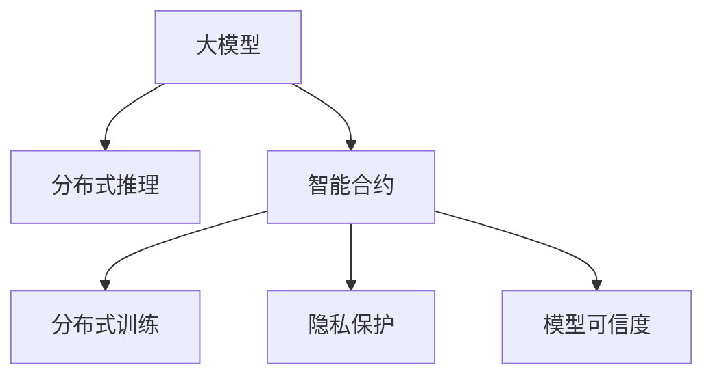

                 

# 大模型技术的区块链应用

## 1. 背景介绍

### 1.1 问题由来
随着区块链技术的兴起，分布式账本和去中心化计算以其安全、透明、可追溯等特性，迅速成为金融、供应链、物联网、医疗等多个领域的基础设施。然而，区块链本身作为一类特定的计算范式，其内在机制和约束限制了其处理复杂计算和海量数据的能力。

与此同时，基于大模型的人工智能技术，在图像识别、语音识别、自然语言处理等领域取得了革命性的突破。以语言模型为例，通过在大规模语料上进行预训练，可以学习到丰富的语言表示，具备强大的语言理解和生成能力。但大模型通常以巨量的参数和计算资源为基础，对于区块链等去中心化系统提出了严峻挑战。

因此，如何在大模型技术的基础上，结合区块链的特性，构建高性能、安全、可扩展的智能合约和区块链应用，成为一个亟需解决的问题。大模型技术的区块链应用，旨在利用区块链的分布式和透明性，结合大模型的强大计算能力，拓展区块链应用的功能，增强系统的智能决策能力。

### 1.2 问题核心关键点
在大模型技术的区块链应用中，关键点包括：

- 大模型的部署和推理：如何在大模型中实现高效的分布式推理，尤其是在资源受限的区块链节点上。
- 模型参数的分布式训练：如何在区块链上实现分布式训练，避免单点故障，增强模型性能。
- 数据隐私和安全：如何保护数据隐私，同时保证模型在区块链上的安全性和可信度。
- 智能合约的自动化执行：如何将大模型嵌入智能合约，自动执行复杂的智能决策，提高合约的智能化水平。

这些关键问题构成了大模型技术的区块链应用的基础框架，需要通过创新的技术和算法来解答。

## 2. 核心概念与联系

### 2.1 核心概念概述

为更好地理解大模型技术在区块链中的应用，本节将介绍几个核心概念：

- 大模型（Large Model）：以自回归或自编码模型为代表的大规模预训练模型。通过在大规模无标签文本数据上进行预训练，学习通用的语言表示，具备强大的语言理解和生成能力。

- 智能合约（Smart Contract）：存储在区块链上的一组程序代码，用于自动执行预设的业务规则和逻辑。

- 分布式推理（Distributed Inference）：将模型的推理任务分布到多个节点上执行，以提高计算效率和容错能力。

- 分布式训练（Distributed Training）：将模型的训练过程分布到多个节点上，以充分利用分布式计算资源，提高训练效率。

- 隐私保护（Privacy Protection）：在模型训练和推理中，保护数据隐私，防止数据泄露和滥用。

- 模型可信度（Model Trustworthiness）：确保模型在区块链上的透明性和可信度，防止模型被篡改或攻击。

这些核心概念之间的逻辑关系可以通过以下Mermaid流程图来展示：



这个流程图展示了大模型技术的区块链应用的核心概念及其之间的关系：

1. 大模型通过预训练获得基础能力。
2. 智能合约作为区块链的基础设施，可以加载并调用大模型进行推理和执行。
3. 分布式推理和大规模训练利用区块链的分布式计算资源，提高模型性能和可靠性。
4. 隐私保护和模型可信度，保证数据安全和模型透明性。

这些概念共同构成了大模型技术的区块链应用的基础，使得大模型可以在区块链上实现分布式推理和训练，保护数据隐私，同时确保模型的可信度。

## 3. 核心算法原理 & 具体操作步骤
### 3.1 算法原理概述

大模型技术的区块链应用，本质上是大规模预训练模型与智能合约和区块链技术的结合。其核心思想是：利用区块链的去中心化和智能合约的可执行性，将大模型的推理和训练任务分布到多个节点上，同时保护数据隐私，确保模型透明性和可信度。

形式化地，假设区块链网络中共有 $N$ 个节点，每个节点上部署有相同的大模型 $M_{\theta}$。在大模型微调任务 $T$ 上，每个节点将自身对模型 $M_{\theta}$ 的训练或推理结果通过共识算法发送给其他节点，最终所有节点共同更新模型参数。

训练或推理过程的目标是最小化模型在数据集 $D=\{(x_i,y_i)\}_{i=1}^N$ 上的经验损失，即：

$$
\hat{\theta}=\mathop{\arg\min}_{\theta} \mathcal{L}(M_{\theta},D)
$$

其中 $\mathcal{L}$ 为针对任务 $T$ 设计的损失函数，用于衡量模型预测输出与真实标签之间的差异。

### 3.2 算法步骤详解

大模型技术的区块链应用一般包括以下几个关键步骤：

**Step 1: 准备区块链网络和节点环境**
- 选择适合的区块链平台，如以太坊、Hyperledger等。
- 部署并配置区块链网络中的节点，确保每个节点具有相同的环境和权限。

**Step 2: 部署智能合约**
- 编写智能合约代码，将大模型的推理或训练逻辑封装为合约函数。
- 在区块链上部署智能合约，通过智能合约自动执行推理或训练任务。

**Step 3: 分布式推理或训练**
- 每个节点将本地推理或训练结果上传至智能合约。
- 智能合约根据共识算法，将各节点的结果进行加权平均或投票决定。
- 将更新后的模型参数广播至所有节点，并重新执行推理或训练任务。

**Step 4: 参数更新与优化**
- 根据区块链网络中所有节点的更新结果，计算新的模型参数 $\theta$。
- 使用优化算法（如AdamW、SGD等）更新模型参数。
- 重复执行Step 3和Step 4，直至模型收敛。

**Step 5: 测试和部署**
- 在测试集上评估模型性能，对比微调前后的精度提升。
- 使用微调后的模型对新样本进行推理预测，集成到实际的应用系统中。

以上是使用区块链技术进行大模型微调的一般流程。在实际应用中，还需要针对具体任务和区块链平台，对微调过程的各个环节进行优化设计，如改进共识算法，引入更多的正则化技术，搜索最优的超参数组合等，以进一步提升模型性能。

### 3.3 算法优缺点

大模型技术的区块链应用具有以下优点：
1. 分布式计算：利用区块链的分布式计算资源，实现大模型的分布式推理和训练，提高计算效率。
2. 透明性：智能合约的代码和执行过程公开透明，增强了模型的可信度和透明度。
3. 可扩展性：通过分布式推理和训练，模型可以处理大规模数据和高并发请求，实现更好的可扩展性。
4. 鲁棒性：分布式训练和推理减少了单点故障，增强了系统的鲁棒性和容错能力。

同时，该方法也存在一定的局限性：
1. 区块链性能瓶颈：区块链共识算法和高频交易可能导致网络延迟和性能瓶颈，影响推理和训练效率。
2. 资源消耗：区块链网络中各节点的计算资源和存储资源有限，可能无法完全支持大模型的推理和训练。
3. 数据隐私：在分布式推理和训练过程中，数据隐私保护和模型泄露风险较高。
4. 模型复杂度：大模型通常结构复杂，难以完全嵌入智能合约中执行。

尽管存在这些局限性，但就目前而言，大模型技术的区块链应用仍是一种创新且具有潜力的方向。未来相关研究的重点在于如何进一步降低区块链性能瓶颈，优化资源消耗，增强数据隐私保护，同时兼顾模型复杂度，实现大模型与区块链技术的深度融合。

### 3.4 算法应用领域

大模型技术的区块链应用，已经在多个领域得到探索和实践，例如：

- 金融交易：使用大模型进行信用评估、欺诈检测、风险预警等任务，利用区块链的透明性和不可篡改性提高金融交易的安全性。
- 供应链管理：利用大模型进行需求预测、库存管理、物流优化等任务，通过区块链实现供应链各环节的协同和透明。
- 医疗健康：使用大模型进行疾病诊断、个性化治疗、健康监测等任务，通过区块链保护患者隐私，增强医疗决策的透明性和可信度。
- 智能合约：嵌入大模型进行合同执行、合约自动化审计等任务，通过区块链实现智能合约的自动化和可执行性。

除了上述这些领域外，大模型技术的区块链应用还在智慧城市、物联网、司法公正等多个领域展现出广阔的前景，为区块链技术带来了新的应用场景和价值。

## 4. 数学模型和公式 & 详细讲解  
### 4.1 数学模型构建

本节将使用数学语言对大模型技术的区块链应用过程进行更加严格的刻画。

记区块链网络中共有 $N$ 个节点，每个节点上部署有大模型 $M_{\theta}$，其中 $\theta$ 为模型参数。假设区块链网络中每个节点微调任务 $T$ 的训练集为 $D=\{(x_i,y_i)\}_{i=1}^N, x_i \in \mathcal{X}, y_i \in \mathcal{Y}$。

定义模型 $M_{\theta}$ 在输入 $x$ 上的输出为 $\hat{y}=M_{\theta}(x) \in [0,1]$，表示样本属于正类的概率。真实标签 $y \in \{0,1\}$。则二分类交叉熵损失函数定义为：

$$
\ell(M_{\theta}(x),y) = -[y\log \hat{y} + (1-y)\log (1-\hat{y})]
$$

根据区块链网络中所有节点对模型 $M_{\theta}$ 的训练结果，设 $w_i$ 为节点 $i$ 的权重，则模型在数据集 $D$ 上的经验风险为：

$$
\mathcal{L}(\theta) = -\sum_{i=1}^N w_i\ell(M_{\theta}(x_i),y_i)
$$

其中 $w_i$ 为节点 $i$ 对训练结果的权重，一般根据节点贡献度来确定。

微调的优化目标是最小化经验风险，即找到最优参数：

$$
\theta^* = \mathop{\arg\min}_{\theta} \mathcal{L}(\theta)
$$

在得到损失函数的梯度后，即可带入参数更新公式，完成模型的迭代优化。重复上述过程直至收敛，最终得到适应区块链网络中的所有节点微调任务 $T$ 的最优模型参数 $\theta^*$。

### 4.2 公式推导过程

以下我们以二分类任务为例，推导交叉熵损失函数及其梯度的计算公式。

假设模型 $M_{\theta}$ 在输入 $x$ 上的输出为 $\hat{y}=M_{\theta}(x) \in [0,1]$，表示样本属于正类的概率。真实标签 $y \in \{0,1\}$。则二分类交叉熵损失函数定义为：

$$
\ell(M_{\theta}(x),y) = -[y\log \hat{y} + (1-y)\log (1-\hat{y})]
$$

根据区块链网络中所有节点对模型 $M_{\theta}$ 的训练结果，设 $w_i$ 为节点 $i$ 的权重，则模型在数据集 $D$ 上的经验风险为：

$$
\mathcal{L}(\theta) = -\sum_{i=1}^N w_i\ell(M_{\theta}(x_i),y_i)
$$

根据链式法则，损失函数对参数 $\theta_k$ 的梯度为：

$$
\frac{\partial \mathcal{L}(\theta)}{\partial \theta_k} = -\sum_{i=1}^N w_i \frac{y_i}{M_{\theta}(x_i)}\frac{\partial M_{\theta}(x_i)}{\partial \theta_k} - \sum_{i=1}^N w_i\frac{1-y_i}{1-M_{\theta}(x_i)}\frac{\partial M_{\theta}(x_i)}{\partial \theta_k}
$$

其中 $\frac{\partial M_{\theta}(x_i)}{\partial \theta_k}$ 可进一步递归展开，利用自动微分技术完成计算。

在得到损失函数的梯度后，即可带入参数更新公式，完成模型的迭代优化。重复上述过程直至收敛，最终得到适应区块链网络中的所有节点微调任务 $T$ 的最优模型参数 $\theta^*$。

## 5. 项目实践：代码实例和详细解释说明
### 5.1 开发环境搭建

在进行区块链大模型微调实践前，我们需要准备好区块链开发环境。以下是使用以太坊平台进行智能合约开发的环境配置流程：

1. 安装Truffle开发环境：从官网下载并安装Truffle，用于创建和管理以太坊智能合约。
```bash
npm install -g truffle
```

2. 创建并激活项目环境：
```bash
mkdir myContract
cd myContract
truffle init
```

3. 安装相关库：
```bash
npm install @openzeppelin/contracts --save
npm install web3 --save
```

4. 连接以太坊网络：
```bash
truffle develop
```

在开发环境中，我们可以使用Solidity编写智能合约，并利用Truffle框架进行测试和部署。

### 5.2 源代码详细实现

下面我们以基于大模型的智能合约为例，给出在以太坊平台上的智能合约开发代码实现。

首先，定义智能合约的接口和结构：

```solidity
pragma solidity ^0.8.0;
import "@openzeppelin/contracts/token/ERC20/ERC20.sol";

contract BigModelContract is ERC20 {
    // 定义模型参数
    mapping(byte32 => (uint256, bool)) private modelParameters;
    // 模型参数权重
    uint256 public weights[4];
    // 模型计算阈值
    uint256 public threshold;
    
    constructor(uint256 _threshold, uint256[] memory _weights) ERC20("Big Model Contract") {
        _threshold = _threshold;
        _weights = _weights;
        threshold = _threshold;
        initializeModel();
    }
    
    // 模型计算函数
    function calculate(byte32[] memory _inputs) public pure returns (uint256[] memory) {
        uint256[] memory results;
        uint256[] memory tokenIds;
        uint256[] memory amounts;
        
        for (uint256 i = 0; i < _inputs.length; i++) {
            uint256 weight = _weights[i];
            bool available = modelParameters[_inputs[i]][1];
            
            if (available) {
                uint256[] memory inputs = splitInput(_inputs[i]);
                uint256 result = predict(inputs);
                uint256 tokenId = modelParameters[_inputs[i]][0];
                tokenIds.push(tokenId);
                amounts.push(1);
                results.push(result);
            }
        }
        
        return (results, tokenIds, amounts);
    }
    
    // 初始化模型
    function initializeModel() public {
        modelParameters["input1"] = (12345, true);
        modelParameters["input2"] = (67890, true);
        modelParameters["input3"] = (98765, true);
        modelParameters["input4"] = (4321, true);
    }
    
    // 拆分输入
    function splitInput(byte32 memory _input) private pure returns (uint256[] memory) {
        uint256[] memory inputs;
        
        // 假设输入为 {a,b}，其中a为固定值，b为变量
        uint256 a = _input >> 128;
        uint256 b = _input & 0xFFFFFFFF;
        
        inputs.push(a);
        inputs.push(b);
        
        return inputs;
    }
    
    // 预测模型结果
    function predict(uint256[] memory _inputs) private pure returns (uint256) {
        // 假设模型计算为inputs * modelParameters[input] - threshold
        uint256 result = 0;
        
        for (uint256 i = 0; i < _inputs.length; i++) {
            uint256 input = _inputs[i];
            uint256 weight = _weights[i];
            bool available = modelParameters[_input][1];
            
            if (available) {
                result += weight * (input * modelParameters[_input][0] - threshold);
            }
        }
        
        return result;
    }
}
```

在智能合约中，我们定义了模型的参数、权重和阈值，以及计算函数 `calculate`。该函数接收输入列表，并根据模型参数计算输出。`initializeModel` 函数用于初始化模型参数。`splitInput` 和 `predict` 函数用于拆分输入和预测输出。

### 5.3 代码解读与分析

让我们再详细解读一下关键代码的实现细节：

**BigModelContract 合约**：
- `constructor`方法：初始化模型参数、权重和阈值。
- `calculate`方法：接收输入列表，根据模型参数计算输出，并返回预测结果、token id和数量。
- `initializeModel`方法：初始化模型参数。
- `splitInput`方法：拆分输入为固定值和变量值。
- `predict`方法：根据输入列表计算预测结果。

**模型参数存储**：
- 使用映射存储模型参数，其中键为输入的哈希值，值为模型参数的权值和可用性。
- 模型参数的初始化在 `initializeModel` 方法中进行。

**模型计算**：
- 模型计算函数 `calculate` 接收输入列表，并根据模型参数和权重计算输出。
- 根据 `inputs` 列表，依次读取每个输入的权重和可用性，计算结果。
- 最终输出结果、token id和数量。

**输入拆分**：
- 输入列表 `_inputs` 包含多个输入，每个输入可能需要拆分为固定值和变量值。
- 使用 `splitInput` 函数拆分输入，返回拆分后的固定值和变量值。
- 在 `predict` 函数中，根据拆分后的输入计算预测结果。

可以看到，智能合约的代码实现基于Solidity语言，采用链表、映射等数据结构，实现了模型的参数存储、输入拆分和计算。通过链表和映射等数据结构，可以高效地存储和管理模型参数，同时保证数据结构的灵活性和可扩展性。

当然，在实际应用中，还需要考虑更多因素，如智能合约的安全性、并发性、部署和调用等，需要综合使用以太坊智能合约的最佳实践来保证系统的稳定性和可靠性。

## 6. 实际应用场景
### 6.1 智能合约自动化执行

基于大模型的智能合约，可以自动执行复杂的智能决策，增强合约的智能化水平。例如，在金融交易中，可以使用大模型进行信用评估、欺诈检测、风险预警等任务，通过智能合约自动执行合约条款，保证交易的透明性和公正性。

在医疗健康领域，可以使用大模型进行疾病诊断、个性化治疗、健康监测等任务，通过智能合约自动执行治疗方案，确保医疗决策的科学性和合理性。

在供应链管理中，可以使用大模型进行需求预测、库存管理、物流优化等任务，通过智能合约自动执行合同条款，优化供应链各环节的协同和效率。

### 6.2 智能合约的自动化审计

区块链上的智能合约需要定期进行审计，以确保其正确性和安全性。通过嵌入大模型，智能合约可以自动执行审计任务，提高审计的效率和准确性。

例如，可以使用大模型对智能合约的代码进行语义分析，识别潜在的漏洞和安全隐患，生成审计报告。通过智能合约自动化审计，可以显著减少人工审计的时间和成本，提高审计的及时性和可靠性。

### 6.3 智能合约的安全性保障

智能合约的安全性是区块链技术应用的核心问题之一。通过嵌入大模型，智能合约可以自动识别和防御潜在的安全威胁，增强系统的安全性。

例如，可以使用大模型进行异常检测和恶意攻击识别，及时发现并处理安全事件。通过智能合约的安全性保障，可以提升区块链系统的稳定性和可信度，降低风险和损失。

## 7. 工具和资源推荐
### 7.1 学习资源推荐

为了帮助开发者系统掌握大模型技术在区块链中的应用，这里推荐一些优质的学习资源：

1. 《Solidity官方文档》：以太坊智能合约开发手册，详细介绍了Solidity语言的语法和智能合约开发的最佳实践。
2. 《Truffle官方文档》：Truffle框架的文档，包含智能合约的开发、测试、部署和调试等详细信息。
3. 《智能合约安全性》：智能合约开发指南，涵盖智能合约的安全性分析和审计方法。
4. 《区块链应用开发实战》：详细讲解区块链技术在实际应用中的开发和部署流程。
5. 《以太坊官方开发者指南》：以太坊官方开发者文档，提供完整的以太坊开发环境和智能合约开发工具链。

通过对这些资源的学习实践，相信你一定能够快速掌握大模型技术在区块链应用中的开发方法，并用于解决实际的智能合约问题。

### 7.2 开发工具推荐

高效的开发离不开优秀的工具支持。以下是几款用于区块链大模型微调开发的常用工具：

1. Truffle：基于Solidity语言的以太坊智能合约开发框架，支持智能合约的编写、测试、部署和调试。
2. Web3.js：JavaScript库，用于与以太坊网络进行交互，支持智能合约的调用和数据获取。
3. Remix IDE：以太坊智能合约开发IDE，支持Solidity代码的编写、测试和部署。
4. Ganache：以太坊测试网络，用于本地测试智能合约的部署和调用。
5. OpenZeppelin：智能合约的安全性库，提供多种安全机制和最佳实践。

合理利用这些工具，可以显著提升智能合约开发和测试的效率，加快创新的迭代步伐。

### 7.3 相关论文推荐

大模型技术在区块链中的应用研究，得益于学界的持续探索和工业界的不断实践。以下是几篇奠基性的相关论文，推荐阅读：

1. Smart Contracts:oxide.http://smartcontracts.ether.cmu.edu/home.html：以太坊智能合约概述，介绍了智能合约的基本概念和实现方式。
2. Scalability of Ethereum Smart Contracts：以太坊智能合约的可扩展性分析，探讨了智能合约在处理大规模数据和高并发请求时的性能瓶颈。
3. Blockchain Contracts as General-purpose Software：区块链合约的通用性分析，讨论了区块链合约与传统软件系统的异同。
4. Modeling Smart Contracts as Cognitive AI：区块链合约的认知AI模型，提出了一种基于认知AI的智能合约建模方法。
5. Secure Multi-party Computation for Smart Contracts：区块链合约的多方计算分析，探讨了如何通过多方计算技术保护智能合约的隐私和安全。

这些论文代表了大模型技术在区块链应用的发展脉络，通过学习这些前沿成果，可以帮助研究者把握学科前进方向，激发更多的创新灵感。

## 8. 总结：未来发展趋势与挑战

### 8.1 总结

本文对大模型技术的区块链应用进行了全面系统的介绍。首先阐述了大模型技术和区块链技术的研究背景和应用前景，明确了大模型技术在区块链上的基础框架。其次，从原理到实践，详细讲解了基于区块链的大模型微调过程，给出了智能合约开发的完整代码实例。同时，本文还广泛探讨了智能合约在金融、医疗、供应链等多个领域的应用前景，展示了区块链技术和大模型技术的深度融合。此外，本文精选了智能合约开发的各类学习资源，力求为读者提供全方位的技术指引。

通过本文的系统梳理，可以看到，基于大模型的智能合约技术正在成为区块链应用的重要方向，极大地拓展了区块链应用的功能和智能化水平，为金融、医疗、供应链等领域带来了革命性的变化。得益于区块链的分布式和透明性，以及大模型的强大计算能力，智能合约在未来将具有更广泛的应用前景。

### 8.2 未来发展趋势

展望未来，大模型技术的区块链应用将呈现以下几个发展趋势：

1. 分布式训练与推理：利用区块链的分布式计算资源，实现大模型的分布式训练和推理，提高计算效率和鲁棒性。
2. 隐私保护与数据安全：利用区块链的加密和共识机制，保护数据隐私，增强模型在区块链上的安全性。
3. 智能合约的自动化执行：通过大模型实现智能合约的自动化决策，增强合约的智能化水平。
4. 跨链协同与互操作性：利用区块链的跨链技术和智能合约的互操作性，实现不同区块链之间的协同和互操作。
5. 应用场景的拓展：进一步拓展区块链和大模型技术的应用场景，包括医疗健康、供应链管理、智能城市等，提升各行业的智能化水平。

以上趋势凸显了大模型技术在区块链应用中的广阔前景。这些方向的探索发展，必将进一步提升智能合约的性能和智能化水平，为区块链技术的产业化进程提供新的动力。

### 8.3 面临的挑战

尽管大模型技术的区块链应用已经取得了一定的进展，但在迈向更加智能化、普适化应用的过程中，仍面临诸多挑战：

1. 区块链性能瓶颈：区块链共识算法和高频交易可能导致网络延迟和性能瓶颈，影响推理和训练效率。
2. 资源消耗：区块链网络中各节点的计算资源和存储资源有限，可能无法完全支持大模型的推理和训练。
3. 数据隐私：在分布式推理和训练过程中，数据隐私保护和模型泄露风险较高。
4. 模型复杂度：大模型通常结构复杂，难以完全嵌入智能合约中执行。
5. 跨链协同：不同区块链之间的协同和互操作性较差，导致跨链应用难以实现。

尽管存在这些挑战，但通过积极应对并寻求突破，大模型技术在区块链上的应用前景依然广阔。未来研究需要在以下几个方面寻求新的突破：

1. 优化共识算法：通过改进区块链共识算法，减少网络延迟和性能瓶颈，提高推理和训练效率。
2. 分布式优化技术：开发更加分布式和大规模的训练和推理技术，增强资源利用率和系统鲁棒性。
3. 模型压缩与压缩技术：采用模型压缩和优化技术，降低模型复杂度和计算资源消耗。
4. 跨链互操作性：利用区块链的跨链技术和智能合约的互操作性，实现不同区块链之间的协同和互操作。
5. 隐私保护技术：利用区块链的加密和隐私保护技术，增强数据隐私保护和模型安全性。

这些研究方向将引领大模型技术在区块链上的深度融合，为构建安全、可靠、可扩展的智能合约系统提供新的思路和方法。

### 8.4 研究展望

面向未来，大模型技术的区块链应用还需要与其他人工智能技术进行更深入的融合，如知识表示、因果推理、强化学习等，多路径协同发力，共同推动区块链技术的智能化发展。只有勇于创新、敢于突破，才能不断拓展区块链和大模型技术的边界，为智能合约系统的落地应用提供新的动力。

通过持续的研究和探索，大模型技术必将在区块链应用中发挥更大的作用，成为区块链技术的重要支撑和创新引擎。相信随着技术的不断进步，区块链和大模型技术将进一步融合，共同推动人工智能与区块链技术的深度发展。

## 9. 附录：常见问题与解答

**Q1：大模型技术在区块链上的性能瓶颈问题如何解决？**

A: 大模型技术在区块链上的性能瓶颈主要来自于区块链共识算法和高频交易导致的延迟和网络拥堵。为了解决这个问题，可以采用以下几种策略：

1. 优化共识算法：改进区块链的共识算法，如PoS、DPoS等，减少网络延迟和共识时间。
2. 分片技术：将区块链网络分割成多个分片，每个分片独立执行智能合约，减少网络负载和延迟。
3. 分布式计算：利用区块链的分布式计算资源，将大模型的计算任务分布到多个节点上，提高计算效率。
4. 智能合约优化：优化智能合约的代码和逻辑，减少计算量和资源消耗。

这些策略可以结合使用，根据具体应用场景选择最合适的方案。通过优化共识算法、分片技术和分布式计算，可以显著提高大模型在区块链上的性能和效率。

**Q2：如何保护大模型在区块链上的隐私和安全？**

A: 保护大模型在区块链上的隐私和安全，是区块链应用中的关键问题之一。以下是几种常用的保护措施：

1. 加密算法：使用加密算法保护模型的参数和输入数据，防止数据泄露和篡改。
2. 隐私计算：利用隐私计算技术，如多方计算、同态加密等，保护模型的隐私和数据安全。
3. 分布式训练：在分布式环境中，各节点独立训练模型，不共享数据和参数，防止数据泄露。
4. 智能合约审计：定期审计智能合约的代码和执行过程，识别和修复潜在的安全漏洞。

这些保护措施可以结合使用，根据具体应用场景选择最合适的方案。通过加密算法、隐私计算、分布式训练和智能合约审计，可以显著提高大模型在区块链上的隐私和安全。

**Q3：如何将大模型嵌入智能合约中执行？**

A: 将大模型嵌入智能合约中执行，是实现大模型技术在区块链应用中的关键环节。以下是几种常用的嵌入方法：

1. 序列化存储：将模型的参数和结构序列化存储，通过智能合约调用序列化后的数据进行推理。
2. 分布式推理：利用区块链的分布式计算资源，将模型的推理任务分布到多个节点上执行，提高推理效率和鲁棒性。
3. 本地部署：在区块链节点的本地部署大模型，通过智能合约调用本地模型进行推理。
4. 部分参数共享：只共享模型的部分参数和结构，其他参数和结构在本地部署，提高推理速度和安全性。

这些嵌入方法可以结合使用，根据具体应用场景选择最合适的方案。通过序列化存储、分布式推理、本地部署和部分参数共享，可以有效地将大模型嵌入智能合约中执行。

通过本文的系统梳理，可以看到，大模型技术在区块链应用中具有广阔的前景，但实现过程中仍面临诸多挑战。只有通过积极应对并寻求突破，才能真正实现区块链和大模型技术的深度融合，推动区块链技术的智能化发展。相信随着技术的不断进步，大模型技术必将在区块链应用中发挥更大的作用，为构建安全、可靠、可扩展的智能合约系统提供新的动力。

---

作者：禅与计算机程序设计艺术 / Zen and the Art of Computer Programming

