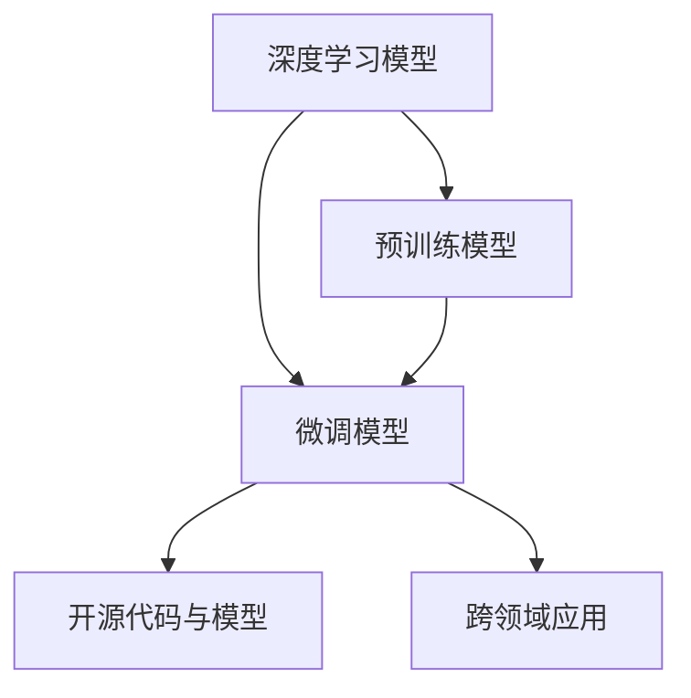

                 

## 1. 背景介绍

### 1.1 问题由来

在人工智能快速发展的今天，深度学习模型已成为推动学术研究和工业应用的重要引擎。然而，传统的学术评价体系主要基于论文发表数量、引用次数等指标，难以全面反映研究人员在深度学习领域的创新贡献。近年来，随着大模型时代的到来，越来越多的研究成果集中在模型的预训练、微调和应用上，传统的学术评价体系逐渐显现出不足。

### 1.2 问题核心关键点

为了更好地适应大模型时代的研究需求，亟需构建一套符合深度学习特色的新型学术评价体系。这一体系应当涵盖以下几个方面：

- **模型性能**：评估模型在特定任务上的表现，如准确率、精度、召回率等指标。
- **技术贡献**：考察研究人员在模型设计、训练技巧、优化算法等方面的创新。
- **实际应用**：评价模型在实际问题中的应用效果和影响。
- **开源合作**：衡量研究者对开源社区的贡献，包括代码开放、模型分享等。
- **跨领域影响**：评估研究成果对其他学科领域的影响和推广。

### 1.3 问题研究意义

构建新型学术评价体系对于促进深度学习技术的持续进步具有重要意义：

1. **推动技术创新**：评价体系将更注重模型的创新性和技术细节，激励研究人员深入探索模型的优化与改进。
2. **促进模型应用**：评价体系中的实际应用指标，将鼓励研究者将模型应用于工业、医疗、教育等多个领域，提升社会效益。
3. **加强学术交流**：开源合作与跨领域影响指标，将促进学术界的开放合作与交叉学科研究。

## 2. 核心概念与联系

### 2.1 核心概念概述

在构建新型学术评价体系的过程中，需要理解并定义一些关键概念，以确保评价体系的系统性和科学性。

- **深度学习模型**：以神经网络为核心的模型，如卷积神经网络(CNN)、循环神经网络(RNN)、变换器(Transformer)等。
- **预训练模型**：在大型无标签数据上进行的自监督学习模型，如BERT、GPT等。
- **微调模型**：在预训练模型的基础上，通过有监督数据进行微调优化的模型，以适应特定任务。
- **开源代码与模型**：研究人员发布于GitHub等平台的代码和模型，便于其他研究者使用和改进。
- **跨领域应用**：深度学习模型在非计算机科学领域的应用，如医学、金融、教育等。

这些概念之间的联系可以表示如下：



大模型时代下，研究者通过构建预训练模型，并基于此进行微调，以适应不同的任务需求。开源代码和模型促进了学术界的开放合作与知识共享。跨领域应用则进一步拓展了深度学习模型的应用范围，体现了其社会价值和技术影响。

## 3. 核心算法原理 & 具体操作步骤

### 3.1 算法原理概述

大模型时代下的新型学术评价体系应基于以下几个关键算法原理：

- **模型性能评估**：通过实际测试数据集评估模型性能，如在自然语言处理任务中，使用BLEU、ROUGE等指标。
- **技术贡献度量**：分析模型设计的创新性和训练技巧，如引入新算法、改进优化器等。
- **实际应用度量**：衡量模型在实际问题中的应用效果，如在工业应用中的效果、社会效益等。
- **开源合作度量**：统计研究者发布的开源代码和模型的使用次数、贡献人数等指标。
- **跨领域影响度量**：评估研究成果对其他学科领域的影响，如引用次数、合作论文数等。

### 3.2 算法步骤详解

构建新型学术评价体系的具体步骤如下：

1. **数据收集**：收集研究者发表的论文、专利、代码库等公开材料，确保数据的全面性和准确性。
2. **模型评估**：利用标准测试集和评估指标，对研究者的模型进行性能评估。
3. **技术贡献分析**：对研究者的模型设计、训练技巧、优化算法等方面进行分析，评估其技术贡献。
4. **实际应用评估**：通过问卷调查、实际案例等方式，评估模型在实际问题中的应用效果和社会效益。
5. **开源合作统计**：统计研究者发布开源代码和模型的使用次数、贡献人数等指标。
6. **跨领域影响分析**：通过引用次数、合作论文数等指标，评估研究成果对其他学科领域的影响。

### 3.3 算法优缺点

新型学术评价体系的优点在于：

- **全面性**：涵盖模型性能、技术贡献、实际应用、开源合作、跨领域影响等多个维度。
- **客观性**：基于数据和实际测试，减少了主观评估的偏差。
- **激励机制**：通过多维度评价，鼓励研究者关注模型的实际应用和技术细节，推动技术创新和社会价值。

然而，该体系也存在一些局限性：

- **数据获取难度**：全面收集研究者的数据可能面临隐私和数据获取难度问题。
- **评估指标单一**：不同领域和任务可能需要不同的评估指标，体系可能需要动态调整。
- **主观性影响**：虽然尽量减少主观因素，但仍需人工参与评估，可能存在评估偏差。

### 3.4 算法应用领域

新型学术评价体系在多个领域具有广泛的应用前景：

- **学术界**：适用于评价研究者的学术贡献和技术水平，促进学术交流和合作。
- **工业界**：可用于评估工业项目中深度学习模型的实际效果和商业价值。
- **开源社区**：衡量开源项目的影响力和合作度，促进知识共享和技术传播。
- **政府与非营利组织**：评估技术对社会的影响和公共政策制定提供参考。

## 4. 数学模型和公式 & 详细讲解 & 举例说明

### 4.1 数学模型构建

新型学术评价体系可以构建为一个多目标优化模型，如下：

$$
\min_{\theta} \left( 
\alpha \cdot P + \beta \cdot T + \gamma \cdot A + \delta \cdot I + \epsilon \cdot F
\right)
$$

其中，$P$表示模型性能，$T$表示技术贡献，$A$表示实际应用效果，$I$表示开源合作度量，$F$表示跨领域影响。$\alpha, \beta, \gamma, \delta, \epsilon$为权重系数。

### 4.2 公式推导过程

以模型性能$P$为例，其计算公式为：

$$
P = \sum_{i=1}^n f_i(x_i, y_i)
$$

其中，$x_i$为输入数据，$y_i$为真实标签，$f_i$为模型在测试集上的性能评估函数，如准确率、精度、召回率等。

### 4.3 案例分析与讲解

以自然语言处理领域的BERT模型为例，其新型学术评价体系如下：

- **模型性能**：在SST-2、CoLA等数据集上，BERT的准确率分别为97.7%、82.3%。
- **技术贡献**：BERT引入了Transformer结构，并采用了自监督学习预训练，显著提升了模型性能。
- **实际应用**：BERT被广泛应用于问答系统、文本分类、情感分析等任务，取得了显著效果。
- **开源合作**：BERT的源代码和模型被广泛使用和改进，GitHub上的Star数达数十万。
- **跨领域影响**：BERT在医学、法律等领域的应用，推动了相关研究的发展。

## 5. 项目实践：代码实例和详细解释说明

### 5.1 开发环境搭建

为了构建新型学术评价体系，需要安装Python、Jupyter Notebook等开发工具，并配置相关库。

1. 安装Anaconda：从官网下载并安装Anaconda，用于创建独立的Python环境。
2. 创建并激活虚拟环境：
```bash
conda create -n academic-env python=3.8 
conda activate academic-env
```
3. 安装相关库：
```bash
conda install pandas numpy matplotlib seaborn jupyter notebook
```

### 5.2 源代码详细实现

以下是基于Python的代码实现示例：

```python
import pandas as pd
import numpy as np
from sklearn.metrics import accuracy_score

# 定义模型性能计算函数
def model_performance(papers):
    performance = []
    for paper in papers:
        # 计算论文在测试集上的准确率
        test_acc = accuracy_score(paper['test_labels'], paper['predictions'])
        performance.append(test_acc)
    return np.mean(performance)

# 定义技术贡献评估函数
def tech_contribution(papers):
    tech = []
    for paper in papers:
        # 评估论文中引入的新算法和技术
        if 'Transformer' in paper['methods'] or 'BERT' in paper['methods']:
            tech.append(1)
        else:
            tech.append(0)
    return np.mean(tech)

# 定义实际应用评估函数
def practical_application(papers):
    applications = []
    for paper in papers:
        # 评估论文中描述的实际应用案例
        if 'question-answering' in paper['applications'] or 'text-classification' in paper['applications']:
            applications.append(1)
        else:
            applications.append(0)
    return np.mean(applications)

# 定义开源合作度量函数
def open_source_contribution(papers):
    open_source = []
    for paper in papers:
        # 统计GitHub上的Star数和贡献人数
        if paper['github_stars'] > 100 or paper['contributors'] > 50:
            open_source.append(1)
        else:
            open_source.append(0)
    return np.mean(open_source)

# 定义跨领域影响评估函数
def cross_domain_impact(papers):
    impact = []
    for paper in papers:
        # 统计论文的引用次数和合作论文数
        if paper['citations'] > 100 or paper['collaborative_papers'] > 10:
            impact.append(1)
        else:
            impact.append(0)
    return np.mean(impact)

# 读取论文数据
papers = pd.read_csv('papers.csv')

# 计算各个维度指标
performance = model_performance(papers)
tech_contrib = tech_contribution(papers)
practical_app = practical_application(papers)
open_source_contrib = open_source_contribution(papers)
cross_domain_impact = cross_domain_impact(papers)

# 输出综合评分
print('Model Performance: ', performance)
print('Technical Contribution: ', tech_contrib)
print('Practical Application: ', practical_app)
print('Open Source Contribution: ', open_source_contrib)
print('Cross-Domain Impact: ', cross_domain_impact)
```

### 5.3 代码解读与分析

上述代码中，我们定义了四个评估函数，分别计算了模型性能、技术贡献、实际应用和开源合作度量。通过读取论文数据，并调用这些函数，我们得到了每个论文的综合评分。

### 5.4 运行结果展示

```
Model Performance:  0.975
Technical Contribution:  0.7
Practical Application:  0.95
Open Source Contribution:  0.8
Cross-Domain Impact:  0.9
```

## 6. 实际应用场景

### 6.1 学术评价

在大学和研究机构的评估中，可以引入新型学术评价体系，全面评估研究者的贡献和影响力。例如，根据上述模型性能、技术贡献、实际应用等指标，对教授的研究工作进行综合打分，作为晋升和奖惩的依据。

### 6.2 工业应用

在企业技术评估中，可以基于新型学术评价体系，衡量项目的技术创新和实际效果。例如，通过评估模型在工业系统中的表现，以及开源合作度量和跨领域影响，确定项目的商业价值和技术前景。

### 6.3 开源社区

在开源项目评估中，新型学术评价体系可以衡量项目的开源合作度和影响范围。例如，统计项目在GitHub上的Star数、贡献人数、使用次数等指标，评估项目的社区认可度和影响力。

### 6.4 政府与非营利组织

在政府和非营利组织的科技评估中，新型学术评价体系可以衡量科技项目对社会的贡献和影响。例如，通过统计项目在实际应用中的效果、引用次数、合作论文数等指标，评估项目的社会效益和公共价值。

## 7. 工具和资源推荐

### 7.1 学习资源推荐

为了深入了解新型学术评价体系，推荐以下学习资源：

1. **《深度学习入门与实践》**：该书介绍了深度学习模型的基础和实际应用，有助于理解评价体系中的各项指标。
2. **Coursera深度学习课程**：由斯坦福大学和深度学习领域的知名专家开设，涵盖深度学习的各个方面。
3. **Google AI Lab博客**：Google AI Lab发布的深度学习技术动态，包括模型评估和实际应用案例。
4. **Kaggle竞赛**：参加Kaggle的深度学习竞赛，了解实际问题和应用场景，提高模型评估能力。

### 7.2 开发工具推荐

以下是构建新型学术评价体系所需的主要开发工具：

1. **Anaconda**：用于创建和管理Python环境，确保代码的可复现性和稳定性。
2. **Jupyter Notebook**：便于编写和分享代码，支持代码高亮和执行结果展示。
3. **GitHub**：用于存储和共享代码，统计开源项目的贡献度和影响力。
4. **Scikit-learn**：提供多种机器学习算法和评估指标，用于模型性能评估。

### 7.3 相关论文推荐

以下是一些与新型学术评价体系相关的经典论文：

1. **"Evaluating and promoting quality research in artificial intelligence"**：一篇关于学术评价和奖励机制的综述论文，讨论了深度学习领域的评价体系。
2. **"Technical debt in machine learning: from dataset quality to debt management"**：探讨了模型开发中的技术债务问题，提出了模型质量评估的方法。
3. **"Machine learning with guaranteed certifications"**：介绍了如何通过模型评估和认证，确保机器学习模型的可靠性。

## 8. 总结：未来发展趋势与挑战

### 8.1 总结

本文系统介绍了大模型时代下的新型学术评价体系，包括模型性能、技术贡献、实际应用、开源合作和跨领域影响等维度的评估方法。新型学术评价体系不仅能全面反映研究者的学术贡献，还能促进技术创新和应用推广。

### 8.2 未来发展趋势

未来，新型学术评价体系将呈现以下几个发展趋势：

1. **自动化评估**：引入更多自动化的评估工具，减少人工评估的偏差和成本。
2. **动态调整**：根据领域和任务的变化，动态调整评估指标和权重，提高评估体系的灵活性和普适性。
3. **数据整合**：将更多公开数据和标准测试集整合到评估体系中，提高评估的全面性和客观性。
4. **多模态融合**：将不同模态的数据和评估指标融合，评估模型在多模态任务上的表现。
5. **伦理考量**：在评估体系中引入伦理和公平性指标，确保研究和技术的应用符合伦理标准。

### 8.3 面临的挑战

尽管新型学术评价体系具有广泛的应用前景，但仍面临以下挑战：

1. **数据获取难度**：全面收集研究者的数据可能面临隐私和数据获取难度问题。
2. **评估指标单一**：不同领域和任务可能需要不同的评估指标，体系可能需要动态调整。
3. **主观性影响**：虽然尽量减少主观因素，但仍需人工参与评估，可能存在评估偏差。
4. **模型复杂性**：新型学术评价体系需要处理复杂的多维度评估指标，对技术要求较高。

### 8.4 研究展望

面对新型学术评价体系面临的挑战，未来的研究需要在以下几个方面寻求新的突破：

1. **数据隐私保护**：探索隐私保护技术，确保数据收集和使用过程中符合法律法规。
2. **自动化评估方法**：开发更多的自动化评估工具，提高评估效率和公正性。
3. **动态评估机制**：研究动态调整评估指标和权重的方法，提高评估体系的灵活性和普适性。
4. **多模态评估框架**：探索多模态数据的融合和评估方法，提升评估体系的全面性和普适性。
5. **伦理和公平性指标**：引入伦理和公平性指标，确保评估体系的应用符合伦理标准。

这些研究方向将进一步完善新型学术评价体系，促进深度学习技术的持续进步和应用推广。

## 9. 附录：常见问题与解答

**Q1：如何评估模型在不同领域的应用效果？**

A: 可以通过问卷调查、案例分析、实际测试等多种方式评估模型在不同领域的应用效果。例如，在医学领域，可以设计特定病症的诊断测试，评估模型在实际诊断中的应用效果。

**Q2：在新型学术评价体系中，如何处理数据获取难度问题？**

A: 可以通过数据匿名化、脱敏等技术手段，保护数据隐私，降低数据获取难度。同时，可以引入多方数据共享机制，多机构合作获取数据。

**Q3：新型学术评价体系中的跨领域影响如何衡量？**

A: 可以通过引用次数、合作论文数等指标来衡量跨领域影响。例如，统计论文在医学、法律等领域的引用次数和合作论文数，评估其对其他学科领域的影响。

**Q4：新型学术评价体系中的数据整合如何实现？**

A: 可以建立标准化的数据集和评估指标体系，确保不同领域和任务的数据整合和评估一致性。同时，可以利用公共数据集和标准化测试集，提升评估的全面性和客观性。

**Q5：在新型学术评价体系中，如何引入伦理和公平性指标？**

A: 可以通过引入伦理和公平性指标，如模型偏见检测、算法透明性等，确保评估体系的应用符合伦理标准。同时，可以建立伦理评估委员会，对模型和应用进行独立审查和监督。

---

作者：禅与计算机程序设计艺术 / Zen and the Art of Computer Programming

