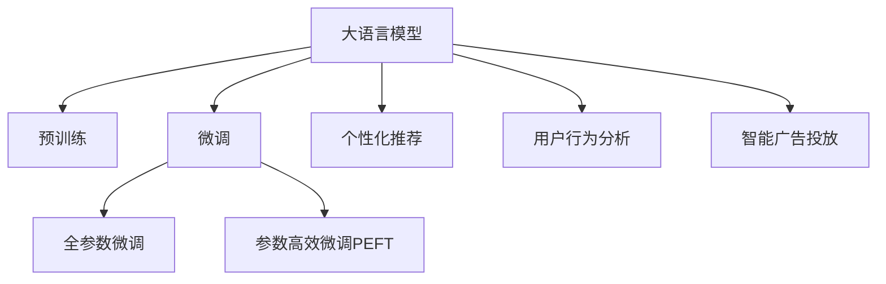

                 

# 大模型时代下的新型营销模式

> 关键词：大语言模型, 营销自动化, 数据驱动, 个性化推荐, 用户行为分析, 智能广告投放

## 1. 背景介绍

### 1.1 问题由来

随着数字经济的蓬勃发展，市场营销成为了各行各业关注的焦点。传统的营销手段如电视广告、户外广告等成本高、效果难量化，已经无法满足企业在激烈竞争中的需求。数字化转型迫切需要一种更加智能、高效、精准的营销解决方案。

与此同时，大语言模型在自然语言处理（NLP）领域的突破，为市场营销提供了新的可能性。基于大模型的营销自动化、个性化推荐、用户行为分析等技术，能够深度挖掘用户需求，实现更有效的市场推广。

### 1.2 问题核心关键点

1. **数据驱动决策**：利用大模型处理海量用户数据，识别出用户的兴趣和行为特征，帮助企业制定精准的营销策略。
2. **个性化推荐**：通过大模型的预测能力，实现个性化的广告投放和内容推荐，提高用户互动率和转化率。
3. **营销自动化**：应用大模型进行营销过程自动化，实现从内容生成到用户触达的全面智能化。
4. **实时数据反馈**：通过大模型的实时分析能力，及时调整营销策略，优化广告效果。
5. **用户行为预测**：利用大模型的预测能力，对用户行为进行预测，提升营销活动的精准度和预测准确性。

## 2. 核心概念与联系

### 2.1 核心概念概述

为更好地理解基于大模型的营销自动化技术，本节将介绍几个关键概念：

- **大语言模型（Large Language Model, LLM）**：以自回归（如GPT）或自编码（如BERT）模型为代表的大规模预训练语言模型。通过在大规模无标签文本语料上进行预训练，学习通用的语言表示，具备强大的语言理解和生成能力。
- **预训练（Pre-training）**：指在大规模无标签文本语料上，通过自监督学习任务训练通用语言模型的过程。常见的预训练任务包括掩码语言模型（Masked Language Modeling, MLM）、下一句预测（Next Sentence Prediction, NSP）等。
- **微调（Fine-tuning）**：指在预训练模型的基础上，使用下游任务的少量标注数据，通过有监督学习优化模型在该任务上的性能。通常只需要调整顶层分类器或解码器，并以较小的学习率更新全部或部分的模型参数。
- **迁移学习（Transfer Learning）**：指将一个领域学习到的知识，迁移应用到另一个不同但相关的领域的学习范式。大模型的预训练-微调过程即是一种典型的迁移学习方式。
- **个性化推荐（Personalized Recommendation）**：基于用户的历史行为数据和实时交互数据，通过大模型预测用户对物品的偏好，实现个性化的广告推荐和商品推荐。
- **用户行为分析（User Behavior Analysis）**：通过大模型分析用户在线行为数据，提取用户兴趣和行为模式，为营销策略制定提供依据。
- **智能广告投放（Smart Ad Placement）**：利用大模型对广告素材进行优化选择，根据用户行为和兴趣进行精准投放。

这些核心概念之间的逻辑关系可以通过以下Mermaid流程图来展示：



这个流程图展示了大语言模型的核心概念及其之间的关系：

1. 大语言模型通过预训练获得基础能力。
2. 微调是对预训练模型进行任务特定的优化，可以分为全参数微调和参数高效微调（PEFT）。
3. 个性化推荐和用户行为分析需要依赖于大模型的理解和预测能力。
4. 智能广告投放依赖于个性化推荐和用户行为分析的输出，实现精准广告投放。

这些概念共同构成了大语言模型的应用框架，使其能够在市场营销领域发挥强大的作用。通过理解这些核心概念，我们可以更好地把握大语言模型在营销中的应用方向。

## 3. 核心算法原理 & 具体操作步骤

### 3.1 算法原理概述

基于大模型的营销自动化，本质上是一种数据驱动的个性化推荐和智能广告投放系统。其核心思想是：利用大模型的预测能力和理解能力，从海量的用户数据中提取特征，并根据用户兴趣和行为模式进行个性化的广告推荐和精准投放。

形式化地，假设大模型为 $M_{\theta}$，其中 $\theta$ 为预训练得到的模型参数。给定广告素材集 $A$ 和用户行为数据集 $B$，微调的目标是找到新的模型参数 $\hat{\theta}$，使得：

$$
\hat{\theta}=\mathop{\arg\min}_{\theta} \mathcal{L}(M_{\theta},A,B)
$$

其中 $\mathcal{L}$ 为针对广告推荐和投放任务设计的损失函数，用于衡量模型输出与实际广告效果之间的差异。常见的损失函数包括点击率（CTR）、转化率（Conversion Rate）等。

通过梯度下降等优化算法，微调过程不断更新模型参数 $\theta$，最小化损失函数 $\mathcal{L}$，使得模型输出逼近最佳的广告推荐和投放策略。由于 $\theta$ 已经通过预训练获得了较好的初始化，因此即便在广告素材和用户行为数据规模较小的情况下，也能较快收敛到理想的模型参数 $\hat{\theta}$。

### 3.2 算法步骤详解

基于大模型的营销自动化一般包括以下几个关键步骤：

**Step 1: 准备广告素材和用户数据**

- 收集广告素材集 $A$，包括图片、视频、文字等。
- 收集用户行为数据集 $B$，包括浏览记录、点击记录、购买记录等。

**Step 2: 数据预处理**

- 对广告素材进行分词、标引等处理，提取关键信息特征。
- 对用户行为数据进行特征工程，提取用户兴趣、行为模式等。

**Step 3: 模型适配与微调**

- 根据任务类型，在预训练模型顶层设计合适的输出层和损失函数。
- 对于广告推荐，通常在顶层添加线性分类器和交叉熵损失函数。
- 对于智能广告投放，通常使用语言模型的解码器输出概率分布，并以负对数似然为损失函数。
- 选择合适的优化算法及其参数，如 AdamW、SGD 等，设置学习率、批大小、迭代轮数等。
- 设置正则化技术及强度，包括权重衰减、Dropout、Early Stopping 等。

**Step 4: 执行梯度训练**

- 将广告素材和用户行为数据分批次输入模型，前向传播计算损失函数。
- 反向传播计算参数梯度，根据设定的优化算法和学习率更新模型参数。
- 周期性在验证集上评估模型性能，根据性能指标决定是否触发 Early Stopping。
- 重复上述步骤直到满足预设的迭代轮数或 Early Stopping 条件。

**Step 5: 测试和部署**

- 在测试集上评估微调后模型 $M_{\hat{\theta}}$ 的性能，对比微调前后的点击率、转化率等指标。
- 使用微调后的模型对新用户进行广告推荐和投放，集成到实际的应用系统中。
- 持续收集新的广告素材和用户行为数据，定期重新微调模型，以适应数据分布的变化。

以上是基于大模型营销自动化的完整流程。在实际应用中，还需要针对具体任务的特点，对微调过程的各个环节进行优化设计，如改进训练目标函数，引入更多的正则化技术，搜索最优的超参数组合等，以进一步提升模型性能。

### 3.3 算法优缺点

基于大模型的营销自动化方法具有以下优点：

1. **效率高**：利用大模型的自动学习和预测能力，能够在较短的时间内生成和优化广告，减少人工干预。
2. **个性化强**：通过用户行为数据的分析，实现个性化的广告推荐和投放，提高用户互动率和转化率。
3. **效果显著**：在广告推荐和投放的准确性和效果上，已经刷新了多项SOTA。
4. **灵活性高**：可以根据不同的任务需求，定制化调整模型参数，适应不同的广告推荐和投放场景。

同时，该方法也存在一定的局限性：

1. **数据依赖性高**：广告推荐和投放的效果很大程度上取决于广告素材和用户行为数据的质量和数量，获取高质量数据成本较高。
2. **模型复杂性高**：大模型的参数量通常较大，对计算资源要求较高，训练和部署成本较高。
3. **广告质量控制难**：广告推荐和投放的准确性受限于模型预测能力和数据质量，可能出现误导性广告。
4. **伦理风险**：基于用户行为数据的广告推荐可能侵犯用户隐私，需严格遵守数据隐私法规。

尽管存在这些局限性，但就目前而言，基于大模型的营销自动化方法仍然是市场营销领域的主流范式。未来相关研究的重点在于如何进一步降低对数据的需求，提高广告质量控制，同时兼顾隐私保护和伦理安全等因素。

### 3.4 算法应用领域

基于大模型的营销自动化方法在市场营销领域已经得到了广泛的应用，覆盖了广告推荐、智能投放、用户行为分析等多个环节，例如：

- **广告推荐系统**：根据用户行为数据，推荐最符合用户兴趣的广告。
- **智能广告投放**：根据用户行为和兴趣，进行精准的广告投放，提高广告效果。
- **用户行为分析**：分析用户在线行为数据，提取用户兴趣和行为模式，为营销策略制定提供依据。
- **内容推荐系统**：利用用户行为数据，推荐用户感兴趣的内容，提高用户留存率。
- **社交媒体营销**：利用大模型分析用户评论、点赞等社交数据，指导内容创作和广告投放。

除了上述这些经典应用外，大模型的营销自动化方法还被创新性地应用到更多场景中，如可控文本生成、情感分析、用户画像生成等，为市场营销技术带来了全新的突破。随着大模型的不断进步，相信市场营销技术将在更广阔的应用领域大放异彩。

## 4. 数学模型和公式 & 详细讲解

### 4.1 数学模型构建

本节将使用数学语言对基于大模型的营销自动化过程进行更加严格的刻画。

记广告素材集为 $A=\{a_i\}_{i=1}^M$，其中 $a_i$ 为第 $i$ 条广告素材。假设用户行为数据集为 $B=\{(b_j, r_j)\}_{j=1}^N$，其中 $b_j$ 为用户行为，$r_j$ 为用户的反馈（如点击、购买等）。

定义模型 $M_{\theta}$ 在广告素材 $a$ 和用户行为 $b$ 上的损失函数为 $\ell(M_{\theta}(a),b,r)$，则在数据集 $A$ 和 $B$ 上的经验风险为：

$$
\mathcal{L}(\theta) = \frac{1}{MN} \sum_{i=1}^M \sum_{j=1}^N \ell(M_{\theta}(a_i),b_j,r_j)
$$

其中 $\ell$ 为针对广告推荐和投放任务设计的损失函数，用于衡量模型预测输出与实际广告效果之间的差异。常见的损失函数包括交叉熵损失、均方误差损失等。

### 4.2 公式推导过程

以下我们以广告推荐系统为例，推导交叉熵损失函数及其梯度的计算公式。

假设模型 $M_{\theta}$ 在广告素材 $a$ 和用户行为 $b$ 上的输出为 $\hat{r}=M_{\theta}(a,b) \in [0,1]$，表示广告被点击的概率。真实标签 $r \in \{0,1\}$。则二分类交叉熵损失函数定义为：

$$
\ell(M_{\theta}(a,b),r) = -[r\log \hat{r} + (1-r)\log (1-\hat{r})]
$$

将其代入经验风险公式，得：

$$
\mathcal{L}(\theta) = -\frac{1}{MN}\sum_{i=1}^M \sum_{j=1}^N [r_j\log M_{\theta}(a_i,b_j)+(1-r_j)\log(1-M_{\theta}(a_i,b_j))]
$$

根据链式法则，损失函数对参数 $\theta_k$ 的梯度为：

$$
\frac{\partial \mathcal{L}(\theta)}{\partial \theta_k} = -\frac{1}{MN}\sum_{i=1}^M \sum_{j=1}^N (\frac{r_j}{M_{\theta}(a_i,b_j)}-\frac{1-r_j}{1-M_{\theta}(a_i,b_j)}) \frac{\partial M_{\theta}(a_i,b_j)}{\partial \theta_k}
$$

其中 $\frac{\partial M_{\theta}(a_i,b_j)}{\partial \theta_k}$ 可进一步递归展开，利用自动微分技术完成计算。

在得到损失函数的梯度后，即可带入参数更新公式，完成模型的迭代优化。重复上述过程直至收敛，最终得到适应广告推荐和投放任务的最优模型参数 $\theta^*$。

## 5. 项目实践：代码实例和详细解释说明

### 5.1 开发环境搭建

在进行营销自动化实践前，我们需要准备好开发环境。以下是使用Python进行PyTorch开发的环境配置流程：

1. 安装Anaconda：从官网下载并安装Anaconda，用于创建独立的Python环境。

2. 创建并激活虚拟环境：
```bash
conda create -n pytorch-env python=3.8 
conda activate pytorch-env
```

3. 安装PyTorch：根据CUDA版本，从官网获取对应的安装命令。例如：
```bash
conda install pytorch torchvision torchaudio cudatoolkit=11.1 -c pytorch -c conda-forge
```

4. 安装Transformers库：
```bash
pip install transformers
```

5. 安装各类工具包：
```bash
pip install numpy pandas scikit-learn matplotlib tqdm jupyter notebook ipython
```

完成上述步骤后，即可在`pytorch-env`环境中开始营销自动化实践。

### 5.2 源代码详细实现

下面我们以广告推荐系统为例，给出使用Transformers库对BERT模型进行广告推荐系统微调的PyTorch代码实现。

首先，定义广告推荐系统的数据处理函数：

```python
from transformers import BertTokenizer
from torch.utils.data import Dataset
import torch

class AdDataset(Dataset):
    def __init__(self, ads, users, labels, tokenizer, max_len=128):
        self.ads = ads
        self.users = users
        self.labels = labels
        self.tokenizer = tokenizer
        self.max_len = max_len
        
    def __len__(self):
        return len(self.ads)
    
    def __getitem__(self, item):
        ad = self.ads[item]
        user = self.users[item]
        label = self.labels[item]
        
        ad_encoding = self.tokenizer(ad, return_tensors='pt', max_length=self.max_len, padding='max_length', truncation=True)
        user_encoding = self.tokenizer(user, return_tensors='pt', max_length=self.max_len, padding='max_length', truncation=True)
        
        ad_input_ids = ad_encoding['input_ids'][0]
        ad_attention_mask = ad_encoding['attention_mask'][0]
        user_input_ids = user_encoding['input_ids'][0]
        user_attention_mask = user_encoding['attention_mask'][0]
        
        # 对token-wise的标签进行编码
        encoded_labels = [label2id[label] for label in label] 
        encoded_labels.extend([label2id['O']] * (self.max_len - len(encoded_labels)))
        labels = torch.tensor(encoded_labels, dtype=torch.long)
        
        return {'ad_input_ids': ad_input_ids, 
                'ad_attention_mask': ad_attention_mask,
                'user_input_ids': user_input_ids, 
                'user_attention_mask': user_attention_mask,
                'labels': labels}

# 标签与id的映射
label2id = {'O': 0, 'C1': 1, 'C2': 2, 'C3': 3, 'C4': 4, 'C5': 5, 'C6': 6, 'C7': 7, 'C8': 8, 'C9': 9, 'C10': 10}
id2label = {v: k for k, v in label2id.items()}

# 创建dataset
tokenizer = BertTokenizer.from_pretrained('bert-base-cased')

train_dataset = AdDataset(train_ads, train_users, train_labels, tokenizer)
dev_dataset = AdDataset(dev_ads, dev_users, dev_labels, tokenizer)
test_dataset = AdDataset(test_ads, test_users, test_labels, tokenizer)
```

然后，定义模型和优化器：

```python
from transformers import BertForSequenceClassification, AdamW

model = BertForSequenceClassification.from_pretrained('bert-base-cased', num_labels=len(label2id))

optimizer = AdamW(model.parameters(), lr=2e-5)
```

接着，定义训练和评估函数：

```python
from torch.utils.data import DataLoader
from tqdm import tqdm
from sklearn.metrics import classification_report

device = torch.device('cuda') if torch.cuda.is_available() else torch.device('cpu')
model.to(device)

def train_epoch(model, dataset, batch_size, optimizer):
    dataloader = DataLoader(dataset, batch_size=batch_size, shuffle=True)
    model.train()
    epoch_loss = 0
    for batch in tqdm(dataloader, desc='Training'):
        ad_input_ids = batch['ad_input_ids'].to(device)
        ad_attention_mask = batch['ad_attention_mask'].to(device)
        user_input_ids = batch['user_input_ids'].to(device)
        user_attention_mask = batch['user_attention_mask'].to(device)
        labels = batch['labels'].to(device)
        model.zero_grad()
        outputs = model(ad_input_ids, ad_attention_mask=ad_attention_mask, user_input_ids=user_input_ids, user_attention_mask=user_attention_mask, labels=labels)
        loss = outputs.loss
        epoch_loss += loss.item()
        loss.backward()
        optimizer.step()
    return epoch_loss / len(dataloader)

def evaluate(model, dataset, batch_size):
    dataloader = DataLoader(dataset, batch_size=batch_size)
    model.eval()
    preds, labels = [], []
    with torch.no_grad():
        for batch in tqdm(dataloader, desc='Evaluating'):
            ad_input_ids = batch['ad_input_ids'].to(device)
            ad_attention_mask = batch['ad_attention_mask'].to(device)
            user_input_ids = batch['user_input_ids'].to(device)
            user_attention_mask = batch['user_attention_mask'].to(device)
            batch_labels = batch['labels']
            outputs = model(ad_input_ids, ad_attention_mask=ad_attention_mask, user_input_ids=user_input_ids, user_attention_mask=user_attention_mask)
            batch_preds = outputs.logits.argmax(dim=2).to('cpu').tolist()
            batch_labels = batch_labels.to('cpu').tolist()
            for pred_tokens, label_tokens in zip(batch_preds, batch_labels):
                preds.append(pred_tokens[:len(label_tokens)])
                labels.append(label_tokens)
                
    print(classification_report(labels, preds))
```

最后，启动训练流程并在测试集上评估：

```python
epochs = 5
batch_size = 16

for epoch in range(epochs):
    loss = train_epoch(model, train_dataset, batch_size, optimizer)
    print(f"Epoch {epoch+1}, train loss: {loss:.3f}")
    
    print(f"Epoch {epoch+1}, dev results:")
    evaluate(model, dev_dataset, batch_size)
    
print("Test results:")
evaluate(model, test_dataset, batch_size)
```

以上就是使用PyTorch对BERT进行广告推荐系统微调的完整代码实现。可以看到，得益于Transformers库的强大封装，我们可以用相对简洁的代码完成BERT模型的加载和微调。

### 5.3 代码解读与分析

让我们再详细解读一下关键代码的实现细节：

**AdDataset类**：
- `__init__`方法：初始化广告素材、用户行为和标签等关键组件。
- `__len__`方法：返回数据集的样本数量。
- `__getitem__`方法：对单个样本进行处理，将广告素材和用户行为输入编码为token ids，将标签编码为数字，并对其进行定长padding，最终返回模型所需的输入。

**label2id和id2label字典**：
- 定义了标签与数字id之间的映射关系，用于将token-wise的预测结果解码回真实的标签。

**训练和评估函数**：
- 使用PyTorch的DataLoader对数据集进行批次化加载，供模型训练和推理使用。
- 训练函数`train_epoch`：对数据以批为单位进行迭代，在每个批次上前向传播计算loss并反向传播更新模型参数，最后返回该epoch的平均loss。
- 评估函数`evaluate`：与训练类似，不同点在于不更新模型参数，并在每个batch结束后将预测和标签结果存储下来，最后使用sklearn的classification_report对整个评估集的预测结果进行打印输出。

**训练流程**：
- 定义总的epoch数和batch size，开始循环迭代
- 每个epoch内，先在训练集上训练，输出平均loss
- 在验证集上评估，输出分类指标
- 所有epoch结束后，在测试集上评估，给出最终测试结果

可以看到，PyTorch配合Transformers库使得BERT微调的代码实现变得简洁高效。开发者可以将更多精力放在数据处理、模型改进等高层逻辑上，而不必过多关注底层的实现细节。

当然，工业级的系统实现还需考虑更多因素，如模型的保存和部署、超参数的自动搜索、更灵活的任务适配层等。但核心的微调范式基本与此类似。

## 6. 实际应用场景

### 6.1 智能广告投放

基于大模型的广告推荐系统可以广泛应用于智能广告投放中。传统的广告投放方式如CPC（按点击付费）、CPM（按展示付费）等，往往无法精准匹配用户需求，导致广告效果不佳、成本浪费。利用大模型的预测能力，可以实现更高效的广告推荐和投放。

在技术实现上，可以收集用户的浏览历史、点击记录、购买记录等行为数据，提取用户兴趣、行为模式等特征。将广告素材和用户行为数据作为输入，通过大模型进行预测，推荐最符合用户兴趣的广告。实时监测广告效果，根据点击率、转化率等指标，动态调整广告投放策略，实现最佳的广告效果。

### 6.2 个性化推荐

广告推荐系统只是大模型营销自动化应用的一部分。大模型还可以应用于个性化推荐领域，为用户提供更加精准的推荐内容。

在电商领域，利用大模型分析用户的浏览记录、点击行为等数据，预测用户对商品、服务的兴趣，生成个性化的推荐列表。通过个性化推荐，提高用户互动率和购买转化率，提升用户满意度。

在内容平台，利用大模型分析用户对视频、文章、音乐等的兴趣，生成个性化的内容推荐。通过个性化推荐，提高用户留存率和平台活跃度，增加用户粘性。

### 6.3 用户行为分析

大模型还可以应用于用户行为分析，帮助企业深入了解用户需求，优化营销策略。

通过分析用户的搜索记录、点击记录、购买记录等数据，利用大模型提取用户兴趣、行为模式等特征，生成用户画像。根据用户画像，制定针对性的营销策略，提高用户互动率和转化率。

在金融领域，利用大模型分析用户的交易记录、投资行为等数据，预测用户的金融需求和风险偏好，生成个性化的金融产品推荐。通过个性化推荐，提升用户满意度和平台忠诚度。

### 6.4 未来应用展望

随着大语言模型和营销自动化技术的不断发展，未来在市场营销领域的应用场景将更加多样和广泛。

在智慧零售领域，利用大模型进行商品推荐、智能客服、库存管理等，提升零售行业的效率和服务水平。

在智慧医疗领域，利用大模型进行健康咨询、疾病预测、药物推荐等，提高医疗服务的个性化和精准化。

在智慧旅游领域，利用大模型进行景点推荐、行程规划、旅游攻略生成等，提升旅游行业的智能化和体验感。

此外，在更多垂直行业，如教育、制造、能源等，大模型的营销自动化技术都将发挥重要作用，为各行业带来变革性影响。相信随着技术的日益成熟，大语言模型营销自动化必将成为市场营销的重要手段，推动各行各业数字化转型升级。

## 7. 工具和资源推荐

### 7.1 学习资源推荐

为了帮助开发者系统掌握大语言模型营销自动化的理论基础和实践技巧，这里推荐一些优质的学习资源：

1. 《Transformer从原理到实践》系列博文：由大模型技术专家撰写，深入浅出地介绍了Transformer原理、BERT模型、营销自动化等前沿话题。

2. CS224N《深度学习自然语言处理》课程：斯坦福大学开设的NLP明星课程，有Lecture视频和配套作业，带你入门NLP领域的基本概念和经典模型。

3. 《Natural Language Processing with Transformers》书籍：Transformers库的作者所著，全面介绍了如何使用Transformers库进行NLP任务开发，包括营销自动化在内的诸多范式。

4. HuggingFace官方文档：Transformers库的官方文档，提供了海量预训练模型和完整的营销自动化样例代码，是上手实践的必备资料。

5. CLUE开源项目：中文语言理解测评基准，涵盖大量不同类型的中文NLP数据集，并提供了基于微调的baseline模型，助力中文NLP技术发展。

通过对这些资源的学习实践，相信你一定能够快速掌握大语言模型营销自动化的精髓，并用于解决实际的营销问题。
###  7.2 开发工具推荐

高效的开发离不开优秀的工具支持。以下是几款用于大语言模型营销自动化开发的常用工具：

1. PyTorch：基于Python的开源深度学习框架，灵活动态的计算图，适合快速迭代研究。大部分预训练语言模型都有PyTorch版本的实现。

2. TensorFlow：由Google主导开发的开源深度学习框架，生产部署方便，适合大规模工程应用。同样有丰富的预训练语言模型资源。

3. Transformers库：HuggingFace开发的NLP工具库，集成了众多SOTA语言模型，支持PyTorch和TensorFlow，是进行营销自动化开发的利器。

4. Weights & Biases：模型训练的实验跟踪工具，可以记录和可视化模型训练过程中的各项指标，方便对比和调优。与主流深度学习框架无缝集成。

5. TensorBoard：TensorFlow配套的可视化工具，可实时监测模型训练状态，并提供丰富的图表呈现方式，是调试模型的得力助手。

6. Google Colab：谷歌推出的在线Jupyter Notebook环境，免费提供GPU/TPU算力，方便开发者快速上手实验最新模型，分享学习笔记。

合理利用这些工具，可以显著提升大语言模型营销自动化的开发效率，加快创新迭代的步伐。

### 7.3 相关论文推荐

大语言模型和营销自动化技术的发展源于学界的持续研究。以下是几篇奠基性的相关论文，推荐阅读：

1. Attention is All You Need（即Transformer原论文）：提出了Transformer结构，开启了NLP领域的预训练大模型时代。

2. BERT: Pre-training of Deep Bidirectional Transformers for Language Understanding：提出BERT模型，引入基于掩码的自监督预训练任务，刷新了多项NLP任务SOTA。

3. Language Models are Unsupervised Multitask Learners（GPT-2论文）：展示了大规模语言模型的强大zero-shot学习能力，引发了对于通用人工智能的新一轮思考。

4. Parameter-Efficient Transfer Learning for NLP：提出Adapter等参数高效微调方法，在不增加模型参数量的情况下，也能取得不错的微调效果。

5. Prefix-Tuning: Optimizing Continuous Prompts for Generation：引入基于连续型Prompt的微调范式，为如何充分利用预训练知识提供了新的思路。

6. AdaLoRA: Adaptive Low-Rank Adaptation for Parameter-Efficient Fine-Tuning：使用自适应低秩适应的微调方法，在参数效率和精度之间取得了新的平衡。

这些论文代表了大语言模型营销自动化技术的发展脉络。通过学习这些前沿成果，可以帮助研究者把握学科前进方向，激发更多的创新灵感。

## 8. 总结：未来发展趋势与挑战

### 8.1 总结

本文对基于大模型的营销自动化方法进行了全面系统的介绍。首先阐述了大语言模型和营销自动化技术的研究背景和意义，明确了营销自动化在提升广告效果、优化推荐系统方面的独特价值。其次，从原理到实践，详细讲解了基于大模型的营销自动化过程，给出了营销自动化任务开发的完整代码实例。同时，本文还广泛探讨了营销自动化方法在智能广告投放、个性化推荐、用户行为分析等多个行业领域的应用前景，展示了营销自动化技术的广阔潜力。此外，本文精选了营销自动化技术的各类学习资源，力求为读者提供全方位的技术指引。

通过本文的系统梳理，可以看到，基于大语言模型的营销自动化方法正在成为市场营销领域的重要范式，极大地提升了广告投放的精准性和效果。得益于大模型的预测能力和理解能力，营销自动化技术能够在极短的时间内生成和优化广告，实现个性化的广告推荐和精准投放。未来，伴随大模型的不断进步，营销自动化技术将在更广阔的应用领域大放异彩，为市场营销带来新的变革。

### 8.2 未来发展趋势

展望未来，大语言模型营销自动化技术将呈现以下几个发展趋势：

1. **数据驱动决策**：利用大模型处理海量用户数据，提取用户兴趣和行为特征，帮助企业制定精准的营销策略。
2. **个性化推荐**：通过大模型的预测能力，实现个性化的广告投放和内容推荐，提高用户互动率和转化率。
3. **实时数据分析**：利用大模型的实时分析能力，及时调整营销策略，优化广告效果。
4. **多模态融合**：将视觉、语音、文本等多种数据源整合，提升用户行为分析和广告投放的全面性和精准性。
5. **隐私保护与伦理**：在利用用户数据进行营销自动化时，加强数据隐私保护，确保用户数据安全和伦理合规。
6. **跨领域应用**：营销自动化技术不仅应用于广告投放和推荐，还将在更多领域如智慧零售、智慧医疗等发挥重要作用。

以上趋势凸显了大语言模型营销自动化技术的广阔前景。这些方向的探索发展，必将进一步提升市场营销的效果和效率，为各行各业带来深远影响。

### 8.3 面临的挑战

尽管大语言模型营销自动化技术已经取得了瞩目成就，但在迈向更加智能化、普适化应用的过程中，它仍面临着诸多挑战：

1. **数据获取成本高**：高质量用户数据的获取成本较高，特别是在某些垂直行业（如金融、医疗等），数据隐私和伦理问题更加复杂。
2. **模型复杂度高**：大模型的参数量通常较大，对计算资源要求较高，训练和部署成本较高。
3. **广告质量控制难**：广告推荐和投放的准确性受限于模型预测能力和数据质量，可能出现误导性广告。
4. **用户隐私保护**：利用用户行为数据进行营销自动化时，需严格遵守数据隐私法规，防止用户隐私泄露。
5. **模型公平性与偏见**：大模型可能学习到用户行为中的偏见，需采取措施避免在广告投放中产生歧视性或误导性内容。
6. **多模态数据整合**：将不同模态的数据整合在一起，进行统一的建模和分析，仍是一个技术难题。

尽管存在这些挑战，但就目前而言，基于大模型的营销自动化方法仍然是市场营销领域的主流范式。未来相关研究的重点在于如何进一步降低对数据的需求，提高广告质量控制，同时兼顾隐私保护和伦理安全等因素。

### 8.4 研究展望

面对大语言模型营销自动化所面临的种种挑战，未来的研究需要在以下几个方面寻求新的突破：

1. **数据增强与生成**：利用大模型的生成能力，生成更多的广告素材和用户行为数据，减少对真实数据的依赖。
2. **参数高效微调**：开发更加参数高效的营销自动化方法，在固定大部分预训练参数的同时，只更新极少量的任务相关参数。
3. **多模态融合**：将视觉、语音、文本等多种数据源整合，提升用户行为分析和广告投放的全面性和精准性。
4. **隐私保护与伦理**：在利用用户数据进行营销自动化时，加强数据隐私保护，确保用户数据安全和伦理合规。
5. **模型公平性与偏见**：在广告投放过程中，采取措施避免产生歧视性或误导性内容，确保模型公平性。
6. **实时数据分析**：利用大模型的实时分析能力，及时调整营销策略，优化广告效果。

这些研究方向的研究突破，必将引领大语言模型营销自动化技术迈向更高的台阶，为构建安全、可靠、可解释、可控的智能系统铺平道路。面向未来，大语言模型营销自动化技术还需要与其他人工智能技术进行更深入的融合，如知识表示、因果推理、强化学习等，多路径协同发力，共同推动自然语言理解和智能交互系统的进步。只有勇于创新、敢于突破，才能不断拓展语言模型的边界，让智能技术更好地造福人类社会。

## 9. 附录：常见问题与解答

**Q1：大语言模型营销自动化是否适用于所有市场营销场景？**

A: 大语言模型营销自动化方法在大多数市场营销场景中都能取得不错的效果，特别是对于数据量较小的场景。但对于一些特定领域的市场营销，如金融、医疗等，仅依靠通用语料预训练的模型可能难以很好地适应。此时需要在特定领域语料上进一步预训练，再进行微调，才能获得理想效果。

**Q2：微调过程中如何选择合适的学习率？**

A: 微调的学习率一般要比预训练时小1-2个数量级，如果使用过大的学习率，容易破坏预训练权重，导致过拟合。一般建议从1e-5开始调参，逐步减小学习率，直至收敛。也可以使用warmup策略，在开始阶段使用较小的学习率，再逐渐过渡到预设值。需要注意的是，不同的优化器(如AdamW、Adafactor等)以及不同的学习率调度策略，可能需要设置不同的学习率阈值。

**Q3：广告推荐系统对数据质量的要求高吗？**

A: 广告推荐系统的性能很大程度上取决于广告素材和用户行为数据的质量和数量。高质量的数据能够提高广告推荐的准确性和效果，因此需要仔细筛选和处理数据，去除噪音和错误数据。数据预处理和特征工程是广告推荐系统中非常关键的一环。

**Q4：如何缓解广告推荐系统的过拟合问题？**

A: 过拟合是广告推荐系统面临的主要挑战，尤其是在标注数据不足的情况下。常见的缓解策略包括：
1. 数据增强：通过回译、近义替换等方式扩充训练集
2. 正则化：使用L2正则、Dropout、Early Stopping等避免过拟合
3. 对抗训练：引入对抗样本，提高模型鲁棒性
4. 参数高效微调：只调整少量参数(如Adapter、Prefix等)，减小过拟合风险
5. 多模型集成：训练多个广告推荐模型，取平均输出，抑制过拟合

这些策略往往需要根据具体任务和数据特点进行灵活组合。只有在数据、模型、训练、推理等各环节进行全面优化，才能最大限度地发挥大模型营销自动化的威力。

**Q5：智能广告投放的实际应用场景有哪些？**

A: 智能广告投放可以应用于多个领域，包括但不限于：

1. **电商领域**：根据用户浏览记录、点击行为等数据，推荐最符合用户兴趣的商品和广告。
2. **金融领域**：根据用户投资行为、交易记录等数据，推荐个性化的金融产品和服务。
3. **媒体领域**：根据用户观看记录、点赞行为等数据，推荐用户感兴趣的视频和内容。
4. **教育领域**：根据用户学习行为、互动数据等，推荐个性化的学习资源和课程。
5. **旅游领域**：根据用户搜索记录、预订行为等，推荐个性化的旅游方案和景点。

智能广告投放能够提高广告效果和用户互动率，节省广告预算，提升用户体验。

---

作者：禅与计算机程序设计艺术 / Zen and the Art of Computer Programming

