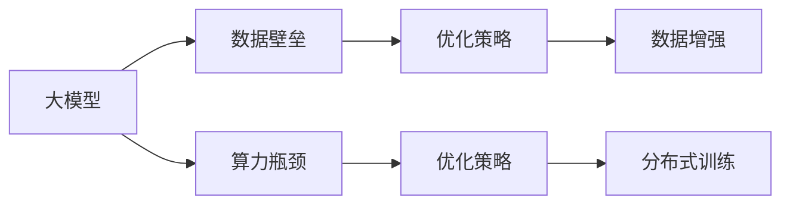

                 

# 大模型时代创业新挑战：数据壁垒与算力瓶颈

> 关键词：大模型、创业挑战、数据壁垒、算力瓶颈、优化策略

## 1. 背景介绍

随着人工智能技术的快速发展和普及，大模型在商业化应用中扮演了越来越重要的角色。大模型不仅提升了应用效率，还极大地简化了企业对数据和算力的需求。然而，创业公司在大模型应用中面临的挑战仍然不小。一方面，高昂的数据壁垒让许多初创企业难以跨越；另一方面，计算资源的瓶颈限制了其大规模部署能力。本文将从数据壁垒与算力瓶颈两个角度出发，分析创业公司在应用大模型时所面临的挑战，并提出相应的优化策略。

## 2. 核心概念与联系

### 2.1 核心概念概述

本文涉及的核心概念包括以下几点：

- **大模型**：以Transformer等深度学习架构为代表，通过海量数据进行预训练的大型神经网络模型。大模型具有强大的泛化能力，能够应用于自然语言处理、计算机视觉、语音识别等多个领域。
- **创业挑战**：初创企业在应用大模型时，由于资源限制，需要针对数据和算力瓶颈进行优化。
- **数据壁垒**：指初创企业难以获取高质量、大规模的标注数据，限制了模型训练的质量和效果。
- **算力瓶颈**：指初创企业难以承受大规模模型训练和推理所需的高额计算资源，限制了模型的应用规模和效率。

这些核心概念之间存在相互关联的关系，共同构成了初创企业在大模型应用中所面临的主要问题。

### 2.2 核心概念原理和架构的 Mermaid 流程图



这个流程图展示了大模型应用中数据壁垒和算力瓶颈对模型的影响，以及相应的优化策略：

1. 大模型通过数据进行预训练，数据壁垒影响了模型的训练效果。
2. 算力瓶颈限制了大模型的训练和推理效率。
3. 优化策略包括数据增强、分布式训练等，旨在提升数据质量和计算效率。

## 3. 核心算法原理 & 具体操作步骤

### 3.1 算法原理概述

基于大模型的应用优化，核心在于如何克服数据和算力壁垒。下面将详细阐述两种主要的优化策略：数据增强和分布式训练。

### 3.2 算法步骤详解

#### 3.2.1 数据增强

**步骤1：收集和处理数据**
- 初创企业需要收集大量与业务相关的未标注数据，进行预处理和清洗。
- 可以通过网络爬虫、API接口、第三方数据集等方式获取数据。

**步骤2：数据增强**
- 对未标注数据进行一系列数据增强操作，如文本回译、近义词替换、数据扩充等。
- 具体实现时，可以使用一些开源工具和库，如huggingface的`Autofill`库，将未标注数据进行扩充，提高模型的泛化能力。

**步骤3：模型训练与评估**
- 使用增强后的数据对大模型进行预训练，以提高模型的泛化能力。
- 在训练过程中，可以定期在验证集上评估模型性能，根据评估结果调整增强策略。

#### 3.2.2 分布式训练

**步骤1：搭建分布式训练环境**
- 使用AWS、Google Cloud、阿里云等云平台，搭建分布式训练环境。
- 选择合适的分布式训练框架，如TensorFlow、PyTorch等。

**步骤2：模型并行**
- 将大模型拆分为多个子模型，分布在不同的计算节点上并行训练。
- 可以通过模型分割、数据并行等方式实现模型并行。

**步骤3：参数优化与调度**
- 使用合适的优化器，如AdamW、SGD等，并根据模型参数进行动态调整。
- 合理设置学习率、批次大小等超参数，提高训练效率。

**步骤4：模型部署与监控**
- 训练完成后，将模型部署到生产环境，并进行实时监控和优化。
- 可以使用Kubernetes、AWS Fargate等容器化工具进行模型部署和管理。

### 3.3 算法优缺点

#### 3.3.1 数据增强
**优点：**
- 有效提升模型的泛化能力，减少数据壁垒带来的影响。
- 数据增强操作相对简单，易于实施。

**缺点：**
- 数据增强操作可能会引入噪声，影响模型效果。
- 数据增强操作需要消耗大量时间和计算资源，增加了前期投入成本。

#### 3.3.2 分布式训练
**优点：**
- 能够快速处理大规模数据和模型，缩短模型训练时间。
- 通过分布式计算，降低单次训练所需的计算资源。

**缺点：**
- 分布式训练需要较高的配置和管理成本。
- 分布式训练中可能会遇到通信瓶颈，影响训练效率。

### 3.4 算法应用领域

大模型应用优化策略在多个领域都有广泛的应用，例如：

- **自然语言处理**：在文本分类、情感分析、机器翻译等任务中，数据增强和分布式训练均能显著提升模型效果。
- **计算机视觉**：在图像识别、目标检测等任务中，分布式训练和数据增强也能提高模型性能。
- **语音识别**：在语音识别和生成任务中，数据增强和分布式训练同样有效。
- **推荐系统**：在大规模推荐系统中，分布式训练可以处理海量用户数据，优化推荐效果。

## 4. 数学模型和公式 & 详细讲解 & 举例说明

### 4.1 数学模型构建

本节将使用数学语言对基于大模型的应用优化进行更加严格的刻画。

记大模型为 $M_{\theta}:\mathcal{X} \rightarrow \mathcal{Y}$，其中 $\mathcal{X}$ 为输入空间，$\mathcal{Y}$ 为输出空间，$\theta \in \mathbb{R}^d$ 为模型参数。

### 4.2 公式推导过程

**数据增强的数学模型：**
假设原始数据集为 $D=\{(x_i,y_i)\}_{i=1}^N$，其中 $x_i \in \mathcal{X}$ 为输入，$y_i \in \mathcal{Y}$ 为标签。

数据增强后的数据集为 $D'=\{(x'_i,y'_i)\}_{i=1}^{N'}$，其中 $x'_i$ 和 $y'_i$ 是通过一系列数据增强操作生成的。

数据增强后的模型损失函数为：

$$
\mathcal{L}'(\theta) = \frac{1}{N'} \sum_{i=1}^{N'} \ell(M_{\theta}(x'_i),y'_i)
$$

其中，$\ell$ 为损失函数，可以是交叉熵、均方误差等。

**分布式训练的数学模型：**
假设大模型分为 $K$ 个部分，分布在 $K$ 个计算节点上并行训练。每个节点的模型参数为 $\theta_k$。

分布式训练的优化目标为：

$$
\theta^* = \mathop{\arg\min}_{\theta} \frac{1}{K} \sum_{k=1}^K \mathcal{L}_k(\theta_k)
$$

其中，$\mathcal{L}_k$ 为第 $k$ 个节点的损失函数。

**公式推导：**
- 数据增强可以通过生成大量增强样本，增加训练数据量，减少数据壁垒。
- 分布式训练可以通过并行计算，加快模型训练速度，解决算力瓶颈。

## 5. 项目实践：代码实例和详细解释说明

### 5.1 开发环境搭建

在进行优化实践前，我们需要准备好开发环境。以下是使用Python进行PyTorch开发的环境配置流程：

1. 安装Anaconda：从官网下载并安装Anaconda，用于创建独立的Python环境。

2. 创建并激活虚拟环境：
```bash
conda create -n pytorch-env python=3.8 
conda activate pytorch-env
```

3. 安装PyTorch：根据CUDA版本，从官网获取对应的安装命令。例如：
```bash
conda install pytorch torchvision torchaudio cudatoolkit=11.1 -c pytorch -c conda-forge
```

4. 安装Transformers库：
```bash
pip install transformers
```

5. 安装各类工具包：
```bash
pip install numpy pandas scikit-learn matplotlib tqdm jupyter notebook ipython
```

完成上述步骤后，即可在`pytorch-env`环境中开始优化实践。

### 5.2 源代码详细实现

我们使用数据增强和分布式训练的方法，对BERT模型进行优化。以下是具体的代码实现：

```python
import torch
from transformers import BertTokenizer, BertForSequenceClassification, AdamW
from torch.utils.data import DataLoader, Dataset
from torch.nn.parallel import DistributedDataParallel as DDP
from transformers import AutoTokenizer, AutoModelForSequenceClassification

# 数据增强
class NERDataset(Dataset):
    def __init__(self, texts, tags, tokenizer, max_len=128):
        self.texts = texts
        self.tags = tags
        self.tokenizer = tokenizer
        self.max_len = max_len
        
    def __len__(self):
        return len(self.texts)
    
    def __getitem__(self, item):
        text = self.texts[item]
        tags = self.tags[item]
        
        encoding = self.tokenizer(text, return_tensors='pt', max_length=self.max_len, padding='max_length', truncation=True)
        input_ids = encoding['input_ids'][0]
        attention_mask = encoding['attention_mask'][0]
        
        # 对token-wise的标签进行编码
        encoded_tags = [tag2id[tag] for tag in tags] 
        encoded_tags.extend([tag2id['O']] * (self.max_len - len(encoded_tags)))
        labels = torch.tensor(encoded_tags, dtype=torch.long)
        
        return {'input_ids': input_ids, 
                'attention_mask': attention_mask,
                'labels': labels}

# 定义优化器和模型
optimizer = AdamW(model.parameters(), lr=2e-5)
model = BertForSequenceClassification.from_pretrained('bert-base-cased', num_labels=len(tag2id))
model = DDP(model)

# 数据增强操作
# 这里使用Autofill库进行数据增强
from transformers import Autofill
autofill = Autofill('Bert', 'base')
autofilled_texts, autofilled_tags = autofill(tokenizer, texts, tags, max_seq_len=128)

# 分布式训练
train_loader = DataLoader(autofilled_dataset, batch_size=16, shuffle=True, num_workers=4)
train_loader = DDP(train_loader, find_unused_parameters=True)

# 训练过程
for epoch in range(5):
    for batch in train_loader:
        inputs = batch['input_ids'].to(device)
        attention_mask = batch['attention_mask'].to(device)
        labels = batch['labels'].to(device)
        optimizer.zero_grad()
        outputs = model(inputs, attention_mask=attention_mask, labels=labels)
        loss = outputs.loss
        loss.backward()
        optimizer.step()
```

### 5.3 代码解读与分析

让我们再详细解读一下关键代码的实现细节：

**NERDataset类**：
- `__init__`方法：初始化文本、标签、分词器等关键组件。
- `__len__`方法：返回数据集的样本数量。
- `__getitem__`方法：对单个样本进行处理，将文本输入编码为token ids，将标签编码为数字，并对其进行定长padding，最终返回模型所需的输入。

**数据增强操作**：
- 使用`Autofill`库对原始数据进行增强，生成新的训练样本。
- 增强后的数据集`autofilled_dataset`将用于分布式训练。

**分布式训练**：
- 使用`DistributedDataParallel`将模型并行化，分布到多个GPU节点上训练。
- 在训练时，`find_unused_parameters`参数设置为True，只更新模型中实际使用的参数，避免计算资源的浪费。

**训练过程**：
- 循环迭代5个epoch，在每个epoch中，将增强后的数据集按批输入模型，前向传播计算损失函数，反向传播更新模型参数。
- 使用优化器更新模型权重，确保模型在分布式训练中的收敛性。

## 6. 实际应用场景

### 6.1 智能客服系统

基于大模型的智能客服系统，可以利用数据增强和分布式训练来克服数据壁垒和算力瓶颈。具体实现如下：

1. **数据收集与预处理**：收集客户对话记录，并进行文本清洗、分词等预处理。
2. **数据增强**：对清洗后的对话记录进行数据增强操作，如回译、近义词替换、对话生成等，扩充训练数据集。
3. **模型训练**：使用分布式训练框架，将模型并行化，提高训练效率。
4. **模型评估与部署**：在验证集上评估模型效果，并将其部署到实际客服系统中。

### 6.2 金融舆情监测

在金融舆情监测系统中，可以使用数据增强和分布式训练来提升模型效果。具体实现如下：

1. **数据收集与预处理**：收集金融新闻、评论等文本数据，并进行清洗和预处理。
2. **数据增强**：对清洗后的文本数据进行数据增强操作，如摘要生成、情感分析等，扩充训练数据集。
3. **模型训练**：使用分布式训练框架，将模型并行化，提高训练效率。
4. **模型评估与部署**：在验证集上评估模型效果，并将其部署到实际舆情监测系统中。

### 6.3 个性化推荐系统

在个性化推荐系统中，可以使用数据增强和分布式训练来优化推荐效果。具体实现如下：

1. **数据收集与预处理**：收集用户行为数据和物品描述数据，并进行清洗和预处理。
2. **数据增强**：对清洗后的数据进行数据增强操作，如生成推荐列表、计算相似度等，扩充训练数据集。
3. **模型训练**：使用分布式训练框架，将模型并行化，提高训练效率。
4. **模型评估与部署**：在验证集上评估模型效果，并将其部署到实际推荐系统中。

## 7. 工具和资源推荐

### 7.1 学习资源推荐

为了帮助开发者系统掌握大模型优化方法，这里推荐一些优质的学习资源：

1. 《Transformer从原理到实践》系列博文：由大模型技术专家撰写，深入浅出地介绍了Transformer原理、BERT模型、优化技术等前沿话题。

2. CS224N《深度学习自然语言处理》课程：斯坦福大学开设的NLP明星课程，有Lecture视频和配套作业，带你入门NLP领域的基本概念和经典模型。

3. 《Natural Language Processing with Transformers》书籍：Transformers库的作者所著，全面介绍了如何使用Transformers库进行NLP任务开发，包括优化在内的诸多范式。

4. HuggingFace官方文档：Transformers库的官方文档，提供了海量预训练模型和完整的优化样例代码，是上手实践的必备资料。

5. CLUE开源项目：中文语言理解测评基准，涵盖大量不同类型的中文NLP数据集，并提供了基于优化模型的baseline模型，助力中文NLP技术发展。

通过对这些资源的学习实践，相信你一定能够快速掌握大模型优化方法的精髓，并用于解决实际的NLP问题。

### 7.2 开发工具推荐

高效的开发离不开优秀的工具支持。以下是几款用于大模型优化开发的常用工具：

1. PyTorch：基于Python的开源深度学习框架，灵活动态的计算图，适合快速迭代研究。大部分预训练语言模型都有PyTorch版本的实现。

2. TensorFlow：由Google主导开发的开源深度学习框架，生产部署方便，适合大规模工程应用。同样有丰富的预训练语言模型资源。

3. Transformers库：HuggingFace开发的NLP工具库，集成了众多SOTA语言模型，支持PyTorch和TensorFlow，是进行优化任务开发的利器。

4. Weights & Biases：模型训练的实验跟踪工具，可以记录和可视化模型训练过程中的各项指标，方便对比和调优。与主流深度学习框架无缝集成。

5. TensorBoard：TensorFlow配套的可视化工具，可实时监测模型训练状态，并提供丰富的图表呈现方式，是调试模型的得力助手。

6. Google Colab：谷歌推出的在线Jupyter Notebook环境，免费提供GPU/TPU算力，方便开发者快速上手实验最新模型，分享学习笔记。

合理利用这些工具，可以显著提升大模型优化任务的开发效率，加快创新迭代的步伐。

### 7.3 相关论文推荐

大模型优化技术的发展源于学界的持续研究。以下是几篇奠基性的相关论文，推荐阅读：

1. Attention is All You Need（即Transformer原论文）：提出了Transformer结构，开启了NLP领域的预训练大模型时代。

2. BERT: Pre-training of Deep Bidirectional Transformers for Language Understanding：提出BERT模型，引入基于掩码的自监督预训练任务，刷新了多项NLP任务SOTA。

3. Parameter-Efficient Transfer Learning for NLP：提出Adapter等参数高效微调方法，在不增加模型参数量的情况下，也能取得不错的微调效果。

4. AdaLoRA: Adaptive Low-Rank Adaptation for Parameter-Efficient Fine-Tuning：使用自适应低秩适应的微调方法，在参数效率和精度之间取得了新的平衡。

5. Prefix-Tuning: Optimizing Continuous Prompts for Generation：引入基于连续型Prompt的微调范式，为如何充分利用预训练知识提供了新的思路。

6. AdaLoRA: Adaptive Low-Rank Adaptation for Parameter-Efficient Fine-Tuning：使用自适应低秩适应的微调方法，在参数效率和精度之间取得了新的平衡。

这些论文代表了大模型优化技术的发展脉络。通过学习这些前沿成果，可以帮助研究者把握学科前进方向，激发更多的创新灵感。

## 8. 总结：未来发展趋势与挑战

### 8.1 总结

本文对基于大模型的应用优化方法进行了全面系统的介绍。首先阐述了大模型和优化技术的研究背景和意义，明确了优化在大模型应用中的重要性。其次，从数据增强和分布式训练两个角度，详细讲解了优化方法的核心步骤和策略。最后，分析了优化方法在不同应用场景下的具体实现，展示了其广泛的应用前景。

通过本文的系统梳理，可以看到，基于数据增强和分布式训练的优化方法，在大模型应用中具有重要价值。这些优化策略不仅能够提升模型效果，还能缓解数据和算力壁垒，推动大模型在更广泛场景中的应用。

### 8.2 未来发展趋势

展望未来，大模型优化技术将呈现以下几个发展趋势：

1. **数据增强技术的进一步发展**：随着深度学习模型的不断成熟，数据增强技术将更加多样化和高效化，进一步提升模型的泛化能力。

2. **分布式训练框架的演进**：分布式训练框架将更加普及和强大，能够支持更多类型的模型和算法，提高大模型训练的效率和可扩展性。

3. **自动化优化策略**：随着自动机器学习（AutoML）技术的发展，自动化优化策略将变得更加普遍和高效，进一步降低人工调参的复杂度。

4. **多模态数据的融合**：未来的优化方法将更加注重多模态数据的融合，提高模型的跨模态泛化能力，适应更多复杂的应用场景。

5. **模型的在线优化**：未来的优化方法将更加注重模型的在线优化，能够实时更新模型参数，适应数据分布的变化。

6. **边缘计算的应用**：边缘计算的兴起将为大规模模型的部署提供新的思路，能够将模型部署到分布式和边缘设备上，实现更高的计算效率和低延迟。

以上趋势凸显了大模型优化技术的广阔前景。这些方向的探索发展，必将进一步提升模型的性能和应用范围，为人工智能技术落地应用提供新的动力。

### 8.3 面临的挑战

尽管大模型优化技术已经取得了显著成就，但在迈向更加智能化、普适化应用的过程中，它仍面临着诸多挑战：

1. **数据质量的提升**：如何获取高质量、多样化的数据，是优化过程中的一大挑战。在实际应用中，需要结合多种数据源和增强技术，才能有效提升数据质量。

2. **计算资源的优化**：如何高效利用计算资源，降低大模型的训练和推理成本，是一个亟待解决的问题。需要结合分布式训练、模型压缩等技术，提升计算效率。

3. **模型鲁棒性的保障**：大模型在实际应用中，面对多样化和复杂的输入数据，如何保证模型的鲁棒性和泛化能力，是一个重要研究方向。

4. **模型可解释性的增强**：如何在保持模型性能的同时，增强模型的可解释性，是一个长期挑战。需要结合符号推理、因果分析等技术，提高模型的可解释性和可信度。

5. **模型安全性与隐私保护**：大模型在实际应用中，如何保证模型的安全性，避免恶意用途，是一个重要研究课题。需要结合数据脱敏、模型水印等技术，保障数据和模型安全。

6. **算法的公平性与公正性**：如何避免模型偏见，保障算法的公平性与公正性，是一个重要研究方向。需要结合多样性增强、偏见检测等技术，提高模型的公平性和公正性。

### 8.4 研究展望

面对大模型优化面临的种种挑战，未来的研究需要在以下几个方面寻求新的突破：

1. **数据增强策略的创新**：探索新的数据增强策略，如生成式数据增强、交互式数据增强等，提高数据的数量和多样性。

2. **分布式训练方法的优化**：开发更高效的分布式训练算法，如混合精度训练、模型并行等，提升大模型训练的效率和稳定性。

3. **模型压缩与加速**：结合模型压缩、量化等技术，优化大模型的存储空间和计算效率，实现更轻量级的部署。

4. **自动化优化策略的改进**：探索自动化的优化策略，如自动化超参数调优、自动化模型压缩等，降低人工调参的复杂度。

5. **多模态数据的融合**：结合多模态数据的融合技术，提高模型的跨模态泛化能力，适应更多复杂的应用场景。

6. **模型的在线优化**：探索在线优化方法，实现模型的实时更新和优化，适应数据分布的变化。

7. **模型安全性与隐私保护**：开发更加安全的模型部署和推理机制，保障模型在实际应用中的安全性。

通过这些研究方向，相信大模型优化技术能够更好地应用于实际场景，推动人工智能技术的落地应用。

## 9. 附录：常见问题与解答

**Q1：数据增强对模型效果有何影响？**

A: 数据增强可以有效提升模型的泛化能力，减少数据壁垒带来的影响。通过生成大量增强样本，扩充训练数据集，可以使模型更好地理解输入数据的分布和规律，提高模型的鲁棒性和泛化能力。

**Q2：分布式训练需要注意哪些问题？**

A: 分布式训练需要注意以下几点：
1. 网络通信开销：确保网络通信效率，减少通信开销。
2. 模型并行策略：选择合适的模型并行策略，如数据并行、模型并行等。
3. 超参数调整：合理设置超参数，如批次大小、学习率等。
4. 模型同步策略：选择合适的模型同步策略，如ring allreduce、NCCL等。

**Q3：分布式训练和数据增强结合使用有何优势？**

A: 分布式训练和数据增强结合使用可以显著提升模型的效果。通过分布式训练，可以加速模型训练速度，处理大规模数据集。通过数据增强，可以扩充训练数据集，提升模型的泛化能力。两者结合，能够同时提升模型的效率和效果，加速模型训练和优化。

**Q4：如何评估优化后的模型效果？**

A: 优化后的模型效果可以通过以下几个指标进行评估：
1. 准确率（Accuracy）：模型对正确答案的预测比例。
2. 精确率（Precision）：模型预测为正样本中实际为正样本的比例。
3. 召回率（Recall）：实际为正样本中被模型预测为正样本的比例。
4. F1分数（F1 Score）：精确率和召回率的调和平均数，综合评估模型的性能。
5. 计算时间：模型训练和推理的时间开销。

通过这些指标，可以全面评估优化后的模型效果，优化模型的参数和训练策略。

**Q5：如何平衡数据增强和分布式训练的效率？**

A: 平衡数据增强和分布式训练的效率可以从以下几个方面考虑：
1. 数据增强策略：选择合适的数据增强策略，如基于语义的增强、基于风格的增强等，提高数据质量。
2. 分布式训练策略：选择合适的分布式训练策略，如数据并行、模型并行等，提高训练效率。
3. 超参数调优：合理设置超参数，如批次大小、学习率等，平衡数据增强和分布式训练的效率。

通过这些方法，可以在保证模型效果的同时，提高数据增强和分布式训练的效率，优化模型的训练和优化过程。

---

作者：禅与计算机程序设计艺术 / Zen and the Art of Computer Programming

