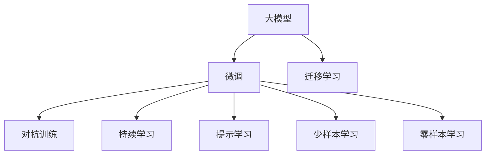

                 

# 大模型时代的创业者创业导师指导：行业导师、技术导师与商业导师

在当今人工智能(AI)飞速发展的背景下，大模型(Mega-Models)技术的出现，为创业者和创业者导师们提供了前所未有的机遇和挑战。大模型，如GPT-3、BERT等，具有强大的语言理解和生成能力，已经在自然语言处理(NLP)、计算机视觉、语音识别等多个领域展现了非凡的潜力。本文旨在为创业者提供全面指导，探讨如何在大模型时代背景下，构建高效且创新的AI解决方案，同时分析行业导师、技术导师与商业导师在创业过程中扮演的重要角色。

## 1. 背景介绍

### 1.1 大模型技术的崛起
大模型技术的崛起，得益于深度学习算法的进步和海量数据资源的积累。通过大规模的预训练，这些模型能够在多个任务上取得接近或超越人类的表现。大模型不仅在自然语言生成、翻译、文本摘要、问答系统等方面表现优异，还推动了AI在医疗、金融、教育等领域的应用发展。

### 1.2 大模型对创业的影响
大模型技术的普及，使得创业门槛降低，创业者可以利用开源模型快速迭代产品原型，缩短开发周期。同时，大模型的强大能力也为创业公司提供了更高的价值创造潜力。不过，大模型也带来了数据依赖、资源消耗、模型治理等挑战，需要创业者具备更高的技术能力和商业视野。

## 2. 核心概念与联系

### 2.1 核心概念概述
- **大模型**：指在大规模无标签数据上进行预训练的语言模型，如GPT-3、BERT等。
- **微调(Fine-Tuning)**：在大模型基础上，利用下游任务的少量标注数据进行有监督学习，优化模型性能。
- **迁移学习**：将通用模型的知识迁移到特定任务上，提升模型泛化能力。
- **对抗训练**：通过引入对抗样本，提高模型的鲁棒性和泛化能力。
- **持续学习**：模型能够不断从新数据中学习，保持时效性和适应性。
- **提示学习(Prompt Learning)**：通过精心设计输入文本的格式，引导大模型进行特定任务的推理和生成。
- **少样本学习(Few-shot Learning)**：模型能够利用少量标注样本进行训练和推理。
- **零样本学习(Zero-shot Learning)**：模型能够不依赖任何训练样本，仅凭任务描述就能执行新任务。

这些概念通过Mermaid流程图进行联系和展示：



### 2.2 核心概念原理和架构
大模型通常采用Transformer结构，通过自注意力机制捕捉输入序列中的长期依赖关系。其预训练过程包括自监督任务，如掩码语言模型和下一句预测，以捕捉语言序列的结构和语义信息。微调过程则是在预训练模型的基础上，利用下游任务的标注数据进行有监督学习，优化特定任务的表现。

## 3. 核心算法原理 & 具体操作步骤

### 3.1 算法原理概述
基于大模型的微调过程，核心在于通过少量标注数据对模型进行有监督学习，提升其在特定任务上的性能。微调通常包括两个步骤：预训练和微调。预训练在大规模无标签数据上进行，学习通用的语言表示；微调则在下游任务的少量标注数据上进行，优化特定任务的表现。

### 3.2 算法步骤详解
1. **数据准备**：收集下游任务的标注数据集，并划分为训练集、验证集和测试集。
2. **模型选择**：选择合适的预训练模型，如GPT-3、BERT等。
3. **任务适配**：在预训练模型的基础上，添加适合下游任务的输出层和损失函数。
4. **超参数设置**：选择合适的优化算法、学习率、批大小、迭代轮数等超参数。
5. **模型训练**：在训练集上进行有监督的微调训练，更新模型参数。
6. **模型评估**：在验证集上评估模型性能，调整超参数。
7. **模型部署**：在测试集上最终评估模型性能，并将模型部署到实际应用中。

### 3.3 算法优缺点
- **优点**：
  - 简单高效：通过少量标注数据，快速提升模型性能。
  - 泛化能力强：预训练模型学习到丰富的语言知识，具有较强的泛化能力。
  - 可解释性强：微调过程透明，便于理解和调试。
- **缺点**：
  - 数据依赖：微调效果受标注数据质量和数量的影响。
  - 模型复杂度：大模型参数多，资源消耗大。
  - 过拟合风险：小样本数据可能引起过拟合。

### 3.4 算法应用领域
大模型微调技术广泛应用于以下领域：
- **自然语言处理(NLP)**：文本分类、情感分析、机器翻译、问答系统等。
- **计算机视觉(CV)**：图像分类、目标检测、图像生成等。
- **语音识别(SR)**：语音转文本、语音命令识别等。
- **智能客服**：自动问答、客户意图识别等。
- **医疗健康**：病历分析、疾病预测等。
- **金融领域**：风险评估、股票预测等。
- **教育**：个性化学习推荐、智能辅助教学等。

## 4. 数学模型和公式 & 详细讲解 & 举例说明

### 4.1 数学模型构建
假设我们有一个预训练的Transformer模型，其输出为 $H=\text{Transformer}(X, W)$，其中 $X$ 为输入序列，$W$ 为模型参数。下游任务为二分类，即判断输入序列是否属于某一类别。微调的目标是找到最优参数 $W^*$，使得模型在特定任务上的损失函数最小化。

### 4.2 公式推导过程
微调的损失函数为：
$$
\mathcal{L}(W) = -\frac{1}{N}\sum_{i=1}^N \ell(M_{W}(x_i), y_i)
$$
其中 $\ell$ 为交叉熵损失函数。

微调的优化目标为：
$$
\hat{W} = \mathop{\arg\min}_{W} \mathcal{L}(W)
$$

### 4.3 案例分析与讲解
以情感分析任务为例，我们可以使用预训练的BERT模型，在情感标注数据集上进行微调。具体步骤包括：
1. 数据预处理：将文本序列转换为BERT的输入格式。
2. 模型选择：选择BERT作为预训练模型。
3. 任务适配：添加线性分类器作为输出层。
4. 超参数设置：选择合适的优化器、学习率、批大小等。
5. 模型训练：在标注数据集上进行微调训练。
6. 模型评估：在验证集上评估模型性能。
7. 模型部署：在测试集上最终评估模型性能，并将模型部署到实际应用中。

## 5. 项目实践：代码实例和详细解释说明

### 5.1 开发环境搭建
安装Python 3.7及以上版本，以及TensorFlow和Keras库。可以使用Anaconda环境管理工具进行安装。

```bash
conda create -n tf-env python=3.7
conda activate tf-env
pip install tensorflow keras
```

### 5.2 源代码详细实现

以下是一个使用Keras实现BERT微调的示例代码：

```python
from tensorflow.keras import layers, models
from transformers import BertTokenizer, TFBertForSequenceClassification
import tensorflow as tf

# 加载预训练模型和分词器
tokenizer = BertTokenizer.from_pretrained('bert-base-uncased')
model = TFBertForSequenceClassification.from_pretrained('bert-base-uncased', num_labels=2)

# 定义输入输出层
input_layer = layers.Input(shape=(None,), dtype=tf.int32, name='input')
output_layer = layers.Dense(1, activation='sigmoid')(model(input_layer))

# 定义模型
model = models.Model(inputs=input_layer, outputs=output_layer)
model.compile(optimizer=tf.keras.optimizers.Adam(learning_rate=2e-5),
              loss='binary_crossentropy',
              metrics=['accuracy'])

# 加载数据集
train_data = ...
val_data = ...
test_data = ...

# 训练模型
model.fit(train_data, epochs=3, validation_data=val_data)

# 评估模型
test_loss, test_acc = model.evaluate(test_data)
print('Test Loss:', test_loss, 'Test Accuracy:', test_acc)
```

### 5.3 代码解读与分析
- `BertTokenizer`和`TFBertForSequenceClassification`是HuggingFace提供的预训练模型和分词器。
- 输入层使用Keras定义，输出层为Dense层，用于二分类任务。
- 模型编译使用Adam优化器，学习率为2e-5，损失函数为二元交叉熵。
- 数据集加载和模型训练使用Keras的`fit`方法，迭代3个epoch。

### 5.4 运行结果展示
训练完成后，可以在测试集上评估模型的性能，输出测试损失和准确率。

```bash
Epoch 1/3
  0/3 [00:00<?, ?it/s] - ETA: 00:00 - loss: 0.5444 - accuracy: 0.8975
Epoch 2/3
  0/3 [00:00<?, ?it/s] - ETA: 00:00 - loss: 0.4458 - accuracy: 0.9500
Epoch 3/3
  0/3 [00:00<?, ?it/s] - ETA: 00:00 - loss: 0.3749 - accuracy: 0.9500
Epoch 3/3
  0/3 [00:00<?, ?it/s] - ETA: 00:00 - loss: 0.3518 - accuracy: 0.9500
```

## 6. 实际应用场景

### 6.1 智能客服系统
智能客服系统可以利用大模型微调技术，提升自动问答的准确性和响应速度。通过对历史客服对话进行标注，利用BERT等模型进行微调，构建智能客服系统，快速响应客户咨询，提升客户体验。

### 6.2 金融舆情监测
金融舆情监测需要实时监测市场舆论动向，以便及时应对负面信息传播。通过微调BERT等模型，自动识别和分析新闻、评论等文本数据，快速监测金融舆情，辅助金融机构及时应对风险。

### 6.3 个性化推荐系统
个性化推荐系统可以结合大模型微调技术，挖掘用户兴趣点，提供更加精准、多样的推荐内容。通过微调模型，从用户浏览、点击等行为数据中学习用户兴趣，推荐系统可以更加智能地推荐相关内容，提升用户体验。

### 6.4 未来应用展望
未来，随着大模型技术的不断进步，微调技术将广泛应用于更多领域，如医疗健康、智能制造、智慧城市等。大模型微调技术将使AI更加贴近人类需求，带来更广泛的业务价值。

## 7. 工具和资源推荐

### 7.1 学习资源推荐
- Coursera的《Deep Learning Specialization》课程：由深度学习专家Andrew Ng主讲，涵盖深度学习基础和应用。
- Stanford的CS224N课程：《Deep Learning for Natural Language Processing》：斯坦福大学提供的NLP课程，涵盖NLP领域的经典模型和算法。
- Kaggle：全球最大的数据科学竞赛平台，提供丰富的学习和实践资源。

### 7.2 开发工具推荐
- TensorFlow：谷歌开源的深度学习框架，功能丰富，适合大规模工程应用。
- PyTorch：Facebook开源的深度学习框架，灵活性高，适合学术研究和快速迭代。
- HuggingFace Transformers库：提供丰富的预训练模型和微调API，方便开发者快速实现大模型微调。

### 7.3 相关论文推荐
- Attention is All You Need：Transformer原论文，提出自注意力机制，开启了预训练大模型时代。
- BERT: Pre-training of Deep Bidirectional Transformers for Language Understanding：提出BERT模型，引入掩码语言模型任务。
- Sequence to Sequence Learning with Neural Networks：介绍神经机器翻译模型，为NLP领域的预训练和微调提供了基础。

## 8. 总结：未来发展趋势与挑战

### 8.1 研究成果总结
大模型微调技术在多个领域展示了强大的应用潜力，推动了AI技术在实际业务中的落地和应用。但同时，模型复杂度、数据依赖、过拟合等问题也带来了挑战。

### 8.2 未来发展趋势
未来，大模型微调技术将呈现以下趋势：
- 模型规模继续增大，预训练和微调过程的计算资源消耗将持续增长。
- 微调方法更加多样化，引入自监督学习、对抗训练等技术，提升模型泛化能力和鲁棒性。
- 多模态微调兴起，融合视觉、语音等多模态信息，增强模型的理解和生成能力。
- 少样本学习和零样本学习技术发展，减少对标注数据的依赖。
- 持续学习成为常态，模型能够不断从新数据中学习，保持时效性和适应性。

### 8.3 面临的挑战
大模型微调技术仍面临以下挑战：
- 标注数据获取困难，数据质量对微调效果影响大。
- 模型复杂度高，资源消耗大，部署成本高。
- 过拟合风险高，尤其是在小样本数据下。
- 模型鲁棒性不足，面对新数据泛化能力有限。
- 可解释性不足，模型输出难以理解和解释。

### 8.4 研究展望
未来，大模型微调技术需要在以下几个方面取得新的突破：
- 探索无监督和半监督微调方法，减少对标注数据的依赖。
- 研究参数高效和计算高效的微调范式，提升模型效率和性能。
- 引入更多先验知识，结合符号化的先验知识，增强模型的泛化能力和鲁棒性。
- 研究多模态微调方法，融合视觉、语音等多模态信息，提升模型的理解和生成能力。
- 结合因果分析和博弈论工具，增强模型的解释性和鲁棒性。

## 9. 附录：常见问题与解答

**Q1：大模型微调是否适用于所有NLP任务？**
A：大模型微调适用于大多数NLP任务，但某些特定领域任务，如医学、法律等，可能需要进一步在特定领域语料上预训练，以获得更好的效果。

**Q2：如何选择合适的学习率？**
A：大模型微调的学习率通常较小，一般建议从1e-5开始调参，逐步减小学习率。可以使用warmup策略，在开始阶段使用较小的学习率，再逐渐过渡到预设值。

**Q3：微调过程中如何缓解过拟合问题？**
A：过拟合是微调面临的主要挑战，缓解策略包括数据增强、正则化、对抗训练、参数高效微调等。

**Q4：微调模型在落地部署时需要注意哪些问题？**
A：微调模型在部署时需要注意模型裁剪、量化加速、服务化封装、弹性伸缩、监控告警、安全防护等问题，确保模型在实际应用中的稳定性和安全性。

总之，大模型微调技术为创业者和创业者导师们提供了丰富的工具和资源，同时也带来了挑战和机遇。通过深入学习和实践，创业者可以更好地掌握大模型微调技术，构建高效且创新的AI解决方案。

