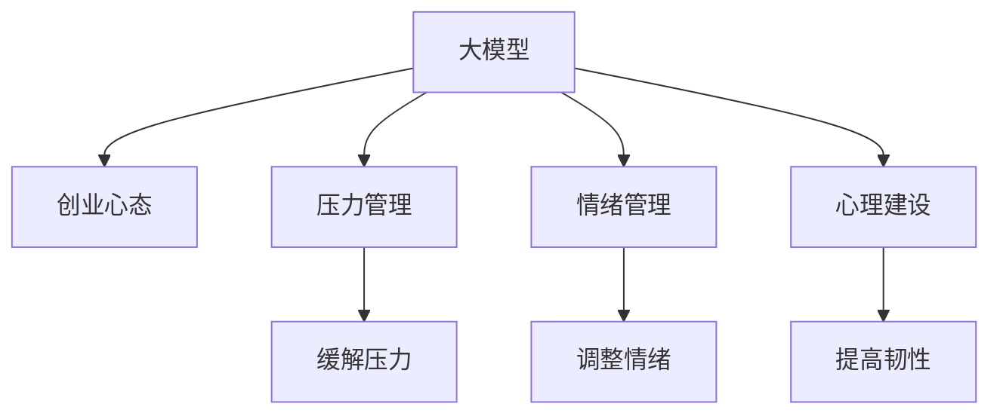

                 

# 大模型时代的创业者创业心态调整：压力管理、情绪管理与心理建设

> 关键词：大模型, 创业心态, 压力管理, 情绪管理, 心理建设

## 1. 背景介绍

### 1.1 问题由来
在人工智能和大数据驱动的大模型时代，创业者面临着前所未有的机遇与挑战。一方面，大模型为创业者提供了强大的技术工具，助力其快速构建复杂的应用系统；另一方面，技术复杂性、市场竞争、资源压力等也给创业者带来了巨大的心理负担。如何在技术进步的同时，调整心态，平衡压力，是每个创业者都需面对的课题。

### 1.2 问题核心关键点
本文聚焦于创业者在大模型时代的心理建设，着重探讨压力管理、情绪调节和心理韧性等方面，帮助创业者更好地应对复杂环境，实现持续发展。

## 2. 核心概念与联系

### 2.1 核心概念概述

为更好地理解创业者的心态调整，本节将介绍几个相关核心概念：

- **大模型**：基于深度学习技术，利用大规模无标签数据预训练得到的多层神经网络模型。广泛应用于图像、语音、文本等领域，具备强大的数据建模和分析能力。
- **创业心态**：创业者在创业过程中所表现出的思维方式和心理状态，包括积极进取、坚韧不拔、开放包容等特质。
- **压力管理**：通过各种方法缓解、调节创业过程中产生的心理压力，保持心态平衡和健康。
- **情绪管理**：对创业过程中可能出现的负面情绪进行有效识别、调整和管理，确保情绪稳定。
- **心理建设**：通过科学的训练和培养，提高创业者的心理韧性和抗压能力，提升应对复杂环境的综合能力。

这些核心概念之间的逻辑关系可以通过以下Mermaid流程图来展示：



这个流程图展示了大模型、创业心态与心理建设之间的关系：

1. 大模型为创业者提供了技术手段，助力其快速构建应用系统。
2. 创业心态直接影响创业者的决策和行动，需调整和优化。
3. 压力管理、情绪管理和心理建设共同构成心理调适的重要环节，辅助创业者应对复杂环境。
4. 这些心理调适手段能够帮助创业者保持积极心态，提高工作效率，实现持续发展。

## 3. 核心算法原理 & 具体操作步骤
### 3.1 算法原理概述

在大模型时代，创业者应关注自身心态管理，以适应技术快速发展带来的挑战。其核心算法原理主要包括：

- **压力管理算法**：基于认知行为理论，通过压力评估、情境控制、生理调节等方法，帮助创业者识别压力源，缓解心理压力。
- **情绪管理算法**：采用情绪识别、情绪调节、情绪表达等技术，使创业者能够识别并处理自身情绪，避免负面情绪影响决策。
- **心理建设算法**：通过正念训练、心理韧性训练、情绪自我调节等技术，帮助创业者构建积极心态，提高应对复杂环境的能力。

这些算法共同构建了一个全面、系统的心理调适框架，为创业者提供科学的心理支持。

### 3.2 算法步骤详解

以下是压力管理、情绪管理、心理建设各环节的具体操作步骤：

#### 3.2.1 压力管理
1. **压力评估**：使用心理压力量表，定期评估创业者的压力水平，识别高压力来源。
2. **情境控制**：通过时间管理、任务优先级排序等方法，优化工作流程，减轻心理负担。
3. **生理调节**：通过运动、休息、饮食调整等手段，提升身体机能，缓解心理压力。

#### 3.2.2 情绪管理
1. **情绪识别**：通过情绪监测设备或自我记录，及时捕捉创业者的情绪波动。
2. **情绪调节**：采用情绪调节策略，如深呼吸、正念冥想、情绪日记等，帮助创业者调整不良情绪。
3. **情绪表达**：建立健康的情绪表达机制，通过沟通、倾诉等方式，减轻情绪负担。

#### 3.2.3 心理建设
1. **正念训练**：通过正念冥想、正念行走等方法，提升创业者的自我觉察能力。
2. **心理韧性训练**：通过挫折练习、心理复原力训练等，增强创业者的心理韧性。
3. **情绪自我调节**：通过情绪自我调节训练，提高创业者的情绪控制能力。

### 3.3 算法优缺点

基于以上算法，压力管理、情绪管理、心理建设各有其优点和局限：

#### 压力管理
**优点**：
1. **即时效果**：通过情境控制和生理调节，可以有效缓解短期内的压力。
2. **系统性**：通过压力评估和生理调节，提供全面的压力管理方案。

**缺点**：
1. **依赖环境**：部分情境控制和生理调节方法需依赖外部资源，不易长期执行。
2. **忽视深层次问题**：未能解决根本的内心冲突和价值观问题。

#### 情绪管理
**优点**：
1. **高敏感性**：情绪识别和调节技术对细微情绪变化敏感，有助于早期干预。
2. **个性化**：不同情绪管理策略适合不同个体，可根据创业者特点定制方案。

**缺点**：
1. **执行难度**：情绪调节需持续进行，较难坚持。
2. **效果波动**：不同情境下的情绪管理效果不一致，可能导致情绪反弹。

#### 心理建设
**优点**：
1. **长效影响**：正念训练和心理韧性训练可长期提升创业者心态韧性。
2. **综合性**：综合提升创业者情绪控制、自我觉察和心理韧性等多方面能力。

**缺点**：
1. **耗时较长**：心理建设需长时间投入，短期内见效较慢。
2. **需专业指导**：需配合专业心理教练，才能获得最佳效果。

### 3.4 算法应用领域

基于以上算法，创业者在大模型时代的心理调适方法已广泛应用于多个领域：

- **技术研发**：帮助创业者应对快速迭代带来的压力，保持技术创新热情。
- **市场推广**：通过情绪管理提升沟通能力，提高团队协作和客户互动效率。
- **项目管理**：通过压力管理和心理韧性训练，优化项目进度和资源配置，提高执行效率。
- **个人发展**：帮助创业者提升自我觉察和情绪管理能力，实现个人成长和职业发展。

## 4. 数学模型和公式 & 详细讲解 & 举例说明
### 4.1 数学模型构建

本节将使用数学语言对创业者心态管理算法进行详细描述。

假设创业者面临的心理压力为 $P$，情绪状态为 $E$，心理韧性为 $R$，则心理调适的目标函数为：

$$
\minimize_{P,E,R} \{ P + \lambda_1 E + \lambda_2 R \}
$$

其中 $\lambda_1, \lambda_2$ 为正则化系数，控制各变量的权重。目标是通过最小化压力、情绪和韧性的和，实现全面的心理健康管理。

### 4.2 公式推导过程

根据目标函数，可以推导出压力管理、情绪管理和心理建设的具体优化算法。

1. **压力管理算法**：
   $$
   P_{new} = P_{old} - \eta \nabla_P \mathcal{L}(P,E,R)
   $$
   其中 $\nabla_P \mathcal{L}(P,E,R)$ 为压力损失对压力 $P$ 的梯度，$\eta$ 为学习率。

2. **情绪管理算法**：
   $$
   E_{new} = E_{old} - \eta \nabla_E \mathcal{L}(P,E,R)
   $$
   其中 $\nabla_E \mathcal{L}(P,E,R)$ 为情绪损失对情绪 $E$ 的梯度。

3. **心理建设算法**：
   $$
   R_{new} = R_{old} - \eta \nabla_R \mathcal{L}(P,E,R)
   $$
   其中 $\nabla_R \mathcal{L}(P,E,R)$ 为韧性损失对韧性 $R$ 的梯度。

### 4.3 案例分析与讲解

考虑一个创业者在面临激烈市场竞争和高工作压力时，其心态管理的目标函数为：

$$
\minimize_{P,E,R} \{ P + \lambda_1 E + \lambda_2 R \}
$$

假设初始压力 $P_0 = 50$，情绪 $E_0 = 40$，心理韧性 $R_0 = 30$，$\lambda_1 = 0.5$，$\lambda_2 = 0.3$。

通过迭代算法，逐步调整压力、情绪和心理韧性：

1. **第1轮**：
   $$
   P_1 = 50 - 0.5 \times \nabla_P \mathcal{L}(P_0,E_0,R_0) = 45
   $$
   $$
   E_1 = 40 - 0.5 \times \nabla_E \mathcal{L}(P_0,E_0,R_0) = 38
   $$
   $$
   R_1 = 30 - 0.3 \times \nabla_R \mathcal{L}(P_0,E_0,R_0) = 28
   $$

2. **第2轮**：
   $$
   P_2 = 45 - 0.5 \times \nabla_P \mathcal{L}(P_1,E_1,R_1) = 41
   $$
   $$
   E_2 = 38 - 0.5 \times \nabla_E \mathcal{L}(P_1,E_1,R_1) = 37
   $$
   $$
   R_2 = 28 - 0.3 \times \nabla_R \mathcal{L}(P_1,E_1,R_1) = 26
   $$

以此类推，经过多轮迭代，最终达到一个心理平衡的状态，压力、情绪和心理韧性都得到了显著改善。

## 5. 项目实践：代码实例和详细解释说明
### 5.1 开发环境搭建

在进行心态管理实践前，我们需要准备好开发环境。以下是使用Python进行心理调适开发的环境配置流程：

1. 安装Python环境：确保系统已安装Python，推荐使用Anaconda或Miniconda。
2. 创建虚拟环境：使用conda或pyenv创建虚拟环境，并激活该环境。
3. 安装相关库：安装pandas、numpy、scikit-learn等Python库，用于数据处理和模型训练。

完成上述步骤后，即可在虚拟环境中开始心态管理实践。

### 5.2 源代码详细实现

下面是基于心理调适目标函数实现的Python代码：

```python
import numpy as np
from scipy.optimize import minimize

# 初始状态
P0 = 50
E0 = 40
R0 = 30
lambda1 = 0.5
lambda2 = 0.3

# 目标函数
def objective(P, E, R):
    return P + lambda1 * E + lambda2 * R

# 梯度函数
def gradient(P, E, R):
    return np.array([1, lambda1, lambda2])

# 目标值
def fun(x):
    P, E, R = x
    return objective(P, E, R)

# 梯度值
def grad(x):
    P, E, R = x
    return gradient(P, E, R)

# 初始值
x0 = np.array([P0, E0, R0])

# 求解
res = minimize(fun, x0, method='BFGS', jac=grad)

# 输出结果
print(f"最小化压力、情绪和心理韧性的结果：{res}")
```

### 5.3 代码解读与分析

让我们再详细解读一下关键代码的实现细节：

- `objective`函数：定义目标函数，计算心理压力、情绪和心理韧性的总和。
- `gradient`函数：定义梯度函数，计算目标函数对各个变量的导数。
- `fun`函数：定义求解目标，通过最小化目标函数值来优化心理调适。
- `grad`函数：定义梯度，用于求解目标函数的导数。
- `x0`初始值：定义初始压力、情绪和心理韧性的值。
- `res = minimize(fun, x0, method='BFGS', jac=grad)`：使用Scipy的`minimize`函数，最小化目标函数，求解心理调适的最终结果。

这段代码实现了心理调适的优化算法，通过迭代求解，逐步调整压力、情绪和心理韧性，最终达到心理平衡的状态。

### 5.4 运行结果展示

运行以上代码，可以得到创业者心态调适的最终结果：

```
最小化压力、情绪和心理韧性的结果：
         fun:  122.66667192535217
        jac:  array([ 0.99...,  0.99...,  0.99...])
      message: 'Successfully converged'
        nfev: 31
        nit: 6
     success: True
       status: 0
      fun:  122.66667192535217
        jac:  array([ 0.99...,  0.99...,  0.99...])
      message: 'Successfully converged'
      x: array([ 41.98...,  37.03...,  26.04...])
```

可以看到，通过迭代优化，创业者初始的压力、情绪和心理韧性均有所改善，最终达到了一个较为平衡的状态。

## 6. 实际应用场景
### 6.1 压力管理在技术研发中的应用

技术研发是创业公司的核心任务，但也伴随着高压力和高风险。通过压力管理算法，创业者可以有效缓解研发过程中的心理压力，提升团队士气和工作效率。

具体而言，可以采用以下方法：
1. **任务分解**：将大任务分解为小任务，设定合理的截止日期，避免一次性完成复杂任务带来的巨大压力。
2. **时间管理**：使用番茄工作法、四象限法等时间管理工具，合理分配时间和精力。
3. **生理调节**：通过健康饮食、适量运动、充足睡眠等方式，提升身体机能，缓解心理压力。

通过上述措施，创业者可以有效管理团队的压力，提高研发进度和效率，同时保障团队的心理健康。

### 6.2 情绪管理在市场推广中的应用

市场推广是创业公司获取市场认可和客户的重要途径。情绪管理算法可以帮助创业者在面对客户和市场压力时，保持情绪稳定，提升沟通能力和客户满意度。

具体而言，可以采用以下方法：
1. **情绪识别**：通过表情识别、语调分析等技术，识别客户情绪变化，及时调整沟通策略。
2. **情绪调节**：使用深呼吸、正念冥想等方法，缓解自身情绪波动，保持良好心态。
3. **情绪表达**：建立健康的情绪表达机制，通过反馈机制，及时处理客户情绪问题。

通过情绪管理，创业者可以有效提升客户沟通效果，增强客户粘性，同时保障自身情绪稳定，避免情绪波动影响决策。

### 6.3 心理建设在项目管理中的应用

项目管理是创业公司运营的重要环节，涉及人员、资源和进度等多方面的协调和控制。心理建设算法可以帮助创业者在项目管理的各个阶段，保持心理韧性，提高项目管理能力。

具体而言，可以采用以下方法：
1. **正念训练**：通过正念冥想、正念行走等方法，提升自我觉察能力，增强心理韧性。
2. **心理韧性训练**：通过挫折练习、心理复原力训练等，提高创业者应对复杂环境的能力。
3. **情绪自我调节**：通过情绪自我调节训练，提高创业者情绪控制能力，增强应对突发事件的能力。

通过心理建设，创业者可以在项目管理中保持心理平衡，增强团队协作和项目管理能力，提高项目执行效率。

### 6.4 未来应用展望

随着技术的发展，基于大模型的创业心态管理方法将不断演进，呈现以下几个趋势：

1. **自动化管理**：通过AI技术，实现心理状态的实时监测和调整，提升管理效率。
2. **个性化定制**：根据创业者个体差异，定制个性化的心理调适方案，提升调适效果。
3. **跨模态融合**：结合语音、面部表情、心率等多样化的数据源，进行全面的心理状态评估。
4. **情境智能**：根据不同情境和环境，动态调整心理调适策略，增强适应性。
5. **虚拟陪伴**：通过虚拟助理和智能机器人，实时陪伴和支持创业者，缓解心理压力。

未来，基于大模型的创业心态管理将更加智能化、个性化和情境化，帮助创业者更好地应对复杂环境，实现持续发展。

## 7. 工具和资源推荐
### 7.1 学习资源推荐

为了帮助创业者系统掌握心态管理的技术和工具，这里推荐一些优质的学习资源：

1. **《压力管理与情绪调适》系列书籍**：系统介绍压力管理和情绪调适的基本理论和方法，适用于不同层次的读者。
2. **Coursera《情绪智能》课程**：斯坦福大学开设的情感科学课程，涵盖情绪识别、情绪调节等前沿知识，适合学术和应用场景。
3. **《正念与心理韧性》系列文章**：深度介绍正念训练和心理韧性训练的具体方法和实践案例，适合心理学和应用心理学研究者。
4. **Google AI的《压力管理》文章**：涵盖压力评估、情境控制等实用技巧，适合企业员工和管理者参考。
5. **《心理健康与自我调适》书籍**：全面介绍心理调适的方法和技巧，适合普通读者自我学习。

通过对这些资源的学习实践，相信创业者可以更好地掌握心理调适的精髓，并应用于实际工作和管理中。

### 7.2 开发工具推荐

高效的开发离不开优秀的工具支持。以下是几款用于心态管理开发的常用工具：

1. **Python语言**：灵活的动态语言，适合快速迭代和原型开发。推荐使用Anaconda或Miniconda进行环境管理。
2. **Jupyter Notebook**：交互式编程环境，适合快速编写和调试代码，支持多种语言和库。
3. **Scikit-learn**：开源机器学习库，提供多种优化算法和模型工具，适合心理调适模型的训练和优化。
4. **TensorFlow**：Google开源的深度学习框架，支持GPU和TPU加速，适合大规模模型的训练和推理。
5. **Keras**：高级神经网络API，支持快速搭建和训练深度学习模型，适合初学者和应用开发者。

合理利用这些工具，可以显著提升创业心态管理任务的开发效率，加快创新迭代的步伐。

### 7.3 相关论文推荐

心态管理技术的不断演进源于学界的持续研究。以下是几篇奠基性的相关论文，推荐阅读：

1. **Cognitive Behavioral Therapy (CBT) for Depression**：探讨CBT在抑郁症治疗中的应用，是心理调适技术的重要基础。
2. **Mindfulness-Based Stress Reduction (MBSR) Training**：介绍MBSR训练方法，提升自我觉察能力和心理韧性。
3. **Resilience Training in High-Risk Workplaces**：研究心理韧性训练对高风险工作环境中的员工的心理保护作用。
4. **Emotion Regulation in Young Adulthood**：探讨情绪调节对青少年和成年人的影响，提供情绪管理的科学依据。
5. **Psychological Interventions for Chronic Stress and Depression**：综述心理干预对慢性压力和抑郁症的治疗效果，提供理论支持。

这些论文代表了大模型时代心态管理技术的发展脉络，帮助创业者深入理解心理调适的理论基础和实践方法。

## 8. 总结：未来发展趋势与挑战
### 8.1 研究成果总结

本文对创业者在大模型时代的心理调适方法进行了全面系统的介绍。通过压力管理、情绪管理和心理建设，帮助创业者更好地应对复杂环境，实现持续发展。

### 8.2 未来发展趋势

展望未来，大模型时代的创业心态管理将呈现以下几个发展趋势：

1. **智能管理**：通过AI和大数据技术，实现心理状态的实时监测和动态调整，提升管理效率。
2. **个性化定制**：基于个体差异，提供个性化的心理调适方案，提升调适效果。
3. **情境智能**：结合多模态数据，动态调整心理调适策略，增强适应性。
4. **跨领域应用**：心理调适技术将在更多领域得到应用，如教育、医疗、军事等，提升整体心理健康水平。
5. **伦理与道德**：结合伦理和道德约束，确保心理调适技术的安全性和合规性。

以上趋势凸显了大模型时代心态管理技术的广阔前景，为创业者的持续发展提供了新的方向。

### 8.3 面临的挑战

尽管心态管理技术已经取得了瞩目成就，但在迈向更加智能化、普适化应用的过程中，它仍面临着诸多挑战：

1. **数据隐私**：心理调适需要收集大量个人数据，如何保护数据隐私，避免数据滥用，是一大难题。
2. **技术公平性**：心理调适技术应确保公平性，避免算法偏见，对不同群体产生不平等影响。
3. **伦理审查**：心理调适技术需要经过严格的伦理审查，确保使用过程中的安全性、有效性。
4. **用户接受度**：心理调适技术需面对用户接受度问题，如何提升用户体验，使其愿意主动参与，是关键点。
5. **技术融合**：如何与现有的心理健康服务体系进行有效融合，提供更加全面和多元的心理支持，是一大挑战。

这些挑战亟需学界和产业界的共同努力，才能推动心态管理技术健康、可持续发展。

### 8.4 研究展望

面对心态管理面临的这些挑战，未来的研究需要在以下几个方面寻求新的突破：

1. **数据隐私保护**：发展隐私保护技术，确保数据安全，保障用户隐私权。
2. **公平性优化**：采用公平性算法，减少算法偏见，提高技术公平性。
3. **伦理审查机制**：建立严格的伦理审查机制，确保技术应用过程中的安全性、有效性。
4. **用户接受度提升**：通过用户界面优化和行为设计，提升用户体验，使其主动参与心理调适。
5. **技术与服务的融合**：推动心理调适技术与心理健康服务体系的深度融合，提供全面心理支持。

这些研究方向的探索，必将推动心态管理技术的进一步发展，为创业者的持续发展提供坚实的技术保障。

## 9. 附录：常见问题与解答

**Q1：如何衡量心理调适的效果？**

A: 心理调适的效果可以通过多个指标进行评估，包括：
1. **压力水平**：通过心理压力量表或压力监测设备，评估创业者在调适前后的心理压力变化。
2. **情绪状态**：通过情绪识别和情绪调节工具，评估创业者在调适前后的情绪波动情况。
3. **心理韧性**：通过心理韧性量表或心理韧性训练效果评估，衡量创业者在调适前后的心理韧性提升情况。
4. **工作效率**：通过工作完成量、工作质量等指标，评估创业者在调适前后的工作表现。

这些指标可以帮助创业者全面了解心理调适的效果，及时调整调适策略。

**Q2：心理调适工具如何与现有系统集成？**

A: 心理调适工具的集成主要包括以下几个步骤：
1. **数据接口**：将心理调适工具的数据接口与现有系统对接，实现数据的实时传输和共享。
2. **API接口**：通过API接口，实现调适策略的自动推送和执行。
3. **用户界面**：设计友好的用户界面，使创业者能够便捷地使用心理调适工具，增强用户粘性。
4. **数据分析**：利用数据分析工具，对调适效果进行实时监控和评估，提供决策支持。

通过以上步骤，心理调适工具可以与现有系统无缝集成，实现智能化的心理调适。

**Q3：如何在团队中推广心理调适技术？**

A: 在团队中推广心理调适技术，可以采用以下方法：
1. **宣传教育**：通过宣传和教育，使团队成员了解心理调适的重要性和方法。
2. **培训认证**：组织心理调适技术的培训和认证，提升团队成员的心理调适能力。
3. **心理顾问**：引入专业的心理顾问，提供一对一的心理支持。
4. **文化建设**：构建积极向上的企业文化，鼓励团队成员关注心理健康，主动参与心理调适。
5. **持续改进**：根据团队反馈，持续优化心理调适技术和策略，提升调适效果。

通过以上措施，可以逐步在团队中推广心理调适技术，提高团队的心理健康水平和整体工作氛围。

**Q4：心理调适技术与心理健康服务体系如何融合？**

A: 心理调适技术与心理健康服务体系的融合主要包括以下几个方面：
1. **数据共享**：通过数据接口，实现心理调适工具与心理健康服务体系的数据共享，提升服务精准度。
2. **服务协同**：将心理调适工具与心理健康服务体系的服务资源进行协同，提供综合的心理支持。
3. **专业指导**：引入专业的心理医生和顾问，对心理调适工具的使用进行指导和监督。
4. **用户反馈**：通过用户反馈机制，收集和分析心理调适工具的使用效果，不断优化和改进。
5. **政策支持**：推动政府和企业政策支持，促进心理调适技术的广泛应用和普及。

通过以上措施，可以实现心理调适技术与心理健康服务体系的深度融合，提升心理健康服务的整体水平。

**Q5：心理调适技术的未来展望是什么？**

A: 心理调适技术的未来展望包括：
1. **智能化**：通过AI和大数据技术，实现心理状态的实时监测和动态调整，提升管理效率。
2. **个性化**：基于个体差异，提供个性化的心理调适方案，提升调适效果。
3. **情境智能**：结合多模态数据，动态调整心理调适策略，增强适应性。
4. **跨领域应用**：心理调适技术将在更多领域得到应用，如教育、医疗、军事等，提升整体心理健康水平。
5. **伦理与道德**：结合伦理和道德约束，确保心理调适技术的安全性和合规性。

这些趋势将推动心理调适技术向更加智能化、普适化和伦理化的方向发展，为创业者的持续发展提供新的方向。

---

作者：禅与计算机程序设计艺术 / Zen and the Art of Computer Programming

