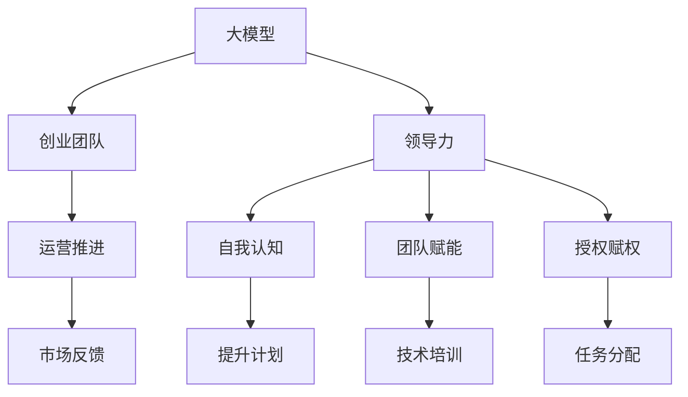

                 

# 大模型时代的创业者领导力培养：自我认知、赋能与授权

> 关键词：大模型, 创业, 领导力, 自我认知, 赋能, 授权

## 1. 背景介绍

### 1.1 问题由来
随着人工智能技术的迅猛发展，尤其是大模型（Large Models）的崛起，创业公司迎来了前所未有的机遇与挑战。一方面，大模型强大的语言理解与生成能力，有望赋能企业开发出高效、智能的NLP应用，大幅提升运营效率与用户体验。另一方面，大模型构建与应用的复杂性，也要求创业者具备更强的技术背景与战略视野。

在这一背景下，创业者如何有效培养自己的领导力，利用大模型的力量赋能团队，实现企业长远发展，成为一个亟待探讨的话题。本文将从领导力培养的角度出发，结合大模型技术的发展趋势，探讨创业者如何在自我认知、赋能与授权的过程中，构建团队的核心竞争力。

### 1.2 问题核心关键点
创业者在大模型时代的领导力培养，涉及以下关键点：
1. **自我认知**：明确自身在大模型技术方面的优势与不足，制定合理的学习与提升计划。
2. **团队赋能**：通过技术培训与项目实践，提升团队成员的技术能力与创新思维。
3. **授权赋权**：在明确团队成员角色与能力的基础上，合理分配任务与资源，实现团队协作与共同成长。

本文将围绕这三个关键点，深入探讨大模型时代创业者领导力的培养策略与实践路径。

### 1.3 问题研究意义
在大模型时代的背景下，创业者领导力的培养不仅关乎企业的短期运营，更关乎企业的长期竞争力与创新能力。通过提升创业者的领导力，可以有效推动企业在大模型应用中的技术突破与业务创新，增强企业的市场竞争力与客户满意度。

本文的研究将帮助创业者更好地理解大模型技术的发展趋势与实施细节，通过自我认知、赋能与授权的策略，实现团队与企业的全面发展。

## 2. 核心概念与联系

### 2.1 核心概念概述

在大模型时代，创业者领导力的培养涉及多个核心概念，包括：

- **大模型（Large Models）**：指基于大规模深度学习模型（如BERT、GPT等）构建的自然语言处理模型，具有强大的语言理解与生成能力。
- **创业团队（创业公司）**：由创业者及其核心团队成员组成，致力于开发与部署大模型应用的企业。
- **领导力（Leadership）**：指创业者在企业发展中，通过技术、战略与情感的引导，带领团队实现目标的能力。
- **自我认知（Self-Awareness）**：指创业者对自己在大模型技术方面的优势与不足的明确认识。
- **团队赋能（Team Empowerment）**：指通过培训与实践，提升团队成员的技术能力与创新思维。
- **授权赋权（Delegation）**：指在明确团队成员角色与能力的基础上，合理分配任务与资源，实现团队协作与共同成长。

这些核心概念之间的逻辑关系可以通过以下Mermaid流程图来展示：



这个流程图展示了大模型时代创业者领导力培养的核心路径：

1. 通过大模型赋能创业团队。
2. 构建领导力，并通过自我认知、团队赋能与授权赋权三个关键维度来实现。
3. 在市场反馈的驱动下，不断优化团队与企业的运营效率与创新能力。

## 3. 核心算法原理 & 具体操作步骤
### 3.1 算法原理概述

大模型时代的创业者领导力培养，涉及多个关键算法与操作步骤。这些算法与操作步骤相互关联，共同构建了一个系统化的培养框架。

### 3.2 算法步骤详解

**Step 1: 自我认知**

1. **评估自身能力**：创业者应通过编程练习、项目实战等方式，评估自身在大模型技术方面的熟练程度与创新能力。
2. **识别技术缺口**：通过与行业专家交流、在线课程学习等方式，识别自身在大模型应用中的不足之处。
3. **制定提升计划**：根据自身评估结果与技术缺口，制定详细、可执行的提升计划，包括技术学习路线与实战项目。

**Step 2: 团队赋能**

1. **技术培训**：组织团队成员参加线上或线下的技术培训课程，如Coursera、Udacity等平台上的深度学习与NLP课程。
2. **实战项目**：安排团队成员参与实际项目，通过实践提升其大模型应用能力。
3. **知识共享**：定期组织技术分享会，鼓励团队成员分享项目经验与学习心得，促进知识交流与创新思维的碰撞。

**Step 3: 授权赋权**

1. **明确角色与职责**：根据团队成员的技术能力与兴趣点，明确其在大模型项目中的具体角色与职责。
2. **合理分配任务**：根据团队成员的角色与职责，合理分配项目任务，确保每个成员都能在项目中发挥其最大价值。
3. **激励与反馈**：通过绩效评估与激励机制，鼓励团队成员积极参与项目，并在项目过程中给予及时反馈与指导。

### 3.3 算法优缺点

大模型时代创业者领导力的培养，具有以下优点：

- **技术赋能**：通过系统化的技术培训与实战项目，有效提升团队成员的技术能力与创新思维，增强企业的核心竞争力。
- **目标明确**：通过自我认知、团队赋能与授权赋权的策略，明确团队成员的角色与职责，实现高效协作与共同成长。
- **持续改进**：在市场反馈的驱动下，持续优化团队与企业的运营效率与创新能力，确保企业的可持续发展。

同时，该方法也存在一定的局限性：

- **实施难度**：系统化的领导力培养需要耗费大量时间与资源，对于创业初期企业可能存在压力。
- **团队异质性**：不同团队成员的技术背景与学习能力存在差异，需要根据具体情况进行个性化培养。
- **风险管理**：在授权赋权过程中，需要合理控制风险，确保团队成员能够在项目中发挥其最大潜力，同时避免过度依赖个体能力。

尽管存在这些局限性，但就目前而言，系统化的领导力培养方法仍是大模型时代企业发展的核心。未来相关研究的重点在于如何进一步降低实施难度，提高团队异质性下的技术协同，以及如何通过激励机制来最大化团队成员的潜力。

### 3.4 算法应用领域

大模型时代创业者领导力的培养方法，适用于各种规模与类型的创业企业。在NLP、智能客服、金融分析、医疗咨询等多个领域，通过系统化的领导力培养，企业能够快速开发并部署大模型应用，提升运营效率与用户满意度。

## 4. 数学模型和公式 & 详细讲解 & 举例说明

### 4.1 数学模型构建

在大模型时代，创业者领导力的培养涉及多个数学模型与公式，包括：

- **自我评估模型**：用于评估创业者在大模型技术方面的熟练程度，公式如下：

  $$
  \text{评估得分} = \alpha \times \text{编程练习得分} + \beta \times \text{项目实战得分}
  $$

  其中，$\alpha$ 和 $\beta$ 为不同评估维度（如编程熟练度与项目实战能力）的权重。

- **技术缺口分析模型**：用于识别创业者在大模型应用中的不足之处，公式如下：

  $$
  \text{技术缺口} = \max(0, \text{理想得分} - \text{实际得分})
  $$

  其中，理想得分与实际得分分别为通过专家评估或在线课程测试得出的理想水平与实际水平。

- **任务分配模型**：用于合理分配项目任务，公式如下：

  $$
  \text{任务分配} = \text{团队成员能力} \times \text{项目需求} \times \text{资源可用性}
  $$

  其中，团队成员能力、项目需求与资源可用性为任务分配的关键因素。

### 4.2 公式推导过程

以自我评估模型为例，推导其计算过程：

设创业者在编程练习与项目实战中的得分分别为 $P$ 与 $R$，假设 $\alpha$ 与 $\beta$ 分别为编程熟练度与项目实战能力的权重。则自我评估得分为：

$$
\text{评估得分} = \alpha \times \text{编程练习得分} + \beta \times \text{项目实战得分} = \alpha P + \beta R
$$

通过调整 $\alpha$ 与 $\beta$ 的值，可以控制不同评估维度对总评分的贡献度。例如，若 $\alpha = 0.7$，$\beta = 0.3$，则编程练习对总评分的贡献度为70%，项目实战为30%。

### 4.3 案例分析与讲解

假设某创业公司需要开发智能客服系统，公司领导者A通过以下步骤进行自我评估与团队赋能：

1. **自我评估**：领导者A在编程练习中得分为85分，项目实战中得分为90分，假设 $\alpha = 0.7$，$\beta = 0.3$，则其自我评估得分为：

  $$
  \text{评估得分} = 0.7 \times 85 + 0.3 \times 90 = 87.5
  $$

2. **技术缺口分析**：通过专家评估，领导者在某些NLP技术（如情感分析、意图识别）方面的得分较低，假设理想得分为90分，则其技术缺口为：

  $$
  \text{技术缺口} = \max(0, 90 - 87.5) = 2.5
  $$

3. **团队赋能**：领导者A安排团队成员参与情感分析与意图识别相关课程的培训，并提供实战项目（如构建情感分析模型、意图识别系统），提升其技术能力。

4. **任务分配**：根据团队成员的技术能力与项目需求，领导者A分配如下任务：
  - 成员B：情感分析模型的开发
  - 成员C：意图识别系统的构建
  - 领导者A：项目整体协调与技术指导

通过系统化的评估、培训与任务分配，领导者A有效地提升了团队的技术能力与创新思维，增强了企业的核心竞争力。

## 5. 项目实践：代码实例和详细解释说明

### 5.1 开发环境搭建

在进行大模型技术培训与实战项目开发前，我们需要准备好开发环境。以下是使用Python进行PyTorch开发的环境配置流程：

1. 安装Anaconda：从官网下载并安装Anaconda，用于创建独立的Python环境。

2. 创建并激活虚拟环境：
```bash
conda create -n pytorch-env python=3.8 
conda activate pytorch-env
```

3. 安装PyTorch：根据CUDA版本，从官网获取对应的安装命令。例如：
```bash
conda install pytorch torchvision torchaudio cudatoolkit=11.1 -c pytorch -c conda-forge
```

4. 安装Transformers库：
```bash
pip install transformers
```

5. 安装各类工具包：
```bash
pip install numpy pandas scikit-learn matplotlib tqdm jupyter notebook ipython
```

完成上述步骤后，即可在`pytorch-env`环境中开始大模型技术培训与实战项目开发。

### 5.2 源代码详细实现

下面以情感分析项目为例，给出使用Transformers库进行大模型微调的PyTorch代码实现。

首先，定义情感分析任务的数据处理函数：

```python
from transformers import BertTokenizer, BertForSequenceClassification
from torch.utils.data import Dataset
import torch

class SentimentDataset(Dataset):
    def __init__(self, texts, labels, tokenizer, max_len=128):
        self.texts = texts
        self.labels = labels
        self.tokenizer = tokenizer
        self.max_len = max_len
        
    def __len__(self):
        return len(self.texts)
    
    def __getitem__(self, item):
        text = self.texts[item]
        label = self.labels[item]
        
        encoding = self.tokenizer(text, return_tensors='pt', max_length=self.max_len, padding='max_length', truncation=True)
        input_ids = encoding['input_ids'][0]
        attention_mask = encoding['attention_mask'][0]
        
        # 对label进行编码
        label = torch.tensor(label, dtype=torch.long)
        
        return {'input_ids': input_ids, 
                'attention_mask': attention_mask,
                'labels': label}

# 加载BERT模型
tokenizer = BertTokenizer.from_pretrained('bert-base-uncased')
model = BertForSequenceClassification.from_pretrained('bert-base-uncased', num_labels=2)

# 准备数据集
texts = ["I love this product!", "This is the worst product I've ever used."]
labels = [1, 0]
dataset = SentimentDataset(texts, labels, tokenizer, max_len=128)

# 设置优化器与学习率
optimizer = AdamW(model.parameters(), lr=2e-5)

# 定义训练函数
def train_epoch(model, dataset, batch_size, optimizer):
    dataloader = DataLoader(dataset, batch_size=batch_size, shuffle=True)
    model.train()
    epoch_loss = 0
    for batch in dataloader:
        input_ids = batch['input_ids'].to(device)
        attention_mask = batch['attention_mask'].to(device)
        labels = batch['labels'].to(device)
        model.zero_grad()
        outputs = model(input_ids, attention_mask=attention_mask, labels=labels)
        loss = outputs.loss
        epoch_loss += loss.item()
        loss.backward()
        optimizer.step()
    return epoch_loss / len(dataloader)

# 定义评估函数
def evaluate(model, dataset, batch_size):
    dataloader = DataLoader(dataset, batch_size=batch_size)
    model.eval()
    preds, labels = [], []
    with torch.no_grad():
        for batch in dataloader:
            input_ids = batch['input_ids'].to(device)
            attention_mask = batch['attention_mask'].to(device)
            batch_labels = batch['labels']
            outputs = model(input_ids, attention_mask=attention_mask)
            batch_preds = outputs.logits.argmax(dim=2).to('cpu').tolist()
            batch_labels = batch_labels.to('cpu').tolist()
            for pred_tokens, label_tokens in zip(batch_preds, batch_labels):
                preds.append(pred_tokens)
                labels.append(label_tokens)
                
    print(classification_report(labels, preds))
```

然后，启动训练流程并在测试集上评估：

```python
epochs = 5
batch_size = 16

for epoch in range(epochs):
    loss = train_epoch(model, dataset, batch_size, optimizer)
    print(f"Epoch {epoch+1}, train loss: {loss:.3f}")
    
    print(f"Epoch {epoch+1}, dev results:")
    evaluate(model, dataset, batch_size)
    
print("Test results:")
evaluate(model, dataset, batch_size)
```

以上就是使用PyTorch进行情感分析项目开发的完整代码实现。可以看到，通过系统化的项目实践，团队成员能够深入理解大模型的应用过程，提升技术能力。

### 5.3 代码解读与分析

让我们再详细解读一下关键代码的实现细节：

**SentimentDataset类**：
- `__init__`方法：初始化文本、标签、分词器等关键组件。
- `__len__`方法：返回数据集的样本数量。
- `__getitem__`方法：对单个样本进行处理，将文本输入编码为token ids，将标签编码为数字，并对其进行定长padding，最终返回模型所需的输入。

**模型加载与数据准备**：
- 加载预训练的BERT模型与分词器，准备情感分析任务的数据集。
- 使用AdamW优化器，设置学习率为2e-5。
- 定义训练函数，进行模型前向传播、损失计算、梯度更新与模型参数优化。
- 定义评估函数，在测试集上计算模型的准确率、召回率等指标。

通过上述代码实现，团队成员能够通过项目实战，深入理解大模型在情感分析等NLP任务中的应用，提升其技术能力与创新思维。

## 6. 实际应用场景

### 6.1 智能客服系统

智能客服系统是大模型技术的重要应用场景之一。通过大模型微调，智能客服能够自动理解用户意图，提供个性化的解答与建议，大幅提升用户满意度与运营效率。

具体而言，智能客服系统可以包括以下几个步骤：
1. **数据准备**：收集历史客服对话记录，标注用户意图与问题。
2. **模型微调**：使用预训练的BERT等大模型，在标注数据上微调，学习用户意图与问题-答案映射。
3. **系统部署**：将微调后的模型集成到智能客服系统中，实现用户意图识别与个性化回复。

### 6.2 金融舆情监测

金融舆情监测是大模型技术在金融领域的重要应用。通过大模型微调，金融企业能够实时监测市场舆论动向，预测风险，及时采取应对措施。

具体而言，金融舆情监测可以包括以下几个步骤：
1. **数据准备**：收集金融领域的各类文本数据，如新闻、评论、报告等。
2. **模型微调**：使用预训练的BERT等大模型，在标注数据上微调，学习情感分析与舆情分类能力。
3. **系统部署**：将微调后的模型集成到舆情监测系统中，实时监测金融市场的舆情变化，预测风险。

### 6.3 个性化推荐系统

个性化推荐系统是大模型技术在电商、内容分发等领域的典型应用。通过大模型微调，推荐系统能够根据用户行为与兴趣，提供个性化的商品或内容推荐，提升用户体验与转化率。

具体而言，个性化推荐系统可以包括以下几个步骤：
1. **数据准备**：收集用户的历史浏览、购买、评论等行为数据。
2. **模型微调**：使用预训练的BERT等大模型，在标注数据上微调，学习用户兴趣与物品关联。
3. **系统部署**：将微调后的模型集成到推荐系统中，实时计算用户兴趣，推荐个性化商品或内容。

## 7. 工具和资源推荐
### 7.1 学习资源推荐

为了帮助创业者系统掌握大模型技术的应用与实践，这里推荐一些优质的学习资源：

1. **《Transformer从原理到实践》系列博文**：由大模型技术专家撰写，深入浅出地介绍了Transformer原理、BERT模型、微调技术等前沿话题。

2. **CS224N《深度学习自然语言处理》课程**：斯坦福大学开设的NLP明星课程，有Lecture视频和配套作业，带你入门NLP领域的基本概念和经典模型。

3. **《Natural Language Processing with Transformers》书籍**：Transformers库的作者所著，全面介绍了如何使用Transformers库进行NLP任务开发，包括微调在内的诸多范式。

4. **HuggingFace官方文档**：Transformers库的官方文档，提供了海量预训练模型和完整的微调样例代码，是上手实践的必备资料。

5. **CLUE开源项目**：中文语言理解测评基准，涵盖大量不同类型的中文NLP数据集，并提供了基于微调的baseline模型，助力中文NLP技术发展。

通过对这些资源的学习实践，相信创业者能够快速掌握大模型技术的精髓，并用于解决实际的NLP问题。

### 7.2 开发工具推荐

高效的开发离不开优秀的工具支持。以下是几款用于大模型技术培训与实战项目开发的常用工具：

1. **PyTorch**：基于Python的开源深度学习框架，灵活动态的计算图，适合快速迭代研究。大部分预训练语言模型都有PyTorch版本的实现。

2. **TensorFlow**：由Google主导开发的开源深度学习框架，生产部署方便，适合大规模工程应用。同样有丰富的预训练语言模型资源。

3. **Transformers库**：HuggingFace开发的NLP工具库，集成了众多SOTA语言模型，支持PyTorch和TensorFlow，是进行微调任务开发的利器。

4. **Weights & Biases**：模型训练的实验跟踪工具，可以记录和可视化模型训练过程中的各项指标，方便对比和调优。与主流深度学习框架无缝集成。

5. **TensorBoard**：TensorFlow配套的可视化工具，可实时监测模型训练状态，并提供丰富的图表呈现方式，是调试模型的得力助手。

6. **Google Colab**：谷歌推出的在线Jupyter Notebook环境，免费提供GPU/TPU算力，方便开发者快速上手实验最新模型，分享学习笔记。

合理利用这些工具，可以显著提升大模型技术培训与实战项目开发的效率，加快创新迭代的步伐。

### 7.3 相关论文推荐

大模型技术的发展源于学界的持续研究。以下是几篇奠基性的相关论文，推荐阅读：

1. **Attention is All You Need**：提出了Transformer结构，开启了NLP领域的预训练大模型时代。

2. **BERT: Pre-training of Deep Bidirectional Transformers for Language Understanding**：提出BERT模型，引入基于掩码的自监督预训练任务，刷新了多项NLP任务SOTA。

3. **Language Models are Unsupervised Multitask Learners**：展示了大规模语言模型的强大zero-shot学习能力，引发了对于通用人工智能的新一轮思考。

4. **Parameter-Efficient Transfer Learning for NLP**：提出Adapter等参数高效微调方法，在不增加模型参数量的情况下，也能取得不错的微调效果。

5. **Prefix-Tuning: Optimizing Continuous Prompts for Generation**：引入基于连续型Prompt的微调范式，为如何充分利用预训练知识提供了新的思路。

6. **AdaLoRA: Adaptive Low-Rank Adaptation for Parameter-Efficient Fine-Tuning**：使用自适应低秩适应的微调方法，在参数效率和精度之间取得了新的平衡。

这些论文代表了大模型微调技术的发展脉络。通过学习这些前沿成果，创业者能够更好地理解大模型技术的发展趋势与实施细节。

## 8. 总结：未来发展趋势与挑战

### 8.1 总结

本文对大模型时代的创业者领导力培养进行了全面系统的介绍。首先阐述了在大模型技术背景下，创业者领导力培养的重要性和紧迫性，明确了自我认知、团队赋能与授权赋权三个关键维度。其次，从算法原理到操作步骤，详细讲解了大模型时代创业者领导力的培养方法。最后，结合实际应用场景，探讨了大模型技术的广泛应用前景。

通过本文的系统梳理，可以看到，在大模型时代的背景下，创业者领导力的培养不仅要关注技术能力的提升，更要关注团队协作、任务分配与创新思维的培养。只有通过系统化的领导力培养，才能最大化地发挥大模型技术的应用潜力，推动企业的持续发展与创新。

### 8.2 未来发展趋势

展望未来，大模型时代创业者领导力的培养将呈现以下几个发展趋势：

1. **技术创新与融合**：未来领导力培养将更加注重技术与创新思维的融合，通过引入多领域知识与新兴技术，推动企业技术突破。

2. **个性化与动态调整**：领导力培养将更加注重个性化与动态调整，根据不同团队成员的背景与能力，制定差异化的培养计划，实现高效协作与共同成长。

3. **全球化与跨文化交流**：领导力培养将更加注重全球化与跨文化交流，通过国际合作与交流，推动企业的全球化布局与国际竞争力提升。

4. **智能化与自动化**：领导力培养将更加注重智能化与自动化，通过引入人工智能与自动化技术，提高培养效率与效果。

5. **伦理与合规**：领导力培养将更加注重伦理与合规，确保企业在技术应用中遵循道德规范与法律法规。

这些趋势凸显了大模型时代创业者领导力培养的多样性与复杂性。只有在不断创新与调整中，才能最大化地发挥大模型技术的应用潜力，推动企业的持续发展与创新。

### 8.3 面临的挑战

尽管大模型时代创业者领导力的培养前景广阔，但在实施过程中，仍面临诸多挑战：

1. **资源与成本**：系统化的领导力培养需要大量时间与资金投入，对于创业初期企业可能存在压力。

2. **技术变革速度**：大模型技术的快速迭代要求领导力培养也需不断更新，保持与时俱进。

3. **团队协作难度**：不同团队成员的技术背景与学习能力存在差异，需要根据具体情况进行个性化培养。

4. **风险管理**：在授权赋权过程中，需要合理控制风险，确保团队成员能够在项目中发挥其最大潜力，同时避免过度依赖个体能力。

5. **伦理与合规**：在技术应用中遵循道德规范与法律法规，确保企业技术应用的合规性与可控性。

这些挑战需要创业者在实践中不断探索与解决，才能真正实现大模型技术的有效应用。

### 8.4 研究展望

面对大模型时代创业者领导力培养所面临的挑战，未来的研究需要在以下几个方面寻求新的突破：

1. **快速启动机制**：开发快速启动领导力培养的框架与工具，帮助创业企业高效启动团队建设与技术提升。

2. **多模态融合**：探索将大模型技术与多模态数据融合的培养方式，提升领导力培养的效果与全面性。

3. **持续学习与调整**：构建持续学习与动态调整的培养机制，确保领导力培养的长期有效性。

4. **伦理与合规教育**：将伦理与合规教育融入领导力培养体系，确保企业技术应用的合规性与可控性。

这些研究方向将为未来大模型时代创业者领导力的培养提供新的思路与方法，推动企业的可持续发展与技术创新。

## 9. 附录：常见问题与解答

**Q1：大模型技术对创业企业有哪些具体应用？**

A: 大模型技术在创业企业中的应用非常广泛，包括但不限于以下几个方面：
1. **智能客服**：通过大模型微调，实现用户意图识别与个性化回复，提升用户满意度与运营效率。
2. **金融舆情监测**：通过大模型微调，实时监测市场舆论动向，预测风险，及时采取应对措施。
3. **个性化推荐**：通过大模型微调，根据用户行为与兴趣，提供个性化的商品或内容推荐，提升用户体验与转化率。
4. **医疗咨询**：通过大模型微调，实现疾病诊断、药物推荐等功能，提升医疗服务的智能化水平。
5. **教育培训**：通过大模型微调，实现智能辅导、内容推荐等功能，提高教育培训的效率与质量。

大模型技术的应用将极大地提升创业企业的运营效率与服务质量，增强企业的市场竞争力。

**Q2：大模型技术在创业企业的实施过程中需要注意哪些问题？**

A: 大模型技术在创业企业的实施过程中，需要注意以下几个问题：
1. **数据隐私与安全**：在收集与处理用户数据时，需严格遵守数据隐私与安全法规，确保用户数据的安全与隐私。
2. **模型透明度与可解释性**：在大模型应用中，需确保模型的透明度与可解释性，避免"黑盒"模型对用户决策产生误导。
3. **公平性与无偏性**：需确保大模型应用的公平性与无偏性，避免模型偏见与歧视性影响。
4. **资源消耗与成本控制**：需合理控制大模型应用的资源消耗，避免过度依赖高性能设备与算力，增加企业运营成本。
5. **用户接受度与反馈**：需关注用户对大模型应用的使用体验与反馈，及时调整与优化，确保用户满意。

只有在重视这些问题的基础上，才能真正实现大模型技术的有效应用，提升企业的运营效率与服务质量。

**Q3：如何提高团队成员在大模型技术方面的技术能力与创新思维？**

A: 提高团队成员在大模型技术方面的技术能力与创新思维，可以通过以下几个步骤：
1. **系统化培训**：组织团队成员参加线上或线下的系统化培训课程，如Coursera、Udacity等平台上的深度学习与NLP课程。
2. **实战项目**：安排团队成员参与实际项目，通过实战提升其大模型应用能力。
3. **知识共享**：定期组织技术分享会，鼓励团队成员分享项目经验与学习心得，促进知识交流与创新思维的碰撞。
4. **导师制**：建立导师制，由经验丰富的工程师或专家指导团队成员，帮助其解决技术难题与提升技术能力。
5. **激励机制**：通过绩效评估与激励机制，鼓励团队成员积极参与项目，并在项目过程中给予及时反馈与指导。

通过系统化的培训与实战项目，团队成员能够深入理解大模型的应用过程，提升其技术能力与创新思维。

**Q4：如何确保大模型应用的伦理性与合规性？**

A: 确保大模型应用的伦理性与合规性，可以通过以下几个步骤：
1. **伦理审查**：在开发大模型应用前，进行伦理审查，确保其符合道德规范与法律法规。
2. **透明度与可解释性**：确保大模型应用的透明度与可解释性，避免"黑盒"模型对用户决策产生误导。
3. **公平性与无偏性**：确保大模型应用的公平性与无偏性，避免模型偏见与歧视性影响。
4. **隐私保护**：严格遵守数据隐私与安全法规，确保用户数据的安全与隐私。
5. **用户反馈与调整**：关注用户对大模型应用的使用体验与反馈，及时调整与优化，确保用户满意。

只有在重视这些问题的基础上，才能确保大模型应用的伦理性与合规性，推动企业的可持续发展与技术创新。

---

作者：禅与计算机程序设计艺术 / Zen and the Art of Computer Programming

