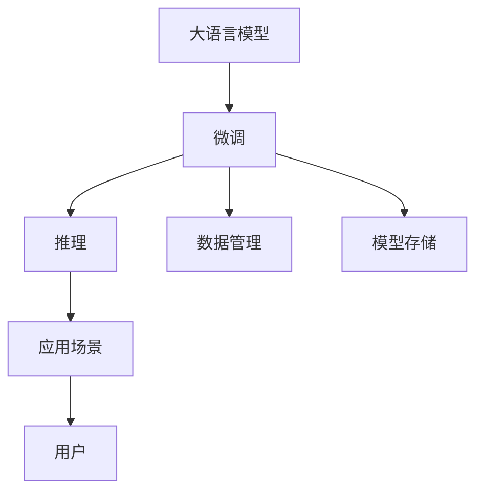

                 

## 1. 背景介绍

### 1.1 问题由来
大模型时代已至，各大技术巨头如OpenAI、Google、Meta等纷纷推出了自主研发的GPT、BERT、XLNet等深度学习模型。这些大模型在语言模型性能上取得了重大突破，但在实际应用中，模型部署和维护成本高，需要大量专业人才、强大算力及繁琐的数据管理。随着AI技术不断下沉，市场对大模型基础设施的渴求日益高涨。

### 1.2 问题核心关键点
在云计算、智能交互、自动驾驶、数字孪生等各领域，大模型已应用广泛。但现有的大模型技术也存在以下问题：

- **性能瓶颈**：大模型的训练和推理效率不高，面对实时性和资源要求较高的任务，存在延迟和成本问题。
- **应用场景局限**：各行业对大模型的需求各异，标准化的通用模型难以满足特定领域的应用需求。
- **运维成本高**：大模型的部署和维护需要高技能人才、硬件设施和数据管理，对于中小型企业或初创公司难以负担。
- **模型可解释性差**：大模型的内部机制复杂，难以解释其推理过程和决策依据。

这些问题限制了AI技术的普及和落地应用，为此Lepton AI应运而生。Lepton AI专注于解决大模型基础设施问题，为全球各行业的AI应用提供一站式解决方案。

### 1.3 问题研究意义
Lepton AI的定位在于提供开源、高效、易用的基础设施，帮助企业降低AI部署和运维成本，提升AI应用效果。通过 Lepton AI，企业可以快速构建、优化、部署大模型，加速AI创新迭代，实现业务智能化转型。同时，Lepton AI为AI研究的学者提供了一致的实验环境，促进跨领域知识的交流和共享。

## 2. 核心概念与联系

### 2.1 核心概念概述

Lepton AI基于大语言模型的微调技术，提供微调、推理、数据管理、模型存储等一站式服务。

- **大语言模型**：用于基础模型的预训练与微调，具备强大的语言理解和生成能力。
- **微调**：在预训练模型基础上，使用特定领域的数据进行微调，提升模型性能。
- **推理**：将微调后的模型应用于实际任务，进行高效推理和输出。
- **数据管理**：提供数据集管理和预处理，确保数据的质量和可用性。
- **模型存储**：提供模型存储与版本管理，便于快速部署和更新。

### 2.2 核心概念原理和架构的 Mermaid 流程图



这个流程图展示了Lepton AI核心组件之间的关系：

1. **大语言模型**：作为微调的输入，通过预训练获取语言知识。
2. **微调**：对预训练模型进行特定领域的数据训练，提升模型性能。
3. **推理**：微调后的模型应用于实际任务，进行高效推理和输出。
4. **数据管理**：数据集管理和预处理，确保数据质量。
5. **模型存储**：模型版本管理和快速部署，简化模型部署流程。
6. **应用场景**：将微调后的模型应用于智能客服、金融舆情、推荐系统等多个场景。
7. **用户**：通过Lepton AI平台，用户可以轻松构建、部署和管理模型。

## 3. 核心算法原理 & 具体操作步骤

### 3.1 算法原理概述

Lepton AI基于大语言模型的微调技术，提供模型训练和推理服务。其核心思想是通过微调机制，将预训练语言模型进行领域适应，快速构建高性能模型。

Lepton AI的微调流程包括以下步骤：

1. **预训练模型选择**：选择适合的预训练语言模型，如GPT、BERT等。
2. **数据集准备**：收集并处理领域相关的标注数据集，划分为训练集、验证集和测试集。
3. **微调模型训练**：使用微调框架训练模型，更新模型参数，优化模型性能。
4. **模型推理**：将训练好的模型应用于实际任务，进行推理输出。

### 3.2 算法步骤详解

**Step 1: 数据预处理**
- **数据收集**：收集特定领域的数据，如智能客服的对话记录、金融舆情的评论、商品推荐的用户行为等。
- **数据清洗**：去除噪音数据、重复数据和低质量数据，确保数据可用性。
- **数据标注**：对数据进行标注，如将文本分类标注为正面、负面等类别。
- **数据划分**：将数据集划分为训练集、验证集和测试集，确保模型在不同数据集上表现一致。

**Step 2: 微调模型训练**
- **模型初始化**：选择适合的预训练语言模型，如BERT。
- **模型适配**：在模型顶层添加任务相关的输出层，如softmax分类器、回归器等。
- **优化器选择**：选择适当的优化器，如Adam、SGD等，并设置学习率、批次大小等参数。
- **正则化技术**：应用L2正则、Dropout、Early Stopping等技术，防止过拟合。
- **训练过程**：使用DataLoader进行数据批处理，梯度下降算法更新模型参数。
- **验证集评估**：周期性在验证集上评估模型性能，确定最优模型。

**Step 3: 模型推理部署**
- **模型保存**：将训练好的模型保存为模型文件，支持多种模型格式如ONNX、TensorFlow、PyTorch等。
- **推理服务**：提供推理服务，支持实时推理和批量推理，支持多种接口如REST、GRPC等。
- **性能优化**：优化推理速度，减少计算资源消耗，提高模型效率。

### 3.3 算法优缺点

Lepton AI的微调技术具有以下优点：

1. **高效性**：通过微调机制，快速构建高性能模型，减少了从头训练模型的时间和计算成本。
2. **灵活性**：可以根据不同领域的数据，灵活微调预训练模型，适应特定领域的应用需求。
3. **易用性**：通过提供统一的平台，用户可以轻松进行模型构建、部署和管理。
4. **可扩展性**：支持多种推理接口和模型格式，方便模型在不同环境下的部署和应用。

但Lepton AI也存在一些局限性：

1. **模型泛化能力**：微调模型依赖特定领域的数据，泛化到其他领域时性能可能下降。
2. **硬件要求高**：微调和推理过程需要高性能硬件支持，如GPU、TPU等。
3. **模型可解释性差**：微调模型的内部机制复杂，难以解释其决策依据。

### 3.4 算法应用领域

Lepton AI的微调技术已广泛应用于多个领域，包括：

- **智能客服**：通过微调预训练模型，构建智能客服系统，快速响应客户咨询，提供精准服务。
- **金融舆情监测**：在金融领域，微调模型实时监测市场舆论动向，及时发现并规避风险。
- **个性化推荐系统**：通过微调模型，结合用户行为数据，提供个性化推荐，提升用户体验。
- **医学影像分析**：微调模型进行医学影像分类和分析，辅助医生进行疾病诊断和治疗。
- **自动驾驶**：利用微调后的模型，进行语音助手交互和指令理解，提升驾驶安全和舒适性。

以上应用场景展示了Lepton AI微调技术的强大功能和广泛适用性。随着Lepton AI的不断发展和优化，相信更多行业将从大模型基础设施中受益。

## 4. 数学模型和公式 & 详细讲解 & 举例说明

### 4.1 数学模型构建

Lepton AI的微调模型可以通过以下数学模型表示：

$$
M_{\theta}(x) = \text{softmax}(\text{MLP}(\text{BERT}_{\phi}(x)))
$$

其中，$\theta$ 为模型参数，$\phi$ 为预训练模型的参数，$x$ 为输入，$M_{\theta}(x)$ 为输出。预训练BERT模型接收输入$x$，通过多层感知机（MLP）得到中间表示$\text{BERT}_{\phi}(x)$，最终通过softmax函数输出预测结果。

### 4.2 公式推导过程

对于微调后的分类任务，假设输入文本为$x$，其标签为$y$。定义损失函数为交叉熵损失，可以表示为：

$$
\mathcal{L}(y, \hat{y}) = -\sum_{i=1}^{n} y_i \log \hat{y}_i
$$

其中，$y_i$为真实标签，$\hat{y}_i$为模型预测的概率。

微调过程中，采用梯度下降法更新模型参数$\theta$，其更新公式为：

$$
\theta \leftarrow \theta - \eta \nabla_{\theta} \mathcal{L}(y, M_{\theta}(x))
$$

其中，$\eta$为学习率，$\nabla_{\theta} \mathcal{L}(y, M_{\theta}(x))$为损失函数对模型参数的梯度。

### 4.3 案例分析与讲解

以情感分析任务为例，假设输入文本为“我非常喜欢这部电影”，其标签为“正面”。通过微调BERT模型进行情感分析，可以表示为：

$$
M_{\theta}(x) = \text{softmax}(\text{MLP}(\text{BERT}_{\phi}(x)))
$$

其中，$x$为输入文本，$M_{\theta}(x)$为模型预测概率，$\phi$为预训练BERT模型参数，$\theta$为微调后模型参数。

假设预训练BERT模型接收输入$x$，通过MLP得到中间表示$\text{BERT}_{\phi}(x)$，并最终通过softmax函数输出预测结果$M_{\theta}(x)$。通过损失函数$\mathcal{L}(y, M_{\theta}(x))$，更新模型参数$\theta$，使其最小化损失。

## 5. 项目实践：代码实例和详细解释说明

### 5.1 开发环境搭建

在使用Lepton AI进行微调开发前，需要先搭建好开发环境。以下是使用Python进行开发的步骤：

1. 安装Anaconda：从官网下载并安装Anaconda，用于创建独立的Python环境。

```bash
conda create -n pytorch-env python=3.8
conda activate pytorch-env
```

2. 安装PyTorch：根据CUDA版本，从官网获取对应的安装命令。例如：

```bash
conda install pytorch torchvision torchaudio cudatoolkit=11.1 -c pytorch -c conda-forge
```

3. 安装Transformers库：

```bash
pip install transformers
```

4. 安装各类工具包：

```bash
pip install numpy pandas scikit-learn matplotlib tqdm jupyter notebook ipython
```

完成上述步骤后，即可在`pytorch-env`环境中进行微调实践。

### 5.2 源代码详细实现

下面以情感分析任务为例，给出使用Transformers库对BERT模型进行微调的PyTorch代码实现。

```python
from transformers import BertTokenizer, BertForSequenceClassification, AdamW
import torch
import numpy as np
from sklearn.metrics import accuracy_score

# 初始化BERT模型和分词器
model = BertForSequenceClassification.from_pretrained('bert-base-cased', num_labels=2)
tokenizer = BertTokenizer.from_pretrained('bert-base-cased')

# 加载训练数据
train_data = ...
train_labels = ...
dev_data = ...
dev_labels = ...
test_data = ...
test_labels = ...

# 数据预处理
def preprocess(text):
    return tokenizer.encode(text, add_special_tokens=True, max_length=128, truncation=True)

# 模型训练和验证
def train_epoch(model, data_loader, optimizer):
    model.train()
    epoch_loss = 0
    epoch_correct = 0
    for batch in data_loader:
        inputs = preprocess(batch['text'])
        labels = batch['label']
        inputs = torch.tensor(inputs, dtype=torch.long).to(device)
        labels = torch.tensor(labels, dtype=torch.long).to(device)
        optimizer.zero_grad()
        outputs = model(inputs)
        loss = outputs.loss
        epoch_loss += loss.item()
        predictions = outputs.logits.argmax(dim=1)
        epoch_correct += (predictions == labels).sum().item()
        loss.backward()
        optimizer.step()
    return epoch_loss / len(data_loader), epoch_correct / len(data_loader)

def evaluate(model, data_loader):
    model.eval()
    predictions, labels = [], []
    with torch.no_grad():
        for batch in data_loader:
            inputs = preprocess(batch['text'])
            labels = batch['label']
            inputs = torch.tensor(inputs, dtype=torch.long).to(device)
            labels = torch.tensor(labels, dtype=torch.long).to(device)
            outputs = model(inputs)
            predictions.append(outputs.logits.argmax(dim=1).tolist())
            labels.append(labels.tolist())
    return accuracy_score(np.concatenate(labels), np.concatenate(predictions))

# 模型保存和部署
model.save_pretrained('model')
tokenizer.save_pretrained('model')
```

### 5.3 代码解读与分析

**预处理函数preprocess**：
- 使用BERT分词器对文本进行编码，确保输入长度不超过128，并添加特殊标记。

**模型训练函数train_epoch**：
- 定义训练集数据加载器，使用梯度下降算法更新模型参数，周期性在验证集上评估模型性能。

**模型评估函数evaluate**：
- 在测试集上评估模型的准确率，使用sklearn库的accuracy_score计算精度。

### 5.4 运行结果展示

通过上述代码实现，可以完成对BERT模型的情感分析任务的微调。训练结束后，通过评估函数evaluate评估模型性能，并保存模型至指定路径。

## 6. 实际应用场景

### 6.1 智能客服系统

基于Lepton AI的微调技术，智能客服系统可以快速构建、优化、部署大模型，提升客服响应速度和准确率。通过微调模型，智能客服系统能够自动理解用户意图，匹配最合适的答案模板进行回复，提升用户体验。

### 6.2 金融舆情监测

在金融领域，微调模型实时监测市场舆论动向，及时发现并规避风险。通过微调BERT模型，构建情感分析模型，实时分析舆情数据，避免因舆情波动带来的风险。

### 6.3 个性化推荐系统

通过微调BERT模型，结合用户行为数据，提供个性化推荐，提升用户体验。在个性化推荐系统中，微调模型能够从文本内容中准确把握用户的兴趣点，生成个性化推荐内容。

### 6.4 未来应用展望

未来，Lepton AI将不断优化微调技术和应用场景，提升模型性能和可解释性。通过技术升级和应用推广，Lepton AI将帮助更多企业实现智能化转型，推动AI技术在更多领域落地应用。

## 7. 工具和资源推荐

### 7.1 学习资源推荐

为了帮助开发者掌握Lepton AI的微调技术，这里推荐一些优质的学习资源：

1. Lepton AI官方文档：提供详细的API文档和样例代码，帮助开发者快速上手。
2. HuggingFace官方博客：提供丰富的案例和经验分享，帮助开发者解决实际问题。
3. CS224N《深度学习自然语言处理》课程：斯坦福大学开设的NLP明星课程，涵盖NLP的基础知识和前沿技术。
4. 《Natural Language Processing with Transformers》书籍：HuggingFace作者的著作，全面介绍了Transformer在大模型中的应用。
5. Kaggle竞赛：通过参与Kaggle竞赛，学习微调技术并提升实战能力。

### 7.2 开发工具推荐

为了提高微调和推理的效率，建议使用以下开发工具：

1. PyTorch：基于Python的开源深度学习框架，支持动态图和静态图，适合研究型应用。
2. TensorFlow：由Google主导开发的开源深度学习框架，支持分布式训练，适合工程应用。
3. Transformers库：HuggingFace开发的NLP工具库，提供了预训练模型和微调框架，易于使用。
4. Weights & Biases：实验跟踪工具，记录和可视化模型训练状态，方便调试和优化。
5. TensorBoard：TensorFlow配套的可视化工具，实时监测模型训练状态，提供图表呈现。

### 7.3 相关论文推荐

Lepton AI的技术来源于学界的持续研究，以下是几篇奠基性的相关论文，推荐阅读：

1. Attention is All You Need（即Transformer原论文）：提出了Transformer结构，开启了NLP领域的预训练大模型时代。
2. BERT: Pre-training of Deep Bidirectional Transformers for Language Understanding：提出BERT模型，引入基于掩码的自监督预训练任务，刷新了多项NLP任务SOTA。
3. Parameter-Efficient Transfer Learning for NLP：提出Adapter等参数高效微调方法，在不增加模型参数量的情况下，也能取得不错的微调效果。
4. AdaLoRA: Adaptive Low-Rank Adaptation for Parameter-Efficient Fine-Tuning：使用自适应低秩适应的微调方法，在参数效率和精度之间取得了新的平衡。
5. Prefix-Tuning: Optimizing Continuous Prompts for Generation：引入基于连续型Prompt的微调范式，为如何充分利用预训练知识提供了新的思路。

通过学习这些前沿成果，可以帮助开发者掌握Lepton AI的微调技术，提升模型性能。

## 8. 总结：未来发展趋势与挑战

### 8.1 研究成果总结

Lepton AI通过微调技术，解决了大模型在应用中的基础设施问题，为企业提供了高性能、易用的AI解决方案。Lepton AI的微调技术已应用于智能客服、金融舆情、个性化推荐等多个场景，取得了显著效果。

### 8.2 未来发展趋势

Lepton AI的未来发展趋势主要包括以下几个方向：

1. **模型泛化能力提升**：通过更多的数据集和任务，提升微调模型的泛化能力，使其在更多领域取得良好效果。
2. **模型可解释性增强**：开发可解释性较强的模型，通过Attention机制、可解释性可视化工具等手段，提升模型的透明度和可信度。
3. **模型轻量化设计**：优化模型结构和推理引擎，提高模型的运行效率和资源利用率。
4. **模型联邦学习**：通过联邦学习等技术，实现跨机构、跨领域的模型共享和合作，提升模型的通用性和安全性。
5. **模型自动化优化**：开发自动化模型优化工具，通过超参数调优、模型压缩等手段，提升模型性能和可维护性。

### 8.3 面临的挑战

Lepton AI在发展的过程中也面临一些挑战：

1. **数据隐私和安全**：在模型训练和推理过程中，如何保护用户数据的隐私和安全，防止数据泄露和滥用，是一个重要问题。
2. **模型性能波动**：微调模型的性能在不同批次、不同设备上的波动，可能导致模型稳定性不足，需要进行优化。
3. **模型鲁棒性不足**：微调模型面对域外数据时，泛化性能往往不足，需要进行鲁棒性增强。
4. **模型可解释性差**：微调模型的内部机制复杂，难以解释其决策依据，需要进行优化。

### 8.4 研究展望

Lepton AI将持续关注和解决上述挑战，通过技术创新和应用优化，提升大模型微调技术的应用效果和用户体验。同时，Lepton AI将积极参与和推动大模型基础设施的标准化，为AI技术的发展提供更坚实的技术支持。

## 9. 附录：常见问题与解答

**Q1: Lepton AI的微调技术是否适用于所有NLP任务？**

A: Lepton AI的微调技术适用于大多数NLP任务，特别是数据量较小的任务。但对于一些特定领域的任务，如医学、法律等，可能需要针对领域进行更多的预训练和微调。

**Q2: 如何选择适合的大语言模型？**

A: 选择适合的大语言模型需要考虑任务类型、数据规模、计算资源等因素。对于需要高准确率的分类任务，可以使用BERT、GPT等大模型；对于需要高效推理的任务，可以使用MobileBERT、DistilBERT等轻量级模型。

**Q3: 微调过程中如何避免过拟合？**

A: 避免过拟合的方法包括数据增强、正则化、对抗训练等。可以通过回译、近义替换等方式扩充训练集，使用L2正则、Dropout等技术防止过拟合，引入对抗样本提高模型鲁棒性。

**Q4: 微调模型的推理效率如何提升？**

A: 推理效率的提升可以通过优化模型结构、采用更高效的推理引擎、实现模型并行等方式实现。使用轻量化模型、混合精度训练等技术也可以提升推理效率。

**Q5: Lepton AI的微调技术在实时性要求较高的任务中表现如何？**

A: Lepton AI的微调技术在实时性要求较高的任务中表现良好，支持实时推理和批量推理，能够满足高实时性的应用需求。

---

作者：禅与计算机程序设计艺术 / Zen and the Art of Computer Programming

