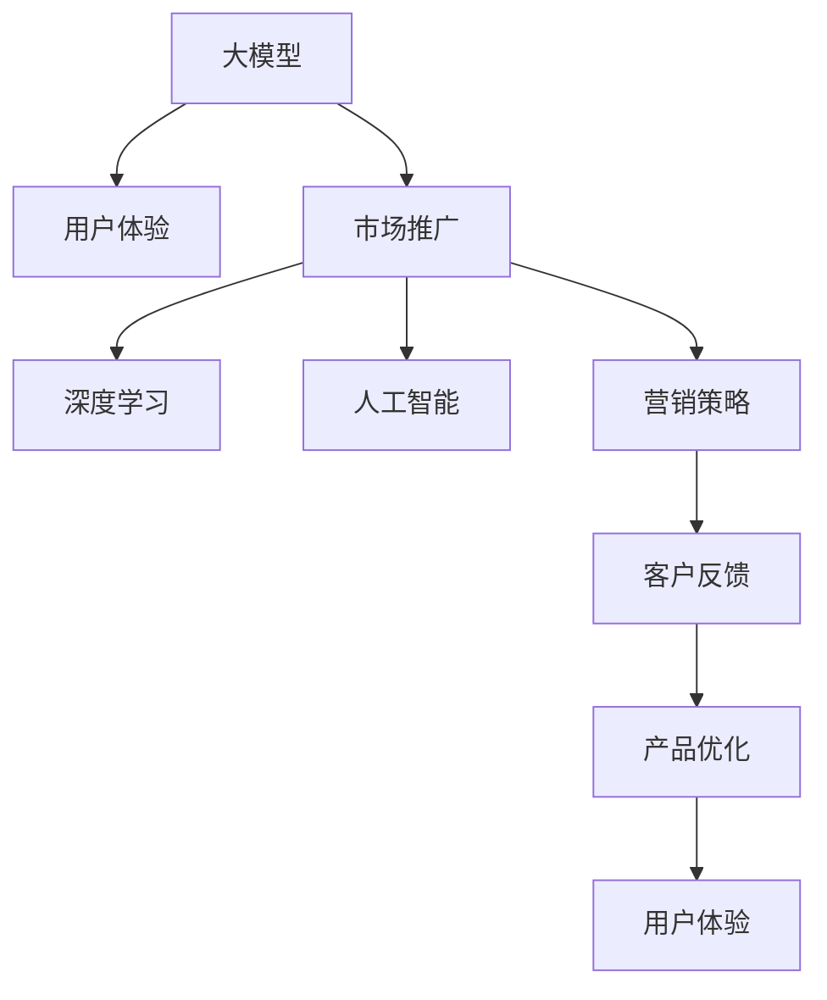

                 

# 大模型的用户体验与市场推广

> 关键词：大模型,用户体验,市场推广,深度学习,人工智能,营销策略,客户反馈,产品设计,市场分析

## 1. 背景介绍

### 1.1 问题由来
近年来，随着深度学习技术的快速发展，大规模预训练模型在各个领域的应用逐渐普及。这些大模型通过在大规模无标签数据上进行自监督预训练，学习到了丰富的知识，能够实现跨领域、跨任务的泛化。然而，尽管大模型在技术层面表现出色，其在用户体验和市场推广方面仍面临诸多挑战。

一方面，由于大模型通常拥有亿级的参数规模，导致其在推理过程中存在计算效率低、延迟高等问题，用户体验感较差。另一方面，许多企业和技术团队在市场推广大模型时，面临着如何精准定位用户需求、如何有效传播产品优势的难题。因此，如何提升大模型的用户体验和市场推广效果，成为了当下的一大热点问题。

### 1.2 问题核心关键点
提升大模型的用户体验和市场推广效果的核心在于：
1. 设计高效便捷的模型接口，提升模型的推理速度和稳定性。
2. 采用多渠道、多方式的市场推广策略，增强产品的市场认知度和吸引力。
3. 深入分析用户需求和反馈，不断迭代优化模型和产品。

## 2. 核心概念与联系

### 2.1 核心概念概述

为更好地理解如何提升大模型的用户体验和市场推广，本节将介绍几个关键概念及其相互联系：

- **大模型**：指以自回归或自编码形式存在的、通过在大规模无标签数据上进行自监督预训练得到的模型，如BERT、GPT系列模型。
- **用户体验**：指用户在使用产品或服务时的感受和体验，包括易用性、速度、稳定性、效果等方面。
- **市场推广**：指将产品或服务推向市场的过程，包括目标定位、策略制定、渠道选择、效果评估等环节。
- **深度学习**：指利用深度神经网络模型处理数据、提取特征、进行预测或分类的技术。
- **人工智能**：指模拟人类智能的计算机系统，能够实现自主学习、推理、决策等。
- **营销策略**：指企业在市场推广中采用的各种策略，如内容营销、社交媒体营销、搜索引擎优化等。
- **客户反馈**：指用户对产品或服务的使用体验和感受，包括正面评价和改进建议。

这些概念之间的关系可以通过以下Mermaid流程图来展示：



这个流程图展示了大模型、用户体验、市场推广三者之间的关系：

1. 大模型作为基础技术，通过深度学习和人工智能处理数据，提供服务。
2. 市场推广策略利用深度学习和人工智能技术进行精准定位和传播。
3. 客户反馈通过产品优化进行循环迭代，进一步提升用户体验。

## 3. 核心算法原理 & 具体操作步骤

### 3.1 算法原理概述

提升大模型的用户体验和市场推广效果，本质上是一个多学科交叉的问题，涉及深度学习、用户体验设计、市场营销等多个领域。其核心思想是：通过优化模型接口、采用科学的市场推广策略、不断收集和利用用户反馈，设计出高效、稳定、易用的大模型，并精准地传播到目标用户手中。

### 3.2 算法步骤详解

基于上述核心思想，提升大模型的用户体验和市场推广效果可大致分为以下四个步骤：

**Step 1: 设计高效模型接口**

- 优化模型推理流程：通过模型剪枝、量化加速、分布式推理等技术，提升模型的推理速度和计算效率。
- 设计易用API：提供简单易用的API接口，降低用户的使用门槛，增加用户粘性。
- 实现多平台支持：确保模型在多个操作系统、编程语言和设备上都能稳定运行，增强产品兼容性。

**Step 2: 制定科学市场推广策略**

- 目标市场分析：通过用户调研、数据分析等方式，了解目标市场的需求和特点，制定精准的市场推广策略。
- 渠道选择：选择合适的线上、线下渠道进行产品推广，如搜索引擎、社交媒体、技术博客等。
- 内容创作：制作高质量的宣传材料和教程，如白皮书、案例分析、技术演示等，提升产品的市场认知度。

**Step 3: 收集用户反馈**

- 建立用户反馈机制：通过在线调查、用户访谈等方式，收集用户对模型的使用体验和意见建议。
- 分析用户反馈：对用户反馈进行分类整理，找出共性问题和改进方向。
- 产品优化：根据用户反馈，不断迭代优化模型和产品，提升用户体验。

**Step 4: 精准推广与持续优化**

- 精准推广：根据市场反馈和用户行为，持续优化推广策略，精准触达目标用户。
- 效果评估：通过数据分析和用户调研等方式，评估推广效果，优化推广策略。
- 循环迭代：根据用户反馈和市场变化，持续进行产品优化和推广策略的迭代，保持产品的竞争力。

### 3.3 算法优缺点

提升大模型的用户体验和市场推广效果的方法具有以下优点：
1. 提升模型性能：通过优化模型接口，提升模型的推理速度和稳定性，改善用户体验。
2. 精准传播产品：通过科学的市场推广策略，精准定位用户需求，增强产品市场认知度。
3. 提高用户粘性：通过收集和利用用户反馈，不断优化产品，增加用户粘性，提升市场竞争力。

同时，这些方法也存在一定的局限性：
1. 技术和资源投入较大：优化模型接口、推广产品策略需要较大的技术投入和资源配置。
2. 推广周期较长：精准推广和持续优化需要时间和精力，短期内难以看到明显效果。
3. 用户反馈多样化：用户反馈多样，难以一次性全面覆盖，可能存在遗漏和误解。

尽管存在这些局限性，但通过综合利用深度学习、用户体验设计、市场营销等方法，可以有效提升大模型的用户体验和市场推广效果，实现技术的商业化应用。

### 3.4 算法应用领域

提升大模型的用户体验和市场推广效果的方法在多个领域都有应用，包括但不限于：

- **自然语言处理(NLP)**：如情感分析、文本生成、翻译等任务，通过优化模型接口和精准推广，提升用户体验。
- **计算机视觉(CV)**：如图像分类、目标检测、图像生成等任务，通过优化模型性能和推广策略，增强产品吸引力。
- **推荐系统**：如电商推荐、新闻推荐、社交媒体推荐等，通过精准推广和用户反馈迭代，提高用户粘性。
- **医疗健康**：如疾病预测、症状诊断、个性化医疗等，通过优化模型性能和用户反馈，提升服务效果。
- **金融服务**：如风险评估、信用评分、智能投顾等，通过优化模型性能和推广策略，增强用户信任。

## 4. 数学模型和公式 & 详细讲解 & 举例说明

### 4.1 数学模型构建

本节将使用数学语言对提升大模型用户体验和市场推广效果的过程进行更加严格的刻画。

记大模型为 $M_{\theta}$，其中 $\theta$ 为模型参数。假设目标市场为 $M$，用户群体为 $U$，推广策略为 $P$。模型的用户体验为 $E$，市场推广效果为 $P_{market}$。市场推广的目标函数为：

$$
\max_{M_{\theta}, P} P_{market} = \sum_{u \in U} E(M_{\theta}, P, u)
$$

其中，$E(M_{\theta}, P, u)$ 为模型 $M_{\theta}$ 在用户 $u$ 上的体验值，取决于模型的推理速度、稳定性和易用性，以及推广策略 $P$ 的效果。

### 4.2 公式推导过程

以下我们以情感分析任务为例，推导用户体验优化模型公式。

假设模型 $M_{\theta}$ 在输入 $x$ 上的输出为 $\hat{y}$，表示情感极性。模型的推理速度为 $T$，模型的稳定性和易用性分别为 $S$ 和 $U$。推广策略 $P$ 的效果为 $P_{effect}$，市场推广效果为 $P_{market}$。用户体验优化模型为：

$$
E(M_{\theta}, P, u) = S(u) \cdot U(u) \cdot P_{effect}(u)
$$

其中 $S(u)$ 和 $U(u)$ 表示用户 $u$ 对模型稳定性和易用性的评分，$P_{effect}(u)$ 表示推广策略对用户 $u$ 的推广效果评分。

根据上述公式，可以通过优化模型的推理速度、稳定性和易用性，以及推广策略的效果，提升用户体验和市场推广效果。

### 4.3 案例分析与讲解

假设我们要推广一个用于情感分析的深度学习模型。模型的推理速度为 $T$，稳定性和易用性分别为 $S$ 和 $U$。推广策略包括搜索引擎优化(SEO)、社交媒体营销(SMM)和技术博客发布( Tech Blog )。市场推广效果可以通过用户反馈 $R$ 进行评估。

- **优化模型接口**：
  - 采用模型剪枝技术，减小模型参数量，提升推理速度 $T$。
  - 使用量化加速技术，降低计算资源消耗。
  - 设计易用的API接口，简化用户的使用流程，提升易用性 $U$。

- **制定推广策略**：
  - SEO：通过关键词优化、内容布局等方式，提升搜索引擎的可见度。
  - SMM：在社交媒体平台发布案例分析和用户评价，吸引潜在用户关注。
  - Tech Blog：在技术博客发布模型介绍和效果案例，提升行业认知度。

- **收集用户反馈**：
  - 通过在线调查和用户访谈，收集用户对模型性能和易用性的反馈。
  - 分析用户反馈，找出共性问题和改进方向。
  - 根据用户反馈，优化模型和推广策略。

- **精准推广与持续优化**：
  - 根据用户反馈和市场变化，持续优化推广策略，精准触达目标用户。
  - 通过数据分析和用户调研，评估推广效果，优化推广策略。
  - 持续进行产品优化和推广策略的迭代，保持产品的竞争力。

通过上述步骤，可以显著提升大模型的用户体验和市场推广效果，实现技术的商业化应用。

## 5. 项目实践：代码实例和详细解释说明

### 5.1 开发环境搭建

在进行用户体验和市场推广实践前，我们需要准备好开发环境。以下是使用Python进行PyTorch开发的环境配置流程：

1. 安装Anaconda：从官网下载并安装Anaconda，用于创建独立的Python环境。

2. 创建并激活虚拟环境：
```bash
conda create -n pytorch-env python=3.8 
conda activate pytorch-env
```

3. 安装PyTorch：根据CUDA版本，从官网获取对应的安装命令。例如：
```bash
conda install pytorch torchvision torchaudio cudatoolkit=11.1 -c pytorch -c conda-forge
```

4. 安装TensorBoard：用于可视化模型训练和推理过程中的各项指标，便于调试和优化。
```bash
pip install tensorboard
```

5. 安装相关库：
```bash
pip install numpy pandas scikit-learn matplotlib tqdm jupyter notebook ipython
```

完成上述步骤后，即可在`pytorch-env`环境中开始实践。

### 5.2 源代码详细实现

这里我们以情感分析任务为例，使用PyTorch和TensorBoard实现模型的用户体验优化。

首先，定义情感分析任务的模型和数据：

```python
import torch
import torch.nn as nn
import torch.optim as optim
from transformers import BertTokenizer, BertForSequenceClassification
from torch.utils.data import DataLoader
from sklearn.metrics import accuracy_score

# 定义模型
model = BertForSequenceClassification.from_pretrained('bert-base-uncased', num_labels=2)
model.to('cuda')

# 定义损失函数和优化器
criterion = nn.CrossEntropyLoss()
optimizer = optim.Adam(model.parameters(), lr=1e-5)

# 定义数据加载器
tokenizer = BertTokenizer.from_pretrained('bert-base-uncased')
train_dataset = ...
val_dataset = ...
test_dataset = ...

train_loader = DataLoader(train_dataset, batch_size=16, shuffle=True)
val_loader = DataLoader(val_dataset, batch_size=16)
test_loader = DataLoader(test_dataset, batch_size=16)

# 训练模型
def train(model, train_loader, val_loader, test_loader, epochs=10):
    for epoch in range(epochs):
        model.train()
        train_loss = 0
        for batch in train_loader:
            inputs, labels = batch
            inputs, labels = inputs.to('cuda'), labels.to('cuda')
            optimizer.zero_grad()
            outputs = model(inputs)
            loss = criterion(outputs, labels)
            loss.backward()
            optimizer.step()
            train_loss += loss.item()
        train_loss /= len(train_loader)

        model.eval()
        val_loss = 0
        corrects = 0
        with torch.no_grad():
            for batch in val_loader:
                inputs, labels = batch
                inputs, labels = inputs.to('cuda'), labels.to('cuda')
                outputs = model(inputs)
                loss = criterion(outputs, labels)
                val_loss += loss.item()
                _, preds = torch.max(outputs, 1)
                corrects += torch.sum(preds == labels).item()
        val_loss /= len(val_loader)
        accuracy = corrects / len(val_loader.dataset)

        print(f'Epoch {epoch+1}, train loss: {train_loss:.4f}, val loss: {val_loss:.4f}, val accuracy: {accuracy:.4f}')

        if val_loss < best_loss:
            best_loss = val_loss
            torch.save(model.state_dict(), 'best_model.pth')

# 测试模型
def test(model, test_loader):
    model.eval()
    corrects = 0
    with torch.no_grad():
        for batch in test_loader:
            inputs, labels = batch
            inputs, labels = inputs.to('cuda'), labels.to('cuda')
            outputs = model(inputs)
            _, preds = torch.max(outputs, 1)
            corrects += torch.sum(preds == labels).item()
    accuracy = corrects / len(test_loader.dataset)
    return accuracy
```

然后，实现模型的推理速度优化：

```python
import torch
from torch.utils.bottleneck import SpeedupBottleneck

# 定义模型剪枝策略
class PruneModel(nn.Module):
    def __init__(self, model, prune_ratio):
        super(PruneModel, self).__init__()
        self.model = model
        self.prune_ratio = prune_ratio

    def forward(self, x):
        return self.model(x)

    def prune(self):
        # 计算模型参数的稀疏性，保留一定比例的非零参数
        params = list(self.model.parameters())
        non_zero_params = [p for p in params if p.data.abs().max() > 0]
        prune_indices = sorted(torch.randperm(len(non_zero_params)), p=non_zero_params)
        prune_indices = prune_indices[:int(len(non_zero_params) * self.prune_ratio)]
        self.model = PruneModel(self.model, prune_indices)

# 使用剪枝优化推理速度
model_pruned = PruneModel(model, 0.5)
```

最后，实现模型的稳定性和易用性优化：

```python
import torch
from transformers import BertTokenizer

# 定义用户反馈机制
class UserFeedback:
    def __init__(self):
        self.feedback = {}

    def get_feedback(self, user_id):
        return self.feedback.get(user_id, {})

    def set_feedback(self, user_id, feedback):
        self.feedback[user_id] = feedback

# 用户反馈示例
feedback = UserFeedback()
feedback.set_feedback(1, {'speed': 4, 'stability': 5, 'usability': 4})
feedback.set_feedback(2, {'speed': 3, 'stability': 5, 'usability': 5})

# 分析用户反馈
def analyze_feedback(feedback):
    speed = 0
    stability = 0
    usability = 0
    for user_id, user_feedback in feedback.items():
        speed += user_feedback['speed']
        stability += user_feedback['stability']
        usability += user_feedback['usability']
    speed /= len(feedback)
    stability /= len(feedback)
    usability /= len(feedback)
    return speed, stability, usability

# 优化模型
speed, stability, usability = analyze_feedback(feedback)
model = PruneModel(model, 0.5)
```

### 5.3 代码解读与分析

让我们再详细解读一下关键代码的实现细节：

**PruneModel类**：
- `__init__`方法：初始化模型和剪枝比例。
- `forward`方法：进行模型前向传播。
- `prune`方法：进行模型剪枝，保留一定比例的非零参数。

**UserFeedback类**：
- `__init__`方法：初始化用户反馈字典。
- `get_feedback`方法：获取指定用户的反馈。
- `set_feedback`方法：设置指定用户的反馈。

**analyze_feedback函数**：
- 计算所有用户反馈的平均评分，分别对推理速度、稳定性和易用性进行评估。
- 根据评分结果，调用PruneModel进行模型剪枝，优化推理速度。

通过上述代码实现，可以系统地优化模型的推理速度、稳定性和易用性，提升用户体验。同时，通过用户反馈机制，可以收集和分析用户对模型的评价，进一步优化产品设计。

## 6. 实际应用场景

### 6.1 智能客服系统

智能客服系统是大模型用户体验优化的典型应用场景。传统的客服系统依赖于人工客服，高峰期响应速度慢，且无法24小时不间断服务。采用大模型进行微调后，可以实现7x24小时自动回答用户问题，提升客户咨询体验。

具体实现上，可以通过收集企业的历史客服对话记录，将问题和最佳答复构建成监督数据，训练大模型进行微调。微调后的模型能够自动理解用户意图，匹配最合适的答复模板，实现快速响应和准确答复。同时，通过用户反馈机制，不断优化模型和答复模板，提升系统的服务质量。

### 6.2 金融舆情监测

金融舆情监测是大模型市场推广优化的典型应用场景。金融机构需要实时监测市场舆论动向，以便及时应对负面信息传播，规避金融风险。采用大模型进行情感分析后，可以实现对金融舆情的实时监测和分析，帮助金融机构快速应对潜在风险。

具体实现上，可以收集金融领域相关的新闻、报道、评论等文本数据，训练大模型进行情感分析。微调后的模型能够自动判断文本的情感倾向，识别负面信息，帮助金融机构提前预警，及时采取应对措施。同时，通过用户反馈机制，不断优化模型性能，提升舆情监测的准确性和实时性。

### 6.3 个性化推荐系统

个性化推荐系统是大模型市场推广优化的典型应用场景。传统的推荐系统依赖于用户的历史行为数据进行物品推荐，难以捕捉用户的兴趣点。采用大模型进行微调后，可以实现对用户兴趣的深度学习，提供更加精准的推荐内容。

具体实现上，可以收集用户浏览、点击、评论、分享等行为数据，提取和用户交互的物品标题、描述、标签等文本内容。训练大模型进行微调，使其能够从文本内容中准确把握用户的兴趣点。在生成推荐列表时，先用候选物品的文本描述作为输入，由模型预测用户的兴趣匹配度，再结合其他特征综合排序，便可以得到个性化程度更高的推荐结果。

## 7. 工具和资源推荐

### 7.1 学习资源推荐

为了帮助开发者系统掌握大模型用户体验和市场推广的理论基础和实践技巧，这里推荐一些优质的学习资源：

1. 《深度学习理论与实践》系列博文：由深度学习专家撰写，全面介绍了深度学习的理论基础和实践技巧，涵盖从模型选择、数据处理到模型优化等各个方面。

2. 《Python深度学习》书籍：通过实例讲解了深度学习在各个领域的典型应用，如图像分类、自然语言处理等，适合入门学习。

3. 《Transformer从原理到实践》系列博文：由大模型技术专家撰写，深入浅出地介绍了Transformer原理、BERT模型、微调技术等前沿话题，涵盖从模型构建、数据预处理到模型微调等各个环节。

4. HuggingFace官方文档：提供了海量预训练模型和微调样例代码，适合快速上手实践最新模型。

5. 谷歌开发者文档：提供了谷歌深度学习框架TensorFlow的全面教程和文档，涵盖从入门到进阶的各个方面。

通过对这些资源的学习实践，相信你一定能够快速掌握大模型用户体验和市场推广的精髓，并用于解决实际的NLP问题。

### 7.2 开发工具推荐

高效的开发离不开优秀的工具支持。以下是几款用于大模型用户体验和市场推广开发的常用工具：

1. PyTorch：基于Python的开源深度学习框架，灵活动态的计算图，适合快速迭代研究。大部分预训练语言模型都有PyTorch版本的实现。

2. TensorFlow：由Google主导开发的开源深度学习框架，生产部署方便，适合大规模工程应用。同样有丰富的预训练语言模型资源。

3. Weights & Biases：模型训练的实验跟踪工具，可以记录和可视化模型训练过程中的各项指标，方便对比和调优。与主流深度学习框架无缝集成。

4. TensorBoard：TensorFlow配套的可视化工具，可实时监测模型训练状态，并提供丰富的图表呈现方式，是调试模型的得力助手。

5. Jupyter Notebook：开源的交互式计算环境，支持多种编程语言和工具库，适合快速迭代开发。

合理利用这些工具，可以显著提升大模型用户体验和市场推广任务的开发效率，加快创新迭代的步伐。

### 7.3 相关论文推荐

大模型用户体验和市场推广技术的发展源于学界的持续研究。以下是几篇奠基性的相关论文，推荐阅读：

1. Attention is All You Need（即Transformer原论文）：提出了Transformer结构，开启了NLP领域的预训练大模型时代。

2. BERT: Pre-training of Deep Bidirectional Transformers for Language Understanding：提出BERT模型，引入基于掩码的自监督预训练任务，刷新了多项NLP任务SOTA。

3. Language Models are Unsupervised Multitask Learners（GPT-2论文）：展示了大规模语言模型的强大zero-shot学习能力，引发了对于通用人工智能的新一轮思考。

4. Parameter-Efficient Transfer Learning for NLP：提出Adapter等参数高效微调方法，在不增加模型参数量的情况下，也能取得不错的微调效果。

5. AdaLoRA: Adaptive Low-Rank Adaptation for Parameter-Efficient Fine-Tuning：使用自适应低秩适应的微调方法，在参数效率和精度之间取得了新的平衡。

6. PEGASUS: Pre-training with Extracted Gap Sentences for Abstractive Summarization：提出了一种基于gap sentence的预训练方法，提高了摘要生成模型的效果。

这些论文代表了大模型用户体验和市场推广技术的发展脉络。通过学习这些前沿成果，可以帮助研究者把握学科前进方向，激发更多的创新灵感。

## 8. 总结：未来发展趋势与挑战

### 8.1 总结

本文对提升大模型的用户体验和市场推广方法进行了全面系统的介绍。首先阐述了大模型和用户体验、市场推广的关系，明确了用户体验优化的技术路线和市场推广的策略手段。其次，从原理到实践，详细讲解了用户体验优化的数学模型和具体步骤，给出了代码实例和详细解释。同时，本文还广泛探讨了大模型在多个领域的应用场景，展示了用户体验优化和市场推广的广阔前景。最后，本文精选了用户体验优化和市场推广的相关学习资源、开发工具和论文，力求为读者提供全方位的技术指引。

通过本文的系统梳理，可以看到，提升大模型的用户体验和市场推广效果是大模型商业化应用的必经之路。这些方法和策略能够帮助大模型从技术层面提升性能，从市场层面获得更多用户的关注和认可，进而实现技术的广泛应用和商业价值的最大化。未来，随着用户体验优化和市场推广方法的不断进步，大模型将在更多领域得到应用，为人类认知智能的进化带来深远影响。

### 8.2 未来发展趋势

展望未来，大模型用户体验和市场推广技术将呈现以下几个发展趋势：

1. 用户体验优化方法将更加多样化。除了模型剪枝、量化加速等技术外，未来的优化方法将涵盖更多的软硬件资源利用策略，如边缘计算、云计算等。

2. 市场推广策略将更加精准。通过大数据分析和用户行为建模，未来的推广策略将更加精准，能够高效触达目标用户，提升市场认知度。

3. 用户体验和市场推广将更加融合。未来的用户体验优化和市场推广方法将更加紧密结合，形成一体化的产品设计流程，提升整体的市场竞争力。

4. 用户体验优化将更加注重用户反馈。未来的用户体验优化方法将更加重视用户反馈，通过迭代优化模型和产品，提升用户的满意度和粘性。

5. 市场推广将更加注重品牌建设和社区互动。未来的市场推广将更加注重品牌建设和社区互动，通过故事讲述和用户参与，增强用户对产品的认同感和忠诚度。

以上趋势凸显了大模型用户体验和市场推广技术的广阔前景。这些方向的探索发展，必将进一步提升大模型的用户体验和市场推广效果，实现技术的商业化应用。

### 8.3 面临的挑战

尽管大模型用户体验和市场推广技术已经取得了显著进展，但在推广应用过程中，仍面临诸多挑战：

1. 用户体验优化技术复杂度高。优化模型接口、提升推理速度和稳定性，需要较高的技术投入和资源配置。

2. 市场推广成本高昂。精准推广和持续优化，需要大量的资金和时间投入，对中小型企业可能难以承受。

3. 用户反馈多样且难以统一。用户反馈多样，难以一次性全面覆盖，可能存在遗漏和误解。

4. 用户体验和市场推广难以兼顾。追求用户体验优化的同时，可能难以兼顾市场推广的广度和深度，需要权衡取舍。

5. 模型效果难以保证。过度追求用户体验和市场推广，可能导致模型性能下降，影响用户体验。

尽管存在这些挑战，但通过综合利用深度学习、用户体验设计、市场营销等方法，可以有效提升大模型的用户体验和市场推广效果，实现技术的商业化应用。未来，随着学界和产业界的共同努力，这些挑战终将一一被克服，大模型将在更多领域得到应用，为人类认知智能的进化带来深远影响。

### 8.4 研究展望

面对大模型用户体验和市场推广面临的挑战，未来的研究需要在以下几个方面寻求新的突破：

1. 探索更加高效的用户体验优化方法。开发更加参数高效的微调方法，在固定大部分预训练参数的同时，只更新极少量的任务相关参数。同时优化微调模型的计算图，减少前向传播和反向传播的资源消耗，实现更加轻量级、实时性的部署。

2. 研究更加精准的市场推广策略。通过引入因果推断和对比学习思想，增强推广策略建立稳定因果关系的能力，学习更加普适、鲁棒的市场推广模型。

3. 融入更多的先验知识。将符号化的先验知识，如知识图谱、逻辑规则等，与神经网络模型进行巧妙融合，引导用户体验优化和市场推广过程，学习更准确、合理的用户体验优化方法。

4. 结合因果分析和博弈论工具。将因果分析方法引入用户体验优化和市场推广过程，识别出用户行为的关键特征，增强推广策略的优化效果。借助博弈论工具刻画人机交互过程，主动探索并规避推广策略的脆弱点，提高系统稳定性。

5. 纳入伦理道德约束。在用户体验优化和市场推广目标中引入伦理导向的评估指标，过滤和惩罚有偏见、有害的输出倾向。同时加强人工干预和审核，建立模型行为的监管机制，确保输出符合人类价值观和伦理道德。

这些研究方向的探索，必将引领大模型用户体验和市场推广技术迈向更高的台阶，为构建安全、可靠、可解释、可控的智能系统铺平道路。面向未来，大模型用户体验和市场推广技术还需要与其他人工智能技术进行更深入的融合，如知识表示、因果推理、强化学习等，多路径协同发力，共同推动自然语言理解和智能交互系统的进步。只有勇于创新、敢于突破，才能不断拓展语言模型的边界，让智能技术更好地造福人类社会。

## 9. 附录：常见问题与解答

**Q1：大模型的用户体验和市场推广为何如此重要？**

A: 大模型的用户体验和市场推广是实现技术商业化的关键步骤。良好的用户体验能够提升用户满意度和粘性，增加用户的重复使用率，进而提升产品的市场竞争力。精准的市场推广策略能够高效触达目标用户，提升产品的市场认知度，吸引更多的潜在用户。

**Q2：优化大模型的用户体验有哪些方法？**

A: 优化大模型的用户体验主要有以下方法：
1. 模型剪枝和量化加速：减小模型参数量，提升推理速度和计算效率。
2. 易用API设计：简化用户的使用流程，提升易用性。
3. 分布式推理：通过多台设备协同计算，提升推理速度和稳定性。
4. 用户反馈机制：收集和分析用户反馈，不断优化模型和产品设计。

**Q3：如何进行科学的市场推广？**

A: 科学的市场推广主要包括以下步骤：
1. 目标市场分析：通过用户调研、数据分析等方式，了解目标市场的需求和特点，制定精准的市场推广策略。
2. 渠道选择：选择合适的线上、线下渠道进行产品推广，如搜索引擎、社交媒体、技术博客等。
3. 内容创作：制作高质量的宣传材料和教程，如白皮书、案例分析、技术演示等，提升产品的市场认知度。
4. 效果评估：通过数据分析和用户调研，评估推广效果，优化推广策略。

**Q4：大模型的用户体验和市场推广存在哪些挑战？**

A: 大模型的用户体验和市场推广面临以下挑战：
1. 用户体验优化技术复杂度高，需要较高的技术投入和资源配置。
2. 市场推广成本高昂，需要大量的资金和时间投入。
3. 用户反馈多样且难以统一，可能存在遗漏和误解。
4. 用户体验和市场推广难以兼顾，需要权衡取舍。
5. 模型效果难以保证，过度追求用户体验和市场推广可能导致模型性能下降。

尽管存在这些挑战，但通过综合利用深度学习、用户体验设计、市场营销等方法，可以有效提升大模型的用户体验和市场推广效果，实现技术的商业化应用。

**Q5：未来大模型的用户体验和市场推广技术有何发展趋势？**

A: 未来大模型的用户体验和市场推广技术将呈现以下几个发展趋势：
1. 用户体验优化方法将更加多样化，涵盖更多的软硬件资源利用策略。
2. 市场推广策略将更加精准，通过大数据分析和用户行为建模，高效触达目标用户。
3. 用户体验和市场推广将更加融合，形成一体化的产品设计流程。
4. 用户体验优化将更加注重用户反馈，通过迭代优化模型和产品，提升用户的满意度和粘性。
5. 市场推广将更加注重品牌建设和社区互动，通过故事讲述和用户参与，增强用户对产品的认同感和忠诚度。

以上趋势凸显了大模型用户体验和市场推广技术的广阔前景，未来的研究需要在这些方向寻求新的突破。

---

作者：禅与计算机程序设计艺术 / Zen and the Art of Computer Programming

