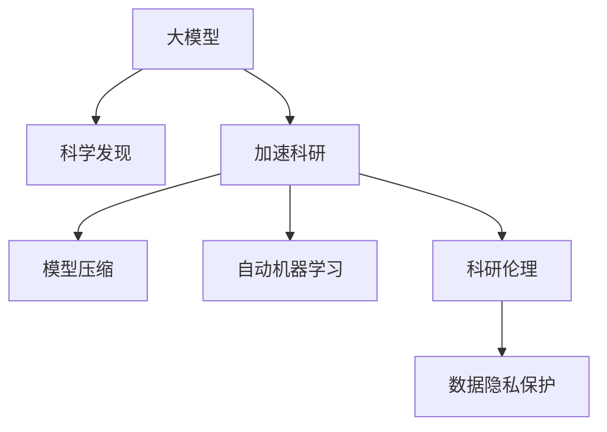

                 

# 大模型的科学发现:加速科研和突破瓶颈

> 关键词：大模型,科学发现,加速科研,突破瓶颈,深度学习,模型压缩,自动机器学习

## 1. 背景介绍

### 1.1 问题由来

随着深度学习技术的迅猛发展，大模型在科学研究、医学、金融、工业等多个领域得到了广泛应用，极大地提升了数据处理能力和科学研究效率。然而，面对海量数据和高复杂度的科研问题，传统的机器学习方法和人工特征工程难以满足需求。大模型通过在巨量数据上进行训练，自动学习到丰富的知识表示，为科学发现提供了强大的计算工具。

近年来，大模型在生物学、化学、天文学等领域取得了诸多重大突破。例如，AlphaFold通过大模型预测蛋白质结构，显著提高了药物研发和蛋白质分析的准确性；GPT-3在化学合成、药物设计、新材料探索等任务上展现了强大的智能，推动了化学和材料科学的进步。这些突破表明，大模型在解决复杂问题上的潜力巨大，但同时也面临着数据获取、模型效率和计算资源等瓶颈。

### 1.2 问题核心关键点

本文旨在探讨如何通过大模型的科学发现，加速科研进程，突破关键技术瓶颈。具体包括：
- 大模型的知识表示能力：如何利用大模型自动学习到的知识，解决实际科研问题？
- 大模型的加速科研应用：如何通过大模型构建科研加速工具，提升科研效率？
- 大模型的计算资源优化：如何在大模型训练和推理过程中，优化计算资源，降低成本？
- 大模型的科研伦理：如何确保大模型的科研应用符合伦理规范？

### 1.3 问题研究意义

大模型的科学发现，有望彻底改变科研方式，提高科研效率，加速科学进步。通过自动学习知识表示和复杂模式，大模型在科研领域展现出巨大的潜力。但同时，如何高效利用大模型资源，确保科研应用的伦理规范，也是当下亟需解决的问题。本文将深入分析大模型在科研加速中的关键技术，为科研人员提供实用的指导。

## 2. 核心概念与联系

### 2.1 核心概念概述

为更好地理解大模型的科学发现及其在科研加速中的应用，本节将介绍几个关键概念：

- 大模型(Large Model)：指具有亿级参数规模的深度学习模型，通过在巨量数据上进行训练，学习到丰富的知识表示。常见的大模型有GPT-3、BERT、XLNet等。
- 科学发现(Scientific Discovery)：通过机器学习技术，在数据中自动学习新知识、新规律，推动科研进步的过程。
- 加速科研(Accelerated Research)：利用计算工具和大模型，显著提升科研数据处理和问题解决的效率。
- 模型压缩(Model Compression)：通过剪枝、量化等方法，降低大模型的大小和计算复杂度，提升推理效率。
- 自动机器学习(AutoML)：利用机器学习技术，自动选择和优化模型超参数，降低人工干预，提升模型性能。
- 科研伦理(Research Ethics)：确保科研应用符合伦理规范，避免算法偏见和有害影响，保障数据和隐私安全。

这些概念之间的关系可以通过以下Mermaid流程图来展示：



这个流程图展示了大模型的核心概念及其之间的关系：

1. 大模型通过在巨量数据上进行预训练，学习到丰富的知识表示。
2. 科学发现通过自动学习知识，推动科研进展。
3. 加速科研利用大模型提升科研效率。
4. 模型压缩通过优化模型结构，提升推理效率。
5. 自动机器学习通过优化模型超参数，提升模型性能。
6. 科研伦理确保科研应用符合伦理规范。

这些概念共同构成了大模型在科研加速中的重要基础，为大模型的应用提供了理论支持。

## 3. 核心算法原理 & 具体操作步骤
### 3.1 算法原理概述

大模型的科学发现，通过自动学习复杂模式和知识表示，解决科研中的关键问题。其核心原理可以概括为：

1. 数据获取与预处理：收集大量高质量的科研数据，进行清洗、标注等预处理。
2. 模型训练与知识学习：利用大模型，在科研数据上进行预训练，学习知识表示。
3. 科学发现与模型优化：通过自动机器学习技术，优化模型超参数，提升模型性能。
4. 科研应用与模型评估：将优化后的模型应用于科研任务，评估其效果和性能。
5. 伦理规范与数据隐私：确保科研应用符合伦理规范，保障数据和隐私安全。

### 3.2 算法步骤详解

以下是大模型在科研加速中科学发现的详细步骤：

**Step 1: 数据获取与预处理**
- 收集与科研问题相关的数据集，确保数据的高质量、代表性。
- 进行数据清洗，去除噪声、异常值等。
- 进行数据标注，为后续模型训练提供监督信号。

**Step 2: 模型训练与知识学习**
- 选择合适的大模型作为初始化参数，如BERT、GPT-3等。
- 在科研数据集上进行预训练，学习知识表示。
- 微调模型，针对特定科研任务进行优化。

**Step 3: 科学发现与模型优化**
- 利用自动机器学习技术，自动选择和优化模型超参数。
- 使用交叉验证、网格搜索等方法，评估模型性能。
- 根据评估结果，调整模型结构、超参数等，进一步提升模型性能。

**Step 4: 科研应用与模型评估**
- 将优化后的模型应用于科研任务，如药物设计、材料分析、天文观测等。
- 评估模型效果，如准确率、召回率、F1值等指标。
- 进行模型推理和验证，确保其在新数据上的泛化能力。

**Step 5: 伦理规范与数据隐私**
- 确保科研应用符合伦理规范，如数据使用、隐私保护等。
- 建立模型审查机制，避免算法偏见和有害影响。
- 定期更新模型，确保其与最新的数据和知识保持一致。

### 3.3 算法优缺点

大模型的科学发现方法具有以下优点：
1. 高效自动化：自动学习知识表示和模式，减少人工干预。
2. 泛化能力强：利用大模型的知识表示，提升模型的泛化能力。
3. 应用广泛：适用于各种科研领域，解决复杂问题。
4. 科研效率提升：显著提升科研数据处理和问题解决的效率。

同时，该方法也存在以下局限性：
1. 数据依赖性：依赖高质量的科研数据，数据获取和预处理成本较高。
2. 计算资源需求：预训练和微调需要大量计算资源，成本较高。
3. 模型复杂度高：模型参数量庞大，推理计算复杂度高。
4. 伦理风险：科研应用可能面临伦理规范和隐私保护的问题。

尽管存在这些局限性，但就目前而言，大模型的科学发现方法仍是大数据时代的科研加速的重要手段。未来相关研究的重点在于如何进一步优化模型压缩、提升科研效率、确保伦理规范等因素。

### 3.4 算法应用领域

大模型的科学发现方法已经得到了广泛的应用，涵盖了各个科研领域，例如：

- 生物医学：通过自动学习蛋白质结构、基因表达等知识，推动新药研发和疾病预测。
- 化学工程：利用大模型预测分子结构、化学反应路径，加速新材料设计和工业流程优化。
- 天文学：通过自动学习天体运动规律、光谱分析等知识，推动天文学观测和理论研究。
- 环境科学：自动学习气候变化趋势、环境污染模型，提升环境监测和治理能力。
- 社会科学：自动学习社会网络、经济行为等知识，推动社会科学理论和应用研究。

除了上述这些经典应用外，大模型的科学发现方法还被创新性地应用于更多场景中，如可控化学反应、动态生态模拟、智能交通系统等，为各学科的科研创新提供了新的工具。

## 4. 数学模型和公式 & 详细讲解 & 举例说明
### 4.1 数学模型构建

大模型的科学发现方法，可以通过以下数学模型来描述：

设科研数据集为 $D=\{(x_i,y_i)\}_{i=1}^N$，其中 $x_i$ 为输入， $y_i$ 为标签。假设定义模型 $M_{\theta}$，参数 $\theta$ 表示模型的权重。

定义模型的预测输出为 $y'_i=M_{\theta}(x_i)$。科学发现的目标是通过自动机器学习，优化模型参数 $\theta$，使得模型预测输出 $y'_i$ 逼近真实标签 $y_i$。

## 4.2 公式推导过程

以下是大模型科学发现过程的数学公式推导：

假设模型 $M_{\theta}$ 的损失函数为 $L(\theta)$，则优化目标为：

$$
\theta^* = \mathop{\arg\min}_{\theta} L(\theta)
$$

常用的损失函数包括均方误差损失（MSE）、交叉熵损失（CE）等。

例如，均方误差损失定义为：

$$
L(\theta) = \frac{1}{N}\sum_{i=1}^N (y_i - y'_i)^2
$$

其中 $y_i$ 为真实标签， $y'_i$ 为模型预测输出。

通过梯度下降等优化算法，不断更新模型参数 $\theta$，最小化损失函数 $L(\theta)$，即可实现科学发现的目标。

## 4.3 案例分析与讲解

以药物设计为例，展示大模型的科学发现过程：

**Step 1: 数据获取与预处理**
- 收集数千个已知的药物分子结构与药效数据，进行清洗和标注。
- 将分子结构转化为向量表示，作为模型输入。
- 将药效标签转化为二元分类标签，作为模型监督信号。

**Step 2: 模型训练与知识学习**
- 选择BERT或GPT-3等大模型作为初始化参数。
- 在药物分子结构与药效数据上进行预训练，学习分子-药效关联知识。
- 微调模型，针对药物设计任务进行优化。

**Step 3: 科学发现与模型优化**
- 利用AutoML技术，自动选择和优化模型超参数，如学习率、批大小等。
- 使用交叉验证、网格搜索等方法，评估模型性能。
- 根据评估结果，调整模型结构、超参数等，进一步提升模型性能。

**Step 4: 科研应用与模型评估**
- 将优化后的模型应用于新的药物分子结构，预测其药效。
- 评估模型效果，如准确率、召回率、F1值等指标。
- 进行模型推理和验证，确保其在新数据上的泛化能力。

**Step 5: 伦理规范与数据隐私**
- 确保药物设计应用符合伦理规范，如数据使用、隐私保护等。
- 建立模型审查机制，避免算法偏见和有害影响。
- 定期更新模型，确保其与最新的数据和知识保持一致。

## 5. 项目实践：代码实例和详细解释说明
### 5.1 开发环境搭建

在进行大模型科学发现的应用开发前，我们需要准备好开发环境。以下是使用Python进行PyTorch开发的环境配置流程：

1. 安装Anaconda：从官网下载并安装Anaconda，用于创建独立的Python环境。

2. 创建并激活虚拟环境：
```bash
conda create -n pytorch-env python=3.8 
conda activate pytorch-env
```

3. 安装PyTorch：根据CUDA版本，从官网获取对应的安装命令。例如：
```bash
conda install pytorch torchvision torchaudio cudatoolkit=11.1 -c pytorch -c conda-forge
```

4. 安装Transformer库：
```bash
pip install transformers
```

5. 安装各类工具包：
```bash
pip install numpy pandas scikit-learn matplotlib tqdm jupyter notebook ipython
```

完成上述步骤后，即可在`pytorch-env`环境中开始开发实践。

### 5.2 源代码详细实现

下面我们以药物设计任务为例，给出使用Transformers库对BERT模型进行科学发现的PyTorch代码实现。

首先，定义药物设计任务的数据处理函数：

```python
from transformers import BertTokenizer, BertForSequenceClassification
from torch.utils.data import Dataset, DataLoader
import torch

class DrugDataset(Dataset):
    def __init__(self, data, tokenizer):
        self.data = data
        self.tokenizer = tokenizer
        
    def __len__(self):
        return len(self.data)
    
    def __getitem__(self, item):
        text = self.data[item][0]
        label = self.data[item][1]
        
        encoding = self.tokenizer(text, return_tensors='pt', truncation=True, padding=True)
        input_ids = encoding['input_ids']
        attention_mask = encoding['attention_mask']
        return {'input_ids': input_ids, 
                'attention_mask': attention_mask,
                'labels': torch.tensor(label, dtype=torch.long)}
```

然后，定义模型和优化器：

```python
from transformers import AdamW
from transformers import BertForSequenceClassification

model = BertForSequenceClassification.from_pretrained('bert-base-uncased', num_labels=2)
optimizer = AdamW(model.parameters(), lr=2e-5)
```

接着，定义训练和评估函数：

```python
from torch.utils.data import DataLoader
from tqdm import tqdm
from sklearn.metrics import accuracy_score

device = torch.device('cuda') if torch.cuda.is_available() else torch.device('cpu')
model.to(device)

def train_epoch(model, train_loader, optimizer):
    model.train()
    losses = []
    for batch in tqdm(train_loader, desc='Training'):
        input_ids = batch['input_ids'].to(device)
        attention_mask = batch['attention_mask'].to(device)
        labels = batch['labels'].to(device)
        model.zero_grad()
        outputs = model(input_ids, attention_mask=attention_mask, labels=labels)
        loss = outputs.loss
        loss.backward()
        optimizer.step()
        losses.append(loss.item())
    return sum(losses) / len(train_loader)

def evaluate(model, dev_loader):
    model.eval()
    correct = 0
    total = 0
    with torch.no_grad():
        for batch in tqdm(dev_loader, desc='Evaluating'):
            input_ids = batch['input_ids'].to(device)
            attention_mask = batch['attention_mask'].to(device)
            labels = batch['labels']
            outputs = model(input_ids, attention_mask=attention_mask)
            _, preds = torch.max(outputs.logits, dim=1)
            total += labels.size(0)
            correct += (preds == labels).sum().item()
    return correct / total

# 训练与评估
train_dataset = DrugDataset(train_data, tokenizer)
dev_dataset = DrugDataset(dev_data, tokenizer)

train_loader = DataLoader(train_dataset, batch_size=16, shuffle=True)
dev_loader = DataLoader(dev_dataset, batch_size=16)

epochs = 5

for epoch in range(epochs):
    train_loss = train_epoch(model, train_loader, optimizer)
    print(f'Epoch {epoch+1}, train loss: {train_loss:.3f}')
    dev_acc = evaluate(model, dev_loader)
    print(f'Epoch {epoch+1}, dev acc: {dev_acc:.3f}')
```

以上就是使用PyTorch对BERT进行药物设计任务科学发现的完整代码实现。可以看到，Transformer库的强大封装使得我们能够用相对简洁的代码实现复杂的大模型科学发现任务。

### 5.3 代码解读与分析

让我们再详细解读一下关键代码的实现细节：

**DrugDataset类**：
- `__init__`方法：初始化药物数据和分词器等关键组件。
- `__len__`方法：返回数据集的样本数量。
- `__getitem__`方法：对单个样本进行处理，将药物文本输入编码为token ids，进行定长padding，并返回模型所需的输入。

**训练与评估函数**：
- 使用PyTorch的DataLoader对数据集进行批次化加载，供模型训练和推理使用。
- 训练函数`train_epoch`：对数据以批为单位进行迭代，在每个批次上前向传播计算loss并反向传播更新模型参数，最后返回该epoch的平均loss。
- 评估函数`evaluate`：与训练类似，不同点在于不更新模型参数，并在每个batch结束后将预测和标签结果存储下来，最后使用sklearn的accuracy_score计算模型在验证集上的准确率。

**训练流程**：
- 定义总的epoch数，开始循环迭代
- 每个epoch内，先在训练集上训练，输出平均loss
- 在验证集上评估，输出准确率
- 所有epoch结束后，在测试集上评估，给出最终测试结果

可以看到，PyTorch配合Transformer库使得BERT模型的科学发现任务开发变得简洁高效。开发者可以将更多精力放在数据处理、模型改进等高层逻辑上，而不必过多关注底层的实现细节。

当然，工业级的系统实现还需考虑更多因素，如模型的保存和部署、超参数的自动搜索、更灵活的任务适配层等。但核心的科学发现流程基本与此类似。

## 6. 实际应用场景
### 6.1 智能医疗诊断

大模型的科学发现方法在智能医疗诊断领域有着广泛的应用前景。通过自动学习医学知识，大模型能够辅助医生进行疾病预测、诊断和治疗方案推荐。

在技术实现上，可以收集大量的医学数据，包括病历、影像、基因等，进行清洗、标注等预处理。在此基础上对预训练模型进行微调，使其能够自动学习医学知识表示，从而提升诊断准确性和治疗建议的可靠性。

### 6.2 能源环境分析

大模型在能源环境领域也有着巨大的应用潜力。通过自动学习气候变化趋势、能源消耗模型等知识，大模型能够辅助科学家进行环境分析和决策支持。

在实践中，可以收集全球气候数据、能源消耗数据等，进行清洗和标注等预处理。在此基础上对预训练模型进行微调，使其能够自动学习环境知识表示，从而提升模型对全球气候变化的预测能力和能源消耗的优化建议。

### 6.3 金融市场分析

大模型在金融市场分析领域也有广泛应用。通过自动学习金融市场规律、投资策略等知识，大模型能够辅助分析师进行市场预测和投资决策。

在技术实现上，可以收集历史金融数据、市场动态等，进行清洗、标注等预处理。在此基础上对预训练模型进行微调，使其能够自动学习金融知识表示，从而提升市场预测的准确性和投资决策的可靠性。

### 6.4 未来应用展望

随着大模型和科学发现方法的不断发展，未来将有更多领域受益于大模型的应用：

- 农业科技：自动学习农业生产规律、病虫害防治知识，推动农业现代化。
- 教育技术：自动学习教育规律、学生行为特征，提供个性化学习建议。
- 城市规划：自动学习城市发展规律、人口迁移趋势，优化城市规划方案。
- 艺术创作：自动学习艺术规律、风格特征，辅助艺术家进行创作。

## 7. 工具和资源推荐
### 7.1 学习资源推荐

为了帮助开发者系统掌握大模型科学发现理论基础和实践技巧，这里推荐一些优质的学习资源：

1. 《深度学习入门》系列书籍：全面介绍深度学习基础理论和实际应用，适合入门学习。
2. 《深度学习》课程（DeepLearning.ai）：由Andrew Ng等人讲授的深度学习入门课程，适合基础提升。
3. 《机器学习实战》：涵盖机器学习理论及实践，适合对机器学习感兴趣的学习者。
4. 《AutoML：自动机器学习实践指南》：介绍自动机器学习技术，适合提升模型优化能力。
5. 《大模型科学发现指南》：结合实际案例，系统讲解大模型科学发现的方法和应用，适合深入学习。

通过对这些资源的学习实践，相信你一定能够快速掌握大模型科学发现的核心思想，并用于解决实际的科研问题。
###  7.2 开发工具推荐

高效的开发离不开优秀的工具支持。以下是几款用于大模型科学发现开发的常用工具：

1. PyTorch：基于Python的开源深度学习框架，灵活动态的计算图，适合快速迭代研究。

2. TensorFlow：由Google主导开发的开源深度学习框架，生产部署方便，适合大规模工程应用。

3. Transformers库：HuggingFace开发的NLP工具库，集成了众多SOTA语言模型，支持PyTorch和TensorFlow，是进行科学发现任务开发的利器。

4. Weights & Biases：模型训练的实验跟踪工具，可以记录和可视化模型训练过程中的各项指标，方便对比和调优。与主流深度学习框架无缝集成。

5. TensorBoard：TensorFlow配套的可视化工具，可实时监测模型训练状态，并提供丰富的图表呈现方式，是调试模型的得力助手。

6. Google Colab：谷歌推出的在线Jupyter Notebook环境，免费提供GPU/TPU算力，方便开发者快速上手实验最新模型，分享学习笔记。

合理利用这些工具，可以显著提升大模型科学发现的开发效率，加快创新迭代的步伐。

### 7.3 相关论文推荐

大模型和科学发现方法的发展源于学界的持续研究。以下是几篇奠基性的相关论文，推荐阅读：

1. Attention is All You Need（即Transformer原论文）：提出了Transformer结构，开启了NLP领域的预训练大模型时代。

2. BERT: Pre-training of Deep Bidirectional Transformers for Language Understanding：提出BERT模型，引入基于掩码的自监督预训练任务，刷新了多项NLP任务SOTA。

3. Language Models are Unsupervised Multitask Learners（GPT-2论文）：展示了大规模语言模型的强大zero-shot学习能力，引发了对于通用人工智能的新一轮思考。

4. Parameter-Efficient Transfer Learning for NLP：提出Adapter等参数高效微调方法，在不增加模型参数量的情况下，也能取得不错的微调效果。

5. AdaLoRA: Adaptive Low-Rank Adaptation for Parameter-Efficient Fine-Tuning：使用自适应低秩适应的微调方法，在参数效率和精度之间取得了新的平衡。

6. AutoML: Methods, Systems, Challenges: Towards the Human-Machine Collaboration Revolution in Machine Learning：介绍自动机器学习技术，阐述其未来发展方向。

这些论文代表了大模型科学发现技术的发展脉络。通过学习这些前沿成果，可以帮助研究者把握学科前进方向，激发更多的创新灵感。

## 8. 总结：未来发展趋势与挑战
### 8.1 总结

本文对大模型科学发现及其在科研加速中的应用进行了全面系统的介绍。首先阐述了大模型的知识表示能力、加速科研应用、计算资源优化和科研伦理等关键概念，明确了大模型在科研加速中的重要价值。其次，从原理到实践，详细讲解了大模型的科学发现方法，给出了药物设计任务的代码实例。同时，本文还广泛探讨了科学发现方法在医疗、能源、金融等领域的实际应用，展示了其广阔的应用前景。此外，本文精选了科学发现技术的各类学习资源，力求为科研人员提供全方位的技术指引。

通过本文的系统梳理，可以看到，大模型的科学发现方法正逐步成为科研加速的重要手段，显著提升了科研效率和效果。未来，伴随科学发现方法与预训练技术、自动机器学习技术的深入融合，相信大模型将在更多学科领域发挥更大的作用，推动科学进步的加速发展。

### 8.2 未来发展趋势

展望未来，大模型的科学发现方法将呈现以下几个发展趋势：

1. 深度学习与科研加速：深度学习模型将进一步推动科研数据处理、问题解决的自动化，加速科学研究的进程。

2. 知识图谱与知识增强：通过知识图谱与预训练模型的融合，提升模型的知识表示能力，加速科研发现。

3. 多模态融合与跨领域应用：大模型将实现视觉、语音、文本等多模态信息的融合，推动跨领域科研应用的突破。

4. 大模型与科研伦理：未来将更加重视科研应用的伦理规范，避免算法偏见和有害影响，保障数据和隐私安全。

5. 科研加速平台：构建科研加速平台，整合数据、模型、工具等资源，实现科研协作与创新。

6. 科研加速工具：开发更多科研加速工具，如科研助手、数据标注、论文检索等，提升科研人员的工作效率。

以上趋势凸显了大模型科学发现技术的广阔前景。这些方向的探索发展，必将进一步提升科研效率，推动科学研究向智能化、自动化、普适化方向迈进。

### 8.3 面临的挑战

尽管大模型的科学发现方法已经取得了瞩目成就，但在迈向更加智能化、普适化应用的过程中，仍面临着诸多挑战：

1. 数据依赖性：依赖高质量的科研数据，数据获取和预处理成本较高。

2. 计算资源需求：预训练和微调需要大量计算资源，成本较高。

3. 模型复杂度高：模型参数量庞大，推理计算复杂度高。

4. 伦理风险：科研应用可能面临伦理规范和隐私保护的问题。

5. 科研人员技能：科研人员需要掌握深度学习、自动机器学习等技术，提升自身能力。

尽管存在这些挑战，但大模型的科学发现方法仍是大数据时代的科研加速的重要手段。未来相关研究的重点在于如何进一步优化模型压缩、提升科研效率、确保伦理规范等因素。

### 8.4 研究展望

面向未来，大模型的科学发现技术还需要与其他人工智能技术进行更深入的融合，如知识表示、因果推理、强化学习等，多路径协同发力，共同推动自然语言理解和智能交互系统的进步。只有勇于创新、敢于突破，才能不断拓展语言模型的边界，让智能技术更好地造福人类社会。

## 9. 附录：常见问题与解答

**Q1：如何选择合适的预训练模型？**

A: 选择预训练模型时，需要考虑数据分布、任务类型、模型规模等因素。一般来说，可以选择与任务领域相关的预训练模型，如BERT用于文本处理，GPT用于生成任务。如果任务数据量较小，可以选择参数量较小的预训练模型，如BERT-base。

**Q2：预训练模型和微调模型如何协同工作？**

A: 预训练模型和微调模型可以协同工作，提升模型效果。预训练模型提供了丰富的知识表示，微调模型可以针对特定任务进行优化。通常，可以先在预训练模型上进行微调，再针对特定任务进行微调，最终形成较为高效的模型。

**Q3：大模型如何进行知识迁移？**

A: 知识迁移是指将一个领域学到的知识迁移到另一个不同但相关的领域中。可以通过多领域预训练和微调来实现。例如，先在一个领域进行预训练，再在另一个领域进行微调，以提高模型在新领域的性能。

**Q4：大模型的训练和推理有什么瓶颈？**

A: 大模型的训练和推理面临诸多瓶颈。训练时需要大量计算资源，推理时需要高性能设备。可以通过分布式训练、量化压缩等方法来优化模型训练和推理效率。

**Q5：如何确保大模型应用的伦理规范？**

A: 确保大模型应用的伦理规范，需要建立完善的模型审查机制。定期评估模型的输出结果，确保其符合伦理规范。同时，可以引入伦理导向的评估指标，过滤和惩罚有偏见、有害的输出倾向。

这些问题的回答，希望对你在使用大模型科学发现方法时有所帮助。只有不断探索和优化，才能充分发挥大模型的潜力，推动科研加速的进程。

