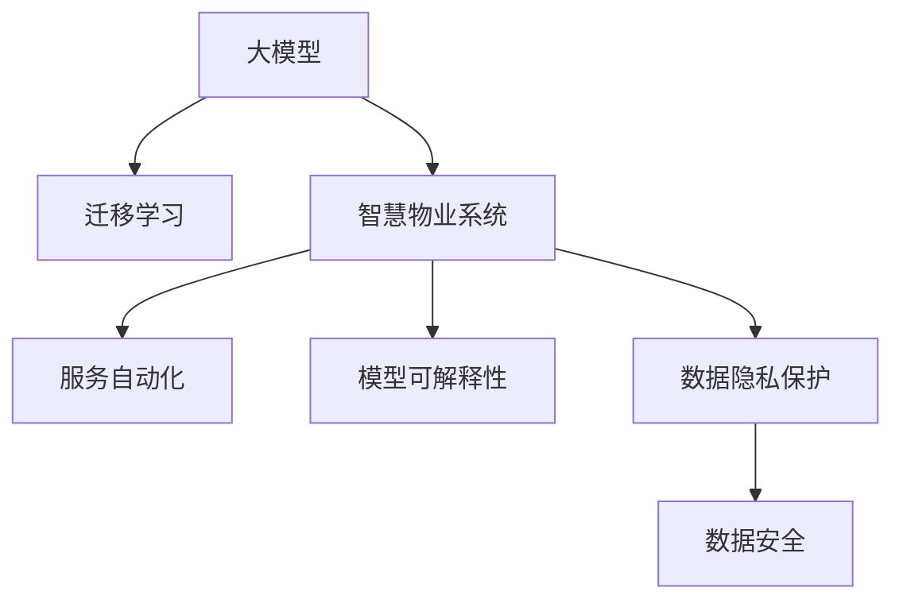

                 

# 大模型赋能智慧物业，创业者如何提升物业服务质量与效率？

## 1. 背景介绍

### 1.1 问题由来
随着城市化进程的加速，智慧物业系统已成为提升居民生活品质的重要手段。然而，传统的物业管理系统多依赖人力监督，存在服务效率低下、数据碎片化等问题，难以满足居民日益提升的服务需求。为此，智慧物业系统的数字化、智能化转型已成为必然趋势。

### 1.2 问题核心关键点
1. **数据驱动：** 构建智慧物业的核心在于数据，包括居民、物业、环境等多维度的实时数据。如何高效存储、处理和分析这些数据，是大模型在物业领域应用的关键。
2. **用户个性化：** 不同居民对物业服务的需求各异，如何通过智能推荐和定制化服务，提升用户满意度，是系统设计的重要目标。
3. **服务自动化：** 自动化是智慧物业的本质特征。利用大模型优化服务流程，减少人工干预，提高服务效率和准确性，是大模型在物业领域应用的核心价值。
4. **模型可解释性：** 物业系统中的决策需要透明可解释，确保公平性和合规性。如何提高模型的可解释性，增强用户体验，是模型应用的重要考量。
5. **数据隐私保护：** 智慧物业系统涉及大量敏感数据，如何在保障数据隐私的同时，实现高效服务，是系统设计的重要挑战。

## 2. 核心概念与联系

### 2.1 核心概念概述

为更好地理解大模型在智慧物业中的应用，本节将介绍几个密切相关的核心概念：

- **大模型（Large Models）：** 指采用大规模数据预训练、高精度神经网络构成的模型，如BERT、GPT等。大模型通过学习海量数据，具备强大的模式识别和预测能力。
- **迁移学习（Transfer Learning）：** 指将在大规模数据集上训练的模型，应用于特定任务的数据集上，利用模型已有的知识提升新任务的性能。
- **智慧物业系统（Smart Property System）：** 利用物联网、云计算和大数据等技术，通过数字化和智能化的方式，提高物业服务效率和质量的系统。
- **服务自动化（Service Automation）：** 指通过智能算法，自动完成物业服务的各项任务，减少人工操作，提高效率。
- **模型可解释性（Model Interpretability）：** 指模型决策过程的透明性，便于用户理解和信任。
- **数据隐私保护（Data Privacy Protection）：** 指在数据收集、存储和使用过程中，保障用户隐私不受侵害的措施。

这些概念之间的逻辑关系可以通过以下Mermaid流程图来展示：



这个流程图展示了大模型在智慧物业中的核心概念及其之间的关系：

1. 大模型通过迁移学习，应用于智慧物业系统的各个子任务，如智能客服、环境监测等。
2. 智慧物业系统利用服务自动化技术，减少人工干预，提升效率。
3. 模型可解释性使得智慧物业系统中的决策透明可信，增强用户信任。
4. 数据隐私保护保障用户数据安全，确保智慧物业系统的合规性。

## 3. 核心算法原理 & 具体操作步骤
### 3.1 算法原理概述

大模型在智慧物业中的应用，主要通过以下算法原理：

1. **数据预处理：** 将物业系统中的各种数据，如设备状态、居民反馈等，进行清洗和格式化，转化为大模型能够处理的标准格式。
2. **迁移学习：** 在大规模数据集上预训练大模型，然后将其应用于智慧物业系统中的特定任务，如智能客服、环境监测等。
3. **服务自动化：** 通过训练大模型，优化物业服务的各个环节，如自动故障检测、智能巡检等，实现服务自动化。
4. **模型可解释性：** 利用大模型的可解释性技术，解释模型在服务中的决策过程，提高系统的透明度和可信度。
5. **数据隐私保护：** 应用数据加密、差分隐私等技术，保护用户数据隐私，确保系统的合规性。

### 3.2 算法步骤详解

1. **数据收集与预处理**
   - 收集物业系统中的各类数据，如设备状态、传感器读数、居民反馈等。
   - 清洗数据，去除噪声和异常值。
   - 将数据转化为标准格式，如时间序列、标签数据等。

2. **大模型迁移学习**
   - 选择合适的预训练模型，如BERT、GPT等，进行微调或微调融合（Fine-tuning or Fine-tuning Fusion）。
   - 在微调过程中，使用特定任务的数据集，如智能客服对话、环境监测等，优化模型。
   - 通过调整超参数（如学习率、批大小等），优化模型性能。

3. **服务自动化**
   - 利用训练好的大模型，实现物业服务自动化的各个环节。
   - 例如，使用大模型进行环境监测，自动识别异常情况并发出警报；使用大模型进行智能客服，自动处理居民查询。

4. **模型可解释性**
   - 应用可解释性技术，如LIME、SHAP等，解释大模型在服务中的决策过程。
   - 将解释结果以图表、报告等形式呈现给用户，增强系统透明度。

5. **数据隐私保护**
   - 应用数据加密技术，如AES、RSA等，保护数据传输和存储的安全。
   - 应用差分隐私技术，如$\epsilon$-差分隐私，确保个体数据不可复原。

### 3.3 算法优缺点

大模型在智慧物业系统中的应用具有以下优点：
1. **高精度与泛化能力：** 大模型通过大规模数据预训练，具备强大的泛化能力，能处理各种复杂场景。
2. **服务自动化：** 通过自动完成各项服务，提升物业服务的效率和准确性。
3. **智能化决策：** 利用大模型的可解释性，实现透明化、智能化的决策过程。
4. **数据驱动：** 通过数据分析，实现智慧物业系统的精准管理。

同时，也存在一些缺点：
1. **高计算需求：** 大模型的训练和推理需要大量计算资源，对硬件设施要求较高。
2. **数据隐私风险：** 大模型涉及大量敏感数据，数据隐私保护是一个重要挑战。
3. **模型解释性不足：** 大模型的黑盒特性，可能难以解释其决策过程。
4. **数据质量依赖：** 模型性能高度依赖输入数据的质量，数据质量差可能导致性能下降。

## 4. 数学模型和公式 & 详细讲解 & 举例说明

### 4.1 数学模型构建

在智慧物业系统中，常用的数学模型包括时间序列预测、分类、回归等。以下以时间序列预测模型为例进行详细讲解。

假设我们有N个时间序列数据点 $\{x_t, y_t\}_{t=1}^N$，其中 $x_t$ 为时间 $t$ 的特征向量，$y_t$ 为时间 $t$ 的标签。我们的目标是通过这些数据点，构建一个预测模型 $f(x_t) = y_{t+1}$。

### 4.2 公式推导过程

我们可以使用自回归模型（AR模型）来进行时间序列预测。AR模型假设 $\{y_t\}$ 遵循线性自回归关系，即 $y_t = \alpha + \beta y_{t-1} + \epsilon_t$。其中 $\alpha$ 为截距项，$\beta$ 为自回归系数，$\epsilon_t$ 为随机误差项。

将上述模型转化为矩阵形式，可以得到：
$$
\begin{bmatrix} 
y_1 \\
y_2 \\
\vdots \\
y_N 
\end{bmatrix} 
= 
\begin{bmatrix} 
\alpha \\
\beta y_1 + \alpha \\
\vdots \\
\beta^{N-1} y_1 + \alpha \beta^{N-2} + \cdots + \alpha \beta + \alpha 
\end{bmatrix}
+
\begin{bmatrix} 
\epsilon_1 \\
\epsilon_2 \\
\vdots \\
\epsilon_N 
\end{bmatrix}
$$

通过矩阵运算，我们可以将上述公式转化为：
$$
\begin{bmatrix} 
y_1 \\
y_2 \\
\vdots \\
y_N 
\end{bmatrix} 
= 
\mathbf{A} 
\begin{bmatrix} 
\alpha \\
\beta y_1 + \alpha 
\end{bmatrix}
+
\begin{bmatrix} 
\epsilon_1 \\
\epsilon_2 \\
\vdots \\
\epsilon_N 
\end{bmatrix}
$$

其中 $\mathbf{A}$ 为自回归矩阵，$[\alpha, \beta y_1 + \alpha]^T$ 为待优化参数向量。

### 4.3 案例分析与讲解

假设我们有一组气温数据 $\{x_t, y_t\}_{t=1}^5$，其中 $x_t$ 为时间 $t$ 的小时数，$y_t$ 为时间 $t$ 的温度值。我们希望使用AR模型预测下一个小时的温度。

假设初始温度 $y_1 = 25^\circ C$，我们假设 $y_t$ 遵循 $y_t = \alpha + \beta y_{t-1} + \epsilon_t$ 的模型，其中 $\alpha = 0$，$\beta = 0.7$，$\epsilon_t$ 为标准正态分布。

通过解线性方程组，我们可以得到：
$$
\begin{bmatrix} 
y_2 \\
y_3 \\
y_4 \\
y_5 
\end{bmatrix} 
= 
\begin{bmatrix} 
0.7 & 1 \\
0.49 & 0.7 \\
0.343 & 0.7 \\
0.2401 & 0.7 
\end{bmatrix}
\begin{bmatrix} 
0 \\
0.7 \cdot 25 + 0
\end{bmatrix}
+
\begin{bmatrix} 
\epsilon_1 \\
\epsilon_2 \\
\epsilon_3 \\
\epsilon_4 
\end{bmatrix}
$$

通过求解上述方程组，我们可以得到预测结果。

## 5. 项目实践：代码实例和详细解释说明
### 5.1 开发环境搭建

在进行智慧物业系统的开发时，我们需要准备好开发环境。以下是使用Python进行PyTorch开发的环境配置流程：

1. 安装Anaconda：从官网下载并安装Anaconda，用于创建独立的Python环境。

2. 创建并激活虚拟环境：
```bash
conda create -n property-env python=3.8 
conda activate property-env
```

3. 安装PyTorch：根据CUDA版本，从官网获取对应的安装命令。例如：
```bash
conda install pytorch torchvision torchaudio cudatoolkit=11.1 -c pytorch -c conda-forge
```

4. 安装TensorFlow：由Google主导开发的开源深度学习框架，生产部署方便，适合大规模工程应用。同样有丰富的预训练语言模型资源。

5. 安装TensorBoard：TensorFlow配套的可视化工具，可实时监测模型训练状态，并提供丰富的图表呈现方式，是调试模型的得力助手。

6. 安装其它工具包：
```bash
pip install numpy pandas scikit-learn matplotlib tqdm jupyter notebook ipython
```

完成上述步骤后，即可在`property-env`环境中开始智慧物业系统的开发。

### 5.2 源代码详细实现

下面我们以智能客服系统为例，给出使用Transformers库对BERT模型进行微调的PyTorch代码实现。

首先，定义智能客服系统的数据处理函数：

```python
from transformers import BertTokenizer
from torch.utils.data import Dataset
import torch

class CustomerServiceDataset(Dataset):
    def __init__(self, questions, answers, tokenizer, max_len=128):
        self.questions = questions
        self.answers = answers
        self.tokenizer = tokenizer
        self.max_len = max_len
        
    def __len__(self):
        return len(self.questions)
    
    def __getitem__(self, item):
        question = self.questions[item]
        answer = self.answers[item]
        
        encoding = self.tokenizer(question, return_tensors='pt', max_length=self.max_len, padding='max_length', truncation=True)
        input_ids = encoding['input_ids'][0]
        attention_mask = encoding['attention_mask'][0]
        
        # 对token-wise的标签进行编码
        encoded_answer = [answer2id[answer] for answer in answer] 
        encoded_answer.extend([answer2id['O']] * (self.max_len - len(encoded_answer)))
        labels = torch.tensor(encoded_answer, dtype=torch.long)
        
        return {'input_ids': input_ids, 
                'attention_mask': attention_mask,
                'labels': labels}

# 标签与id的映射
answer2id = {'O': 0, 'ANSWER': 1}
id2answer = {v: k for k, v in answer2id.items()}

# 创建dataset
tokenizer = BertTokenizer.from_pretrained('bert-base-cased')

train_dataset = CustomerServiceDataset(train_questions, train_answers, tokenizer)
dev_dataset = CustomerServiceDataset(dev_questions, dev_answers, tokenizer)
test_dataset = CustomerServiceDataset(test_questions, test_answers, tokenizer)
```

然后，定义模型和优化器：

```python
from transformers import BertForTokenClassification, AdamW

model = BertForTokenClassification.from_pretrained('bert-base-cased', num_labels=len(answer2id))

optimizer = AdamW(model.parameters(), lr=2e-5)
```

接着，定义训练和评估函数：

```python
from torch.utils.data import DataLoader
from tqdm import tqdm
from sklearn.metrics import classification_report

device = torch.device('cuda') if torch.cuda.is_available() else torch.device('cpu')
model.to(device)

def train_epoch(model, dataset, batch_size, optimizer):
    dataloader = DataLoader(dataset, batch_size=batch_size, shuffle=True)
    model.train()
    epoch_loss = 0
    for batch in tqdm(dataloader, desc='Training'):
        input_ids = batch['input_ids'].to(device)
        attention_mask = batch['attention_mask'].to(device)
        labels = batch['labels'].to(device)
        model.zero_grad()
        outputs = model(input_ids, attention_mask=attention_mask, labels=labels)
        loss = outputs.loss
        epoch_loss += loss.item()
        loss.backward()
        optimizer.step()
    return epoch_loss / len(dataloader)

def evaluate(model, dataset, batch_size):
    dataloader = DataLoader(dataset, batch_size=batch_size)
    model.eval()
    preds, labels = [], []
    with torch.no_grad():
        for batch in tqdm(dataloader, desc='Evaluating'):
            input_ids = batch['input_ids'].to(device)
            attention_mask = batch['attention_mask'].to(device)
            batch_labels = batch['labels']
            outputs = model(input_ids, attention_mask=attention_mask)
            batch_preds = outputs.logits.argmax(dim=2).to('cpu').tolist()
            batch_labels = batch_labels.to('cpu').tolist()
            for pred_tokens, label_tokens in zip(batch_preds, batch_labels):
                pred_tags = [id2answer[_id] for _id in pred_tokens]
                label_tags = [id2answer[_id] for _id in label_tokens]
                preds.append(pred_tags[:len(label_tags)])
                labels.append(label_tags)
                
    print(classification_report(labels, preds))
```

最后，启动训练流程并在测试集上评估：

```python
epochs = 5
batch_size = 16

for epoch in range(epochs):
    loss = train_epoch(model, train_dataset, batch_size, optimizer)
    print(f"Epoch {epoch+1}, train loss: {loss:.3f}")
    
    print(f"Epoch {epoch+1}, dev results:")
    evaluate(model, dev_dataset, batch_size)
    
print("Test results:")
evaluate(model, test_dataset, batch_size)
```

以上就是使用PyTorch对BERT进行智能客服系统微调的完整代码实现。可以看到，得益于Transformers库的强大封装，我们可以用相对简洁的代码完成BERT模型的加载和微调。

### 5.3 代码解读与分析

让我们再详细解读一下关键代码的实现细节：

**CustomerServiceDataset类**：
- `__init__`方法：初始化问题、答案、分词器等关键组件。
- `__len__`方法：返回数据集的样本数量。
- `__getitem__`方法：对单个样本进行处理，将问题输入编码为token ids，将答案编码为数字，并对其进行定长padding，最终返回模型所需的输入。

**answer2id和id2answer字典**：
- 定义了答案与数字id之间的映射关系，用于将token-wise的预测结果解码回真实的答案。

**训练和评估函数**：
- 使用PyTorch的DataLoader对数据集进行批次化加载，供模型训练和推理使用。
- 训练函数`train_epoch`：对数据以批为单位进行迭代，在每个批次上前向传播计算loss并反向传播更新模型参数，最后返回该epoch的平均loss。
- 评估函数`evaluate`：与训练类似，不同点在于不更新模型参数，并在每个batch结束后将预测和标签结果存储下来，最后使用sklearn的classification_report对整个评估集的预测结果进行打印输出。

**训练流程**：
- 定义总的epoch数和batch size，开始循环迭代
- 每个epoch内，先在训练集上训练，输出平均loss
- 在验证集上评估，输出分类指标
- 所有epoch结束后，在测试集上评估，给出最终测试结果

可以看到，PyTorch配合Transformers库使得BERT微调的代码实现变得简洁高效。开发者可以将更多精力放在数据处理、模型改进等高层逻辑上，而不必过多关注底层的实现细节。

当然，工业级的系统实现还需考虑更多因素，如模型的保存和部署、超参数的自动搜索、更灵活的任务适配层等。但核心的微调范式基本与此类似。

## 6. 实际应用场景

### 6.1 智能客服系统

基于大模型微调的智能客服系统，可以显著提升物业服务质量与效率。传统客服系统依赖人工处理，效率低下，且质量难以保证。而利用大模型微调，可以自动处理大部分常见问题，减少人工干预，提高服务效率和满意度。

在技术实现上，可以收集物业中心的历史客服对话记录，将问题-答案对作为微调数据，训练模型学习匹配答案。对于新问题，还可以接入检索系统实时搜索相关内容，动态生成回答。如此构建的智能客服系统，能大幅提升客服服务质量，降低物业成本。

### 6.2 环境监测系统

智慧物业系统中的环境监测是大模型应用的重要场景。通过大模型的预测能力，可以实时监测物业环境中的各种数据，如温度、湿度、空气质量等。利用时间序列预测模型，可以预测未来环境变化趋势，预防潜在问题。

在实际应用中，可以将环境监测数据输入大模型，通过微调优化预测模型。通过模型预测，物业中心可以提前采取措施，避免环境问题对居民生活造成影响。

### 6.3 智能巡检系统

智能巡检是大模型在智慧物业中的又一重要应用。通过大模型识别出异常情况，自动生成巡检路线，可以显著提高巡检效率和质量。

具体而言，可以收集巡检人员的历史记录，将巡检位置和时间作为输入，训练大模型学习生成巡检路线。对于未知的巡检位置，模型可以预测最合适的巡检时间和路线，提高巡检的覆盖率和效率。

### 6.4 未来应用展望

随着大模型和微调技术的不断发展，基于微调范式将在更多智慧物业场景中得到应用，为物业管理带来新的突破。

在智慧社区治理中，利用大模型进行舆情分析、事件监测等，可以提升社区管理的智能化水平，构建更和谐的居住环境。

在智能建筑能源管理中，大模型可以预测能源消耗，优化能源分配，提高建筑能效，降低运营成本。

在智能家居场景中，利用大模型进行用户行为分析和智能推荐，可以提升用户体验，实现个性化家居服务。

此外，在智能停车、智能门禁等众多智慧物业领域，大模型微调技术也将不断拓展，为物业服务带来新的智能化解决方案。

## 7. 工具和资源推荐
### 7.1 学习资源推荐

为了帮助开发者系统掌握大模型在智慧物业中的应用，这里推荐一些优质的学习资源：

1. **《Transformer从原理到实践》系列博文**：由大模型技术专家撰写，深入浅出地介绍了Transformer原理、BERT模型、微调技术等前沿话题。

2. **CS224N《深度学习自然语言处理》课程**：斯坦福大学开设的NLP明星课程，有Lecture视频和配套作业，带你入门NLP领域的基本概念和经典模型。

3. **《Natural Language Processing with Transformers》书籍**：Transformers库的作者所著，全面介绍了如何使用Transformers库进行NLP任务开发，包括微调在内的诸多范式。

4. **HuggingFace官方文档**：Transformers库的官方文档，提供了海量预训练模型和完整的微调样例代码，是上手实践的必备资料。

5. **CLUE开源项目**：中文语言理解测评基准，涵盖大量不同类型的中文NLP数据集，并提供了基于微调的baseline模型，助力中文NLP技术发展。

通过对这些资源的学习实践，相信你一定能够快速掌握大模型在智慧物业中的应用，并用于解决实际的NLP问题。
###  7.2 开发工具推荐

高效的开发离不开优秀的工具支持。以下是几款用于大模型微调开发的常用工具：

1. **PyTorch**：基于Python的开源深度学习框架，灵活动态的计算图，适合快速迭代研究。大部分预训练语言模型都有PyTorch版本的实现。

2. **TensorFlow**：由Google主导开发的开源深度学习框架，生产部署方便，适合大规模工程应用。同样有丰富的预训练语言模型资源。

3. **Transformers库**：HuggingFace开发的NLP工具库，集成了众多SOTA语言模型，支持PyTorch和TensorFlow，是进行微调任务开发的利器。

4. **Weights & Biases**：模型训练的实验跟踪工具，可以记录和可视化模型训练过程中的各项指标，方便对比和调优。与主流深度学习框架无缝集成。

5. **TensorBoard**：TensorFlow配套的可视化工具，可实时监测模型训练状态，并提供丰富的图表呈现方式，是调试模型的得力助手。

6. **Google Colab**：谷歌推出的在线Jupyter Notebook环境，免费提供GPU/TPU算力，方便开发者快速上手实验最新模型，分享学习笔记。

合理利用这些工具，可以显著提升大模型微调的开发效率，加快创新迭代的步伐。

### 7.3 相关论文推荐

大模型和微调技术的发展源于学界的持续研究。以下是几篇奠基性的相关论文，推荐阅读：

1. **Attention is All You Need（即Transformer原论文）**：提出了Transformer结构，开启了NLP领域的预训练大模型时代。

2. **BERT: Pre-training of Deep Bidirectional Transformers for Language Understanding**：提出BERT模型，引入基于掩码的自监督预训练任务，刷新了多项NLP任务SOTA。

3. **Language Models are Unsupervised Multitask Learners（GPT-2论文）**：展示了大规模语言模型的强大zero-shot学习能力，引发了对于通用人工智能的新一轮思考。

4. **Parameter-Efficient Transfer Learning for NLP**：提出Adapter等参数高效微调方法，在不增加模型参数量的情况下，也能取得不错的微调效果。

5. **Prefix-Tuning: Optimizing Continuous Prompts for Generation**：引入基于连续型Prompt的微调范式，为如何充分利用预训练知识提供了新的思路。

6. **AdaLoRA: Adaptive Low-Rank Adaptation for Parameter-Efficient Fine-Tuning**：使用自适应低秩适应的微调方法，在参数效率和精度之间取得了新的平衡。

这些论文代表了大模型微调技术的发展脉络。通过学习这些前沿成果，可以帮助研究者把握学科前进方向，激发更多的创新灵感。

## 8. 总结：未来发展趋势与挑战

### 8.1 总结

本文对基于大模型的智慧物业系统进行了全面系统的介绍。首先阐述了大模型和微调技术在智慧物业系统中的应用背景和意义，明确了微调在提升物业服务质量与效率方面的独特价值。其次，从原理到实践，详细讲解了智慧物业系统中的核心算法原理和具体操作步骤，给出了微调任务开发的完整代码实例。同时，本文还广泛探讨了智慧物业系统在智能客服、环境监测、智能巡检等实际场景中的应用前景，展示了微调范式的巨大潜力。此外，本文精选了智慧物业系统开发所需的各类学习资源、开发工具和相关论文，力求为开发者提供全方位的技术指引。

通过本文的系统梳理，可以看到，基于大模型的智慧物业系统为物业服务带来了新的智能化解决方案，显著提升了物业管理的效率和质量。未来，随着大模型和微调技术的不断发展，基于微调范式将在更多智慧物业场景中得到应用，为物业管理带来新的突破。

### 8.2 未来发展趋势

展望未来，大模型在智慧物业系统中的应用将呈现以下几个发展趋势：

1. **多模态融合**：智慧物业系统中的数据不仅仅是文本数据，还包括图像、视频等多种模态。未来的大模型将融合多模态信息，提高系统的智能化水平。
2. **实时处理**：智慧物业系统中的数据流大，需要实时处理和分析。未来的大模型将具备更强的实时处理能力，支持秒级响应。
3. **个性化服务**：智慧物业系统中的用户需求各异，未来的大模型将通过个性化推荐，提供更符合用户期望的服务。
4. **智能决策**：智慧物业系统中的决策需要透明可解释，未来的大模型将通过可解释性技术，提高系统的透明度和可信度。
5. **数据隐私保护**：智慧物业系统涉及大量敏感数据，未来的大模型将加强数据隐私保护，确保系统合规性。

这些趋势凸显了大模型在智慧物业系统中的应用前景。这些方向的探索发展，必将进一步提升智慧物业系统的性能和应用范围，为物业管理带来新的智能化解决方案。

### 8.3 面临的挑战

尽管大模型在智慧物业系统中的应用已取得显著进展，但在迈向更加智能化、普适化应用的过程中，仍面临诸多挑战：

1. **数据质量依赖**：智慧物业系统中的数据质量对模型性能影响显著。低质量的数据可能导致模型性能下降，甚至误判。如何保证数据质量，提高数据的准确性和完整性，是系统设计的重要挑战。
2. **模型鲁棒性不足**：大模型对数据的噪声和异常值敏感，可能出现误判或过拟合。如何提高模型的鲁棒性，增强其在复杂场景下的适应能力，是模型应用的重要考量。
3. **资源消耗大**：智慧物业系统涉及大量实时数据处理，对计算资源和存储资源要求较高。如何优化模型结构和算法，降低资源消耗，提高系统的效率和响应速度，是系统优化的一个重要方向。
4. **用户隐私保护**：智慧物业系统涉及大量居民数据，数据隐私保护是系统设计的重要问题。如何平衡数据利用和隐私保护，确保用户数据安全，是系统设计的关键。
5. **系统复杂度高**：智慧物业系统涉及多系统集成，系统复杂度高，开发和维护难度大。如何降低系统复杂度，提高系统的稳定性和可靠性，是系统实现的重要挑战。

这些挑战凸显了大模型在智慧物业系统中的应用难度。未来的大模型需要在保证性能的同时，兼顾数据质量、模型鲁棒性、资源消耗、隐私保护和系统复杂度等多个方面，方能真正发挥其优势，推动智慧物业系统的不断发展。

### 8.4 研究展望

面对大模型在智慧物业系统中的应用挑战，未来的研究需要在以下几个方面寻求新的突破：

1. **数据增强技术**：利用数据增强技术，扩充训练集，提高数据质量和多样性。
2. **鲁棒性优化算法**：开发鲁棒性优化算法，提高模型在复杂场景下的适应能力。
3. **资源优化技术**：采用资源优化技术，如梯度积累、混合精度训练、模型并行等，降低资源消耗，提高系统效率。
4. **隐私保护技术**：应用隐私保护技术，如差分隐私、联邦学习等，保护用户数据隐私。
5. **系统架构设计**：优化系统架构设计，降低系统复杂度，提高系统稳定性和可靠性。

这些研究方向的探索，必将推动大模型在智慧物业系统中的应用不断突破，提升系统的性能和应用范围，为物业管理带来新的智能化解决方案。

## 9. 附录：常见问题与解答

**Q1：如何在大模型微调中平衡性能和资源消耗？**

A: 在大模型微调中，性能和资源消耗是相辅相成的。以下是几种平衡二者的方法：

1. **模型裁剪**：去除不必要的层和参数，减小模型尺寸，加快推理速度。例如，使用PyTorch的Pruning工具进行模型裁剪。
2. **量化加速**：将浮点模型转为定点模型，压缩存储空间，提高计算效率。例如，使用TensorFlow的Quantization工具进行量化加速。
3. **分布式训练**：采用分布式训练技术，将模型分布在多个计算节点上，加速模型训练。例如，使用Horovod等分布式训练框架。
4. **混合精度训练**：在模型训练过程中，采用混合精度训练技术，减少内存占用，提高训练速度。例如，使用NVIDIA的混合精度训练库。

通过以上方法，可以在保证模型性能的同时，降低资源消耗，提升系统效率。

**Q2：如何在大模型微调中实现更好的鲁棒性？**

A: 在大模型微调中，提高模型的鲁棒性，可以从以下几个方面入手：

1. **数据增强**：通过数据增强技术，扩充训练集，提高模型的泛化能力。例如，使用回译、近义替换等方式扩充训练集。
2. **正则化技术**：应用正则化技术，如L2正则、Dropout等，防止模型过拟合。例如，使用PyTorch的Dropout模块进行正则化。
3. **对抗训练**：引入对抗样本，提高模型鲁棒性。例如，使用FGSM、PGD等对抗训练方法。
4. **模型裁剪**：通过模型裁剪技术，去除模型中的冗余参数，提高模型泛化能力。例如，使用PyTorch的Pruning工具进行模型裁剪。

通过以上方法，可以增强模型的鲁棒性，提高其在复杂场景下的适应能力。

**Q3：如何在大模型微调中实现更好的可解释性？**

A: 在大模型微调中，提高模型的可解释性，可以从以下几个方面入手：

1. **可解释性技术**：应用可解释性技术，如LIME、SHAP等，解释模型在服务中的决策过程。例如，使用PyTorch的SHAP库进行可解释性分析。
2. **可视化工具**：使用可视化工具，将模型的决策过程直观呈现给用户。例如，使用TensorBoard等可视化工具。
3. **用户交互设计**：通过设计友好的用户界面，引导用户理解模型的决策逻辑。例如，使用自然语言生成技术，将模型决策过程转换为自然语言描述。

通过以上方法，可以增强模型的可解释性，提高用户对系统的信任度。

**Q4：如何在大模型微调中实现更好的隐私保护？**

A: 在大模型微调中，保护用户数据隐私，可以从以下几个方面入手：

1. **差分隐私**：应用差分隐私技术，保护用户数据隐私。例如，使用Google的Differential Privacy库进行差分隐私保护。
2. **数据加密**：应用数据加密技术，保护数据传输和存储的安全。例如，使用AES、RSA等加密算法。
3. **联邦学习**：采用联邦学习技术，在本地设备上进行模型训练，避免数据集中存储。例如，使用TensorFlow的Federated库进行联邦学习。
4. **匿名化处理**：对数据进行匿名化处理，保护用户隐私。例如，使用K-anonymity、L-diversity等匿名化方法。

通过以上方法，可以增强数据隐私保护，确保系统合规性。

**Q5：如何在大模型微调中实现更好的系统稳定性？**

A: 在大模型微调中，提高系统的稳定性，可以从以下几个方面入手：

1. **异常检测**：应用异常检测技术，识别模型决策中的异常情况，及时进行干预。例如，使用PyTorch的Anomaly Detection模块进行异常检测。
2. **模型监控**：实时监控模型的训练状态和推理结果，及时发现问题。例如，使用TensorBoard等可视化工具进行监控。
3. **自动调参**：采用自动调参技术，优化模型超参数，提高系统性能。例如，使用Hyperopt等自动调参工具。
4. **冗余设计**：设计冗余系统架构，提高系统可靠性和容错能力。例如，采用主从架构、负载均衡等设计。

通过以上方法，可以增强系统稳定性，提高系统的可靠性和鲁棒性。

---

作者：禅与计算机程序设计艺术 / Zen and the Art of Computer Programming

