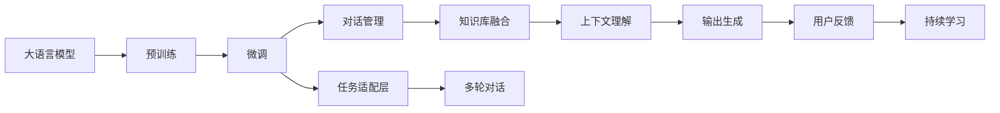

                 

# 大模型问答机器人的灵活互动

> 关键词：大语言模型, 问答系统, 对话交互, 自然语言处理(NLP), 多轮对话, 参数高效微调, 对话管理, 知识库融合, 上下文理解

## 1. 背景介绍

### 1.1 问题由来
随着人工智能技术的迅猛发展，人工智能在各行各业的应用不断深入。其中，智能问答系统作为一种能够自动回答用户问题的AI系统，因其高效、精准、自然的人机交互方式，越来越受到广泛关注。然而，传统的基于规则的问答系统往往需要人工编写大量规则和模板，且难以处理复杂或未知问题，而传统的基于机器学习的问答系统又难以克服语言多样性和复杂性的限制。

近年来，基于深度学习的大语言模型在自然语言处理(NLP)领域取得了重大突破，尤其是在预训练语言模型上。如GPT-3、BERT等模型，通过大规模无监督学习，获得了丰富的语言知识和语义理解能力。这些大语言模型可以处理多种语言，理解和生成自然语言，且随着预训练数据和计算能力的不断提升，其在问答系统中的应用也得到了不断探索和应用。

本文聚焦于基于大语言模型的问答系统，将探讨如何通过预训练模型进行微调，构建灵活互动的智能问答机器人，以期在大规模无标签数据上进行预训练后，通过少量有标签数据进行微调，从而实现高效、灵活的问答交互。

### 1.2 问题核心关键点
基于大语言模型的问答系统，其核心在于如何设计任务适配层，利用微调后的模型来生成高质量的对话内容，构建灵活的对话管理机制，并有效整合外部知识库。以下列举了问答系统构建的核心问题：

- 如何选择合适的预训练模型和微调方法，保证问答系统性能。
- 如何设计合适的任务适配层，适应不同领域和任务需求。
- 如何实现高效、灵活的对话管理，引导对话流程。
- 如何整合外部知识库，丰富对话内容。
- 如何提升问答系统的可解释性，增强用户信任感。

针对上述问题，本文将系统地介绍大语言模型在问答系统中的应用，从核心概念、算法原理、具体的操作步骤、数学模型构建、项目实践、实际应用场景、工具和资源推荐等方面，深入探讨大模型问答机器人如何实现灵活互动。

## 2. 核心概念与联系

### 2.1 核心概念概述

为更好地理解基于大语言模型的问答系统，本节将介绍几个关键概念及其联系：

- 大语言模型(Large Language Model, LLM)：如GPT-3、BERT等，通过大规模无监督学习，学习到丰富的语言知识和语义理解能力。

- 问答系统(Question Answering, QA)：能够自动回答用户问题的AI系统，广泛应用于客户服务、智能客服、知识图谱等领域。

- 对话交互(Dialgoical Interaction)：通过多轮对话，实现人机自然交互，智能问答系统即是一种基于对话交互的AI系统。

- 多轮对话(Multi-turn Dialogue)：问答系统能够通过多轮对话理解用户意图，提供精准回答，提升用户体验。

- 参数高效微调(Parameter-Efficient Fine-Tuning, PEFT)：只调整少量的模型参数，保留预训练的大多数参数，以提高微调效率和效果。

- 对话管理(Dialog Management)：设计灵活的对话流程，引导对话走向，保证问答系统的正常运行。

- 知识库(Knowledge Base)：整合各类外部知识源，如数据库、百科全书、维基数据等，丰富对话内容。

- 上下文理解(Context Understanding)：理解对话历史和上下文信息，保证问答系统的连贯性和一致性。

这些核心概念共同构成了大模型问答系统的基础，通过相互关联、相互作用，可以构建灵活、高效、智能的问答系统。

### 2.2 核心概念原理和架构的 Mermaid 流程图

以下是核心概念的联系图，展示了大模型问答系统的原理和架构：



## 3. 核心算法原理 & 具体操作步骤

### 3.1 算法原理概述

基于大语言模型的问答系统，其核心算法原理基于监督学习的大规模语言模型微调。即利用大规模无标签数据进行预训练，获得基础的语言表示和语义理解能力；再利用少量有标签数据进行微调，实现对特定任务的处理，从而生成高质量的对话内容。

该算法原理主要包括以下几个步骤：

1. **数据准备**：准备问答系统所需的数据集，包括问答对、对话历史、知识库等。

2. **模型加载**：加载预训练好的大语言模型，作为问答系统的初始化参数。

3. **任务适配层设计**：设计任务适配层，根据任务类型调整模型输出，如分类任务、生成任务等。

4. **微调训练**：在任务适配层的基础上，利用有标签数据进行微调训练，优化模型参数，提高问答系统的准确性和流畅性。

5. **对话管理**：设计对话管理机制，引导对话走向，保证问答系统的正常运行。

6. **知识库融合**：将外部知识库中的知识整合到对话内容中，提高问答系统的丰富性和准确性。

7. **上下文理解**：理解对话历史和上下文信息，保证问答系统的连贯性和一致性。

8. **输出生成**：根据用户输入，生成高质量的对话内容，输出回答。

9. **用户反馈**：收集用户反馈，用于后续的微调和优化。

10. **持续学习**：利用新数据不断更新模型，提升问答系统的性能。

### 3.2 算法步骤详解

#### 3.2.1 数据准备

数据准备是大模型问答系统的基础，需要收集问答系统所需的数据集。具体包括：

- **问答对**：标注的问答对数据集，如SQuAD、CoQA等，是问答系统微调的基本训练数据。
- **对话历史**：对话历史数据集，记录了多轮对话的上下文信息，帮助模型理解对话语境。
- **知识库**：整合各类外部知识源，如数据库、百科全书、维基数据等，为问答系统提供丰富的知识储备。

#### 3.2.2 模型加载

在模型加载阶段，需要选择合适的预训练模型和微调方法。目前常用的预训练模型包括GPT-3、BERT等，这些模型在大规模无标签数据上进行预训练，获得了丰富的语言知识和语义理解能力。

加载模型时，可以使用不同的深度学习框架，如PyTorch、TensorFlow等，并调用相应的预训练模型库，如Hugging Face的Transformers库。

#### 3.2.3 任务适配层设计

任务适配层设计是问答系统微调的核心，其作用是根据任务类型调整模型输出。具体包括：

- **分类任务适配层**：如基于BERT的问答系统，可以在顶部添加一个全连接层，用于分类。
- **生成任务适配层**：如基于GPT-3的对话系统，可以在顶部添加一个解码器，用于生成对话内容。
- **综合任务适配层**：对于综合性的问答任务，可以设计综合的任务适配层，同时支持分类和生成任务。

#### 3.2.4 微调训练

微调训练是问答系统性能提升的关键，其核心在于利用有标签数据对模型进行优化。具体步骤包括：

- **损失函数设计**：选择合适的损失函数，如交叉熵损失、均方误差损失等，用于衡量模型输出与真实标签之间的差异。
- **优化器选择**：选择适合的语言模型优化器，如AdamW、SGD等，并设置学习率、批大小等参数。
- **正则化技术**：引入L2正则、Dropout、Early Stopping等正则化技术，防止模型过拟合。
- **对话数据增强**：通过回译、近义替换等方式，扩充训练数据集，提高模型的泛化能力。
- **对抗训练**：引入对抗样本，提高模型的鲁棒性。
- **参数高效微调**：只调整少量的模型参数，保留预训练的大多数参数，以提高微调效率和效果。

#### 3.2.5 对话管理

对话管理机制是大模型问答系统的核心，其作用是设计灵活的对话流程，引导对话走向，保证问答系统的正常运行。具体包括：

- **对话状态管理**：记录对话历史和上下文信息，更新对话状态。
- **意图识别**：通过意图识别模型，理解用户的意图，生成应答。
- **对话流程控制**：根据意图识别结果，控制对话流程，引导对话走向。

#### 3.2.6 知识库融合

知识库融合是将外部知识库中的知识整合到对话内容中，提高问答系统的丰富性和准确性。具体包括：

- **知识检索**：利用知识图谱、数据库等外部知识源，检索相关知识。
- **知识表示**：将知识表示为结构化的形式，便于模型理解和生成对话内容。
- **知识融合**：将知识与对话内容进行融合，生成丰富、准确的对话内容。

#### 3.2.7 上下文理解

上下文理解是确保问答系统连贯性和一致性的关键，其作用是理解对话历史和上下文信息。具体包括：

- **上下文向量生成**：利用预训练模型，生成对话历史和上下文的向量表示。
- **上下文信息提取**：提取对话历史和上下文的关键信息，用于生成应答。
- **上下文推理**：利用逻辑推理模型，推理上下文中的信息，生成应答。

#### 3.2.8 输出生成

输出生成是问答系统的最终环节，其作用是根据用户输入，生成高质量的对话内容，输出回答。具体包括：

- **文本生成**：利用语言模型，生成文本形式的对话内容。
- **语音合成**：利用语音合成技术，将文本转化为语音，进行人机交互。
- **多模态输出**：将文本、语音、图像等多模态信息进行融合，提供丰富的交互体验。

#### 3.2.9 用户反馈

用户反馈是问答系统持续学习的重要环节，其作用是收集用户反馈，用于后续的微调和优化。具体包括：

- **用户满意度**：收集用户的满意度反馈，评估问答系统的效果。
- **用户意图理解**：分析用户的意图，改进意图识别模型。
- **用户上下文理解**：分析用户的上下文信息，改进上下文理解模型。

#### 3.2.10 持续学习

持续学习是问答系统性能提升的关键，其作用是利用新数据不断更新模型，提升问答系统的性能。具体包括：

- **新数据采集**：收集新的问答数据和对话历史数据，用于持续学习。
- **模型更新**：利用新数据更新模型参数，提升问答系统的性能。
- **性能评估**：定期评估问答系统的性能，优化对话管理机制和知识库融合。

### 3.3 算法优缺点

#### 3.3.1 优点

- **高效性**：利用预训练模型，在少量有标签数据上进行微调，可以快速获得高质量的问答系统。
- **灵活性**：可以根据不同任务类型，灵活设计任务适配层，适应多种问答场景。
- **可扩展性**：可以通过参数高效微调技术，保留预训练的大多数参数，提高微调效率和效果。
- **丰富性**：可以通过知识库融合技术，整合外部知识，丰富对话内容。
- **连贯性**：可以通过上下文理解技术，理解对话历史和上下文信息，保证问答系统的连贯性和一致性。

#### 3.3.2 缺点

- **依赖标注数据**：微调过程中需要依赖标注数据，对于标注数据不足的应用场景，可能难以获得理想效果。
- **泛化能力有限**：微调模型面对域外数据时，泛化性能往往较差，需要进行进一步优化。
- **可解释性不足**：微调模型往往缺乏可解释性，难以理解其内部工作机制和决策逻辑。
- **鲁棒性不足**：微调模型对输入数据的微小扰动可能敏感，容易发生波动。
- **安全性问题**：预训练模型可能包含有害信息，通过微调传递到问答系统中，可能带来安全隐患。

## 4. 数学模型和公式 & 详细讲解 & 举例说明

### 4.1 数学模型构建

假设问答系统使用的预训练模型为$M_{\theta}$，其中$\theta$为预训练得到的模型参数。给定问答数据集$D=\{(x_i,y_i)\}_{i=1}^N$，其中$x_i$为问题，$y_i$为答案，微调的目标是找到新的模型参数$\hat{\theta}$，使得模型在问答任务上的表现最佳。

微调的优化目标是最小化经验风险，即：

$$
\hat{\theta}=\mathop{\arg\min}_{\theta} \mathcal{L}(M_{\theta},D)
$$

其中$\mathcal{L}$为损失函数，用于衡量模型预测输出与真实标签之间的差异。

假设问答任务的损失函数为$\ell$，则经验风险为：

$$
\mathcal{L}(\theta) = \frac{1}{N}\sum_{i=1}^N \ell(M_{\theta}(x_i),y_i)
$$

在训练过程中，利用梯度下降等优化算法，最小化损失函数$\mathcal{L}$，更新模型参数$\theta$。

### 4.2 公式推导过程

以分类任务为例，假设模型输出$\hat{y}=M_{\theta}(x)$，表示样本属于正类的概率。真实标签$y \in \{0,1\}$。二分类交叉熵损失函数定义为：

$$
\ell(M_{\theta}(x),y) = -[y\log \hat{y} + (1-y)\log (1-\hat{y})]
$$

将其代入经验风险公式，得：

$$
\mathcal{L}(\theta) = -\frac{1}{N}\sum_{i=1}^N [y_i\log M_{\theta}(x_i)+(1-y_i)\log(1-M_{\theta}(x_i))]
$$

根据链式法则，损失函数对参数$\theta_k$的梯度为：

$$
\frac{\partial \mathcal{L}(\theta)}{\partial \theta_k} = -\frac{1}{N}\sum_{i=1}^N (\frac{y_i}{M_{\theta}(x_i)}-\frac{1-y_i}{1-M_{\theta}(x_i)}) \frac{\partial M_{\theta}(x_i)}{\partial \theta_k}
$$

其中$\frac{\partial M_{\theta}(x_i)}{\partial \theta_k}$可进一步递归展开，利用自动微分技术完成计算。

在得到损失函数的梯度后，即可带入参数更新公式，完成模型的迭代优化。重复上述过程直至收敛，最终得到适应问答任务的最优模型参数$\hat{\theta}$。

### 4.3 案例分析与讲解

#### 4.3.1 案例一：基于BERT的问答系统

假设我们有一个问答数据集$D$，包含多个问答对，其中每个问题$x_i$和对应的答案$y_i$。我们的目标是通过微调BERT模型，使其能够回答用户的问题。

1. **数据准备**：收集问答数据集$D$，包括问题和对应的答案。
2. **模型加载**：使用Hugging Face的Transformers库，加载预训练的BERT模型。
3. **任务适配层设计**：在顶部添加一个线性分类器，用于分类。
4. **微调训练**：定义损失函数，如交叉熵损失，使用AdamW优化器，设置学习率、批大小等参数。
5. **对话管理**：设计对话流程，控制对话走向。
6. **知识库融合**：整合外部知识库，丰富对话内容。
7. **上下文理解**：利用BERT生成对话历史和上下文的向量表示，提取关键信息。
8. **输出生成**：利用BERT生成文本形式的对话内容。
9. **用户反馈**：收集用户满意度反馈，改进模型。
10. **持续学习**：利用新数据不断更新模型，提升性能。

#### 4.3.2 案例二：基于GPT-3的对话系统

假设我们需要构建一个对话系统，能够与用户进行多轮对话，生成自然流畅的回复。

1. **数据准备**：收集对话数据集$D$，包括对话历史和用户的意图。
2. **模型加载**：使用OpenAI的GPT-3模型，作为初始化参数。
3. **任务适配层设计**：在顶部添加一个解码器，用于生成对话内容。
4. **微调训练**：定义损失函数，如负对数似然损失，使用AdamW优化器，设置学习率、批大小等参数。
5. **对话管理**：设计对话流程，控制对话走向。
6. **知识库融合**：整合外部知识库，丰富对话内容。
7. **上下文理解**：利用GPT-3生成对话历史和上下文的向量表示，提取关键信息。
8. **输出生成**：利用GPT-3生成文本形式的对话内容，进行语音合成。
9. **用户反馈**：收集用户满意度反馈，改进模型。
10. **持续学习**：利用新数据不断更新模型，提升性能。

## 5. 项目实践：代码实例和详细解释说明

### 5.1 开发环境搭建

在进行大模型问答系统的开发前，我们需要准备好开发环境。以下是使用Python进行PyTorch开发的环境配置流程：

1. 安装Anaconda：从官网下载并安装Anaconda，用于创建独立的Python环境。

2. 创建并激活虚拟环境：
```bash
conda create -n pytorch-env python=3.8 
conda activate pytorch-env
```

3. 安装PyTorch：根据CUDA版本，从官网获取对应的安装命令。例如：
```bash
conda install pytorch torchvision torchaudio cudatoolkit=11.1 -c pytorch -c conda-forge
```

4. 安装Transformers库：
```bash
pip install transformers
```

5. 安装各类工具包：
```bash
pip install numpy pandas scikit-learn matplotlib tqdm jupyter notebook ipython
```

完成上述步骤后，即可在`pytorch-env`环境中开始大模型问答系统的开发。

### 5.2 源代码详细实现

下面我们以BERT模型为基础，实现一个基于分类任务的大模型问答系统。

首先，定义数据处理函数：

```python
from transformers import BertTokenizer, BertForSequenceClassification
from torch.utils.data import Dataset
import torch

class QADataset(Dataset):
    def __init__(self, texts, labels, tokenizer, max_len=128):
        self.texts = texts
        self.labels = labels
        self.tokenizer = tokenizer
        self.max_len = max_len
        
    def __len__(self):
        return len(self.texts)
    
    def __getitem__(self, item):
        text = self.texts[item]
        label = self.labels[item]
        
        encoding = self.tokenizer(text, return_tensors='pt', max_length=self.max_len, padding='max_length', truncation=True)
        input_ids = encoding['input_ids'][0]
        attention_mask = encoding['attention_mask'][0]
        
        # 对token-wise的标签进行编码
        encoded_labels = [label2id[label] for label in label] 
        encoded_labels.extend([label2id['O']] * (self.max_len - len(encoded_labels)))
        labels = torch.tensor(encoded_labels, dtype=torch.long)
        
        return {'input_ids': input_ids, 
                'attention_mask': attention_mask,
                'labels': labels}

# 标签与id的映射
label2id = {'O': 0, 'A': 1}
id2label = {v: k for k, v in label2id.items()}

# 创建dataset
tokenizer = BertTokenizer.from_pretrained('bert-base-cased')

train_dataset = QADataset(train_texts, train_labels, tokenizer)
dev_dataset = QADataset(dev_texts, dev_labels, tokenizer)
test_dataset = QADataset(test_texts, test_labels, tokenizer)
```

然后，定义模型和优化器：

```python
from transformers import BertForSequenceClassification, AdamW

model = BertForSequenceClassification.from_pretrained('bert-base-cased', num_labels=len(label2id))

optimizer = AdamW(model.parameters(), lr=2e-5)
```

接着，定义训练和评估函数：

```python
from torch.utils.data import DataLoader
from tqdm import tqdm
from sklearn.metrics import classification_report

device = torch.device('cuda') if torch.cuda.is_available() else torch.device('cpu')
model.to(device)

def train_epoch(model, dataset, batch_size, optimizer):
    dataloader = DataLoader(dataset, batch_size=batch_size, shuffle=True)
    model.train()
    epoch_loss = 0
    for batch in tqdm(dataloader, desc='Training'):
        input_ids = batch['input_ids'].to(device)
        attention_mask = batch['attention_mask'].to(device)
        labels = batch['labels'].to(device)
        model.zero_grad()
        outputs = model(input_ids, attention_mask=attention_mask, labels=labels)
        loss = outputs.loss
        epoch_loss += loss.item()
        loss.backward()
        optimizer.step()
    return epoch_loss / len(dataloader)

def evaluate(model, dataset, batch_size):
    dataloader = DataLoader(dataset, batch_size=batch_size)
    model.eval()
    preds, labels = [], []
    with torch.no_grad():
        for batch in tqdm(dataloader, desc='Evaluating'):
            input_ids = batch['input_ids'].to(device)
            attention_mask = batch['attention_mask'].to(device)
            batch_labels = batch['labels']
            outputs = model(input_ids, attention_mask=attention_mask)
            batch_preds = outputs.logits.argmax(dim=2).to('cpu').tolist()
            batch_labels = batch_labels.to('cpu').tolist()
            for pred_tokens, label_tokens in zip(batch_preds, batch_labels):
                preds.append(pred_tokens[:len(label_tokens)])
                labels.append(label_tokens)
                
    print(classification_report(labels, preds))
```

最后，启动训练流程并在测试集上评估：

```python
epochs = 5
batch_size = 16

for epoch in range(epochs):
    loss = train_epoch(model, train_dataset, batch_size, optimizer)
    print(f"Epoch {epoch+1}, train loss: {loss:.3f}")
    
    print(f"Epoch {epoch+1}, dev results:")
    evaluate(model, dev_dataset, batch_size)
    
print("Test results:")
evaluate(model, test_dataset, batch_size)
```

以上就是使用PyTorch对BERT模型进行问答系统微调的完整代码实现。可以看到，得益于Transformers库的强大封装，我们可以用相对简洁的代码完成BERT模型的加载和微调。

### 5.3 代码解读与分析

让我们再详细解读一下关键代码的实现细节：

**QADataset类**：
- `__init__`方法：初始化文本、标签、分词器等关键组件。
- `__len__`方法：返回数据集的样本数量。
- `__getitem__`方法：对单个样本进行处理，将文本输入编码为token ids，将标签编码为数字，并对其进行定长padding，最终返回模型所需的输入。

**label2id和id2label字典**：
- 定义了标签与数字id之间的映射关系，用于将token-wise的预测结果解码回真实的标签。

**训练和评估函数**：
- 使用PyTorch的DataLoader对数据集进行批次化加载，供模型训练和推理使用。
- 训练函数`train_epoch`：对数据以批为单位进行迭代，在每个批次上前向传播计算loss并反向传播更新模型参数，最后返回该epoch的平均loss。
- 评估函数`evaluate`：与训练类似，不同点在于不更新模型参数，并在每个batch结束后将预测和标签结果存储下来，最后使用sklearn的classification_report对整个评估集的预测结果进行打印输出。

**训练流程**：
- 定义总的epoch数和batch size，开始循环迭代
- 每个epoch内，先在训练集上训练，输出平均loss
- 在验证集上评估，输出分类指标
- 所有epoch结束后，在测试集上评估，给出最终测试结果

可以看到，PyTorch配合Transformers库使得BERT微调的代码实现变得简洁高效。开发者可以将更多精力放在数据处理、模型改进等高层逻辑上，而不必过多关注底层的实现细节。

当然，工业级的系统实现还需考虑更多因素，如模型的保存和部署、超参数的自动搜索、更灵活的任务适配层等。但核心的微调范式基本与此类似。

## 6. 实际应用场景

### 6.1 智能客服系统

基于大语言模型微调的对话技术，可以广泛应用于智能客服系统的构建。传统客服往往需要配备大量人力，高峰期响应缓慢，且一致性和专业性难以保证。而使用微调后的对话模型，可以7x24小时不间断服务，快速响应客户咨询，用自然流畅的语言解答各类常见问题。

在技术实现上，可以收集企业内部的历史客服对话记录，将问题和最佳答复构建成监督数据，在此基础上对预训练对话模型进行微调。微调后的对话模型能够自动理解用户意图，匹配最合适的答案模板进行回复。对于客户提出的新问题，还可以接入检索系统实时搜索相关内容，动态组织生成回答。如此构建的智能客服系统，能大幅提升客户咨询体验和问题解决效率。

### 6.2 金融舆情监测

金融机构需要实时监测市场舆论动向，以便及时应对负面信息传播，规避金融风险。传统的人工监测方式成本高、效率低，难以应对网络时代海量信息爆发的挑战。基于大语言模型微调的文本分类和情感分析技术，为金融舆情监测提供了新的解决方案。

具体而言，可以收集金融领域相关的新闻、报道、评论等文本数据，并对其进行主题标注和情感标注。在此基础上对预训练语言模型进行微调，使其能够自动判断文本属于何种主题，情感倾向是正面、中性还是负面。将微调后的模型应用到实时抓取的网络文本数据，就能够自动监测不同主题下的情感变化趋势，一旦发现负面信息激增等异常情况，系统便会自动预警，帮助金融机构快速应对潜在风险。

### 6.3 个性化推荐系统

当前的推荐系统往往只依赖用户的历史行为数据进行物品推荐，无法深入理解用户的真实兴趣偏好。基于大语言模型微调技术，个性化推荐系统可以更好地挖掘用户行为背后的语义信息，从而提供更精准、多样的推荐内容。

在实践中，可以收集用户浏览、点击、评论、分享等行为数据，提取和用户交互的物品标题、描述、标签等文本内容。将文本内容作为模型输入，用户的后续行为（如是否点击、购买等）作为监督信号，在此基础上微调预训练语言模型。微调后的模型能够从文本内容中准确把握用户的兴趣点。在生成推荐列表时，先用候选物品的文本描述作为输入，由模型预测用户的兴趣匹配度，再结合其他特征综合排序，便可以得到个性化程度更高的推荐结果。

### 6.4 未来应用展望

随着大语言模型微调技术的不断发展，基于微调范式将在更多领域得到应用，为传统行业带来变革性影响。

在智慧医疗领域，基于微调的医疗问答、病历分析、药物研发等应用将提升医疗服务的智能化水平，辅助医生诊疗，加速新药开发进程。

在智能教育领域，微调技术可应用于作业批改、学情分析、知识推荐等方面，因材施教，促进教育公平，提高教学质量。

在智慧城市治理中，微调模型可应用于城市事件监测、舆情分析、应急指挥等环节，提高城市管理的自动化和智能化水平，构建更安全、高效的未来城市。

此外，在企业生产、社会治理、文娱传媒等众多领域，基于大模型微调的人工智能应用也将不断涌现，为经济社会发展注入新的动力。相信随着预训练语言模型和微调方法的持续演进，微调方法必将在构建人机协同的智能时代中扮演越来越重要的角色。

## 7. 工具和资源推荐

### 7.1 学习资源推荐

为了帮助开发者系统掌握大语言模型微调的理论基础和实践技巧，这里推荐一些优质的学习资源：

1. 《Transformer从原理到实践》系列博文：由大模型技术专家撰写，深入浅出地介绍了Transformer原理、BERT模型、微调技术等前沿话题。

2. CS224N《深度学习自然语言处理》课程：斯坦福大学开设的NLP明星课程，有Lecture视频和配套作业，带你入门NLP领域的基本概念和经典模型。

3. 《Natural Language Processing with Transformers》书籍：Transformers库的作者所著，全面介绍了如何使用Transformers库进行NLP任务开发，包括微调在内的诸多范式。

4. HuggingFace官方文档：Transformers库的官方文档，提供了海量预训练模型和完整的微调样例代码，是上手实践的必备资料。

5. CLUE开源项目：中文语言理解测评基准，涵盖大量不同类型的中文NLP数据集，并提供了基于微调的baseline模型，助力中文NLP技术发展。

通过对这些资源的学习实践，相信你一定能够快速掌握大语言模型微调的精髓，并用于解决实际的NLP问题。

### 7.2 开发工具推荐

高效的开发离不开优秀的工具支持。以下是几款用于大语言模型微调开发的常用工具：

1. PyTorch：基于Python的开源深度学习框架，灵活动态的计算图，适合快速迭代研究。大部分预训练语言模型都有PyTorch版本的实现。

2. TensorFlow：由Google主导开发的开源深度学习框架，生产部署方便，适合大规模工程应用。同样有丰富的预训练语言模型资源。

3. Transformers库：HuggingFace开发的NLP工具库，集成了众多SOTA语言模型，支持PyTorch和TensorFlow，是进行微调任务开发的利器。

4. Weights & Biases：模型训练的实验跟踪工具，可以记录和可视化模型训练过程中的各项指标，方便对比和调优。与主流深度学习框架无缝集成。

5. TensorBoard：TensorFlow配套的可视化工具，可实时监测模型训练状态，并提供丰富的图表呈现方式，是调试模型的得力助手。

6. Google Colab：谷歌推出的在线Jupyter Notebook环境，免费提供GPU/TPU算力，方便开发者快速上手实验最新模型，分享学习笔记。

合理利用这些工具，可以显著提升大语言模型微调任务的开发效率，加快创新迭代的步伐。

### 7.3 相关论文推荐

大语言模型和微调技术的发展源于学界的持续研究。以下是几篇奠基性的相关论文，推荐阅读：

1. Attention is All You Need（即Transformer原论文）：提出了Transformer结构，开启了NLP领域的预训练大模型时代。

2. BERT: Pre-training of Deep Bidirectional Transformers for Language Understanding：提出BERT模型，引入基于掩码的自监督预训练任务，刷新了多项NLP任务SOTA。

3. Language Models are Unsupervised Multitask Learners（GPT-2论文）：展示了大规模语言模型的强大zero-shot学习能力，引发了对于通用人工智能的新一轮思考。

4. Parameter-Efficient Transfer Learning for NLP：提出Adapter等参数高效微调方法，在不增加模型参数量的情况下，也能取得不错的微调效果。

5. Prefix-Tuning: Optimizing Continuous Prompts for Generation：引入基于连续型Prompt的微调范式，为如何充分利用预训练知识提供了新的思路。

6. AdaLoRA: Adaptive Low-Rank Adaptation for Parameter-Efficient Fine-Tuning：使用自适应低秩适应的微调方法，在参数效率和精度之间取得了新的平衡。

这些论文代表了大语言模型微调技术的发展脉络。通过学习这些前沿成果，可以帮助研究者把握学科前进方向，激发更多的创新灵感。

## 8. 总结：未来发展趋势与挑战

### 8.1 研究成果总结

本文对基于大语言模型的问答系统进行了全面系统的介绍。首先阐述了问答系统和大语言模型的研究背景和意义，明确了微调在构建高效、灵活、智能问答系统中的重要作用。其次，从核心概念、算法原理、具体的操作步骤、数学模型构建、项目实践、实际应用场景、工具和资源推荐等方面，深入探讨了大模型问答系统如何实现灵活互动。

通过本文的系统梳理，可以看到，基于大语言模型的问答系统已经在多个行业领域得到应用，提升了问答系统的性能和用户体验。未来，伴随预训练语言模型和微调方法的持续演进，问答系统必将在更广阔的应用领域实现突破，为人类认知智能的进化带来深远影响。

### 8.2 未来发展趋势

展望未来，大语言模型微调技术将呈现以下几个发展趋势：

1. 模型规模持续增大。随着算力成本的下降和数据规模的扩张，预训练语言模型的参数量还将持续增长。超大规模语言模型蕴含的丰富语言知识，有望支撑更加复杂多变的问答场景。

2. 微调方法日趋多样。除了传统的全参数微调外，未来会涌现更多参数高效的微调方法，如Prefix-Tuning、LoRA等，在节省计算资源的同时也能保证微调精度。

3. 持续学习成为常态。随着数据分布的不断变化，微调模型也需要持续学习新知识以保持性能。如何在不遗忘原有知识的同时，高效吸收新样本信息，将是重要的研究课题。

4. 标注样本需求降低。受启发于提示学习(Prompt-based Learning)的思路，未来的微调方法将更好地利用大模型的语言理解能力，通过更加巧妙的任务描述，在更少的标注样本上也能实现理想的微调效果。

5. 多模态微调崛起。当前的微调主要聚焦于纯文本数据，未来会进一步拓展到图像、视频、语音等多模态数据微调。多模态信息的融合，将显著提升语言模型对现实世界的理解和建模能力。

6. 模型通用性增强。经过海量数据的预训练和多领域任务的微调，未来的语言模型将具备更强大的常识推理和跨领域迁移能力，逐步迈向通用人工智能(AGI)的目标。

以上趋势凸显了大语言模型微调技术的广阔前景。这些方向的探索发展，必将进一步提升问答系统的性能和应用范围，为人类认知智能的进化带来深远影响。

### 8.3 面临的挑战

尽管大语言模型微调技术已经取得了瞩目成就，但在迈向更加智能化、普适化应用的过程中，它仍面临着诸多挑战：

1. 标注成本瓶颈。虽然微调大大降低了标注数据的需求，但对于长尾应用场景，难以获得充足的高质量标注数据，成为制约微调性能的瓶颈。如何进一步降低微调对标注样本的依赖，将是一大难题。

2. 模型鲁棒性不足。当前微调模型面对域外数据时，泛化性能往往较差，需要进行进一步优化。对于测试样本的微小扰动，微调模型的预测也容易发生波动。如何提高微调模型的鲁棒性，避免灾难性遗忘，还需要更多理论和实践的积累。

3. 推理效率有待提高。大规模语言模型虽然精度高，但在实际部署时往往面临推理速度慢、内存占用大等效率问题。如何在保证性能的同时，简化模型结构，提升推理速度，优化资源占用，将是重要的优化方向。

4. 可解释性亟需加强。当前微调模型往往缺乏可解释性，难以理解其内部工作机制和决策逻辑。对于医疗、金融等高风险应用，算法的可解释性和可审计性尤为重要。如何赋予微调模型更强的可解释性，将是亟待攻克的难题。

5. 安全性问题。预训练模型可能包含有害信息，通过微调传递到问答系统中，可能带来安全隐患。如何从数据和算法层面消除模型偏见，避免恶意用途，确保输出的安全性，也将是重要的研究课题。

6. 知识整合能力不足。现有的微调模型往往局限于任务内数据，难以灵活吸收和运用更广泛的先验知识。如何让微调过程更好地与外部知识库、规则库等专家知识结合，形成更加全面、准确的信息整合能力，还有很大的想象空间。

正视微调面临的这些挑战，积极应对并寻求突破，将是大语言模型微调走向成熟的必由之路。相信随着学界和产业界的共同努力，这些挑战终将一一被克服，大语言模型微调必将在构建安全、可靠、可解释、可控的智能系统铺平道路。

### 8.4 研究展望

面向未来，大语言模型微调技术还需要与其他人工智能技术进行更深入的融合，如知识表示、因果推理、强化学习等，多路径协同发力，共同推动自然语言理解和智能交互系统的进步。只有勇于创新、敢于突破，才能不断拓展语言模型的边界，让智能技术更好地造福人类社会。

## 9. 附录：常见问题与解答

**Q1：大语言模型微调是否适用于所有NLP任务？**

A: 大语言模型微调在大多数NLP任务上都能取得不错的效果，特别是对于数据量较小的任务。但对于一些特定领域的任务，如医学、法律等，仅仅依靠通用语料预训练的模型可能难以很好地适应。此时需要在特定领域语料上进一步预训练，再进行微调，才能获得理想效果。此外，对于一些需要时效性、个性化很强的任务，如对话、推荐等，微调方法也需要针对性的改进优化。

**Q2：微调过程中如何选择合适的学习率？**

A: 微调的学习率一般要比预训练时小1-2个数量级，如果使用过大的学习率，容易破坏预训练权重，导致过拟合。一般建议从1e-5开始调参，逐步减小学习率，直至收敛。也可以使用warmup策略，在开始阶段使用较小的学习率，再逐渐过渡到预设值。需要注意的是，不同的优化器(如AdamW、Adafactor等)以及不同的学习率调度策略，可能需要设置不同的学习率阈值。

**Q3：采用大模型微调时会面临哪些资源瓶颈？**

A: 目前主流的预训练大模型动辄以亿计的参数规模，对算力、内存、存储都提出了很高的要求。GPU/TPU等高性能设备是必不可少的，但即便如此，超大批次的训练和推理也可能遇到显存不足的问题。因此需要采用一些资源优化技术，如梯度积累、混合精度训练、模型并行等，来突破硬件瓶颈。同时，模型的存储和读取也可能占用大量时间和空间，需要采用模型压缩、稀疏化存储等方法进行优化。

**Q4：如何缓解微调过程中的过拟合问题？**

A: 过拟合是微调面临的主要挑战，尤其是在标注数据不足的情况下。常见的缓解策略包括：
1. 数据增强：通过回译、近义替换等方式扩充训练集
2. 正则化：使用L2正则、Dropout、Early Stopping等避免过拟合
3. 对抗训练：引入对抗样本，提高模型鲁棒性
4. 参数高效微调：只调整少量的模型参数，保留预训练的大多数参数，以提高微调效率和效果
5. 多模型集成：训练多个微调模型，取平均输出，抑制过拟合

这些策略往往需要根据具体任务和数据特点进行灵活组合。只有在数据、模型、训练、推理等各环节进行全面优化，才能最大限度地发挥大模型微调的威力。

**Q5：微调模型在落地部署时需要注意哪些问题？**

A: 将微调模型转化为实际应用，还需要考虑以下因素：
1. 模型裁剪：去除不必要的层和参数，减小模型尺寸，加快推理速度
2. 量化加速：将浮点模型转为定点模型，压缩存储空间，提高计算效率
3. 服务化封装：将模型封装为标准化服务接口，便于集成调用
4. 弹性伸缩：根据请求流量动态调整资源配置，平衡服务质量和成本
5. 监控告警：实时采集系统指标，设置异常告警阈值，确保服务稳定性
6. 安全防护：采用访问鉴权、数据脱敏等措施，保障数据和模型安全

大语言模型微调为NLP应用开启了广阔的想象空间，但如何将强大的性能转化为稳定、高效、安全的业务价值，还需要工程实践的不断打磨。唯有从数据、算法、工程、业务等多个维度协同发力，才能真正实现人工智能技术在垂直行业的规模化落地。总之，微调需要开发者根据具体任务，不断迭代和优化模型、数据和算法，方能得到理想的效果。

---

作者：禅与计算机程序设计艺术 / Zen and the Art of Computer Programming

