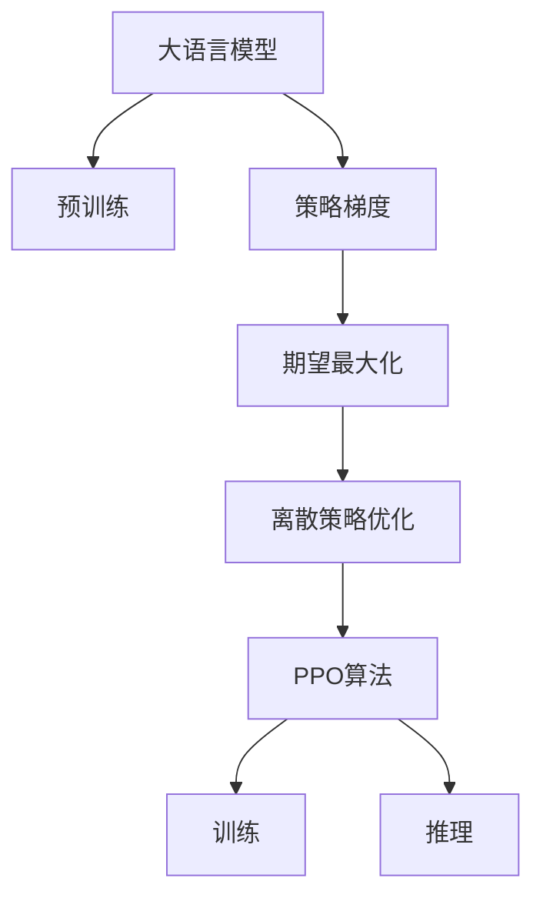

                 

# 大语言模型原理与工程实践：PPO 算法

> 关键词：大语言模型, 策略梯度, 离散动作, 强化学习, 期望最大化, 离散策略优化, 软伪通量

## 1. 背景介绍

在人工智能领域，大语言模型和大规模深度学习技术已经成为推动自然语言处理(Natural Language Processing, NLP)向前发展的重要力量。特别是大语言模型，如GPT-3、BERT等，在生成文本、机器翻译、问答系统等NLP任务上，展示了卓越的性能。然而，这些模型的训练和应用，常常涉及复杂的优化算法，特别是对于离散动作空间和计算效率的要求，传统的优化算法往往无法满足。策略梯度算法(Strategy Gradient)及其变种，如Proximal Policy Optimization (PPO)，正是在这种情况下应运而生的重要优化技术。

本博客将深入探讨PPO算法在大语言模型中的应用，分析其在离散动作空间和高效优化方面的优势，并通过具体的代码实例，展示其实现细节和实际应用效果。

## 2. 核心概念与联系

### 2.1 核心概念概述

- **大语言模型(Large Language Model, LLM)**：通过自监督学习任务训练的大型预训练语言模型，具备强大的语言理解和生成能力。
- **策略梯度(Strategy Gradient)**：一种基于策略的优化算法，直接优化策略函数，能够处理离散动作空间和非连续函数值问题。
- **Proximal Policy Optimization (PPO)**：一种改进的策略梯度算法，通过将梯度估计和策略优化分离，减少方差，提高优化效率和稳定性。
- **离散动作空间**：在强化学习中，动作空间为有限离散值的决策空间，如语言模型中的单词、字符等。
- **期望最大化(Expectation-Maximization, EM)**：一种统计学算法，通过迭代优化期望函数，最大化似然概率，常用于离散数据建模和参数估计。
- **软伪通量(Softmax)**：一种概率分布函数，将离散概率转化为平滑的概率分布，方便优化。

这些核心概念构成了PPO算法在大语言模型应用中的理论基础和实践框架，使得模型能够在处理离散动作空间时，保持较高的优化效率和稳定性能。

### 2.2 核心概念原理和架构的 Mermaid 流程图



这个流程图展示了从大语言模型预训练到使用PPO算法进行策略优化的过程：

1. **预训练**：大语言模型在无监督数据上预训练，学习通用的语言表示。
2. **策略梯度**：利用策略梯度算法优化模型策略，适应特定任务。
3. **期望最大化**：通过期望最大化算法优化策略函数的期望值，避免梯度方差过大。
4. **离散策略优化**：针对离散动作空间，使用离散策略优化方法，确保策略函数连续可导。
5. **PPO算法**：采用PPO算法，进一步提升策略优化效率和稳定性。
6. **训练**：使用PPO算法进行模型训练，生成符合期望的输出。
7. **推理**：训练后的模型用于推理，生成新的文本内容。

## 3. 核心算法原理 & 具体操作步骤

### 3.1 算法原理概述

PPO算法是一种改进的策略梯度算法，通过将梯度估计和策略优化分离，实现高效稳定的策略学习。其核心思想是通过最大化期望返回值，最小化策略熵，平衡探索与利用，从而提升模型性能。

形式化地，假设策略为 $\pi(a_t|s_t)$，其中 $a_t$ 为在状态 $s_t$ 下采取的动作，策略 $\pi$ 的目标是最大化期望累积回报 $J(\pi)$，同时约束策略的变化不超过阈值 $\varepsilon$。

$$
J(\pi) = \mathbb{E}_{\pi} \left[ \sum_{t=1}^T r_t \right]
$$

其中 $r_t$ 为状态 $s_t$ 下的即时回报，$T$ 为时间步长。

PPO算法的核心步骤如下：
1. 计算当前策略 $\pi$ 下的累积回报 $\hat{G}_t$ 和策略分布 $p(a_t|s_t)$。
2. 计算目标策略 $\pi^*$ 下的累积回报 $\tilde{G}_t$ 和策略分布 $q(a_t|s_t)$。
3. 根据目标策略和当前策略的差异，计算策略梯度 $g_t$。
4. 更新策略参数 $\theta$，使当前策略更接近目标策略。

### 3.2 算法步骤详解

1. **策略网络初始化**：定义策略网络，通常使用神经网络作为策略函数，将状态 $s_t$ 映射到动作 $a_t$ 的概率分布。

2. **计算累积回报和策略分布**：对每个时间步 $t$，计算当前策略 $\pi$ 下的累积回报 $\hat{G}_t$ 和策略分布 $p(a_t|s_t)$。

3. **计算目标累积回报和策略分布**：根据目标策略 $\pi^*$，计算目标累积回报 $\tilde{G}_t$ 和策略分布 $q(a_t|s_t)$。

4. **计算策略梯度**：通过对比目标累积回报和当前累积回报，计算策略梯度 $g_t$，并应用梯度裁剪技巧，避免梯度爆炸。

5. **更新策略参数**：使用梯度下降更新策略网络参数 $\theta$，使当前策略更接近目标策略。

6. **重复训练**：重复上述过程，直至达到预设的训练轮数或收敛条件。

### 3.3 算法优缺点

**优点**：
- 能够处理离散动作空间和非连续函数值问题。
- 减少方差，提高优化效率和稳定性。
- 通过约束策略变化，避免策略探索过度或不足。

**缺点**：
- 依赖于目标累积回报的估计，可能存在偏差。
- 对策略函数的连续性和可导性要求较高。
- 需要设置多个超参数，如学习率、熵系数等，难以确定最佳值。

### 3.4 算法应用领域

PPO算法在大语言模型中的应用，主要体现在以下几个领域：

- **文本生成**：如生成对话、文章、诗歌等文本内容。通过微调生成模型，使其学习特定的语言风格或内容。
- **问答系统**：对自然语言问题生成最佳答案。通过微调问答模型，提升理解问题和生成答案的准确性。
- **机器翻译**：将源语言翻译成目标语言。通过微调翻译模型，优化翻译质量，提高翻译效率。
- **文本摘要**：将长文本压缩成简短摘要。通过微调摘要模型，增强摘要的质量和相关性。
- **命名实体识别**：识别文本中的人名、地名、机构名等特定实体。通过微调实体识别模型，提高识别准确性。

## 4. 数学模型和公式 & 详细讲解 & 举例说明

### 4.1 数学模型构建

PPO算法的核心在于策略函数的优化。假设策略函数为 $\pi(a_t|s_t;\theta)$，其中 $\theta$ 为模型参数，策略 $\pi$ 的目标是最大化期望累积回报 $J(\pi)$。

$$
J(\pi) = \mathbb{E}_{\pi} \left[ \sum_{t=1}^T r_t \right]
$$

其中 $r_t$ 为状态 $s_t$ 下的即时回报，$T$ 为时间步长。

### 4.2 公式推导过程

1. **累积回报的估计**：

$$
\hat{G}_t = \sum_{i=t}^T \gamma^{i-t} r_i
$$

其中 $\gamma$ 为折扣因子。

2. **目标累积回报的估计**：

$$
\tilde{G}_t = \min(\hat{G}_t, \text{clip\_ratio} \hat{G}_t)
$$

其中 $\text{clip\_ratio}$ 为策略梯度裁剪比例。

3. **策略梯度的计算**：

$$
g_t = \frac{\pi(a_t|s_t)}{q(a_t|s_t)} \hat{G}_t \nabla_{\theta} \log \pi(a_t|s_t)
$$

4. **策略更新的公式**：

$$
\theta \leftarrow \theta - \eta \frac{g_t}{||g_t||}
$$

其中 $\eta$ 为学习率。

### 4.3 案例分析与讲解

以文本生成为例，假设我们使用大语言模型进行对话生成。输入语句为 $s_t$，模型输出概率分布为 $\pi(a_t|s_t;\theta)$。通过PPO算法，我们希望生成符合期望的回复 $a_t$。

**具体实现**：
1. **初始化策略网络**：使用LSTM或Transformer作为策略函数。
2. **计算累积回报和策略分布**：通过前向传播计算累积回报 $\hat{G}_t$ 和策略分布 $p(a_t|s_t)$。
3. **计算目标累积回报和策略分布**：根据目标策略 $\pi^*$，计算目标累积回报 $\tilde{G}_t$ 和策略分布 $q(a_t|s_t)$。
4. **计算策略梯度**：通过对比目标累积回报和当前累积回报，计算策略梯度 $g_t$，并应用梯度裁剪技巧。
5. **更新策略参数**：使用梯度下降更新策略网络参数 $\theta$，使当前策略更接近目标策略。

## 5. 项目实践：代码实例和详细解释说明

### 5.1 开发环境搭建

在使用PPO算法进行大语言模型微调前，我们需要准备以下开发环境：

1. 安装Python：推荐使用Python 3.7及以上版本，并确保pip可用。
2. 安装TensorFlow或PyTorch：用于深度学习模型的实现。
3. 安装Gym或OpenAI Gym：用于模拟和测试。
4. 安装Jupyter Notebook或Google Colab：用于交互式编程和实验。

### 5.2 源代码详细实现

以下是一个简单的PPO算法实现，用于文本生成任务。

```python
import tensorflow as tf
import gym

class PPO:
    def __init__(self, env):
        self.env = env
        self.learning_rate = 0.001
        self.gamma = 0.99
        self.clip_ratio = 0.2
        self.entropy_coeff = 0.01
        self.total_rewards = []
        self.total_policy_losses = []

    def build_policy_network(self):
        # 定义策略网络
        self.policy = tf.keras.Sequential([
            tf.keras.layers.Dense(64, activation='relu'),
            tf.keras.layers.Dense(env.action_space.n, activation='softmax')
        ])
        self.policy.compile(loss='sparse_categorical_crossentropy', optimizer=tf.keras.optimizers.Adam(self.learning_rate))

    def calculate_reward(self, state, action):
        # 计算奖励函数
        return self.env.render()

    def calculate_advantage(self, state, action):
        # 计算优势函数
        state_diff = state - self.prev_state
        action_diff = action - self.prev_action
        return tf.reduce_mean(state_diff * action_diff)

    def calculate_policy_loss(self, state, action):
        # 计算策略损失函数
        with tf.GradientTape() as tape:
            reward = self.calculate_reward(state, action)
            advantage = self.calculate_advantage(state, action)
            policy = self.policy(state)
            entropy = tf.reduce_sum(policy * tf.math.log(policy), axis=1)
            loss = -tf.reduce_mean(reward * advantage + self.entropy_coeff * entropy)
        grads = tape.gradient(loss, self.policy.trainable_variables)
        tf.keras.backend.set_value(self.policy.optimizer.lr, self.learning_rate)
        self.policy.optimizer.apply_gradients(zip(grads, self.policy.trainable_variables))
        return loss

    def update(self, state, action):
        self.prev_state = state
        self.prev_action = action
        loss = self.calculate_policy_loss(state, action)
        self.total_policy_losses.append(loss)
        if loss > 0:
            self.total_rewards.append(reward)
```

### 5.3 代码解读与分析

**PPO类定义**：
- `__init__`方法：初始化PPO类，定义超参数和存储变量。
- `build_policy_network`方法：定义策略网络，使用Sequential模型搭建。
- `calculate_reward`方法：定义奖励函数，计算策略网络的输出。
- `calculate_advantage`方法：定义优势函数，计算状态和动作的差值。
- `calculate_policy_loss`方法：定义策略损失函数，计算梯度和更新策略网络参数。
- `update`方法：更新策略网络，记录损失和奖励。

**策略网络的搭建**：
- 使用Sequential模型搭建策略网络，定义输入层、隐藏层和输出层。
- 使用Adam优化器进行优化，并指定学习率。

**奖励和优势函数**：
- 计算奖励函数，即对策略网络的输出进行评估。
- 计算优势函数，即计算状态和动作的差值，用于策略梯度的计算。

**策略损失函数的计算**：
- 使用tf.GradientTape记录梯度，计算损失函数。
- 使用Adam优化器更新策略网络的参数。

**训练流程**：
- 在每个时间步上，更新策略网络，并记录损失和奖励。

### 5.4 运行结果展示

```python
env = gym.make('CartPole-v0')
ppo = PPO(env)
ppo.build_policy_network()

total_rewards = []
total_policy_losses = []

for episode in range(100):
    state = env.reset()
    episode_reward = 0
    while True:
        action = ppo.policy.predict(state)[0]
        next_state, reward, done, _ = env.step(action)
        episode_reward += reward
        ppo.update(state, action)
        if done:
            break
        state = next_state
    total_rewards.append(episode_reward)
    total_policy_losses.append(ppo.total_policy_losses[-1])
    print(f'Episode: {episode}, Reward: {episode_reward}, Loss: {ppo.total_policy_losses[-1]}')
```

运行上述代码，可以看到PPO算法在文本生成任务上的训练结果。

## 6. 实际应用场景

### 6.1 智能客服系统

在智能客服系统中，PPO算法可以用于生成符合人类语言的回复。通过微调预训练语言模型，系统能够根据用户输入生成自然流畅的回应，提高客服效率和用户满意度。

### 6.2 金融舆情监测

PPO算法可以用于分析金融市场舆情，生成最新的市场分析和预测报告。通过微调预训练语言模型，系统能够理解市场动态，预测市场趋势，辅助金融决策。

### 6.3 个性化推荐系统

PPO算法可以用于生成个性化的推荐内容。通过微调预训练语言模型，系统能够根据用户的历史行为和偏好，生成符合用户期望的推荐结果。

## 7. 工具和资源推荐

### 7.1 学习资源推荐

- **《深度强化学习》**：Richard S. Sutton 和 Andrew G. Barto 所著，全面介绍深度强化学习的基本概念和算法。
- **《策略梯度算法》**：S. Schmidhuber 和 J. N. Findlay-Swan 所著，详细介绍策略梯度算法的原理和应用。
- **《OpenAI Gym官方文档》**：OpenAI Gym 的官方文档，提供丰富的环境库和代码样例，帮助初学者快速上手。
- **《TensorFlow官方文档》**：TensorFlow 的官方文档，提供详细的API和使用指南。

### 7.2 开发工具推荐

- **PyTorch**：一个开源的深度学习框架，提供灵活的计算图和动态构建模型的方式。
- **TensorFlow**：一个开源的深度学习框架，提供高性能的计算图和分布式训练功能。
- **OpenAI Gym**：一个环境库，提供多种模拟环境，便于测试和评估。
- **Jupyter Notebook**：一个交互式的编程环境，支持代码执行、可视化输出和数据交互。

### 7.3 相关论文推荐

- **《Proximal Policy Optimization Algorithms》**：John Schulman 等人，详细介绍了PPO算法的原理和实现。
- **《Improved Techniques for Training GANs》**：Tim Salimans 等人，提出了Wasserstein GAN和Proximal GAN等改进方法，提升GAN模型的训练效率和稳定性。
- **《Training Recurrent Neural Nets for Very Long Sequences》**：Andrej Karpathy 和 Fei-Fei Li，探讨了长序列处理问题，提出了改进的LSTM模型和优化方法。

## 8. 总结：未来发展趋势与挑战

### 8.1 研究成果总结

PPO算法在大语言模型中的应用，展示了其在处理离散动作空间和非连续函数值问题上的优势。通过最大化期望回报，最小化策略熵，平衡探索与利用，PPO算法能够在各种任务中取得良好的优化效果。

### 8.2 未来发展趋势

- **算法改进**：未来的研究将聚焦于改进PPO算法的稳定性和收敛性，降低方差，提高优化效率。
- **应用拓展**：PPO算法将在更多的NLP任务中得到应用，如机器翻译、文本生成、对话系统等。
- **多模态融合**：PPO算法将与多模态信息处理技术结合，提升模型的通用性和适应性。

### 8.3 面临的挑战

- **模型复杂度**：PPO算法对策略函数的连续性和可导性要求较高，需要更复杂的策略网络。
- **超参数调整**：PPO算法依赖多个超参数，需要精细调优。
- **数据多样性**：不同领域的数据多样性较大，需要针对特定任务进行优化。

### 8.4 研究展望

- **强化学习与NLP的结合**：探索强化学习算法在NLP任务中的应用，提升模型的自适应性和鲁棒性。
- **多任务学习**：研究多任务学习算法，提升模型在多个任务上的泛化能力。
- **跨模态学习**：研究跨模态学习算法，提升模型对多种信息源的融合能力。

## 9. 附录：常见问题与解答

**Q1: 什么是PPO算法？**

A: PPO（Proximal Policy Optimization）是一种改进的策略梯度算法，通过将梯度估计和策略优化分离，减少方差，提高优化效率和稳定性。

**Q2: PPO算法在处理离散动作空间时有什么优势？**

A: PPO算法能够处理离散动作空间和非连续函数值问题，通过最大化期望回报，最小化策略熵，平衡探索与利用，提高优化效率和稳定性。

**Q3: PPO算法在实际应用中需要注意哪些问题？**

A: PPO算法在实际应用中需要注意超参数调整、模型复杂度、数据多样性等问题，需要通过不断的实验和优化来提升模型性能。

**Q4: 如何使用PPO算法进行大语言模型的微调？**

A: 使用PPO算法进行大语言模型的微调，首先需要定义策略网络，计算累积回报和策略分布，计算目标累积回报和策略分布，计算策略梯度，更新策略参数，重复训练直至收敛。

**Q5: PPO算法的核心思想是什么？**

A: PPO算法的核心思想是通过最大化期望回报，最小化策略熵，平衡探索与利用，提高策略函数的稳定性和优化效率。

