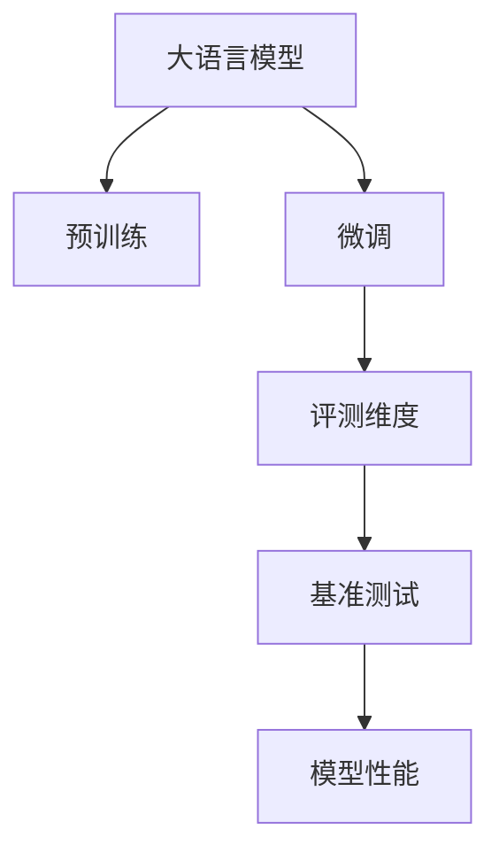

                 

# 大语言模型原理与工程实践：主要的评测维度和基准概述

> 关键词：大语言模型, 自然语言处理(NLP), 评测维度, 基准测试, 模型性能, 精度召回

## 1. 背景介绍

### 1.1 问题由来
随着深度学习技术的迅猛发展，大语言模型在自然语言处理（NLP）领域取得了显著的进步。大语言模型（如GPT、BERT、T5等）通过在大量无标签文本数据上进行预训练，学习到了丰富的语言知识和常识。然而，对于特定领域的任务，通用大模型可能无法直接应用于实际场景，需要通过微调（Fine-tuning）的方式进行任务适配。

为了评估和优化大语言模型在微调后的性能，各种评测维度和基准测试应运而生。这些评测维度和基准测试不仅帮助研究者客观评估模型的性能，也为模型开发提供了方向性的指导。

### 1.2 问题核心关键点
在微调大语言模型的过程中，如何评估模型的性能成为重要问题。主要包括以下几个方面：

- 如何定义评测指标？
- 如何设计基准测试？
- 如何比较不同模型的性能？
- 如何优化模型以提高性能？

本文将从这三个关键点出发，详细介绍大语言模型的评测维度和基准测试，并探讨如何通过这些指标指导模型优化，实现更高效、更精准的微调过程。

## 2. 核心概念与联系

### 2.1 核心概念概述

为更好地理解评测维度和基准测试的原理，本节将介绍几个核心概念：

- **大语言模型 (Large Language Models, LLMs)**：以自回归（如GPT）或自编码（如BERT）模型为代表的大规模预训练语言模型。通过在大规模无标签文本语料上进行预训练，学习到通用的语言表示。

- **微调 (Fine-tuning)**：将预训练语言模型作为初始化参数，通过有监督学习优化模型在特定任务上的性能。通常只需要调整顶层分类器或解码器，并以较小的学习率更新全部或部分模型参数。

- **评测维度 (Evaluation Metrics)**：用于衡量模型性能的指标，如精度（Accuracy）、召回率（Recall）、F1分数（F1 Score）等。这些指标帮助评估模型在不同任务上的表现。

- **基准测试 (Benchmark Testing)**：以标准化的数据集和评测流程为基础，对模型进行性能测试。基准测试确保模型评测的公正性和可重复性。

- **模型性能 (Model Performance)**：模型在特定任务上的表现，通常由评测维度综合评估。

### 2.2 核心概念原理和架构的 Mermaid 流程图



这个流程图展示了大语言模型从预训练到微调，再到评测和性能评估的完整流程。每个环节通过核心概念间的联系，构成了模型开发的全链条。

## 3. 核心算法原理 & 具体操作步骤

### 3.1 算法原理概述

评测维度和基准测试是大语言模型性能评估的核心工具。其核心思想是通过对模型在特定任务上的表现进行量化，评估模型的效果，进而指导模型的优化。

评测维度通常分为三类：

- **准确率（Accuracy）**：指模型正确预测的样本数占总样本数的比例。适用于分类任务，如文本分类、情感分析等。

- **召回率（Recall）**：指模型正确识别出的正样本数占实际正样本数的比例。适用于标注数据较少的情况，如命名实体识别、信息抽取等。

- **F1分数（F1 Score）**：综合了准确率和召回率，是一个综合性指标。适用于需要平衡准确率和召回率的场景，如问答系统、机器翻译等。

基准测试则是将这些评测维度应用于具体的任务上，通过标准化的数据集和评测流程，对模型进行性能测试。基准测试帮助研究者比较不同模型的表现，了解模型在实际应用中的效果。

### 3.2 算法步骤详解

基于评测维度和基准测试的大语言模型性能评估一般包括以下几个关键步骤：

**Step 1: 选择合适的评测维度和基准测试**
- 根据任务类型，选择相应的评测维度（如准确率、召回率、F1分数等）。
- 选择或设计适合的基准测试数据集（如GLUE、CoNLL、WMT等），确保数据集的公平性和代表性。

**Step 2: 设计模型优化策略**
- 根据评测维度的要求，设计模型优化策略。例如，对于分类任务，可以调整分类器的参数，使用集成学习等方法提高准确率。
- 应用正则化技术，如L2正则、Dropout等，防止过拟合。

**Step 3: 执行基准测试**
- 在标准化的评测流程下，对模型进行性能测试，记录各项评测指标。
- 使用评估结果指导模型优化，如调整模型参数、改变数据增强策略等。

**Step 4: 模型迭代优化**
- 根据评估结果，迭代优化模型，直到各项指标达到最优。

### 3.3 算法优缺点

基于评测维度和基准测试的评估方法具有以下优点：

- 客观公正：通过标准化的数据集和评测流程，确保模型性能的客观性。
- 可重复性：基准测试的重复性确保了结果的可信度。
- 指导性强：评测维度和基准测试为模型优化提供了明确的方向。

同时，该方法也存在一些局限性：

- 依赖数据：基准测试依赖于高质量的数据集，数据集的构建和维护成本较高。
- 任务相关：评测维度和基准测试针对特定任务，难以全面评估模型的通用性能。
- 计算资源：基准测试可能耗费大量计算资源，不适合快速迭代和原型验证。

尽管存在这些局限性，但基于评测维度和基准测试的评估方法仍是大语言模型开发中不可或缺的工具。

### 3.4 算法应用领域

基于评测维度和基准测试的方法，在NLP领域已广泛应用于各种任务，例如：

- 文本分类：如情感分析、主题分类、意图识别等。通过基准测试评估模型在分类任务上的表现。
- 命名实体识别：识别文本中的人名、地名、机构名等特定实体。通过基准测试评估模型对实体的识别准确率和召回率。
- 关系抽取：从文本中抽取实体之间的语义关系。通过基准测试评估模型的关系抽取精度和召回率。
- 问答系统：对自然语言问题给出答案。通过基准测试评估模型的回答准确率和用户满意度。
- 机器翻译：将源语言文本翻译成目标语言。通过基准测试评估模型的翻译质量。
- 文本摘要：将长文本压缩成简短摘要。通过基准测试评估摘要的准确性和相关性。

除了上述这些经典任务外，大语言模型微调方法也被创新性地应用到更多场景中，如可控文本生成、常识推理、代码生成、数据增强等，为NLP技术带来了全新的突破。

## 4. 数学模型和公式 & 详细讲解 & 举例说明

### 4.1 数学模型构建

以文本分类任务为例，假设模型在测试集上的预测结果为 $\hat{y}$，真实标签为 $y$，模型在每个样本上的损失函数为 $\ell(\hat{y},y)$，模型在测试集上的总损失函数为 $\mathcal{L}$，则：

$$
\mathcal{L} = \frac{1}{N} \sum_{i=1}^N \ell(\hat{y_i},y_i)
$$

其中，$N$ 为测试集样本数，$\ell(\hat{y_i},y_i)$ 为第 $i$ 个样本的损失函数。

### 4.2 公式推导过程

以二分类任务为例，假设模型在每个样本上的损失函数为交叉熵损失：

$$
\ell(\hat{y},y) = -y\log(\hat{y}) - (1-y)\log(1-\hat{y})
$$

则总损失函数为：

$$
\mathcal{L} = -\frac{1}{N} \sum_{i=1}^N [y_i\log(\hat{y_i})+(1-y_i)\log(1-\hat{y_i})]
$$

### 4.3 案例分析与讲解

在文本分类任务中，假设模型在训练集上进行了微调，得到最优参数 $\theta^*$，则在测试集上的预测结果为：

$$
\hat{y} = \sigma(\mathbf{W}x + b)
$$

其中，$\sigma$ 为激活函数，$\mathbf{W}$ 和 $b$ 为模型参数，$x$ 为输入向量。

假设模型在测试集上的损失函数为交叉熵损失：

$$
\ell(\hat{y},y) = -y\log(\hat{y}) - (1-y)\log(1-\hat{y})
$$

则模型在测试集上的总损失函数为：

$$
\mathcal{L} = -\frac{1}{N} \sum_{i=1}^N [y_i\log(\sigma(\mathbf{W}x_i + b))+(1-y_i)\log(1-\sigma(\mathbf{W}x_i + b))]
$$

通过最小化总损失函数，可以优化模型参数 $\theta^*$，使得模型在测试集上的表现最佳。

## 5. 项目实践：代码实例和详细解释说明

### 5.1 开发环境搭建

在进行模型评测和优化前，我们需要准备好开发环境。以下是使用Python进行PyTorch开发的环境配置流程：

1. 安装Anaconda：从官网下载并安装Anaconda，用于创建独立的Python环境。

2. 创建并激活虚拟环境：
```bash
conda create -n pytorch-env python=3.8 
conda activate pytorch-env
```

3. 安装PyTorch：根据CUDA版本，从官网获取对应的安装命令。例如：
```bash
conda install pytorch torchvision torchaudio cudatoolkit=11.1 -c pytorch -c conda-forge
```

4. 安装Transformers库：
```bash
pip install transformers
```

5. 安装各类工具包：
```bash
pip install numpy pandas scikit-learn matplotlib tqdm jupyter notebook ipython
```

完成上述步骤后，即可在`pytorch-env`环境中开始模型评测和优化的实践。

### 5.2 源代码详细实现

我们使用BERT模型进行文本分类任务的评测和优化。代码如下：

```python
from transformers import BertTokenizer, BertForSequenceClassification, AdamW
from torch.utils.data import Dataset, DataLoader
from sklearn.metrics import accuracy_score, recall_score, f1_score

class TextDataset(Dataset):
    def __init__(self, texts, labels, tokenizer):
        self.texts = texts
        self.labels = labels
        self.tokenizer = tokenizer
        
    def __len__(self):
        return len(self.texts)
    
    def __getitem__(self, item):
        text = self.texts[item]
        label = self.labels[item]
        
        encoding = self.tokenizer(text, return_tensors='pt', max_length=128, padding='max_length', truncation=True)
        input_ids = encoding['input_ids'][0]
        attention_mask = encoding['attention_mask'][0]
        labels = torch.tensor(label, dtype=torch.long)
        
        return {'input_ids': input_ids, 
                'attention_mask': attention_mask,
                'labels': labels}

tokenizer = BertTokenizer.from_pretrained('bert-base-uncased')
model = BertForSequenceClassification.from_pretrained('bert-base-uncased', num_labels=2)

optimizer = AdamW(model.parameters(), lr=2e-5)

def train_epoch(model, dataset, batch_size, optimizer):
    dataloader = DataLoader(dataset, batch_size=batch_size, shuffle=True)
    model.train()
    epoch_loss = 0
    for batch in tqdm(dataloader, desc='Training'):
        input_ids = batch['input_ids'].to(device)
        attention_mask = batch['attention_mask'].to(device)
        labels = batch['labels'].to(device)
        model.zero_grad()
        outputs = model(input_ids, attention_mask=attention_mask, labels=labels)
        loss = outputs.loss
        epoch_loss += loss.item()
        loss.backward()
        optimizer.step()
    return epoch_loss / len(dataloader)

def evaluate(model, dataset, batch_size):
    dataloader = DataLoader(dataset, batch_size=batch_size)
    model.eval()
    preds, labels = [], []
    with torch.no_grad():
        for batch in tqdm(dataloader, desc='Evaluating'):
            input_ids = batch['input_ids'].to(device)
            attention_mask = batch['attention_mask'].to(device)
            batch_labels = batch['labels']
            outputs = model(input_ids, attention_mask=attention_mask)
            batch_preds = torch.argmax(outputs.logits, dim=1).to('cpu').tolist()
            batch_labels = batch_labels.to('cpu').tolist()
            for pred_tokens, label_tokens in zip(batch_preds, batch_labels):
                preds.append(pred_tokens)
                labels.append(label_tokens)
                
    accuracy = accuracy_score(labels, preds)
    recall = recall_score(labels, preds, average='macro')
    f1 = f1_score(labels, preds, average='macro')
    print(f'Accuracy: {accuracy:.2f}, Recall: {recall:.2f}, F1 Score: {f1:.2f}')

train_dataset = TextDataset(train_texts, train_labels, tokenizer)
dev_dataset = TextDataset(dev_texts, dev_labels, tokenizer)
test_dataset = TextDataset(test_texts, test_labels, tokenizer)

epochs = 5
batch_size = 16

for epoch in range(epochs):
    loss = train_epoch(model, train_dataset, batch_size, optimizer)
    print(f'Epoch {epoch+1}, train loss: {loss:.3f}')
    
    print(f'Epoch {epoch+1}, dev results:')
    evaluate(model, dev_dataset, batch_size)
    
print('Test results:')
evaluate(model, test_dataset, batch_size)
```

### 5.3 代码解读与分析

**TextDataset类**：
- `__init__`方法：初始化文本、标签、分词器等关键组件。
- `__len__`方法：返回数据集的样本数量。
- `__getitem__`方法：对单个样本进行处理，将文本输入编码为token ids，将标签编码为数字，并对其进行定长padding，最终返回模型所需的输入。

**训练和评估函数**：
- 使用PyTorch的DataLoader对数据集进行批次化加载，供模型训练和推理使用。
- 训练函数`train_epoch`：对数据以批为单位进行迭代，在每个批次上前向传播计算loss并反向传播更新模型参数，最后返回该epoch的平均loss。
- 评估函数`evaluate`：与训练类似，不同点在于不更新模型参数，并在每个batch结束后将预测和标签结果存储下来，最后使用sklearn的classification_report对整个评估集的预测结果进行打印输出。

**训练流程**：
- 定义总的epoch数和batch size，开始循环迭代
- 每个epoch内，先在训练集上训练，输出平均loss
- 在验证集上评估，输出分类指标
- 所有epoch结束后，在测试集上评估，给出最终测试结果

可以看到，PyTorch配合Transformers库使得模型评测和优化的代码实现变得简洁高效。开发者可以将更多精力放在数据处理、模型改进等高层逻辑上，而不必过多关注底层的实现细节。

## 6. 实际应用场景

### 6.1 智能客服系统

基于大语言模型微调的对话技术，可以广泛应用于智能客服系统的构建。传统客服往往需要配备大量人力，高峰期响应缓慢，且一致性和专业性难以保证。而使用微调后的对话模型，可以7x24小时不间断服务，快速响应客户咨询，用自然流畅的语言解答各类常见问题。

在技术实现上，可以收集企业内部的历史客服对话记录，将问题和最佳答复构建成监督数据，在此基础上对预训练对话模型进行微调。微调后的对话模型能够自动理解用户意图，匹配最合适的答案模板进行回复。对于客户提出的新问题，还可以接入检索系统实时搜索相关内容，动态组织生成回答。如此构建的智能客服系统，能大幅提升客户咨询体验和问题解决效率。

### 6.2 金融舆情监测

金融机构需要实时监测市场舆论动向，以便及时应对负面信息传播，规避金融风险。传统的人工监测方式成本高、效率低，难以应对网络时代海量信息爆发的挑战。基于大语言模型微调的文本分类和情感分析技术，为金融舆情监测提供了新的解决方案。

具体而言，可以收集金融领域相关的新闻、报道、评论等文本数据，并对其进行主题标注和情感标注。在此基础上对预训练语言模型进行微调，使其能够自动判断文本属于何种主题，情感倾向是正面、中性还是负面。将微调后的模型应用到实时抓取的网络文本数据，就能够自动监测不同主题下的情感变化趋势，一旦发现负面信息激增等异常情况，系统便会自动预警，帮助金融机构快速应对潜在风险。

### 6.3 个性化推荐系统

当前的推荐系统往往只依赖用户的历史行为数据进行物品推荐，无法深入理解用户的真实兴趣偏好。基于大语言模型微调技术，个性化推荐系统可以更好地挖掘用户行为背后的语义信息，从而提供更精准、多样的推荐内容。

在实践中，可以收集用户浏览、点击、评论、分享等行为数据，提取和用户交互的物品标题、描述、标签等文本内容。将文本内容作为模型输入，用户的后续行为（如是否点击、购买等）作为监督信号，在此基础上微调预训练语言模型。微调后的模型能够从文本内容中准确把握用户的兴趣点。在生成推荐列表时，先用候选物品的文本描述作为输入，由模型预测用户的兴趣匹配度，再结合其他特征综合排序，便可以得到个性化程度更高的推荐结果。

### 6.4 未来应用展望

随着大语言模型和微调方法的不断发展，基于微调范式将在更多领域得到应用，为传统行业带来变革性影响。

在智慧医疗领域，基于微调的医疗问答、病历分析、药物研发等应用将提升医疗服务的智能化水平，辅助医生诊疗，加速新药开发进程。

在智能教育领域，微调技术可应用于作业批改、学情分析、知识推荐等方面，因材施教，促进教育公平，提高教学质量。

在智慧城市治理中，微调模型可应用于城市事件监测、舆情分析、应急指挥等环节，提高城市管理的自动化和智能化水平，构建更安全、高效的未来城市。

此外，在企业生产、社会治理、文娱传媒等众多领域，基于大模型微调的人工智能应用也将不断涌现，为NLP技术带来了全新的突破。相信随着预训练语言模型和微调方法的持续演进，大语言模型微调必将在构建人机协同的智能时代中扮演越来越重要的角色。

## 7. 工具和资源推荐

### 7.1 学习资源推荐

为了帮助开发者系统掌握大语言模型微调的理论基础和实践技巧，这里推荐一些优质的学习资源：

1. 《Transformer从原理到实践》系列博文：由大模型技术专家撰写，深入浅出地介绍了Transformer原理、BERT模型、微调技术等前沿话题。

2. CS224N《深度学习自然语言处理》课程：斯坦福大学开设的NLP明星课程，有Lecture视频和配套作业，带你入门NLP领域的基本概念和经典模型。

3. 《Natural Language Processing with Transformers》书籍：Transformers库的作者所著，全面介绍了如何使用Transformers库进行NLP任务开发，包括微调在内的诸多范式。

4. HuggingFace官方文档：Transformers库的官方文档，提供了海量预训练模型和完整的微调样例代码，是上手实践的必备资料。

5. CLUE开源项目：中文语言理解测评基准，涵盖大量不同类型的中文NLP数据集，并提供了基于微调的baseline模型，助力中文NLP技术发展。

通过对这些资源的学习实践，相信你一定能够快速掌握大语言模型微调的精髓，并用于解决实际的NLP问题。

### 7.2 开发工具推荐

高效的开发离不开优秀的工具支持。以下是几款用于大语言模型微调开发的常用工具：

1. PyTorch：基于Python的开源深度学习框架，灵活动态的计算图，适合快速迭代研究。大部分预训练语言模型都有PyTorch版本的实现。

2. TensorFlow：由Google主导开发的开源深度学习框架，生产部署方便，适合大规模工程应用。同样有丰富的预训练语言模型资源。

3. Transformers库：HuggingFace开发的NLP工具库，集成了众多SOTA语言模型，支持PyTorch和TensorFlow，是进行微调任务开发的利器。

4. Weights & Biases：模型训练的实验跟踪工具，可以记录和可视化模型训练过程中的各项指标，方便对比和调优。与主流深度学习框架无缝集成。

5. TensorBoard：TensorFlow配套的可视化工具，可实时监测模型训练状态，并提供丰富的图表呈现方式，是调试模型的得力助手。

6. Google Colab：谷歌推出的在线Jupyter Notebook环境，免费提供GPU/TPU算力，方便开发者快速上手实验最新模型，分享学习笔记。

合理利用这些工具，可以显著提升大语言模型微调任务的开发效率，加快创新迭代的步伐。

### 7.3 相关论文推荐

大语言模型和微调技术的发展源于学界的持续研究。以下是几篇奠基性的相关论文，推荐阅读：

1. Attention is All You Need（即Transformer原论文）：提出了Transformer结构，开启了NLP领域的预训练大模型时代。

2. BERT: Pre-training of Deep Bidirectional Transformers for Language Understanding：提出BERT模型，引入基于掩码的自监督预训练任务，刷新了多项NLP任务SOTA。

3. Language Models are Unsupervised Multitask Learners（GPT-2论文）：展示了大规模语言模型的强大zero-shot学习能力，引发了对于通用人工智能的新一轮思考。

4. Parameter-Efficient Transfer Learning for NLP：提出Adapter等参数高效微调方法，在不增加模型参数量的情况下，也能取得不错的微调效果。

5. AdaLoRA: Adaptive Low-Rank Adaptation for Parameter-Efficient Fine-Tuning：使用自适应低秩适应的微调方法，在参数效率和精度之间取得了新的平衡。

6. Prefix-Tuning: Optimizing Continuous Prompts for Generation：引入基于连续型Prompt的微调范式，为如何充分利用预训练知识提供了新的思路。

这些论文代表了大语言模型微调技术的发展脉络。通过学习这些前沿成果，可以帮助研究者把握学科前进方向，激发更多的创新灵感。

## 8. 总结：未来发展趋势与挑战

### 8.1 总结

本文对基于评测维度和基准测试的大语言模型性能评估方法进行了全面系统的介绍。首先阐述了评测维度和基准测试的研究背景和意义，明确了评测维度和基准测试在模型开发和优化中的重要地位。其次，从原理到实践，详细讲解了评测维度和基准测试的数学模型和计算方法，给出了微调任务开发的完整代码实例。同时，本文还广泛探讨了评测维度和基准测试在智能客服、金融舆情、个性化推荐等多个行业领域的应用前景，展示了评测范式的巨大潜力。此外，本文精选了评测维度和基准测试的学习资源、开发工具和相关论文，力求为读者提供全方位的技术指引。

通过本文的系统梳理，可以看到，基于评测维度和基准测试的评估方法正在成为NLP领域的重要范式，极大地拓展了预训练语言模型的应用边界，催生了更多的落地场景。受益于评测维度和基准测试的科学指导，大语言模型微调技术正逐步走向成熟，为构建安全、可靠、可解释、可控的智能系统铺平道路。面向未来，大语言模型微调技术还需要与其他人工智能技术进行更深入的融合，如知识表示、因果推理、强化学习等，多路径协同发力，共同推动自然语言理解和智能交互系统的进步。

### 8.2 未来发展趋势

展望未来，大语言模型微调技术将呈现以下几个发展趋势：

1. 评估维度和基准测试的多样化：未来的评估范式将更加多样化，除了传统的准确率、召回率和F1分数，还会引入更多能够反映模型泛化能力和鲁棒性的指标。

2. 模型评估和优化的自动化：利用自动机器学习(AutoML)等技术，自动搜索最优的模型参数和评测指标，提升模型评估和优化的效率。

3. 跨领域和多模态评估：未来的评估范式将不仅关注单个任务的表现，还会考虑模型的跨领域泛化能力。同时，多模态数据融合技术也将成为热门研究方向。

4. 实时评估和监控：实时数据流和动态环境下的模型评估和监控将是未来的一个重要研究方向，帮助及时发现和修复模型故障。

5. 伦理和安全评估：在模型开发过程中，伦理和安全性评估将越来越受到重视，确保模型输出符合社会价值观和法律法规。

以上趋势凸显了大语言模型微调技术的广阔前景。这些方向的探索发展，必将进一步提升模型评估的科学性和实用性，为模型优化提供更全面的指导。

### 8.3 面临的挑战

尽管大语言模型微调技术已经取得了瞩目成就，但在迈向更加智能化、普适化应用的过程中，它仍面临着诸多挑战：

1. 评估维度的选择：选择哪些评估维度来全面、准确地反映模型性能，是评估过程中的一个关键问题。不同任务和应用场景可能需要不同的评估维度。

2. 基准测试的构建：构建高质素、公平、可重复的基准测试数据集和评测流程，需要大量的时间和资源投入。

3. 模型的解释性和可解释性：如何解释模型输出，确保模型决策的透明度和可信度，是当前研究的重要方向。

4. 模型的公平性和偏见：如何避免模型在训练过程中学习到有偏见的信息，并确保模型的公平性和无偏见性，是模型开发过程中需要持续关注的问题。

5. 模型的泛化和鲁棒性：如何提高模型在不同数据分布和环境下的泛化能力和鲁棒性，避免模型在特定情况下的失效。

6. 模型的可维护性和可扩展性：随着模型的不断更新和迭代，如何保证模型的可维护性和可扩展性，避免复杂的模型结构带来的维护难度。

这些挑战需要在未来研究中进一步探索和解决，以推动大语言模型微调技术向更加高效、安全和可解释的方向发展。

### 8.4 研究展望

面对大语言模型微调所面临的种种挑战，未来的研究需要在以下几个方面寻求新的突破：

1. 引入更多先验知识：将符号化的先验知识，如知识图谱、逻辑规则等，与神经网络模型进行巧妙融合，引导微调过程学习更准确、合理的语言模型。

2. 融合因果分析和博弈论工具：将因果分析方法引入微调模型，识别出模型决策的关键特征，增强输出解释的因果性和逻辑性。借助博弈论工具刻画人机交互过程，主动探索并规避模型的脆弱点，提高系统稳定性。

3. 纳入伦理道德约束：在模型训练目标中引入伦理导向的评估指标，过滤和惩罚有偏见、有害的输出倾向。同时加强人工干预和审核，建立模型行为的监管机制，确保输出符合人类价值观和伦理道德。

4. 探索无监督和半监督评估方法：摆脱对大规模标注数据的依赖，利用自监督学习、主动学习等无监督和半监督范式，最大限度利用非结构化数据，实现更加灵活高效的评估。

5. 研究参数高效和计算高效的评估范式：开发更加参数高效的评估方法，在固定大部分模型参数的同时，只更新极少量的任务相关参数。同时优化评估模型的计算图，减少前向传播和反向传播的资源消耗，实现更加轻量级、实时性的评估。

这些研究方向将推动大语言模型微调技术迈向更高层次的智能和可靠性，为构建安全、可靠、可解释、可控的智能系统铺平道路。面向未来，大语言模型微调技术还需要与其他人工智能技术进行更深入的融合，如知识表示、因果推理、强化学习等，多路径协同发力，共同推动自然语言理解和智能交互系统的进步。只有勇于创新、敢于突破，才能不断拓展语言模型的边界，让智能技术更好地造福人类社会。

## 9. 附录：常见问题与解答

**Q1：大语言模型微调如何评估模型性能？**

A: 大语言模型微调的性能评估通常使用以下几个评测维度：
1. 准确率（Accuracy）：模型正确预测的样本数占总样本数的比例。
2. 召回率（Recall）：模型正确识别出的正样本数占实际正样本数的比例。
3. F1分数（F1 Score）：综合了准确率和召回率，是一个综合性指标。

通过计算这些指标，可以全面评估模型在不同任务上的表现。

**Q2：如何选择适合大语言模型微调评估的基准测试？**

A: 选择基准测试时需要考虑以下几个因素：
1. 数据集的代表性：选择与具体任务相关的、高质量、标注详细的基准测试数据集。
2. 数据集的多样性：选择包含多种类型数据、不同难度的基准测试数据集，确保模型在不同场景下的泛化能力。
3. 数据集的更新性：选择较新近发布的基准测试数据集，反映当前领域的研究前沿和实际应用需求。

常见的基准测试数据集包括GLUE、CoNLL、WMT等，可以根据自己的任务需求进行选择。

**Q3：如何优化大语言模型微调后的性能？**

A: 优化模型性能的方法包括：
1. 调整模型参数：根据评测维度的要求，调整模型参数以提高性能。例如，对于分类任务，可以调整分类器的参数，使用集成学习等方法提高准确率。
2. 应用正则化技术：使用L2正则、Dropout等方法防止过拟合。
3. 数据增强：通过回译、近义替换等方式扩充训练集，增加模型鲁棒性。
4. 对抗训练：引入对抗样本，提高模型鲁棒性。
5. 模型融合：使用模型融合技术，综合多个模型的预测结果，提高性能。

这些方法需要根据具体任务和数据特点进行灵活组合，以达到最佳的性能提升效果。

**Q4：大语言模型微调在实际应用中需要注意哪些问题？**

A: 在实际应用中，大语言模型微调需要注意以下几个问题：
1. 模型裁剪：去除不必要的层和参数，减小模型尺寸，加快推理速度。
2. 量化加速：将浮点模型转为定点模型，压缩存储空间，提高计算效率。
3. 服务化封装：将模型封装为标准化服务接口，便于集成调用。
4. 弹性伸缩：根据请求流量动态调整资源配置，平衡服务质量和成本。
5. 监控告警：实时采集系统指标，设置异常告警阈值，确保服务稳定性。

合理利用这些技术，可以确保大语言模型微调在实际应用中的稳定性和高效性。

---

作者：禅与计算机程序设计艺术 / Zen and the Art of Computer Programming

